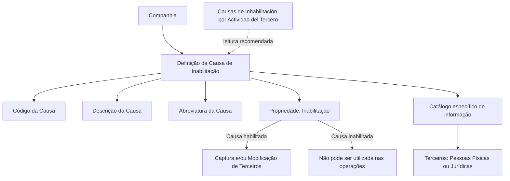

# Definição das Causas de Inabilitação de Terceiros no Sistema Reef

## 1. Metadados do Documento
- **Arquivo de Origem:** Não informado no conteúdo extraído
- **Tipo de Documento:** Especificação Funcional
- **Domínio / Sistema:** Reef / Mapfre — cadastro e inabilitação de Terceiros
- **Público-Alvo:** Operação, Analistas Funcionais e equipes responsáveis pela captura e modificação de Terceiros
- **Data/Versão Identificada:** Não identificada
- **Owner Identificado:** `user:agonzalez_mapfre.com`
- **Lifecycle Identificado:** `Approved Source`

---

## 2. Resumo Executivo & Contexto de Negócio

O documento descreve a definição das **Causas de Inabilitação de Terceiros** no núcleo do Sistema Reef. O sistema permite identificar e codificar motivos operacionais que podem provocar a baixa ou a inabilitação de Terceiros, abrangendo pessoas físicas e pessoas jurídicas.

As causas de inabilitação são mantidas em um catálogo de informação específico, entregue às entidades sem conteúdo. A configuração de cada causa inclui a companhia de referência, o código do motivo, a descrição, a abreviatura e o estado de inabilitação da própria causa.

O catálogo possibilita registrar motivos como inabilitação temporária, inabilitação perpétua, falta de pagamento e conduta fraudulenta. Os exemplos apresentados têm finalidade ilustrativa e não constituem uma padronização corporativa obrigatória de códigos.

O documento determina que uma causa marcada como inabilitada não pode ser utilizada nas operações de captura e/ou modificação de Terceiros. Também referencia o documento funcional relacionado **“Causas de Inhabilitación por Actividad del Tercero”**, cuja leitura é recomendada para evitar interpretações isoladas incorretas.

Não existe preferência ou recomendação corporativa para estabelecer ou padronizar a codificação das causas de inabilitação no sistema. Assim, a codificação deve ser definida sem assumir uma convenção corporativa apresentada neste documento.

---

## 3. Arquitetura, Componentes & Tecnologias Envolvidas

O conteúdo identifica os seguintes elementos funcionais:

- **Sistema Reef:** sistema no qual são definidas e utilizadas as causas de inabilitação de Terceiros.
- **Núcleo do Sistema:** componente funcional com capacidade de identificar e codificar motivos de baixa ou inabilitação.
- **Catálogo de Causas de Inabilitação:** repositório específico de informação para os motivos configurados.
- **Terceiros:** entidades que podem ser pessoas físicas ou jurídicas.
- **Operações de captura e modificação de Terceiros:** operações que podem usar uma causa de inabilitação, desde que a causa esteja habilitada.
- **Companhia:** contexto organizacional cujo código é associado à definição do motivo.
- **Documento relacionado:** “Causas de Inhabilitación por Actividad del Tercero”.



> **Nota de Análise:** O documento não detalha arquitetura técnica, integrações, APIs, bancos de dados, métodos HTTP, contratos JSON, tecnologias de infraestrutura ou ambientes de execução do Sistema Reef.

---

## 4. Regras de Negócio, Especificações Funcionais & Processos

### 4.1 Objetivo funcional do catálogo

1. O núcleo do Sistema Reef deve permitir identificar diferentes motivos operacionais.
2. Os motivos operacionais identificados podem provocar a baixa ou a inabilitação de Terceiros.
3. Os Terceiros abrangidos podem ser pessoas físicas ou pessoas jurídicas.
4. Os motivos devem ser codificados no sistema.
5. As causas devem ser registradas em um catálogo de informação específico.
6. O catálogo é entregue às entidades sem conteúdo.

### 4.2 Definição de uma causa de inabilitação

Cada causa de inabilitação possui as seguintes propriedades funcionais:

1. **Companhia**
   - Indica o código da companhia sobre a qual está sendo realizada a definição do motivo de inabilitação do Terceiro.

2. **Código da Causa de Inabilitação**
   - Indica o código do motivo de inabilitação do Terceiro no sistema.

3. **Descrição da Causa de Inabilitação**
   - Indica a denominação ou descrição da causa de inabilitação do Terceiro.

4. **Abreviatura da Causa de Inabilitação**
   - Indica a denominação ou descrição abreviada do motivo de inabilitação que está sendo capturado no sistema.

5. **Inabilitação**
   - Indica ao sistema se o motivo de baixa está inabilitado para utilização nas operações de captura e/ou modificação do Terceiro.

### 4.3 Restrição de uso da causa

- Quando a propriedade **Inhabilitación** indicar que um motivo está inabilitado, esse motivo não pode ser utilizado nas operações de captura e/ou modificação do Terceiro.
- O documento não informa os valores técnicos, formato de armazenamento ou convenção de representação da propriedade **Inhabilitación**.

### 4.4 Codificação das causas

- Não existe preferência corporativa para a codificação das causas de inabilitação.
- Não existe recomendação corporativa para estabelecer ou padronizar a codificação das causas de inabilitação no sistema.
- Os códigos fornecidos no documento são exemplos e não devem ser interpretados como um padrão corporativo obrigatório.

### 4.5 Dependência documental

- A leitura de diretrizes e documentos funcionais relacionados é recomendada.
- A finalidade da leitura complementar é impedir que uma interpretação isolada deste documento conduza a erro.
- O documento relacionado explicitamente citado é: **Causas de Inhabilitación por Actividad del Tercero**.

---

## 5. Tabelas de Parâmetros, Ambientes e Estruturas de Dados

### 5.1 Estrutura funcional da causa de inabilitação

| Item / Parâmetro | Descrição / Função | Tipo / Valores / Formato | Ambiente / Observações |
| :--- | :--- | :--- | :--- |
| Companhia | Indica o código da companhia sobre a qual ocorre a definição do motivo de inabilitação do Terceiro. | Código de companhia; formato não informado. | Aplicável à definição da causa no Sistema Reef. |
| Código da Causa de Inabilitação | Identifica o código do motivo de inabilitação do Terceiro no sistema. | Código; formato não informado. | Não existe padronização corporativa indicada para a codificação. |
| Descrição da Causa de Inabilitação | Registra a denominação ou descrição da causa de inabilitação do Terceiro. | Texto; formato não informado. | Representa o significado funcional do motivo. |
| Abreviatura da Causa de Inabilitação | Registra a denominação ou descrição abreviada do motivo de inabilitação. | Texto abreviado; formato não informado. | Utilizada durante a captura no sistema. |
| Inabilitação | Indica se o motivo de baixa está inabilitado para uso. | Valor não informado. | Quando inabilitado, o motivo não pode ser usado na captura e/ou modificação do Terceiro. |
| Terceiro | Entidade sujeita à baixa ou inabilitação por um motivo catalogado. | Pessoa física ou pessoa jurídica. | Escopo funcional do catálogo. |
| Catálogo de informação | Catálogo específico onde os motivos são identificados e codificados. | Estrutura não detalhada. | Entregue às entidades sem conteúdo. |

### 5.2 Exemplos de causas apresentados

| Código da Causa de Inabilitação | Descrição | Abreviatura | Observações |
| :--- | :--- | :--- | :--- |
| `01` | Inhabilitación Temporal | `Inh.Temp.` | Exemplo apresentado no documento. |
| `10` | Inhabilitación Perpetua | `Inh.Tot.` | Exemplo apresentado no documento. |
| `100` | Por Falta de Pago | `No Pago` | Exemplo apresentado no documento. |
| `101` | Por Conducta Fraudulenta | `Fraude` | Exemplo apresentado no documento. |

### 5.3 Ambientes, servidores, URLs e logs

| Item / Parâmetro | Descrição / Função | Tipo / Valores / Formato | Ambiente / Observações |
| :--- | :--- | :--- | :--- |
| Ambientes | Não detalhados. | Não informado. | O documento não apresenta DEV, QA, UAT, produção ou equivalentes. |
| Servidores | Não detalhados. | Não informado. | Nenhum servidor, hostname ou endereço IP é mencionado. |
| URLs | Não detalhadas. | Não informado. | O texto contém navegação de portal, mas não apresenta URL. |
| Logs | Não detalhados. | Não informado. | Nenhuma rota, variável ou política de log é apresentada. |
| APIs / Integrações | Não detalhadas. | Não informado. | Não são descritos endpoints, protocolos ou contratos. |

---

## 6. Bateria de Perguntas & Respostas para RAG (FAQ Sintético)

### P1: Qual é a finalidade das Causas de Inabilitação de Terceiros no Sistema Reef?
**R:** As Causas de Inabilitação de Terceiros permitem que o núcleo do Sistema Reef identifique e codifique diferentes motivos operacionais que podem provocar a baixa ou a inabilitação de Terceiros. O catálogo se aplica tanto a pessoas físicas quanto a pessoas jurídicas.

### P2: Onde as causas de inabilitação são mantidas?
**R:** As causas de inabilitação são mantidas em um catálogo de informação específico. O documento informa que esse catálogo é entregue às entidades sem conteúdo, mas não detalha sua implementação técnica, estrutura de persistência ou mecanismo de carga.

### P3: Quais propriedades compõem a definição de uma causa de inabilitação?
**R:** A definição possui as propriedades Companhia, Código da Causa de Inabilitação, Descrição da Causa de Inabilitação, Abreviatura da Causa de Inabilitação e Inabilitação. Cada propriedade contribui para contextualizar, identificar, descrever e controlar o uso do motivo no Sistema Reef.

### P4: O que representa a propriedade Companhia?
**R:** A propriedade Companhia informa o código da companhia sobre a qual está sendo realizada a definição do motivo de inabilitação do Terceiro. O documento não especifica o formato, domínio de valores ou fonte desse código de companhia.

### P5: O que acontece quando uma causa está marcada como inabilitada?
**R:** Quando a propriedade Inabilitação indica que o motivo de baixa está inabilitado, a causa não pode ser utilizada nas operações de captura e/ou modificação do Terceiro.

### P6: O documento define um padrão corporativo obrigatório para os códigos das causas?
**R:** Não. O documento afirma explicitamente que não existe corporativamente uma preferência ou recomendação para estabelecer ou padronizar no sistema a codificação das causas de inabilitação.

### P7: Os códigos 01, 10, 100 e 101 são códigos obrigatórios no Sistema Reef?
**R:** Não há indicação de obrigatoriedade. Os códigos `01`, `10`, `100` e `101` aparecem como exemplos de causas, respectivamente para Inhabilitación Temporal, Inhabilitación Perpetua, Por Falta de Pago e Por Conducta Fraudulenta.

### P8: Quais tipos de Terceiros podem ser inabilitados por esse catálogo?
**R:** O catálogo trata Terceiros que podem ser pessoas físicas ou pessoas jurídicas. O documento não especifica classificações adicionais de Terceiros, critérios de elegibilidade ou fluxos distintos por tipo de pessoa.

### P9: Qual documento deve ser consultado para reduzir o risco de interpretação isolada?
**R:** O documento recomenda a leitura de diretrizes e documentos funcionais relacionados, citando explicitamente **Causas de Inhabilitación por Actividad del Tercero**. A leitura é recomendada para evitar que a interpretação isolada do documento conduza a erro.

### P10: O documento descreve APIs, métodos HTTP ou contratos de integração para as causas de inabilitação?
**R:** Não. O conteúdo apresenta propriedades funcionais e exemplos de códigos de causas, mas não detalha APIs, métodos HTTP, contratos JSON, integrações, bancos de dados ou tecnologias usadas pelo Sistema Reef.

### P11: Para que serve a abreviatura da causa de inabilitação?
**R:** A abreviatura registra a denominação ou a descrição abreviada do motivo de inabilitação que está sendo capturado no sistema. Exemplos apresentados incluem `Inh.Temp.`, `Inh.Tot.`, `No Pago` e `Fraude`.

### P12: O documento informa como os dados de inabilitação devem ser validados?
**R:** O documento apresenta a regra de que uma causa inabilitada não pode ser usada nas operações de captura e/ou modificação do Terceiro. Não são detalhadas outras validações, mensagens de erro, formatos de campo ou regras de consistência.

---

## 7. Glossário de Termos, Siglas & Conceitos-Chave

- **Reef:** Sistema mencionado como contexto da documentação e como sistema cujo núcleo possibilita identificar e codificar motivos de baixa ou inabilitação de Terceiros.
- **Mapfre:** Nome presente na identificação de documentação e no owner `user:agonzalez_mapfre.com`.
- **Terceiro:** Entidade que pode ser pessoa física ou pessoa jurídica e que pode sofrer baixa ou inabilitação por um motivo registrado no catálogo.
- **Causa de Inabilitação:** Motivo operacional codificado que pode provocar a baixa ou a inabilitação de um Terceiro.
- **Catálogo de Informação:** Catálogo específico utilizado para registrar causas de inabilitação.
- **Companhia:** Código organizacional sobre o qual está sendo realizada a definição do motivo de inabilitação.
- **Captura:** Operação citada para uso de causas de inabilitação no contexto de Terceiros.
- **Modificação:** Operação citada para uso de causas de inabilitação no contexto de Terceiros.
- **Inhabilitación Temporal:** Exemplo de causa de inabilitação apresentado com código `01` e abreviatura `Inh.Temp.`.
- **Inhabilitación Perpetua:** Exemplo de causa de inabilitação apresentado com código `10` e abreviatura `Inh.Tot.`.
- **Por Falta de Pago:** Exemplo de causa de inabilitação apresentado com código `100` e abreviatura `No Pago`.
- **Por Conducta Fraudulenta:** Exemplo de causa de inabilitação apresentado com código `101` e abreviatura `Fraude`.
- **Lifecycle:** Metadado apresentado como `Approved Source`.
- **Owner:** Metadado apresentado como `user:agonzalez_mapfre.com`.

---

## 8. Notas Críticas, Riscos & Limitações

- O documento não define um padrão corporativo para os códigos das causas de inabilitação. Implementações locais devem evitar assumir que os exemplos apresentados constituem uma taxonomia corporativa obrigatória.
- O documento não especifica formato, tamanho, tipo de dado, obrigatoriedade ou domínio de valores para Companhia, Código, Descrição, Abreviatura e Inabilitação.
- O documento não informa os valores que representam o estado de inabilitação nem o comportamento de tela, mensagens de validação ou tratamento de erro quando uma causa inabilitada é selecionada.
- Não há detalhamento sobre perfis de acesso, matriz de permissões, auditoria, trilha de alterações ou responsabilidades para criação e manutenção das causas.
- Não são descritos integrações, APIs, métodos HTTP, contratos JSON, bancos de dados, filas, logs, URLs, servidores ou ambientes.
- A leitura de **Causas de Inhabilitación por Actividad del Tercero** é recomendada para evitar interpretação isolada incorreta.
- O conteúdo extraído apresenta caracteres possivelmente corrompidos, como `identicar`, `codicar` e `denición`. Esses caracteres foram preservados na referência bruta para fidelidade à extração.

---

## 9. Conteúdo Bruto Estruturado (Referência Fiel)

```text
--- [PÁGINA 1 DE 2] ---

DEFINICIÓN de las Causas de Inhabilitación de Terceros
Propiedades Generales
Funcionalmente, el núcleo del Sistema cuenta con la posibilidad de identicar y codicar los diferentes Motivos que operativamente pueden
provocar la baja o inhabilitación de los Terceros, sean estos personas Físicas o Jurídicas, en un catálogo de información especíco que se
entrega a las entidades sin contenido.
Compañía
Esta propiedad le indica al sistema el código de la compañía sobre la que se está realizando la denición del motivo de Inhabilitación del
Tercero.
Código de la Causa de Inhabilitación
Esta propiedad indicará el código del motivo de la Inhabilitación del Tercero en el sistema.
Descripción de la Causa de Inhabilitación
Esta propiedad le indica al sistema la denominación o descripción de la Causa de Inhabilitación del Tercero.
Abreviatura de la Causa de Inhabilitación
Esta propiedad indica la denominación o descripción abreviada del Motivo de Inhabilitación del Tercero que se esté capturando en el sistema.
A modo de ejemplo:
CAUSA DE INHABILITACIÓN DESCRIPCIÓN ABREVIATURA
01 Inhabilitación Temporal Inh.Temp.
10 Inhabilitación Perpetua Inh.Tot.
100 Por Falta de Pago No Pago
101 Por Conducta Fraudulenta Fraude
... ... ...
Otras Propiedades
Documentation / DOCUMENTACIÓN Reef
DOCUMENTACIÓN Reef
Mapfredocument
DOCUMENTACIÓN Reef
Owner
user:agonzalez_mapfre.com
Lifecycle
Approved Source
 / 
 VL
Buscar Inicio Soluciones Arquitecturas APIs Componentes Cloud Documentación Zeus Reef Ayuda
ES


--- [PÁGINA 2 DE 2] ---

Inhabilitación
Esta propiedad le indica al Sistema si el motivo de la baja está inhabilitada para poder ser utilizada en las operaciones de captura y/o
modicación del Tercero.
Vínculos
Relación de Directrices y Documentos funcionales cuya lectura recomendada para evitar que la interpretación aislada del presente
documento pueda conducir a error.
Causas de Inhabilitación por Actividad del Tercero
Preguntas frecuentes
(1) ¿Existe alguna recomendación operativa que deba ser tomada en consideración localmente en la codicación y uso de las Causas de
Inhabilitación de Terceros en el Sistema?
No existe Corporativamente una preferencia o recomendación para establecer o estandarizar en el sistema la codicación de las causas.
```
