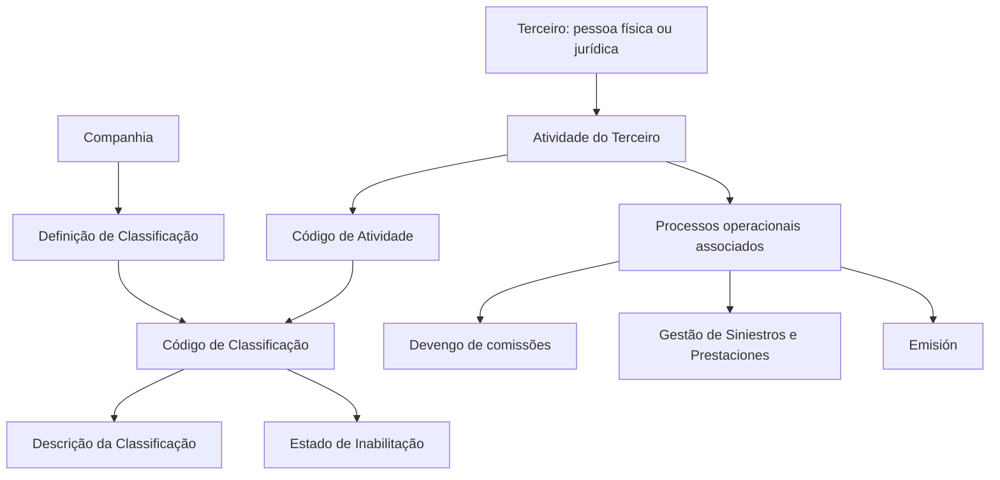

# Definição das Classificações de Atividades de Terceiros no Sistema Reef

## 1. Metadados do Documento
- **Arquivo de Origem:** `Não identificado — conteúdo bruto fornecido`
- **Tipo de Documento:** `Especificação Funcional`
- **Domínio / Sistema:** `Reef / MAPFRE — cadastro e classificação de atividades de terceiros`
- **Público-Alvo:** `Não especificado; conteúdo aplicável a usuários funcionais e responsáveis pela parametrização por companhia`
- **Data/Versão Identificada:** `Não identificada`

---

## 2. Resumo Executivo & Contexto de Negócio

O documento descreve a funcionalidade de definição e cadastro das classificações associadas às atividades de terceiros, sejam terceiros pessoas físicas ou jurídicas. As atividades atribuídas aos terceiros identificam de forma inequívoca os processos, procedimentos e fluxos operacionais nos quais essas pessoas ou entidades intervêm, ou podem intervir, dentro do sistema.

A atividade de um terceiro possui impacto direto no tratamento operacional. Como exemplo, uma pessoa identificada como Intermediário ou Agente pode entrar automaticamente no processo de devengo de comissões da entidade MAPFRE. A remuneração pode incluir, entre outros conceitos, uma parte proporcional dos prêmios obtidos pela atuação comercial direta, intervenção ou colaboração.

O documento também diferencia outros perfis funcionais. Um terceiro identificado como Perito pode participar de tarefas de atribuição e perícia no processo de Gestão de Siniestros e Prestaciones. Um terceiro identificado como Empleado pode beneficiar-se automaticamente de um desconto comercial na contratação de apólices durante o processo de Emisión.

Além da codificação das atividades, que é uma função intrínseca ao núcleo da aplicação, o sistema permite classificar essas atividades conforme critérios relevantes definidos e utilizados localmente pelas entidades seguradoras. A definição das classificações é realizada no nível de companhia, sem recomendação corporativa para padronizar a codificação local dessas classificações.

---

## 3. Arquitetura, Componentes & Tecnologias Envolvidas

O conteúdo não detalha arquitetura técnica, microsserviços, APIs, protocolos, persistência, integrações, versões ou tecnologias de infraestrutura. O documento apresenta um modelo funcional de parametrização no núcleo do sistema, relacionando companhia, atividade de terceiro, classificação e descrição da classificação.

Componentes e conceitos explicitamente mencionados:

| Componente / Conceito | Papel descrito |
| :--- | :--- |
| Sistema / núcleo da aplicação | Permite identificar, codificar e classificar atividades de terceiros. |
| Companhia | Nível no qual a definição da classificação é realizada. |
| Terceiro físico ou jurídico | Entidade cuja atividade pode receber uma classificação. |
| Atividade do Terceiro | Código que identifica processos, procedimentos e fluxos operacionais associados ao terceiro. |
| Classificação | Código associado à atividade do terceiro, definido por companhia. |
| Catálogo de informação específico | Catálogo no qual o núcleo do sistema identifica e codifica classificações de atividades de terceiros. |
| MAPFRE | Entidade mencionada no contexto do processo de devengo de comissões. |
| Gestão de Siniestros e Prestaciones | Processo mencionado para atividades de atribuição e perícia. |
| Emisión | Processo mencionado para desconto comercial na contratação de apólices. |
| Reef | Ambiente ou contexto documental identificado na navegação apresentada. |



> **Nota de Análise:** O documento não especifica como o catálogo é persistido, quais telas ou APIs realizam a manutenção, nem os formatos técnicos dos códigos de companhia, atividade ou classificação.

---

## 4. Regras de Negócio, Especificações Funcionais & Processos

### 4.1 Identificação operacional por atividade

1. As atividades atribuídas a terceiros físicos ou jurídicos identificam inequivocamente os processos, procedimentos e fluxos operacionais do sistema nos quais os terceiros participam ou podem participar.
2. A captura de informações de uma pessoa física no sistema, combinada à identificação dessa pessoa com uma atividade associada a Intermediário ou Agente, permite a entrada automática no processo de devengo de comissões da entidade MAPFRE.
3. No contexto do exemplo de Intermediário ou Agente, a retribuição econômica pode consistir, entre outros conceitos, em uma parte proporcional dos prêmios obtidos na atividade comercial direta, por intervenção ou por colaboração.
4. Uma pessoa identificada como Perito recebe código de atividade diferente do código de Intermediário e pode estar envolvida em tarefas específicas de atribuição e perícia no processo de Gestão de Siniestros e Prestaciones.
5. Uma pessoa identificada como Empleado recebe código de atividade diferente do código de Intermediário e pode beneficiar-se automaticamente de desconto comercial na contratação de suas apólices no processo de Emisión.

### 4.2 Definição de classificações de terceiros

1. O núcleo do sistema permite identificar e codificar classificações das atividades de terceiros físicos e jurídicos em um catálogo de informação específico.
2. A definição de classificações de terceiros é realizada no nível de companhia.
3. Cada classificação pode ser individualmente denominada e identificada por uma denominação ou texto descritivo.
4. A classificação é associada ao código da atividade do terceiro.
5. A propriedade de inabilitação indica que uma classificação de atividade de terceiro não pode ser utilizada em operações de captura e/ou modificação do terceiro.

### 4.3 Diretriz de padronização corporativa

Não existe preferência ou recomendação corporativa para estabelecer ou padronizar a codificação das classificações de atividades de terceiros no sistema. A codificação, uso e definição podem, portanto, ser estabelecidos localmente pelas entidades seguradoras.

---

## 5. Tabelas de Parâmetros, Ambientes e Estruturas de Dados

### 5.1 Propriedades da classificação de atividade de terceiro

| Item / Parâmetro | Descrição / Função | Tipo / Valores / Formato | Ambiente / Observações |
| :--- | :--- | :--- | :--- |
| Compañía | Indica o código da companhia na qual a classificação é definida dentro da atividade do terceiro. | Código de companhia; formato não detalhado. | A definição é realizada em nível de companhia. |
| Código de Actividad del Tercero | Indica o código da atividade do terceiro. | Código de atividade; formato não detalhado. | Relaciona o terceiro aos processos operacionais aplicáveis. |
| Clasificación | Indica o código da classificação associada à atividade do terceiro. | Código de classificação; exemplos: `01`, `02`, `03`. | Associada à atividade do terceiro. |
| Descripción de la Clasificación | Indica a denominação ou descrição da classificação do terceiro. | Texto descritivo. | Cada classificação pode receber denominação individual. |
| Inhabilitación | Indica que a classificação da atividade do terceiro está desabilitada para uso. | Estado de habilitação; valores não detalhados. | Bloqueia a utilização em operações de captura e/ou modificação do terceiro. |

### 5.2 Exemplos de códigos e descrições apresentados

| Item / Parâmetro | Descrição / Função | Tipo / Valores / Formato | Ambiente / Observações |
| :--- | :--- | :--- | :--- |
| Classificação `01` | `Clasificación 1.` | Código numérico apresentado como texto. | Exemplo documental. |
| Classificação `02` | `Clasificación 2` | Código numérico apresentado como texto. | Exemplo documental. |
| Classificação `03` | `Clasificación 3` | Código numérico apresentado como texto. | Exemplo documental. |
| `...` | `...` | Não detalhado. | Indica possibilidade de classificações adicionais. |

### 5.3 Relação entre atividade e impacto operacional

| Atividade / Perfil mencionado | Impacto funcional descrito | Processo associado | Observações |
| :--- | :--- | :--- | :--- |
| Intermediario ou Agente | Entrada automática no processo de devengo de comissões. | Devengo de comisiones da entidade MAPFRE. | A retribuição pode incluir parte proporcional das primas obtidas em atividade comercial direta, intervenção ou colaboração. |
| Perito | Participação em tarefas específicas de atribuição e perícia. | Gestión de Siniestros y Prestaciones. | Possui código de atividade diferente do código de Intermediario. |
| Empleado | Benefício automático de desconto comercial na contratação de apólices. | Emisión. | Possui código de atividade diferente do código de Intermediario. |

---

## 6. Bateria de Perguntas & Respostas para RAG (FAQ Sintético)

### P1: Qual é a finalidade das classificações de atividades de terceiros no sistema?
**R:** As classificações permitem organizar as atividades de terceiros físicos ou jurídicos conforme critérios relevantes definidos localmente pelas entidades seguradoras. Essas classificações complementam a codificação das atividades, que identifica os processos, procedimentos e fluxos operacionais em que cada terceiro participa ou pode participar.

### P2: Em qual nível organizacional é definida uma classificação de terceiro?
**R:** A definição das classificações de terceiros é realizada em nível de companhia. A propriedade `Compañía` informa o código da companhia sobre a qual a classificação está sendo definida dentro da atividade do terceiro.

### P3: Quais propriedades compõem a definição de uma classificação de atividade de terceiro?
**R:** O documento descreve as propriedades `Compañía`, `Código de Actividad del Tercero`, `Clasificación`, `Descripción de la Clasificación` e `Inhabilitación`. Os formatos técnicos desses campos não são detalhados, exceto pelos exemplos de códigos de classificação `01`, `02` e `03`.

### P4: O que acontece quando uma pessoa é identificada como Intermediário ou Agente?
**R:** Quando uma pessoa física é capturada no sistema com atividade associada a Intermediário ou Agente, o código de atividade permite que a pessoa entre automaticamente no processo de devengo de comissões da entidade MAPFRE. A retribuição pode incluir, entre outros conceitos, uma parte proporcional das primas obtidas na atividade comercial direta, por intervenção ou colaboração.

### P5: Qual é o efeito funcional de identificar um terceiro como Perito?
**R:** Um terceiro identificado como Perito recebe um código de atividade diferente do código de Intermediário. Esse terceiro pode participar de tarefas específicas de atribuição e perícia no processo de Gestión de Siniestros y Prestaciones.

### P6: Qual benefício é associado a um terceiro identificado como Empleado?
**R:** Um terceiro identificado como Empleado recebe um código de atividade diferente do código de Intermediário e pode beneficiar-se automaticamente de um desconto comercial na contratação de suas apólices dentro do processo de Emisión.

### P7: O que significa inabilitar uma classificação de atividade de terceiro?
**R:** A propriedade `Inhabilitación` informa ao sistema que a classificação da atividade do terceiro está inabilitada para ser usada nas operações de captura e/ou modificação do terceiro.

### P8: Existe uma codificação corporativa obrigatória para as classificações de atividades de terceiros?
**R:** Não. O documento afirma que não existe preferência ou recomendação corporativa para estabelecer ou padronizar a codificação das classificações no sistema. A definição, codificação e uso podem ser estabelecidos localmente.

### P9: A descrição da classificação é obrigatoriamente padronizada?
**R:** O documento informa que cada classificação pode ser denominada e identificada individualmente mediante uma denominação ou texto descritivo. Não apresenta uma regra corporativa de padronização para essas descrições.

### P10: O documento define APIs, métodos HTTP ou contratos de integração para manutenção das classificações?
**R:** Não. O documento descreve propriedades funcionais e comportamentos de negócio, mas não detalha APIs, métodos HTTP, contratos JSON, telas, banco de dados, mecanismos de integração ou formatos de persistência.

---

## 7. Glossário de Termos, Siglas & Conceitos-Chave

- **Actividad del Tercero:** Código de atividade associado a um terceiro, utilizado para identificar processos, procedimentos e fluxos operacionais aplicáveis.
- **Clasificación:** Código associado à atividade do terceiro, definido no nível de companhia.
- **Descripción de la Clasificación:** Denominação ou texto descritivo associado à classificação de terceiro.
- **Compañía:** Companhia sobre a qual é realizada a definição da classificação dentro da atividade do terceiro.
- **Empleado:** Perfil de terceiro mencionado como potencial beneficiário automático de desconto comercial na contratação de apólices no processo de Emisión.
- **Emisión:** Processo citado no qual um Empleado pode beneficiar-se automaticamente de desconto comercial na contratação de apólices.
- **Gestión de Siniestros y Prestaciones:** Processo citado para tarefas de atribuição e perícia associadas ao perfil Perito.
- **Inhabilitación:** Propriedade que impede o uso de uma classificação de atividade de terceiro em operações de captura e/ou modificação.
- **Intermediario / Agente:** Perfil associado ao processo automático de devengo de comissões da entidade MAPFRE.
- **MAPFRE:** Entidade mencionada no processo de devengo de comissões.
- **Perito:** Perfil associado a tarefas específicas de atribuição e perícia em Gestão de Siniestros y Prestaciones.
- **Reef:** Nome identificado no contexto de navegação e documentação apresentada; o documento não detalha seu significado técnico ou funcional.
- **Tercero:** Pessoa física ou jurídica à qual são atribuídas atividades e classificações no sistema.

---

## 8. Notas Críticas, Riscos & Limitações

- O documento não especifica formatos, tamanhos, domínios de validação ou obrigatoriedade dos campos `Compañía`, `Código de Actividad del Tercero`, `Clasificación` e `Descripción de la Clasificación`.
- O documento não apresenta regras de exclusão, reabilitação, histórico, auditoria ou vigência temporal para classificações inabilitadas.
- Não há detalhamento de telas, APIs, contratos de integração, eventos, banco de dados, permissões ou perfis autorizados a definir classificações.
- A ausência de recomendação corporativa para padronização da codificação pode resultar em divergências de codificação, descrição e uso entre entidades seguradoras.
- O conteúdo menciona processos de comissões, sinistros, prestações e emissão, mas não detalha as condições completas para disparo, cálculo, validação ou exceção desses processos.
- **Nota de Análise:** O documento lista os perfis Intermediario, Agente, Perito e Empleado, mas não detalha todos os códigos de atividade, nem define a totalidade das classificações permitidas para cada perfil.

---

## 9. Conteúdo Bruto Estruturado (Referência Fiel)

```text
--- [PÁGINA 1 DE 2] ---

DEFINICIÓN de las Clasicaciones de Terceros
Contexto
Las actividades que los Terceros Físicos o Jurídicos tienen asignadas, identican inequívocamente los procesos, procedimientos y ujos
operativos en el sistema en los que intervienen o pueden intervenir, como por ejemplo:
Si se captura en el sistema la información de una persona física y se identica en el sistema con la actividad asociada a un Intermediario
o Agente, este código de actividad le permitirá entrar de manera automática en el proceso de devengo de comisiones de la entidad
MAPFRE, proceso por el que percibirá una retribución económica consistente, entre otros conceptos, por una parte proporcional de las
primas conseguidas en su labor comercial directa o a través de su intervención o colaboración.
En cambio, si la misma persona se hubiera identicado en el sistema como un Perito o como un Empleado tendría asignados códigos
diferentes de actividad al código de actividad de Intermediario del ejemplo anterior y por ello esta persona podría respectivamente estar
involucrada en tareas especícas de asignación y peritaje dentro del proceso de Gestión de Siniestros y Prestaciones o beneciarse
automáticamente de un descuento comercial en la contratación de sus pólizas en el proceso de Emisión.
Además de la tarea de codicación de las actividades de los Terceros, la cual es una tarea intrínseca a la funcionalidad del núcleo de la
aplicación, el sistema permite ir un paso más allá y clasicar estas actividades de acuerdo con los criterios más relevantes que tengan a bien
denir y emplear localmente las entidades aseguradoras.
Propiedades Generales
Funcionalmente, el núcleo del Sistema cuenta con la posibilidad de identicar y codicar las diferentes Clasicaciones de las Actividades de
los Terceros, sean estos personas Físicas o Jurídicas, en un catálogo de información especíco.
La denición de las Clasicaciones de Terceros en el Sistema se realiza a nivel de compañía pudiendo denominar e identicar
individualmente cada una de ellas mediante una denominación o texto descriptivo.
Compañía
Esta propiedad le indica al sistema el código de la compañía sobre la que se está realizando la denición de la clasicación dentro de la
actividad del Tercero.
Código de Actividad del Tercero
Esta propiedad indica en el sistema el código de la Actividad del Tercero.
Clasicación
Esta propiedad indicará en el sistema el código de la Clasicación asociada a la actividad del Tercero.
Ejemplo:
Documentation / DOCUMENTACIÓN Reef
DOCUMENTACIÓN Reef
Mapfredocument
DOCUMENTACIÓN Reef
Owner
user:agonzalez_mapfre.com
Lifecycle
Approved Source
 / 
 VL
Buscar Inicio Soluciones Arquitecturas APIs Componentes Cloud Documentación Zeus Reef Ayuda
ES


--- [PÁGINA 2 DE 2] ---

Descripción de la Clasicación
Esta propiedad le indica al sistema cual es la denominación o descripción de la clasicación del Tercero
CLASIFICACIÓN DESCRIPCIÓN
01 Clasicación 1.
02 Clasicación 2
03 Clasicación 3
... ...
Otras Propiedades
Inhabilitación
Esta propiedad le indica al Sistema que la Clasicación de la Actividad del Tercero está inhabilitada para poder ser utilizada en las
operaciones de captura y/o modicación del Tercero.
Vínculos
Relación de Directrices y Documentos funcionales cuya lectura recomendada para evitar que la interpretación aislada del presente
documento pueda conducir a error.
Actividades de Terceros
Preguntas frecuentes
(1) ¿Existe alguna recomendación operativa que deba ser tomada en consideración localmente en la codicación, uso y denición de las
Clasicaciones de las Actividades de los Terceros en el Sistema?
No existe Corporativamente una preferencia o recomendación para establecer o estandarizar en el sistema su codicación.
```
