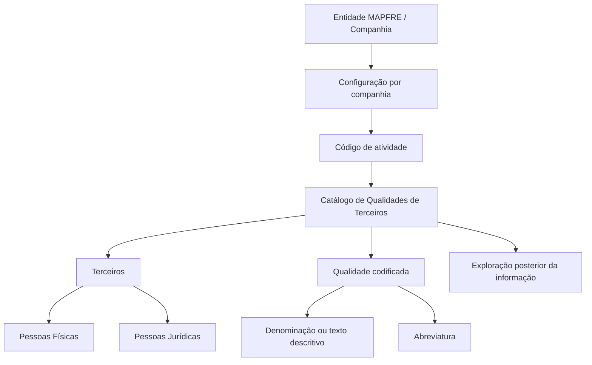

# Definição dos Códigos de Qualidade de Terceiros no Sistema Reef

## 1. Metadados do Documento
- **Arquivo de Origem:** `Não identificado no conteúdo fornecido`
- **Tipo de Documento:** Especificação Técnica / Documentação Funcional
- **Domínio / Sistema:** Reef — catálogo de Qualidades de Terceiros
- **Público-Alvo:** Negócio, Analistas Funcionais, Configuração de Sistemas e Operação
- **Data/Versão Identificada:** Não identificada

---

## 2. Resumo Executivo & Contexto de Negócio

O documento define o conceito de **Qualidade de Terceiros** no contexto do sistema Reef. Qualidade é descrita como o conjunto de propriedades inerentes a um elemento que permite caracterizá-lo e avaliá-lo em relação a outros elementos da mesma espécie.

Funcionalmente, o núcleo do sistema Reef permite identificar e codificar as possíveis Qualidades dos Terceiros. Os Terceiros podem ser Pessoas Físicas ou Pessoas Jurídicas. O catálogo de Qualidades é entregue inicialmente vazio às entidades.

A configuração da classificação é realizada por companhia e por código de atividade. O documento cita como exemplos de atividade: Asegurados, Agentes, Clínicas e Peritos. Cada valor de Qualidade pode ser identificado individualmente por uma denominação ou texto descritivo e, adicionalmente, por uma abreviatura.

A documentação não estabelece uma codificação corporativa obrigatória ou uma recomendação operacional para padronizar as Qualidades de Terceiros. Contudo, indica que a entidade MAPFRE deve avaliar a conveniência de utilizar esse catálogo transversalmente nos processos da companhia, visando uma configuração adequada e a posterior exploração das informações.

---

## 3. Arquitetura, Componentes & Tecnologias Envolvidas

Os componentes, conceitos e repositórios citados no documento são:

- **Sistema Reef:** sistema que disponibiliza o catálogo de Qualidades de Terceiros.
- **Núcleo do Sistema:** componente funcional com capacidade de identificar e codificar Qualidades.
- **Entidade / Companhia:** unidade para a qual o catálogo pode ser configurado.
- **Código de Atividade:** critério de segmentação da configuração de Qualidades.
- **Terceiros:** Pessoas Físicas ou Jurídicas classificadas por Qualidades.
- **Catálogo de Qualidades:** repositório de informações inicialmente vazio, configurável por companhia e atividade.
- **MAPFRE:** entidade mencionada como responsável por analisar o uso transversal do catálogo.
- **Mapfredocument / DOCUMENTACIÓN Reef:** referências documentais apresentadas na página.
- **Zeus:** item de navegação citado, sem detalhamento funcional adicional.

> *Nota de Análise: O documento não descreve tecnologias de implementação, APIs, métodos HTTP, banco de dados, contratos JSON, infraestrutura, ambientes ou integrações técnicas entre sistemas.*



---

## 4. Regras de Negócio, Especificações Funcionais & Processos

1. O sistema Reef permite identificar e codificar possíveis Qualidades de Terceiros.

2. Os Terceiros classificados no catálogo podem ser:
   - Pessoas Físicas.
   - Pessoas Jurídicas.

3. O catálogo de informações de Qualidades é entregue às entidades inicialmente sem conteúdo.

4. A definição e a codificação das Qualidades devem considerar:
   - A companhia.
   - O código de atividade.

5. O documento cita os seguintes exemplos de códigos ou tipos de atividade:
   - Asegurados.
   - Agentes.
   - Clínicas.
   - Peritos.

6. Cada Qualidade de Terceiro pode possuir:
   - Código de Qualidade.
   - Denominação ou texto descritivo.
   - Abreviatura.

7. Para a atividade **1 - Asegurados**, o documento apresenta exemplos de Qualidades:
   - Código `01`: Clientes Banco SANTANDER, abreviatura `BAN.SAN.`
   - Código `02`: Clientes BancaSeguros, abreviatura `BAN.SEG.`
   - Código `AA`: Clientes Mutualidad Médica, abreviatura `MUT.MED.`
   - Código `ab`: VIP, sem abreviatura apresentada.

8. Não existe preferência ou recomendação para estabelecer ou padronizar a codificação das Qualidades de Terceiros no sistema.

9. Apesar de não existir padronização prescrita, a entidade MAPFRE deve analisar a conveniência de utilizar transversalmente o catálogo de Qualidades nos processos da companhia.

10. O objetivo da utilização transversal é permitir:
    - Configuração correta do catálogo de informações.
    - Exploração posterior das informações configuradas.

11. O documento recomenda a leitura de diretrizes e documentos funcionais relacionados para evitar interpretações isoladas e incorretas:
    - Actividades de Terceros.
    - Categorías de Terceros.
    - Clasificación de Terceros.
    - Agrupaciones de Terceros.
    - Preguntas frecuentes.

---

## 5. Tabelas de Parâmetros, Ambientes e Estruturas de Dados

| Item / Parâmetro | Descrição / Função | Tipo / Valores / Formato | Ambiente / Observações |
| :--- | :--- | :--- | :--- |
| Qualidade | Conjunto de propriedades que permite caracterizar e valorar um elemento em relação aos demais da mesma espécie | Conceito funcional | Aplicado à classificação de Terceiros |
| Terceiro | Entidade para a qual o sistema pode identificar e codificar Qualidades | Pessoa Física ou Pessoa Jurídica | O documento não detalha atributos cadastrais |
| Catálogo de Qualidades | Catálogo de informação que armazena as possíveis Qualidades de Terceiros | Inicialmente vazio | Entregue às entidades sem conteúdo inicial |
| Companhia | Critério de configuração das Qualidades | Companhia não especificada | A configuração é realizada por companhia |
| Código de atividade | Critério de segmentação para definição e codificação de Qualidades | Exemplos: Asegurados, Agentes, Clínicas, Peritos | A atividade `1` corresponde a Asegurados no exemplo |
| Código de Qualidade | Identificador individual de uma Qualidade | Exemplos: `01`, `02`, `AA`, `ab` | Não há padrão obrigatório definido |
| Denominação / texto descritivo | Nome que identifica individualmente uma Qualidade | Texto | Associado ao código de Qualidade |
| Abreviatura | Identificador abreviado de uma Qualidade | Texto abreviado | Pode não estar informada para todos os exemplos |
| Uso transversal | Uso do catálogo nos processos da companhia | Diretriz de análise para MAPFRE | Não é uma obrigatoriedade explicitamente definida |
| Exploração posterior | Uso futuro das informações configuradas no catálogo | Não detalhado | Depende de correta configuração |

| Código de Atividade | Descrição da Atividade | Exemplos de Qualidades | Observações |
| :--- | :--- | :--- | :--- |
| `1` | Asegurados | Clientes Banco SANTANDER; Clientes BancaSeguros; Clientes Mutualidad Médica; VIP | Único código de atividade explicitamente exemplificado |

| Código de Qualidade | Descrição | Abreviatura | Atividade |
| :--- | :--- | :--- | :--- |
| `01` | Clientes Banco SANTANDER | `BAN.SAN.` | 1 - Asegurados |
| `02` | Clientes BancaSeguros | `BAN.SEG.` | 1 - Asegurados |
| `AA` | Clientes Mutualidad Médica | `MUT.MED.` | 1 - Asegurados |
| `ab` | VIP | Não apresentada | 1 - Asegurados |

---

## 6. Bateria de Perguntas & Respostas para RAG (FAQ Sintético)

### P1: O que significa Qualidade de Terceiros no sistema Reef?
**R:** Qualidade é definida como o conjunto de propriedades inerentes a um elemento que permite caracterizá-lo e valorá-lo em relação aos demais elementos de sua espécie. No sistema Reef, esse conceito é utilizado para identificar e codificar classificações aplicáveis aos Terceiros.

### P2: Quais tipos de Terceiros podem receber uma Qualidade no sistema Reef?
**R:** O documento informa que as Qualidades podem ser aplicadas a Terceiros que sejam Pessoas Físicas ou Pessoas Jurídicas.

### P3: O catálogo de Qualidades de Terceiros já possui conteúdo quando é entregue a uma entidade?
**R:** Não. O documento afirma que o catálogo de informações é entregue às entidades inicialmente vazio de conteúdo.

### P4: Como as Qualidades de Terceiros são configuradas?
**R:** As Qualidades de Terceiros são definidas e codificadas por companhia e por código de atividade. O documento cita como exemplos de atividade Asegurados, Agentes, Clínicas e Peritos.

### P5: Quais informações identificam individualmente uma Qualidade de Terceiro?
**R:** Cada Qualidade pode ser identificada por uma denominação ou texto descritivo e por uma abreviatura. O documento também apresenta um código de Qualidade nos exemplos da atividade de Asegurados.

### P6: Existe uma regra obrigatória para padronizar os códigos de Qualidade de Terceiros?
**R:** Não. O documento declara que não existe preferência nem recomendação para estabelecer ou estandardizar a codificação das Qualidades de Terceiros no sistema.

### P7: Qual é a recomendação para a entidade MAPFRE em relação ao catálogo de Qualidades?
**R:** A entidade MAPFRE deve analisar a conveniência de utilizar transversalmente o catálogo de Qualidades nos processos da companhia. Essa análise busca permitir uma configuração correta e a posterior exploração das informações.

### P8: Quais Qualidades são apresentadas para a atividade 1 - Asegurados?
**R:** Para a atividade `1 - Asegurados`, o documento apresenta: `01` Clientes Banco SANTANDER (`BAN.SAN.`), `02` Clientes BancaSeguros (`BAN.SEG.`), `AA` Clientes Mutualidad Médica (`MUT.MED.`) e `ab` VIP, sem abreviatura apresentada.

### P9: A documentação informa como a exploração posterior do catálogo deve ser realizada?
**R:** Não. O documento indica que uma configuração correta permitirá a exploração posterior das informações, mas não detalha processos, relatórios, consultas, APIs ou mecanismos técnicos para essa exploração.

### P10: Quais documentos relacionados devem ser consultados para evitar interpretação isolada?
**R:** O documento recomenda a leitura de Actividades de Terceros, Categorías de Terceros, Clasificación de Terceros, Agrupaciones de Terceros e Preguntas frecuentes.

---

## 7. Glossário de Termos, Siglas & Conceitos-Chave

- **Reef:** Sistema citado como responsável por permitir a identificação e a codificação de Qualidades de Terceiros.
- **Qualidade:** Conjunto de propriedades inerentes a uma coisa que permite caracterizá-la e valorá-la em relação às demais de sua espécie.
- **Terceiro:** Pessoa Física ou Pessoa Jurídica passível de classificação por Qualidade.
- **Catálogo de Qualidades:** Catálogo de informações no qual são definidas e codificadas as Qualidades de Terceiros.
- **Código de Atividade:** Critério utilizado, juntamente com a companhia, para configurar Qualidades.
- **Asegurados:** Atividade identificada pelo código `1` no exemplo apresentado.
- **BAN.SAN.:** Abreviatura de Clientes Banco SANTANDER.
- **BAN.SEG.:** Abreviatura de Clientes BancaSeguros.
- **MUT.MED.:** Abreviatura de Clientes Mutualidad Médica.
- **MAPFRE:** Entidade mencionada no documento como responsável por avaliar o uso transversal do catálogo nos processos da companhia.
- **Mapfredocument:** Referência documental exibida no conteúdo bruto, sem detalhamento adicional.
- **Zeus:** Item exibido na navegação da documentação, sem definição funcional no texto.

---

## 8. Notas Críticas, Riscos & Limitações

- O documento não define um padrão obrigatório para os códigos de Qualidade. A ausência de padronização pode resultar em codificações divergentes entre companhias, atividades ou processos, caso não exista governança complementar.

- O catálogo é entregue inicialmente vazio. A utilidade operacional depende de configuração prévia pela entidade responsável.

- A recomendação para uso transversal do catálogo é apresentada como uma análise de conveniência a ser realizada pela entidade MAPFRE, e não como requisito obrigatório.

- O documento não descreve métodos HTTP, contratos JSON, tabelas de banco de dados, regras de integração, permissões, ambientes, URLs, logs ou mecanismos de auditoria.

- O documento não detalha como ocorre a exploração posterior das informações configuradas no catálogo.

- A documentação recomenda a consulta de documentos relacionados para evitar que a interpretação isolada do conteúdo leve a erros.

- *Nota de Análise: O conteúdo apresenta exemplos de códigos com formatos numérico (`01`, `02`), alfabético em maiúsculas (`AA`) e alfabético em minúsculas (`ab`). O documento não especifica restrições de formato, unicidade, tamanho ou validação para esses códigos.*

---

## 9. Conteúdo Bruto Estruturado (Referência Fiel)

```text
--- [PÁGINA 1 DE 2] ---

DEFINICIÓN de los Códigos de Calidad
Propiedades Generales
Se entiende por Calidad al Conjunto de propiedades inherentes a una cosa que permite caracterizarla y valorarla con respecto a las restantes
de su especie.
Funcionalmente, el núcleo del Sistema cuenta con la posibilidad de identicar y codicar las posibles 'Calidades' de los Terceros, sean estos
Personas Físicas o Jurídicas, en un catálogo de información que se entrega a las entidades inicialmente vacío de contenido.
El sistema permite por compañía y código de actividad (Asegurados, Agentes, Clínicas, Peritos, ...) denir y codicar la relación de los valores
de esta clasicación permitiendo denominar e identicar individualmente cada una de ellas mediante una denominación o texto descriptivo
además de una abreviatura.
Como ejemplo y para la actividad 1 - Asegurados:
CALIDAD DESCRIPCIÓN / ABREVIATURA
01 Clientes Banco SANTANDER / BAN.SAN.
02 Clientes BancaSeguros / BAN.SEG.
AA Clientes Mutualidad Médica / MUT.MED.
ab VIP
... ...
Vínculos
Relación de Directrices y Documentos funcionales cuya lectura recomendada para evitar que la interpretación aislada del presente
documento pueda conducir a error.
Actividades de Terceros
Categorías de Terceros
Clasicación de Terceros
Agrupaciones de Terceros
Preguntas frecuentes
Documentation / DOCUMENTACIÓN Reef
DOCUMENTACIÓN Reef
Mapfredocument
DOCUMENTACIÓN Reef
Owner
user:agonzalez_mapfre.com
Lifecycle
Approved Source
 / 
 VL
Buscar Inicio Soluciones Arquitecturas APIs Componentes Cloud Documentación Zeus Reef Ayuda
ES


--- [PÁGINA 2 DE 2] ---

(1) ¿Existe alguna recomendación operativa que deba ser tomada en consideración localmente en la codicación, uso y denición de la tabla
de Calidades de Terceros en el Sistema?
No existe una preferencia ni recomendación para establecer o estandarizar la codicación de las Calidades de los Terceros en el sistema, si
bien la entidad MAPFRE debe analizar la conveniencia de utilizar transversalmente en los procesos de la compañía este catálogo de
información para una correcta conguración permitiendo así su posterior explotación.
```
