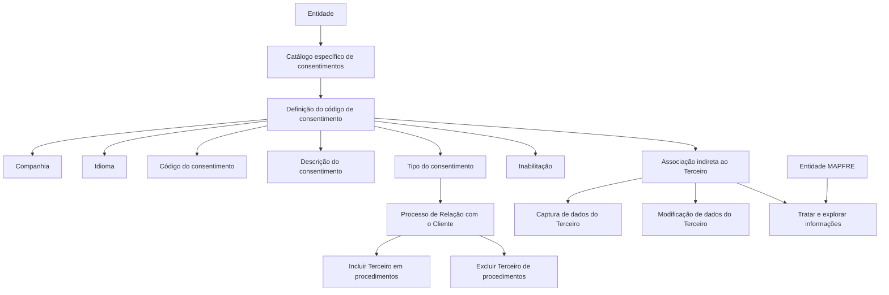

# Definição dos Consentimentos dos Segurados no Reef.core

## 1. Metadados do Documento
- **Arquivo de Origem:** Não identificado no conteúdo extraído
- **Tipo de Documento:** Especificação Funcional
- **Domínio / Sistema:** Reef.core / MAPFRE / gestão de consentimentos de Terceiros
- **Público-Alvo:** Negócio, analistas funcionais, desenvolvedores e equipes operacionais
- **Data/Versão Identificada:** Não identificada

---

## 2. Resumo Executivo & Contexto de Negócio

O documento descreve a definição de consentimentos associados a segurados ou Terceiros no sistema Reef.core. O consentimento é caracterizado como uma manifestação de vontade livre, inequívoca, específica e informada, por meio da qual o interessado aceita o tratamento de dados pessoais que lhe dizem respeito, mediante declaração ou ação afirmativa clara.

Funcionalmente, o Reef.core permite identificar e definir consentimentos em um catálogo específico de informações entregue às entidades inicialmente sem conteúdo. Esse catálogo permite que cada entidade defina os diferentes consentimentos que podem ser associados aos Terceiros durante a captura ou alteração de dados.

A definição de um consentimento inclui propriedades gerais, operativas e outras propriedades. As propriedades gerais identificam a companhia, o idioma, o código e a descrição do consentimento. A propriedade operativa determina o tipo de consentimento, que estabelece os procedimentos de relacionamento com o cliente nos quais o Terceiro poderá ser incluído ou excluído.

A entidade MAPFRE poderá tratar e explorar as informações de consentimento de acordo com necessidades específicas. O documento estabelece explicitamente que os valores dos Tipos de Consentimentos habilitados e configurados no Reef.core devem ser respeitados.

---

## 3. Arquitetura, Componentes & Tecnologias Envolvidas

Os componentes e conceitos explicitamente citados são:

- **Reef.core:** sistema que disponibiliza a definição e associação de consentimentos a Terceiros.
- **Catálogo de informação específico:** catálogo entregue às entidades sem conteúdo inicial, destinado à definição dos consentimentos.
- **Entidades:** organizações que definem e utilizam consentimentos no catálogo.
- **Terceiros:** pessoas ou entidades às quais os consentimentos são associados durante captura ou modificação de dados.
- **Processo de Relação com o Cliente:** processo no qual o tipo de consentimento determina procedimentos de inclusão ou exclusão do Terceiro.
- **MAPFRE:** entidade mencionada como capaz de tratar e explorar as informações conforme necessidades específicas.
- **Mapfredocument / DOCUMENTACIÓN Reef:** referências ao repositório ou contexto documental apresentado na extração.



**Nota de Análise:** o conteúdo fornecido não detalha tecnologias de implementação, APIs, métodos HTTP, contratos JSON, bases de dados, integrações técnicas, ambientes ou mecanismos de persistência do Reef.core.

---

## 4. Regras de Negócio, Especificações Funcionais & Processos

### 4.1 Definição de consentimento

1. Um consentimento é uma manifestação de vontade:
   - Livre;
   - Inequívoca;
   - Específica;
   - Informada.

2. O interessado aceita o tratamento de dados pessoais que lhe dizem respeito por:
   - Declaração; ou
   - Ação afirmativa clara.

3. O Reef.core permite identificar e definir diferentes consentimentos em um catálogo específico de informação.

4. O catálogo de consentimentos é disponibilizado às entidades sem conteúdo inicial.

5. Os consentimentos podem ser associados aos Terceiros nos processos de:
   - Captura de dados;
   - Modificação de dados.

### 4.2 Definição do código de consentimento

1. A propriedade **Companhia** indica o código da companhia para a qual está sendo realizada a definição do consentimento do Terceiro.

2. A propriedade **Idioma** indica o idioma utilizado na definição do código do consentimento. O documento fornece como exemplos espanhol e inglês.

3. A propriedade **Código do Consentimento** representa a chave do consentimento definido no sistema.

4. Um mesmo código de consentimento pode determinar distintos Tipos de Consentimento.

5. A propriedade **Descrição do Consentimento** representa a denominação ou nome do consentimento definido.

### 4.3 Tipo de consentimento e relacionamento com o cliente

1. O **Tipo do Consentimento** está associado ao Código do Consentimento.

2. O Tipo do Consentimento está indiretamente associado ao Terceiro como parte de suas informações.

3. No Processo de Relação com o Cliente, o Tipo do Consentimento determina sobre quais procedimentos o Terceiro poderá:
   - Ser incluído;
   - Ser excluído.

4. A inclusão ou exclusão deve cumprir o mandato associado ao consentimento.

### 4.4 Inabilitação

1. A propriedade **Inabilitação** informa ao sistema que a definição de um Código do Consentimento está inabilitada.

2. Quando inabilitada, a definição não poderá ser utilizada em operações de:
   - Captura do Terceiro;
   - Modificação do Terceiro.

### 4.5 Restrição operacional explícita

É obrigatório respeitar os valores dos Tipos de Consentimentos que estejam habilitados e configurados no Reef.core.

---

## 5. Tabelas de Parâmetros, Ambientes e Estruturas de Dados

| Item / Parâmetro | Descrição / Função | Tipo / Valores / Formato | Ambiente / Observações |
| :--- | :--- | :--- | :--- |
| Companhia | Indica o código da companhia para a qual o consentimento do Terceiro está sendo definido. | Código de companhia; formato não informado. | Associado à definição do consentimento. |
| Idioma | Indica o idioma empregado na definição do Código do Consentimento. | Exemplos citados: espanhol e inglês. | Formato ou catálogo de idiomas não informado. |
| Código do Consentimento | Representa a chave do consentimento definido no sistema. | Código; formato não informado. | Um mesmo código pode determinar diferentes Tipos de Consentimento. |
| Descrição do Consentimento | Indica a denominação ou nome do consentimento definido. | Texto; formato não informado. | Propriedade geral. |
| Tipo do Consentimento | Define, no Processo de Relação com o Cliente, os procedimentos nos quais o Terceiro poderá ser incluído ou excluído. | Valores habilitados e configurados no Reef.core. | O documento exige respeitar os tipos habilitados e configurados. |
| Inabilitação | Indica que a definição do Código do Consentimento não poderá ser utilizada. | Estado de inabilitação; valores/formato não informados. | Bloqueia o uso em captura e/ou modificação do Terceiro. |
| Terceiro | Entidade associada, indiretamente, ao Tipo do Consentimento como parte de suas informações. | Estrutura e identificador não informados. | Participa de operações de captura e modificação. |
| Catálogo específico de informação | Repositório funcional no qual as entidades definem consentimentos. | Conteúdo inicial vazio. | Disponibilizado pelo Reef.core às entidades. |
| MAPFRE | Entidade mencionada como usuária das informações de consentimento. | Não aplicável. | Pode tratar e explorar as informações segundo necessidades específicas. |
| Ambientes | Não há URLs, servidores, portas ou ambientes técnicos descritos. | Não informado. | Não é possível inferir dados de infraestrutura. |

---

## 6. Bateria de Perguntas & Respostas para RAG (FAQ Sintético)

### P1: Qual é a definição de consentimento apresentada no documento?
**R:** O consentimento é definido como toda manifestação de vontade livre, inequívoca, específica e informada por meio da qual o interessado aceita o tratamento de dados pessoais que lhe dizem respeito. Essa aceitação pode ocorrer por declaração ou por uma ação afirmativa clara.

### P2: Qual é o objetivo do catálogo de consentimentos no Reef.core?
**R:** O Reef.core disponibiliza um catálogo específico de informações, inicialmente entregue às entidades sem conteúdo, para que sejam identificados e definidos os diferentes consentimentos que poderão ser associados aos Terceiros durante a captura ou a modificação dos dados desses Terceiros.

### P3: Quando um consentimento pode ser associado a um Terceiro no Reef.core?
**R:** Um consentimento pode ser associado a um Terceiro durante operações de captura dos dados do Terceiro ou durante operações de modificação dos dados do Terceiro.

### P4: Qual é a função da propriedade Companhia na definição de consentimento?
**R:** A propriedade Companhia informa ao sistema o código da companhia sobre a qual está sendo realizada a definição do Consentimento do Terceiro.

### P5: Para que serve a propriedade Idioma no Código do Consentimento?
**R:** A propriedade Idioma indica o idioma empregado na definição do Código do Consentimento. O documento cita espanhol e inglês como exemplos de idiomas possíveis.

### P6: Um mesmo Código do Consentimento pode possuir mais de um Tipo do Consentimento?
**R:** Sim. O documento informa que o Código do Consentimento é a chave do consentimento definido no sistema e que, sob um mesmo código de consentimento, podem ser determinados distintos Tipos de Consentimento.

### P7: Qual é o papel do Tipo do Consentimento no Processo de Relação com o Cliente?
**R:** O Tipo do Consentimento está associado ao Código do Consentimento e, indiretamente, ao Terceiro. No Processo de Relação com o Cliente, ele indica os procedimentos nos quais o Terceiro poderá ser incluído ou excluído, em cumprimento ao mandato correspondente.

### P8: O que ocorre quando um Código do Consentimento está inabilitado?
**R:** Quando a definição do Código do Consentimento está inabilitada, ela não pode ser utilizada nas operações de captura e/ou modificação do Terceiro.

### P9: Existe uma exigência para os valores de Tipo do Consentimento?
**R:** Sim. O documento determina que é obrigatório respeitar os valores dos Tipos de Consentimentos que estejam habilitados e configurados no Reef.core.

### P10: Qual entidade poderá tratar e explorar as informações de consentimento segundo necessidades específicas?
**R:** O documento afirma que a entidade MAPFRE estará em condições de tratar e explorar adequadamente essas informações de acordo com suas necessidades específicas.

### P11: O documento descreve APIs, endpoints, métodos HTTP ou contratos JSON para consentimentos?
**R:** Não. O conteúdo extraído descreve propriedades e regras funcionais dos consentimentos no Reef.core, mas não detalha APIs, endpoints, métodos HTTP, contratos JSON, mecanismos de integração ou estruturas técnicas de persistência.

### P12: Quais propriedades da definição de consentimento são apresentadas no documento?
**R:** O documento apresenta propriedades gerais — Companhia, Idioma, Código do Consentimento e Descrição do Consentimento —, uma propriedade operativa — Tipo do Consentimento — e outra propriedade — Inabilitação.

---

## 7. Glossário de Termos, Siglas & Conceitos-Chave

- **Reef.core:** sistema mencionado como responsável por disponibilizar o catálogo e permitir a definição de consentimentos associados a Terceiros.
- **Consentimento:** manifestação de vontade livre, inequívoca, específica e informada para aceitação do tratamento de dados pessoais.
- **Código do Consentimento:** chave do consentimento definido no sistema.
- **Descrição do Consentimento:** denominação ou nome atribuído ao consentimento.
- **Tipo do Consentimento:** atributo associado ao Código do Consentimento que determina procedimentos de inclusão ou exclusão do Terceiro no Processo de Relação com o Cliente.
- **Terceiro:** entidade à qual os consentimentos são associados como parte de suas informações.
- **Captura:** operação de registro ou inclusão de dados do Terceiro; o documento não fornece detalhamento técnico adicional.
- **Modificação:** operação de alteração dos dados do Terceiro; o documento não fornece detalhamento técnico adicional.
- **Inabilitação:** propriedade que impede a utilização de uma definição de Código do Consentimento nas operações de captura e/ou modificação do Terceiro.
- **Processo de Relação com o Cliente:** processo em que o Tipo do Consentimento define os procedimentos aplicáveis de inclusão ou exclusão do Terceiro.
- **MAPFRE:** entidade mencionada no documento como apta a tratar e explorar informações de consentimento conforme necessidades específicas.
- **DOCUMENTACIÓN Reef / Mapfredocument:** referências documentais exibidas no conteúdo extraído.

---

## 8. Notas Críticas, Riscos & Limitações

- O conteúdo extraído contém apenas duas páginas e termina após a palavra **“Ejemplo:”**; o exemplo referido não foi fornecido.
- Não há detalhamento de valores permitidos para Companhia, Idioma, Código do Consentimento, Tipo do Consentimento ou Inabilitação.
- Não há especificação de campos obrigatórios, formatos, tamanhos, validações técnicas, mensagens de erro ou regras de unicidade.
- Não há informações sobre APIs, endpoints, contratos de integração, estruturas JSON, bancos de dados, logs, URLs, servidores, ambientes ou credenciais.
- Não há explicação detalhada dos procedimentos do Processo de Relação com o Cliente que podem incluir ou excluir o Terceiro.
- A regra operacional explicitamente documentada é respeitar os Tipos de Consentimentos habilitados e configurados no Reef.core.
- **Nota de Análise:** o documento lista o Reef.core e as propriedades funcionais de consentimento, mas não detalha métodos HTTP, contratos JSON, persistência ou integrações expostas.

---

## 9. Conteúdo Bruto Estruturado (Referência Fiel)

```text
--- [PÁGINA 1 DE 2] ---

DEFINICIÓN de los Consentimientos de los Asegurados
Contexto
Se entiende por consentimiento «toda manifestación de voluntad, libre, inequívoca, especíca e informada, mediante la que el interesado
acepta, ya sea mediante una declaración o una clara acción armativa, el tratamiento de datos personales que le conciernen».
Objetivo
Funcionalmente Reef.core cuenta con la posibilidad de identicar y denir en un catálogo de información especíco que se entrega a las
entidades vacío de contenido, los diferentes Consentimientos que se pueden asociar a los Terceros en la captura o en la modicación de sus
datos.
... De esta manera la entidad MAPFRE estará en disposición de tratar y explotar adecuadamente esta información de acuerdo a sus
necesidades especícas.
Propiedades Generales
Propiedades Operativas
Otras Propiedades
Propiedades Generales
Compañía
Esta propiedad le indica al sistema el código de la compañía sobre la que se está realizando la denición del Consentimiento del Tercero.
Idioma
Esta propiedad le indica al sistema el Idioma empleado en la denición del Código del Consentimiento como por ejemplo: español, inglés,...
Código del Consentimiento
Esta propiedad indicará la clave del Consentimiento que se está deniendo en el Sistema pudiendo determinar bajo un mismo código de
consentimiento distintos Tipos de Consentimiento.
Descripción del Consentimiento
Esta propiedad le indica al sistema la denominación o nombre del Consentimiento que se está deniendo.
Propiedades Operativas
Tipo del Consentimiento
Documentation / DOCUMENTACIÓN Reef
DOCUMENTACIÓN Reef
Mapfredocument
DOCUMENTACIÓN Reef
Owner
user:agonzalez_mapfre.com
Lifecycle
Approved Source
 / 
 VL
Buscar Inicio Soluciones Arquitecturas APIs Componentes Cloud Documentación Zeus Reef Ayuda
ES


--- [PÁGINA 2 DE 2] ---

Este Atributo que está asociado al Código del Consentimiento e indirectamente al Tercero como parte de su información, indica en el Proceso
de Relación con el Cliente sobre qué procedimiento/s se podrá incluir o excluir al Tercero cumpliendo así con su mandato.
Otras Propiedades
Inhabilitación
Esta propiedad le indica al Sistema que la denición del Código del Consentimiento está inhabilitada para poder ser utilizada en las
operaciones de captura y/o modicación del Tercero.
Vínculos
Relación de Directrices y Documentos funcionales cuya lectura recomendada para evitar que la interpretación aislada del presente
documento pueda conducir a error.
Actividades de Terceros
Preguntas frecuentes
(1) ¿Existe alguna recomendación operativa que deba ser tomada en consideración localmente en la codicación, uso y denición de los
Códigos de Consentimiento de los Terceros en el Sistema?
Es obligatorio respetar los valores de los Tipos de Consentimientos habilitados y conformados en Reef.core.
Ejemplo:
```
