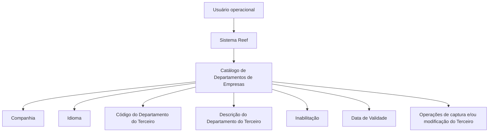

# Definição de Departamentos de Empresas no Sistema Reef

## 1. Metadados do Documento
- **Arquivo de Origem:** Não identificado no conteúdo extraído
- **Tipo de Documento:** Manual Operacional
- **Domínio / Sistema:** Reef / Cadastro de Terceiros Jurídicos
- **Público-Alvo:** Operação, Negócio, Analistas Funcionais e Desenvolvedores
- **Data/Versão Identificada:** Não identificada

---

## 2. Resumo Executivo & Contexto de Negócio

O documento descreve a definição e a manutenção de departamentos de empresas em um catálogo específico do núcleo do Sistema Reef. O catálogo é disponibilizado inicialmente vazio nas instalações e permite identificar e codificar os diferentes departamentos associados às empresas.

A definição de cada departamento considera a companhia em que o cadastro está sendo realizado, o idioma da definição, o código do departamento do terceiro e a respectiva descrição. O uso do idioma permite manter denominações adequadas para cada contexto linguístico cadastrado.

O documento apresenta exemplos de códigos e descrições em espanhol, incluindo departamentos de Marketing, Comercial, Administração e Capital Humano. Entretanto, a documentação afirma que não há preferência ou recomendação corporativa para padronizar a codificação dos departamentos de terceiros jurídicos no sistema.

Também são descritas propriedades de controle operacional. A propriedade de inabilitação impede o uso de um departamento nas operações de captura e/ou modificação do terceiro. A data de validade determina a partir de quando o departamento torna-se plenamente operacional e permite manter histórico das alterações nas definições de cargos.

---

## 3. Arquitetura, Componentes & Tecnologias Envolvidas

O conteúdo identifica o **Sistema Reef** como núcleo responsável pelo catálogo de departamentos de empresas. O catálogo registra departamentos relacionados a terceiros, incluindo companhia, idioma, código, descrição, situação de inabilitação e data de validade.

Não há detalhamento sobre tecnologia, banco de dados, APIs, métodos HTTP, contratos JSON, integrações, ambientes, URLs técnicas ou componentes de infraestrutura.



**Nota de Análise:** O documento descreve propriedades funcionais do catálogo de departamentos, mas não detalha interfaces, integrações, persistência de dados, perfis de acesso ou mecanismos técnicos de validação.

---

## 4. Regras de Negócio, Especificações Funcionais & Processos

### 4.1 Catálogo de Departamentos de Empresas

1. O núcleo do Sistema Reef permite identificar e codificar diferentes departamentos de empresas.
2. Os departamentos são mantidos em um catálogo de informação específico.
3. O catálogo é entregue inicialmente vazio nas instalações.
4. Cada definição de departamento está associada a uma companhia.
5. Cada definição utiliza um idioma, que orienta a descrição exibida para o departamento.
6. O código do departamento identifica o departamento do terceiro no sistema.
7. A descrição representa a denominação do departamento de acordo com o idioma utilizado na definição.

### 4.2 Propriedade Companhia

A propriedade **Companhia** informa ao sistema o código da companhia para a qual a definição do departamento da empresa está sendo realizada.

### 4.3 Propriedade Idioma

A propriedade **Idioma** informa o idioma empregado na definição do departamento dentro do catálogo. O documento cita como exemplos os idiomas espanhol e inglês.

### 4.4 Código e Descrição do Departamento do Terceiro

- O **Código do Departamento do Terceiro** representa o código do departamento no sistema.
- A **Descrição do Departamento do Terceiro** representa a denominação ou descrição do departamento, conforme o idioma usado na definição.

Exemplos apresentados para definições em espanhol:

- `MKT` — Departamento de Marketing
- `COM` — Departamento Comercial
- `ADM` — Departamento de Administración
- `RRHH` — Departamento de Capital Humano

### 4.5 Inabilitação

A propriedade **Inabilitação** indica que o departamento da empresa está inabilitado para utilização nas operações de captura e/ou modificação do terceiro.

### 4.6 Data de Validade

A propriedade **Data de Validade** informa a data a partir da qual o departamento do terceiro está plenamente operacional no sistema.

O uso correto da data de validade permite manter um histórico das alterações efetuadas nas definições de cargos.

### 4.7 Diretriz de Codificação

Não existe, corporativamente, uma preferência ou recomendação para estabelecer ou padronizar a codificação dos departamentos de terceiros jurídicos no sistema.

### 4.8 Documentos Relacionados

O documento recomenda a leitura de diretrizes e documentos funcionais vinculados, pois a interpretação isolada da documentação pode conduzir a erros. É citado o documento ou tópico **Actividades de Terceros**.

---

## 5. Tabelas de Parâmetros, Ambientes e Estruturas de Dados

| Item / Parâmetro | Descrição / Função | Tipo / Valores / Formato | Ambiente / Observações |
| :--- | :--- | :--- | :--- |
| Companhia | Indica o código da companhia sobre a qual a definição do departamento é realizada. | Código de companhia | Sistema Reef |
| Idioma | Indica o idioma empregado na definição do departamento no catálogo. | Exemplos: espanhol, inglês | A descrição depende do idioma utilizado. |
| Código do Departamento do Terceiro | Identifica o código do departamento do terceiro. | Código alfanumérico nos exemplos | Não há padrão corporativo de codificação definido. |
| Descrição do Departamento do Terceiro | Define a denominação ou descrição do departamento do terceiro. | Texto, conforme idioma cadastrado | Associada ao idioma usado na definição. |
| Inabilitação | Indica que o departamento não pode ser usado em operações do terceiro. | Estado de inabilitação | Bloqueia captura e/ou modificação do terceiro. |
| Data de Validade | Define a data a partir da qual o departamento está plenamente operacional. | Data | Permite histórico de alterações em definições de cargos. |
| MKT | Código de exemplo para Departamento de Marketing. | Código | Exemplo em espanhol. |
| COM | Código de exemplo para Departamento Comercial. | Código | Exemplo em espanhol. |
| ADM | Código de exemplo para Departamento de Administración. | Código | Exemplo em espanhol. |
| RRHH | Código de exemplo para Departamento de Capital Humano. | Código | Exemplo em espanhol. |
| Actividades de Terceros | Documento ou diretriz funcional vinculada. | Referência documental | Leitura recomendada para evitar interpretação isolada. |

---

## 6. Bateria de Perguntas & Respostas para RAG (FAQ Sintético)

### P1: Qual é a finalidade do catálogo de departamentos de empresas no Sistema Reef?
**R:** O catálogo permite identificar e codificar os diferentes departamentos das empresas. O Sistema Reef entrega esse catálogo inicialmente vazio nas instalações, para que as definições necessárias sejam cadastradas.

### P2: Quais propriedades compõem a definição de um departamento de empresa?
**R:** A definição apresentada inclui Companhia, Idioma, Código do Departamento do Terceiro, Descrição do Departamento do Terceiro, Inabilitação e Data de Validade.

### P3: Para que serve a propriedade Companhia no cadastro de departamentos?
**R:** A propriedade Companhia informa o código da companhia sobre a qual está sendo realizada a definição do departamento da empresa.

### P4: Como o idioma influencia o cadastro de um departamento?
**R:** O idioma indica a língua usada na definição do departamento no catálogo. A descrição ou denominação do departamento deve estar de acordo com o idioma utilizado, como espanhol ou inglês.

### P5: Existe um padrão corporativo obrigatório para os códigos de departamentos de terceiros jurídicos?
**R:** Não. O documento afirma que não existe corporativamente preferência ou recomendação para estabelecer ou padronizar a codificação dos departamentos de terceiros jurídicos no sistema.

### P6: O que acontece quando um departamento é marcado com a propriedade de inabilitação?
**R:** O departamento da empresa fica inabilitado para ser utilizado nas operações de captura e/ou modificação do terceiro.

### P7: Qual é a função da data de validade de um departamento do terceiro?
**R:** A data de validade informa a partir de quando o departamento está plenamente operacional no sistema. Seu uso correto também permite manter um histórico das alterações efetuadas nas definições de cargos.

### P8: Quais exemplos de departamentos são apresentados para uma definição em espanhol?
**R:** O documento apresenta `MKT` para Departamento de Marketing, `COM` para Departamento Comercial, `ADM` para Departamento de Administración e `RRHH` para Departamento de Capital Humano.

### P9: O catálogo de departamentos já vem preenchido quando uma instalação é entregue?
**R:** Não. O documento informa que o catálogo específico de departamentos é entregue inicialmente vazio de conteúdo nas instalações.

### P10: Que documentação deve ser consultada junto com esta definição de departamentos?
**R:** O documento recomenda a leitura das diretrizes e documentos funcionais vinculados para evitar interpretações isoladas incorretas. Entre as referências citadas está **Actividades de Terceros**.

---

## 7. Glossário de Termos, Siglas & Conceitos-Chave

- **Reef:** Sistema citado como responsável pelo núcleo e pelo catálogo de departamentos de empresas.
- **Departamento do Terceiro:** Departamento associado a um terceiro e identificado por código e descrição no sistema.
- **Terceiro Jurídico:** Termo citado na pergunta frequente sobre codificação de departamentos; o documento não fornece definição adicional.
- **Catálogo:** Estrutura específica de informação usada para identificar e codificar departamentos de empresas.
- **Captura:** Operação citada como impedida para departamentos inabilitados; o documento não detalha o procedimento.
- **Modificação:** Operação citada como impedida para departamentos inabilitados; o documento não detalha o procedimento.
- **MKT:** Código de exemplo para Departamento de Marketing.
- **COM:** Código de exemplo para Departamento Comercial.
- **ADM:** Código de exemplo para Departamento de Administración.
- **RRHH:** Código de exemplo para Departamento de Capital Humano.

---

## 8. Notas Críticas, Riscos & Limitações

- O catálogo de departamentos é inicialmente entregue vazio, exigindo cadastramento local antes do uso operacional.
- Não há padronização corporativa recomendada para a codificação de departamentos de terceiros jurídicos; isso pode resultar em variações locais de códigos.
- Departamentos inabilitados não podem ser utilizados em operações de captura e/ou modificação do terceiro.
- A data de validade é relevante para que o departamento se torne operacional e para manutenção do histórico de alterações nas definições de cargos.
- A interpretação isolada deste documento pode conduzir a erros; a documentação recomenda leitura das diretrizes e documentos funcionais vinculados.
- O documento não detalha APIs, integrações, permissões, critérios de validação de campos, mecanismos de auditoria ou fluxos técnicos de implantação.
- **Nota de Análise:** O documento menciona o Sistema Reef e o cadastro de departamentos, porém não especifica contratos de integração, tecnologia implementada ou regras para criação, atualização e exclusão de registros.

---

## 9. Conteúdo Bruto Estruturado (Referência Fiel)

```text
--- [PÁGINA 1 DE 2] ---

DEFINICIÓN de Departamentos de Empresas
Propiedades Generales
Funcionalmente, el núcleo del Sistema cuenta con la posibilidad de identicar y codicar los diferentes Departamentos de las Empresas en
un catálogo de información especíco que se entrega inicialmente a las instalaciones vacío de contenido.
Compañía
Esta propiedad le indica al sistema el código de la compañía sobre la que se está realizando la denición del Departamento de la Empresa.
Idioma
Esta propiedad le indica al sistema el Idioma empleado en la denición del Departamento en el Catálogo, como por ejemplo: español, inglés,...
Código del Departamento del Tercero
Esta propiedad indicará en el sistema el código del Departamento del Tercero.
Descripción del Departamento del Tercero
Esta propiedad le indica al sistema cual es la denominación o descripción del Departamento del Tercero, de acuerdo con el idioma utilizado
en la denición.
A modo de ejemplo y si el Idioma utilizado en la denición es el español:
Código Departamento Descripción
MKT Departamento de Marketing
COM Departamento Comercial
ADM Departamento de Administración
RRHH Departamento de Capital Humano
... ...
Otras Propiedades
Inhabilitación
Documentation / DOCUMENTACIÓN Reef
DOCUMENTACIÓN Reef
Mapfredocument
DOCUMENTACIÓN Reef
Owner
user:agonzalez_mapfre.com
Lifecycle
Approved Source
 / 
 VL
Buscar Inicio Soluciones Arquitecturas APIs Componentes Cloud Documentación Zeus Reef Ayuda
ES


--- [PÁGINA 2 DE 2] ---

Esta propiedad le indica al Sistema que el Departamento de la Empresa está inhabilitado para poder ser utilizada en las operaciones de
captura y/o modicación del Tercero.
Fecha de Validez
Esta propiedad le indica al Sistema la fecha a partir de la cual el Departamento del Tercero está plenamente operativo en el sistema por lo
que su correcto uso permite tener un histórico de los cambios efectuados en las deniciones de los cargos.
Vínculos
Relación de Directrices y Documentos funcionales cuya lectura recomendada para evitar que la interpretación aislada del presente
documento pueda conducir a error.
Actividades de Terceros
Preguntas frecuentes
(1) ¿Existe alguna recomendación operativa que deba ser tomada en consideración localmente en la codicación, uso y denición de los
Departamentos de los Terceros Jurídicos en el Sistema?
No existe Corporativamente una preferencia o recomendación para establecer o estandarizar en el sistema su codicación.
```
