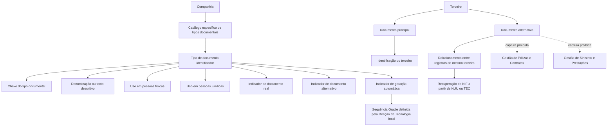

# Definição de Tipos de Documentos Identificativos de Terceiros no Sistema Reef

## 1. Metadados do Documento
- **Arquivo de Origem:** `Não informado`
- **Tipo de Documento:** `Especificação Técnica`
- **Domínio / Sistema:** `Reef / Mapfre`
- **Público-Alvo:** `Negócio, Operação, Desenvolvedores e Arquitetos`
- **Data/Versão Identificada:** `Não identificada`

---

## 2. Resumo Executivo & Contexto de Negócio

O documento descreve a definição, codificação e utilização de tipos de documentos identificativos de terceiros no núcleo do Sistema Reef. O contexto apresentado é o de uma entidade seguradora que precisa identificar inequivocamente pessoas físicas e jurídicas que interagem com a organização em seus processos de negócio.

Cada terceiro deve ser identificado mediante um tipo de documento e um código associado. O sistema disponibiliza um catálogo específico, inicialmente entregue vazio às entidades, para que os tipos de documentos identificadores sejam definidos e codificados no nível de cada companhia.

A especificação prevê que cada tipo documental possua uma chave e uma denominação ou texto descritivo. São apresentados exemplos corporativos e locais, como NIF, DNI, RFC, RUT e TIN, associados a países ou contextos específicos.

Além da identificação principal, o documento aborda documentos alternativos. Esses documentos permitem relacionar múltiplas identificações para o mesmo terceiro e recuperar, por exemplo, o NIF de uma pessoa a partir de uma chave de Número Único MAPFRE ou de TeCuidamos. Contudo, a captura de documentos alternativos é proibida nos processos de Gestão de Pólizas e Contratos e de Gestão de Sinistros e Prestações.

O documento também define a propriedade de geração automática do código documental. Quando essa propriedade for habilitada, a Direção de Tecnologia local deve definir e identificar o nome da sequência Oracle que será utilizada.

---

## 3. Arquitetura, Componentes & Tecnologias Envolvidas

Os componentes, domínios e tecnologias explicitamente citados são:

- **Sistema Reef:** Núcleo funcional que permite identificar e codificar tipos de documentos identificadores de terceiros.
- **Catálogo de informação específico:** Estrutura entregue vazia às entidades para cadastramento dos tipos documentais.
- **Companhia:** Nível organizacional no qual os tipos de documentos são definidos e denominados individualmente.
- **Terceiro:** Pessoa física ou jurídica identificada no sistema.
- **Documentos principais:** Tipos documentais utilizados como identificação habitual do terceiro.
- **Documentos alternativos:** Tipos documentais usados para identificar alternativamente o mesmo terceiro.
- **Gestão de Pólizas e Contratos:** Processo no qual a captura de documentos alternativos não é permitida.
- **Gestão de Sinistros e Prestações:** Processo no qual a captura de documentos alternativos não é permitida.
- **Direção de Tecnologia local:** Responsável por definir e identificar a sequência Oracle quando houver geração automática de código documental.
- **Oracle:** Tecnologia explicitamente citada como origem da sequência utilizada para geração automática de códigos.



**Nota de Análise:** O documento não detalha modelos de dados, contratos de API, métodos HTTP, integrações técnicas, estruturas de tabelas de banco de dados ou o mecanismo de relacionamento entre registros documentais.

---

## 4. Regras de Negócio, Especificações Funcionais & Processos

### 4.1. Identificação de terceiros

1. Nos processos próprios de uma entidade seguradora, é necessário identificar inequivocamente as pessoas físicas e jurídicas que interagem com a entidade.
2. A identificação de cada pessoa é realizada mediante:
   - Um **Tipo de Documento**.
   - Um **Código associado** ao Tipo de Documento.
3. O núcleo do Sistema Reef permite identificar e codificar os diferentes tipos de documentos identificadores de terceiros.
4. Os tipos de documentos podem ser utilizados para pessoas físicas, pessoas jurídicas ou ambos os tipos de pessoa.
5. Os tipos de documentos são armazenados em um catálogo específico de informação.
6. O catálogo é entregue às entidades sem conteúdo inicial.

### 4.2. Definição de tipo e nome de documento

1. A definição das tipologias de documentos identificadores é realizada no nível da companhia.
2. A companhia pode definir individualmente cada tipo documental.
3. Cada tipo documental pode possuir:
   - Uma chave.
   - Uma denominação ou texto descritivo.
4. O documento apresenta exemplos de tipos documentais associados a países ou contextos específicos.

### 4.3. Uso em pessoas físicas e jurídicas

1. A propriedade de uso em pessoas físicas indica se uma tipologia de documento é utilizada para:
   - Pessoas físicas.
   - Pessoas jurídicas.
   - Pessoas físicas e jurídicas indistintamente.
2. Quando a tipologia de documento for utilizada indistintamente para pessoas físicas e jurídicas, o atributo deve permanecer sem valor ou vazio em sua definição.

### 4.4. Documento real

1. A propriedade **Real** indica se a tipologia de documento identificador é ou não um tipo de documento real.
2. O documento não fornece critérios adicionais, valores permitidos ou exemplos operacionais para a classificação de documento real.

### 4.5. Documento alternativo

1. A propriedade **Documento Alternativo** indica se a tipologia de documento é utilizada para identificar o terceiro de forma alternativa.
2. Um terceiro pode possuir uma identificação habitual por um documento principal e identificações adicionais por documentos alternativos.
3. O exemplo apresentado identifica Juan Pérez Pérez habitualmente pelo tipo documental `NIF` e pelo código `50818773A`.
4. O mesmo terceiro também pode ser identificado alternativamente pelos tipos documentais:
   - `NUU`, com o valor `JUANPE`.
   - `TEC`, com o valor `57732-05-2022`.
5. Os registros relativos aos documentos NIF, NUU e TEC permanecem relacionados entre si.
6. O relacionamento entre registros permite chegar ao NIF de Juan Pérez Pérez a partir da chave do Número Único MAPFRE ou da chave de TeCuidamos.
7. A captura de documentos alternativos não é permitida e não deve ser permitida nos seguintes processos:
   - Gestão de Pólizas e Contratos.
   - Gestão de Sinistros e Prestações.

### 4.6. Geração automática

1. A propriedade **Generação Automática** indica se o código do documento associado à tipologia definida será gerado automaticamente durante o processo de captura de informações do terceiro.
2. Quando for definido que o código do documento será gerado automaticamente, a Direção de Tecnologia local deve:
   - Definir o nome da sequência Oracle.
   - Identificar o nome da sequência Oracle a ser utilizada.
3. O documento não especifica o formato do código gerado, a estratégia de numeração, regras de concorrência ou o nome de qualquer sequência Oracle.

### 4.7. Diretrizes corporativas de codificação

1. Corporativamente, não existe preferência ou recomendação para estabelecer ou padronizar a codificação dos Tipos de Documentos Identificadores no sistema.
2. A pergunta frequente apresentada refere-se à existência de recomendações operacionais locais para codificação, uso e definição das tipologias documentais.
3. A resposta apresentada informa que não há preferência ou recomendação corporativa de padronização para a codificação dos tipos de documentos.

---

## 5. Tabelas de Parâmetros, Ambientes e Estruturas de Dados

| Item / Parâmetro | Descrição / Função | Tipo / Valores / Formato | Ambiente / Observações |
| :--- | :--- | :--- | :--- |
| Tipo de Documento | Classifica o documento utilizado para identificar um terceiro. | Chave definida pela companhia. | Aplicável ao catálogo específico do Sistema Reef. |
| Código do Documento | Código associado ao tipo de documento para identificar o terceiro. | Não detalhado. | Pode ser gerado automaticamente, conforme propriedade configurada. |
| Denominação / Descrição | Nome ou texto descritivo de um tipo documental. | Texto. | Definido individualmente no nível da companhia. |
| Uso em Pessoas Físicas | Indica se a tipologia documental é utilizada por pessoas físicas. | Atributo não detalhado. | Deve permanecer vazio quando o uso for indistinto para pessoas físicas e jurídicas. |
| Uso em Pessoas Jurídicas | Indica se a tipologia documental é utilizada por pessoas jurídicas. | Atributo não detalhado. | Deve permanecer vazio quando o uso for indistinto para pessoas físicas e jurídicas. |
| Real | Indica se o tipo documental é um documento real. | Atributo não detalhado. | O documento não define valores ou critérios adicionais. |
| Documento Alternativo | Indica se a tipologia é utilizada como identificação alternativa do terceiro. | Atributo não detalhado. | Captura proibida em Gestão de Pólizas e Contratos e Gestão de Sinistros e Prestações. |
| Geração Automática | Indica se o código documental será gerado automaticamente durante a captura de informações do terceiro. | Atributo não detalhado. | Requer sequência Oracle definida e identificada pela Direção de Tecnologia local. |
| Sequência Oracle | Sequência utilizada quando a geração automática estiver habilitada. | Nome da sequência Oracle. | Deve ser definida e identificada pela Direção de Tecnologia local. |

### Exemplos de tipos de documentos identificadores

| Tipo de Documento | Descrição | País / Contexto |
| :--- | :--- | :--- |
| NIF | Número de Identificação Fiscal | Espanha |
| DNI | Documento Nacional de Identidade | Espanha |
| RFC | Registro Federal de Causantes | México |
| RUT | Rol Único Tributário | Chile |
| RUT | Registro Único Tributário | Colômbia |
| TIN | Tax Identification Number | Malta |

### Exemplo de documentos principal e alternativos

| Tipo de Documento | Valor | Papel no exemplo |
| :--- | :--- | :--- |
| NIF | 50818773A | Documento habitual de identificação de Juan Pérez Pérez. |
| NUU | JUANPE | Documento alternativo; relacionado ao registro NIF. |
| TEC | 57732-05-2022 | Documento alternativo; relacionado ao registro NIF. |

### Restrições por processo

| Processo | Regra aplicável a documentos alternativos | Observação |
| :--- | :--- | :--- |
| Gestão de Pólizas e Contratos | A captura não é permitida e não deve ser permitida. | Restrição explícita no documento. |
| Gestão de Sinistros e Prestações | A captura não é permitida e não deve ser permitida. | Restrição explícita no documento. |

---

## 6. Bateria de Perguntas & Respostas para RAG (FAQ Sintético)

### P1: Qual é a finalidade dos tipos de documentos identificadores de terceiros no Sistema Reef?
**R:** Os tipos de documentos identificadores permitem identificar inequivocamente pessoas físicas e jurídicas que interagem com uma entidade seguradora. Cada identificação é composta por um Tipo de Documento e um código associado a esse tipo.

### P2: Onde são definidos os tipos de documentos identificadores de terceiros?
**R:** As tipologias de documentos identificadores são definidas no nível da companhia. A companhia pode definir individualmente cada tipo mediante uma chave e uma denominação ou texto descritivo.

### P3: O catálogo de tipos documentais já vem preenchido no Sistema Reef?
**R:** Não. O documento informa que o catálogo específico de informação para os tipos de documentos identificadores é entregue às entidades vazio de conteúdo.

### P4: Como configurar um tipo de documento que pode ser usado tanto por pessoas físicas quanto por pessoas jurídicas?
**R:** Quando a tipologia do documento for utilizada indistintamente para pessoas físicas e jurídicas, o atributo que indica o uso em pessoas físicas ou jurídicas deve permanecer sem valor ou vazio em sua definição.

### P5: O que representa a propriedade “Real” de uma tipologia documental?
**R:** A propriedade “Real” indica se a tipologia do documento identificador é ou não um tipo de documento real. O documento não detalha critérios adicionais, valores permitidos ou regras para essa classificação.

### P6: O que é um documento alternativo no contexto de terceiros?
**R:** Um documento alternativo é uma tipologia documental utilizada para identificar um terceiro de forma alternativa à sua identificação habitual. No exemplo do documento, Juan Pérez Pérez é identificado habitualmente por NIF `50818773A`, mas também pode ser identificado por NUU `JUANPE` e TEC `57732-05-2022`.

### P7: Qual benefício é obtido pelo relacionamento entre documentos principal e alternativos?
**R:** O relacionamento entre registros documentais permite recuperar o NIF de Juan Pérez Pérez a partir da chave do Número Único MAPFRE ou da chave de TeCuidamos, pois os registros NIF, NUU e TEC estão relacionados entre si.

### P8: É permitido capturar documentos alternativos durante a Gestão de Pólizas e Contratos?
**R:** Não. A captura de documentos alternativos não é permitida e não deve ser permitida nos processos de Gestão de Pólizas e Contratos.

### P9: É permitido capturar documentos alternativos durante a Gestão de Sinistros e Prestações?
**R:** Não. A captura de documentos alternativos não é permitida e não deve ser permitida nos processos de Gestão de Sinistros e Prestações.

### P10: O que ocorre quando a geração automática do código do documento é habilitada?
**R:** Quando for definido que o código do documento será gerado automaticamente no processo de captura de informações do terceiro, a Direção de Tecnologia local deve definir e identificar o nome da sequência Oracle que será utilizada.

### P11: O documento define uma padronização corporativa para a codificação dos tipos de documentos identificadores?
**R:** Não. O documento informa que, corporativamente, não existe preferência nem recomendação para estabelecer ou padronizar a codificação dos Tipos de Documentos Identificadores no sistema.

### P12: Quais tipos documentais são exemplificados para Espanha, México, Chile, Colômbia e Malta?
**R:** O documento exemplifica NIF e DNI para Espanha, RFC para México, RUT para Chile, RUT para Colômbia e TIN para Malta. As descrições apresentadas são, respectivamente, Número de Identificação Fiscal, Documento Nacional de Identidade, Registro Federal de Causantes, Rol Único Tributário, Registro Único Tributário e Tax Identification Number.

---

## 7. Glossário de Termos, Siglas & Conceitos-Chave

- **DNI:** Documento Nacional de Identidade, apresentado como tipo de documento da Espanha.
- **Gestão de Pólizas e Contratos:** Processo no qual a captura de documentos alternativos não é permitida.
- **Gestão de Sinistros e Prestações:** Processo no qual a captura de documentos alternativos não é permitida.
- **NIF:** Número de Identificação Fiscal, apresentado como tipo de documento da Espanha.
- **NUU:** Tipo de documento alternativo apresentado no exemplo; o texto o relaciona ao Número Único MAPFRE.
- **Oracle:** Tecnologia citada como origem da sequência utilizada na geração automática do código documental.
- **RFC:** Registro Federal de Causantes, apresentado como tipo de documento do México.
- **Reef:** Sistema cujo núcleo permite identificar e codificar os tipos de documentos identificadores de terceiros.
- **RUT:** Sigla apresentada com dois significados: Rol Único Tributário no Chile e Registro Único Tributário na Colômbia.
- **TEC:** Tipo de documento alternativo apresentado no exemplo; o texto o associa a TeCuidamos.
- **TeCuidamos:** Referência associada ao documento alternativo TEC no exemplo apresentado.
- **TIN:** Tax Identification Number, apresentado como tipo de documento de Malta.
- **Terceiro:** Pessoa física ou jurídica que interage com a entidade seguradora e é identificada por um tipo de documento e código associado.
- **Tipo de Documento:** Tipologia utilizada para identificar terceiros no Sistema Reef.

---

## 8. Notas Críticas, Riscos & Limitações

- O documento não identifica o arquivo de origem, versão, data de publicação ou autor formal.
- O catálogo de tipos documentais é entregue vazio, exigindo definição local pela companhia.
- Não existe recomendação ou padronização corporativa para a codificação dos Tipos de Documentos Identificadores; essa ausência pode resultar em variações locais de codificação.
- A geração automática de códigos depende da atuação da Direção de Tecnologia local para definir e identificar a sequência Oracle aplicável.
- O documento não informa nomes de sequências Oracle, formatos de códigos, critérios de unicidade, regras de relacionamento nem mecanismos de validação.
- A captura de documentos alternativos possui restrições explícitas nos processos de Gestão de Pólizas e Contratos e Gestão de Sinistros e Prestações.
- O atributo **Real** é mencionado, mas não possui detalhamento operacional adicional.
- O documento referencia como leitura recomendada as “Atividades de Terceiros”, porém não fornece seu conteúdo.
- O trecho final do conteúdo bruto termina em `Consejo:` sem apresentar texto complementar; portanto, não é possível inferir a recomendação que seguiria esse marcador.

---

## 9. Conteúdo Bruto Estruturado (Referência Fiel)

```text
--- [PÁGINA 1 DE 2] ---

DEFINICIÓN de Tipos de Documentos Identicativos de Terceros
Contexto
En los diferentes procesos que se circunscriben en la actividad propia de una Entidad Aseguradora es necesario identicar inequívocamente
a las distintas personas físicas y/o jurídicas que de una u otra forma interactúan con la entidad, siendo así que para cada una de ellas la
identicación se realizará mediante el uso de un Tipo de Documento, y un Código asociado a este.
Propiedades Generales
Funcionalmente, el núcleo del Sistema cuenta con la posibilidad de identicar y codicar los distintos Tipos de Documentos Identicadores
de los Terceros, sean estos de uso en personas Físicas o Jurídicas, en un catálogo de información especíco que se entrega a las entidades
vacío de contenido.
Tipo y Nombre del documento
La denición de las Tipologías de los Documentos que identicarán a los Terceros en el sistema se realiza a nivel de la compañía pudiendo
denir y denominar individualmente cada uno de ellos mediante una clave y una denominación o texto descriptivo, e.g:
TIPO DE DOCUMENTO DESCRIPCIÓN
NIF - España Número de Identicación Fiscal
DNI - España Documento Nacional de Identidad
RFC - México Registro Federal de Causantes
RUT - Chile Rol Único Tributario
RUT - Colombia Registro único Tributario
TIN - Malta Tax Identication Number
Propiedades Operativas
Uso en Personas Físicas
Este atributo indica si la Tipología del Documento identicador se usa para personas Físicas, para personas Jurídicas o indistintamente para
unas u otras.
Documentation / DOCUMENTACIÓN Reef
DOCUMENTACIÓN Reef
Mapfredocument
DOCUMENTACIÓN Reef
Owner
user:agonzalez_mapfre.com
Lifecycle
Approved Source
 / 
 VL
Buscar Inicio Soluciones Arquitecturas APIs Componentes Cloud Documentación Zeus Reef Ayuda
ES


--- [PÁGINA 2 DE 2] ---

En el supuesto que la Tipología del Documento se utilice indistintamente para personas físicas y jurídicas este atributo debe dejarse sin
valor/vacío en su denición.
Real
Este atributo indica si la Tipología del Documento identicador es o no un tipo de documento real.
Documento Alternativo
Este atributo indica si la Tipología del Documento identicador es usado para identicar al Tercero de manera alternativa, e.g:
Tipo de Documento Valor
NIF - Nro. Id. Fiscal 50818773A
NUU - NUUMA 'JUANPE'
TEC - TeCuidamos 57732-05-2022
Lo habitual sería identicar a Juan Pérez Pérez con el tipo de documento ‘NIF’ y con el código 50818773A, si bien, el sistema también permite
identicar alternativamente a esta persona física con los otros dos tipos de documentos denidos como documentos alternativos ‘NUU’ y
‘TEC’.
De esta manera podremos llegar a conocer el NIF de Juan Pérez Pérez partiendo de la Clave del Número único de MAPFRE o de la clave de
TeCuidamos por estar los tres registros relacionados entre sí.
NOTA: La captura de los documentos Alternativos no está permitida ni debe permitirse en los procesos de Gestión de Pólizas y Contratos y
Gestión de Siniestros y Prestaciones.
Generación Automática
Esta propiedad le indica al sistema si el código del documento asociado a la tipología denida se generará o no de forma automática en el
proceso de captura de información del Tercero.
NOTA: En el supuesto que se haya denido que el código del documento se ha de generar automáticamente, es necesario que la Dirección de
Tecnología local dena e identique el nombre de la secuencia Oracle a ser utilizada.
Otras Propiedades
Vínculos
Relación de Directrices y Documentos funcionales cuya lectura recomendada para evitar que la interpretación aislada del presente
documento pueda conducir a error.
Actividades de Terceros
Preguntas frecuentes
(1) ¿Existe alguna recomendación operativa que deba ser tomada en consideración localmente en la codicación, uso y denición de las
tipologías de documentos en el Sistema?
Corporativamente no existe una preferencia ni recomendación para establecer o estandarizar en el sistema la codicación de los Tipos de
Documentos Identicadores.
Consejo:
```
