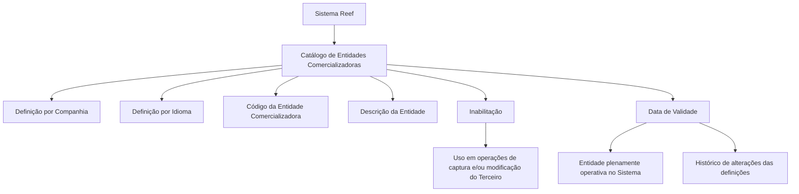
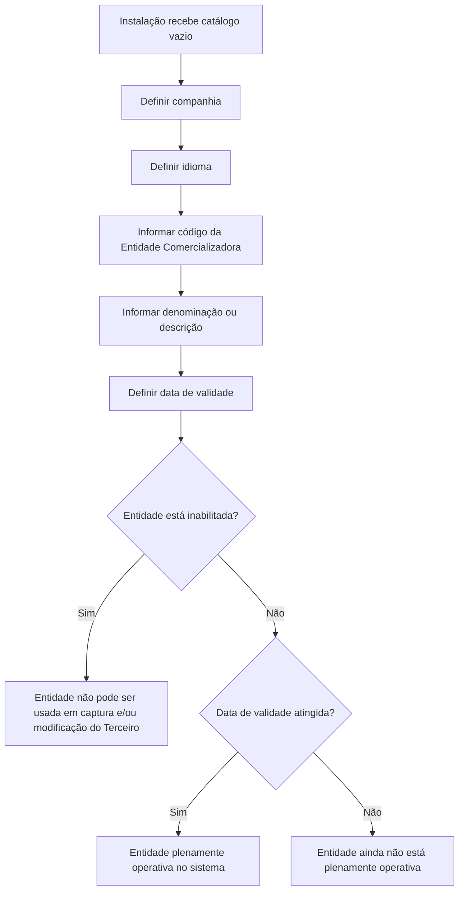

# Catálogo de Entidades Comercializadoras de Meios de Cobro e Pagamento de Terceiros — Documentação Reef

## 1. Metadados do Documento
- **Arquivo de Origem:** Não identificado no conteúdo extraído; referência visual a `Mapfredocument` e `DOCUMENTACIÓN Reef`
- **Tipo de Documento:** Especificação Funcional
- **Domínio / Sistema:** Reef / Medios de Cobro y Pago de los Terceros
- **Público-Alvo:** Negócio, Analistas Funcionais, Operação e Desenvolvedores
- **Data/Versão Identificada:** Não identificada

---

## 2. Resumo Executivo & Contexto de Negócio

O documento descreve a definição e a administração de **Entidades Comercializadoras dos Meios de Cobro e Pagamento de Terceiros** no núcleo do Sistema Reef. Essas entidades são classificadas em um catálogo de informação específico, entregue inicialmente sem conteúdo às instalações.

A definição das Entidades de Cobro e Pagamento ocorre por **companhia** e por **idioma**. Cada entidade pode ser identificada individualmente por um código e por uma denominação ou texto descritivo. Essa modelagem permite classificar entidades comercializadoras e viabilizar sua exploração posterior pelo sistema.

O catálogo suporta, como exemplos em espanhol, entidades bancárias, entidades emissoras de cartões de crédito e entidades FINTECH. O documento não determina uma codificação corporativa obrigatória ou um padrão corporativo para o uso das entidades.

Além das propriedades de identificação, o documento define controles operacionais para inabilitação e data de validade. A inabilitação impede o uso de uma entidade nas operações de captura e/ou modificação de Terceiros; a data de validade indica quando uma entidade passa a estar plenamente operacional e permite manter histórico das alterações realizadas.

---

## 3. Arquitetura, Componentes & Tecnologias Envolvidas

### Componentes e conceitos identificados

| Componente / Conceito | Papel descrito |
| :--- | :--- |
| Sistema Reef | Sistema cujo núcleo permite identificar e classificar as Entidades Comercializadoras. |
| Catálogo de informação específico | Repositório lógico para classificação das Entidades Comercializadoras dos Meios de Cobro e Pagamento de Terceiros. |
| Entidade Comercializadora | Entidade de Cobro e Pagamento classificada no sistema por código, companhia, idioma e descrição. |
| Companhia | Contexto organizacional sobre o qual é realizada a definição da entidade. |
| Idioma | Idioma empregado na definição da Entidade Comercializadora. |
| Terceiro | Entidade cujas operações de captura e/ou modificação podem utilizar Entidades de Cobro e Pagamento. |
| Meios de Cobro e Pagamento | Tema funcional associado às entidades classificadas no catálogo. |



**Nota de Análise:** O conteúdo não detalha arquitetura técnica de infraestrutura, APIs, métodos HTTP, contratos JSON, bancos de dados, tecnologias de implementação, ambientes ou integrações externas.

---

## 4. Regras de Negócio, Especificações Funcionais & Processos

### Regras de definição e classificação

1. O núcleo do Sistema Reef permite identificar e classificar diferentes Entidades Comercializadoras dos Meios de Cobro e Pagamento de Terceiros.
2. As Entidades Comercializadoras são mantidas em um catálogo de informação específico.
3. O catálogo é entregue inicialmente às instalações sem conteúdo.
4. A definição de Entidades de Cobro e Pagamento é realizada por companhia.
5. A definição de Entidades de Cobro e Pagamento é realizada por idioma.
6. Cada Entidade Comercializadora pode possuir uma denominação ou texto descritivo para sua identificação individual.
7. O código da Entidade Comercializadora permite classificar entidades no sistema para posterior exploração.

### Regras de utilização e vigência

1. Quando a propriedade **Inhabilitación** estiver aplicada, a Entidade de Cobro e Pagamento fica inabilitada para utilização nas operações de captura e/ou modificação do Terceiro.
2. A propriedade **Fecha de Validez** determina a data a partir da qual a Entidade de Cobro e Pagamento está plenamente operativa no sistema.
3. O uso correto da data de validade permite manter um histórico das mudanças efetuadas nas definições das Entidades de Cobro e Pagamento.
4. Não existe preferência ou recomendação corporativa para estabelecer ou padronizar a codificação das Entidades de Cobro e Pagamento no sistema.

### Fluxo funcional de cadastro e disponibilidade



---

## 5. Tabelas de Parâmetros, Ambientes e Estruturas de Dados

| Item / Parâmetro | Descrição / Função | Tipo / Valores / Formato | Ambiente / Observações |
| :--- | :--- | :--- | :--- |
| Companhia | Indica o código da companhia sobre a qual é realizada a definição da Entidade Comercializadora. | Código de companhia; formato não detalhado. | A definição ocorre por companhia. |
| Idioma | Indica o idioma empregado na definição da Entidade Comercializadora do Meio de Cobro/Pagamento. | Exemplos: espanhol, inglês. | A definição ocorre por idioma. |
| Código da Entidade Comercializadora | Permite classificar no sistema as Entidades Comercializadoras dos Meios de Cobro/Pagamento do Terceiro. | Código; formato não detalhado. | Permite posterior exploração das entidades. Não há padronização corporativa de codificação. |
| Descrição da Entidade do Meio de Cobro e Pagamento | Indica a denominação ou descrição da Entidade do Terceiro. | Texto descritivo. | Utilizada para identificação individual. |
| Inabilitação | Indica que a Entidade de Cobro e Pagamento não pode ser utilizada. | Estado de inabilitação; valores não detalhados. | Bloqueia uso em operações de captura e/ou modificação do Terceiro. |
| Data de Validade | Indica quando a Entidade de Cobro e Pagamento torna-se plenamente operativa. | Data; formato não detalhado. | Permite histórico das mudanças das definições. |

### Exemplos de códigos e descrições em idioma espanhol

| Código | Descrição |
| :--- | :--- |
| 1 | Entidad Bancaria |
| 10 | Entidad Emisora de Tarjetas de Crédito |
| 100 | Entidad FINTECH |

**Nota de Análise:** O documento não especifica tipos técnicos de dados, obrigatoriedade de campos, tamanhos máximos, regras de unicidade, mecanismo de persistência ou regras de validação de formato.

---

## 6. Bateria de Perguntas & Respostas para RAG (FAQ Sintético)

### P1: Qual é a finalidade do catálogo de Entidades Comercializadoras no Sistema Reef?
**R:** O catálogo permite identificar e classificar as diferentes Entidades Comercializadoras dos Meios de Cobro e Pagamento de Terceiros. Ele é um catálogo de informação específico, inicialmente entregue vazio às instalações, destinado à posterior exploração das entidades classificadas.

### P2: Por quais dimensões uma Entidade de Cobro e Pagamento é definida no Sistema Reef?
**R:** A Entidade de Cobro e Pagamento é definida por companhia e por idioma. A companhia indica o código organizacional sobre o qual a definição é realizada, enquanto o idioma identifica a língua usada na definição, como espanhol ou inglês.

### P3: Para que serve o código da Entidade Comercializadora?
**R:** O código permite classificar no sistema as Entidades Comercializadoras dos Meios de Cobro e Pagamento do Terceiro. Essa classificação permite a exploração posterior dessas entidades no Sistema Reef.

### P4: O documento estabelece uma codificação corporativa obrigatória para Entidades de Cobro e Pagamento?
**R:** Não. O documento afirma expressamente que não existe, no âmbito corporativo, uma preferência ou recomendação para estabelecer ou padronizar a codificação das Entidades de Cobro e Pagamento no sistema.

### P5: O que acontece quando uma Entidade de Cobro e Pagamento está inabilitada?
**R:** Uma Entidade de Cobro e Pagamento inabilitada não pode ser utilizada nas operações de captura e/ou modificação do Terceiro.

### P6: Qual é a finalidade da Data de Validade de uma Entidade de Cobro e Pagamento?
**R:** A Data de Validade informa a partir de qual data a Entidade de Cobro e Pagamento está plenamente operativa no sistema. Seu uso correto permite preservar um histórico dos cambios efetuados nas definições das entidades.

### P7: Quais são os exemplos de Entidades Comercializadoras apresentados no documento?
**R:** O documento apresenta, em espanhol, os seguintes exemplos: código `1` para `Entidad Bancaria`, código `10` para `Entidad Emisora de Tarjetas de Crédito` e código `100` para `Entidad FINTECH`.

### P8: O catálogo de Entidades Comercializadoras já vem preenchido para as instalações?
**R:** Não. O documento informa que o catálogo de informação específico é entregue inicialmente às instalações vazio de conteúdo.

### P9: Qual propriedade contém o nome da Entidade do Terceiro?
**R:** A propriedade **Descripción de la Entidad del Medio de Cobro y Pago** indica a denominação ou descrição da Entidade do Terceiro.

### P10: O documento detalha APIs, métodos HTTP ou contratos JSON para o catálogo?
**R:** Não. O documento descreve propriedades funcionais do catálogo, mas não detalha APIs, métodos HTTP, contratos JSON, modelos técnicos de persistência ou integrações.

---

## 7. Glossário de Termos, Siglas & Conceitos-Chave

- **Reef:** Sistema citado como responsável por disponibilizar o núcleo funcional de identificação e classificação das Entidades Comercializadoras.
- **Entidade Comercializadora:** Entidade associada aos Meios de Cobro e Pagamento de Terceiros, definida e classificada no sistema.
- **Entidade de Cobro e Pagamento:** Termo usado no documento para a entidade que pode ser definida por companhia e idioma e utilizada em operações relacionadas a Terceiros.
- **Meios de Cobro e Pagamento:** Meios relacionados a operações de recebimento e pagamento de Terceiros.
- **Terceiro:** Entidade para a qual podem ocorrer operações de captura e/ou modificação utilizando Entidades de Cobro e Pagamento.
- **Inhabilitación:** Propriedade que impede a utilização da Entidade de Cobro e Pagamento em operações de captura e/ou modificação do Terceiro.
- **Fecha de Validez:** Propriedade que estabelece quando a Entidade de Cobro e Pagamento torna-se plenamente operativa no sistema.
- **Entidad Bancaria:** Exemplo de Entidade Comercializadora com código `1`.
- **Entidad Emisora de Tarjetas de Crédito:** Exemplo de Entidade Comercializadora com código `10`.
- **Entidad FINTECH:** Exemplo de Entidade Comercializadora com código `100`.
- **FINTECH:** Termo apresentado como descrição de uma entidade comercializadora; o documento não expande a sigla.

---

## 8. Notas Críticas, Riscos & Limitações

- O catálogo é inicialmente disponibilizado vazio; a completude das informações depende do processo de definição nas instalações.
- Não existe recomendação corporativa para padronizar a codificação das Entidades de Cobro e Pagamento. Essa ausência pode gerar divergências locais na atribuição de códigos.
- O documento não detalha critérios de validação para códigos, descrições, datas, companhia ou idioma.
- O documento não informa se a unicidade do código é avaliada globalmente, por companhia, por idioma ou por outra combinação de atributos.
- O documento não especifica o comportamento do sistema para entidades inabilitadas que já tenham sido utilizadas previamente.
- O documento cita vínculos para “Medios de Cobro y Pago” e “Preguntas frecuentes”, mas o conteúdo extraído não apresenta os documentos relacionados.
- Não há detalhamento técnico sobre interfaces, APIs, permissões, auditoria, infraestrutura, bancos de dados ou integração entre sistemas.

---

## 9. Conteúdo Bruto Estruturado (Referência Fiel)

```text
--- [PÁGINA 1 DE 2] ---

DEFINICIÓN de las ENTIDADES COMERCIALIZADORAS de los Medios
de Cobro y Pago de los Terceros
Propiedades Generales
Funcionalmente, el núcleo del Sistema cuenta con la posibilidad de identicar y clasicar las diferentes Entidades Comercializadoras de los
Medios de Cobro y Pago de los Terceros en un catálogo de información especíco que se entrega inicialmente a las instalaciones vacío de
contenido.
La denición de estas Entidades de Cobro y Pago en el Sistema se realiza por compañía e idioma (Español , Inglés, ...) pudiendo denominar e
identicar individualmente cada una de ellas mediante una denominación o texto descriptivo.
Compañía
Esta propiedad le indica al sistema el código de la compañía sobre la que se está realizando la denición de la Entidad Comercializadora.
Idioma
Esta propiedad le indica al sistema el Idioma empleado en la denición de la Entidad Comercializadora del Medio de Cobro/Pago, como por
ejemplo: español, inglés,...
Código de la Entidad Comercializadora
Esta propiedad permite clasicar en el sistema las Entidades Comercializadoras de los Medios de Cobro/Pago del Tercero, lo que permite su
posterior explotación.
Descripción de la Entidad del Medio de Cobro y Pago
Esta propiedad le indica al sistema cual es la denominación o descripción de la Entidad del Tercero.
A modo de ejemplo en idioma español:
CÓDIGO ENTIDAD DESCRIPCIÓN
1 Entidad Bancaria
10 Entidad Emisora de Tarjetas de Crédito
100 Entidad FINTECH
... ...
Documentation / DOCUMENTACIÓN Reef
DOCUMENTACIÓN Reef
Mapfredocument
DOCUMENTACIÓN Reef
Owner
user:agonzalez_mapfre.com
Lifecycle
Approved Source
 / 
 VL
Buscar Inicio Soluciones Arquitecturas APIs Componentes Cloud Documentación Zeus Reef Ayuda
ES


--- [PÁGINA 2 DE 2] ---

Otras Propiedades
Inhabilitación
Esta propiedad le indica al Sistema que la Entidad de Cobro y Pago está inhabilitada para poder ser utilizada en las operaciones de captura
y/o modicación del Tercero.
Fecha de Validez
Esta propiedad le indica al Sistema la fecha a partir de la cual la Entidad de Cobro y Pago está plenamente operativa en el sistema por lo que
su correcto uso permite tener un histórico de los cambios efectuados en sus deniciones.
Vínculos
Relación de Directrices y Documentos funcionales cuya lectura recomendada para evitar que la interpretación aislada del presente
documento pueda conducir a error.
Medios de Cobro y Pago
Preguntas frecuentes
(1) ¿Existe alguna recomendación operativa que deba ser tomada en consideración localmente en la codicación, uso y denición de las
Entidades de Cobro y Pago que pueden ser utilizadas en el Sistema?
No existe Corporativamente una preferencia o recomendación para establecer o estandarizar en el sistema su codicación.
```
