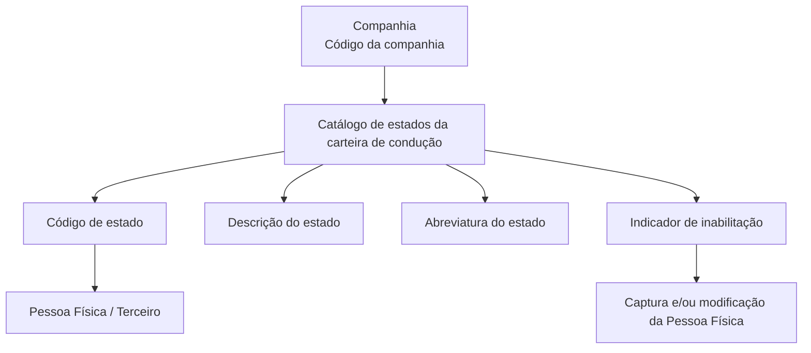

# Definição dos Estados da Carteira de Habilitação — Catálogo de Terceiros no Sistema Reef

## 1. Metadados do Documento
- **Arquivo de Origem:** `Não identificado no conteúdo fornecido`
- **Tipo de Documento:** Especificação Técnica / Documentação Funcional
- **Domínio / Sistema:** Reef / Gestão de Terceiros / Carteira ou Licença de Condução
- **Público-Alvo:** Analistas funcionais, desenvolvedores, operação e administradores de cadastros
- **Data/Versão Identificada:** Não identificada

---

## 2. Resumo Executivo & Contexto de Negócio

O documento define o catálogo de estados aplicáveis à carteira ou licença de condução de Pessoas Físicas no núcleo do Sistema Reef. O catálogo permite identificar e codificar as situações em que uma licença ou permissão de condução pode se encontrar.

A definição é realizada por companhia. A propriedade **Compañía** informa ao sistema o código da companhia para a qual está sendo configurado o status da carteira de condução de um Terceiro.

Cada estado possui um código interno, uma descrição e uma abreviatura. Entre os exemplos fornecidos estão os estados `001 — En Vigor`, `CAD — Caducado` e `04A — Suspendido`.

O documento estabelece uma distinção funcional crítica: o catálogo representa possíveis estados da carteira de condução do Terceiro, e não os estados percorridos pelo processo de tramitação, emissão ou processamento da carteira/licença.

Também existe uma propriedade de inabilitação. Quando um Código de Estado de Carteira de Condução está marcado como inabilitado, ele não pode ser utilizado nas operações de captura e/ou modificação da Pessoa Física.

---

## 3. Arquitetura, Componentes & Tecnologias Envolvidas

Os componentes e conceitos identificados são:

- **Sistema Reef:** sistema no qual o catálogo de estados é configurado.
- **Núcleo do Sistema:** componente funcional que suporta a identificação e codificação dos estados das licenças ou permissões.
- **Catálogo de informação específico:** catálogo entregue vazio às entidades e destinado à configuração dos estados de carteira de condução.
- **Pessoa Física:** entidade de Terceiro associada aos dados de carteira ou licença de condução.
- **Companhia:** contexto organizacional identificado por código, no qual a definição de estado é realizada.
- **Documentación Reef / Mapfredocument:** referências de navegação e documentação exibidas no conteúdo bruto.
- **Actividades de Terceros:** documento funcional relacionado cuja leitura é recomendada.



> **Nota de Análise:** O conteúdo não descreve arquitetura de infraestrutura, integrações, APIs, métodos HTTP, contratos JSON, bancos de dados, URLs de ambiente ou tecnologias de implementação.

---

## 4. Regras de Negócio, Especificações Funcionais & Processos

1. O núcleo do Sistema Reef permite identificar e codificar os diferentes estados ou situações de licenças ou permissões de condução de Pessoas Físicas.

2. Os estados são mantidos em um catálogo de informação específico.

3. O catálogo de informação específico é entregue às entidades sem conteúdo inicial.

4. A propriedade **Compañía** informa o código da companhia sobre a qual está sendo realizada a definição do status da carteira de condução do Terceiro.

5. O **Código de Estado** representa a existência e a geração de um código interno relacionado à informação do Terceiro associado à atividade.

6. Os exemplos de codificação apresentados são:
   - `001` para **En Vigor**.
   - `CAD` para **Caducado**.
   - `04A` para **Suspendido**.

7. A **Descrição do Estado da Licença de condução** determina a denominação ou descrição do status da carteira de condução.

8. A **Abreviatura do Estado da Licença de condução** determina a abreviatura do estado da carteira de condução.

9. A propriedade **Inhabilitación** informa que determinado Código de Estado da Carteira de Condução está inabilitado para uso em operações de captura e/ou modificação da Pessoa Física.

10. O catálogo de estados da carteira de condução não deve ser confundido com os estados pelos quais passa o processo de tramitação da carteira ou licença de condução.

11. Não existe preferência ou recomendação corporativa para estabelecer ou padronizar localmente a codificação e o uso dos possíveis estados de carteira de condução no sistema.

---

## 5. Tabelas de Parâmetros, Ambientes e Estruturas de Dados

| Item / Parâmetro | Descrição / Função | Tipo / Valores / Formato | Ambiente / Observações |
| :--- | :--- | :--- | :--- |
| Companhia | Identifica o código da companhia sobre a qual é definida a situação da carteira de condução do Terceiro. | Código de companhia; formato não detalhado. | Aplicável à definição do status da carteira de condução. |
| Código de Estado | Código interno associado à informação do Terceiro e ao estado da carteira de condução. | Exemplos: `001`, `CAD`, `04A`. | Não deve ser confundido com estados do processo de tramitação da licença. |
| Descrição do Estado da Licença de Condução | Define a denominação ou descrição do status da carteira de condução. | Texto. | Exemplos: `En Vigor`, `Caducado`, `Suspendido`. |
| Abreviatura do Estado da Licença de Condução | Define a abreviatura do estado da carteira de condução. | Texto; formato não detalhado. | O conteúdo não fornece exemplos específicos de abreviaturas. |
| Inhabilitación | Indica que o Código de Estado não pode ser utilizado. | Indicador; valores/formato não detalhados. | Bloqueia uso em captura e/ou modificação da Pessoa Física. |
| Catálogo de estados | Catálogo específico com situações possíveis da carteira ou licença de condução. | Catálogo inicialmente vazio para as entidades. | Configurado no Sistema Reef. |
| Estado `001` | Estado de carteira de condução em vigor. | Código: `001`; descrição: `En Vigor`. | Exemplo fornecido pelo documento. |
| Estado `CAD` | Estado de carteira de condução caducada. | Código: `CAD`; descrição: `Caducado`. | Exemplo fornecido pelo documento. |
| Estado `04A` | Estado de carteira de condução suspensa. | Código: `04A`; descrição: `Suspendido`. | Exemplo fornecido pelo documento. |
| Padronização corporativa | Preferência corporativa para codificação dos estados. | Não aplicável. | Não existe recomendação corporativa de padronização. |

---

## 6. Bateria de Perguntas & Respostas para RAG (FAQ Sintético)

### P1: Qual é a finalidade do catálogo de estados da carteira de condução no Sistema Reef?
**R:** O catálogo permite identificar e codificar os diferentes estados ou situações em que podem se encontrar licenças ou permissões de condução de Pessoas Físicas. O catálogo é específico para a informação de carteira de condução do Terceiro.

### P2: O catálogo de estados da carteira de condução vem preenchido para as entidades?
**R:** Não. O documento informa que o catálogo de informação específico é entregue às entidades vazio de conteúdo.

### P3: O que representa a propriedade Companhia na definição de estados da carteira de condução?
**R:** A propriedade Companhia indica ao Sistema Reef o código da companhia sobre a qual está sendo realizada a definição do status da carteira de condução do Terceiro.

### P4: Quais exemplos de códigos de estado de carteira de condução são fornecidos?
**R:** O documento apresenta `001` para `En Vigor`, `CAD` para `Caducado` e `04A` para `Suspendido`.

### P5: O que é definido pela descrição do estado da licença de condução?
**R:** A descrição do estado define a denominação ou descrição do status da carteira de condução no sistema.

### P6: Para que serve a abreviatura do estado da licença de condução?
**R:** A abreviatura do estado da licença de condução informa ao sistema a forma abreviada do estado da carteira de condução. O documento não apresenta exemplos de abreviaturas.

### P7: O que ocorre quando um Código de Estado está inabilitado?
**R:** Quando um Código de Estado da Carteira de Condução está inabilitado, ele não pode ser empregado nas operações de captura e/ou modificação da Pessoa Física.

### P8: Os estados deste catálogo representam as etapas do processo de tramitação da carteira de condução?
**R:** Não. O documento destaca que os estados do catálogo representam possíveis estados da carteira de condução do Terceiro e não devem ser confundidos com os estados do processo de tramitação da carteira ou licença.

### P9: Existe uma codificação corporativa obrigatória para os estados da carteira de condução?
**R:** Não. O documento informa que não existe, corporativamente, uma preferência ou recomendação para estabelecer ou padronizar a codificação e o uso dos possíveis estados no sistema.

### P10: Qual documento funcional relacionado deve ser consultado para evitar interpretação isolada?
**R:** O documento recomenda a leitura de diretrizes e documentos funcionais relacionados, citando **Actividades de Terceros** como vínculo relevante.

---

## 7. Glossário de Termos, Siglas & Conceitos-Chave

- **Reef:** Sistema citado como contexto da documentação e do catálogo de estados. O significado da sigla ou nome não é detalhado.
- **Terceiro:** Pessoa associada à atividade e à informação de carteira ou licença de condução; o documento refere-se especificamente a Pessoas Físicas.
- **Pessoa Física:** Entidade de Terceiro para a qual são registrados ou modificados dados de carteira ou licença de condução.
- **Companhia:** Unidade identificada por código, usada como contexto para a definição do status da carteira de condução.
- **Catálogo de Estados:** Catálogo específico que contém os possíveis estados da carteira ou licença de condução.
- **Código de Estado:** Código interno que identifica um estado da carteira de condução.
- **Inhabilitación:** Propriedade que impede o uso de um Código de Estado nas operações de captura e/ou modificação da Pessoa Física.
- **En Vigor:** Descrição de exemplo para o código de estado `001`.
- **Caducado:** Descrição de exemplo para o código de estado `CAD`.
- **Suspendido:** Descrição de exemplo para o código de estado `04A`.
- **VL:** Sigla exibida na navegação do conteúdo original, sem definição adicional no documento.
- **Mapfredocument:** Termo exibido na área de documentação; o conteúdo não detalha sua função.

---

## 8. Notas Críticas, Riscos & Limitações

- O documento não especifica o formato técnico, tamanho, obrigatoriedade ou mecanismo de geração do **Código de Estado**.
- O documento não informa os valores permitidos para a propriedade **Inhabilitación**, nem descreve como a inabilitação é implementada ou validada tecnicamente.
- Não há detalhamento de telas, APIs, serviços, integrações, permissões, banco de dados, logs, ambientes ou URLs.
- A ausência de uma recomendação corporativa para padronização dos códigos pode resultar em divergências de codificação entre entidades ou companhias.
- Existe risco de interpretação incorreta caso os estados do catálogo sejam tratados como etapas de tramitação da carteira ou licença de condução.
- A leitura de documentos relacionados, incluindo **Actividades de Terceros**, é recomendada para evitar interpretação isolada do conteúdo.

---

## 9. Conteúdo Bruto Estruturado (Referência Fiel)

```text
--- [PÁGINA 1 DE 2] ---

DEFINICIÓN de los Estados del Permiso de Conducir
Propiedades Generales
Funcionalmente, el núcleo del Sistema cuenta con la posibilidad de identificar y codificar las diferentes estados o situaciones en los que se
pueden encontrar las licencias o permisos de conducción de las Personas Físicas en un catálogo de información específico que se entrega a
las entidades vacío de contenido.
Compañía
Esta propiedad le indica al sistema el código de la compañía sobre la que se está realizando la definición del status del carnet de conducir del
Tercero.
Código de Estado
Esta propiedad le indica al Sistema si la información del Tercero asociado a la actividad contempla o no la existencia y generación de un
código interno del Tercero.
A modo de ejemplo,
STATUS DESCRIPCIÓN
001 En Vigor
CAD Caducado
04A Suspendido
... ...
IMPORTANTE: No confundir la definición de este catálogo que contempla los posibles estados del carnet de conducir del Tercero, con los
estados por los que pasa el proceso de tramitación del carnet o licencia de conducir.
Descripción del Estado de la Licencia de conducir
Esta propiedad le indica al sistema cual es la denominación o descripción del status del carnet de conducir.
Abreviatura del Estado de la Licencia de conducir
Esta propiedad le indica al sistema cual es la abreviatura del estado del carnet de conducir.
Documentation / DOCUMENTACIÓN Reef
DOCUMENTACIÓN Reef
Mapfredocument
DOCUMENTACIÓN Reef
Owner
user:agonzalez_mapfre.com
Lifecycle
Approved Source
 /
VL
Buscar Inicio Soluciones Arquitecturas APIs Componentes Cloud Documentación Zeus Reef Ayuda
ES

--- [PÁGINA 2 DE 2] ---

Otras Propiedades
Inhabilitación
Esta propiedad le indica al sistema que el Código de Estado del Carnet de Conducir está inhabilitado para poder ser empleado en las
operaciones de captura y/o modificación de la persona física.
Vínculos
Relación de Directrices y Documentos funcionales cuya lectura recomendada para evitar que la interpretación aislada del presente
documento pueda conducir a error.
Actividades de Terceros
Preguntas frecuentes
(1) ¿Existe alguna recomendación operativa que deba ser tomada en consideración localmente en la codificación y uso de los posibles
estados del Carnet de Conducir de las personas físicas en el Sistema?
No existe Corporativamente una preferencia o recomendación para establecer o estandarizar en el sistema su codificación en el sistema.
```
