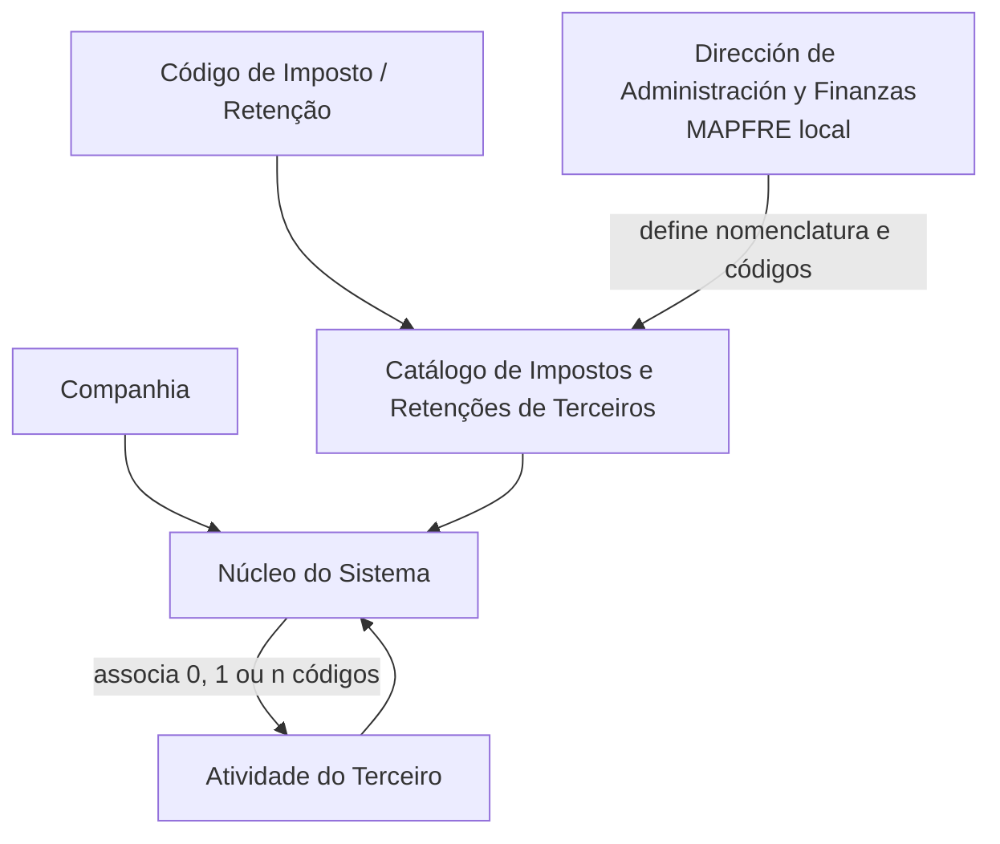

# Definição de Impostos e Retenções por Atividade de Terceiros

## 1. Metadados do Documento
- **Arquivo de Origem:** Não identificado no conteúdo fornecido
- **Tipo de Documento:** Especificação Funcional
- **Domínio / Sistema:** DOCUMENTACIÓN Reef / MAPFRE — Tesouraria e cadastro de terceiros
- **Público-Alvo:** Negócio, Administração e Finanças, desenvolvedores e operação
- **Data/Versão Identificada:** Não identificada

---

## 2. Resumo Executivo & Contexto de Negócio

O documento descreve a definição e a associação de impostos e retenções às atividades de terceiros no sistema. O contexto apresentado determina que entidades seguradoras devem reter ou realizar ingresso em conta ao pagar ou creditar rendas sujeitas a retenção ou ingresso em conta.

As obrigações fiscais mencionadas abrangem rendimentos derivados de atividades profissionais e outras rendas sujeitas a retenção, conforme os artigos relativos ao Imposto de Renda de pessoas físicas ou jurídicas e conforme a legislação local aplicável.

Funcionalmente, o núcleo do sistema permite identificar e associar zero, um ou múltiplos códigos de impostos ou retenções a uma atividade de terceiro. O catálogo de informações é entregue inicialmente vazio para as entidades.

A associação é realizada considerando, no mínimo, a companhia, o código de atividade do terceiro e o código de imposto ou retenção do terceiro. O documento exemplifica a atividade `1 - Asegurados` e os códigos `EXE`, `R10`, `R15` e `IVA`.

A nomenclatura e a definição dos códigos de retenção e impostos são responsabilidade da Dirección de Administración y Finanzas da entidade MAPFRE local. A leitura de documentos funcionais correlatos é recomendada para impedir interpretações isoladas incorretas.

---

## 3. Arquitetura, Componentes & Tecnologias Envolvidas

O conteúdo não descreve arquitetura técnica de infraestrutura, interfaces, protocolos, bancos de dados ou tecnologias de implementação. A estrutura funcional identificada é composta por:

- **Núcleo do Sistema:** identifica e associa códigos de impostos ou retenções às atividades de terceiros.
- **Catálogo de Impostos e Retenções de Terceiros:** catálogo inicialmente vazio entregue às entidades.
- **Companhia:** código da companhia para a qual é realizada a associação.
- **Atividade do Terceiro:** classificação funcional do terceiro, como segurados, agentes, clínicas ou peritos.
- **Código de Imposto / Retenção:** código associado à atividade do terceiro.
- **Dirección de Administración y Finanzas da entidade MAPFRE local:** responsável pela nomenclatura e definição dos códigos.



> **Nota de Análise:** o documento não detalha métodos HTTP, contratos JSON, persistência, autenticação, integrações, ambientes, URLs ou tecnologias utilizadas pelo núcleo do sistema.

---

## 4. Regras de Negócio, Especificações Funcionais & Processos

1. Entidades seguradoras estão obrigadas a reter ou ingressar em conta quando satisfazem ou pagam rendas sujeitas a retenção ou ingresso em conta.
2. A obrigação abrange rendimentos derivados de atividades profissionais.
3. A obrigação também abrange rendas sujeitas a retenção segundo os termos estabelecidos nos artigos do Imposto de Renda de pessoas físicas ou jurídicas.
4. A obrigação deve respeitar a legislação local.
5. O núcleo do sistema permite identificar códigos de impostos ou retenções relacionados a atividades de terceiros.
6. Uma atividade de terceiro pode possuir:
   - nenhum código associado (`0`);
   - um código associado (`1`);
   - múltiplos códigos associados (`n`).
7. O catálogo de impostos e retenções é entregue inicialmente vazio às entidades.
8. A propriedade **Companhia** informa o código da companhia sobre a qual é executada a associação entre imposto ou retenção e atividade do terceiro.
9. A propriedade **Código de Atividade do Terceiro** identifica a atividade do terceiro no sistema.
10. Exemplos de atividades de terceiros apresentados: Asegurados, Agentes, Clínicas e Peritos.
11. A propriedade **Código do Imposto / Retenção do Terceiro** identifica o código de imposto ou retenção associado à atividade do terceiro.
12. Para a atividade `1 - Asegurados`, o documento apresenta os códigos `EXE`, `R10`, `R15` e `IVA`.
13. A responsabilidade pela nomenclatura e definição dos códigos de retenção e impostos pertence à Dirección de Administración y Finanzas da entidade MAPFRE local.
14. A interpretação do documento deve considerar também as diretrizes e documentos funcionais relacionados indicados como leitura recomendada.

---

## 5. Tabelas de Parâmetros, Ambientes e Estruturas de Dados

| Item / Parâmetro | Descrição / Função | Tipo / Valores / Formato | Ambiente / Observações |
| :--- | :--- | :--- | :--- |
| Companhia | Indica o código da companhia sobre a qual é realizada a associação do imposto ou retenção à atividade do terceiro. | Código de companhia; formato não detalhado. | Não detalhado. |
| Código de Atividade do Terceiro | Indica o código da atividade do terceiro no sistema. | Exemplos de atividades: Asegurados, Agentes, Clínicas, Peritos. | Não detalhado. |
| Código do Imposto / Retenção do Terceiro | Indica o código do imposto ou retenção associado à atividade do terceiro. | Código de imposto ou retenção; formato não detalhado. | Pode haver 0, 1 ou n códigos associados por atividade. |
| Catálogo de Impostos e Retenções de Terceiros | Repositório de informações de códigos de impostos e retenções associados a atividades de terceiros. | Catálogo inicialmente vazio. | A definição local dos códigos é responsabilidade da Administração e Finanças MAPFRE local. |

| Código apresentado | Significado | Atividade associada no exemplo | Observações |
| :--- | :--- | :--- | :--- |
| EXE | Tercero Exento | `1 - Asegurados` | Código apresentado como exemplo. |
| R10 | Retención 10% | `1 - Asegurados` | Código apresentado como exemplo. |
| R15 | Retención 15% | `1 - Asegurados` | Código apresentado como exemplo. |
| IVA | IVA | `1 - Asegurados` | O documento não expande a sigla. |

| Documento ou referência relacionada | Finalidade informada |
| :--- | :--- |
| Actividades de Terceros | Leitura recomendada para evitar interpretação isolada incorreta. |
| Códigos de Impuestos y Retenciones - Tesorería | Leitura recomendada para evitar interpretação isolada incorreta. |

---

## 6. Bateria de Perguntas & Respostas para RAG (FAQ Sintético)

### P1: Qual é a finalidade do catálogo de impostos e retenções de terceiros?
**R:** O catálogo permite que o núcleo do sistema identifique e associe códigos de impostos ou retenções às atividades de terceiros. O catálogo é entregue inicialmente vazio às entidades.

### P2: Quantos códigos de imposto ou retenção podem ser associados a uma atividade de terceiro?
**R:** Uma atividade de terceiro pode ter zero, um ou múltiplos códigos de impostos ou retenções associados.

### P3: Qual é a função da propriedade Companhia na associação de impostos e retenções?
**R:** A propriedade Companhia informa o código da companhia sobre a qual está sendo realizada a associação do imposto ou retenção à atividade do terceiro.

### P4: O que representa o Código de Atividade do Terceiro?
**R:** O Código de Atividade do Terceiro identifica no sistema a atividade exercida ou atribuída ao terceiro. O documento cita como exemplos Asegurados, Agentes, Clínicas e Peritos.

### P5: Quais códigos de imposto ou retenção são exemplificados para a atividade 1 - Asegurados?
**R:** Para a atividade `1 - Asegurados`, o documento apresenta os códigos `EXE` para Tercero Exento, `R10` para Retención 10%, `R15` para Retención 15% e `IVA` para IVA.

### P6: Quem é responsável pela nomenclatura e definição dos códigos de impostos e retenções?
**R:** A responsabilidade pela nomenclatura e definição dos códigos de retenção e impostos corresponde à Dirección de Administración y Finanzas da entidade MAPFRE local.

### P7: Em que contexto as entidades seguradoras devem aplicar retenção ou ingresso em conta?
**R:** As entidades seguradoras devem reter ou ingressar em conta quando satisfazem ou pagam rendas sujeitas a retenção ou ingresso em conta, incluindo rendimentos de atividades profissionais e rendas submetidas às regras do Imposto de Renda de pessoas físicas ou jurídicas e à legislação local.

### P8: O catálogo de impostos e retenções já contém informações quando é entregue à entidade?
**R:** Não. O documento informa que o catálogo de informações é entregue às entidades inicialmente vazio de conteúdo.

### P9: Quais documentos devem ser consultados junto com esta definição funcional?
**R:** O documento recomenda a leitura de `Actividades de Terceros` e `Códigos de Impuestos y Retenciones - Tesorería`, pois a interpretação isolada do presente documento pode conduzir a erro.

### P10: O documento especifica métodos HTTP ou contratos JSON para a gestão de impostos e retenções?
**R:** Não. O documento descreve regras funcionais e propriedades de associação, mas não detalha métodos HTTP, contratos JSON, APIs, tecnologias ou interfaces de integração.

---

## 7. Glossário de Termos, Siglas & Conceitos-Chave

- **Asegurados:** atividade de terceiro apresentada como exemplo no sistema.
- **Catálogo de Impostos e Retenções de Terceiros:** catálogo de códigos de impostos e retenções que podem ser associados às atividades de terceiros.
- **Código de Atividade do Terceiro:** identificador da atividade do terceiro no sistema.
- **Código do Imposto / Retenção do Terceiro:** identificador do imposto ou retenção associado a uma atividade de terceiro.
- **EXE:** código cujo significado apresentado é `Tercero Exento`.
- **IVA:** código apresentado no exemplo; o documento não expande a sigla.
- **MAPFRE local:** entidade MAPFRE local cuja Dirección de Administración y Finanzas define nomenclatura e códigos de impostos e retenções.
- **R10:** código cujo significado apresentado é `Retención 10%`.
- **R15:** código cujo significado apresentado é `Retención 15%`.
- **Retenção / ingreso a cuenta:** obrigação mencionada para rendas sujeitas às regras fiscais e à legislação local.
- **Terceiro:** entidade ou participante cujas atividades podem receber associação de códigos de impostos ou retenções.

---

## 8. Notas Críticas, Riscos & Limitações

- A interpretação isolada do documento pode conduzir a erro; a leitura dos documentos correlatos é expressamente recomendada.
- O documento não especifica regras de validação para formatos de códigos de companhia, atividade, imposto ou retenção.
- O documento não detalha o processo operacional para criar, alterar, remover ou aprovar associações no catálogo.
- O documento não apresenta fluxos de exceção, regras de precedência entre múltiplos códigos ou critérios de vigência.
- O documento não descreve métodos HTTP, contratos JSON, persistência, interfaces, permissões, auditoria ou integração com sistemas externos.
- O significado da sigla `IVA` não é expandido no conteúdo fornecido.
- A definição da nomenclatura e dos códigos depende da Dirección de Administración y Finanzas da entidade MAPFRE local.

---

## 9. Conteúdo Bruto Estruturado (Referência Fiel)

```text
--- [PÁGINA 1 DE 2] ---

DEFINICIÓN de Impuestos y Retenciones por Actividad

Contexto

Las entidades Aseguradoras están obligadas a retener o ingresar a cuenta cuando satisfagan o abonen rentas sujetas a retención o ingreso a
cuenta, por los rendimientos derivados de actividades profesionales o por tratarse de rentas sujetas a retención en los términos establecidos
en los Artículos del Impuesto de la Renta de las personas físicas o Jurídicas y de acuerdo a la Legislación Local.

Funcionalmente, el núcleo del Sistema cuenta con la posibilidad de identificar y asociar a las Actividades de los Terceros 0, 1 o n posibles
Códigos de Impuestos o Retenciones en un catálogo de información que se entrega a las entidades inicialmente vacío de contenido.

Compañía

Esta propiedad le indica al sistema el código de la compañía sobre la que se está realizando la asociación del impuesto o Retención a la
actividad del Tercero.

Código de Actividad del Tercero

Esta propiedad indica en el sistema el código de la Actividad del Tercero como por ejemplo Asegurados, Agentes, Clínicas, Peritos, ...

Código del Impuesto / Retención del Tercero

Esta propiedad indica en el sistema el código del Impuesto o Retención asociado a la actividad del Tercero. Como ejemplo y para la actividad
1 - Asegurados:

Impuesto / Retención    Significado
EXE                     Tercero Exento
R10                     Retención 10%
R15                     Retención 15%
IVA                     IVA
...                     ...

Vínculos

Documentation / DOCUMENTACIÓN Reef
DOCUMENTACIÓN Reef
Mapfredocument
DOCUMENTACIÓN Reef

Owner
user:agonzalez_mapfre.com

Lifecycle
Approved Source

/
VL

Buscar Inicio Soluciones Arquitecturas APIs Componentes Cloud Documentación Zeus Reef Ayuda
ES


--- [PÁGINA 2 DE 2] ---

Relación de Directrices y Documentos funcionales cuya lectura recomendada para evitar que la interpretación aislada del presente
documento pueda conducir a error.

Actividades de Terceros

Códigos de Impuestos y Retenciones - Tesorería

Preguntas frecuentes

(1) ¿Existe alguna recomendación operativa que deba ser tomada en consideración localmente en la codificación, uso y definición del
Catálogo de Impuestos y Retenciones de Terceros en el Sistema?

La responsabilidad en la nomenclatura y definición de los códigos de retención e impuestos corresponde a la Dirección de Administración y
Finanzas de la entidad MAPFRE local.
```
