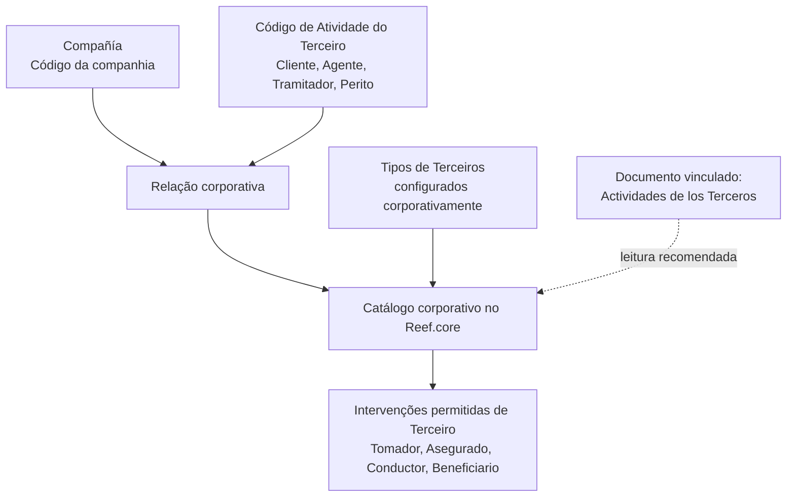

# Definição das Intervenções Permitidas por Código de Atividade de Terceiros no Reef.core

## 1. Metadados do Documento
- **Arquivo de Origem:** `Não identificado no conteúdo fornecido`
- **Tipo de Documento:** `Especificação Técnica / Funcional`
- **Domínio / Sistema:** `Reef.core — catálogo corporativo de Atividades e Intervenções de Terceiros`
- **Público-Alvo:** `Analistas funcionais, desenvolvedores, arquitetos e equipes de configuração corporativa`
- **Data/Versão Identificada:** `Não identificada`
- **Status identificado:** `Lifecycle: Approved`
- **Owner identificado:** `user:agonzalez_mapfre.com`

---

## 2. Resumo Executivo & Contexto de Negócio

O documento define a relação corporativa entre o **Código de Atividade do Terceiro** e as **Intervenções de Terceiro** permitidas no sistema **Reef.core**. O objetivo funcional declarado é identificar e estabelecer, em um catálogo corporativo, quais intervenções são autorizadas conforme a atividade atribuída a um terceiro.

A definição é contextualizada por companhia: a propriedade **Compañía** informa ao sistema o código da companhia para a qual é estabelecida a relação entre Atividades de Terceiros e suas Intervenções permitidas. Portanto, a configuração não é apresentada como uma relação genérica desvinculada de companhia.

A **Intervenção de Terceiro** representa a forma pela qual uma pessoa física ou jurídica participa de uma apólice ou aplicação. Os exemplos fornecidos são Tomador, Asegurado, Conductor e Beneficiario. Já o **Código de Atividade do Terceiro** representa a atividade do terceiro no sistema, com exemplos como Cliente, Agente, Tramitador e Perito.

O documento determina uma regra corporativa obrigatória: os códigos de atividade e os tipos de terceiros configurados corporativamente no Reef.core devem ser respeitados. Também recomenda a leitura do documento relacionado **“Actividades de los Terceros”**, pois a interpretação isolada desta especificação pode conduzir a erro.

---

## 3. Arquitetura, Componentes & Tecnologias Envolvidas

Os elementos explicitamente citados no documento são:

| Componente / Conceito | Papel descrito |
| :--- | :--- |
| Reef.core | Sistema que identifica e estabelece, em catálogo corporativo, as intervenções permitidas conforme a atividade do terceiro. |
| Catálogo corporativo | Repositório lógico no qual são estabelecidas as intervenções permitidas de acordo com a atividade do terceiro. |
| Compañía | Propriedade que informa o código da companhia sobre a qual é definida a relação entre atividades e intervenções. |
| Código de Atividade do Terceiro | Código que identifica a atividade do terceiro no sistema. Exemplos: Cliente, Agente, Tramitador e Perito. |
| Intervenção de Terceiro | Atributo que determina a forma de participação de uma pessoa física ou jurídica em uma apólice ou aplicação. Exemplos: Tomador, Asegurado, Conductor e Beneficiario. |
| Tipos de Terceiros | Configurações corporativas que devem ser obrigatoriamente respeitadas juntamente com os códigos de atividade. |
| Actividades de los Terceros | Documento funcional vinculado e recomendado para leitura complementar. |



**Nota de Análise:** o conteúdo não descreve tecnologias de implementação, APIs, contratos JSON, métodos HTTP, bancos de dados, ambientes técnicos, URLs operacionais, pipelines de CI/CD ou mecanismos de integração.

---

## 4. Regras de Negócio, Especificações Funcionais & Processos

### 4.1 Objetivo funcional

1. O Reef.core identifica as intervenções permitidas de acordo com a atividade do terceiro.
2. O Reef.core estabelece essa relação em um catálogo corporativo.
3. A relação funcional envolve, no mínimo:
   - o código da companhia;
   - o código de atividade do terceiro;
   - a intervenção permitida para o terceiro;
   - os tipos de terceiros configurados corporativamente.

### 4.2 Regra de contextualização por companhia

1. A propriedade **Compañía** indica ao sistema o código da companhia.
2. O código da companhia define o contexto no qual a relação entre Atividades de Terceiros e Intervenções permitidas é estabelecida.
3. O documento não detalha o formato, a lista de valores ou o mecanismo de manutenção do código de companhia.

### 4.3 Regra de identificação de intervenção

1. A propriedade **Intervención de Tercero** determina como uma pessoa física ou jurídica intervém em uma apólice ou aplicação.
2. Os exemplos textualmente apresentados são:
   - Tomador;
   - Asegurado;
   - Conductor;
   - Beneficiario.
3. O documento não define se a lista de intervenções é fechada, extensível ou dependente de outros parâmetros.

### 4.4 Regra de identificação da atividade do terceiro

1. A propriedade **Código de Actividad del Tercero** indica no sistema o código da atividade do terceiro.
2. Os exemplos textualmente apresentados são:
   - Cliente;
   - Agente;
   - Tramitador;
   - Perito.
3. O documento não especifica a estrutura técnica do código, tamanho, domínio de valores ou regras de validação sintática.

### 4.5 Regra corporativa obrigatória

1. Devem ser obrigatoriamente respeitados:
   - os códigos de atividade configurados corporativamente no Reef.core;
   - os tipos de terceiros configurados corporativamente no Reef.core.
2. A regra é apresentada como resposta a uma pergunta frequente sobre recomendações locais para codificação e uso de Atividades de Terceiros.
3. O documento não autoriza alterações locais nos códigos de atividade ou nos tipos de terceiros corporativamente configurados.

### 4.6 Dependência documental

1. O documento possui vínculo com diretrizes e documentos funcionais cuja leitura é recomendada.
2. A leitura recomendada existe para evitar que a interpretação isolada do documento conduza a erro.
3. O documento explicitamente relacionado é **Actividades de los Terceros**.

---

## 5. Tabelas de Parâmetros, Ambientes e Estruturas de Dados

| Item / Parâmetro | Descrição / Função | Tipo / Valores / Formato | Ambiente / Observações |
| :--- | :--- | :--- | :--- |
| Compañía | Indica o código da companhia sobre a qual é estabelecida a relação entre atividades e intervenções. | Código de companhia; formato não detalhado. | Aplicável à relação configurada no Reef.core. |
| Intervención de Tercero | Determina a forma de participação de uma pessoa física ou jurídica em uma apólice ou aplicação. | Exemplos: Tomador, Asegurado, Conductor, Beneficiario. | Não há definição de catálogo completo ou formato técnico. |
| Código de Actividad del Tercero | Indica o código da atividade do terceiro no sistema. | Exemplos: Cliente, Agente, Tramitador, Perito. | Os códigos devem respeitar a configuração corporativa do Reef.core. |
| Tipos de Terceros | Configurações corporativas associadas ao uso das atividades de terceiros. | Valores não detalhados. | Devem ser obrigatoriamente respeitados. |
| Catálogo corporativo | Estrutura corporativa que estabelece intervenções permitidas de acordo com a atividade do terceiro. | Estrutura lógica; modelo de dados não detalhado. | Mantido no contexto do Reef.core. |
| Documento vinculado | Material funcional recomendado para evitar interpretação isolada incorreta. | `Actividades de los Terceros`. | Leitura recomendada. |
| Owner | Responsável identificado no conteúdo. | `user:agonzalez_mapfre.com` | Metadado do documento. |
| Lifecycle | Estado do documento. | `Approved` | Metadado do documento. |

---

## 6. Bateria de Perguntas & Respostas para RAG (FAQ Sintético)

### P1: Qual é o objetivo da definição de intervenções permitidas por código de atividade no Reef.core?
**R:** O objetivo é permitir que o Reef.core identifique e estabeleça, em um catálogo corporativo, quais Intervenções de Terceiro são permitidas de acordo com a Atividade do Terceiro.

### P2: Qual propriedade define o contexto da companhia para a relação entre atividade e intervenção?
**R:** A propriedade **Compañía** informa ao sistema o código da companhia sobre a qual é estabelecida a relação entre as Atividades de Terceiros e suas Intervenções permitidas.

### P3: O que é uma Intervenção de Terceiro segundo o documento?
**R:** Uma Intervenção de Terceiro é um atributo que determina a maneira pela qual uma pessoa física ou jurídica intervém em uma apólice ou aplicação. O documento apresenta como exemplos Tomador, Asegurado, Conductor e Beneficiario.

### P4: Quais exemplos de intervenções de terceiros são citados?
**R:** O documento cita Tomador, Asegurado, Conductor e Beneficiario como exemplos de formas de participação de um terceiro em uma apólice ou aplicação.

### P5: O que representa o Código de Atividade do Terceiro?
**R:** O Código de Atividade do Terceiro indica, no sistema, o código da atividade atribuída ao terceiro. Os exemplos apresentados são Cliente, Agente, Tramitador e Perito.

### P6: Quais regras corporativas devem ser respeitadas no uso de Atividades de Terceiros?
**R:** Devem ser obrigatoriamente respeitados tanto os códigos de atividade quanto os Tipos de Terceiros configurados corporativamente no Reef.core.

### P7: O documento permite criar códigos locais de atividade de terceiros?
**R:** O documento não descreve um processo de criação local de códigos. A orientação explícita é respeitar obrigatoriamente os códigos de atividade e os Tipos de Terceiros configurados corporativamente no Reef.core.

### P8: Qual documento complementar deve ser consultado para evitar interpretação incorreta?
**R:** Deve ser consultado o documento funcional **Actividades de los Terceros**. A leitura é recomendada porque a interpretação isolada do presente documento pode conduzir a erro.

### P9: O documento define APIs, métodos HTTP ou contratos de integração para o catálogo de intervenções?
**R:** Não. O conteúdo fornecido descreve o objetivo funcional e os atributos conceituais da relação entre atividade e intervenção, mas não detalha APIs, métodos HTTP, contratos JSON ou interfaces técnicas.

### P10: O documento especifica o formato dos códigos de companhia ou de atividade?
**R:** Não. O documento informa a função dos códigos de companhia e de atividade, mas não apresenta tamanho, tipo de dado, expressão de validação, domínio completo de valores ou convenção de nomenclatura.

---

## 7. Glossário de Termos, Siglas & Conceitos-Chave

- **Reef.core:** sistema que identifica e estabelece, em um catálogo corporativo, as Intervenções permitidas conforme a Atividade do Terceiro.
- **Compañía:** propriedade que indica o código da companhia sobre a qual a relação entre Atividades e Intervenções é estabelecida.
- **Intervención de Tercero:** atributo que determina como uma pessoa física ou jurídica intervém em uma apólice ou aplicação.
- **Código de Actividad del Tercero:** propriedade que indica o código da atividade de um terceiro no sistema.
- **Actividades de los Terceros:** documento funcional vinculado, cuja leitura é recomendada.
- **Tomador:** exemplo de Intervenção de Terceiro citado no documento.
- **Asegurado:** exemplo de Intervenção de Terceiro citado no documento.
- **Conductor:** exemplo de Intervenção de Terceiro citado no documento.
- **Beneficiario:** exemplo de Intervenção de Terceiro citado no documento.
- **Cliente:** exemplo de Código de Atividade do Terceiro citado no documento.
- **Agente:** exemplo de Código de Atividade do Terceiro citado no documento.
- **Tramitador:** exemplo de Código de Atividade do Terceiro citado no documento.
- **Perito:** exemplo de Código de Atividade do Terceiro citado no documento.
- **Tipos de Terceros:** tipos configurados corporativamente no Reef.core que devem ser respeitados.

---

## 8. Notas Críticas, Riscos & Limitações

- A interpretação isolada do documento pode conduzir a erro; o próprio conteúdo recomenda a leitura do documento **Actividades de los Terceros**.
- O documento não detalha o modelo de dados do catálogo corporativo, chaves, cardinalidades ou regras de persistência.
- O documento não apresenta lista completa de intervenções, atividades ou tipos de terceiros.
- O documento não especifica mecanismos de manutenção, aprovação, governança ou versionamento das configurações corporativas.
- Não há detalhamento de APIs, interfaces, integrações, autenticação, logs, URLs, servidores, ambientes ou procedimentos de implantação.
- Há caracteres aparentemente corrompidos na extração bruta, como `identica`, `Beneciario`, `codicación` e `congurados`. Esta análise preserva o sentido apenas quando sustentado pelo contexto explícito, sem inferir dados técnicos ausentes.

---

## 9. Conteúdo Bruto Estruturado (Referência Fiel)

```text
--- [PÁGINA 1 DE 1] ---

DEFINICIÓN de las Intervenciones Permitidas por Código de Actividad
de los Terceros
Objetivo
Funcionalmente, Reef.core identica y establece en un catálogo corporativo las Intervenciones que están permitidas de acuerdo con la
Actividad del Tercero.
Compañía
Esta propiedad le indica al sistema el código de la compañía sobre la que se establece la relación de las Actividades y sus Intervenciones
Intervención de Tercero
Este atributo determina la manera en la que interviene una persona, física o jurídica, en una póliza o aplicación (Tomador, Asegurado,
Conductor, Beneciario,..)
Código de Actividad del Tercero
Esta propiedad indica en el sistema el código de la Actividad del Tercero (Cliente, Agente,Tramitador, Perito,...)
Vínculos
Relación de Directrices y Documentos funcionales cuya lectura recomendada para evitar que la interpretación aislada del presente
documento pueda conducir a error.
Actividades de los Terceros
Preguntas frecuentes
1 ¿Existe alguna recomendación que deba ser tomada en consideración localmente en la codicación y uso de las Actividades de Terceros en
el Sistema?
Se tienen que respetar obligatoriamente tanto los códigos de actividad commo los Tipos de Terceros congurados corporativamente en
Reef.core.
Documentation / DOCUMENTACIÓN Reef
DOCUMENTACIÓN Reef
Mapfredocument
DOCUMENTACIÓN Reef
Owner
user:agonzalez_mapfre.com
Lifecycle
Approved Source
 /
 VL
Buscar Inicio Soluciones Arquitecturas APIs Componentes Cloud Documentación Zeus Reef Ayuda
ES
```
