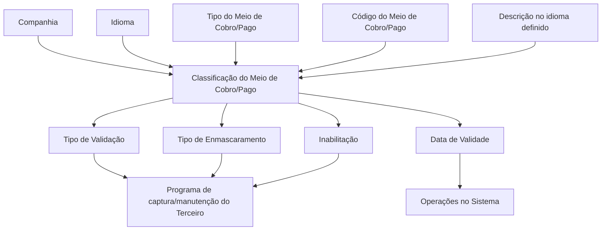

# Classificações dos Meios de Cobro/Pago de Terceiros no Sistema REEF

## 1. Metadados do Documento
- **Arquivo de Origem:** Não identificado no conteúdo extraído
- **Tipo de Documento:** Especificação Técnica
- **Domínio / Sistema:** REEF / Meios de Cobro/Pago de Terceiros
- **Público-Alvo:** Desenvolvedores, Analistas Funcionais, Operação e Negócio
- **Data/Versão Identificada:** Não identificada

---

## 2. Resumo Executivo & Contexto de Negócio

O documento define a classificação dos meios de cobrança e pagamento de terceiros no núcleo do Sistema REEF. O sistema disponibiliza um catálogo específico para codificar e classificar esses meios, inicialmente entregue vazio nas instalações.

A classificação é definida no contexto de uma companhia e de um idioma. Cada registro associa um tipo de meio de cobro/pago a um ou mais códigos, com uma descrição apresentada no idioma selecionado.

A especificação também define propriedades operacionais para validação e mascaramento dos dados informados no programa de captura ou manutenção de terceiros. O método aplicável depende do tipo de meio associado ao código.

O documento estabelece propriedades de controle operacional, incluindo inabilitação e data de validade. Esses controles determinam, respectivamente, se um meio pode ser usado em operações de captura/modificação de terceiros e a data a partir da qual está plenamente operacional, preservando o histórico de alterações.

---

## 3. Arquitetura, Componentes & Tecnologias Envolvidas

Os elementos identificados são o núcleo do Sistema REEF, o catálogo de classificação de meios de cobro/pago, o programa de captura/manutenção de terceiros, as companhias, os idiomas e as definições corporativas de tipos, validações e mascaramentos.



**Nota de Análise:** O documento menciona o núcleo do Sistema REEF e o programa de captura/manutenção de terceiros, mas não detalha tecnologias, interfaces, métodos HTTP, contratos JSON, bancos de dados, URLs ou ambientes técnicos.

---

## 4. Regras de Negócio, Especificações Funcionais & Processos

1. O núcleo do Sistema REEF permite codificar e classificar meios de cobro e pago de terceiros em um catálogo de informação específico.
2. O catálogo é entregue inicialmente vazio nas instalações.
3. A propriedade **Compañía** informa o código da companhia para a qual a classificação do meio de cobro/pago está sendo definida.
4. A propriedade **Idioma** informa o idioma utilizado na definição do registro, com exemplos de espanhol, inglês e turco.
5. O **Tipo del Medio de Cobro/Pago** identifica o tipo associado à classificação.
6. O **Código del Medio de Cobro/Pago** identifica o meio definido no sistema.
7. Para um mesmo tipo de meio de cobro/pago, podem ser definidos um ou vários códigos.
8. A **Descripción del Medio de Cobro/Pago** corresponde à denominação ou descrição do registro no idioma em que está sendo definido.
9. O **Tipo de Validación de los Medios de Cobro o Pago** deve indicar o método de validação usado pelo programa de captura/manutenção de terceiros para validar o dado informado.
10. O método de validação é determinado de acordo com o tipo de meio de cobro/pago associado ao código.
11. O **Tipo de Enmascaramiento de los Medios de Cobro o Pago** deve indicar o método usado pelo programa de captura/manutenção de terceiros para visualizar o dado informado.
12. O método de mascaramento é determinado de acordo com o tipo de meio de cobro/pago associado ao código.
13. A propriedade **Inhabilitación** informa que o meio de cobro/pago está inabilitado para uso em operações de captura e/ou modificação do terceiro.
14. A propriedade **Fecha de Validez** informa a data a partir da qual o meio de cobro/pago está plenamente operativo no sistema.
15. O uso da data de validade permite manter um histórico das alterações realizadas nas definições dos meios.
16. É obrigatório respeitar os valores de tipos de meio de cobro/pago, tipos de validação e tipos de mascaramento definidos e habilitados pelo núcleo do sistema.

---

## 5. Tabelas de Parâmetros, Ambientes e Estruturas de Dados

| Item / Parâmetro | Descrição / Função | Tipo / Valores / Formato | Ambiente / Observações |
| :--- | :--- | :--- | :--- |
| Compañía | Indica o código da companhia para a qual a classificação está sendo definida. | Código de companhia | Não detalhado |
| Idioma | Indica o idioma empregado na definição do registro. | Exemplos: espanhol, inglês, turco | A descrição é definida conforme o idioma. |
| Tipo del Medio de Cobro/Pago | Indica o tipo de meio associado à classificação. | Tipo corporativamente configurado | Deve respeitar valores definidos e habilitados pelo núcleo do sistema. |
| Código del Medio de Cobro/Pago | Identifica o meio de cobro/pago definido no sistema. | Código; um ou vários códigos por tipo | Associado a um tipo de meio. |
| Descripción del Medio de Cobro/Pago | Denominação ou descrição do meio no idioma definido. | Texto | Dependente do idioma do registro. |
| Tipo de Validación | Define o método de validação aplicado ao dado informado pelo terceiro. | Método de validação | Aplicado no programa de captura/manutenção de terceiros, conforme o tipo associado. |
| Tipo de Enmascaramiento | Define o método de mascaramento usado para visualizar o dado informado. | Método de mascaramento | Aplicado no programa de captura/manutenção de terceiros, conforme o tipo associado. |
| Inhabilitación | Indica que o meio está inabilitado para uso. | Estado de inabilitação | Bloqueia uso em captura e/ou modificação do terceiro. |
| Fecha de Validez | Data a partir da qual o meio está plenamente operativo. | Data | Permite manter histórico de mudanças nas definições. |
| 001 | Código de meio de cobro/pago. | Cuenta Bancaria / Cuenta Corriente | Exemplo apresentado no documento. |
| 002 | Código de meio de cobro/pago. | Cuenta Bancaria / Cuenta de Valores | Exemplo apresentado no documento. |
| 003 | Código de meio de cobro/pago. | Cuenta Bancaria / Cuenta Ahorro | Exemplo apresentado no documento. |
| 004 | Código de meio de cobro/pago. | Cuenta Bancaria / Cuenta On-Line | Exemplo apresentado no documento. |
| AAA | Código de meio de cobro/pago. | Pago Móvil/Celular / Apple Pay | Exemplo apresentado no documento. |
| AAB | Código de meio de cobro/pago. | Pago Móvil/Celular / Samsung Pay | Exemplo apresentado no documento. |
| AAC | Código de meio de cobro/pago. | Pago Móvil/Celular / Google Pay | Exemplo apresentado no documento. |
| AA1 | Código de meio de cobro/pago. | Tarjeta Bancaria / Crédito | Exemplo apresentado no documento. |
| AA2 | Código de meio de cobro/pago. | Tarjeta Bancaria / Débito | Exemplo apresentado no documento. |
| AA3 | Código de meio de cobro/pago. | Tarjeta Bancaria / Revolving | Exemplo apresentado no documento. |
| AA4 | Código de meio de cobro/pago. | Tarjeta Bancaria / Pre pago / Monedero | Exemplo apresentado no documento. |

---

## 6. Bateria de Perguntas & Respostas para RAG (FAQ Sintético)

### P1: Qual é a finalidade do catálogo de meios de cobro/pago no Sistema REEF?
**R:** O catálogo permite ao núcleo do Sistema REEF codificar e classificar os meios de cobro e pago dos terceiros. O documento informa que esse catálogo específico é entregue inicialmente vazio nas instalações.

### P2: O que a propriedade Compañía representa na classificação de um meio de cobro/pago?
**R:** A propriedade Compañía informa o código da companhia sobre a qual está sendo realizada a definição da classificação do meio de cobro/pago.

### P3: Qual é a finalidade da propriedade Idioma?
**R:** A propriedade Idioma informa o idioma utilizado na definição do registro. O documento apresenta espanhol, inglês e turco como exemplos de idiomas.

### P4: Um tipo de meio de cobro/pago pode possuir mais de um código?
**R:** Sim. O documento determina que, para um mesmo tipo de meio de cobro/pago, podem ser definidos um ou vários códigos.

### P5: Como é determinada a descrição de um meio de cobro/pago?
**R:** A descrição corresponde à denominação do meio de cobro/pago de acordo com o idioma em que o registro está sendo definido no sistema.

### P6: Para que serve o Tipo de Validación de los Medios de Cobro o Pago?
**R:** O Tipo de Validación indica o método usado pelo programa de captura/manutenção de terceiros para validar o dado informado. Esse método deve ser escolhido de acordo com o tipo de meio de cobro/pago associado ao código.

### P7: Para que serve o Tipo de Enmascaramiento de los Medios de Cobro o Pago?
**R:** O Tipo de Enmascaramiento indica o método de mascaramento utilizado pelo programa de captura/manutenção de terceiros para visualizar o dado informado. A escolha depende do tipo de meio associado ao código.

### P8: O que acontece quando um meio de cobro/pago está inabilitado?
**R:** Um meio de cobro/pago inabilitado não pode ser utilizado nas operações de captura e/ou modificação do terceiro.

### P9: Qual é a função da Fecha de Validez?
**R:** A Fecha de Validez informa a data a partir da qual o meio de cobro/pago está plenamente operativo no sistema. Seu uso permite manter um histórico das alterações realizadas nas definições dos meios.

### P10: Quais valores devem ser obrigatoriamente respeitados na codificação e uso dos meios de cobro/pago?
**R:** É obrigatório respeitar os valores de tipos de meio de cobro/pago, tipos de validações e tipos de mascaramentos que estejam definidos e habilitados pelo núcleo do Sistema REEF.

---

## 7. Glossário de Termos, Siglas & Conceitos-Chave

- **REEF:** Nome do sistema mencionado na documentação.
- **Cobro/Pago:** Cobrança/pagamento; contexto de classificação dos meios usados por terceiros.
- **Tercero:** Terceiro cujos dados de meio de cobro/pago são capturados ou modificados no sistema.
- **Compañía:** Propriedade que identifica o código da companhia da classificação.
- **Tipo del Medio de Cobro/Pago:** Tipo de meio associado ao código classificado.
- **Tipo de Validación:** Método empregado para validar o dado informado no programa de captura/manutenção de terceiros.
- **Tipo de Enmascaramiento:** Método empregado para mascarar ou visualizar o dado informado.
- **Inhabilitación:** Estado que impede o uso do meio de cobro/pago em captura e/ou modificação.
- **Fecha de Validez:** Data a partir da qual o meio está plenamente operativo no sistema.
- **Cuenta Bancaria:** Tipo de meio apresentado nos exemplos de códigos 001 a 004.
- **Pago Móvil/Celular:** Tipo de meio apresentado nos exemplos Apple Pay, Samsung Pay e Google Pay.
- **Tarjeta Bancaria:** Tipo de meio apresentado nos exemplos Crédito, Débito, Revolving e Pre pago / Monedero.

---

## 8. Notas Críticas, Riscos & Limitações

- O documento exige o respeito obrigatório aos tipos de meio, tipos de validação e tipos de mascaramento definidos e habilitados pelo núcleo do sistema.
- A definição isolada do documento pode conduzir a erro; o próprio conteúdo recomenda a leitura de diretrizes e documentos funcionais vinculados.
- É mencionada a referência **Entidades Comercializadoras de los Medios de Cobro/Pago**, mas seu conteúdo não foi incluído na extração.
- Não há detalhamento sobre os valores concretos de tipos de validação ou mascaramento.
- Não há descrição de contratos de integração, APIs, métodos HTTP, estruturas JSON, persistência de dados, controle de acesso ou ambientes técnicos.
- Os códigos apresentados incluem reticências (`...`), indicando exemplos parciais e não um catálogo completo.

---

## 9. Conteúdo Bruto Estruturado (Referência Fiel)

```text
--- [PÁGINA 1 DE 3] ---

DEFINICIÓN de las Clasificaciones de los Medios de Cobro/Pago

Propiedades Generales
Propiedades Operativas
Otras Propiedades

Propiedades Generales

Funcionalmente, el núcleo del Sistema cuenta con la posibilidad de Codificar y Clasificar los medios de Cobro y Pago de los Terceros en un catálogo de información específico que se entrega inicialmente a las instalaciones vacío de contenido.

Compañía

Esta propiedad le indica al sistema el código de la compañía sobre la que se está realizando la definición de la Clasificación del Medio del Cobro o Pago.

Idioma

Esta propiedad le indica al sistema el Idioma empleado en la definición como por ejemplo: español, inglés, turco, ...

Propiedades Operativas

Tipo del Medio de Cobro/Pago

Este Atributo indica el Tipo del Medio de Cobro/Pago que va a tener asociada la Clasificación del Medio de Cobro/Pago.

Código del Medio de Cobro/Pago

Esta propiedad indicará el código del Medio de Cobro/Pago que se está definiendo en el Sistema pudiendo definir para un mismo Tipo de Medio de Cobro/Pago uno o varios Códigos.

Descripción del Medio de Cobro/Pago

Esta propiedad indica la denominación o descripción de acuerdo con el idioma en el que se está definiendo el registro en el Sistema.

A modo de ejemplo, en español y de acuerdo con los tipos de los medios de cobro/pago configurados corporativamente en el sistema y asociados a los códigos podríamos tener...

CÓDIGO MEDIO COBRO/PAGO. TIPO MEDIO Descripción

001 Cuenta Bancaria Cuenta Corriente

Documentation / DOCUMENTACIÓN Reef
DOCUMENTACIÓN Reef
Mapfredocument
DOCUMENTACIÓN Reef

Owner
user:agonzalez_mapfre.com

Lifecycle
Approved Source

/ VL
Buscar Inicio Soluciones Arquitecturas APIs Componentes Cloud Documentación Zeus Reef Ayuda
ES

--- [PÁGINA 2 DE 3] ---

CÓDIGO MEDIO COBRO/PAGO. TIPO MEDIO Descripción

002 Cuenta Bancaria Cuenta de Valores
003 Cuenta Bancaria Cuenta Ahorro
004 Cuenta Bancaria Cuenta On-Line
... ... ...
AAA Pago Móvil/Celular Apple Pay
AAB Pago Móvil/Celular Samsung Pay
AAC Pago Móvil/Celular Google Pay
... ... ...
AA1 Tarjeta Bancaria Crédito
AA2 Tarjeta Bancaria Débito
AA3 Tarjeta Bancaria Revolving
AA4 Tarjeta Bancaria Pre pago / Monedero
... ... ...

Tipo de Validación de los Medios de Cobro o Pago

De acuerdo con el Tipo del Medio de Cobro/Pago que tenga asociado el código del Medio de Cobro/Pago, el valor de este Atributo debe indicar el método de validación que se va a utilizar en el programa de captura/mantenimiento del Tercero para validar el dato introducido.

Tipo de Enmascaramiento de los Medios de Cobro o Pago

De igual manera, de acuerdo con el Tipo del Medio de Cobro/Pago que tenga asociado el código del Medio de Cobro/Pago el valor de este Atributo indicará el método de enmascaramiento que se va a emplear en el programa de captura/mantenimiento del Tercero para visualizar el dato introducido.

Otras Propiedades

Inhabilitación

Esta propiedad le indica al Sistema que el Medio de Cobro/Pago está inhabilitado para poder ser utilizado en las operaciones de captura y/o modificación del Tercero.

Fecha de Validez

Esta propiedad le indica al Sistema la fecha a partir de la cual el Medio de Cobro o Pago está plenamente operativo en el sistema por lo que su correcto uso permite tener un histórico de los cambios efectuados en las definiciones de los medios.

Vínculos

Relación de Directrices y Documentos funcionales cuya lectura recomendada para evitar que la interpretación aislada del presente documento pueda conducir a error.

Entidades Comercializadoras de los Medios de Cobro/Pago

--- [PÁGINA 3 DE 3] ---

Preguntas frecuentes

(1) ¿Existe alguna recomendación operativa que deba ser tomada en consideración localmente en la codificación, uso y definición de los Códigos de Medios de Cobro/Pago de los Terceros en el Sistema?

Es obligatorio respetar los valores de los Tipos del Medio de Cobro/Pago, Tipos de Validaciones y Tipos de Enmascaramientos definidos y habilitados por el núcleo del Sistema.
```
