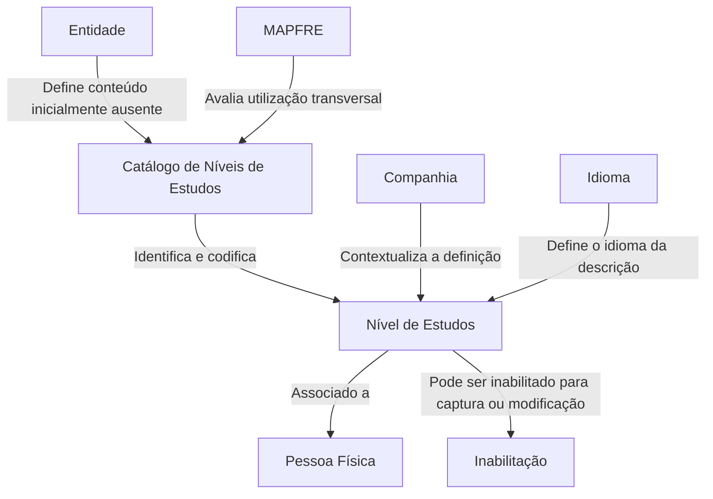

_Transient error (attempt 1/3): Post "https://axet.nttdata.com/api/llm-enabler/v3/ntt/v1/responses": read tcp 100.64.0.1:63832->150.171.110.40:443: read: connection reset by peer. Retrying…_

# Definição de Níveis de Estudos de Terceiros no Sistema Reef

## 1. Metadados do Documento
- **Arquivo de Origem:** `Não identificado no conteúdo fornecido`
- **Tipo de Documento:** `Especificação Funcional`
- **Domínio / Sistema:** `Reef / MAPFRE — cadastro de Pessoas Físicas e Terceiros`
- **Público-Alvo:** `Analistas funcionais, equipes de negócio, operação e desenvolvimento`
- **Data/Versão Identificada:** `Não identificada`

---

## 2. Resumo Executivo & Contexto de Negócio

O documento define o conceito e as propriedades funcionais do catálogo de **Níveis de Estudos de Terceiros**, destinado ao registro do grau educacional mais elevado concluído por uma Pessoa Física. O escopo está relacionado ao núcleo do sistema Reef e à gestão de informações cadastrais de terceiros.

Cada país possui uma classificação própria para seu sistema educacional, que pode começar em idade precoce e se estender até o doutorado. No contexto do cadastro de Pessoas Físicas, o nível de estudos representa exclusivamente o nível educacional mais elevado que tenha sido finalizado pela pessoa.

O núcleo do sistema permite identificar e codificar os níveis de estudos das Pessoas Físicas em um catálogo de informação específico. Esse catálogo é entregue inicialmente sem conteúdo às entidades, que devem realizar a respectiva definição de dados conforme as necessidades corporativas e locais.

O documento não estabelece uma padronização obrigatória para a codificação dos níveis de estudos. A entidade MAPFRE deve analisar a conveniência de adotar o catálogo transversalmente nos processos da companhia, visando uma definição adequada e a futura exploração das informações.

---

## 3. Arquitetura, Componentes & Tecnologias Envolvidas

O conteúdo não descreve arquitetura técnica, microsserviços, APIs, bancos de dados, protocolos, ambientes, URLs ou tecnologias de implementação. O documento descreve um recurso funcional do núcleo do sistema Reef: o catálogo de Níveis de Estudos de Pessoas Físicas.

Componentes e conceitos citados:

| Componente / Conceito | Papel descrito |
| :--- | :--- |
| Sistema Reef | Sistema no qual o catálogo de Níveis de Estudos é definido e utilizado. |
| Núcleo do Sistema | Possui a capacidade funcional de identificar e codificar Níveis de Estudos de Pessoas Físicas. |
| Catálogo de Níveis de Estudos | Catálogo específico de informação entregue inicialmente vazio às entidades. |
| Pessoa Física | Entidade cadastral para a qual é registrado o nível de estudos mais elevado concluído. |
| Companhia | Propriedade que indica o código da companhia para a qual a definição do nível de estudos está sendo realizada. |
| Idioma | Propriedade que identifica o idioma utilizado na definição do Nível de Estudos. |
| MAPFRE | Entidade que deve avaliar o uso transversal do catálogo em seus processos. |



> **Nota de Análise:** O documento não detalha a implementação técnica do catálogo, tais como entidades de banco de dados, interfaces, métodos HTTP, contratos JSON, integrações ou fluxos entre sistemas.

---

## 4. Regras de Negócio, Especificações Funcionais & Processos

### Conceito de Nível de Estudos

1. Cada país possui uma classificação própria de seu sistema educacional.
2. A classificação educacional pode começar em idade muito precoce e se estender praticamente até o doutorado.
3. Para Pessoas Físicas, o Nível de Estudos corresponde ao grau ou nível educacional mais elevado que a pessoa tenha concluído.
4. O documento trata de níveis de estudos finalizados; não define o tratamento para estudos em andamento, interrompidos ou não concluídos.

### Catálogo de Níveis de Estudos

1. O núcleo do sistema possui funcionalidade para identificar e codificar os Níveis de Estudos de Pessoas Físicas.
2. Os níveis são administrados por um catálogo de informação específico.
3. O catálogo é entregue às entidades inicialmente vazio de conteúdo.
4. A codificação e a definição do catálogo devem ser estabelecidas pela entidade conforme sua análise de conveniência e utilização nos processos corporativos.
5. Não existe preferência ou recomendação documentada para estabelecer ou padronizar a codificação dos Níveis de Estudos no sistema.
6. A entidade MAPFRE deve analisar a conveniência de utilizar transversalmente o catálogo de informação em seus processos, para permitir correta definição e posterior exploração dos dados.

### Propriedades Funcionais

1. **Companhia:** indica o código da companhia sobre a qual está sendo realizada a definição do Nível de Estudos da Pessoa Física.
2. **Idioma:** indica o idioma empregado na definição do Nível de Estudos, com exemplos como espanhol e francês.
3. **Código do Nível de Estudos do Terceiro:** indica o código do Nível de Estudos conforme o tipo de dado que sustentará a informação na Base de Dados.
4. **Descrição do Nível de Estudos do Terceiro:** indica a denominação ou descrição do Nível de Estudos da Pessoa Física.
5. **Inabilitação:** indica que o Nível de Estudos está inabilitado para uso nas operações de captura e/ou modificação da Pessoa Física.

### Exemplo de Organização Educacional Apresentado

O documento fornece um exemplo para a Espanha, no idioma espanhol. Os valores representam uma organização educacional apresentada como referência e não como uma codificação obrigatória para todas as entidades.

| Nível de Estudos | Descrição |
| :--- | :--- |
| 00 | Sin Estudios |
| 01 | Educación Infantil |
| 02 | Educación Primaria |
| 03 | Educación Secundaria |
| 04 | Bachillerato |
| 05 | Formación Profesional |
| 06 | Enseñanzas Universitarias |
| 07 | Enseñanzas en Régimen Especial |
| ... | ... |

### Documentos Relacionados

A leitura dos documentos relacionados é recomendada para evitar que a interpretação isolada deste documento conduza a erro:

- Titulações de los Terceros.
- Profesiones de los Terceros.

---

## 5. Tabelas de Parâmetros, Ambientes e Estruturas de Dados

| Item / Parâmetro | Descrição / Função | Tipo / Valores / Formato | Ambiente / Observações |
| :--- | :--- | :--- | :--- |
| Companhia | Indica o código da companhia sobre a qual é realizada a definição do Nível de Estudos da Pessoa Física. | Código de companhia; formato não detalhado. | Aplicável à definição do catálogo. |
| Idioma | Indica o idioma utilizado na definição do Nível de Estudos. | Exemplos: espanhol, francês. | O documento não apresenta lista completa de idiomas. |
| Código do Nível de Estudos do Terceiro | Identifica o Nível de Estudos conforme o tipo de dado que sustentará a informação na Base de Dados. | Código; tipo de dado não detalhado. | A codificação não possui preferência ou padronização documentada. |
| Descrição do Nível de Estudos do Terceiro | Indica a denominação ou descrição do Nível de Estudos da Pessoa Física. | Texto descritivo. | Pode variar conforme idioma e classificação local. |
| Inabilitação | Indica que o nível não pode ser empregado nas operações de captura e/ou modificação da Pessoa Física. | Estado de inabilitação; valores não detalhados. | Afeta captura e modificação cadastral. |
| Catálogo de Níveis de Estudos | Repositório específico para identificação e codificação dos Níveis de Estudos das Pessoas Físicas. | Catálogo inicialmente vazio. | Entregue inicialmente sem conteúdo às entidades. |
| Nível 00 | Sin Estudios. | Código `00`. | Exemplo de organização educacional da Espanha em espanhol. |
| Nível 01 | Educación Infantil. | Código `01`. | Exemplo de organização educacional da Espanha em espanhol. |
| Nível 02 | Educación Primaria. | Código `02`. | Exemplo de organização educacional da Espanha em espanhol. |
| Nível 03 | Educación Secundaria. | Código `03`. | Exemplo de organização educacional da Espanha em espanhol. |
| Nível 04 | Bachillerato. | Código `04`. | Exemplo de organização educacional da Espanha em espanhol. |
| Nível 05 | Formación Profesional. | Código `05`. | Exemplo de organização educacional da Espanha em espanhol. |
| Nível 06 | Enseñanzas Universitarias. | Código `06`. | Exemplo de organização educacional da Espanha em espanhol. |
| Nível 07 | Enseñanzas en Régimen Especial. | Código `07`. | Exemplo de organização educacional da Espanha em espanhol. |

> **Nota de Análise:** O documento não informa servidores, URLs, portas, variáveis de configuração, rotas de logs, ambientes de desenvolvimento/homologação/produção ou estrutura física da Base de Dados.

---

## 6. Bateria de Perguntas & Respostas para RAG (FAQ Sintético)

### P1: O que representa o Nível de Estudos de uma Pessoa Física no sistema Reef?
**R:** O Nível de Estudos representa o grau ou nível educacional mais elevado que a Pessoa Física tenha finalizado. O documento não define o tratamento para estudos em andamento, não concluídos ou interrompidos.

### P2: O catálogo de Níveis de Estudos é entregue preenchido às entidades?
**R:** Não. O núcleo do sistema dispõe de um catálogo específico para identificar e codificar os Níveis de Estudos das Pessoas Físicas, mas esse catálogo é entregue às entidades inicialmente vazio de conteúdo.

### P3: Existe uma codificação padronizada obrigatória para os Níveis de Estudos?
**R:** Não. O documento afirma que não existe preferência nem recomendação para estabelecer ou padronizar no sistema a codificação dos Níveis de Estudos. Cada entidade deve analisar a conveniência de definir e utilizar o catálogo em seus processos.

### P4: Qual é a função da propriedade Companhia na definição de um Nível de Estudos?
**R:** A propriedade Companhia indica ao sistema o código da companhia sobre a qual está sendo realizada a definição do Nível de Estudos da Pessoa Física.

### P5: Para que serve a propriedade Idioma no catálogo de Níveis de Estudos?
**R:** A propriedade Idioma indica o idioma empregado na definição do Nível de Estudos. O documento cita espanhol e francês como exemplos, mas não apresenta uma lista completa de idiomas aceitos.

### P6: O que identifica o Código do Nível de Estudos do Terceiro?
**R:** O Código do Nível de Estudos do Terceiro identifica no sistema o código do nível conforme o tipo de dado que sustentará a informação na Base de Dados. O documento não especifica o formato técnico ou o tipo de dado utilizado.

### P7: O que acontece quando um Nível de Estudos está inabilitado?
**R:** Quando um Nível de Estudos está inabilitado, ele não pode ser utilizado nas operações de captura e/ou modificação da Pessoa Física.

### P8: Os códigos 00 a 07 apresentados no documento devem ser usados obrigatoriamente por todas as entidades?
**R:** Não há obrigatoriedade declarada. Os códigos de `00` a `07` são apresentados como exemplo da organização atual do sistema educativo na Espanha, em idioma espanhol. O próprio documento afirma que não há recomendação para padronizar a codificação no sistema.

### P9: Quais documentos devem ser consultados para evitar interpretação isolada da definição de Níveis de Estudos?
**R:** O documento recomenda consultar “Titulaciones de los Terceros” e “Profesiones de los Terceros”, pois a interpretação isolada da definição de Níveis de Estudos pode conduzir a erro.

### P10: Qual responsabilidade é atribuída à MAPFRE em relação ao catálogo de Níveis de Estudos?
**R:** A entidade MAPFRE deve analisar a conveniência de utilizar transversalmente o catálogo de Níveis de Estudos nos processos da companhia, para garantir sua correta definição e posterior exploração.

---

## 7. Glossário de Termos, Siglas & Conceitos-Chave

- **Reef:** Sistema citado como contexto documental e como sistema cujo núcleo permite identificar e codificar Níveis de Estudos de Pessoas Físicas.
- **MAPFRE:** Entidade que deve analisar a conveniência de utilizar transversalmente o catálogo de Níveis de Estudos em seus processos.
- **Pessoa Física:** Pessoa para a qual é registrado o nível educacional mais elevado finalizado.
- **Terceiro:** Termo utilizado na denominação “Nível de Estudos do Terceiro” e nos documentos relacionados sobre titulações e profissões.
- **Nível de Estudos:** Grau ou nível educacional mais elevado que uma Pessoa Física tenha finalizado.
- **Catálogo de Níveis de Estudos:** Catálogo específico de informação usado para identificar e codificar os níveis educacionais de Pessoas Físicas.
- **Inabilitação:** Condição que impede um Nível de Estudos de ser utilizado em operações de captura e/ou modificação da Pessoa Física.
- **Captura:** Operação de registro de dados da Pessoa Física; o documento não fornece detalhamento adicional.
- **Modificação:** Operação de alteração de dados da Pessoa Física; o documento não fornece detalhamento adicional.

---

## 8. Notas Críticas, Riscos & Limitações

- O catálogo de Níveis de Estudos é entregue inicialmente vazio, exigindo definição e governança de conteúdo por parte das entidades.
- Não existe padrão obrigatório de codificação dos níveis de estudos, o que pode resultar em variações entre entidades ou processos caso não exista governança transversal.
- A MAPFRE deve avaliar a utilização transversal do catálogo para permitir exploração consistente das informações.
- Níveis inabilitados não podem ser usados em operações de captura ou modificação de Pessoas Físicas.
- A interpretação isolada do documento pode conduzir a erro; a consulta aos documentos “Titulaciones de los Terceros” e “Profesiones de los Terceros” é recomendada.
- O documento não detalha fluxos técnicos, modelos físicos de dados, APIs, regras de validação de campos, perfis de acesso, processos de aprovação ou mecanismos de auditoria.
- O exemplo de classificação educacional fornecido é específico para a Espanha e para o idioma espanhol; o documento não determina que essa estrutura seja adotada globalmente.

---

## 9. Conteúdo Bruto Estruturado (Referência Fiel)

```text
--- [PÁGINA 1 DE 2] ---

DEFINICIÓN de Niveles de Estudios de Terceros
Contexto
Cada país tiene una Clasicación de su sistema educativo que suele empezar a una edad muy temprana y puede continuar hasta
prácticamente el doctorado, ahora bien, conceptualmente y en relación al nivel de estudios de las Personas Físicas, el nivel de estudios no es
sino el grado o nivel educativo más elevado que ésta tenga nalizados.
Propiedades Generales
Funcionalmente, el núcleo del Sistema cuenta con la posibilidad de identicar y codicar los Niveles de Estudios de las Personas Físicas, en
un catálogo de información especíco que se entrega a las entidades inicialmente vacío de contenido.
Compañía
Esta propiedad le indica al sistema el código de la compañía sobre la que se está realizando la denición del Nivel de Estudios de la Persona
Física.
Idioma
Esta propiedad le indica al sistema el Idioma empleado en la denición del Nivel de Estudios, como por ejemplo: español, francés,...
Código del Nivel de Estudios del Tercero
Esta propiedad indicará en el sistema el código del Nivel de Estudios de acuerdo al tipo de dato que sustentará la información en la Base de
Datos.
Descripción del Nivel de Estudios del Tercero
Esta propiedad le indica al sistema cual es la denominación o descripción del Nivel de Estudios de la Persona Física.
A modo de ejemplo, en España y en idioma español, la organización del sistema educativo actualmente se organiza de la siguiente manera:
NIVEL DE ESTUDIOS DESCRIPCIÓN
00 Sin Estudios
01 Educación Infantil
02 Educación Primaria
Documentation / DOCUMENTACIÓN Reef
DOCUMENTACIÓN Reef
Mapfredocument
DOCUMENTACIÓN Reef
Owner
user:agonzalez_mapfre.com
Lifecycle
Approved Source
 /
VL
Buscar Inicio Soluciones Arquitecturas APIs Componentes Cloud Documentación Zeus Reef Ayuda
ES

--- [PÁGINA 2 DE 2] ---

NIVEL DE ESTUDIOS DESCRIPCIÓN
03 Educación Secundaria
04 Bachillerato
05 Formación Profesional
06 Enseñanzas Universitarias
07 Enseñanzas en Régimen Especial
... ...
Otras Propiedades
Inhabilitación
Esta propiedad le indica al sistema que el Nivel de Estudios está inhabilitado para poder ser empleado en las operaciones de captura y/o
modicación de la persona física.
Vínculos
Relación de Directrices y Documentos funcionales cuya lectura recomendada para evitar que la interpretación aislada del presente
documento pueda conducir a error.
Titulaciones de los Terceros
Profesiones de los Terceros
Preguntas frecuentes
(1) ¿Existe alguna recomendación operativa que deba ser tomada en consideración localmente en la codicación, uso y denición del
catálogo de Niveles de Estudios en el Sistema?
No existe una preferencia ni recomendación para establecer o estandarizar en el sistema la codicación de los Niveles de Estudios, si bien la
entidad MAPFRE debe analizar la conveniencia de utilizar transversalmente en los procesos de la compañía este catálogo de información
para su correcta denición y posterior explotación.
```
