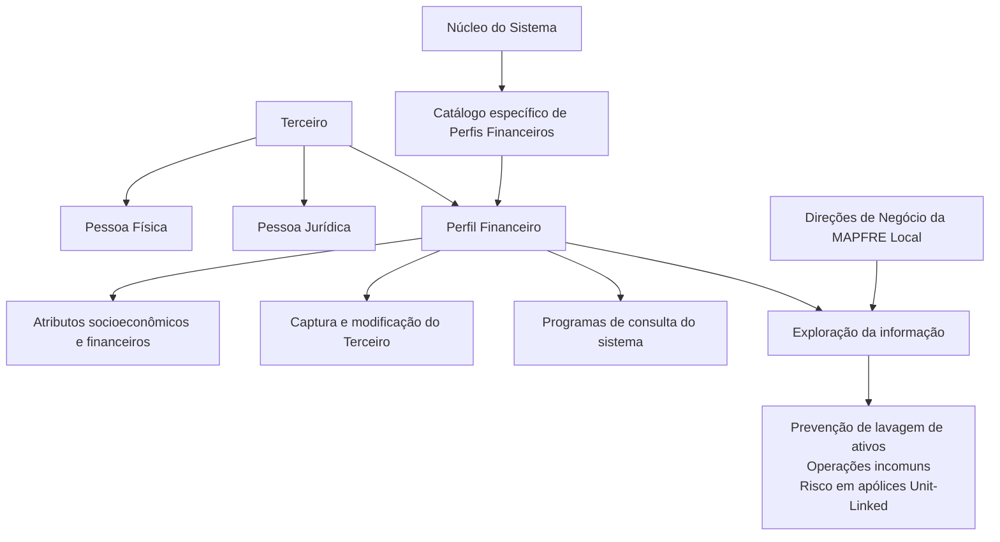

# Definição de Perfis Financeiros de Terceiros — Documentação Reef

## 1. Metadados do Documento
- **Arquivo de Origem:** Não identificado no conteúdo fornecido
- **Tipo de Documento:** Especificação Funcional
- **Domínio / Sistema:** Reef / Sistema MAPFRE Local / Gestão de Terceiros
- **Público-Alvo:** Negócio, analistas funcionais, desenvolvedores e operação
- **Data/Versão Identificada:** Não identificada

---

## 2. Resumo Executivo & Contexto de Negócio

O documento define o conceito e as propriedades dos **Perfis Financeiros de Terceiros** no núcleo do sistema. Esses perfis representam um conjunto de atributos e características socioeconômicas e financeiras de clientes que podem ser indivíduos ou empresas.

Os atributos citados incluem tolerância ao risco, idade, período de realização dos investimentos, objetivos de rentabilidade, rendimentos, património pessoal ou empresarial e conhecimentos financeiros. O conjunto desses atributos forma perfis financeiros associáveis à identificação e à captura de informações dos Terceiros.

A informação dos perfis financeiros pode ser explorada posteriormente conforme critérios definidos pelas Direções de Negócio da entidade MAPFRE Local. Os exemplos de utilização apresentados são prevenção de lavagem de ativos, identificação de operações incomuns e classificação técnica do perfil de risco de Terceiros na emissão de apólices Unit-Linked.

Funcionalmente, o núcleo do Sistema permite identificar e codificar perfis financeiros para Terceiros, tanto Pessoas Físicas quanto Pessoas Jurídicas, em um catálogo de informação específico. A definição ocorre por idioma e por companhia, permitindo identificar cada perfil individualmente por uma denominação ou texto descritivo.

O documento também estabelece propriedades operacionais para aplicação do perfil, ordenação de visualização, inabilitação e data de validade. Não há recomendação corporativa para padronizar a codificação das atividades dos Terceiros no sistema.

---

## 3. Arquitetura, Componentes & Tecnologias Envolvidas

Os elementos funcionais identificados são:

- **Núcleo do Sistema:** componente que permite identificar e codificar Perfis Financeiros de Terceiros.
- **Catálogo de informação específico:** estrutura na qual os Perfis Financeiros são mantidos.
- **Terceiros:** entidades às quais os perfis podem ser associados; podem ser Pessoas Físicas ou Pessoas Jurídicas.
- **MAPFRE Local:** entidade cujas Direções de Negócio determinam critérios para exploração das informações.
- **Programas de consulta do sistema:** programas que exibem os Perfis Financeiros conforme a propriedade de Ordem de Visualização.
- **Operações de captura e modificação do Terceiro:** operações que respeitam a propriedade de Inabilitação do Perfil Financeiro.
- **Apólices Unit-Linked:** contexto citado para classificação técnica do perfil de risco do Terceiro.



> **Nota de Análise:** O documento não descreve tecnologias de implementação, APIs, métodos HTTP, contratos JSON, bancos de dados, URLs, servidores, ambientes técnicos ou integrações entre sistemas.

---

## 4. Regras de Negócio, Especificações Funcionais & Processos

### 4.1 Definição do Perfil Financeiro

1. Um Perfil Financeiro é composto por atributos e características socioeconômicas e financeiras de um cliente.
2. O cliente pode ser um indivíduo ou uma empresa.
3. Os atributos exemplificados incluem:
   - Maior ou menor tolerância ao risco.
   - Idade.
   - Período no qual serão realizados investimentos.
   - Objetivos de rentabilidade.
   - Rendimentos.
   - Património pessoal ou empresarial.
   - Conhecimentos financeiros.
4. Os Perfis Financeiros podem ser associados durante a identificação e a captura de informação dos Terceiros.
5. Os Perfis Financeiros são mantidos em catálogo específico de informação no núcleo do Sistema.

### 4.2 Aplicabilidade por Tipo de Terceiro

1. O Perfil Financeiro pode ser usado para Pessoas Físicas ou para Pessoas Jurídicas.
2. A propriedade operacional denominada **Uso em Pessoas Físicas** determina se um Perfil Financeiro é utilizado por Pessoas Físicas ou por Pessoas Jurídicas.

### 4.3 Definição por Idioma e Companhia

1. A definição dos Perfis Financeiros é realizada por idioma.
2. A definição dos Perfis Financeiros é realizada em nível de companhia.
3. Cada Perfil Financeiro pode ser denominado e identificado individualmente por uma denominação ou texto descritivo.

### 4.4 Ordem de Visualização

1. A propriedade **Ordem de Visualização** determina a ordem de apresentação dos Perfis Financeiros nos programas de consulta do Sistema.

### 4.5 Inabilitação

1. A propriedade **Inabilitação** informa ao Sistema que o Perfil Financeiro está inabilitado.
2. Um Perfil Financeiro inabilitado não pode ser utilizado em operações de captura e/ou modificação do Terceiro.

### 4.6 Data de Validade

1. A propriedade **Data de Validade** informa a data a partir da qual o Perfil Financeiro está plenamente operacional no Sistema.
2. O uso correto da Data de Validade permite manter histórico das alterações efetuadas nas definições dos Perfis Financeiros.

### 4.7 Exploração da Informação

As Direções de Negócio da entidade MAPFRE Local podem determinar critérios para explorar as informações dos Perfis Financeiros, incluindo:

- Prevenção de lavagem de ativos.
- Identificação de operações incomuns.
- Classificação técnica do perfil de risco do Terceiro na emissão de apólices Unit-Linked.

### 4.8 Diretriz Corporativa sobre Codificação de Atividades

Não existe preferência ou recomendação corporativa para estabelecer ou padronizar, no Sistema, a codificação das atividades dos Terceiros.

---

## 5. Tabelas de Parâmetros, Ambientes e Estruturas de Dados

| Item / Parâmetro | Descrição / Função | Tipo / Valores / Formato | Ambiente / Observações |
| :--- | :--- | :--- | :--- |
| Perfil Financeiro | Conjunto de atributos e características socioeconômicas e financeiras de um Terceiro. | Informação catalogada no Sistema. | Aplicável a Pessoas Físicas e Pessoas Jurídicas. |
| Terceiro | Cliente cujas informações podem receber associação de um Perfil Financeiro. | Indivíduo ou empresa. | Identificado e capturado no Sistema. |
| Tolerância ao risco | Característica financeira citada como parte de um Perfil Financeiro. | Maior ou menor tolerância ao risco. | Não há escala ou valores detalhados. |
| Idade | Característica citada como parte de um Perfil Financeiro. | Não detalhado. | Não há regra de cálculo ou faixa etária. |
| Período de investimentos | Período no qual os investimentos serão realizados. | Não detalhado. | Citado como atributo de perfil. |
| Objetivos de rentabilidade | Objetivos financeiros do Terceiro. | Não detalhado. | Citado como atributo de perfil. |
| Rendimentos | Rendimentos pessoais ou empresariais relacionados ao Perfil Financeiro. | Não detalhado. | Citado como atributo de perfil. |
| Património | Património pessoal ou empresarial relacionado ao Perfil Financeiro. | Pessoal ou empresarial. | Citado como atributo de perfil. |
| Conhecimentos financeiros | Conhecimentos financeiros do Terceiro. | Não detalhado. | Citado como atributo de perfil. |
| Idioma | Escopo de definição do Perfil Financeiro. | Por idioma. | A definição ocorre por idioma. |
| Companhia | Escopo organizacional de definição do Perfil Financeiro. | Nível de companhia. | A definição ocorre por companhia. |
| Denominação / texto descritivo | Forma de denominar e identificar individualmente o Perfil Financeiro. | Texto. | Sem formato, tamanho ou campos detalhados. |
| Uso em Pessoas Físicas | Determina se o Perfil Financeiro definido é usado para Pessoas Físicas ou Pessoas Jurídicas. | Propriedade operacional. | O documento não informa valores técnicos ou representação no Sistema. |
| Ordem de Visualização | Determina a ordem de apresentação dos Perfis Financeiros. | Propriedade operacional. | Aplicada aos programas de consulta do Sistema. |
| Inabilitação | Indica que o Perfil Financeiro não pode ser empregado. | Propriedade. | Bloqueia captura e/ou modificação do Terceiro. |
| Data de Validade | Data a partir da qual o Perfil Financeiro está plenamente operativo. | Data. | Permite histórico das alterações de definição. |
| Catálogo específico | Estrutura funcional que armazena Perfis Financeiros de Terceiros. | Catálogo de informação. | Disponibilizado pelo núcleo do Sistema. |
| MAPFRE Local | Entidade cujas Direções de Negócio definem critérios de exploração da informação. | Entidade organizacional. | Sem ambientes técnicos ou servidores descritos. |

---

## 6. Bateria de Perguntas & Respostas para RAG (FAQ Sintético)

### P1: O que é um Perfil Financeiro de Terceiro no Sistema?
**R:** Um Perfil Financeiro de Terceiro é um conjunto de atributos e características socioeconômicas e financeiras de um cliente, que pode ser um indivíduo ou uma empresa. Entre os exemplos de atributos estão tolerância ao risco, idade, período de investimentos, objetivos de rentabilidade, rendimentos, património e conhecimentos financeiros.

### P2: Quais tipos de Terceiro podem possuir um Perfil Financeiro?
**R:** Os Perfis Financeiros podem ser associados a Terceiros que sejam Pessoas Físicas ou Pessoas Jurídicas. A propriedade operacional denominada Uso em Pessoas Físicas indica se o Perfil Financeiro definido é utilizado para Pessoas Físicas ou para Pessoas Jurídicas.

### P3: Onde os Perfis Financeiros de Terceiros são mantidos?
**R:** O núcleo do Sistema permite identificar e codificar os Perfis Financeiros de Terceiros em um catálogo de informação específico.

### P4: Como os Perfis Financeiros são definidos no contexto organizacional?
**R:** A definição dos Perfis Financeiros é realizada por idioma e em nível de companhia. Cada perfil pode ser denominado e identificado individualmente mediante uma denominação ou texto descritivo.

### P5: Para que serve a propriedade Ordem de Visualização?
**R:** A propriedade Ordem de Visualização indica a ordem em que os Perfis Financeiros serão mostrados nos programas de consulta do Sistema.

### P6: O que acontece quando um Perfil Financeiro está inabilitado?
**R:** Quando a propriedade Inabilitação informa que um Perfil Financeiro está inabilitado, esse Perfil Financeiro não pode ser empregado nas operações de captura e/ou modificação do Terceiro.

### P7: Qual é a finalidade da Data de Validade de um Perfil Financeiro?
**R:** A Data de Validade informa a partir de qual data o Perfil Financeiro está plenamente operativo no Sistema. O uso correto dessa propriedade permite manter histórico das alterações feitas nas definições dos Perfis Financeiros.

### P8: Como as Direções de Negócio da MAPFRE Local podem utilizar as informações dos Perfis Financeiros?
**R:** As Direções de Negócio da MAPFRE Local podem determinar critérios para explorar as informações dos Perfis Financeiros, por exemplo para prevenir lavagem de ativos, identificar operações incomuns e classificar tecnicamente o perfil de risco do Terceiro na emissão de apólices Unit-Linked.

### P9: Existe um padrão corporativo para a codificação das atividades dos Terceiros?
**R:** Não. O documento afirma que não existe corporativamente uma preferência ou recomendação para estabelecer ou padronizar no Sistema a codificação das atividades dos Terceiros.

### P10: O documento define métodos HTTP, APIs ou contratos JSON para Perfis Financeiros?
**R:** Não. O conteúdo fornecido descreve propriedades funcionais dos Perfis Financeiros, mas não detalha APIs, métodos HTTP, contratos JSON, integrações técnicas, bancos de dados ou tecnologias de implementação.

---

## 7. Glossário de Termos, Siglas & Conceitos-Chave

- **Perfil Financeiro:** Conjunto de atributos e características socioeconômicas e financeiras de um Terceiro.
- **Terceiro:** Cliente que pode ser indivíduo ou empresa e ao qual um Perfil Financeiro pode ser associado.
- **Pessoa Física:** Tipo de Terceiro referido no documento.
- **Pessoa Jurídica:** Tipo de Terceiro referido no documento.
- **MAPFRE Local:** Entidade cujas Direções de Negócio podem determinar critérios de exploração das informações dos Perfis Financeiros.
- **Direções de Negócio:** Áreas que determinam critérios para exploração posterior da informação dos Perfis Financeiros.
- **Unit-Linked:** Tipo de apólice citado no contexto de classificação técnica do perfil de risco do Terceiro.
- **Inabilitação:** Propriedade que impede o uso de um Perfil Financeiro em operações de captura e/ou modificação do Terceiro.
- **Data de Validade:** Propriedade que define a data a partir da qual o Perfil Financeiro está plenamente operativo.
- **Ordem de Visualização:** Propriedade que define a sequência de exibição dos Perfis Financeiros em programas de consulta.
- **Reef:** Nome presente na documentação fornecida; o texto não detalha seu significado ou arquitetura.
- **VL:** Sigla exibida na interface de documentação; o texto não apresenta seu significado.

---

## 8. Notas Críticas, Riscos & Limitações

- O documento recomenda a leitura de diretrizes e documentos funcionais relacionados, pois a interpretação isolada do conteúdo pode conduzir a erro.
- A referência vinculada explicitamente é **Actividades de Terceros**.
- Não existe recomendação corporativa para codificação ou padronização das atividades dos Terceiros no Sistema.
- Não foram informados valores permitidos, formatos de campos, critérios de validação, escalas de risco, regras de preenchimento, permissões, APIs, contratos de integração, ambientes, servidores ou rotas de logs.
- O documento cita o uso de Perfis Financeiros para prevenção de lavagem de ativos e identificação de operações incomuns, mas não detalha procedimentos de monitoramento, critérios de alerta ou regras de classificação.
- O documento cita apólices Unit-Linked, mas não detalha regras de emissão, cálculo de risco ou relação operacional específica entre o Perfil Financeiro e a apólice.
- **Nota de Análise:** A documentação lista propriedades funcionais do Perfil Financeiro, porém não descreve a implementação técnica dessas propriedades no Sistema.

---

## 9. Conteúdo Bruto Estruturado (Referência Fiel)

```text
--- [PÁGINA 1 DE 2] ---

DEFINICIÓN de Perles Financieros de Terceros
Contexto
En los diferentes procesos que se circunscriben a la actividad propia de una entidad aseguradora en ocasiones es necesario identicar el
conjunto de atributos y características socioeconómicas y nancieras del cliente, ya sea éste un individuo o una empresa (entre los que se
encuentran su mayor o menor tolerancia al riesgo, la edad, el periodo de tiempo en el que se van a realizar las inversiones, los objetivos de
rentabilidad, los ingresos y el patrimonio personal o de la empresa, los conocimientos nancieros, etc.)
Este conjunto de atributos y características conformarán los distintos perles nancieros, perles que se podrán asociar en la identicación
y captura de información de los Terceros y que permitirán explotar posteriormente su información con los criterios que determinen las
Direcciones de Negocio de la entidad MAPFRE Local, como por ejemplo para prevenir el lavado de activos, para la identicación de
operaciones inusuales, para clasicar técnicamente el perl de riesgo del Tercero en la emisión de pólizas de Unit-Linked,…
Propiedades Generales
Funcionalmente, el núcleo del Sistema cuenta con la posibilidad de identicar y codicar los diferentes Perles Financieros de los Terceros,
sean estos personas Físicas o Jurídicas, en un catálogo de información especíco.
La denición de los perles nancieros se realiza por idioma y a nivel de compañía pudiendo denominar e identicar individualmente cada
uno de ellos mediante una denominación o texto descriptivo.
Propiedades Operativas
Uso en Personas Físicas
Este atributo indica si el perl nanciero denido se usa para personas físicas o bien para personas Jurídicas.
Orden de Visualización
Este atributo indica el orden en el que se mostrarán los perles nancieros en los programas de consulta del sistema.
Otras Propiedades
Inhabilitación
Esta propiedad le indica al Sistema que el Perl Financiero está inhabilitado para poder ser empleado en las operaciones de captura y/o
modicación del Tercero.
Fecha de Validez
Esta propiedad le indica al Sistema la fecha a partir de la cual el Perl Financiero está plenamente operativo en el sistema por lo que su
correcto uso permite tener un histórico de los cambios efectuados en sus deniciones.
Documentation / DOCUMENTACIÓN Reef
DOCUMENTACIÓN Reef
Mapfredocument
DOCUMENTACIÓN Reef
Owner
user:agonzalez_mapfre.com
Lifecycle
Approved Source
 /
VL
Buscar Inicio Soluciones Arquitecturas APIs Componentes Cloud Documentación Zeus Reef Ayuda
ES

--- [PÁGINA 2 DE 2] ---

Vínculos
Relación de Directrices y Documentos funcionales cuya lectura recomendada para evitar que la interpretación aislada del presente
documento pueda conducir a error.
Actividades de Terceros
Preguntas frecuentes
(1) ¿Existe alguna recomendación operativa que deba ser tomada en consideración localmente en la codicación, uso y denición de los
Perles Financieros de los Terceros en el Sistema?
No existe Corporativamente una preferencia o recomendación para establecer o estandarizar en el sistema la codicación de las actividades
de los Terceros en el sistema.
```
