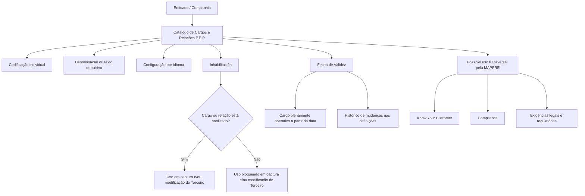

# Definição de Cargos e Relações de Pessoas Politicamente Expostas (P.E.P.) no Sistema Reef

## 1. Metadados do Documento
- **Arquivo de Origem:** Não informado; conteúdo extraído de “DEFINICIÓN de Cargos de Personas Políticamente Expuestas”
- **Tipo de Documento:** Especificação Funcional
- **Domínio / Sistema:** Reef / catálogo de Cargos e Relações de Pessoas Politicamente Expostas
- **Público-Alvo:** Negócio, Compliance, Operação, Administradores funcionais e Desenvolvedores
- **Data/Versão Identificada:** Não identificada
- **Status identificado:** Approved Source
- **Owner identificado:** `user:agonzalez_mapfre.com`

---

## 2. Resumo Executivo & Contexto de Negócio

O documento define o tratamento funcional de **Cargos ou Relações de Pessoas Politicamente Expostas (P.E.P.)** no núcleo do Sistema Reef. Uma Pessoa Politicamente Exposta é apresentada como uma pessoa com exposição política ou responsabilidade pública proeminente, condição que pode elevar o risco potencial de participação em subornos e corrupção devido à posição e à influência exercida.

O Sistema Reef disponibiliza um catálogo específico para identificar e codificar cargos ou relações associados a Pessoas Politicamente Expostas. Esse catálogo é inicialmente entregue às entidades sem conteúdo, cabendo a cada entidade configurar as informações necessárias para sua operação.

A manutenção dos cargos e relações P.E.P. ocorre no nível de companhia e por idioma, incluindo Espanhol, Inglês e outros idiomas não detalhados. Cada cargo ou relação deve ser individualmente identificado por uma codificação e por uma denominação ou texto descritivo, como nos exemplos “Presidente del Gobierno”, “Vicepresidente” e “Tribunal Supremo”.

O catálogo possui propriedades operacionais relevantes: a **Inhabilitación**, que impede o uso de determinado cargo ou relação em operações de captura e/ou modificação de Terceiro; e a **Fecha de Validez**, que estabelece a data a partir da qual o cargo está plenamente operativo no sistema e permite manter histórico das alterações nas definições.

O documento não impõe um padrão de codificação para todas as entidades. Entretanto, indica que a entidade MAPFRE deve avaliar a conveniência de usar o catálogo transversalmente em processos corporativos, especialmente em práticas de Know Your Customer, Compliance e aderência a exigências legais e regulatórias relacionadas a Anti Money Laundering, Reglamento General de Protección de Datos e Electronic IDentification, Authentication and Trust Services.

---

## 3. Arquitetura, Componentes & Tecnologias Envolvidas

### Componentes e conceitos identificados

| Componente / Conceito | Papel identificado no documento |
| :--- | :--- |
| Sistema Reef | Núcleo do sistema que permite identificar e codificar cargos ou relações de Pessoas Politicamente Expostas. |
| Catálogo de Cargos e Relações P.E.P. | Repositório específico de informação sobre cargos e relações P.E.P.; é entregue inicialmente vazio às entidades. |
| Entidade / companhia | Escopo organizacional no qual os cargos ou relações P.E.P. podem ser codificados e administrados. |
| Idioma | Dimensão de manutenção do catálogo; são citados Espanhol, Inglês e outros idiomas. |
| Terceiro | Entidade funcional sujeita a operações de captura e/ou modificação que podem utilizar cargos ou relações P.E.P. habilitados. |
| MAPFRE | Entidade citada como responsável por avaliar o uso transversal do catálogo em seus processos corporativos. |
| Processos Know Your Customer | Exemplo de possível exploração do catálogo para verificação de identidade de clientes, conforme exigências legais e regulatórias. |
| Processos Compliance | Processo corporativo citado como potencial consumidor transversal das informações do catálogo. |

### Fluxo funcional identificado



> **Nota de Análise:** O documento descreve o catálogo funcional e suas propriedades, mas não detalha arquitetura técnica, banco de dados, APIs, métodos HTTP, contratos JSON, autenticação, mecanismos de auditoria, ambientes ou integrações sistêmicas.

---

## 4. Regras de Negócio, Especificações Funcionais & Processos

### 4.1. Definição de Pessoa Politicamente Exposta

1. Uma P.E.P. é uma pessoa exposta politicamente ou com responsabilidade pública proeminente.
2. Uma P.E.P. pode apresentar maior risco potencial de envolvimento em subornos e corrupção.
3. O risco é associado à posição ocupada e à influência que a pessoa possa ter.
4. O documento informa a denominação em inglês: **Politically Exposed Person**.

### 4.2. Catálogo de cargos e relações P.E.P.

1. O núcleo do Sistema Reef permite identificar e codificar cargos ou relações de Pessoas Politicamente Expostas.
2. Os cargos ou relações P.E.P. são mantidos em um catálogo de informação específico.
3. O catálogo é entregue às entidades inicialmente vazio de conteúdo.
4. A codificação do catálogo é permitida no nível de companhia.
5. A codificação do catálogo é permitida por idioma.
6. Os idiomas explicitamente citados são Espanhol e Inglês; o documento indica a possibilidade de outros idiomas.
7. Cada cargo ou relação deve ser identificado individualmente por:
   - uma codificação;
   - uma denominação ou texto descritivo.

### 4.3. Exemplos de codificação apresentados

| Código | Cargo P.E.P. / Descrição |
| :--- | :--- |
| `00` | Presidente del Gobierno |
| `01` | Vicepresidente |
| `02` | Tribunal Supremo |

> **Nota de Análise:** A sequência de exemplos é apresentada com reticências. O documento não fornece o catálogo completo, nem define a quantidade total de códigos, suas regras de formação ou uma codificação corporativa obrigatória.

### 4.4. Regra de inabilitação

1. A propriedade **Inhabilitación** informa ao Sistema Reef que um Cargo ou Relação P.E.P. está inabilitado.
2. Um Cargo ou Relação P.E.P. inabilitado não pode ser empregado nas operações de:
   - captura do Terceiro;
   - modificação do Terceiro.

### 4.5. Regra de data de validade

1. A propriedade **Fecha de Validez** informa a data a partir da qual o cargo está plenamente operativo no sistema.
2. O uso correto da Fecha de Validez permite manter um histórico das alterações efetuadas nas definições dos cargos.
3. O documento não define formato de data, regras de retroatividade, tratamento para datas futuras ou critérios de expiração.

### 4.6. Diretriz sobre padronização de codificação

1. Não existe preferência ou recomendação para estabelecer ou padronizar a codificação no sistema.
2. A entidade MAPFRE deve analisar a conveniência de utilizar transversalmente o catálogo de informações nos processos da companhia.
3. A avaliação deve considerar a correta exploração posterior das informações catalogadas.

### 4.7. Possíveis usos corporativos citados

O documento cita, como exemplos de uso transversal do catálogo P.E.P.:

1. Práticas de **Know Your Customer** para verificar a identidade dos clientes da entidade.
2. Atendimento a exigências legais, normativas e regulatórias vigentes.
3. Processos de **Compliance**.
4. Contextos relacionados a:
   - Anti Money Laundering;
   - Reglamento General de Protección de Datos;
   - Electronic IDentification, Authentication and Trust Services.

> **Nota de Análise:** Os usos corporativos são apresentados como exemplos (“e.g.”). O documento não estabelece fluxos obrigatórios, regras de decisão, critérios de risco, validações documentais ou integrações técnicas para Know Your Customer, Compliance, Anti Money Laundering, proteção de dados ou identificação eletrônica.

---

## 5. Tabelas de Parâmetros, Ambientes e Estruturas de Dados

### 5.1. Estrutura funcional do catálogo P.E.P.

| Item / Parâmetro | Descrição / Função | Tipo / Valores / Formato | Ambiente / Observações |
| :--- | :--- | :--- | :--- |
| Catálogo de informação P.E.P. | Catálogo específico para identificar e codificar cargos ou relações de Pessoas Politicamente Expostas. | Catálogo funcional. | Entregue inicialmente vazio às entidades. |
| Companhia | Nível organizacional no qual é permitida a codificação de cargos e relações P.E.P. | Escopo organizacional. | Não há companhias específicas detalhadas além da referência à MAPFRE. |
| Idioma | Dimensão de manutenção das denominações dos cargos ou relações P.E.P. | Espanhol, Inglês e outros não especificados. | O documento não define códigos de idioma nem mecanismo de tradução. |
| Código do cargo | Identificador individual do cargo ou relação P.E.P. | Exemplos: `00`, `01`, `02`. | Não existe padrão obrigatório de codificação identificado. |
| Denominação / texto descritivo | Nome descritivo individual do cargo ou relação P.E.P. | Texto. | Exemplos apresentados em Espanhol. |
| Inhabilitación | Indica que o cargo ou relação P.E.P. não pode ser usado. | Estado de inabilitação; valores específicos não informados. | Bloqueia uso nas operações de captura e/ou modificação do Terceiro. |
| Fecha de Validez | Indica a data a partir da qual o cargo se torna plenamente operativo. | Data; formato não informado. | Possibilita histórico de mudanças nas definições dos cargos. |
| Terceiro | Objeto funcional sujeito a captura e/ou modificação. | Entidade funcional; estrutura não detalhada. | Pode utilizar cargos ou relações P.E.P. desde que habilitados. |

### 5.2. Exemplos de cargos P.E.P.

| Item / Parâmetro | Descrição / Função | Tipo / Valores / Formato | Ambiente / Observações |
| :--- | :--- | :--- | :--- |
| `00` | Presidente del Gobierno | Código de Cargo P.E.P. | Exemplo apresentado pelo documento. | Não são fornecidas regras adicionais. |
| `01` | Vicepresidente | Código de Cargo P.E.P. | Exemplo apresentado pelo documento. | Não são fornecidas regras adicionais. |
| `02` | Tribunal Supremo | Código de Cargo P.E.P. | Exemplo apresentado pelo documento. | Não são fornecidas regras adicionais. |

### 5.3. Referências documentais relacionadas

| Documento / Referência | Descrição / Função | Tipo / Valores / Formato | Ambiente / Observações |
| :--- | :--- | :--- | :--- |
| Cargos/Funciones en Personas Jurídicas | Documento funcional relacionado, cuja leitura é recomendada. | Referência documental. | O conteúdo não foi fornecido na extração. |
| Preguntas frecuentes | Seção de perguntas frequentes sobre codificação, uso e definição do catálogo de cargos e relações P.E.P. | Referência funcional. | Uma pergunta e sua resposta são apresentadas no conteúdo extraído. |
| DOCUMENTACIÓN Reef | Área documental indicada no conteúdo bruto. | Repositório/documentação. | Não há URL fornecida. |
| Mapfredocument | Termo exibido na navegação documental. | Referência de portal ou documentação. | Finalidade técnica não detalhada. |

---

## 6. Bateria de Perguntas & Respostas para RAG (FAQ Sintético)

### P1: O que é uma Pessoa Politicamente Exposta (P.E.P.) no contexto do documento?
**R:** Uma Pessoa Politicamente Exposta, ou P.E.P., é uma pessoa exposta politicamente ou que possui responsabilidade pública proeminente. O documento indica que uma P.E.P. pode representar maior risco potencial de envolvimento em subornos e corrupção devido à posição que ocupa e à influência que pode exercer.

### P2: Qual é a finalidade do catálogo de Cargos e Relações P.E.P. no Sistema Reef?
**R:** O catálogo específico de Cargos e Relações P.E.P. permite ao núcleo do Sistema Reef identificar e codificar cargos ou relações associados a Pessoas Politicamente Expostas. O catálogo é entregue inicialmente vazio às entidades, que podem configurá-lo para suas necessidades operacionais.

### P3: Como os cargos ou relações P.E.P. podem ser cadastrados no Sistema Reef?
**R:** O Sistema Reef permite codificar cargos ou relações P.E.P. no nível de companhia e por idioma. Cada cargo ou relação deve ser identificado individualmente por uma codificação e por uma denominação ou texto descritivo.

### P4: Quais idiomas são mencionados para a codificação dos cargos e relações P.E.P.?
**R:** O documento cita explicitamente Espanhol e Inglês, além de indicar a possibilidade de outros idiomas. Não são informados códigos de idioma, regras de tradução ou critérios para sincronização entre versões linguísticas.

### P5: O que acontece quando um Cargo ou Relação P.E.P. está inabilitado?
**R:** Quando a propriedade Inhabilitación indica que um Cargo ou Relação P.E.P. está inabilitado, esse cargo ou relação não pode ser utilizado nas operações de captura e/ou modificação do Terceiro.

### P6: Qual é a função da Fecha de Validez no catálogo P.E.P.?
**R:** A Fecha de Validez informa ao Sistema Reef a data a partir da qual o cargo está plenamente operativo. Seu uso correto permite manter um histórico das alterações realizadas nas definições dos cargos.

### P7: Existe uma codificação obrigatória ou padronizada para cargos e relações P.E.P.?
**R:** Não. O documento afirma que não existe preferência ou recomendação para estabelecer ou padronizar a codificação no sistema. Apesar disso, a entidade MAPFRE deve analisar a conveniência de usar o catálogo de forma transversal em processos corporativos.

### P8: Quais exemplos de códigos de cargos P.E.P. são apresentados?
**R:** O documento apresenta os exemplos `00` para “Presidente del Gobierno”, `01` para “Vicepresidente” e `02` para “Tribunal Supremo”. A extração não contém a relação completa de cargos nem regras formais para criação de novos códigos.

### P9: Em quais processos corporativos o catálogo P.E.P. pode ser explorado?
**R:** O documento cita como exemplos práticas de Know Your Customer para verificação de identidade dos clientes, processos de Compliance e atendimento a exigências legais, normativas e regulatórias relacionadas a Anti Money Laundering, Reglamento General de Protección de Datos e Electronic IDentification, Authentication and Trust Services.

### P10: O documento detalha APIs, integrações ou contratos técnicos do catálogo P.E.P.?
**R:** Não. O conteúdo descreve propriedades e regras funcionais do catálogo, mas não fornece detalhes sobre APIs, métodos HTTP, estruturas de dados persistidas, contratos JSON, integrações, autenticação, URLs de ambiente ou tecnologias de implementação.

---

## 7. Glossário de Termos, Siglas & Conceitos-Chave

- **P.E.P.:** Persona Políticamente Expuesta; pessoa exposta politicamente ou com responsabilidade pública proeminente.
- **Politically Exposed Person:** Denominação em inglês de P.E.P., informada no documento.
- **Cargo P.E.P.:** Cargo associado a uma Pessoa Politicamente Exposta, identificado por código e denominação ou texto descritivo.
- **Relação P.E.P.:** Relação associada a uma Pessoa Politicamente Exposta que pode ser identificada e codificada no catálogo específico.
- **Inhabilitación:** Propriedade que indica que um Cargo ou Relação P.E.P. não pode ser usado nas operações de captura e/ou modificação do Terceiro.
- **Fecha de Validez:** Propriedade que define a data a partir da qual um cargo está plenamente operativo no sistema.
- **Terceiro:** Entidade funcional que pode ser objeto de operações de captura e/ou modificação no Sistema Reef.
- **Know Your Customer:** Prática citada para verificar a identidade dos clientes da entidade.
- **Compliance:** Processo corporativo citado como possível consumidor transversal das informações do catálogo.
- **Anti Money Laundering:** Exigência ou contexto regulatório citado no documento.
- **Reglamento General de Protección de Datos:** Regulamento citado no contexto de exigências legais, normativas e regulatórias.
- **Electronic IDentification, Authentication and Trust Services:** Termo citado no contexto de identificação eletrônica, autenticação e serviços de confiança.
- **MAPFRE:** Entidade que deve analisar a conveniência de utilizar transversalmente o catálogo de Cargos e Relações P.E.P.

---

## 8. Notas Críticas, Riscos & Limitações

1. O catálogo de Cargos e Relações P.E.P. é inicialmente entregue vazio, tornando a qualidade e a completude da configuração dependentes de cada entidade.
2. Não há uma recomendação ou padronização de codificação definida pelo documento. Essa ausência pode resultar em diferenças de codificação entre entidades caso não existam diretrizes complementares.
3. A entidade MAPFRE deve avaliar a conveniência de exploração transversal do catálogo; o documento não define essa utilização como obrigatória nem detalha governança, responsáveis ou critérios de aprovação.
4. O documento cita contextos regulatórios e processos como Know Your Customer, Compliance, Anti Money Laundering, Reglamento General de Protección de Datos e Electronic IDentification, Authentication and Trust Services, mas não descreve regras de conformidade, controles operacionais ou mecanismos de validação.
5. Não há detalhes sobre APIs, integrações, persistência, modelos de dados, permissões, perfis de acesso, rastreabilidade, auditoria ou mecanismos de importação e exportação do catálogo.
6. A propriedade Fecha de Validez é descrita como suporte ao histórico de alterações, mas não são especificadas regras para alteração retroativa, sobreposição de períodos, expiração ou desativação automática.
7. A propriedade Inhabilitación bloqueia uso em captura e modificação do Terceiro, mas o documento não esclarece o comportamento para registros históricos já associados a cargos ou relações posteriormente inabilitados.
8. A leitura do documento relacionado **“Cargos/Funciones en Personas Jurídicas”** é recomendada para evitar interpretações isoladas incorretas. Esse documento relacionado não consta no conteúdo extraído.

---

## 9. Conteúdo Bruto Estruturado (Referência Fiel)

```text
--- [PÁGINA 1 DE 2] ---

DEFINICIÓN de Cargos de Personas Políticamente Expuestas
Contexto
En la regulación nanciera, un P.E.P. es un término que describe a las personas que están expuestas políticamente o que tienen una
responsabilidad pública prominente. Por lo general, una PEP presenta un mayor riesgo de participación potencial en sobornos y corrupción en
virtud de su posición y la inuencia que pueda tener.
(En Inglés P.E.P: Politically Exposed Person)
Propiedades Generales
Funcionalmente, el núcleo del Sistema cuenta con la posibilidad de identicar y codicar los Cargos o Relaciones de las Personas
Políticamente Expuestas, en un catálogo de información especíco que se entrega a las entidades inicialmente vacío de contenido.
El sistema permite a nivel de compañía y por idioma (Español, Inglés,...) codicar estos Cargos denominando e identicando individualmente
cada una de ellos mediante una denominación o texto descriptivo.
A modo de ejemplo:
CARGO PEP. DESCRIPCIÓN
00 Presidente del Gobierno
01 Vicepresidente
02 Tribunal Supremo
... ...
Otras Propiedades
Inhabilitación
Esta propiedad le indica al Sistema que el Cargo o Relación del P.E.P está inhabilitado para poder ser empleado en las operaciones de captura
y/o modicación del Tercero.
Fecha de Validez
Esta propiedad le indica al Sistema la fecha a partir de la cual el cargo está plenamente operativo en el sistema por lo que su correcto uso
permite tener un histórico de los cambios efectuados en las deniciones de los cargos.
Documentation / DOCUMENTACIÓN Reef
DOCUMENTACIÓN Reef
Mapfredocument
DOCUMENTACIÓN Reef
Owner
user:agonzalez_mapfre.com
Lifecycle
Approved Source
 / 
 VL
Buscar Inicio Soluciones Arquitecturas APIs Componentes Cloud Documentación Zeus Reef Ayuda
ES


--- [PÁGINA 2 DE 2] ---

Vínculos
Relación de Directrices y Documentos funcionales cuya lectura recomendada para evitar que la interpretación aislada del presente
documento pueda conducir a error.
Cargos/Funciones en Personas Jurídicas
Preguntas frecuentes
(1) ¿Existe alguna recomendación operativa que deba ser tomada en consideración localmente en la codicación, uso y denición del
catálogo de Cargos y Relaciones de los P.E.P.'s en el Sistema?
No existe una preferencia ni recomendación para establecer o estandarizar en el sistema su codicación, si bien la entidad MAPFRE debe
analizar la conveniencia de utilizar transversalmente en los procesos de la compañía este catálogo de información para su correcta y
posterior explotación, e.g: Prácticas Know Your Customer para vericar la identidad de los clientes de la entidad cumpliendo con las
exigencias legales así como con las normativas y regulaciones vigentes (Anti Money Laundering, Reglamento General de Protección de
Datos, Electronic IDentication, Authentication and Trust Services,..), Procesos Compliance, ...
```
