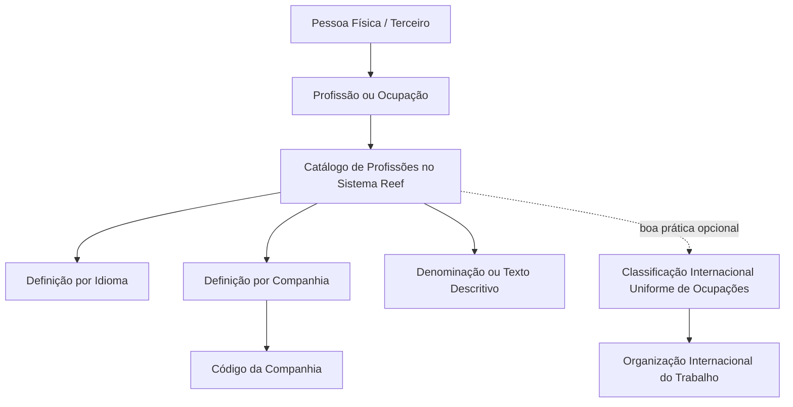

# Definição de Profissões/Ocupações de Pessoas Físicas no Sistema Reef

## 1. Metadados do Documento
- **Arquivo de Origem:** Não identificado no conteúdo fornecido
- **Tipo de Documento:** Especificação Funcional
- **Domínio / Sistema:** Reef — catálogo de Profissões/Ocupações de Terceiros
- **Público-Alvo:** Analistas funcionais, desenvolvedores, operação e equipes de negócio
- **Data/Versão Identificada:** Não identificada
- **Status identificado:** Approved Source
- **Owner identificado:** `user:agonzalez_mapfre.com`

---

## 2. Resumo Executivo & Contexto de Negócio

O documento descreve a funcionalidade de definição e catalogação de Profissões/Ocupações de pessoas físicas no núcleo do Sistema Reef. Uma profissão é entendida como a atividade habitual exercida por uma pessoa, incluindo emprego ou ocupação realizada geralmente em troca de retribuição, remuneração ou salário.

O Sistema Reef permite identificar e codificar profissões em um catálogo de informação específico. Cada profissão pode ser individualmente denominada e identificada por meio de uma denominação ou texto descritivo.

A definição de profissões ocorre por idioma e no nível de companhia. Dessa forma, o código da companhia determina a organização corporativa sobre a qual a profissão de um Terceiro está sendo definida.

O catálogo de Profissões é inicialmente entregue vazio às instalações. O documento não determina uma codificação corporativa obrigatória, mas recomenda como boa prática o uso de uma classificação, como a Classificação Internacional Uniforme de Ocupações da Organização Internacional do Trabalho, para organizar, homogeneizar e posteriormente explorar as informações cadastradas.

---

## 3. Arquitetura, Componentes & Tecnologias Envolvidas

### Componentes e conceitos identificados

| Componente / Conceito | Descrição baseada no documento |
| :--- | :--- |
| Sistema Reef | Sistema cujo núcleo possui capacidade de identificar e codificar Profissões/Ocupações de pessoas físicas. |
| Núcleo do Sistema | Camada funcional que mantém a possibilidade de identificação e codificação das profissões. |
| Catálogo de Profissões | Catálogo de informação específico para registrar Profissões/Ocupações. É inicialmente entregue vazio às instalações. |
| Profissão/Ocupação | Atividade habitual da pessoa, emprego ou ocupação geralmente exercida mediante retribuição, remuneração ou salário. |
| Pessoa Física | Entidade para a qual a profissão ou ocupação é definida. |
| Terceiro | Entidade mencionada na propriedade Companhia e na recomendação sobre codificação de profissões. |
| Companhia | Propriedade que informa ao sistema o código da companhia sobre a qual a profissão do Terceiro está sendo definida. |
| Idioma | Nível no qual a definição de profissões é realizada, juntamente com o nível de companhia. |
| Classificação Internacional Uniforme de Ocupações | Classificação da Organização Internacional do Trabalho sugerida como boa prática para organizar e homogeneizar informações. |
| Organização Internacional do Trabalho | Organização associada à Classificação Internacional Uniforme de Ocupações citada no documento. |
| Mapfredocument | Nome apresentado na navegação/interface documental, sem detalhamento funcional adicional. |
| Zeus | Item apresentado na navegação/interface documental, sem detalhamento funcional adicional. |



**Nota de Análise:** O conteúdo não apresenta tecnologias de implementação, APIs, métodos HTTP, contratos JSON, servidores, URLs de ambiente, mecanismos de persistência ou integrações técnicas.

---

## 4. Regras de Negócio, Especificações Funcionais & Processos

### Definição de Profissão/Ocupação

1. O núcleo do Sistema Reef deve permitir identificar e codificar Profissões/Ocupações de pessoas físicas em um catálogo de informação específico.
2. Para os fins do documento, uma profissão corresponde à atividade habitual da pessoa.
3. Uma profissão também pode corresponder ao emprego ou ocupação que a pessoa geralmente exerce em troca de retribuição, remuneração ou salário.
4. Cada profissão pode possuir uma denominação ou texto descritivo para permitir sua identificação individual.
5. A definição de Profissões/Ocupações deve ser realizada por idioma.
6. A definição de Profissões/Ocupações deve ser realizada no nível de companhia.
7. A propriedade **Companhia** deve informar o código da companhia sobre a qual a definição da profissão do Terceiro está sendo efetuada.
8. O catálogo de Profissões é inicialmente entregue às instalações sem conteúdo.

### Codificação e padronização

1. Não existe preferência ou recomendação corporativa obrigatória para estabelecer ou padronizar a codificação de profissões de Terceiros no sistema.
2. O documento indica que pode ser uma boa prática utilizar alguma classificação para organizar e homogeneizar as informações.
3. A Classificação Internacional Uniforme de Ocupações, da Organização Internacional do Trabalho, é apresentada como exemplo de classificação aplicável.
4. A finalidade da organização e homogeneização é possibilitar a exploração posterior das informações registradas.

### Documentos relacionados

A interpretação isolada do documento pode conduzir a erro. O conteúdo recomenda a leitura das seguintes diretrizes e documentos funcionais relacionados:

- Atividades de Terceiros.
- Definição de Titulações.
- Definição do Nível de Estudos.

---

## 5. Tabelas de Parâmetros, Ambientes e Estruturas de Dados

| Item / Parâmetro | Descrição / Função | Tipo / Valores / Formato | Ambiente / Observações |
| :--- | :--- | :--- | :--- |
| Profissão/Ocupação | Atividade habitual da pessoa, emprego ou ocupação geralmente exercida mediante retribuição, remuneração ou salário. | Conceito funcional | Aplicável a pessoas físicas. |
| Catálogo de Profissões | Repositório de informação específica para identificar e codificar Profissões/Ocupações. | Catálogo funcional | Inicialmente entregue vazio às instalações. |
| Denominação | Nome que permite denominar individualmente uma profissão. | Texto descritivo | O documento não estabelece formato, tamanho ou obrigatoriedade. |
| Texto descritivo | Texto utilizado para identificar individualmente uma profissão. | Texto | O documento não estabelece formato, tamanho ou obrigatoriedade. |
| Idioma | Dimensão utilizada para definir uma profissão. | Não especificado | A definição ocorre por idioma. |
| Companhia | Propriedade que indica o escopo corporativo da definição de profissão do Terceiro. | Código de companhia | O formato do código não é detalhado. |
| Código da Companhia | Código informado ao sistema para determinar a companhia sobre a qual ocorre a definição. | Código | Não há valores, formato ou catálogo de companhias no conteúdo. |
| Codificação de profissões | Forma de codificar profissões de Terceiros no sistema. | Não padronizada corporativamente | Não existe recomendação corporativa obrigatória. |
| Classificação Internacional Uniforme de Ocupações | Exemplo de classificação recomendada como boa prática para organização e homogeneização. | Classificação ocupacional | Associada à Organização Internacional do Trabalho. |
| Status documental | Estado apresentado na interface documental. | `Approved Source` | Não há explicação adicional sobre o ciclo de vida. |
| Owner | Responsável apresentado no conteúdo. | `user:agonzalez_mapfre.com` | Identificado na interface documental. |

---

## 6. Bateria de Perguntas & Respostas para RAG (FAQ Sintético)

### P1: Qual é a finalidade do catálogo de Profissões/Ocupações no Sistema Reef?
**R:** O catálogo de Profissões/Ocupações permite que o núcleo do Sistema Reef identifique e codifique, em uma estrutura de informação específica, as profissões ou ocupações de pessoas físicas.

### P2: Como o documento define uma profissão?
**R:** O documento define profissão como a atividade habitual de uma pessoa, incluindo o emprego ou ocupação que essa pessoa geralmente exerce em troca de retribuição, remuneração ou salário.

### P3: O catálogo de Profissões já contém registros quando é entregue a uma instalação?
**R:** Não. O documento informa explicitamente que o catálogo de Profissões é inicialmente entregue às instalações vazio de conteúdo.

### P4: Em quais dimensões uma profissão é definida no Sistema Reef?
**R:** A definição de Profissões/Ocupações é realizada por idioma e em nível de companhia.

### P5: Qual é a finalidade da propriedade Companhia na definição de uma profissão?
**R:** A propriedade Companhia informa ao sistema o código da companhia sobre a qual está sendo realizada a definição da profissão do Terceiro.

### P6: Existe uma codificação corporativa obrigatória para profissões de Terceiros?
**R:** Não. O documento afirma que não existe corporativamente uma preferência ou recomendação para estabelecer ou padronizar a codificação das profissões de Terceiros no sistema.

### P7: Qual prática é sugerida para padronizar dados de profissões?
**R:** O documento indica como boa prática o uso de alguma classificação que permita organizar e homogeneizar as informações para posterior exploração, citando como exemplo a Classificação Internacional Uniforme de Ocupações da Organização Internacional do Trabalho.

### P8: Como uma profissão pode ser identificada individualmente?
**R:** Cada profissão pode ser denominada e identificada individualmente por meio de uma denominação ou de um texto descritivo.

### P9: Quais documentos devem ser consultados para evitar interpretação isolada da definição de Profissões/Ocupações?
**R:** O documento recomenda consultar “Atividades de Terceiros”, “Definição de Titulações” e “Definição do Nível de Estudos”, pois a interpretação isolada do documento atual pode levar a erro.

### P10: O documento detalha métodos HTTP, contratos JSON ou APIs para o catálogo de profissões?
**R:** Não. O conteúdo fornecido descreve regras funcionais para identificação, codificação e definição de profissões, mas não detalha APIs, métodos HTTP, contratos JSON ou tecnologias de implementação.

---

## 7. Glossário de Termos, Siglas & Conceitos-Chave

- **Reef:** Sistema mencionado como responsável por disponibilizar a funcionalidade de identificação e codificação de Profissões/Ocupações.
- **Profissão/Ocupação:** Atividade habitual, emprego ou ocupação exercida geralmente mediante retribuição, remuneração ou salário.
- **Pessoa Física:** Pessoa para a qual uma Profissão/Ocupação é definida no sistema.
- **Terceiro:** Entidade cuja profissão é definida em associação ao código de uma companhia.
- **Catálogo de Profissões:** Catálogo específico utilizado para registrar, identificar e codificar Profissões/Ocupações.
- **Companhia:** Propriedade que identifica, por código, a companhia sobre a qual a profissão do Terceiro é definida.
- **Idioma:** Dimensão em que a definição de uma profissão é realizada.
- **Classificação Internacional Uniforme de Ocupações:** Classificação citada como possível boa prática para organizar e homogeneizar informações ocupacionais.
- **Organização Internacional do Trabalho:** Organização associada à Classificação Internacional Uniforme de Ocupações mencionada no documento.
- **Titulaciones:** Termo em espanhol listado como documento funcional relacionado; o conteúdo fornecido não define seu significado.
- **Approved Source:** Status de ciclo de vida apresentado na interface documental, sem definição adicional no conteúdo.

---

## 8. Notas Críticas, Riscos & Limitações

- O catálogo de Profissões é entregue inicialmente vazio; a carga inicial, governança e manutenção do conteúdo não são descritas.
- Não existe uma codificação corporativa obrigatória para profissões de Terceiros, o que pode permitir diferenças de classificação entre instalações caso não seja adotada uma prática local de padronização.
- A Classificação Internacional Uniforme de Ocupações é apresentada somente como boa prática e exemplo; o documento não estabelece sua adoção como obrigatória.
- Não são detalhados formatos, tamanhos, obrigatoriedade, validações ou regras de unicidade para denominações, textos descritivos, idiomas e códigos de companhia.
- O documento não descreve permissões de acesso, fluxos de aprovação, auditoria, integrações, APIs, tecnologias ou estrutura física de dados.
- A leitura dos documentos relacionados é recomendada para evitar interpretação incorreta; o conteúdo desses documentos não foi fornecido.
- **Nota de Análise:** O conteúdo apresenta itens de navegação como Mapfredocument, Zeus, Cloud, APIs e Componentes, mas não detalha qualquer relação técnica desses itens com a funcionalidade de Profissões/Ocupações.

---

## 9. Conteúdo Bruto Estruturado (Referência Fiel)

```text
--- [PÁGINA 1 DE 1] ---

DEFINICIÓN de Profesiones/Ocupaciones
Propiedades Generales
Funcionalmente, el núcleo del Sistema cuenta con la posibilidad de identicar y codicar en un catálogo de información especíco las
Profesiones/Ocupaciones de las personas físicas entendiendo por profesión a la actividad habitual de la persona, el empleo u ocupación que
generalmente ejerce a cambio de una retribución, remuneración o salario.
La denición de las Profesiones de las personas Físicas se realiza por idioma y a nivel de compañía pudiendo denominar e identicar
individualmente cada una de ellas mediante una denominación o texto descriptivo.
NOTA: El catálogo de Profesiones se entrega inicialmente a las instalaciones vacío de contenido.
Compañía
Esta propiedad le indica al sistema el código de la compañía sobre la que se está realizando la denición de la Profesión del Tercero.
Vínculos
Relación de Directrices y Documentos funcionales cuya lectura recomendada para evitar que la interpretación aislada del presente
documento pueda conducir a error.
Actividades de Terceros
Denición de Titulaciones
Denición del Nivel de Estudios
Preguntas frecuentes
(1) ¿Existe alguna recomendación operativa que deba ser tomada en consideración localmente en la codicación, uso y denición de las
Profesiones de los Terceros en el Sistema?
No existe Corporativamente una preferencia o recomendación para establecer o estandarizar en el sistema la codicación de las profesiones
de los Terceros en el sistema, sin embargo puede ser una buena práctica utilizar alguna Clasicación, tal y como la Clasicación Internacional
Uniforme de Ocupaciones de la Organización Internacional del Trabajo, que permita organizar y homogeneizar la información para su
posterior explotación.
Documentation / DOCUMENTACIÓN Reef
DOCUMENTACIÓN Reef
Mapfredocument
DOCUMENTACIÓN Reef
Owner
user:agonzalez_mapfre.com
Lifecycle
Approved Source
 / 
 VL
Buscar Inicio Soluciones Arquitecturas APIs Componentes Cloud Documentación Zeus Reef Ayuda
ES
```
