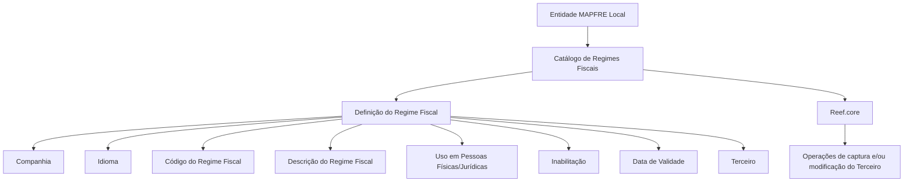

# Definição de Regimes Fiscais no Sistema Reef.core

## 1. Metadados do Documento
- **Arquivo de Origem:** Não informado; conteúdo extraído de documentação Reef.
- **Tipo de Documento:** Especificação Funcional.
- **Domínio / Sistema:** Reef / Reef.core / cadastro de Terceiros / Regimes Fiscais.
- **Público-Alvo:** Analistas funcionais, desenvolvedores, arquitetos, operação e entidades MAPFRE locais.
- **Data/Versão Identificada:** Não identificada.
- **Status identificado no portal:** Lifecycle `Approved`.
- **Owner identificado:** `user:agonzalez_mapfre.com`.

---

## 2. Resumo Executivo & Contexto de Negócio

O documento define o catálogo de **Regimes Fiscais** para Terceiros no sistema Reef. Um regime fiscal é descrito como o conjunto de normas e instituições que regulam a situação tributária de uma pessoa física ou jurídica, incluindo os direitos e as obrigações decorrentes de uma atividade econômica.

O núcleo do sistema permite identificar e codificar os Códigos de Regimes Fiscais atribuíveis a Terceiros. O catálogo específico de Regimes Fiscais é entregue inicialmente sem conteúdo para as entidades, permitindo que cada entidade realize sua própria definição conforme suas necessidades locais.

A entidade MAPFRE Local pode utilizar o atributo de Regime Fiscal para executar uma classificação própria e específica dos Terceiros da entidade. O documento não estabelece preferência, recomendação ou padronização obrigatória para a codificação dos regimes fiscais no sistema.

A definição de cada Regime Fiscal inclui propriedades gerais — como companhia, idioma, código e descrição — e propriedades operacionais, como o tipo de Terceiro aplicável, inabilitação e data de validade. A data de validade permite manter histórico das mudanças efetuadas nas definições das categorias.

A documentação recomenda a leitura do conteúdo relacionado a **Atividades de Terceros** e das **Perguntas frequentes**, pois a interpretação isolada deste documento pode levar a conclusões incorretas.

---

## 3. Arquitetura, Componentes & Tecnologias Envolvidas

Os elementos identificados no documento são:

| Componente / Entidade | Papel identificado |
| :--- | :--- |
| **Reef.core** | Sistema que utiliza propriedades de inabilitação e data de validade do Regime Fiscal. |
| **Sistema Reef** | Núcleo que permite identificar e codificar Códigos de Regimes Fiscais de Terceiros. |
| **Catálogo de Regimes Fiscais** | Catálogo específico de informação entregue inicialmente vazio às entidades. |
| **Terceiro** | Pessoa física e/ou jurídica à qual pode ser associado um Código de Regime Fiscal. |
| **Entidade MAPFRE Local** | Entidade que pode definir e explorar uma classificação própria de Terceiros por Regime Fiscal. |
| **Compañía** | Propriedade que indica o código da companhia para a qual é realizada a definição. |
| **Idioma** | Propriedade que identifica o idioma empregado na definição do Regime Fiscal no catálogo. |
| **Documentación Reef / Mapfredocument** | Contexto documental em que o conteúdo foi publicado. |



**Nota de Análise:** O documento descreve propriedades funcionais do catálogo e sua utilização no Reef.core, mas não detalha arquitetura de infraestrutura, integrações técnicas, métodos HTTP, APIs, contratos JSON, banco de dados, URLs de ambiente, versões ou mecanismos de autenticação.

---

## 4. Regras de Negócio, Especificações Funcionais & Processos

### 4.1 Definição de Regime Fiscal

1. O regime fiscal corresponde ao conjunto de normas e instituições que regem a situação tributária de uma pessoa física ou jurídica.
2. O regime fiscal compreende direitos e obrigações resultantes do desenvolvimento de uma determinada atividade econômica.
3. O núcleo do sistema permite identificar e codificar Códigos de Regimes Fiscais de Terceiros.
4. O catálogo de Regimes Fiscais é específico e inicialmente entregue vazio às entidades.
5. A entidade MAPFRE Local pode usar o atributo de Regime Fiscal para classificar Terceiros de forma própria e específica.

### 4.2 Propriedades Gerais da Definição

1. A propriedade **Compañía** informa o código da companhia para a qual está sendo realizada a definição do Regime Fiscal do Terceiro.
2. A propriedade **Idioma** informa o idioma utilizado na definição do Regime Fiscal dentro do catálogo.
3. São citados como exemplos de idioma: espanhol, inglês e turco.
4. A propriedade **Código del Régimen Fiscal** identifica o código de Regime Fiscal aplicável à pessoa física e/ou jurídica.
5. A propriedade **Descripción del Régimen Fiscal** armazena a denominação ou descrição do Regime Fiscal do Terceiro conforme o idioma utilizado na definição.
6. O documento cita como exemplos, em espanhol:
   - Régimen de Incorporación Fiscal.
   - Enajenación de bienes.
   - Régimen de Actividades Empresariales con Ingresos a través de Plataformas Tecnológicas.
   - Régimen de Arrendamiento.
   - Régimen de Actividades Empresariales y Profesionales.

### 4.3 Uso em Pessoas Físicas e Jurídicas

O atributo **Uso en Personas Físicas/Jurídicas** determina o tipo de Terceiro que pode utilizar o Código de Regime Fiscal definido no sistema. Os valores previstos são:

1. Pessoas físicas.
2. Pessoas jurídicas.
3. Uso indistinto para pessoas físicas e pessoas jurídicas.

### 4.4 Inabilitação do Regime Fiscal

1. A propriedade **Inhabilitación** informa ao Reef.core se determinado Código de Regime Fiscal está inabilitado.
2. Quando o código está inabilitado, ele não pode ser utilizado nas operações de captura e/ou modificação do Terceiro.

### 4.5 Data de Validade

1. A propriedade **Fecha de Validez** informa ao Reef.core a data a partir da qual o Regime Fiscal do Terceiro estará plenamente operacional no sistema.
2. O uso correto da data de validade permite manter histórico das mudanças realizadas nas definições das categorias.

### 4.6 Diretriz Operacional Local

1. Não existe preferência ou recomendação para estabelecer ou padronizar a codificação dos Regimes Fiscais no sistema.
2. A entidade MAPFRE deve analisar a conveniência de utilizar transversalmente o catálogo de informação nos processos da companhia.
3. A análise local deve considerar a correta definição e a posterior exploração do catálogo.

---

## 5. Tabelas de Parâmetros, Ambientes e Estruturas de Dados

| Item / Parâmetro | Descrição / Função | Tipo / Valores / Formato | Ambiente / Observações |
| :--- | :--- | :--- | :--- |
| Regime Fiscal | Conjunto de normas e instituições que regulam a situação tributária de pessoa física ou jurídica. | Conceito funcional tributário. | Relacionado aos direitos e obrigações de uma atividade econômica. |
| Catálogo de Regimes Fiscais | Catálogo específico para identificação e codificação de Regimes Fiscais de Terceiros. | Catálogo de informação. | Entregue inicialmente vazio às entidades. |
| Terceiro | Pessoa física e/ou jurídica associada a um Regime Fiscal. | Entidade funcional. | Participa de operações de captura e/ou modificação. |
| Compañía | Indica o código da companhia para a qual é definida a informação de Regime Fiscal do Terceiro. | Código da companhia. | Propriedade geral da definição. |
| Idioma | Indica o idioma utilizado para definir o Regime Fiscal no catálogo. | Exemplos: espanhol, inglês, turco. | A descrição do Regime Fiscal depende do idioma definido. |
| Código do Regime Fiscal | Identifica o código de Regime Fiscal da pessoa física e/ou jurídica. | Código. | Propriedade geral da definição. |
| Descrição do Regime Fiscal | Denominação ou descrição do Regime Fiscal do Terceiro. | Texto no idioma da definição. | Exemplos fornecidos em espanhol. |
| Uso em Pessoas Físicas/Jurídicas | Determina que tipo de Terceiro pode usar o Código de Regime Fiscal. | Pessoas físicas; pessoas jurídicas; indistintamente ambos. | Propriedade operacional. |
| Inabilitação | Informa se o Código de Regime Fiscal está inabilitado para uso. | Estado de habilitação/inabilitação. | Reef.core bloqueia o uso do código em operações de captura e/ou modificação do Terceiro quando inabilitado. |
| Data de Validade | Indica a data a partir da qual o Regime Fiscal estará plenamente operacional. | Data. | Permite histórico de mudanças nas definições das categorias. |
| Reef.core | Sistema destinatário das propriedades de inabilitação e data de validade. | Sistema. | Não há detalhamento de tecnologia, interfaces ou infraestrutura. |
| MAPFRE Local | Entidade que pode utilizar o atributo para classificação própria de Terceiros. | Entidade organizacional. | Deve avaliar o uso transversal do catálogo em processos da companhia. |
| Lifecycle | Estado documental identificado no portal. | `Approved`. | Associado à Documentación Reef. |
| Owner | Proprietário identificado no portal documental. | `user:agonzalez_mapfre.com`. | Conforme conteúdo extraído. |

---

## 6. Bateria de Perguntas & Respostas para RAG (FAQ Sintético)

### P1: O que é um Regime Fiscal no contexto do sistema Reef?
**R:** No contexto do sistema Reef, um Regime Fiscal é o conjunto de normas e instituições que regem a situação tributária de uma pessoa física ou jurídica. O conceito inclui os direitos e obrigações que surgem do desenvolvimento de determinada atividade econômica.

### P2: Para que serve o catálogo de Regimes Fiscais de Terceiros?
**R:** O catálogo de Regimes Fiscais permite ao núcleo do sistema identificar e codificar os Códigos de Regimes Fiscais dos Terceiros. O catálogo é específico e é entregue inicialmente vazio às entidades, que podem realizar suas próprias definições.

### P3: O catálogo de Regimes Fiscais já possui conteúdo quando é entregue à entidade?
**R:** Não. O documento informa que o catálogo específico de Regimes Fiscais é entregue às entidades inicialmente vazio de conteúdo.

### P4: A entidade MAPFRE Local pode criar uma classificação própria dos Terceiros?
**R:** Sim. A entidade MAPFRE Local pode utilizar o atributo de Regime Fiscal para realizar uma classificação de uso própria e específica para os Terceiros da entidade.

### P5: Quais propriedades gerais fazem parte da definição de um Regime Fiscal?
**R:** As propriedades gerais descritas são Compañía, Idioma, Código del Régimen Fiscal e Descripción del Régimen Fiscal. A companhia identifica o código da companhia, o idioma define a língua da definição, o código identifica o regime e a descrição armazena sua denominação no idioma escolhido.

### P6: Quais tipos de Terceiro podem utilizar um Código de Regime Fiscal?
**R:** O atributo de uso em Pessoas Físicas/Jurídicas permite configurar o Código de Regime Fiscal para pessoas físicas, pessoas jurídicas ou indistintamente para ambos os tipos de Terceiro.

### P7: O que ocorre quando um Código de Regime Fiscal está inabilitado?
**R:** A propriedade de Inhabilitación informa ao Reef.core que o código está inabilitado. Um Código de Regime Fiscal inabilitado não pode ser usado nas operações de captura e/ou modificação do Terceiro.

### P8: Qual é a função da Data de Validade do Regime Fiscal?
**R:** A Data de Validade informa ao Reef.core a data a partir da qual o Regime Fiscal do Terceiro estará plenamente operacional no sistema. Seu uso correto permite manter um histórico das mudanças feitas nas definições das categorias.

### P9: Existe uma padronização obrigatória para codificar Regimes Fiscais no sistema?
**R:** Não. O documento declara que não há preferência ou recomendação para estabelecer ou padronizar a codificação dos Regimes Fiscais no sistema.

### P10: Qual recomendação é dada à entidade MAPFRE para o uso do catálogo?
**R:** A entidade MAPFRE deve analisar a conveniência de utilizar o catálogo de Regimes Fiscais de maneira transversal nos processos da companhia, visando a correta definição e a exploração posterior das informações.

### P11: Quais exemplos de descrições de Regimes Fiscais são apresentados?
**R:** O documento apresenta, em espanhol, os exemplos: “Régimen de Incorporación Fiscal”, “Enajenación de bienes”, “Régimen de Actividades Empresariales con Ingresos a través de Plataformas Tecnológicas”, “Régimen de Arrendamiento” e “Régimen de Actividades Empresariales y Profesionales”.

### P12: O documento especifica APIs, métodos HTTP ou contratos técnicos para o catálogo?
**R:** Não. O conteúdo descreve propriedades funcionais e regras operacionais do catálogo de Regimes Fiscais, mas não detalha APIs, métodos HTTP, contratos JSON, banco de dados, URLs de ambiente, portas ou tecnologias de implementação.

---

## 7. Glossário de Termos, Siglas & Conceitos-Chave

- **Reef:** Sistema ou domínio documental no qual é definido o catálogo de Regimes Fiscais.
- **Reef.core:** Componente citado como destinatário das propriedades de inabilitação e data de validade do Regime Fiscal.
- **Terceiro:** Pessoa física e/ou jurídica para a qual pode ser definido ou utilizado um Código de Regime Fiscal.
- **Regime Fiscal:** Conjunto de normas e instituições que regulam a situação tributária de uma pessoa física ou jurídica.
- **Catálogo de Regimes Fiscais:** Catálogo específico para identificação e codificação dos regimes fiscais de Terceiros.
- **Compañía:** Propriedade que identifica o código da companhia para a qual é efetuada a definição do Regime Fiscal.
- **Idioma:** Propriedade que identifica a língua usada para definir o Regime Fiscal no catálogo.
- **Código del Régimen Fiscal:** Código que identifica o Regime Fiscal aplicável a pessoa física e/ou jurídica.
- **Descripción del Régimen Fiscal:** Denominação ou descrição do Regime Fiscal no idioma da definição.
- **Inhabilitación:** Propriedade que indica se um Código de Regime Fiscal está inabilitado para operações de captura e/ou modificação do Terceiro.
- **Fecha de Validez:** Data a partir da qual o Regime Fiscal está plenamente operacional no sistema.
- **MAPFRE Local:** Entidade MAPFRE que pode estabelecer uma classificação própria de Terceiros por Regime Fiscal.
- **Lifecycle Approved:** Estado de ciclo de vida documental identificado como aprovado.
- **Mapfredocument:** Nome apresentado no conteúdo como parte do contexto de publicação documental.

---

## 8. Notas Críticas, Riscos & Limitações

- O catálogo de Regimes Fiscais é entregue inicialmente vazio; a completude e a qualidade das definições dependem da entidade responsável pelo preenchimento.
- O documento não prescreve codificação padronizada para os Regimes Fiscais. Essa ausência de padronização pode exigir governança local para evitar classificações inconsistentes entre processos da companhia.
- A entidade MAPFRE deve avaliar a adoção transversal do catálogo nos processos corporativos para assegurar exploração posterior adequada das informações.
- A interpretação isolada da documentação pode conduzir a erro; o documento recomenda a leitura das diretrizes e dos documentos funcionais vinculados, especialmente **Atividades de Terceros** e **Perguntas frequentes**.
- Não há especificação de integrações, APIs, modelos de dados físicos, regras de persistência, permissões, fluxos de aprovação, tecnologia, infraestrutura ou ambientes.
- **Nota de Análise:** O documento cita Reef.core, mas não detalha os mecanismos pelos quais Reef.core valida, persiste ou consulta os Códigos de Regimes Fiscais.

---

## 9. Conteúdo Bruto Estruturado (Referência Fiel)

```text
--- [PÁGINA 1 DE 2] ---

DEFINICIÓN de Regímenes Fiscales
Contexto
El régimen scal es el conjunto de las normas e instituciones que rigen la situación tributaria de una persona física o jurídica. Se trata por lo
tanto, del conjunto de derechos y obligaciones que surgen del desarrollo de una determinada actividad económica.
Propiedades Generales
Funcionalmente, el núcleo del Sistema cuenta con la posibilidad de identicar y codicar los Códigos de los Regímenes Fiscales de los
Terceros en un catálogo de información especíco que se entrega a las entidades inicialmente vacío de contenido...
... De esta manera la entidad MAPFRE Local podrá emplear este atributo para efectuar una clasicación de uso propia y especíca con los
Terceros de la entidad.
Compañía
Esta propiedad le indica al sistema el código de la compañía sobre la que se está realizando la denición del Régimen Fiscal del Tercero.
Idioma
Esta propiedad le indica al sistema el Idioma empleado en la denición del Régimen Fiscal en el Catálogo, como por ejemplo: español, inglés,
Turco, ...
Código del Régimen Fiscal
Esta propiedad indicará en el sistema el código del Régimen Fiscal de la Persona Física y/o Jurídica.
Descripción del Régimen Fiscal
Esta propiedad le indica al sistema cual es la denominación o descripción del Régimen Fiscal del Tercero, de acuerdo con el idioma utilizado
en su denición.
A modo de ejemplo y en idioma español:
Régimen de Incorporación Fiscal.
Enajenación de bienes.
Régimen de Actividades Empresariales con Ingresos a través de Plataformas Tecnológicas.
Régimen de Arrendamiento.
Régimen de Actividades Empresariales y Profesionales.
...
Documentation / DOCUMENTACIÓN Reef
DOCUMENTACIÓN Reef
Mapfredocument
DOCUMENTACIÓN Reef
Owner
user:agonzalez_mapfre.com
Lifecycle
Approved Source
 / 
 VL
Buscar Inicio Soluciones Arquitecturas APIs Componentes Cloud Documentación Zeus Reef Ayuda
ES


--- [PÁGINA 2 DE 2] ---

Propiedades Operativas
Uso en Personas Físicas/Jurídicas
Este atributo indica el Tipo de Terceros que puede utilizar el Código del Régimen Fiscal que se esté deniendo en el Sistema, siendo sus
valores:
personas Físicas.
personas Jurídicas.
indistintamente para unas y para otras.
Otras Propiedades
Inhabilitación
Esta propiedad le indica a Reef.core si el código del Régimen Fiscal está inhabilitado para poder ser utilizado en las operaciones de captura
y/o modicación del Tercero.
Fecha de Validez
Esta propiedad le indica a Reef.core la fecha a partir de la cual el Régimen Fiscal del Tercero estará plenamente operativo en el sistema por lo
que su correcto uso permite tener un histórico de los cambios efectuados en las deniciones de los categorías.
Vínculos
Relación de Directrices y Documentos funcionales cuya lectura recomendada para evitar que la interpretación aislada del presente
documento pueda conducir a error.
Actividades de Terceros
Preguntas frecuentes
(1) ¿Existe alguna recomendación operativa que deba ser tomada en consideración localmente en la codicación, uso y denición del
catálogo de Regímenes Fiscales en el Sistema?
No existe una preferencia ni recomendación para establecer o estandarizar en el sistema su codicación si bien la entidad MAPFRE debe
analizar la conveniencia de utilizar transversalmente en los procesos de la compañía este catálogo de información para su correcta denición
y posterior explotación.
```
