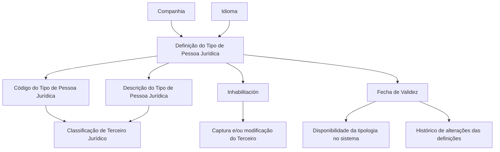

# Catálogo de Tipos de Pessoas Jurídicas — Definição, Propriedades e Uso no Sistema Reef

## 1. Metadados do Documento
- **Arquivo de Origem:** Não identificado no conteúdo fornecido
- **Tipo de Documento:** Especificação Técnica / Documentação Funcional
- **Domínio / Sistema:** Reef; catálogo de Tipos de Pessoas Jurídicas; Terceiros Jurídicos
- **Público-Alvo:** Negócio, analistas funcionais, operação e equipes responsáveis pela definição de catálogos corporativos
- **Data/Versão Identificada:** Não identificada
- **Owner identificado:** `user:agonzalez_mapfre.com`
- **Lifecycle identificado:** `Approved Source`

---

## 2. Resumo Executivo & Contexto de Negócio

O documento define o catálogo de **Tipos de Pessoas Jurídicas**, cuja finalidade é permitir a classificação de **Terceiros Jurídicos** no sistema. A classificação é representada por uma chave de tipologia, acompanhada de uma descrição definida de acordo com o idioma utilizado.

A definição de cada Tipo de Pessoa Jurídica é associada a uma companhia e a um idioma. A companhia identifica o código da organização para a qual o tipo está sendo definido, enquanto o idioma orienta a descrição apresentada para a chave correspondente.

O catálogo apresenta exemplos de códigos e descrições, incluindo classificações de âmbito público e privado, como `AAA — Corporación Int. Público`, `BBB — Asociación Int. Público`, `CCC — Fundación Int. Público`, `000 — Empresa Int. Privado`, `001 — Cooperativa Int. Privado` e `002 — Sociedad Civil Int. Privado`.

O documento também estabelece propriedades operacionais importantes. A propriedade **Inhabilitación** impede o uso de um Tipo de Pessoa Jurídica em operações de captura e/ou modificação de Terceiros. A propriedade **Fecha de Validez** determina a partir de quando uma tipologia fica disponível no sistema e permite manter histórico das alterações realizadas nas definições.

A orientação operacional recomendada é utilizar as descrições das chaves para complementar a informação da tipologia, por exemplo indicando se o Terceiro possui âmbito público ou privado. Entretanto, cada entidade MAPFRE deve analisar a forma mais adequada de usar transversalmente o catálogo em seus processos, considerando sua posterior exploração.

---

## 3. Arquitetura, Componentes & Tecnologias Envolvidas

O conteúdo fornecido cita os seguintes elementos funcionais e de documentação:

- **Reef:** sistema ou contexto documental no qual o catálogo está definido.
- **Catálogo de Tipos de Pessoas Jurídicas:** estrutura usada para classificar Terceiros Jurídicos.
- **Terceiro Jurídico:** entidade classificada por meio de uma tipologia.
- **Companhia:** atributo que define a organização para a qual o Tipo de Pessoa Jurídica é configurado.
- **Idioma:** atributo que determina o idioma empregado na definição e apresentação da descrição.
- **Código do Tipo de Pessoa Jurídica:** chave que identifica a tipologia do Terceiro Jurídico no sistema.
- **Descrição do Tipo de Pessoa Jurídica:** denominação da chave, definida conforme o idioma.
- **Inhabilitación:** propriedade que bloqueia o uso operacional da tipologia.
- **Fecha de Validez:** propriedade que controla a disponibilidade temporal da tipologia e suporta histórico.
- **Actividades de Terceros:** documento relacionado cuja leitura é recomendada.
- **Preguntas frecuentes:** conteúdo relacionado citado como vínculo.



> **Nota de Análise:** O conteúdo não detalha métodos HTTP, contratos JSON, banco de dados, integrações, tecnologias de implementação, URLs de ambiente, servidores ou mecanismos técnicos de persistência do catálogo.

---

## 4. Regras de Negócio, Especificações Funcionais & Processos

### Objetivo do catálogo

O catálogo de Tipos de Pessoas Jurídicas existe para efetuar uma classificação dos Terceiros Jurídicos.

### Definição da tipologia

A definição de um Tipo de Pessoa Jurídica inclui, no mínimo, os seguintes elementos:

1. **Companhia**
   - Contém o código da companhia para a qual o Tipo de Pessoa Jurídica está sendo definido.

2. **Idioma**
   - Indica ao sistema o idioma empregado na definição.
   - O documento apresenta exemplos de idiomas: espanhol, inglês e turco.

3. **Código do Tipo de Pessoa Jurídica**
   - Identifica no sistema a chave da tipologia do Terceiro Jurídico.

4. **Descrição do Tipo de Pessoa Jurídica**
   - Contém a denominação ou descrição da chave do Terceiro.
   - A descrição deve ser compatível com o idioma usado na definição.

### Regras de indisponibilização

A propriedade **Inhabilitación** estabelece que o Tipo de Pessoa Jurídica fica inabilitado para ser empregado nas operações de:

- Captura do Terceiro.
- Modificação do Terceiro.

O documento não detalha se a inabilitação afeta registros históricos, consultas, integrações ou processos já iniciados.

### Regras de vigência e histórico

A propriedade **Fecha de Validez** estabelece a data a partir da qual a tipologia de Pessoa Jurídica fica disponível no sistema para utilização.

O uso correto da data de validade permite:

- Manter histórico das alterações efetuadas nas definições das tipologias.
- Possibilitar a exploração posterior desse histórico.

### Recomendação operacional

A recomendação apresentada é utilizar as descrições das chaves definidas para complementar a informação da tipologia. No exemplo do documento, a descrição permite identificar se a Tipologia do Terceiro pertence ao âmbito:

- Público.
- Privado.

Cada entidade MAPFRE deve analisar como utilizar transversalmente esse catálogo de informação nos processos corporativos, assegurando definição adequada e posterior exploração do conteúdo.

### Documentação relacionada

O documento recomenda a leitura de diretrizes e documentos funcionais vinculados, pois uma interpretação isolada da documentação pode conduzir a erro. Entre os vínculos citados estão:

- Actividades de Terceros.
- Preguntas frecuentes.

---

## 5. Tabelas de Parâmetros, Ambientes e Estruturas de Dados

| Item / Parâmetro | Descrição / Função | Tipo / Valores / Formato | Ambiente / Observações |
| :--- | :--- | :--- | :--- |
| Companhia | Contém o código da companhia para a qual o Tipo de Pessoa Jurídica é definido. | Código de companhia; formato não detalhado. | Associado à definição da tipologia. |
| Idioma | Indica o idioma empregado na definição do código e da descrição. | Exemplos citados: espanhol, inglês, turco. | A descrição deve corresponder ao idioma definido. |
| Código do Tipo de Pessoa Jurídica | Identifica no sistema a chave da Tipologia do Terceiro Jurídico. | Exemplos: `AAA`, `BBB`, `CCC`, `000`, `001`, `002`. | O documento não especifica regras de tamanho, unicidade ou geração. |
| Descrição do Tipo de Pessoa Jurídica | Contém a denominação ou descrição da chave do Terceiro. | Texto no idioma da definição. | Pode complementar a informação sobre o âmbito público ou privado da tipologia. |
| Inhabilitación | Determina que o Tipo de Pessoa Jurídica não pode ser utilizado em operações de captura e/ou modificação do Terceiro. | Estado de inabilitação; valores não detalhados. | Não há detalhamento sobre efeito em dados históricos. |
| Fecha de Validez | Define a data a partir da qual a tipologia está disponível para uso no sistema. | Data; formato não detalhado. | Permite histórico das mudanças nas definições. |

### Exemplos de Tipos de Pessoas Jurídicas

| Código do Tipo de Pessoa Jurídica | Descrição apresentada | Âmbito indicado pela descrição |
| :--- | :--- | :--- |
| `AAA` | Corporación Int. Público | Público |
| `BBB` | Asociación Int. Público | Público |
| `CCC` | Fundación Int. Público | Público |
| `000` | Empresa Int. Privado | Privado |
| `001` | Cooperativa Int. Privado | Privado |
| `002` | Sociedad Civil Int. Privado | Privado |

### Referências documentais identificadas

| Item / Parâmetro | Descrição / Função | Tipo / Valores / Formato | Ambiente / Observações |
| :--- | :--- | :--- | :--- |
| Documentation / DOCUMENTACIÓN Reef | Identificação da área ou repositório documental. | Texto. | Citado no conteúdo bruto. |
| Mapfredocument | Referência documental apresentada na interface. | Texto. | Função não detalhada. |
| Owner | Proprietário identificado do documento. | `user:agonzalez_mapfre.com` | Valor transcrito literalmente. |
| Lifecycle | Estado do ciclo de vida apresentado. | `Approved Source` | Não há descrição adicional. |
| Actividades de Terceros | Documento funcional vinculado. | Referência documental. | Leitura recomendada. |
| Preguntas frecuentes | Referência documental vinculada. | Referência documental. | Citada na seção de vínculos. |

---

## 6. Bateria de Perguntas & Respostas para RAG (FAQ Sintético)

### P1: Qual é o objetivo do catálogo de Tipos de Pessoas Jurídicas?
**R:** O objetivo do catálogo é permitir a classificação de Terceiros Jurídicos no sistema por meio de uma tipologia identificada por código e descrição.

### P2: Qual atributo associa um Tipo de Pessoa Jurídica a uma organização específica?
**R:** O atributo **Companhia** contém o código da companhia para a qual o Tipo de Pessoa Jurídica está sendo definido.

### P3: Para que serve o atributo Idioma na definição do Tipo de Pessoa Jurídica?
**R:** O atributo **Idioma** informa ao sistema o idioma empregado na definição do código e da descrição. O documento cita espanhol, inglês e turco como exemplos de idiomas.

### P4: O que identifica o Código do Tipo de Pessoa Jurídica?
**R:** O Código do Tipo de Pessoa Jurídica identifica no sistema a chave da Tipologia do Terceiro Jurídico.

### P5: Como a descrição do Tipo de Pessoa Jurídica deve ser definida?
**R:** A descrição contém a denominação da chave do Terceiro e deve estar de acordo com o idioma utilizado na definição da tipologia.

### P6: O que ocorre quando um Tipo de Pessoa Jurídica está inabilitado?
**R:** A propriedade **Inhabilitación** determina que o Tipo de Pessoa Jurídica não pode ser utilizado nas operações de captura e/ou modificação do Terceiro.

### P7: Qual é a função da Fecha de Validez?
**R:** A **Fecha de Validez** define a data a partir da qual uma Tipologia de Pessoa Jurídica fica disponível no sistema para uso. O uso correto dessa propriedade permite manter histórico das alterações nas definições para exploração posterior.

### P8: Quais exemplos de códigos de Tipo de Pessoa Jurídica são apresentados?
**R:** O documento apresenta os códigos `AAA`, `BBB`, `CCC`, `000`, `001` e `002`, associados respectivamente a Corporación Int. Público, Asociación Int. Público, Fundación Int. Público, Empresa Int. Privado, Cooperativa Int. Privado e Sociedad Civil Int. Privado.

### P9: Como as descrições das chaves podem ser usadas operacionalmente?
**R:** O documento recomenda usar as descrições para complementar a informação da tipologia. No exemplo fornecido, as descrições indicam se a Tipologia do Terceiro possui âmbito público ou privado.

### P10: Quem deve definir como o catálogo será usado transversalmente nos processos?
**R:** Cada entidade MAPFRE deve analisar a melhor forma de utilizar transversalmente o catálogo de informação nos processos da companhia, considerando a correta definição e a exploração posterior.

### P11: Quais documentos relacionados devem ser considerados para evitar interpretação isolada?
**R:** O documento cita como vínculos **Actividades de Terceros** e **Preguntas frecuentes**, além de recomendar a leitura das diretrizes e documentos funcionais relacionados.

### P12: O documento especifica APIs, métodos HTTP ou contratos de integração para o catálogo?
**R:** Não. O conteúdo fornecido descreve propriedades funcionais do catálogo, mas não detalha APIs, métodos HTTP, contratos JSON, tecnologias de implementação ou integrações.

---

## 7. Glossário de Termos, Siglas & Conceitos-Chave

- **Reef:** nome citado na documentação e no contexto documental; o conteúdo fornecido não apresenta expansão ou definição técnica adicional.
- **Terceiro Jurídico:** entidade classificada por meio do catálogo de Tipos de Pessoas Jurídicas.
- **Tipo de Pessoa Jurídica:** tipologia atribuída a um Terceiro Jurídico, identificada por código e descrição.
- **Companhia:** código da organização para a qual o Tipo de Pessoa Jurídica é definido.
- **Idioma:** idioma usado para definir e apresentar a descrição da tipologia.
- **Código do Tipo de Pessoa Jurídica:** chave que identifica a tipologia no sistema.
- **Descrição do Tipo de Pessoa Jurídica:** denominação textual da chave, definida conforme o idioma.
- **Inhabilitación:** propriedade que impede o emprego do Tipo de Pessoa Jurídica na captura e/ou modificação do Terceiro.
- **Fecha de Validez:** data a partir da qual a tipologia fica disponível para uso no sistema.
- **MAPFRE:** entidade mencionada como responsável por analisar o uso transversal do catálogo em seus processos.
- **Approved Source:** estado de ciclo de vida exibido para o documento; não há definição adicional no texto.

---

## 8. Notas Críticas, Riscos & Limitações

- O documento não informa o nome do arquivo de origem, data, versão ou autor formal; apenas apresenta o owner `user:agonzalez_mapfre.com`.
- Não são detalhados formato, obrigatoriedade, tamanho ou regra de unicidade para o Código do Tipo de Pessoa Jurídica.
- Não há definição dos valores possíveis, mecanismo de alteração ou processo de aprovação da propriedade **Inhabilitación**.
- A **Fecha de Validez** é descrita funcionalmente, mas o documento não informa formato de data, tratamento de datas futuras, expiração ou sobreposição de vigências.
- Não são apresentados fluxos técnicos de integração, APIs, contratos de dados, bancos de dados, permissões, perfis de acesso ou trilhas de auditoria.
- A utilização transversal do catálogo é atribuída à análise de cada entidade MAPFRE, o que pode resultar em interpretações ou implementações diferentes entre entidades.
- O documento recomenda a leitura de documentos relacionados para evitar interpretação isolada, mas não apresenta o conteúdo de **Actividades de Terceros** nem de **Preguntas frecuentes**.

---

## 9. Conteúdo Bruto Estruturado (Referência Fiel)

```text
--- [PÁGINA 1 DE 2] ---

DEFINICIÓN de los Tipos de Personas Jurídicas
Objetivo
El objeto de este catálogo es poder efectuar una clasicación de los Terceros Jurídicos.
Propiedades Generales
Otras Propiedades
Propiedades Generales
Compañía
Este atributo contiene el código de la compañía para la que se está deniendo el tipo de Persona Jurídica.
Idioma
Esta propiedad le indica al sistema el Idioma empleado en la denición del Código del Consentimiento como por ejemplo: español, inglés,
turco,...
Código del Tipo de Persona Jurídica
Este atributo identica en el sistema la clave de la Tipología del Tercero Jurídico.
Descripción del Tipo de Persona Jurídica
Esta propiedad contiene la denominación o descripción de la clave del Tercero, de acuerdo con el idioma utilizado en la denición.
A modo de ejemplo y si el Idioma utilizado en la denición es el español:
TIPO de PERSONA JURÍDICA DESCRIPCIÓN
AAA Corporación Int. Público
BBB Asociación Int. Público
CCC Fundación Int. Público
000 Empresa Int. Privado
001 Cooperativa Int. Privado
Documentation / DOCUMENTACIÓN Reef
DOCUMENTACIÓN Reef
Mapfredocument
DOCUMENTACIÓN Reef
Owner
user:agonzalez_mapfre.com
Lifecycle
Approved Source
 /
 VL
Buscar Inicio Soluciones Arquitecturas APIs Componentes Cloud Documentación Zeus Reef Ayuda
ES


--- [PÁGINA 2 DE 2] ---

TIPO de PERSONA JURÍDICA DESCRIPCIÓN
002 Sociedad Civil Int. Privado
...
Otras Propiedades
Inhabilitación
Esta propiedad establece que el Tipo de Persona Jurídica está inhabilitado para poder ser empleado en las operaciones de captura y/o
modicación del Tercero.
Fecha de Validez
Esta propiedad establece la fecha a partir de la cual la Tipología de la Persona Jurídica está disponible en el sistema para ser utilizada por
lo que su correcto uso permite tener un histórico de los cambios efectuados en las deniciones de las mismas para su posterior explotación.
Vínculos
Relación de Directrices y Documentos funcionales cuya lectura recomendada para evitar que la interpretación aislada del presente
documento pueda conducir a error.
Actividades de Terceros
Preguntas frecuentes
(1) ¿Existe alguna recomendación operativa que deba ser tomada en consideración localmente en la codicación, uso y denición del
catálogo de Tipos de Personas Jurídicas en el Sistema?
Una práctica que se ha demostrado que funciona bien y por tanto se recomienda como modelo es utilizar las descripciones de las claves
denidas para complementar la información de la tipología denida (en el ejemplo mostrado previamente se identica si la Tipología del
Tercero es de ámbito público o privado ), si bien la entidad MAPFRE debe analizar la mejor manera de utilizar transversalmente en los
procesos de la compañía este catálogo de información para su correcta denición contemplando su posterior explotación.
```
