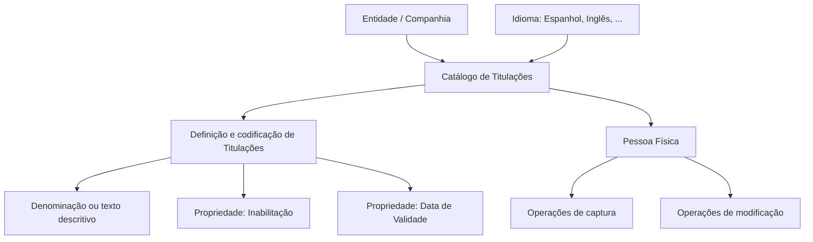

# Definição das Titulações de Terceiros no Sistema Reef

## 1. Metadados do Documento
- **Arquivo de Origem:** Não identificado
- **Tipo de Documento:** Especificação Funcional
- **Domínio / Sistema:** Reef — Atividades de Terceiros / Pessoas Físicas
- **Público-Alvo:** Analistas funcionais, equipes de negócio, administradores de catálogo e operação
- **Data/Versão Identificada:** Não identificada

---

## 2. Resumo Executivo & Contexto de Negócio

O documento define o tratamento funcional das **Titulaciones** — títulos oficiais que habilitam o exercício de uma profissão no território nacional — associadas a pessoas físicas no sistema Reef. O sistema disponibiliza um catálogo específico para identificar e codificar possíveis titulações de terceiros.

O catálogo de Titulações é inicialmente entregue vazio às entidades. Cada entidade pode definir, codificar, nomear e identificar individualmente as titulações utilizadas em sua operação, incluindo uma denominação ou texto descritivo, como “Graduado”, “Máster Universitario” e “Doctorado”.

A administração das Titulações ocorre por companhia e por idioma, incluindo Espanhol, Inglês e outros idiomas. O documento também descreve propriedades operacionais relevantes: a inabilitação de uma titulação para captura ou modificação de pessoas físicas e a data a partir da qual a titulação passa a estar plenamente operacional no sistema.

Não existe uma recomendação ou padrão obrigatório para a codificação local das Titulações de Terceiros. Entretanto, a entidade MAPFRE deve avaliar a conveniência de adotar esse catálogo transversalmente nos processos da companhia, visando exploração posterior adequada das informações.

---

## 3. Arquitetura, Componentes & Tecnologias Envolvidas

| Componente / Conceito | Descrição baseada no documento |
| :--- | :--- |
| Sistema Reef | Sistema no qual são definidas, codificadas e utilizadas as Titulações de Terceiros. |
| Núcleo do Sistema | Possui capacidade de identificar e codificar possíveis Titulações de Pessoas Físicas. |
| Catálogo de Titulações | Catálogo específico de informação para cadastro das Titulações; é entregue inicialmente vazio às entidades. |
| Entidade / Companhia | Organização responsável por definir e utilizar o catálogo de Titulações no sistema. |
| Idioma | Dimensão de definição das Titulações por companhia; são citados Espanhol, Inglês e outros idiomas. |
| Pessoa Física | Cadastro que pode utilizar Titulações nas operações de captura e/ou modificação. |
| MAPFRE | Entidade mencionada como responsável por avaliar o uso transversal do catálogo em seus processos. |
| Atividades de Terceiros | Documento funcional relacionado, indicado como vínculo de leitura recomendada. |
| Profissões | Tema relacionado listado nos vínculos do documento, sem detalhamento adicional. |
| Nível de Estudos | Tema relacionado listado nos vínculos do documento, sem detalhamento adicional. |



**Nota de Análise:** O documento não detalha tecnologias de implementação, interfaces, métodos HTTP, contratos JSON, banco de dados, integrações, perfis de acesso ou mecanismos técnicos de persistência do catálogo.

---

## 4. Regras de Negócio, Especificações Funcionais & Processos

### 4.1 Definição de Titulação

1. Uma **Titulação** é definida como o título oficial que habilita o exercício de uma profissão no território nacional.
2. O núcleo do Sistema Reef permite identificar e codificar possíveis Titulações de Pessoas Físicas.
3. As Titulações são mantidas em um catálogo específico de informação.
4. O catálogo de Titulações é entregue inicialmente sem conteúdo às entidades.
5. Cada entidade pode definir e codificar a relação de Titulações.
6. A definição das Titulações é realizada no nível de companhia e por idioma.
7. Cada Titulação pode possuir denominação ou texto descritivo individual.

### 4.2 Codificação e Denominação

O documento apresenta os seguintes exemplos de codificação:

| Código de Titulação | Descrição |
| :--- | :--- |
| 01 | Graduado |
| 02 | Máster Universitario |
| 03 | Doctorado |

**Regra funcional:** Não existe preferência ou recomendação para estabelecer ou padronizar a codificação das Titulações de Terceiros no sistema.

### 4.3 Propriedade de Inabilitação

A propriedade de **Inhabilitación** informa ao sistema se uma Titulação está ou não inabilitada para uso nas operações de:

- captura de Pessoa Física;
- modificação de Pessoa Física.

Quando uma Titulação estiver inabilitada, ela não poderá ser utilizada nessas operações.

### 4.4 Propriedade de Data de Validade

A propriedade de **Fecha de Validez** informa a data a partir da qual uma Titulação está plenamente operacional no sistema.

O uso correto da Data de Validade permite manter histórico das mudanças efetuadas nas definições das Titulações.

### 4.5 Orientação para Uso Corporativo

Embora não exista uma codificação obrigatória ou recomendação operacional local, a entidade MAPFRE deve analisar a conveniência de utilizar o catálogo de informação de Titulações de forma transversal nos processos da companhia, permitindo exploração posterior apropriada das informações.

### 4.6 Documentos e Temas Relacionados

O documento recomenda a leitura de diretrizes e documentos funcionais relacionados para evitar interpretações incorretas decorrentes da leitura isolada deste material:

- Atividades de Terceiros;
- Profissões;
- Nível de Estudos;
- DOCUMENTACIÓN Reef;
- Mapfredocument.

---

## 5. Tabelas de Parâmetros, Ambientes e Estruturas de Dados

| Item / Parâmetro | Descrição / Função | Tipo / Valores / Formato | Ambiente / Observações |
| :--- | :--- | :--- | :--- |
| Titulação | Título oficial que habilita o exercício de uma profissão no território nacional. | Denominação e código definidos pela entidade. | Aplicável a Pessoas Físicas no Sistema Reef. |
| Catálogo de Titulações | Catálogo específico para identificação e codificação de possíveis Titulações. | Inicialmente vazio. | Entregue às entidades. |
| Código de Titulação | Identificador da Titulação no catálogo. | Exemplos: `01`, `02`, `03`. | Não há padrão ou recomendação obrigatória de codificação. |
| Descrição da Titulação | Denominação ou texto descritivo que identifica individualmente uma Titulação. | Exemplos: Graduado, Máster Universitario, Doctorado. | Definida pela entidade. |
| Companhia | Escopo organizacional da definição do catálogo. | Entidade corporativa. | A definição ocorre em nível de companhia. |
| Idioma | Dimensão idiomática para definição e codificação das Titulações. | Espanhol, Inglês e outros. | A definição ocorre por companhia e por idioma. |
| Inabilitação | Indica se a Titulação está inabilitada para uso. | Estado de habilitação ou inabilitação. | Afeta captura e/ou modificação de Pessoas Físicas. |
| Data de Validade | Data a partir da qual uma Titulação fica plenamente operacional. | Data. | Permite histórico das mudanças das definições. |
| Pessoa Física | Cadastro que pode receber ou utilizar Titulações. | Entidade funcional. | Participa de operações de captura e modificação. |
| MAPFRE | Entidade que deve avaliar a utilização transversal do catálogo. | Organização citada no documento. | Avaliação voltada à exploração posterior da informação. |
| Owner | Proprietário indicado no conteúdo extraído. | `user:agonzalez_mapfre.com` | Metadado apresentado no documento. |
| Lifecycle | Estado de ciclo de vida informado no conteúdo extraído. | `Approved Source` | Metadado apresentado no documento. |

---

## 6. Bateria de Perguntas & Respostas para RAG (FAQ Sintético)

### P1: O que é uma Titulação no contexto do Sistema Reef?
**R:** Uma Titulação é o título oficial que habilita o exercício de uma profissão no território nacional. No Sistema Reef, as Titulações podem ser identificadas e codificadas em um catálogo específico associado a Pessoas Físicas.

### P2: O catálogo de Titulações já vem preenchido para as entidades?
**R:** Não. O documento informa que o catálogo específico de Titulações é entregue às entidades inicialmente vazio de conteúdo.

### P3: Quem pode definir e codificar as Titulações no Sistema Reef?
**R:** Cada entidade pode definir e codificar a relação de Titulações no Sistema Reef. A definição é realizada em nível de companhia e por idioma.

### P4: Quais idiomas são mencionados para a definição de Titulações?
**R:** O documento menciona Espanhol e Inglês como exemplos e indica que as Titulações podem ser definidas por outros idiomas.

### P5: Como uma Titulação pode ser identificada individualmente?
**R:** Cada Titulação pode ser denominada e identificada por uma denominação ou texto descritivo individual. Os exemplos apresentados são “Graduado”, “Máster Universitario” e “Doctorado”.

### P6: Existe um padrão obrigatório para codificar Titulações de Terceiros?
**R:** Não. O documento declara que não existe preferência nem recomendação para estabelecer ou padronizar a codificação das Titulações de Terceiros no sistema.

### P7: O que significa a propriedade de Inabilitação de uma Titulação?
**R:** A propriedade de Inabilitação informa ao Sistema Reef se uma Titulação está ou não inabilitada para ser utilizada nas operações de captura e/ou modificação da Pessoa Física.

### P8: Qual é a função da Data de Validade de uma Titulação?
**R:** A Data de Validade indica a data a partir da qual a Titulação está plenamente operacional no sistema. O uso correto dessa data permite manter histórico das alterações feitas nas definições das Titulações.

### P9: Qual orientação é dada à MAPFRE sobre o catálogo de Titulações?
**R:** A MAPFRE deve analisar a conveniência de utilizar transversalmente o catálogo de Titulações nos processos da companhia, visando sua correta exploração posterior.

### P10: Quais documentos ou temas devem ser consultados para complementar o entendimento das Titulações?
**R:** O documento recomenda consultar as diretrizes e documentos funcionais relacionados a Atividades de Terceiros, Profissões, Nível de Estudos, DOCUMENTACIÓN Reef e Mapfredocument, para evitar interpretações isoladas incorretas.

---

## 7. Glossário de Termos, Siglas & Conceitos-Chave

- **Titulação / Titulación:** Título oficial que habilita o exercício de uma profissão no território nacional.
- **Terceiros:** Contexto funcional associado às Titulações de Pessoas Físicas; o documento não apresenta definição adicional.
- **Pessoa Física:** Pessoa cujas informações podem ser capturadas ou modificadas utilizando Titulações cadastradas.
- **Catálogo de Titulações:** Catálogo específico de informação para identificar e codificar Titulações.
- **Inhabilitación:** Propriedade que define se uma Titulação está inabilitada para uso na captura e/ou modificação de Pessoa Física.
- **Fecha de Validez:** Data a partir da qual uma Titulação fica plenamente operacional no sistema.
- **Reef:** Sistema ou domínio documental mencionado no conteúdo extraído.
- **MAPFRE:** Entidade mencionada no documento como responsável por avaliar o uso transversal do catálogo.
- **DOCUMENTACIÓN Reef:** Referência documental vinculada ao tema.
- **Mapfredocument:** Referência documental vinculada ao tema.
- **Lifecycle:** Metadado de ciclo de vida apresentado como `Approved Source`.
- **Owner:** Metadado de propriedade apresentado como `user:agonzalez_mapfre.com`.

---

## 8. Notas Críticas, Riscos & Limitações

- O catálogo de Titulações é inicialmente vazio; cada entidade precisa definir seu próprio conteúdo.
- Não há padrão de codificação obrigatório ou recomendação operacional para Titulações de Terceiros, o que pode resultar em codificações distintas entre entidades ou processos.
- O documento recomenda que a MAPFRE avalie o uso transversal do catálogo para possibilitar exploração posterior correta das informações.
- A leitura isolada do documento pode conduzir a erro; o conteúdo recomenda a consulta de diretrizes e documentos funcionais vinculados.
- O documento não detalha critérios técnicos para habilitar ou inabilitar Titulações.
- O documento não define formato de data, mecanismo de auditoria, interfaces de manutenção, permissões, integrações ou regras de validação adicionais.
- O documento lista os temas “Profissões” e “Nível de Estudos”, mas não fornece detalhamento adicional sobre esses tópicos.

---

## 9. Conteúdo Bruto Estruturado (Referência Fiel)

```text
--- [PÁGINA 1 DE 2] ---

DEFINICIÓN de las Titulaciones de los Terceros
Propiedades Generales
Titulación: El Título Ocial que habilita para el ejercicio de una Profesión en el territorio nacional.
Funcionalmente, el núcleo del Sistema cuenta con la posibilidad de identicar y codicar las posibles Titulaciones de las Personas Físicas en
un catálogo de información especíco que se entrega a las entidades inicialmente vacío de contenido.
El sistema permite a nivel de compañía y por idioma (Español, Inglés,...) denir y codicar la relación de estas Titulaciones Relaciones
pudiendo denominar e identicar individualmente cada una de ellas mediante una denominación o texto descriptivo, e.g:
Titulación Descripción
01 Graduado
02 Máster Universitario
03 Doctorado
... ...
Otras Propiedades
Inhabilitación
Esta propiedad le indica al Sistema si la Titulación está o no inhabilitada para poder ser utilizada en las operaciones de captura y/o
modicación de la persona física.
Fecha de Validez
Esta propiedad le indica al Sistema la fecha a partir de la cual la Titulación está plenamente operativa en el sistema por lo que su correcto
uso permite tener un histórico de los cambios efectuados en las deniciones de las mismas.
Vínculos
Relación de Directrices y Documentos funcionales cuya lectura recomendada para evitar que la interpretación aislada del presente
documento pueda conducir a error.
Actividades de Terceros
Documentation / DOCUMENTACIÓN Reef
DOCUMENTACIÓN Reef
Mapfredocument
DOCUMENTACIÓN Reef
Owner
user:agonzalez_mapfre.com
Lifecycle
Approved Source
 / 
 VL
Buscar Inicio Soluciones Arquitecturas APIs Componentes Cloud Documentación Zeus Reef Ayuda
ES


--- [PÁGINA 2 DE 2] ---

Profesiones
Nivel de Estudios
Preguntas frecuentes
(1) ¿Existe alguna recomendación operativa que deba ser tomada en consideración localmente en la codicación, uso y denición de la tabla
de Titulaciones en el Sistema?
No existe una preferencia ni recomendación para establecer o estandarizar la codicación de las Titulaciones de los Terceros en el sistema,
si bien la entidad MAPFRE debe analizar la conveniencia de utilizar transversalmente en los procesos de la compañía este catálogo de
información para su correcta y posterior explotación.
```
