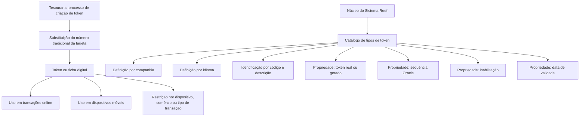

# Definição dos Tipos de Token nos Meios de Cobrança ou Pagamento — Documentação Reef

## 1. Metadados do Documento
- **Arquivo de Origem:** Não identificado no conteúdo fornecido
- **Tipo de Documento:** Especificação Técnica
- **Domínio / Sistema:** Reef / Meios de Cobrança e Pagamento / Terceiros / Tesouraria
- **Público-Alvo:** Desenvolvedores, Arquitetos, Operação e Negócio
- **Data/Versão Identificada:** Não identificada

---

## 2. Resumo Executivo & Contexto de Negócio

O documento define as propriedades funcionais e operacionais dos tipos de token utilizados nos meios de cobrança e pagamento de terceiros no sistema Reef. No contexto descrito, criar um token consiste em substituir o número de conta tradicional de uma tarjeta de pagamento por uma ficha digital utilizada em transações online e dispositivos móveis.

A tokenização preserva as informações associadas aos dados da tarjeta sem comprometer a segurança desses dados. O documento afirma que um token pode ser restringido para uso com um dispositivo móvel, um comércio ou um tipo de transação específico.

O núcleo do sistema mantém um catálogo específico para identificar os tipos de tokens permitidos nos meios de cobrança e pagamento de terceiros. Esse catálogo é entregue inicialmente vazio e a definição dos tipos é realizada por companhia e idioma, incluindo Espanhol e Inglês.

Cada tipo de token pode ser identificado individualmente por um código e uma denominação ou texto descritivo. Além da identificação, a tipologia possui propriedades relacionadas à origem do token, à geração automática por sequência Oracle, à inabilitação para operações sobre terceiros e à data a partir da qual a tipologia se torna plenamente operacional.

O documento não estabelece uma recomendação corporativa para padronizar a codificação, o uso ou a definição das tipologias de tokens. A codificação é, portanto, não padronizada corporativamente segundo a resposta de perguntas frequentes apresentada.

---

## 3. Arquitetura, Componentes & Tecnologias Envolvidas

### Componentes, conceitos e tecnologias identificados

| Componente / Conceito | Descrição fundamentada no documento |
| :--- | :--- |
| Sistema Reef | Sistema cujo núcleo permite identificar tipos de tokens usados nos meios de cobrança e pagamento de terceiros. |
| Núcleo do Sistema | Camada funcional que disponibiliza o catálogo específico de tipos de token. |
| Catálogo de tipos de token | Repositório de informação específica, inicialmente entregue vazio, destinado a definir tipos de tokens. |
| Meios de Cobrança/Pagamento | Contexto em que os tipos de token são utilizados para terceiros. |
| Terceiro | Entidade cujas operações de captura e/ou modificação podem ser impedidas pela inabilitação de um tipo de token. |
| Tesouraria | Processo corporativo citado como contexto da criação de tokens. |
| Token / Toquen | Ficha digital que substitui o número de conta tradicional de uma tarjeta de pagamento. O texto original utiliza predominantemente o termo “Toquen”. |
| Sequência Oracle | Código de sequência Oracle executado para gerar automaticamente um token, quando aplicável. |
| Companhia | Escopo organizacional para definição dos tipos de token. |
| Idioma | Dimensão de definição dos tipos de token, com exemplos de Espanhol e Inglês. |



**Nota de Análise:** O documento cita o sistema Reef, o núcleo do sistema e sequências Oracle, mas não detalha arquitetura de infraestrutura, APIs, métodos HTTP, contratos JSON, bancos de dados, URLs, ambientes ou integrações entre microsserviços.

---

## 4. Regras de Negócio, Especificações Funcionais & Processos

### Definição funcional do token

1. A criação de um token nos processos de Tesouraria substitui o número de conta tradicional de uma tarjeta de pagamento.
2. O token atua como uma ficha digital para utilização em transações online e em dispositivos móveis.
3. A substituição preserva as informações dos dados da tarjeta sem comprometer a segurança desses dados.
4. Um token pode ser restringido para utilização com:
   - um dispositivo móvel;
   - um comércio;
   - um tipo de transação específico.

### Gestão do catálogo de tipos de token

1. O núcleo do Sistema Reef possui a capacidade de identificar os tipos de tokens utilizáveis nos meios de cobrança e pagamento de terceiros.
2. Os tipos de token são mantidos em um catálogo específico de informação.
3. O catálogo é entregue inicialmente às instalações sem conteúdo.
4. A definição dos tipos de token é realizada por companhia.
5. A definição dos tipos de token é realizada por idioma.
6. Os idiomas exemplificados são Espanhol e Inglês.
7. Cada tipo de token pode possuir uma denominação ou texto descritivo individual.
8. Cada tipo de token pode ser identificado individualmente por código.

### Exemplos de tipologias apresentadas

| Código do tipo de token | Descrição |
| :--- | :--- |
| 001 | TOKEN Manual |
| 002 | TOKEN Automático |
| aa1 | TOKEN TSP VISA |
| CB1 | TOKEN TSP MasterCard |

### Propriedade: Token real ou token gerado

A propriedade “Token Real ou Token Gerado” informa ao sistema se o token corresponde a uma ficha real ou se o token foi gerado automaticamente.

### Propriedade: sequência para gerar o token

A propriedade “Sequência para gerar o Token” informa ao sistema o código da sequência Oracle que deve ser executada para gerar o token.

**Nota de Análise:** O documento não informa o nome, formato, critérios de seleção ou comportamento de execução das sequências Oracle.

### Propriedade: inabilitação

A propriedade “Inhabilitación” informa ao sistema que determinado tipo de token está inabilitado para uso nas operações de captura e/ou modificação do terceiro.

### Propriedade: data de validade

A propriedade “Fecha de Validez” informa ao sistema a data a partir da qual a tipologia do token dos meios de cobrança ou pagamento se torna plenamente operacional. O uso dessa data permite manter um histórico das alterações efetuadas nas definições dos cargos, conforme redação do documento original.

### Regra corporativa de codificação

Não existe preferência ou recomendação corporativa para estabelecer ou padronizar a codificação dos tipos de tokens no sistema.

---

## 5. Tabelas de Parâmetros, Ambientes e Estruturas de Dados

| Item / Parâmetro | Descrição / Função | Tipo / Valores / Formato | Ambiente / Observações |
| :--- | :--- | :--- | :--- |
| Tipo de token | Classificação utilizada nos meios de cobrança ou pagamento de terceiros. | Código individual. Exemplos: `001`, `002`, `aa1`, `CB1`. | Definido por companhia e idioma. |
| Descrição do tipo de token | Denominação ou texto descritivo individual da tipologia. | Texto. Exemplos: `TOKEN Manual`, `TOKEN Automático`, `TOKEN TSP VISA`, `TOKEN TSP MasterCard`. | Não há padrão corporativo de codificação informado. |
| Companhia | Escopo organizacional da definição de tipos de token. | Não especificado. | A definição é realizada por companhia. |
| Idioma | Dimensão linguística da definição de tipos de token. | Espanhol, Inglês e outros indicados por reticências. | A definição é realizada por companhia e idioma. |
| Token real ou token gerado | Indica se o token é uma ficha real ou um token criado automaticamente. | Real ou gerado automaticamente. | Critério operacional de classificação do token. |
| Sequência para gerar o token | Informa o código da sequência Oracle a ser executada para gerar o token. | Código de sequência Oracle. | Nome e sintaxe da sequência não detalhados. |
| Inabilitação | Indica que o tipo de token não pode ser usado em captura e/ou modificação do terceiro. | Estado de inabilitação; formato não especificado. | Afeta operações sobre o terceiro. |
| Data de validade | Determina a data a partir da qual a tipologia de token está plenamente operacional. | Data; formato não especificado. | Permite histórico de alterações nas definições dos cargos. |
| Restrição de uso do token | Limita a utilização do token. | Dispositivo móvel, comércio ou tipo de transação específico. | Não são fornecidas regras de configuração da restrição. |
| Catálogo de tipos de token | Catálogo específico para os tipos utilizáveis nos meios de cobrança e pagamento. | Estrutura não especificada. | Entregue inicialmente vazio. |
| Ambiente / servidor / URL | Não identificado. | Não identificado. | O documento não apresenta URLs, nomes de servidores, portas ou ambientes. |
| Rota de log | Não identificada. | Não identificada. | O documento não apresenta parâmetros ou caminhos de log. |

---

## 6. Bateria de Perguntas & Respostas para RAG (FAQ Sintético)

### P1: Qual é a finalidade de criar um token nos processos de Tesouraria?
**R:** A criação de um token substitui o número de conta tradicional de uma tarjeta de pagamento por um token ou ficha digital. Esse token é utilizado em transações online e em dispositivos móveis, preservando as informações dos dados da tarjeta sem comprometer a segurança desses dados.

### P2: Em quais contextos um token pode ser restringido?
**R:** O documento informa que um token pode ser restringido para utilização com um dispositivo móvel, um comércio ou um tipo de transação específico. Não são detalhados os parâmetros técnicos ou as regras de configuração dessas restrições.

### P3: Onde são mantidos os tipos de token no Sistema Reef?
**R:** Os tipos de tokens utilizáveis nos meios de cobrança e pagamento de terceiros são identificados pelo núcleo do Sistema Reef em um catálogo específico de informação. O catálogo é entregue inicialmente às instalações vazio de conteúdo.

### P4: Como os tipos de token são definidos no sistema?
**R:** A definição dos tipos de tokens utilizados nos meios de cobrança e pagamento é realizada por companhia e idioma. O documento exemplifica Espanhol e Inglês como idiomas e informa que cada tipo pode ter denominação ou texto descritivo individual.

### P5: Quais exemplos de códigos e descrições de tipos de token são apresentados?
**R:** O documento apresenta os exemplos `001 — TOKEN Manual`, `002 — TOKEN Automático`, `aa1 — TOKEN TSP VISA` e `CB1 — TOKEN TSP MasterCard`.

### P6: O que significa a propriedade “Token Real ou Token Gerado”?
**R:** Essa propriedade informa ao sistema se o token corresponde a uma ficha real ou se o token foi gerado automaticamente. O documento não apresenta critérios adicionais para determinar quando cada modalidade deve ser utilizada.

### P7: Para que serve a propriedade “Sequência para gerar o Token”?
**R:** Essa propriedade informa o código da sequência Oracle que deve ser executada para gerar o token. O documento não especifica os nomes das sequências Oracle, seus parâmetros nem o comportamento de erro durante a geração.

### P8: Qual é o impacto da inabilitação de um tipo de token?
**R:** A inabilitação informa ao sistema que o tipo de token está impossibilitado de ser utilizado nas operações de captura e/ou modificação do terceiro.

### P9: O que representa a data de validade de uma tipologia de token?
**R:** A data de validade indica a partir de quando a tipologia de token dos meios de cobrança ou pagamento está plenamente operacional no sistema. O documento afirma que o uso correto dessa data permite manter um histórico das alterações efetuadas nas definições dos cargos.

### P10: Existe uma padronização corporativa para os códigos dos tipos de token?
**R:** Não. A seção de perguntas frequentes declara que não existe preferência ou recomendação corporativa para estabelecer ou padronizar a codificação das tipologias de tokens no sistema.

### P11: O documento especifica APIs, métodos HTTP ou contratos JSON para tokens?
**R:** Não. O conteúdo fornecido não detalha APIs, métodos HTTP, contratos JSON, endpoints, URLs, portas, ambientes ou integrações de microsserviços relacionados aos tipos de token.

### P12: Quais operações sobre terceiros são mencionadas no documento?
**R:** O documento menciona operações de captura e/ou modificação do terceiro. Um tipo de token inabilitado não pode ser utilizado nessas operações.

---

## 7. Glossário de Termos, Siglas & Conceitos-Chave

- **Reef:** Nome do contexto documental e do sistema cujo núcleo identifica os tipos de token utilizados nos meios de cobrança e pagamento de terceiros.
- **Token / Toquen:** Ficha digital que substitui o número de conta tradicional de uma tarjeta de pagamento para uso em transações online e dispositivos móveis. O termo “Toquen” é utilizado no texto original.
- **Tipo de Token:** Tipologia catalogada e identificável por código e descrição, definida por companhia e idioma.
- **Meios de Cobrança/Pagamento:** Contexto funcional no qual são utilizados os tipos de token relacionados a terceiros.
- **Terceiro:** Entidade associada a operações de captura e/ou modificação nas quais um tipo de token inabilitado não pode ser utilizado.
- **Tesouraria:** Área ou conjunto de processos corporativos citado como contexto para a criação de tokens.
- **Sequência Oracle:** Sequência cujo código é indicado para execução na geração de um token.
- **TSP:** Sigla presente nas descrições exemplificadas `TOKEN TSP VISA` e `TOKEN TSP MasterCard`. O significado da sigla não é definido no documento.
- **VISA:** Termo presente na descrição exemplificada `TOKEN TSP VISA`; o documento não fornece definição adicional.
- **MasterCard:** Termo presente na descrição exemplificada `TOKEN TSP MasterCard`; o documento não fornece definição adicional.
- **Inabilitação:** Propriedade que impede o uso de um tipo de token nas operações de captura e/ou modificação do terceiro.
- **Data de Validade:** Propriedade que estabelece a data a partir da qual a tipologia do token está plenamente operacional.

---

## 8. Notas Críticas, Riscos & Limitações

- O catálogo de tipos de tokens é inicialmente entregue vazio; a disponibilidade funcional depende do cadastramento das tipologias necessárias.
- Não há recomendação ou preferência corporativa para padronização da codificação dos tipos de token, o que pode produzir divergências de códigos entre companhias ou instalações.
- O documento não define validações de formato para códigos, descrições, datas de validade ou sequências Oracle.
- O documento não detalha os nomes, parâmetros, permissões, tratamento de erros ou comportamento transacional das sequências Oracle.
- O documento não apresenta APIs, interfaces, contratos de integração, URLs, ambientes, servidores, portas, bancos de dados ou mecanismos de autenticação.
- O significado de `TSP`, bem como o papel específico de `VISA` e `MasterCard` além dos exemplos de descrição, não é detalhado.
- A data de validade é associada a histórico de alterações nas “definições dos cargos”, mas o documento não esclarece a relação semântica entre cargos e tipos de token.
- A leitura isolada do documento pode conduzir a erro, pois o próprio conteúdo referencia como leitura recomendada as “Actividades de Terceros”.

---

## 9. Conteúdo Bruto Estruturado (Referência Fiel)

```text
--- [PÁGINA 1 DE 2] ---

DEFINICIÓN de los Tipos de Token en los Medios de Cobro o Pago
Contexto
La acción de 'crear un toquen (Token)' en los Procesos de la Tesorería de una compañía no es sino el reemplazo del número de cuenta
tradicional de una tarjeta de pago con un toquen (Token) o cha digital para su uso en las transacciones en línea y con dispositivos móviles,
conservando la información de los datos de la Tarjeta pero sin comprometer su seguridad.
El toquen se puede restringir para utilizar con un dispositivo móvil, comercio o tipo de transacción especíco.
Propiedades Generales
Funcionalmente, el núcleo del Sistema cuenta con la posibilidad de identicar los tipos de tóquenes que se pueden utilizar en los medios de
Cobro y Pago de los Terceros, en un catálogo de información especíco que se entrega inicialmente a las instalaciones vacío de contenido.
La denición de los tipos de tóquenes utilizados en los Medios de Cobro/Pago en el Sistema se realiza por compañía e idioma (Español ,
Inglés, ...) pudiendo denominar e identicar individualmente cada una de ellos mediante una denominación o texto descriptivo, e.g:
Tipo de TOQUEN Descripción
001 TOKEN Manual
002 TOKEN Automático
aa1 TOKEN TSP VISA
CB1 TOKEN TSP MasterCard
... ...
Propiedades Operativas
Toquen Real o Toquen Generado
Esta propiedad le indica al sistema si el Toquen es una cha Real o es en cambio un toquen generado automáticamente.
Secuencia para generar el Toquen
Esta propiedad le indica al sistema el código de la secuencia ORACLE que se ha de ejecutar para generar el Toquen.
Documentation / DOCUMENTACIÓN Reef
DOCUMENTACIÓN Reef
Mapfredocument
DOCUMENTACIÓN Reef
Owner
user:agonzalez_mapfre.com
Lifecycle
Approved Source
 / 
 VL
Buscar Inicio Soluciones Arquitecturas APIs Componentes Cloud Documentación Zeus Reef Ayuda
ES


--- [PÁGINA 2 DE 2] ---

Otras Propiedades
Inhabilitación
Esta propiedad le indica al Sistema que el tipo de Toquen está inhabilitada para poder ser utilizada en las operaciones de captura y/o
modicación del Tercero.
Fecha de Validez
Esta propiedad le indica al Sistema la fecha a partir de la cual la Tipología del Token de los Medios de Cobro o Pago está plenamente
operativo en el sistema por lo que su correcto uso permite tener un histórico de los cambios efectuados en las deniciones de los cargos.
Vínculos
Relación de Directrices y Documentos funcionales cuya lectura recomendada para evitar que la interpretación aislada del presente
documento pueda conducir a error.
Actividades de Terceros
Preguntas frecuentes
(1) ¿Existe alguna recomendación operativa que deba ser tomada en consideración localmente en la codicación, uso y denición de las
tipologías de los Tóquenes que pueden ser utilizadas en el Sistema?
No existe Corporativamente una preferencia o recomendación para establecer o estandarizar en el sistema su codicación.
```
