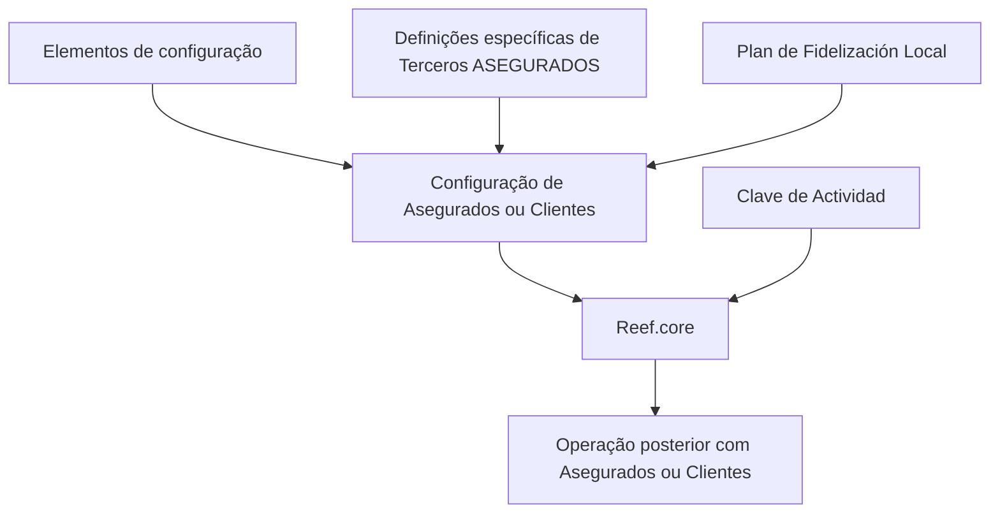

# Documentação Reef.core — Definição de Segurados, Terceiros Segurados e Plano de Fidelização Local

## 1. Metadados do Documento
- **Arquivo de Origem:** Não identificado no conteúdo fornecido
- **Tipo de Documento:** Manual Operacional / Documentação de Sistema
- **Domínio / Sistema:** Reef.core / Documentação Reef / Mapfredocument
- **Público-Alvo:** Operação, negócio, administradores funcionais e equipes que configuram terceiros segurados
- **Data/Versão Identificada:** Não identificada

---

## 2. Resumo Executivo & Contexto de Negócio

O conteúdo descreve a definição de **Asegurados** — segurados ou clientes — no sistema **Reef.core**. O objetivo declarado é relacionar os elementos necessários para configurar essas entidades no sistema, permitindo que sejam utilizadas posteriormente em operações.

No Reef.core, os segurados são identificados por meio de uma **Clave de Actividad**. O trecho fornecido não apresenta a estrutura, os valores permitidos ou as regras de atribuição dessa chave; apenas afirma que ela é utilizada para a identificação dos segurados.

A documentação também informa que os asteriscos exibidos nas “tarjetas” ou cartões indicam se a configuração de determinado elemento é obrigatória em relação à definição dos segurados. Entretanto, o documento não especifica quais cartões ou elementos possuem obrigatoriedade, nem as consequências de uma configuração incompleta.

Há ainda referências a definições específicas para terceiros classificados como segurados e à configuração de um **Plano de Fidelización Local**. O conteúdo disponibilizado não detalha os parâmetros, regras operacionais, telas, integrações ou critérios funcionais dessas definições.

---

## 3. Arquitetura, Componentes & Tecnologias Envolvidas

Os seguintes componentes, sistemas e áreas são mencionados:

| Componente / Termo | Papel identificado no conteúdo |
| :--- | :--- |
| **Reef.core** | Sistema no qual segurados ou clientes são configurados para posterior operação. |
| **Asegurados** | Segurados ou clientes configurados no Reef.core. |
| **Terceros ASEGURADOS** | Grupo de terceiros cujas definições são utilizadas exclusivamente quando o terceiro é um segurado. |
| **Clave de Actividad** | Chave utilizada pelo Reef.core para identificar segurados. |
| **Plan de Fidelización Local** | Configuração de plano de fidelização local. |
| **Documentación Reef** | Área ou conjunto documental citado no conteúdo. |
| **Mapfredocument** | Termo ou componente citado no rodapé do conteúdo. |
| **Zeus** | Item citado na navegação documental, sem detalhamento técnico. |
| **Cloud** | Item citado na navegação documental, sem detalhamento técnico. |
| **APIs** | Item citado na navegação documental, sem APIs ou contratos especificados. |



**Nota de Análise:** o conteúdo não descreve uma arquitetura técnica de camadas, integrações, APIs, bancos de dados, protocolos, métodos HTTP, contratos JSON, ambientes ou mecanismos de autenticação.

---

## 4. Regras de Negócio, Especificações Funcionais & Processos

### 4.1 Configuração de segurados ou clientes

1. O Reef.core possui elementos que permitem configurar **Asegurados** ou **Clientes**.
2. A configuração desses elementos é necessária para que os segurados ou clientes possam operar posteriormente no sistema.
3. O conteúdo não enumera quais são os elementos de configuração exigidos.

### 4.2 Identificação de segurados

1. O Reef.core identifica os segurados utilizando uma **Clave de Actividad**.
2. O conteúdo não detalha:
   - formato da Clave de Actividad;
   - origem da Clave de Actividad;
   - unicidade da Clave de Actividad;
   - regras de validação;
   - associação entre Clave de Actividad e cadastro de segurado;
   - comportamento do sistema para chave ausente, inválida ou duplicada.

### 4.3 Indicação de obrigatoriedade

1. Os asteriscos das “tarjetas” indicam se a configuração de um elemento é obrigatória em relação à definição dos segurados.
2. O conteúdo não informa quais elementos são obrigatórios.
3. O conteúdo não apresenta mensagens de erro, bloqueios operacionais ou fluxos de aprovação vinculados aos campos obrigatórios.

### 4.4 Definições exclusivas para terceiros segurados

1. Existe um grupo de definições específicas próprias dos **Terceros ASEGURADOS**.
2. Essas definições são utilizadas exclusivamente quando o terceiro é um segurado.
3. O documento não lista as definições, campos, condições de enquadramento ou regras de transição entre um terceiro comum e um terceiro segurado.

### 4.5 Plano de fidelização local

1. O documento menciona a configuração de um **Plan de Fidelización Local**.
2. Não há detalhamento sobre elegibilidade, benefícios, cálculo de pontos, vigência, níveis, regras de adesão ou integração com os segurados.

---

## 5. Tabelas de Parâmetros, Ambientes e Estruturas de Dados

| Item / Parâmetro | Descrição / Função | Tipo / Valores / Formato | Ambiente / Observações |
| :--- | :--- | :--- | :--- |
| Asegurados | Segurados ou clientes a serem configurados para operação posterior no Reef.core. | Não informado | Configurados no Reef.core. |
| Clave de Actividad | Chave usada pelo Reef.core para identificar os segurados. | Não informado | Regras de formação e validação não detalhadas. |
| Asteriscos das Tarjetas | Indicam se a configuração de um elemento é obrigatória na definição de segurados. | Indicador visual | Cartões e campos associados não informados. |
| Terceros ASEGURADOS | Grupo de terceiros com definições de uso exclusivo quando o terceiro é segurado. | Classificação funcional | Definições específicas não detalhadas. |
| Plan de Fidelización Local | Configuração de plano de fidelização local. | Não informado | Regras funcionais e parâmetros não informados. |
| Owner | `user:agonzalez_mapfre.com` | Identificador de usuário | Apresentado no rodapé do conteúdo. |
| Lifecycle | `Approved Source` | Estado documental | Apresentado no rodapé do conteúdo. |
| Idioma | `ES` | Código de idioma | Indica conteúdo em espanhol. |

---

## 6. Bateria de Perguntas & Respostas para RAG (FAQ Sintético)

### P1: Qual é o objetivo da definição de Asegurados no Reef.core?
**R:** O objetivo é relacionar e configurar os elementos necessários para representar Asegurados ou Clientes no Reef.core, permitindo que essas entidades sejam utilizadas posteriormente em operações no sistema.

### P2: Como o Reef.core identifica os segurados?
**R:** O Reef.core identifica os segurados por meio da **Clave de Actividad**. O conteúdo fornecido não informa o formato, a origem ou as regras de validação dessa chave.

### P3: O que significam os asteriscos das tarjetas na documentação de segurados?
**R:** Os asteriscos indicam se a configuração de um elemento é obrigatória em relação à definição dos segurados. O documento não identifica quais elementos ou tarjetas possuem essa obrigatoriedade.

### P4: Quais elementos devem ser configurados para criar um segurado no Reef.core?
**R:** O documento afirma que existem elementos para configurar Asegurados ou Clientes no Reef.core, mas não enumera esses elementos nem apresenta seus campos, tipos ou regras de preenchimento.

### P5: O que são Terceros ASEGURADOS no contexto da documentação Reef?
**R:** Terceros ASEGURADOS são terceiros para os quais existe um grupo de definições específicas. Segundo o documento, essas definições são utilizadas exclusivamente quando o terceiro é um segurado.

### P6: Quais definições específicas devem ser aplicadas a um Tercero ASEGURADO?
**R:** O conteúdo afirma que existem definições específicas para Terceros ASEGURADOS, mas não apresenta os nomes dessas definições, seus campos, parâmetros ou regras de aplicação.

### P7: O que é o Plan de Fidelización Local?
**R:** O Plan de Fidelización Local é citado como uma configuração de plano de fidelização local. O conteúdo não detalha regras de adesão, benefícios, critérios de elegibilidade ou parâmetros de funcionamento.

### P8: O documento descreve APIs ou integrações do Reef.core?
**R:** Não. Embora a navegação apresentada mencione “APIs”, o conteúdo não descreve endpoints, métodos HTTP, contratos, protocolos, autenticação ou integrações do Reef.core.

### P9: O documento informa em quais ambientes o Reef.core deve ser configurado?
**R:** Não. Não há ambientes, URLs, servidores, portas, credenciais, pipelines de implantação ou variáveis de configuração descritos no conteúdo fornecido.

### P10: Qual é o status de ciclo de vida indicado para a documentação?
**R:** O rodapé apresenta o campo **Lifecycle** com o valor **Approved Source**.

### P11: Quem é indicado como owner da documentação?
**R:** O conteúdo apresenta `user:agonzalez_mapfre.com` como **Owner**.

### P12: Há regras para tratar uma Clave de Actividad inválida ou duplicada?
**R:** Não. O documento somente informa que a Clave de Actividad é usada para identificar segurados no Reef.core; não há regras de erro, duplicidade, validação ou correção de dados.

---

## 7. Glossário de Termos, Siglas & Conceitos-Chave

- **Asegurados:** Segurados ou clientes configurados no Reef.core para posterior operação.
- **Clave de Actividad:** Chave de atividade utilizada pelo Reef.core para identificar segurados.
- **Reef.core:** Sistema citado como responsável pela configuração e identificação de segurados ou clientes.
- **Tarjetas:** Cartões nos quais asteriscos indicam se a configuração de um elemento é obrigatória para a definição de segurados.
- **Terceros ASEGURADOS:** Grupo de terceiros com definições aplicáveis exclusivamente quando o terceiro é um segurado.
- **Plan de Fidelización Local:** Plano de fidelização local citado como objeto de configuração.
- **Lifecycle:** Campo de ciclo de vida documental apresentado com o valor `Approved Source`.
- **Mapfredocument:** Termo exibido na documentação, sem definição funcional ou técnica adicional.
- **Zeus:** Termo presente na navegação documental, sem detalhamento no conteúdo fornecido.

---

## 8. Notas Críticas, Riscos & Limitações

- O conteúdo fornecido é resumido e não especifica os campos, cartões ou elementos necessários para configurar um segurado no Reef.core.
- A **Clave de Actividad** é apresentada como identificador de segurados, mas não possui definição de formato, origem, regras de negócio, validação ou tratamento de erros.
- O documento menciona a obrigatoriedade indicada por asteriscos, mas não relaciona os campos obrigatórios nem as consequências de não configurá-los.
- As definições específicas para **Terceros ASEGURADOS** são citadas sem detalhamento de parâmetros, fluxos ou critérios de aplicação.
- O **Plan de Fidelización Local** é mencionado sem regras funcionais, estrutura de dados, integrações ou processos operacionais.
- Não foram identificadas informações sobre APIs, ambientes, servidores, URLs, credenciais, logs, auditoria, observabilidade, banco de dados ou arquitetura de implantação.
- **Nota de Análise:** o documento lista Reef.core, Terceros ASEGURADOS e Plan de Fidelización Local, porém não detalha métodos operacionais, contratos de integração ou estruturas de dados associadas.

---

## 9. Conteúdo Bruto Estruturado (Referência Fiel)

```text
--- [PÁGINA 1 DE 1] ---

DEFINICIÓN de los ASEGURADOS
Se relacionan los elementos que permiten congurar en Reef.core a los Asegurados o Clientes para poder operar posteriormente con ellos en
el Sistema.
Reef.core identica a los Asegurados con la Clave de Actividad... 1.
Los Asteriscos de las Tarjetas indican si la conguración del elemento es obligatoria en relación con la denición de los Asegurados.
DEFINICIONES ESPECÍFICAS, propias de los Terceros ASEGURADOS
En este Grupo se encuentran deniciones que se utilizan exclusivamente cuando el Tercero es un
ASEGURADO.
PLAN DE FIDELIZACIÓN LOCAL
Conguración del Plan de Fidelización Local.
Documentation / DOCUMENTACIÓN Reef
DOCUMENTACIÓN Reef
Mapfredocument
DOCUMENTACIÓN Reef
Owner
user:agonzalez_mapfre.com
Lifecycle
Approved Source
 /
 VL
Buscar Inicio Soluciones Arquitecturas APIs Componentes Cloud Documentación Zeus Reef Ayuda
ES
```
