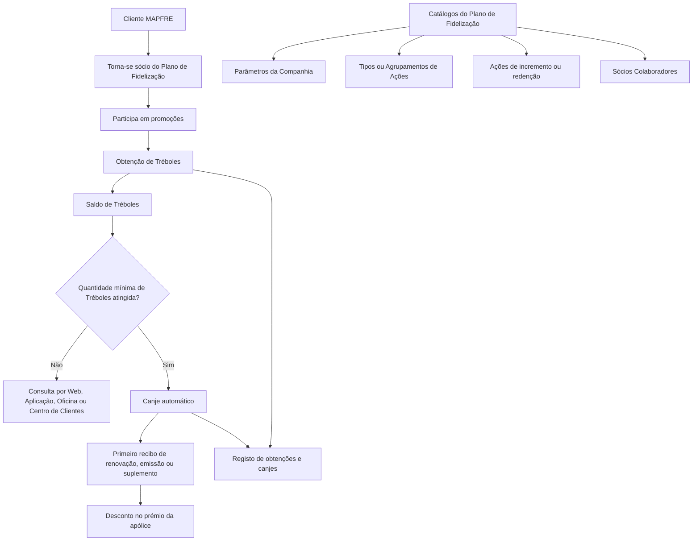

# Definição do Plano de Fidelização da Entidade MAPFRE

## 1. Metadados do Documento
- **Arquivo de Origem:** Não identificado no conteúdo extraído
- **Tipo de Documento:** Especificação Técnica
- **Domínio / Sistema:** Plano de Fidelização MAPFRE / Reef
- **Público-Alvo:** Não identificado explicitamente
- **Data/Versão Identificada:** Não identificada

---

## 2. Resumo Executivo & Contexto de Negócio

O documento define o contexto funcional do Plano de Fidelização das entidades MAPFRE. O programa de fidelização é apresentado como uma estratégia de marketing destinada a recompensar o comportamento de compra dos clientes e, consequentemente, promover lealdade e fidelidade à marca MAPFRE.

O benefício econômico previsto pelo Plano de Fidelização ocorre por meio de descontos aplicados aos prémios das apólices de seguro contratadas pelos clientes. A moeda utilizada pelo plano é denominada **Trébol**, e cada Trébol possui um valor económico determinado individualmente por país.

Para obter Tréboles, os clientes devem tornar-se sócios do Plano de Fidelização e podem participar nas promoções oferecidas pelo programa. Os Tréboles não podem ser convertidos em dinheiro em espécie e não expiram enquanto o cliente mantiver produtos contratados com a MAPFRE.

Quando o cliente atingir uma quantidade mínima de Tréboles, o sistema deve efetuar automaticamente o respetivo canje no primeiro recibo de renovação, emissão ou suplemento de uma apólice de seguro contratada pelo cliente. O documento também estabelece a necessidade de manter um registo dos processos de obtenção e canje de Tréboles.

A operação do plano depende de catálogos configuráveis localmente quando a entidade considerar o Plano de Fidelização na sua operação. Os catálogos identificados abrangem parâmetros da companhia, tipos ou agrupamentos de ações, ações que alteram o saldo de Tréboles e sócios colaboradores.

---

## 3. Arquitetura, Componentes & Tecnologias Envolvidas

O conteúdo extraído identifica os seguintes elementos funcionais e documentais:

- **MAPFRE:** entidade associada ao Plano de Fidelização.
- **Plano de Fidelização:** programa que concede benefícios económicos aos clientes.
- **Trébol:** moeda utilizada pelo Plano de Fidelização.
- **Cliente:** participante que pode tornar-se sócio, obter Tréboles, consultar saldo e realizar canjes automáticos.
- **Apólice de seguro:** contrato cujo prémio pode receber descontos mediante o canje de Tréboles.
- **Recibo de renovação, emissão ou suplemento:** eventos de recibo elegíveis para o canje automático.
- **Catálogos do Plano de Fidelização:** configurações de parâmetros, tipos, ações e sócios colaboradores.
- **Webs ou Aplicações da entidade:** canais de consulta de Tréboles.
- **Oficina e Centro de Clientes:** canais adicionais de consulta de saldo.
- **Reef / Documentación Reef / Mapfredocument:** referências presentes no cabeçalho e rodapé da documentação.



> **Nota de Análise:** O documento descreve componentes e regras funcionais, mas não detalha arquitetura de software, APIs, métodos HTTP, contratos JSON, bases de dados, servidores, URLs, tecnologias de implementação ou mecanismos técnicos de integração.

---

## 4. Regras de Negócio, Especificações Funcionais & Processos

### 4.1 Regras do Plano de Fidelização

1. O Plano de Fidelização é uma estratégia de marketing para premiar o comportamento de compra dos clientes.
2. O plano busca gerar lealdade e fidelidade dos clientes à marca MAPFRE.
3. Os clientes podem beneficiar-se economicamente mediante descontos nos prémios das apólices contratadas.
4. O **Trébol** é a moeda utilizada no Plano de Fidelização das entidades MAPFRE.
5. Para obter Tréboles, os clientes devem tornar-se sócios do Plano de Fidelização.
6. Clientes sócios podem participar nas promoções oferecidas pelo programa.
7. Cada Trébol equivale a uma quantia económica determinada por cada país.
8. Tréboles não podem ser convertidos em dinheiro em espécie.
9. Tréboles não possuem data de expiração enquanto o cliente mantiver produtos contratados com a MAPFRE.
10. Quando houver uma quantidade mínima de Tréboles, o canje deve ocorrer automaticamente.
11. O canje automático deve ser realizado no primeiro recibo de:
    - renovação;
    - emissão; ou
    - suplemento da apólice de seguro contratada pelo cliente.
12. Deve existir um registo de todos os processos de obtenção e canje de Tréboles realizados pelo cliente.
13. O cliente deve conseguir consultar os Tréboles pelos seguintes canais:
    - Webs da entidade;
    - Aplicações da entidade;
    - oficina;
    - Centro de Clientes do respetivo país.

### 4.2 Configuração Local por Catálogos

Os catálogos do Plano de Fidelização devem ser configurados sempre que a entidade local considerar o Plano de Fidelização na sua operação.

Os catálogos identificados no documento são:

1. **Parâmetros da Companhia:** configuração dos parâmetros relativos ao Plano de Fidelização.
2. **Tipos:** configuração dos tipos ou agrupamentos de ações da companhia relativos ao Plano de Fidelização.
3. **Ações:** configuração das ações que implicam incremento ou redenção do saldo de Tréboles do cliente.
4. **Sócios Colaboradores:** configuração dos sócios colaboradores da companhia relacionados com o Plano de Fidelização.

> **Nota de Análise:** O documento menciona uma “quantidade mínima de Tréboles”, mas não informa o valor desse mínimo nem a regra de cálculo por país.  
> **Nota de Análise:** O documento identifica ações de incremento e redenção de saldo, mas não detalha ações específicas, critérios de elegibilidade, calendários de promoções ou fórmulas de atribuição de Tréboles.

---

## 5. Tabelas de Parâmetros, Ambientes e Estruturas de Dados

| Item / Parâmetro | Descrição / Função | Tipo / Valores / Formato | Ambiente / Observações |
| :--- | :--- | :--- | :--- |
| Plano de Fidelização | Programa de marketing para premiar compras e promover lealdade à marca MAPFRE | Programa funcional | Aplicável às entidades MAPFRE que contemplem o plano na operação local |
| Trébol | Moeda utilizada no Plano de Fidelização | Unidade de saldo / moeda do plano | Valor económico definido por país |
| Valor do Trébol | Equivalência económica de cada Trébol | Quantia económica | Determinada por cada país; valor não informado |
| Sócio do Plano | Cliente aderente ao Plano de Fidelização | Estado ou condição de participação | Necessário para obter Tréboles |
| Promoções | Ofertas nas quais os sócios podem participar | Ações promocionais | Critérios não detalhados |
| Saldo de Tréboles | Quantidade de Tréboles acumulados pelo cliente | Saldo numérico; formato não informado | Pode aumentar ou ser reduzido por ações configuradas |
| Quantidade mínima de Tréboles | Limite que habilita o canje automático | Valor mínimo; não informado | Documento não especifica a quantidade |
| Canje de Tréboles | Utilização de Tréboles para benefício económico | Redenção automática | Executado no primeiro recibo elegível |
| Recibo de renovação | Recibo elegível para canje automático | Evento de recibo | Elegível como primeiro recibo após atingir o mínimo |
| Recibo de emissão | Recibo elegível para canje automático | Evento de recibo | Elegível como primeiro recibo após atingir o mínimo |
| Recibo de suplemento | Recibo elegível para canje automático | Evento de recibo | Elegível como primeiro recibo após atingir o mínimo |
| Desconto no prémio | Benefício económico do Plano de Fidelização | Desconto monetário | Aplicado aos prémios das apólices contratadas |
| Registo de obtenções e canjes | Histórico dos processos realizados pelo cliente | Registo / histórico | Deve incluir todas as obtenções e todos os canjes |
| Consulta por Web | Canal de consulta do saldo de Tréboles | Canal digital | Webs da entidade |
| Consulta por Aplicação | Canal de consulta do saldo de Tréboles | Canal digital | Aplicações da entidade |
| Consulta por oficina | Canal presencial de consulta | Canal presencial | Oficina da entidade |
| Centro de Clientes | Canal de consulta por atendimento | Canal de atendimento | Centro de Clientes do país do cliente |
| Parâmetros da Companhia | Catálogo para configuração de parâmetros do plano | Catálogo configurável | Relativo ao Plano de Fidelização |
| Tipos | Catálogo de tipos ou agrupamentos de ações | Catálogo configurável | Relativo às ações da companhia |
| Ações | Catálogo de ações que incrementam ou resgatam saldo | Catálogo configurável | Afeta o saldo de Tréboles do cliente |
| Sócios Colaboradores | Catálogo de parceiros colaboradores | Catálogo configurável | Relacionado ao Plano de Fidelização |
| Caducidade dos Tréboles | Regra de validade do saldo | Sem caducidade sob condição | Não expiram enquanto o cliente tiver produtos contratados com a MAPFRE |
| Conversão em dinheiro | Regra de restrição do programa | Não permitido | Tréboles não podem ser trocados por dinheiro em espécie |

---

## 6. Bateria de Perguntas & Respostas para RAG (FAQ Sintético)

### P1: Qual é o objetivo do Plano de Fidelização MAPFRE?
**R:** O Plano de Fidelização MAPFRE é uma estratégia de marketing destinada a premiar o comportamento de compra dos clientes, promovendo lealdade e fidelidade à marca. O benefício económico ocorre por meio de descontos nos prémios das apólices de seguro contratadas pelos clientes.

### P2: O que é o Trébol no Plano de Fidelização MAPFRE?
**R:** O Trébol é a moeda utilizada no Plano de Fidelização das entidades MAPFRE. Cada Trébol equivale a uma quantia económica determinada por cada país.

### P3: Como um cliente pode obter Tréboles?
**R:** Para obter Tréboles, o cliente deve tornar-se sócio do Plano de Fidelização. Após aderir ao plano, o cliente pode participar nas promoções oferecidas pelo programa. O documento não detalha as promoções nem as regras específicas de atribuição de Tréboles.

### P4: Os Tréboles podem ser convertidos em dinheiro?
**R:** Não. Os Tréboles não podem ser canjeados ou convertidos em dinheiro em espécie.

### P5: Quando os Tréboles expiram?
**R:** Os Tréboles não possuem caducidade enquanto o cliente continuar a ter produtos contratados com a MAPFRE.

### P6: Como ocorre o canje automático de Tréboles?
**R:** Quando o cliente possui uma quantidade mínima de Tréboles, o canje deve ser efetuado automaticamente no primeiro recibo de renovação, emissão ou suplemento da apólice de seguro contratada pelo cliente. O documento não informa o valor da quantidade mínima necessária.

### P7: Em quais tipos de recibo o canje automático pode ser aplicado?
**R:** O canje automático pode ser aplicado no primeiro recibo de renovação, no primeiro recibo de emissão ou no primeiro recibo de suplemento de uma apólice de seguro contratada pelo cliente.

### P8: Como o cliente pode consultar o saldo de Tréboles?
**R:** O cliente pode consultar os Tréboles através das Webs ou Aplicações da entidade, presencialmente numa oficina ou por contacto com o Centro de Clientes do seu país.

### P9: O Plano de Fidelização exige histórico de operações?
**R:** Sim. Deve existir um registo de todos os processos de obtenção de Tréboles e de todos os processos de canje realizados pelo cliente.

### P10: Quais catálogos devem ser configurados para o Plano de Fidelização?
**R:** O documento identifica quatro catálogos: Parâmetros da Companhia, Tipos ou Agrupamentos de Ações, Ações de incremento ou redenção do saldo de Tréboles e Sócios Colaboradores da Companhia.

### P11: O que configura o catálogo de Ações?
**R:** O catálogo de Ações configura as ações que implicam aumento ou redenção do saldo de Tréboles do cliente, utilizado como moeda do Plano de Fidelização. O documento não especifica quais ações estão disponíveis.

### P12: Quando os catálogos do Plano de Fidelização devem ser configurados?
**R:** Os catálogos devem ser configurados sempre que a entidade local contemplar o Plano de Fidelização na sua operação.

---

## 7. Glossário de Termos, Siglas & Conceitos-Chave

- **MAPFRE:** Entidade ou conjunto de entidades associado ao Plano de Fidelização descrito no documento.
- **Plano de Fidelização:** Programa de marketing que recompensa o comportamento de compra dos clientes e oferece benefícios económicos associados a apólices de seguro.
- **Trébol:** Moeda empregada no Plano de Fidelização MAPFRE.
- **Canje:** Utilização ou redenção de Tréboles para obtenção de desconto no prémio de uma apólice.
- **Prémio da apólice:** Valor associado à apólice de seguro sobre o qual o Plano de Fidelização pode gerar descontos.
- **Recibo de renovação:** Recibo relacionado com a renovação de uma apólice de seguro.
- **Recibo de emissão:** Recibo relacionado com a emissão de uma apólice de seguro.
- **Recibo de suplemento:** Recibo relacionado com um suplemento de uma apólice de seguro.
- **Sócio do Plano:** Cliente que aderiu ao Plano de Fidelização.
- **Sócios Colaboradores:** Parceiros colaboradores da companhia relacionados com o Plano de Fidelização.
- **Reef:** Nome presente na referência documental “DOCUMENTACIÓN Reef”; o documento extraído não define o significado ou função técnica de Reef.
- **Mapfredocument:** Termo presente no cabeçalho/rodapé documental; o conteúdo extraído não fornece definição adicional.

---

## 8. Notas Críticas, Riscos & Limitações

- O documento não especifica a quantidade mínima de Tréboles necessária para acionar o canje automático.
- O documento informa que cada país determina o valor económico do Trébol, mas não apresenta valores, moedas, regras de arredondamento ou processo de manutenção dessa equivalência.
- Não há detalhamento sobre os tipos de promoções, condições de participação, critérios de elegibilidade ou regras de atribuição de Tréboles.
- Não são fornecidos métodos de cálculo de desconto, limites de desconto, regras de priorização entre apólices ou comportamento em caso de múltiplos recibos elegíveis.
- Não há definição técnica de interfaces, APIs, serviços, modelos de dados, integrações, autenticação, autorização, auditoria técnica ou retenção do registo de operações.
- A configuração dos catálogos é condicionada à decisão local de incluir o Plano de Fidelização na operação, o que indica potencial variação de configuração entre países ou entidades.
- O conteúdo menciona Reef e Mapfredocument, mas não explica a relação técnica ou operacional desses elementos com o Plano de Fidelização.

---

## 9. Conteúdo Bruto Estruturado (Referência Fiel)

```text
--- [PÁGINA 1 DE 2] ---

DEFINICIÓN del PLAN de FIDELIZACIÓN de la Entidad MAPFRE
Contexto
Un programa de delización es una estrategia de marketing establecida por una empresa con el propósito de premiar el comportamiento de
compra de sus clientes, lo que produce en ellos un sentido de lealtad y delidad hacia la marca. El programa de delización de MAPFRE
permite a sus clientes la posibilidad de beneciarse económicamente mediante la realización de descuentos en las primas de las pólizas que
estos tengan contratadas.
El Trébol es la moneda empleada en el Plan de Fidelización de las entidades MAPFRE.
Para obtener tréboles, los Clientes tienen que hacerse socios del plan de Fidelización pudiendo participar de las promociones que ofrece
dicho programa.
Cada Trébol equivale a una cantidad económica determinada por cada país.
Los Tréboles no pueden canjearse por dinero en efectivo.
No tienen caducidad mientras el cliente siga teniendo contratados productos con MAPFRE.
Cuando se tiene un mínimo de Tréboles, se canjearán automáticamente en el primer recibo de renovación, emisión o suplemento de la
póliza de seguro contratado por el Cliente.
Se tendrá un Registro de todos los procesos de obtención y canje de tréboles que haya realizado el cliente.
El cliente debe poder consultar sus tréboles a través de las Webs o Aplicaciones de la entidad, acudiendo a su ocina o llamando al
Centro de Clientes de su país.
Catálogos del Plan de Fidelización de la Entidad
Este conjunto de catálogos se ha de congurar siempre y cuando la entidad localmente contemple el Plan de
Fidelización en su operativa.
PARÁMETROS DE LA COMPAÑÍA 
Conguración de los Parámetros de la
Compañía Relativos al Plan de
Fidelización.
TIPOS 
Conguración de los Tipos o
Agrupaciones de Acciones de la
Compañía Relativas al Plan de
Fidelización.
ACCIONES 
Conguración de las Acciones que
conllevarán un incremento o una
redención del saldo de Tréboles del
Documentation / DOCUMENTACIÓN Reef
DOCUMENTACIÓN Reef
Mapfredocument
DOCUMENTACIÓN Reef
Owner
user:agonzalez_mapfre.com
Lifecycle
Approved Source
 / 
 VL
Buscar Inicio Soluciones Arquitecturas APIs Componentes Cloud Documentación Zeus Reef Ayuda
ES


--- [PÁGINA 2 DE 2] ---

Cliente como moneda del Plan de
Fidelización.
SOCIOS COLABORADORES
Conguración de los Socios
Colaboradores de la Compañía
relacionados con el Plan de Fidelización.
```
