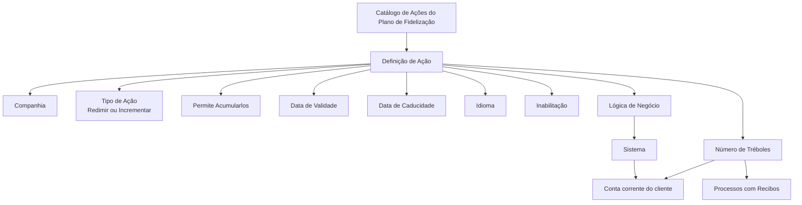

# Definição de Ações para Somar ou Restar Tréboles no Plano de Fidelização

## 1. Metadados do Documento
- **Arquivo de Origem:** Não identificado no conteúdo extraído
- **Tipo de Documento:** Especificação Técnica / Documentação Funcional
- **Domínio / Sistema:** Reef — Plano de Fidelização MAPFRE Local
- **Público-Alvo:** Negócio, analistas funcionais, desenvolvedores e operação
- **Data/Versão Identificada:** Não identificada

---

## 2. Resumo Executivo & Contexto de Negócio

O documento define o catálogo de ações que permitem incrementar ou redimir o saldo de **Tréboles** na “conta corrente” do cliente dentro do Plano de Fidelização. Cada ação é configurada por companhia, código, descrição, tipo, quantidade de tréboles, validade, caducidade, idioma, regra de acumulação, estado de inabilitação e lógica de negócio associada.

A classificação da ação determina se a operação é de **redimir** ou **incrementar** tréboles. O catálogo prevê os tipos “REDIMIR GENÉRICO” e “INCREMENTAR GENÉRICO”, respectivamente associados aos códigos de tipo `1` e `2`.

A quantidade de tréboles pode ser positiva, negativa ou zero, dependendo do significado operacional da ação. Valores positivos correspondem a tréboles que podem ser redimidos para desconto sobre o prêmio. Valores negativos correspondem a tréboles monetizáveis, como em compras de entradas de cinema ou em outras ações definidas para parceiros externos. Para ações com impacto em recibos e possibilidade de canje de tréboles — como emissão de apólice, suplemento ou renovação — o número de tréboles deve ser informado como zero.

O documento também estabelece que as ações de código `[1]`, **“Cobro del Recibo”**, e `[2]`, **“Anulado de Cobro del Recibo”**, devem obrigatoriamente estar definidas para a entidade. Não há recomendação corporativa para padronização da codificação local das ações; entretanto, a entidade MAPFRE deve avaliar a conveniência de organizar os códigos de forma transversal para futura exploração das informações.

---

## 3. Arquitetura, Componentes & Tecnologias Envolvidas

Os elementos explicitamente citados são:

| Componente / Conceito | Papel descrito |
| :--- | :--- |
| Reef | Repositório ou sistema de documentação onde o conteúdo é publicado. |
| Plano de Fidelização | Contexto funcional no qual as ações de incremento ou redenção de tréboles são configuradas. |
| Catálogo de Ações | Estrutura provida pelo núcleo para configurar e classificar ações que alteram o saldo de tréboles. |
| Conta corrente do cliente | Local funcional onde o saldo de tréboles do cliente é incrementado ou redimido. |
| Sistema | Consumidor da propriedade “Lógica de Negócio”, usada para validar e obter o número de tréboles em tempo real. |
| Direções de Negócio da entidade MAPFRE Local | Áreas que determinam as combinações de critérios para a lógica de negócio. |
| Parceiro externo | Possível participante de ações com monetização de tréboles, como compra de entradas de cinema. |
| Recibos | Elementos que podem sofrer impacto de determinadas ações, como emissão de apólice, suplemento ou renovação. |



> **Nota de Análise:** O documento descreve propriedades e regras funcionais do catálogo, mas não detalha tecnologias de implementação, APIs, métodos HTTP, estruturas JSON, bancos de dados, URLs de ambiente, servidores ou contratos de integração.

---

## 4. Regras de Negócio, Especificações Funcionais & Processos

### 4.1 Objetivo do catálogo

O catálogo deve configurar e classificar todas as ações que impliquem incremento ou redenção de tréboles na conta corrente do cliente.

### 4.2 Identificação da companhia

A propriedade **Compañía** contém o código da companhia sobre a qual está sendo realizada a definição de uma ação concreta do Plano de Fidelização.

### 4.3 Código da ação

A propriedade **Código de la Acción** determina o código ou a chave da ação configurada no catálogo.

As seguintes ações devem estar obrigatoriamente definidas para a entidade:

| Código | Ação obrigatória |
| :--- | :--- |
| `1` | Cobro del Recibo |
| `2` | Anulado de Cobro del Recibo |

### 4.4 Descrição da ação

A propriedade **Descripción de la Acción** armazena a denominação ou descrição da ação conforme o idioma utilizado na definição.

### 4.5 Tipo de ação

A propriedade **Tipo de Acción** define se a ação é utilizada para incrementar ou redimir o saldo de tréboles do cliente.

| Código do Tipo | Descrição |
| :--- | :--- |
| `1` | REDIMIR GENÉRICO |
| `2` | INCREMENTAR GENÉRICO |

### 4.6 Número de tréboles

Para cada ação, deve ser identificada uma quantidade de tréboles. Essa quantidade pode ser positiva, negativa ou zero.

| Condição do número de tréboles | Significado funcional |
| :--- | :--- |
| Positivo | Número de tréboles que podem ser redimidos para aplicar desconto sobre o prêmio. |
| Negativo | Número de tréboles que podem ser monetizados, por exemplo, para compra de entradas de cinema ou outra ação realizada por parceiro externo. |
| Zero | Valor obrigatório para ações que possam impactar recibos e nas quais seja possível aplicar o canje de tréboles, como emissão de apólice, suplemento ou renovação. |

### 4.7 Acumulação reiterativa

A propriedade **Permite Acumularlos** determina se a ação permite ou não acumular reiteradamente o número de tréboles configurado para a ação definida.

### 4.8 Caducidade da ação

A propriedade **Fecha de Caducidad** determina a data de caducidade da ação definida. A caducidade pode variar conforme a origem de obtenção dos tréboles.

### 4.9 Lógica de negócio em tempo real

A propriedade **Lógica de Negocio** indica ao sistema o nome da lógica de negócio usada para:

1. Validar a ação definida.
2. Obter o número de tréboles da ação.
3. Executar a validação e obtenção em tempo real.
4. Aplicar as combinações de critérios determinadas pelas Direções de Negócio da entidade MAPFRE Local.

> **Nota de Análise:** O documento não especifica os nomes concretos das lógicas de negócio, os critérios aplicáveis, interfaces técnicas ou o mecanismo pelo qual o sistema invoca a lógica em tempo real.

### 4.10 Idioma

A propriedade **Idioma** corresponde à chave do idioma utilizada na definição das ações. Os exemplos explicitamente apresentados são espanhol, inglês e turco.

### 4.11 Data de validade

A propriedade **Fecha de Validez** estabelece a data a partir da qual a definição da ação fica disponível para utilização no sistema.

A configuração correta da data de validade permite:

1. Manter histórico das alterações realizadas nas definições.
2. Rastrear alterações nas definições do catálogo.
3. Explorar posteriormente as informações históricas.

### 4.12 Inabilitação

A propriedade **Inhabilitación** indica que o código da ação definido está inabilitado para utilização nos processos operativos associados ao Plano de Fidelização.

### 4.13 Codificação local do catálogo

Não existe preferência ou recomendação para estabelecer ou padronizar a codificação das ações no sistema.

A entidade MAPFRE deve analisar a conveniência de utilizar transversalmente o catálogo de informações para garantir sua correta exploração futura. Os exemplos apresentados incluem:

- Agrupar e codificar códigos de ações por faixas, segundo o âmbito de utilização.
- Agrupar e codificar códigos de ações conforme a atividade econômica à qual se destinam.

---

## 5. Tabelas de Parâmetros, Ambientes e Estruturas de Dados

| Item / Parâmetro | Descrição / Função | Tipo / Valores / Formato | Ambiente / Observações |
| :--- | :--- | :--- | :--- |
| Compañía | Código da companhia para a qual a ação do Plano de Fidelização é definida. | Código de companhia | Aplicável à entidade MAPFRE Local. |
| Código de la Acción | Código ou chave da ação configurada no catálogo. | Código de ação | Os códigos `1` e `2` devem obrigatoriamente existir para a entidade. |
| Código `1` | Ação obrigatória “Cobro del Recibo”. | Código obrigatório | Deve ser definida para a entidade. |
| Código `2` | Ação obrigatória “Anulado de Cobro del Recibo”. | Código obrigatório | Deve ser definida para a entidade. |
| Descripción de la Acción | Denominação ou descrição da ação. | Texto conforme idioma definido | Associada ao idioma da definição. |
| Tipo de Acción | Define se a ação incrementa ou redime o saldo de tréboles. | `1` = REDIMIR GENÉRICO; `2` = INCREMENTAR GENÉRICO | Os tipos apresentados são exemplos de valores possíveis. |
| Número de Tréboles | Quantidade de tréboles associada à ação. | Número positivo, negativo ou zero | Aplicam-se regras específicas para valores positivos, negativos e zero. |
| Número de Tréboles positivo | Tréboles que podem ser redimidos para desconto sobre o prêmio. | Número positivo | Associado à redenção para desconto na prima. |
| Número de Tréboles negativo | Tréboles monetizáveis. | Número negativo | Exemplo: compra de entradas de cinema ou ação com parceiro externo. |
| Número de Tréboles igual a zero | Valor para ações com impacto em recibos e possibilidade de canje. | `0` | Exemplos: emissão de apólice, suplemento e renovação. |
| Permite Acumularlos | Indica se a ação permite acumulação reiterativa de tréboles. | Sim ou não, formato não detalhado | O documento não informa valores técnicos específicos. |
| Fecha de Caducidad | Define a data de caducidade da ação. | Data, formato não detalhado | Pode variar conforme a origem de obtenção. |
| Lógica de Negocio | Nome da lógica usada para validar e obter o número de tréboles. | Nome de lógica de negócio, formato não detalhado | Executada em tempo real conforme critérios das Direções de Negócio MAPFRE Local. |
| Idioma | Chave do idioma da definição da ação. | Exemplos: espanhol, inglês, turco | O formato da chave não é especificado. |
| Fecha de Validez | Data a partir da qual a ação está disponível no sistema. | Data, formato não detalhado | Permite histórico, rastreabilidade e exploração posterior. |
| Inhabilitación | Define que a ação não pode ser usada em processos operativos associados. | Estado de inabilitação, formato não detalhado | Afeta o código de ação definido. |
| Ambientes | Não identificados. | Não aplicável | O documento não cita URLs, servidores ou ambientes técnicos. |
| Logs | Não identificados. | Não aplicável | O documento não cita rotas, níveis ou variáveis de log. |

---

## 6. Bateria de Perguntas & Respostas para RAG (FAQ Sintético)

### P1: Qual é o objetivo do catálogo de ações para somar ou restar tréboles?
**R:** O catálogo tem o objetivo de configurar e classificar todas as ações que impliquem incremento ou redenção de tréboles na conta corrente do cliente dentro do Plano de Fidelização.

### P2: Quais ações devem estar obrigatoriamente definidas para a entidade?
**R:** As ações obrigatórias são o código `1`, “Cobro del Recibo”, e o código `2`, “Anulado de Cobro del Recibo”. O documento determina expressamente que ambas devem estar definidas para a entidade.

### P3: O que representa o atributo Compañía na definição de uma ação?
**R:** O atributo Compañía contém o código da companhia sobre a qual está sendo realizada a definição da ação concreta do Plano de Fidelização.

### P4: Quais são os tipos de ação apresentados no catálogo?
**R:** O documento apresenta o tipo `1`, “REDIMIR GENÉRICO”, e o tipo `2`, “INCREMENTAR GENÉRICO”. A propriedade Tipo de Acción determina se a ação serve para incrementar ou redimir o saldo de tréboles do cliente.

### P5: O que significa configurar um número positivo de tréboles?
**R:** Um número positivo corresponde à quantidade de tréboles que pode ser redimida para aplicar um desconto sobre o prêmio.

### P6: O que significa configurar um número negativo de tréboles?
**R:** Um número negativo corresponde a tréboles que podem ser monetizados. O documento cita como exemplo a compra de entradas de cinema ou outra ação realizada por parceiro externo.

### P7: Quando o número de tréboles deve ser configurado como zero?
**R:** O número de tréboles deve ser zero em ações que possam impactar recibos e nas quais seja possível aplicar o canje de tréboles. Os exemplos citados são emissão de apólice, suplemento e renovação.

### P8: Qual é a função da propriedade Permite Acumularlos?
**R:** A propriedade Permite Acumularlos define se a ação permite ou não a acumulação reiterativa da quantidade de tréboles configurada para aquela ação.

### P9: Para que serve a propriedade Lógica de Negocio?
**R:** A propriedade Lógica de Negocio informa ao sistema o nome da lógica de negócio que valida e obtém, em tempo real, o número de tréboles da ação definida, considerando as combinações de critérios determinadas pelas Direções de Negócio da entidade MAPFRE Local.

### P10: Qual é a finalidade da Fecha de Validez?
**R:** A Fecha de Validez define a partir de quando a ação fica disponível para uso no sistema. Uma configuração correta permite manter histórico de alterações, rastrear as definições e explorar essas informações posteriormente.

### P11: O que ocorre quando uma ação está inabilitada?
**R:** Quando a propriedade Inhabilitación indica que uma ação está inabilitada, o código dessa ação não pode ser empregado nos processos operativos associados ao Plano de Fidelização.

### P12: Existe um padrão obrigatório para codificar as ações localmente?
**R:** Não. O documento afirma que não existe preferência ou recomendação para estabelecer ou padronizar a codificação no sistema. A entidade MAPFRE deve, entretanto, avaliar a conveniência de organizar os códigos de maneira transversal para facilitar a exploração futura do catálogo.

---

## 7. Glossário de Termos, Siglas & Conceitos-Chave

- **Reef:** Contexto de documentação no qual o conteúdo está publicado.
- **Plano de Fidelização:** Contexto funcional responsável pelas ações relacionadas ao saldo de tréboles do cliente.
- **Tréboles:** Unidades de saldo associadas à conta corrente do cliente, que podem ser incrementadas, redimidas ou monetizadas conforme a ação configurada.
- **Conta corrente do cliente:** Registro funcional do saldo de tréboles pertencente ao cliente.
- **Catálogo de Ações:** Estrutura fornecida pelo núcleo para configurar e classificar ações de incremento ou redenção de tréboles.
- **Redimir:** Utilizar tréboles para aplicar desconto sobre o prêmio.
- **Incrementar:** Aumentar o saldo de tréboles do cliente.
- **Monetizar:** Utilizar tréboles em uma ação como compra de entradas de cinema ou outra operação definida para parceiro externo.
- **Canje de tréboles:** Troca ou utilização de tréboles em ações que podem impactar recibos.
- **Recibo:** Elemento operacional citado em ações como “Cobro del Recibo” e “Anulado de Cobro del Recibo”.
- **Suplemento:** Tipo de ação mencionado como exemplo de processo que pode impactar recibos.
- **Renovação:** Tipo de ação mencionado como exemplo de processo que pode impactar recibos.
- **MAPFRE Local:** Entidade MAPFRE cujas Direções de Negócio determinam os critérios usados pela lógica de negócio.
- **Lógica de Negócio:** Lógica identificada pelo nome e utilizada pelo sistema para validar e obter o número de tréboles em tempo real.
- **Inhabilitación:** Estado que impede o uso do código da ação em processos operativos associados ao Plano de Fidelização.

---

## 8. Notas Críticas, Riscos & Limitações

- O documento não informa o nome do arquivo original, data, versão, autor técnico ou ciclo de revisão.
- O documento não especifica APIs, métodos HTTP, contratos JSON, estruturas de banco de dados, eventos, filas, serviços, URLs, portas ou ambientes.
- O documento não detalha como os tipos de ação “REDIMIR GENÉRICO” e “INCREMENTAR GENÉRICO” se relacionam tecnicamente aos valores positivos ou negativos do número de tréboles.
- A representação técnica do atributo **Permite Acumularlos** não é definida; o documento descreve apenas seu propósito funcional.
- Os formatos de data para **Fecha de Caducidad** e **Fecha de Validez** não são especificados.
- Os valores técnicos aceitos para **Idioma** não são detalhados; são apresentados somente exemplos de idiomas: espanhol, inglês e turco.
- O documento afirma que a lógica de negócio opera em tempo real, mas não identifica nomes de lógicas, regras de decisão, critérios, integrações ou responsáveis técnicos.
- A inexistência de padronização obrigatória para codificação local cria risco de inconsistência entre entidades, caso não seja adotada uma convenção transversal de agrupamento e codificação.
- A interpretação isolada do documento pode conduzir a erro; o próprio conteúdo recomenda a leitura de diretrizes e documentos funcionais vinculados, especialmente “Tipos de Acciones”.

---

## 9. Conteúdo Bruto Estruturado (Referência Fiel)

```text
--- [PÁGINA 1 DE 2] ---

DEFINICIÓN de las ACCIONES que permiten SUMAR/RESTAR
TRÉBOLES
Objetivo
Congurar y clasicar en un catálogo provisto por el núcleo, de todas aquellas acciones que conlleven un incremento o redención de los
Tréboles en la 'cuenta corriente' del cliente.
Propiedades
Otras Propiedades
Propiedades
Compañía
Este Atributo del catálogo contiene el código de la compañía sobre la que se está realizando la denición de la acción concreta del Plan de
Fidelización.
Código de la Acción
Este Atributo determina el código o clave de la acción que se está congurando en el catálogo.
NOTA: Las acciones con códigos [1] - 'Cobro del Recibo' y [2] - 'Anulado de Cobro del Recibo' son acciones que tienen que estar
obligatoriamente denidas para la entidad.
Descripción de la Acción
Esta propiedad contiene la denominación o descripción de la acción de acuerdo con el idioma utilizado en la denición.
Tipo de Acción
Esta Propiedad determina la tipología de la acción del Plan de Fidelización indicando si la misma sirve para incrementar o redimir el saldo de
tréboles del Cliente, siendo por ejemplo sus posibles valores:
TIPO DESCRIPCIÓN
1 REDIMIR GENÉRICO
2 INCREMENTAR GENÉRICO
Número de Tréboles
Documentation / DOCUMENTACIÓN Reef
DOCUMENTACIÓN Reef
Mapfredocument
DOCUMENTACIÓN Reef
Owner
user:agonzalez_mapfre.com
Lifecycle
Approved Source
 /
 VL
Buscar Inicio Soluciones Arquitecturas APIs Componentes Cloud Documentación Zeus Reef Ayuda
ES


--- [PÁGINA 2 DE 2] ---

Por cada acción se debe identicar la cantidad de tréboles asociados a la misma, cantidad que podrá ser un número positivo o negativo, de
tal manera que...
Si es positiva, la cantidad congurada se corresponderá con el número de tréboles que se pueden redimir para aplicar un descuento
sobre la prima.
Si es negativa, se corresponderá con el número de tréboles que se pueden monetizar, como por ejemplo para la compra de unas entradas
en el cine o cualquier otra acción que se determine sea realizada por algún socio externo.
En aquellas acciones que puedan tener un impacto en los Recibos y sobre las que se pueda aplicar el canje de tréboles, como por
ejemplo la Emisión de una Póliza, Suplemento o Renovación, se debe informar un cero en el número de tréboles.
Permite Acumularlos
Este atributo determina si la acción permite o no acumular de manera reiterativa el número de tréboles para la acción denida.
Fecha de Caducidad
Este Atributo determina la fecha de caducidad de la acción denida y por tanto se puede establecer diferentes caducidades de acuerdo con el
origen de su obtención.
Lógica de Negocio
Esta propiedad le indica al Sistema el nombre de la Lógica de Negocio que que permite validar y obtener el número de tréboles de la acción
denida, en tiempo real y con las combinaciones de criterios que determinen las Direcciones de Negocio de la entidad MAPFRE Local.
Idioma
Esta propiedad es la clave del Idioma empleado en la denición de las acciones, como por ejemplo: español, inglés, turco, ...
Otras Propiedades
Fecha de Validez
Esta propiedad establece la fecha a partir de la cual la denición de la acción está disponible en el sistema para ser utilizada, por lo que una
correcta conguración habilita tener un histórico de los cambios efectuados en las deniciones y poder así trazar y explotar posteriormente
esta información.
Inhabilitación
Esta propiedad establece que el Código de la Acción denida está inhabilitado para poder ser empleado en los Procesos Operativos
asociados al Plan de Fidelización.
Vínculos
Relación de Directrices y Documentos funcionales cuya lectura recomendada para evitar que la interpretación aislada del presente
documento pueda conducir a error.
Tipos de Acciones
Preguntas frecuentes
(1) ¿Existe alguna recomendación operativa que deba ser tomada en consideración localmente en la codicación, uso y denición del
catálogo de Acciones para Sumar o Restar Tréboles?
No existe una preferencia ni recomendación para establecer o estandarizar en el sistema su codicación, si bien la entidad MAPFRE debe
analizar la conveniencia de utilizar transversalmente en los procesos de la compañía este catálogo de información para su correcta y
posterior explotación, e.g:
Agrupando y codicando los códigos de las acciones por tramos de acuerdo con su ámbito de utilización, agrupando y codicando los
códigos de las acciones de acuerdo con la actividad económica a la que van dirigida,...
```
