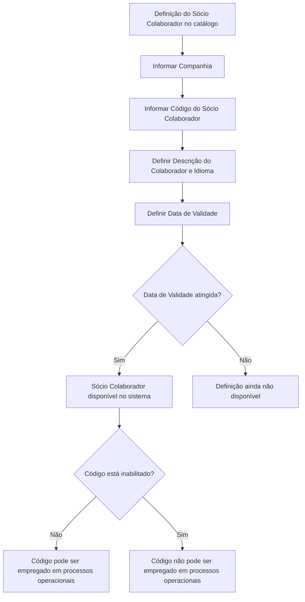

# Definição dos Sócios Colaboradores do Plano de Fidelização

## 1. Metadados do Documento
- **Arquivo de Origem:** Não identificado no conteúdo fornecido
- **Tipo de Documento:** Especificação Funcional
- **Domínio / Sistema:** Reef / Plano de Fidelização / Mapfre
- **Público-Alvo:** Negócio, analistas funcionais, operação e responsáveis pela configuração de catálogos
- **Data/Versão Identificada:** Não identificada
- **Estado do documento identificado:** Approved Source
- **Proprietário identificado:** `user:agonzalez_mapfre.com`

---

## 2. Resumo Executivo & Contexto de Negócio

O documento define o catálogo de **Sócios Colaboradores do Plano de Fidelização** de uma companhia seguradora. Sócios colaboradores são empresas relacionadas ao programa de fidelização que podem oferecer serviços ou produtos de qualidade aos participantes inscritos no programa.

O objetivo explícito é definir a relação de sócios do programa de fidelização da companhia seguradora. A configuração é realizada por meio de atributos de catálogo que identificam a companhia, o sócio colaborador, sua descrição e o idioma utilizado na definição.

A definição possui controle temporal por meio da propriedade **Data de Validade**. Essa propriedade determina a data a partir da qual a definição do sócio colaborador fica disponível no sistema. A configuração correta permite manter histórico das alterações efetuadas nas definições, rastrear as mudanças e explorar posteriormente essas informações.

O catálogo também prevê a propriedade **Inabilitação**, que determina que o código identificador do sócio colaborador não pode ser utilizado nos processos operacionais associados ao Plano de Fidelização. O documento declara que não existe preferência ou recomendação para padronizar localmente a codificação dos sócios colaboradores no sistema.

---

## 3. Arquitetura, Componentes & Tecnologias Envolvidas

O conteúdo fornecido não descreve arquitetura de software, tecnologias, APIs, métodos HTTP, contratos JSON, servidores, ambientes ou integrações entre microsserviços.

Os elementos funcionais identificados são:

| Componente / Elemento | Papel identificado no documento |
| :--- | :--- |
| Reef | Repositório ou contexto de documentação identificado como “DOCUMENTACIÓN Reef”. |
| Plano de Fidelização | Programa ao qual os sócios colaboradores estão associados. |
| Catálogo de Sócios Colaboradores | Estrutura de configuração que contém os atributos do sócio colaborador. |
| Companhia | Entidade cujo código é informado na definição do sócio colaborador. |
| Processos Operacionais | Processos associados ao Plano de Fidelização que não podem utilizar um código inabilitado. |
| Tipos de Ações | Documento funcional relacionado, listado como vínculo. |
| Ações do Plano de Fidelização | Documento funcional relacionado, listado como vínculo. |
| Mapfredocument | Referência visual identificada no conteúdo bruto. |
| Zeus | Item de navegação identificado no conteúdo bruto; sem detalhamento funcional. |

O fluxo funcional explicitamente suportado pelo texto é o ciclo de disponibilidade e inabilitação de um código de sócio colaborador:



> **Nota de Análise:** O documento não detalha como o catálogo é implementado no sistema, quais telas ou APIs efetuam a manutenção, nem quais processos operacionais consomem a configuração.

---

## 4. Regras de Negócio, Especificações Funcionais & Processos

### 4.1 Definição de Sócio Colaborador

1. Um sócio colaborador corresponde a uma empresa que pode oferecer serviços ou produtos de qualidade aos participantes inscritos no programa de fidelização.
2. A finalidade do catálogo é definir a relação de sócios do programa de fidelização da companhia seguradora.
3. A definição do sócio colaborador é vinculada a uma companhia por meio do código da companhia.
4. Cada sócio colaborador possui um código ou chave configurado no catálogo.
5. A denominação do sócio colaborador é armazenada na propriedade de descrição.
6. A descrição do sócio colaborador deve considerar o idioma utilizado na definição.
7. O idioma é representado por uma chave de idioma; exemplos apresentados no documento incluem espanhol, inglês e turco.

### 4.2 Vigência e Histórico

1. A propriedade **Data de Validade** determina a data a partir da qual a definição de um sócio colaborador fica disponível para uso no sistema.
2. A configuração adequada da Data de Validade habilita a manutenção de histórico das mudanças realizadas nas definições.
3. O histórico permite rastrear e explorar posteriormente as informações referentes às alterações das definições de sócios colaboradores.

### 4.3 Inabilitação

1. A propriedade **Inabilitação** estabelece que o código identificador do sócio colaborador está inabilitado.
2. Um código inabilitado não pode ser empregado nos processos operacionais associados ao Plano de Fidelização.
3. O documento não informa se a inabilitação remove registros históricos, impede edição ou exige justificativa operacional.

### 4.4 Codificação Local

1. Não existe preferência ou recomendação para estabelecer ou padronizar no sistema a codificação do catálogo de Sócios Colaboradores do Plano de Fidelização.
2. O documento não apresenta formato obrigatório, máscara, tamanho, sequência numérica ou convenção de nomenclatura para o código do sócio colaborador.

### 4.5 Documentos Relacionados

A interpretação do documento não deve ocorrer isoladamente. O próprio conteúdo recomenda a leitura das diretrizes e documentos funcionais vinculados para evitar interpretações incorretas.

| Documento relacionado | Relação declarada |
| :--- | :--- |
| Tipos de Ações | Vínculo recomendado para leitura. |
| Ações do Plano de Fidelização | Vínculo recomendado para leitura. |

---

## 5. Tabelas de Parâmetros, Ambientes e Estruturas de Dados

### 5.1 Propriedades do Catálogo de Sócios Colaboradores

| Item / Parâmetro | Descrição / Função | Tipo / Valores / Formato | Ambiente / Observações |
| :--- | :--- | :--- | :--- |
| Companhia | Contém o código da companhia sobre a qual está sendo realizada a definição do Sócio Colaborador do Plano. | Código da companhia; formato não especificado. | Aplicável à definição do catálogo. |
| Código do Sócio Colaborador | Determina o código ou chave do sócio colaborador configurado no catálogo. | Código ou chave; formato não especificado. | Não existe recomendação ou preferência de padronização da codificação. |
| Descrição do Colaborador | Contém a denominação do sócio colaborador conforme o idioma utilizado na definição. | Texto; formato não especificado. | Deve estar associado ao idioma empregado na configuração. |
| Idioma | Chave do idioma utilizada na configuração dos Colaboradores do Plano de Fidelização. | Chave de idioma. Exemplos: espanhol, inglês e turco. | O documento não especifica catálogo de idiomas nem códigos técnicos. |
| Data de Validade | Estabelece a data a partir da qual a definição do Sócio Colaborador está disponível no sistema. | Data; formato não especificado. | Permite histórico, rastreabilidade e exploração posterior de alterações. |
| Inabilitação | Estabelece que o código identificador do Sócio Colaborador está inabilitado para uso. | Estado de inabilitação; valores não especificados. | Impede uso do código nos processos operacionais associados ao Plano de Fidelização. |

### 5.2 Informações de Governança Documental Identificadas

| Item / Parâmetro | Descrição / Função | Tipo / Valores / Formato | Ambiente / Observações |
| :--- | :--- | :--- | :--- |
| Documentação | Referência a “DOCUMENTACIÓN Reef”. | Texto identificado. | Sem detalhamento adicional. |
| Owner | Proprietário identificado no documento. | `user:agonzalez_mapfre.com` | Valor preservado conforme conteúdo original. |
| Lifecycle | Estado do ciclo de vida documental. | `Approved Source` | Sem definição adicional do status. |
| Idioma de interface | Idioma indicado na navegação. | `ES` | Identificado no conteúdo bruto. |

---

## 6. Bateria de Perguntas & Respostas para RAG (FAQ Sintético)

### P1: O que é um Sócio Colaborador no Plano de Fidelização?
**R:** Um Sócio Colaborador é uma empresa relacionada ao programa de fidelização que pode oferecer serviços ou produtos de qualidade aos participantes inscritos no programa.

### P2: Qual é o objetivo do catálogo de Sócios Colaboradores?
**R:** O objetivo é definir a relação de sócios do programa de fidelização da companhia seguradora.

### P3: Como a definição de um Sócio Colaborador é associada a uma companhia?
**R:** A associação é realizada pela propriedade **Companhia**, que contém o código da companhia sobre a qual está sendo feita a definição do Sócio Colaborador do Plano.

### P4: Qual propriedade identifica unicamente o Sócio Colaborador configurado no catálogo?
**R:** A propriedade **Código do Sócio Colaborador** determina o código ou a chave do sócio colaborador que está sendo configurado no catálogo.

### P5: Existe um padrão obrigatório para o código do Sócio Colaborador?
**R:** Não. O documento declara que não existe preferência nem recomendação para estabelecer ou padronizar a codificação no sistema para o catálogo de Sócios Colaboradores do Plano de Fidelização.

### P6: Como a descrição de um Sócio Colaborador é tratada em diferentes idiomas?
**R:** A propriedade **Descrição do Colaborador** contém a denominação do sócio colaborador de acordo com o idioma empregado em sua definição. A propriedade **Idioma** armazena a chave do idioma utilizada nessa configuração, com exemplos de espanhol, inglês e turco.

### P7: Qual é a função da Data de Validade na definição de um Sócio Colaborador?
**R:** A Data de Validade estabelece a data a partir da qual a definição do Sócio Colaborador fica disponível para uso no sistema. A configuração correta também permite manter histórico das alterações, rastrear mudanças e explorar posteriormente as informações registradas.

### P8: O que acontece quando um código de Sócio Colaborador está inabilitado?
**R:** Quando a propriedade **Inabilitação** estabelece que o código identificador do Sócio Colaborador está inabilitado, esse código não pode ser empregado nos processos operacionais associados ao Plano de Fidelização.

### P9: A inabilitação impede a existência histórica do Sócio Colaborador no catálogo?
**R:** O documento informa apenas que o código inabilitado não pode ser empregado nos processos operacionais associados ao Plano de Fidelização. Não há detalhamento sobre exclusão, retenção histórica, edição ou consulta de registros inabilitados.

### P10: Quais documentos devem ser consultados junto com esta definição funcional?
**R:** O documento recomenda a leitura de diretrizes e documentos funcionais relacionados para evitar interpretações isoladas incorretas. Os vínculos listados são **Tipos de Ações** e **Ações do Plano de Fidelização**.

### P11: O documento especifica APIs, URLs, métodos HTTP ou contratos de integração para o catálogo?
**R:** Não. O conteúdo fornecido não detalha APIs, URLs, métodos HTTP, contratos JSON, bancos de dados, servidores, ambientes ou integrações técnicas.

### P12: Quem é o proprietário identificado da documentação?
**R:** O campo **Owner** do conteúdo bruto identifica `user:agonzalez_mapfre.com`.

---

## 7. Glossário de Termos, Siglas & Conceitos-Chave

- **Plano de Fidelização:** Programa ao qual os participantes aderem e no qual os sócios colaboradores podem oferecer serviços ou produtos.
- **Sócio Colaborador:** Empresa relacionada ao programa de fidelização que pode oferecer serviços ou produtos de qualidade aos participantes inscritos.
- **Catálogo:** Estrutura de configuração na qual são definidos os atributos do Sócio Colaborador do Plano.
- **Companhia:** Entidade identificada por código e sobre a qual é realizada a definição do Sócio Colaborador.
- **Código do Sócio Colaborador:** Código ou chave que identifica o sócio colaborador configurado no catálogo.
- **Descrição do Colaborador:** Denominação do sócio colaborador de acordo com o idioma usado na definição.
- **Idioma:** Chave de idioma empregada na configuração dos Colaboradores do Plano de Fidelização.
- **Data de Validade:** Data a partir da qual uma definição de Sócio Colaborador fica disponível no sistema.
- **Inabilitação:** Condição pela qual o código do Sócio Colaborador não pode ser utilizado em processos operacionais associados ao Plano de Fidelização.
- **Reef:** Nome presente na referência “DOCUMENTACIÓN Reef”; o documento não detalha seu significado técnico ou funcional.
- **Mapfredocument:** Referência visual presente no conteúdo bruto, sem definição adicional.
- **Approved Source:** Estado de ciclo de vida identificado no documento; sem definição adicional apresentada.
- **ES:** Código exibido na navegação do conteúdo bruto, aparentemente associado ao idioma espanhol; o documento não fornece explicação formal.

---

## 8. Notas Críticas, Riscos & Limitações

- O documento não identifica o nome do arquivo de origem, data, versão formal ou autoria além do campo `Owner`.
- O conteúdo não especifica arquitetura de software, tecnologias, APIs, URLs, ambientes, bancos de dados, rotas de log, mecanismos de autenticação ou contratos de integração.
- Não são definidos formatos, tamanhos, obrigatoriedade, unicidade ou regras de validação para os atributos Companhia, Código do Sócio Colaborador, Descrição, Idioma, Data de Validade e Inabilitação.
- A regra de codificação local é deliberadamente não prescritiva: não existe recomendação nem preferência de padronização para os códigos dos Sócios Colaboradores.
- O texto não explica como conflitos entre definições históricas, datas de validade ou idiomas devem ser tratados.
- A inabilitação é definida apenas pelo efeito operacional de impedir o uso do código em processos associados ao Plano de Fidelização. Não há detalhamento sobre reversão, auditoria, aprovação ou impacto em registros históricos.
- A leitura isolada do documento pode conduzir a erro; o conteúdo recomenda consultar os documentos vinculados **Tipos de Ações** e **Ações do Plano de Fidelização**.
- **Nota de Análise:** O documento apresenta uma definição funcional de catálogo, mas não detalha os processos operacionais que consomem o código do Sócio Colaborador nem os critérios técnicos de integração.

---

## 9. Conteúdo Bruto Estruturado (Referência Fiel)

```text
--- [PÁGINA 1 DE 2] ---

DEFINICIÓN de las SOCIOS COLABORADORES del PLAN de
FIDELIZACIÓN
Contexto
Los socios colaboradores de un programa de delización son la relación de empresas que pueden ofrecer servicios o productos de calidad a
los socios adscritos al programa.
Objetivo
Denir la relación de socios del programa de delización de la compañía aseguradora.
Propiedades
Otras Propiedades
Propiedades
Compañía
Este Atributo del catálogo contiene el código de la compañía sobre la que se está realizando la denición del Socio Colaborador del Plan.
Código del Socio Colaborador
Este Atributo determina el código o clave del socio colaborador que se está congurando en el catálogo.
Descripción del Colaborador
Esta propiedad contiene la denominación del socio colaborador de acuerdo con el idioma utilizado en su denición.
Idioma
Esta propiedad es la clave del Idioma empleado en la conguración de los Colaboradores del Plan de Fidelización como por ejemplo: español,
inglés, turco, ...
Otras Propiedades
Fecha de Validez
Esta propiedad establece la fecha a partir de la cual la denición del Socio Colaborador está disponible en el sistema para ser utilizada, por lo
que una correcta conguración habilita tener un histórico de los cambios efectuados en las deniciones y poder así trazar y explotar
posteriormente esta información.
Documentation / DOCUMENTACIÓN Reef
DOCUMENTACIÓN Reef
Mapfredocument
DOCUMENTACIÓN Reef
Owner
user:agonzalez_mapfre.com
Lifecycle
Approved Source
 / 
 VL
Buscar Inicio Soluciones Arquitecturas APIs Componentes Cloud Documentación Zeus Reef Ayuda
ES


--- [PÁGINA 2 DE 2] ---

Inhabilitación
Esta propiedad establece que el Código que identica al Socio Colaborador está inhabilitado para poder ser empleado en los Procesos
Operativos asociados al Plan de Fidelización.
Vínculos
Relación de Directrices y Documentos funcionales cuya lectura recomendada para evitar que la interpretación aislada del presente
documento pueda conducir a error.
Tipos de Acciones
Acciones Plan de Fidelización
Preguntas frecuentes
(1) ¿Existe alguna recomendación operativa que deba ser tomada en consideración localmente en la codicación, uso y denición del
catálogo de Socios Colaboradores del Plan de Fidelización?
No existe una preferencia ni recomendación para establecer o estandarizar en el sistema su codicación.
```
