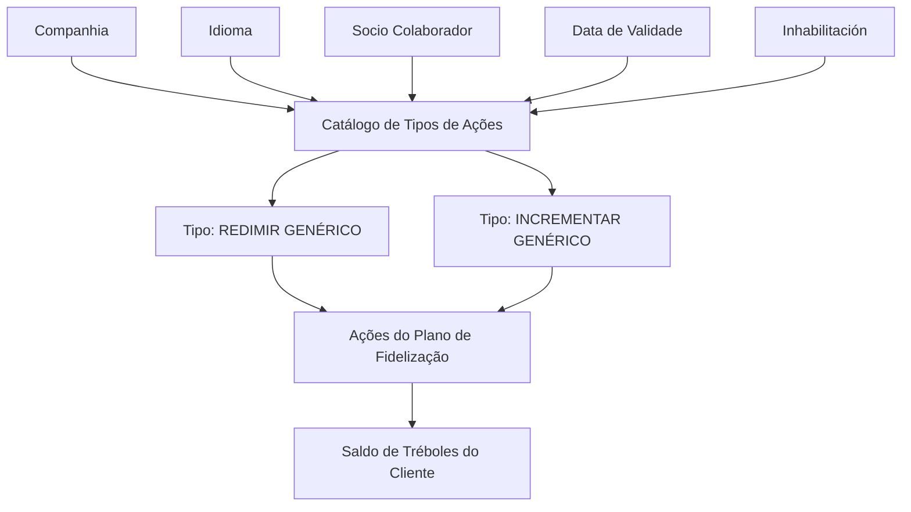

# Definição dos Tipos de Ações para Somar ou Subtrair Tréboles no Plano de Fidelização

## 1. Metadados do Documento
- **Arquivo de Origem:** Não identificado no conteúdo fornecido
- **Tipo de Documento:** Especificação Funcional
- **Domínio / Sistema:** Reef / Plano de Fidelização MAPFRE / Tréboles
- **Público-Alvo:** Analistas funcionais, configuradores, equipas de negócio e operação
- **Data/Versão Identificada:** Não identificada

---

## 2. Resumo Executivo & Contexto de Negócio

O documento define o catálogo de **Tipos de Ação** utilizado para classificar ações que incrementam ou resgatam o saldo de **Tréboles** de um cliente no contexto do Plano de Fidelização. O catálogo suporta a configuração de ações que somam ou subtraem Tréboles e permite associar cada definição a uma companhia, idioma e, opcionalmente, a um Socio Colaborador.

A classificação inclui, como exemplos, os tipos `1 — REDIMIR GENÉRICO` e `2 — INCREMENTAR GENÉRICO`. O documento não determina uma codificação obrigatória ou padronizada para os tipos de ação, mas atribui à entidade MAPFRE a responsabilidade de avaliar uma codificação transversal que facilite a exploração posterior das informações nos seus processos corporativos.

A propriedade de **Data de Validade** permite determinar desde quando uma definição de Tipo de Ação está disponível para utilização no sistema. Segundo o documento, a configuração adequada desta data permite manter histórico das alterações efetuadas nas definições, bem como rastrear e explorar posteriormente essas informações.

A propriedade de **Inhabilitación** impede que um Código de Tipo de Ação já definido seja utilizado na configuração de novas ações do Plano de Fidelização. O documento também recomenda a leitura das diretrizes e documentos funcionais relacionados, pois uma interpretação isolada pode causar erros.

---

## 3. Arquitetura, Componentes & Tecnologias Envolvidas

Os componentes funcionais explicitamente identificados são:

- **Reef:** ambiente/documentação onde o conteúdo está disponibilizado.
- **Plano de Fidelização:** contexto funcional no qual as ações são configuradas.
- **Catálogo de Tipos de Ações:** catálogo usado para classificar ações que alteram o saldo de Tréboles.
- **Ações do Plano de Fidelização:** configurações que utilizam os Tipos de Ação definidos.
- **Saldo de Tréboles do Cliente:** saldo incrementado ou resgatado pelas ações classificadas.
- **Companhia:** código da companhia sobre a qual ocorre a definição do Tipo de Ação.
- **Socio Colaborador:** entidade para a qual os Tipos de Ação podem ser personalizados.
- **Idioma:** chave do idioma usada na definição do Tipo de Ação.
- **Documentos relacionados:** “Acciones Plan de Fidelización” e “Socios Colaboradores del Plan de Fidelización”.



**Nota de Análise:** o documento não detalha interfaces técnicas, métodos HTTP, contratos JSON, bases de dados, tecnologias de implementação, integrações, servidores ou ambientes de execução.

---

## 4. Regras de Negócio, Especificações Funcionais & Processos

### 4.1. Finalidade do catálogo

O catálogo de Tipos de Ações permite definir e classificar ações que:

1. Incrementam o saldo de Tréboles de um cliente.
2. Resgatam ou reduzem o saldo de Tréboles de um cliente.

Os exemplos de classificação apresentados são:

- `1 — REDIMIR GENÉRICO`
- `2 — INCREMENTAR GENÉRICO`

O documento apresenta esses valores como exemplos de possíveis classificações; não afirma que sejam os únicos valores permitidos.

### 4.2. Associação à companhia

A propriedade **Compañía** contém o código da companhia sobre a qual está sendo realizada a definição do Tipo de Ação. Portanto, cada definição de Tipo de Ação é contextualizada para uma companhia identificada por código.

### 4.3. Descrição localizada do Tipo de Ação

A propriedade **Descripción del Tipo de Acción** contém a denominação ou descrição do Tipo de Ação conforme o idioma utilizado na definição. A descrição depende, portanto, da chave de idioma configurada.

### 4.4. Personalização para Socio Colaborador

A propriedade **Socio Colaborador** permite personalizar Tipos de Ação para que pertençam a um Socio Colaborador específico. O documento não especifica se a propriedade é obrigatória, nem define o comportamento para ações sem Socio Colaborador associado.

### 4.5. Idioma

A propriedade **Idioma** contém a chave do idioma empregada na definição das ações. Os exemplos apresentados são:

- Espanhol
- Inglês
- Turco

O documento não lista um catálogo completo de idiomas aceitos nem os códigos técnicos correspondentes.

### 4.6. Data de Validade e histórico

A propriedade **Fecha de Validez** estabelece a data a partir da qual a definição do Tipo de Ação fica disponível no sistema para utilização.

Uma configuração correta da Data de Validade permite:

1. Disponibilizar a definição no momento adequado.
2. Manter histórico das mudanças efetuadas nas definições.
3. Rastrear informações sobre alterações.
4. Explorar posteriormente o histórico de definições.

O documento não informa formato de data, fuso horário, regras para alteração retroativa, nem tratamento de sobreposição entre períodos de validade.

### 4.7. Inabilitação

A propriedade **Inhabilitación** estabelece que o Código do Tipo de Ação definido fica inabilitado para utilização na configuração de novas ações do Plano de Fidelização.

O documento não esclarece se a inabilitação afeta ações já existentes, históricos de saldo, resgates anteriores ou apenas a criação de novas configurações.

### 4.8. Codificação dos Tipos de Ação

Não existe preferência ou recomendação obrigatória para estabelecer ou padronizar a codificação dos Tipos de Ação no sistema.

Ainda assim, a entidade MAPFRE deve analisar a conveniência de usar transversalmente o catálogo de informações nos processos da companhia, visando exploração correta e posterior dos dados.

Os exemplos de estratégia de codificação apresentados são:

1. Agrupar e codificar Tipos de Ação conforme o respetivo uso nos processos da entidade.
2. Agrupar e codificar códigos por faixas.
3. Utilizar, por exemplo, os códigos de `0` a `50` para Socios Colaboradores que oferecem produtos.
4. Utilizar, por exemplo, os códigos de `51` a `100` para configurar Tipos de Ação de Socios Colaboradores que oferecem serviços.

Essas faixas são exemplos fornecidos pelo documento, não uma regra mandatória declarada.

### 4.9. Dependências documentais

O documento recomenda consultar as diretrizes e documentos funcionais relacionados para evitar erros de interpretação decorrentes da leitura isolada do conteúdo:

- **Acciones Plan de Fidelización**
- **Socios Colaboradores del Plan de Fidelización**

---

## 5. Tabelas de Parâmetros, Ambientes e Estruturas de Dados

| Item / Parâmetro | Descrição / Função | Tipo / Valores / Formato | Ambiente / Observações |
| :--- | :--- | :--- | :--- |
| Compañía | Contém o código da companhia sobre a qual é definida a ação. | Código de companhia; formato não detalhado. | Aplicável à definição do Tipo de Ação. |
| Tipo de Acción | Classifica ações que incrementam ou resgatam o saldo de Tréboles do cliente. | Exemplos: `1 — REDIMIR GENÉRICO`; `2 — INCREMENTAR GENÉRICO`. | O documento não informa catálogo completo ou obrigatoriedade dos exemplos. |
| Descripción del Tipo de Acción | Armazena a denominação ou descrição do Tipo de Ação. | Texto, de acordo com o idioma usado na definição. | Associada à propriedade Idioma. |
| Socio Colaborador | Permite personalizar Tipos de Ação para um Socio Colaborador específico. | Identificador não detalhado. | O documento não informa se o campo é obrigatório. |
| Idioma | Chave do idioma usado na definição das ações. | Exemplos: espanhol, inglês e turco. | Não há especificação de códigos técnicos de idioma. |
| Fecha de Validez | Define a data a partir da qual a definição do Tipo de Ação pode ser utilizada no sistema. | Data; formato não detalhado. | Suporta histórico, rastreabilidade e exploração posterior das alterações. |
| Inhabilitación | Impede que o Código do Tipo de Ação seja utilizado na configuração de novas ações do Plano de Fidelização. | Estado de inabilitação; valores não detalhados. | O impacto sobre ações existentes não é especificado. |
| Faixa de códigos `0–50` | Exemplo de agrupamento para códigos de Socios Colaboradores que oferecem produtos. | Faixa numérica exemplificativa. | Não é uma padronização obrigatória. |
| Faixa de códigos `51–100` | Exemplo de agrupamento para Tipos de Ação de Socios Colaboradores que oferecem serviços. | Faixa numérica exemplificativa. | Não é uma padronização obrigatória. |
| Documento relacionado | “Acciones Plan de Fidelización”. | Documento funcional relacionado. | Leitura recomendada. |
| Documento relacionado | “Socios Colaboradores del Plan de Fidelización”. | Documento funcional relacionado. | Leitura recomendada. |

---

## 6. Bateria de Perguntas & Respostas para RAG (FAQ Sintético)

### P1: Qual é a finalidade do catálogo de Tipos de Ações no Plano de Fidelização?
**R:** O catálogo de Tipos de Ações classifica ações que incrementam ou resgatam o saldo de Tréboles de um cliente. O documento apresenta como exemplos os tipos `1 — REDIMIR GENÉRICO` e `2 — INCREMENTAR GENÉRICO`.

### P2: O que representa a propriedade Compañía na definição de um Tipo de Ação?
**R:** A propriedade Compañía contém o código da companhia sobre a qual está sendo realizada a definição do Tipo de Ação. O documento não especifica o formato técnico desse código.

### P3: Quais são os exemplos de Tipos de Ação apresentados para movimentar Tréboles?
**R:** O documento apresenta `1 — REDIMIR GENÉRICO` como exemplo de Tipo de Ação para resgatar saldo de Tréboles e `2 — INCREMENTAR GENÉRICO` como exemplo de Tipo de Ação para aumentar o saldo de Tréboles. Não é informado que esses sejam os únicos tipos permitidos.

### P4: Como a descrição de um Tipo de Ação é relacionada ao idioma?
**R:** A propriedade Descripción del Tipo de Acción contém a denominação ou descrição do Tipo de Ação de acordo com o idioma usado na definição. A propriedade Idioma é a chave do idioma empregada nessa definição, com exemplos como espanhol, inglês e turco.

### P5: Para que serve a propriedade Socio Colaborador?
**R:** A propriedade Socio Colaborador permite personalizar Tipos de Ação para que pertençam a um Socio Colaborador em particular. O documento não define o identificador utilizado nem informa se a associação é obrigatória.

### P6: Quando um Tipo de Ação se torna disponível para uso no sistema?
**R:** Um Tipo de Ação fica disponível a partir da data configurada na propriedade Fecha de Validez. A correta configuração dessa propriedade também permite manter histórico das alterações, rastrear mudanças e explorar posteriormente essas informações.

### P7: O que acontece quando um Código de Tipo de Ação é inabilitado?
**R:** A propriedade Inhabilitación estabelece que o Código do Tipo de Ação definido não pode ser usado na configuração de novas ações do Plano de Fidelização. O documento não detalha o efeito da inabilitação sobre ações já configuradas ou dados históricos.

### P8: Existe uma regra obrigatória de codificação para os Tipos de Ação?
**R:** Não. O documento afirma que não existe preferência nem recomendação para estabelecer ou padronizar a codificação no sistema. Entretanto, a entidade MAPFRE deve avaliar o uso transversal do catálogo nos seus processos para permitir exploração adequada das informações.

### P9: Quais exemplos de agrupamento de códigos são sugeridos para Socios Colaboradores?
**R:** O documento apresenta como exemplo a utilização dos códigos de `0` a `50` para Socios Colaboradores que oferecem produtos e dos códigos de `51` a `100` para Tipos de Ação de Socios Colaboradores que oferecem serviços. Essas faixas são exemplificativas, não obrigatórias.

### P10: Quais documentos devem ser consultados junto com a definição de Tipos de Ação?
**R:** O documento recomenda a leitura de “Acciones Plan de Fidelización” e “Socios Colaboradores del Plan de Fidelización”. A recomendação existe para evitar que a interpretação isolada do documento de Tipos de Ação conduza a erros.

---

## 7. Glossário de Termos, Siglas & Conceitos-Chave

- **Reef:** contexto de documentação no qual o conteúdo é apresentado.
- **MAPFRE:** entidade mencionada como responsável por analisar a conveniência de utilização transversal do catálogo nos processos da companhia.
- **Plano de Fidelização:** contexto funcional onde são configuradas ações relacionadas ao saldo de Tréboles.
- **Tréboles:** saldo do cliente que pode ser incrementado ou resgatado por ações classificadas no catálogo.
- **Tipo de Acción:** classificação de ações que incrementam ou resgatam o saldo de Tréboles.
- **REDIMIR GENÉRICO:** exemplo de Tipo de Ação associado ao resgate do saldo de Tréboles.
- **INCREMENTAR GENÉRICO:** exemplo de Tipo de Ação associado ao incremento do saldo de Tréboles.
- **Compañía:** propriedade que contém o código da companhia sobre a qual é realizada a definição do Tipo de Ação.
- **Socio Colaborador:** propriedade que permite personalizar Tipos de Ação para um parceiro colaborador específico.
- **Fecha de Validez:** data a partir da qual a definição de Tipo de Ação fica disponível para utilização.
- **Inhabilitación:** propriedade que impede o uso de um Código de Tipo de Ação na configuração de novas ações.
- **Acciones Plan de Fidelización:** documento funcional relacionado, recomendado para leitura.
- **Socios Colaboradores del Plan de Fidelización:** documento funcional relacionado, recomendado para leitura.

---

## 8. Notas Críticas, Riscos & Limitações

- O documento não descreve tecnologias, integrações, contratos de API, bancos de dados, servidores, URLs, credenciais, fluxos de aprovação ou mecanismos técnicos de implementação.
- O documento não define o formato técnico do código de companhia, identificador de Socio Colaborador, chave de idioma ou data de validade.
- O documento não esclarece o comportamento de uma definição inabilitada sobre ações já existentes, transações históricas ou saldo de Tréboles previamente movimentado.
- As faixas de códigos `0–50` e `51–100` são apresentadas como exemplos de organização; não devem ser interpretadas como padrão obrigatório.
- A ausência de uma recomendação de padronização de códigos pode gerar classificações inconsistentes entre processos da entidade MAPFRE caso não seja adotada uma governança transversal.
- A leitura isolada do documento pode conduzir a erro; a própria documentação recomenda consultar “Acciones Plan de Fidelización” e “Socios Colaboradores del Plan de Fidelización”.
- **Nota de Análise:** o documento lista propriedades funcionais do catálogo, mas não detalha permissões de manutenção, regras de unicidade, obrigatoriedade de campos ou validações de consistência entre Companhia, Idioma e Socio Colaborador.

---

## 9. Conteúdo Bruto Estruturado (Referência Fiel)

```text
--- [PÁGINA 1 DE 2] ---

DEFINICIÓN de los TIPOS de ACCIONES que permiten Sumar/Restar
TRÉBOLES
Objetivo
Propiedades
Otras Propiedades
Propiedades
Compañía
Este Atributo del catálogo contiene el código de la compañía sobre la que se está realizando la denición del tipo de Acción.
Tipo de Acción
Esta Propiedad permite clasicar las acciones que incrementan o redimen el saldo de tréboles del Cliente, siendo por ejemplo sus posibles
valores:
TIPO DESCRIPCIÓN
1 REDIMIR GENÉRICO
2 INCREMENTAR GENÉRICO
Descripción del Tipo de Acción
Esta propiedad contiene la denominación o descripción del Tipo de Acción, de acuerdo con el idioma utilizado en la denición.
Socio Colaborador
Este atributo permite personalizar los Tipos de acciones para que pertenezcan a un Socio Colaborador en particular.
Idioma
Esta propiedad es la clave del Idioma empleado en la denición de las acciones, como por ejemplo: español, inglés, turco, ...
Otras Propiedades
Fecha de Validez
Documentation / DOCUMENTACIÓN Reef
DOCUMENTACIÓN Reef
Mapfredocument
DOCUMENTACIÓN Reef
Owner
user:agonzalez_mapfre.com
Lifecycle
Approved Source
 /
VL
Buscar Inicio Soluciones Arquitecturas APIs Componentes Cloud Documentación Zeus Reef Ayuda
ES


--- [PÁGINA 2 DE 2] ---

Esta propiedad establece la fecha a partir de la cual la denición del tipo de acción está disponible en el sistema para ser utilizada, por lo que
una correcta conguración habilita tener un histórico de los cambios efectuados en las deniciones y poder así trazar y explotar
posteriormente esta información.
Inhabilitación
Esta propiedad establece que el Código del Tipo de Acción denido está inhabilitado para poder ser empleado en la conguración de nuevas
acciones del Plan de Fidelización.
Vínculos
Relación de Directrices y Documentos funcionales cuya lectura recomendada para evitar que la interpretación aislada del presente
documento pueda conducir a error.
Acciones Plan de Fidelización
Socios Colaboradores del Plan de Fidelización
Preguntas frecuentes
(1) ¿Existe alguna recomendación operativa que deba ser tomada en consideración localmente en la codicación, uso y denición del
catálogo de Tipos de Acciones para Sumar o Restar Tréboles?
No existe una preferencia ni recomendación para establecer o estandarizar en el sistema su codicación, si bien la entidad MAPFRE debe
analizar la conveniencia de utilizar transversalmente en los procesos de la compañía este catálogo de información para su correcta y
posterior explotación, e.g:
Agrupando y codicando los tipos de las diferentes Acciones de acuerdo a su uso en los procesos de la entidad
Agrupando y codicando los códigos por tramos, e.g: del 0 al 50 para códigos de Socios Colaboradores que oferten productos, del 51 al
100 para congurar tipos de acciones de socios colaboradores que oferten servicios,...
```
