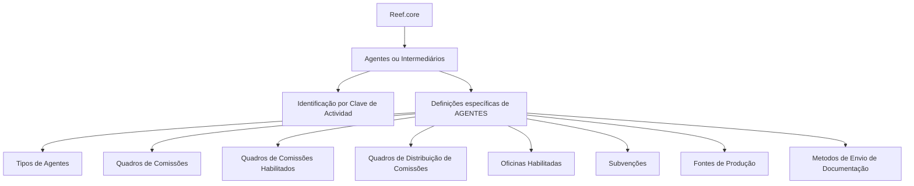

# Configuração de Agentes ou Intermediários no Reef.core

## 1. Metadados do Documento
- **Arquivo de Origem:** Não identificado
- **Tipo de Documento:** Procedimento
- **Domínio / Sistema:** Reef.core / Reef
- **Público-Alvo:** Não identificado
- **Data/Versão Identificada:** Não identificada

---

## 2. Resumo Executivo & Contexto de Negócio

O documento descreve a definição e a configuração de **Agentes ou Intermediários** no sistema **Reef.core**. O objetivo declarado é relacionar os elementos necessários para configurar Agentes e indicar a ordem em que essa definição deve ser realizada, permitindo a operação posterior desses terceiros no sistema.

No Reef.core, os Agentes são identificados pela **Clave de Actividad**. O conteúdo destaca que a configuração dos elementos possui caráter obrigatório ou opcional, indicado por asteriscos nas respectivas “Tarjetas”.

O documento separa definições específicas aplicáveis exclusivamente a terceiros classificados como **AGENTES**. Essas definições incluem tipos de agentes, quadros de comissões, distribuição de comissões, escritórios habilitados, subvenções, fontes de produção e métodos de envio de documentação.

Não há detalhamento adicional sobre telas, métodos de configuração, valores permitidos, contratos técnicos, integrações, perfis de acesso ou critérios de validação para os elementos listados.

---

## 3. Arquitetura, Componentes & Tecnologias Envolvidas

Os componentes e referências identificados no conteúdo são:

- **Reef.core:** sistema no qual os Agentes ou Intermediários são configurados e posteriormente operados.
- **Agentes / Intermediários:** terceiros sujeitos às definições específicas descritas.
- **Clave de Actividad:** elemento usado pelo Reef.core para identificar Agentes.
- **Estrutura comercial:** origem das oficinas habilitadas para contratação de pólizas.
- **Estrutura de canais:** origem das fontes de produção habilitadas para o agente.
- **Mapfredocument:** nome citado no rodapé ou área de documentação.
- **DOCUMENTACIÓN Reef:** área ou referência documental citada.
- **Owner:** `user:agonzalez_mapfre.com`
- **Lifecycle:** `Approved`
- **Source:** `/`
- **VL:** termo citado sem expansão ou contexto adicional.

O documento afirma que existe uma ordem para realizar a definição dos elementos de Agentes, mas não apresenta explicitamente essa sequência. O diagrama abaixo representa somente a relação informada entre Reef.core, Agentes e as definições específicas.



> **Nota de Análise:** o documento não detalha a implementação técnica do Reef.core, APIs, banco de dados, integrações, tecnologias de infraestrutura ou contratos de dados.

---

## 4. Regras de Negócio, Especificações Funcionais & Processos

1. A configuração de Agentes ou Intermediários no Reef.core exige a definição dos elementos relacionados no documento.
2. O documento informa que a definição desses elementos deve seguir uma ordem para que os Agentes possam operar posteriormente no sistema.
3. A ordem efetiva de configuração não é apresentada no conteúdo extraído.
4. O Reef.core identifica os Agentes pela **Clave de Actividad**.
5. Os asteriscos exibidos nas Tarjetas indicam se a configuração de determinado elemento é obrigatória ou não para a definição de Agentes.
6. As definições apresentadas pertencem ao grupo de configurações específicas de terceiros AGENTES.
7. Os tipos de agentes devem ser configurados.
8. Os quadros de comissões devem ser configurados.
9. Os quadros de comissões habilitados devem ser configurados para cada agente.
10. Os quadros de distribuição de comissões habilitados devem ser configurados para cada agente.
11. As oficinas da estrutura comercial nas quais o agente pode contratar pólizas devem ser configuradas.
12. As subvenções concedidas aos agentes devem ser configuradas.
13. As fontes de produção da estrutura de canais habilitadas para o agente devem ser configuradas.
14. Os métodos de envio de documentação habilitados para o agente devem ser configurados.

> **Nota de Análise:** o documento não especifica quais elementos possuem asterisco, quais são obrigatórios, quais valores são válidos, nem as condições de aprovação, bloqueio ou exclusão de uma configuração de Agente.

---

## 5. Tabelas de Parâmetros, Ambientes e Estruturas de Dados

| Item / Parâmetro | Descrição / Função | Tipo / Valores / Formato | Ambiente / Observações |
| :--- | :--- | :--- | :--- |
| Reef.core | Sistema que permite configurar e operar Agentes ou Intermediários. | Sistema | Não são informados ambientes. |
| Agente / Intermediário | Terceiro configurado no Reef.core. | Entidade de negócio | O documento trata Agente e Intermediário como termos relacionados. |
| Clave de Actividad | Identificador usado pelo Reef.core para identificar Agentes. | Chave de identificação | Formato e valores não detalhados. |
| Asteriscos das Tarjetas | Indicam se a configuração de um elemento é obrigatória para a definição de Agentes. | Indicador visual | O documento não informa quais Tarjetas possuem asterisco. |
| Tipos de Agentes | Configuração dos tipos de Agentes. | Configuração | Valores e critérios não detalhados. |
| Quadros de Comissões | Configuração dos quadros de comissões. | Configuração | Regras de cálculo e estruturas não detalhadas. |
| Quadros de Comissões Habilitados | Configuração dos quadros de comissões habilitados para o agente. | Configuração por agente | Critérios de habilitação não detalhados. |
| Quadros de Distribuição de Comissões | Configuração dos quadros de distribuição de comissões habilitados para o agente. | Configuração por agente | Método de distribuição não detalhado. |
| Oficinas Habilitadas | Configuração das oficinas da estrutura comercial onde o agente pode contratar pólizas. | Configuração por agente | Lista de oficinas e regras de contratação não detalhadas. |
| Subvenções | Configuração das subvenções concedidas aos agentes. | Configuração por agente | Valores, elegibilidade e vigência não detalhados. |
| Fontes de Produção | Configuração das fontes de produção da estrutura de canais habilitadas para o agente. | Configuração por agente | Lista de fontes e regras não detalhadas. |
| Métodos de Envio de Documentação | Configuração dos métodos de envio de documentação habilitados para o agente. | Configuração por agente | Métodos, canais e formatos não detalhados. |
| Owner | Proprietário indicado no rodapé documental. | Identificador de usuário | `user:agonzalez_mapfre.com` |
| Lifecycle | Estado de ciclo de vida indicado no rodapé documental. | Estado | `Approved` |
| Source | Origem indicada no rodapé documental. | Caminho | `/` |
| VL | Termo exibido no rodapé documental. | Não identificado | O significado não é informado. |

---

## 6. Bateria de Perguntas & Respostas para RAG (FAQ Sintético)

### P1: Qual é o objetivo da definição de Agentes no Reef.core?
**R:** O objetivo é configurar os elementos necessários para Agentes ou Intermediários no Reef.core, seguindo uma ordem de definição mencionada no documento, para que esses Agentes possam operar posteriormente no sistema.

### P2: Como o Reef.core identifica um Agente?
**R:** O Reef.core identifica os Agentes pela **Clave de Actividad**. O documento não informa o formato, os valores possíveis ou a origem dessa chave.

### P3: O que os asteriscos nas Tarjetas indicam na configuração de Agentes?
**R:** Os asteriscos nas Tarjetas indicam se a configuração de determinado elemento é obrigatória ou não em relação à definição de Agentes. O documento não especifica quais elementos são obrigatórios.

### P4: Quais definições são específicas para terceiros classificados como AGENTES?
**R:** As definições específicas incluem Tipos de Agentes, Quadros de Comissões, Quadros de Comissões Habilitados, Quadros de Distribuição de Comissões, Oficinas Habilitadas, Subvenções, Fontes de Produção e Métodos de Envio de Documentação.

### P5: O que são os Quadros de Comissões Habilitados?
**R:** São configurações dos quadros de comissões habilitados para um agente. O documento não detalha regras de cálculo, critérios de habilitação ou valores de comissão.

### P6: Qual é a finalidade das Oficinas Habilitadas para um agente?
**R:** As Oficinas Habilitadas configuram as oficinas da estrutura comercial nas quais o agente pode contratar pólizas. O documento não lista as oficinas nem explica as regras de autorização.

### P7: Como as Fontes de Produção são usadas na configuração do agente?
**R:** As Fontes de Produção configuram as fontes de produção da estrutura de canais que estão habilitadas para o agente. O conteúdo não informa tipos de fontes, relacionamentos ou validações.

### P8: O documento descreve métodos específicos de envio de documentação?
**R:** Não. O documento apenas informa que devem ser configurados os métodos de envio de documentação habilitados para o agente, sem listar os métodos, canais ou formatos documentais.

### P9: A sequência de configuração dos elementos de Agentes está documentada?
**R:** Não. O documento afirma que há uma ordem na qual a definição deve ser realizada, mas a sequência concreta não está presente no conteúdo extraído.

### P10: Existem detalhes de APIs, métodos HTTP ou contratos JSON para Agentes no Reef.core?
**R:** Não. O documento não descreve APIs, métodos HTTP, contratos JSON, bancos de dados ou integrações técnicas relacionadas à configuração de Agentes.

---

## 7. Glossário de Termos, Siglas & Conceitos-Chave

- **Agente:** terceiro configurado no Reef.core, identificado pela Clave de Actividad.
- **Intermediário:** termo citado em conjunto com Agente para designar o terceiro sujeito à configuração no Reef.core.
- **Clave de Actividad:** chave usada pelo Reef.core para identificar Agentes.
- **Oficinas Habilitadas:** oficinas da estrutura comercial nas quais o agente pode contratar pólizas.
- **Fontes de Produção:** fontes de produção da estrutura de canais habilitadas para o agente.
- **Quadros de Comissões:** configurações de comissões citadas para Agentes.
- **Quadros de Distribuição de Comissões:** configurações de distribuição de comissões habilitadas para o agente.
- **Subvenções:** configurações referentes a subvenções concedidas aos agentes.
- **Tarjetas:** elementos visuais cuja marcação por asterisco indica obrigatoriedade ou não de configuração.
- **Lifecycle:** campo de ciclo de vida exibido como `Approved`.
- **VL:** termo citado no rodapé do documento sem definição apresentada.

---

## 8. Notas Críticas, Riscos & Limitações

- O documento informa a existência de uma ordem de configuração, mas não fornece essa ordem.
- Não são identificados os elementos obrigatórios, apesar de o documento informar que a obrigatoriedade é indicada por asteriscos nas Tarjetas.
- Não há valores, formatos, regras de validação, vigências ou critérios de elegibilidade para tipos de Agentes, comissões, subvenções, oficinas, fontes de produção ou métodos de envio.
- Não há especificação de APIs, interfaces, integrações, modelos de dados, permissões, logs, URLs ou ambientes.
- Não há detalhamento sobre o significado de `VL`, do caminho de origem `/` ou sobre a relação operacional com `Mapfredocument`.
- O conteúdo aparenta ser uma visão resumida de configurações funcionais; portanto, não é suficiente para implementação técnica ou operação sem documentação complementar.

---

## 9. Conteúdo Bruto Estruturado (Referência Fiel)

```text
--- [PÁGINA 1 DE 1] ---

DEFINICIÓN de los AGENTES
Se relacionan los elementos que permiten congurar en Reef.core a los Agentes o Intermediarios (así como el orden en el que esta denición
se debe realizar) para poder operar posteriormente con ellos en el Sistema.
Reef.core identica a los Agentes con la Clave de Actividad... 2.
Los Asteriscos de las Tarjetas indican si la conguración del elemento es o no obligatoria en relación con la denición de los Agentes.
Deniciones ESPECÍFICAS, propias de los Terceros AGENTES
En este Grupo se encuentran deniciones que se emplean exclusivamente cuando el Tercero es un AGENTE.
TIPOS DE Agentes
Conguración de los tipos de Agentes.
CUADROS DE COMISIONES
Conguración de los cuadros de
comisiones.
CUADROS DE COMISIONES HABILITADOS
Conguración de los cuadros de
comisiones habilitados para el agente.
CUADROS DE DISTRIBUCIÓN DE
COMISIONES
Conguración de los cuadros de
distribución de comisiones habilitados
para el agente.
OFICINAS HABILITADAS
Conguración de las ocinas de la
estructura comercial en las que el agente
puede contratar pólizas.
SUBVENCIONES
Conguración de las subvenciones
concedidas a los agentes.
FUENTES DE PRODUCCIÓN
Conguración de las fuentes de
producción de la estructura de canales
habilitadas para el agente.
MÉTODOS DE ENVÍO de Documentación
Conguración de los métodos de envío de
Documentación habilitados para el
agente.
Documentation / DOCUMENTACIÓN Reef
DOCUMENTACIÓN Reef
Mapfredocument
DOCUMENTACIÓN Reef
Owner
user:agonzalez_mapfre.com
Lifecycle
Approved Source
 /
 VL
Buscar Inicio Soluciones Arquitecturas APIs Componentes Cloud Documentación Zeus Reef Ayuda
ES
```
