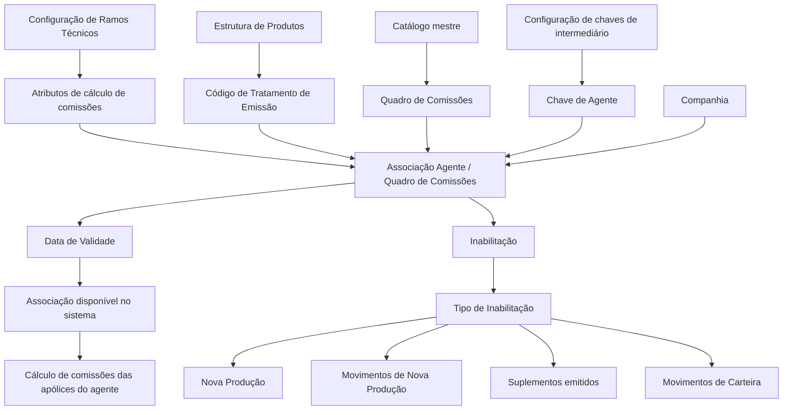

# Definição dos Quadros de Comissões de um Agente — Documentação Reef / MAPFRE

## 1. Metadados do Documento
- **Arquivo de Origem:** Não identificado no conteúdo extraído
- **Tipo de Documento:** Especificação Funcional
- **Domínio / Sistema:** Reef / MAPFRE — configuração de comissões de agentes
- **Público-Alvo:** Negócio, analistas funcionais, configuração de produtos, operação e desenvolvimento
- **Data/Versão Identificada:** Não identificada
- **Proprietário identificado:** `user:agonzalez_mapfre.com`
- **Lifecycle identificado:** Approved Source

---

## 2. Resumo Executivo & Contexto de Negócio

O documento descreve a definição e a associação de **Quadros de Comissões** aos agentes no sistema Reef. O objetivo central é atribuir ao agente uma ou mais chaves de quadros de comissões que podem ser utilizadas no cálculo das comissões das apólices desse agente.

A associação entre agente e quadro de comissões depende de atributos configurados nos **Ramos Técnicos** e inclui informações de companhia, chave de agente, código de tratamento de emissão, quadro de comissões, inabilitação, tipo de inabilitação e data de validade.

A configuração permite controlar se uma chave de quadro de comissões está disponível para utilização no sistema. O campo de data de validade permite manter histórico das alterações realizadas nas definições configuradas, disponibilizando a associação a partir de uma data determinada.

O documento diferencia explicitamente **Quadro de Comissões** de **Quadro de Distribuição de Comissões**. Também apresenta a distinção entre comissões de nova produção, relativas exclusivamente ao primeiro ano de vigência da apólice, e comissões de carteira, relacionadas a apólices vigentes em anos sucessivos.

---

## 3. Arquitetura, Componentes & Tecnologias Envolvidas

### Componentes e conceitos identificados

| Componente / Conceito | Função descrita |
| :--- | :--- |
| Reef | Sistema/documentação onde é configurada a associação entre agentes e quadros de comissões. |
| MAPFRE | Entidade que deve analisar a melhor forma de utilizar transversalmente o catálogo de informações de chaves. |
| Agente | Intermediário ao qual são associadas chaves de quadros de comissões. |
| Quadro de Comissões | Catálogo mestre previamente definido, identificado por uma chave e utilizado no cálculo de comissões de apólices. |
| Código de Tratamento de Emissão | Chave de tratamento de emissão configurada na estrutura de produtos da entidade. |
| Ramos Técnicos | Configuração que especifica os atributos de cálculo de comissões. |
| Estrutura de Produtos | Documento/processo relacionado, recomendado para leitura complementar. |
| Configuração de Ramos | Documento/processo relacionado, recomendado para leitura complementar. |
| Atividades de Terceiros | Documento/processo relacionado, recomendado para leitura complementar. |
| Nova Produção | Comissões percebidas exclusivamente durante o primeiro ano de vigência da apólice. |
| Carteira | Comissões decorrentes de apólices vigentes em anos sucessivos. |
| Movimentos de Carteira | Movimentos relacionados a apólices de carteira; podem ser impactados conforme o tipo de inabilitação. |
| Suplementos | Emissões sobre apólices de nova produção que podem ser afetadas pela inabilitação, dependendo da configuração. |

### Fluxo funcional reconstruído



> **Nota de Análise:** O conteúdo não detalha métodos HTTP, contratos JSON, bancos de dados, tecnologias de infraestrutura, ambientes, integrações técnicas ou interfaces de usuário.

---

## 4. Regras de Negócio, Especificações Funcionais & Processos

### 4.1 Objetivo da associação de comissões

A associação Agente/Quadro de Comissões deve atribuir e relacionar aos agentes a(s) chave(s) dos quadros de comissões que podem ser usadas no cálculo das comissões das apólices de um agente específico.

A utilização do quadro de comissões deve respeitar a definição dos atributos de cálculo de comissões especificados na configuração dos Ramos Técnicos.

### 4.2 Regras de identificação da associação

A associação entre um agente e um quadro de comissões é composta pelos seguintes elementos:

1. **Companhia:** identifica o código da companhia na qual o quadro de comissões está sendo associado ao agente.
2. **Chave de Agente:** identifica a chave do intermediário segundo configuração previamente estabelecida.
3. **Código de Tratamento de Emissão:** identifica a chave de tratamento de emissão configurada na estrutura de produtos da entidade.
4. **Quadro de Comissões:** identifica a chave do quadro de comissões previamente definido no catálogo mestre.

### 4.3 Regras de disponibilidade e histórico

A **Data de Validade** determina a data a partir da qual a associação Agente/Quadro de Comissões fica disponível no sistema para uso.

O uso correto da Data de Validade permite manter um histórico das alterações realizadas nas definições configuradas.

### 4.4 Regras de inabilitação

A propriedade **Inabilitação** estabelece que a chave do Quadro de Comissões está inabilitada para utilização no sistema.

A propriedade **Tipo de Inabilitação** define o escopo do impacto da inabilitação do Quadro de Comissões:

- A inabilitação pode afetar somente as apólices de **Nova Produção**.
- A inabilitação pode afetar os movimentos de Nova Produção e os suplementos emitidos sobre essas apólices.
- A inabilitação pode também afetar os **Movimentos de Carteira**.

> **Nota de Análise:** O texto não apresenta valores codificados, enumerações técnicas, precedência entre tipos de inabilitação ou regras de resolução de conflitos entre múltiplos quadros de comissões associados ao mesmo agente.

### 4.5 Recomendação operacional para chaves

O documento recomenda como prática operacional utilizar as descrições das chaves definidas para apresentar informações adicionais.

A entidade MAPFRE deve analisar a melhor maneira de utilizar transversalmente esse catálogo de informações nos processos da companhia, contemplando sua definição correta e sua exploração posterior.

### 4.6 Distinções conceituais obrigatórias

- Um **Quadro de Comissões** não deve ser confundido com um **Quadro de Distribuição de Comissões**.
- As comissões de **Nova Produção** são percebidas exclusivamente durante o primeiro ano de vigência da apólice.
- As comissões de **Carteira** têm origem na carteira do recebedor, isto é, em apólices vigentes em anos sucessivos.
- As comissões de carteira existem enquanto permanecerem vigentes as apólices subscritas por meio da gestão comercial do agente.
- As comissões de nova produção geralmente possuem valor superior ao das comissões de carteira, para estimular a captação de novas operações.

---

## 5. Tabelas de Parâmetros, Ambientes e Estruturas de Dados

### 5.1 Propriedades gerais da associação Agente/Quadro de Comissões

| Item / Parâmetro | Descrição / Função | Tipo / Valores / Formato | Ambiente / Observações |
| :--- | :--- | :--- | :--- |
| Companhia | Contém o código da companhia na qual o quadro de comissões é associado ao agente. | Código de companhia; formato não detalhado. | Aplicável à associação Agente/Quadro de Comissões. |
| Chave de Agente | Identifica a chave do intermediário conforme configuração previamente estabelecida. | Chave de intermediário; formato não detalhado. | O agente é tratado como intermediário no documento. |
| Código de Tratamento de Emissão | Identifica a chave do tratamento de emissão. | Chave configurada; formato não detalhado. | Configurado na estrutura de produtos da entidade. |
| Quadro de Comissões | Identifica a chave do quadro de comissões. | Chave de catálogo; formato não detalhado. | Deve estar previamente definido no catálogo mestre. |
| Inabilitação | Define que a chave do quadro de comissões está inabilitada para uso no sistema. | Propriedade de estado; valores não detalhados. | Afeta a utilização da chave no sistema. |
| Tipo de Inabilitação | Define o escopo das apólices e movimentos afetados pela inabilitação. | Nova Produção; movimentos de Nova Produção; suplementos; movimentos de Carteira. | O documento não informa codificação ou combinações válidas. |
| Data de Validade | Determina a partir de quando a associação fica disponível para uso. | Data; formato não detalhado. | Permite histórico das alterações de configuração. |

### 5.2 Escopo temporal das comissões

| Tipo de Comissão | Momento / Período | Característica descrita | Observações |
| :--- | :--- | :--- | :--- |
| Comissão de Nova Produção | Exclusivamente durante o primeiro ano de vigência da apólice. | Usada para distinguir a comissão de nova produção da comissão de carteira. | Geralmente possui valor mais elevado para estimular a captação de novas operações. |
| Comissão de Carteira | Anos sucessivos de vigência das apólices. | Origina-se da carteira de quem recebe a comissão. | Existe enquanto as apólices subscritas por meio da gestão comercial do agente permanecerem vigentes. |

### 5.3 Documentos e vínculos recomendados

| Documento / Vínculo | Finalidade indicada |
| :--- | :--- |
| Estrutura de Produtos | Leitura recomendada para evitar interpretação isolada e incorreta do presente documento. |
| Configuração de Ramos | Leitura recomendada para evitar interpretação isolada e incorreta do presente documento. |
| Atividades de Terceiros | Leitura recomendada para evitar interpretação isolada e incorreta do presente documento. |

---

## 6. Bateria de Perguntas & Respostas para RAG (FAQ Sintético)

### P1: Qual é o objetivo da associação entre agente e quadro de comissões no Reef?
**R:** O objetivo é atribuir e associar aos agentes uma ou mais chaves de Quadros de Comissões que podem ser utilizadas no cálculo das comissões das apólices de um agente específico. A utilização deve respeitar os atributos de cálculo de comissões definidos na configuração dos Ramos Técnicos.

### P2: Quais dados identificam uma associação Agente/Quadro de Comissões?
**R:** A associação é identificada por Companhia, Chave de Agente, Código de Tratamento de Emissão e Quadro de Comissões. A Companhia informa a entidade onde ocorre a associação; a Chave de Agente identifica o intermediário; o Código de Tratamento de Emissão vem da estrutura de produtos; e o Quadro de Comissões corresponde a uma chave previamente definida no catálogo mestre.

### P3: Qual é a função da Data de Validade na associação de comissões?
**R:** A Data de Validade estabelece a partir de qual data a associação entre Agente e Quadro de Comissões fica disponível no sistema para utilização. O uso correto dessa data permite manter histórico das alterações realizadas nas definições configuradas.

### P4: O que acontece quando um Quadro de Comissões está inabilitado?
**R:** A propriedade Inabilitação estabelece que a chave do Quadro de Comissões está inabilitada para utilização no sistema. O impacto operacional específico depende da configuração do Tipo de Inabilitação.

### P5: Qual é o papel do Tipo de Inabilitação?
**R:** O Tipo de Inabilitação determina se a inabilitação do Quadro de Comissões afeta somente apólices de Nova Produção ou se também afeta movimentos de Nova Produção, suplementos emitidos sobre essas apólices e Movimentos de Carteira.

### P6: Qual é a diferença entre comissão de Nova Produção e comissão de Carteira?
**R:** A comissão de Nova Produção é percebida exclusivamente durante o primeiro ano de vigência da apólice. A comissão de Carteira é percebida em função de apólices vigentes em anos sucessivos e existe enquanto estiverem vigentes as apólices obtidas por meio da gestão comercial do agente.

### P7: Por que as comissões de Nova Produção geralmente são mais elevadas?
**R:** O documento informa que as comissões de Nova Produção geralmente são de valor mais elevado que as comissões de Carteira para estimular a atividade de captação de novas operações.

### P8: Um Quadro de Comissões é igual a um Quadro de Distribuição de Comissões?
**R:** Não. O documento estabelece expressamente que não se deve confundir um Quadro de Comissões com um Quadro de Distribuição de Comissões, sem apresentar uma definição adicional para o Quadro de Distribuição de Comissões.

### P9: De onde vem o Código de Tratamento de Emissão usado na associação?
**R:** O Código de Tratamento de Emissão identifica no sistema a chave do tratamento de emissão configurado na estrutura de produtos da entidade.

### P10: Onde deve estar definido o Quadro de Comissões antes de ser associado a um agente?
**R:** O Quadro de Comissões deve estar previamente definido no catálogo mestre. A associação usa a chave desse quadro de comissões como um dos seus atributos de identificação.

### P11: Qual prática operacional é recomendada para as descrições das chaves?
**R:** A prática recomendada é utilizar as descrições das chaves definidas para mostrar informações adicionais. A entidade MAPFRE deve avaliar como usar transversalmente esse catálogo de informações nos processos corporativos, considerando sua definição e exploração posterior.

### P12: Quais leituras complementares são recomendadas?
**R:** São recomendadas as leituras de Estrutura de Produtos, Configuração de Ramos e Atividades de Terceiros. Esses documentos são indicados para reduzir o risco de uma interpretação isolada e incorreta da documentação sobre Quadros de Comissões de um Agente.

---

## 7. Glossário de Termos, Siglas & Conceitos-Chave

- **Agente:** Entidade à qual são associadas chaves de Quadros de Comissões para cálculo das comissões de suas apólices.
- **Catálogo Mestre:** Catálogo no qual o Quadro de Comissões deve estar previamente definido.
- **Chave de Agente:** Propriedade que identifica a chave do intermediário conforme configuração anterior.
- **Código de Tratamento de Emissão:** Chave que identifica o tratamento de emissão configurado na estrutura de produtos da entidade.
- **Comissão de Carteira:** Comissão relacionada a apólices vigentes em anos sucessivos, existente enquanto as apólices originadas pela gestão comercial do agente permanecerem vigentes.
- **Comissão de Nova Produção:** Comissão percebida exclusivamente durante o primeiro ano de vigência da apólice.
- **Inabilitação:** Propriedade que torna uma chave de Quadro de Comissões indisponível para utilização no sistema.
- **MAPFRE:** Entidade mencionada como responsável por analisar o uso transversal do catálogo de informações das chaves.
- **Movimentos de Carteira:** Movimentos relacionados à carteira que podem ser afetados pela inabilitação do Quadro de Comissões.
- **Quadro de Comissões:** Chave previamente definida no catálogo mestre, associada ao agente e utilizada no cálculo de comissões.
- **Quadro de Distribuição de Comissões:** Conceito distinto do Quadro de Comissões; não detalhado no conteúdo fornecido.
- **Ramos Técnicos:** Configuração que especifica atributos de cálculo de comissões.
- **Reef:** Sistema ou contexto documental no qual a definição é apresentada.
- **Suplementos:** Emissões sobre apólices de Nova Produção que podem ser afetadas conforme o Tipo de Inabilitação.

---

## 8. Notas Críticas, Riscos & Limitações

- O documento recomenda a leitura conjunta de Estrutura de Produtos, Configuração de Ramos e Atividades de Terceiros. A interpretação isolada do documento pode conduzir a erros.
- O conteúdo não informa formatos, domínios de valores, obrigatoriedade, chaves técnicas ou regras de validação para Companhia, Chave de Agente, Código de Tratamento de Emissão, Quadro de Comissões e Data de Validade.
- O conteúdo não detalha a diferença funcional entre Quadro de Comissões e Quadro de Distribuição de Comissões; apenas alerta que são conceitos distintos.
- O conteúdo não especifica as combinações permitidas para o Tipo de Inabilitação nem a precedência entre múltiplas associações de quadros de comissões.
- O conteúdo não detalha métodos de cálculo, fórmulas, percentuais, moedas, eventos de emissão, contratos de integração ou mecanismos de persistência.
- A definição transversal e a exploração posterior do catálogo de informações das chaves dependem de análise da entidade MAPFRE.
- **Nota de Análise:** O documento lista conceitos funcionais de configuração, mas não detalha APIs, serviços, métodos HTTP, contratos JSON, bancos de dados, URLs, servidores ou rotas de log.

---

## 9. Conteúdo Bruto Estruturado (Referência Fiel)

```text
--- [PÁGINA 1 DE 2] ---

DEFINICIÓN de los Cuadros de Comisiones de un Agente
Objetivo
El objetivo es asignar y asociar a los Agentes la/s clave/s de los Cuadros de Comisiones que pueden ser utilizados en el cálculo de las
comisiones de las pólizas de un Agente especíco y de acuerdo con la denición de los atributos de cálculo de comisiones que se
especican en la conguración de los Ramos Técnicos.
Propiedades Generales
Otras Propiedades
Propiedades Generales
Compañía
Este atributo contiene el código de la compañía en la que se está asociando al agente el cuadro de comisiones.
Clave de Agente
Esta propiedad identica la clave del intermediario de acuerdo con la conguración de las mismas previamente establecidas.
Código de Tratamiento de Emisión
Este atributo identica en el sistema la clave del tratamiento de Emisión de acuerdo con la conguración realizada en la estructura de
productos de la entidad.
Cuadro de Comisiones
Este atributo identica en el sistema la clave del cuadro de comisiones denido previamente en el catálogo maestro.
Otras Propiedades
Inhabilitación
Esta propiedad establece que la Clave del Cuadro de Comisiones está inhabilitada para poder ser empleada para su utilización en el Sistema.
Tipo de Inhabilitación
Esta propiedad establece si la inhabilitación del Cuadro de Comisiones va a afectar únicamente a las pólizas de Nueva Producción o afecta
tanto a los Movimientos de Nueva Producción como a los suplementos emitidos sobre ellas o Movimientos de Cartera.
Fecha de Validez
Documentation / DOCUMENTACIÓN Reef
DOCUMENTACIÓN Reef
Mapfredocument
DOCUMENTACIÓN Reef
Owner
user:agonzalez_mapfre.com
Lifecycle
Approved Source
 / 
 VL
Buscar Inicio Soluciones Arquitecturas APIs Componentes Cloud Documentación Zeus Reef Ayuda
ES


--- [PÁGINA 2 DE 2] ---

Esta propiedad establece la fecha a partir de la cual la asociación Agente/Cuadro de Comisiones está disponible en el sistema para ser
utilizada por lo que su correcto uso permite tener un histórico de los cambios efectuados en las deniciones conguradas.
Vínculos
Relación de Directrices y Documentos funcionales cuya lectura recomendada para evitar que la interpretación aislada del presente
documento pueda conducir a error.
Estructura de Productos
Conguración de Ramos
Actividades de Terceros
Preguntas frecuentes
(1) ¿Existe alguna aclaración operativa que deba ser tomada en consideración localmente en la asignación de los cuadros de comisiones a
los agentes?
Una práctica que se ha demostrado que funciona bien y por tanto se recomienda como modelo es utilizar las descripciones de las claves
denidas para 'mostrar' algo más de información, si bien la entidad MAPFRE debe analizar la mejor manera de utilizar transversalmente en
los procesos de la compañía este catálogo de información para su correcta denición contemplando su posterior explotación.
(2) No confundir un Cuadro de Comisiones con un Cuadro de Distribución de Comisiones
(3) Diferencia del término Nueva Producción vs. Cartera
Atendiendo al momento temporal en el que se generan las comisiones en el proceso de emisión, puede establecerse la siguiente
clasicación:
Comisiones de nueva producción. Para distinguirlas de la comisión de cartera, se da ese nombre a la que se percibe exclusivamente
durante el primer año de vigencia de la póliza (Generalmente y a n de estimular la labor de captación de nuevas operaciones, este tipo
de comisión suele ser de importe más elevado que la de cartera).
Comisiones de cartera. Para distinguirla de la comisión de nueva producción, se da este nombre a la que tiene su origen en la cartera de
quien la percibe (pólizas vigentes en años sucesivos). Esta comisión existe mientras tengan vigencia las pólizas suscritas a través de la
gestión comercial del agente.
```
