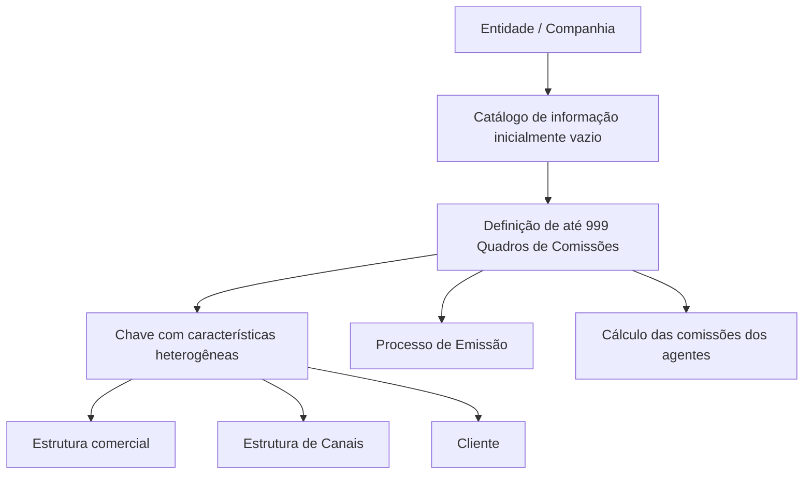

# Definição dos Quadros de Comissões da Companhia — Documentação Reef

## 1. Metadados do Documento
- **Arquivo de Origem:** Não identificado no conteúdo extraído
- **Tipo de Documento:** Especificação Funcional
- **Domínio / Sistema:** Reef / MAPFRE / Configuração de Comissões
- **Público-Alvo:** Negócio, Configuração Funcional, Operação e Arquitetura
- **Data/Versão Identificada:** Não identificada

---

## 2. Resumo Executivo & Contexto de Negócio

O documento define o conceito de **Quadro de Comissões** no contexto do sistema Reef. Um Quadro de Comissões é uma estrutura interna de configuração que relaciona e organiza, sob uma mesma chave, características heterogêneas da estrutura comercial, estrutura de canais e cliente.

As chaves dos Quadros de Comissões são utilizadas pelo Processo de Emissão e empregadas no cálculo das comissões dos agentes. O documento não descreve fórmulas de cálculo, percentuais, regras de elegibilidade ou contratos técnicos de integração.

O núcleo do sistema permite identificar e codificar até **999 Quadros de Comissões** em um catálogo de informação inicialmente entregue vazio às entidades. Cada entidade deve configurar o catálogo conforme a sua necessidade operacional e considerando a exploração posterior das informações pelos processos da companhia.

O documento recomenda usar as descrições das chaves para apresentar informações adicionais. Contudo, a entidade MAPFRE deve analisar a melhor forma de utilizar transversalmente esse catálogo para garantir uma definição adequada e sua posterior utilização nos processos corporativos.

---

## 3. Arquitetura, Componentes & Tecnologias Envolvidas

| Componente / Conceito | Papel identificado no documento |
| :--- | :--- |
| Sistema / núcleo do Sistema | Permite identificar e codificar até 999 Quadros de Comissões. |
| Catálogo de informação | Repositório inicialmente vazio entregue às entidades para configuração dos Quadros de Comissões. |
| Quadro de Comissões | Chave interna que estrutura características heterogêneas relevantes para emissão e cálculo de comissões. |
| Processo de Emissão | Processo que utiliza as chaves dos Quadros de Comissões. |
| Cálculo das comissões dos agentes | Processo que emprega as chaves dos Quadros de Comissões. |
| Entidade MAPFRE | Deve definir a utilização transversal do catálogo de informação. |
| Reef | Contexto documental e sistema indicado nos elementos de navegação e documentação extraídos. |



**Nota de Análise:** O documento não detalha tecnologias, APIs, bancos de dados, métodos HTTP, contratos JSON, ambientes técnicos, servidores ou mecanismos de persistência associados ao Reef ou aos Quadros de Comissões.

---

## 4. Regras de Negócio, Especificações Funcionais & Processos

1. Um **Quadro de Comissões** é um conceito interno utilizado na configuração do Sistema.
2. Um Quadro de Comissões associa e estrutura características heterogêneas sob uma mesma chave.
3. As características relacionadas podem pertencer, entre outros exemplos citados, à:
   - Estrutura comercial;
   - Estrutura de Canais;
   - Cliente.
4. As chaves definidas nos Quadros de Comissões são utilizadas no Processo de Emissão.
5. As chaves definidas nos Quadros de Comissões são utilizadas no cálculo das comissões dos agentes.
6. O núcleo do Sistema pode identificar e codificar até **999 Quadros de Comissões**.
7. O catálogo de informação é entregue inicialmente vazio às entidades.
8. O atributo **Companhia** contém o código da companhia na qual o Quadro de Comissões está sendo definido.
9. O atributo **Descrição do Quadro de Comissões** contém o nome ou a descrição do Quadro de Comissões.
10. O atributo **Descrição Abreviada do Quadro de Comissões** contém a denominação ou descrição abreviada da chave do Quadro de Comissões em definição.
11. Como prática operacional recomendada, as descrições das chaves podem ser utilizadas para mostrar mais informação.
12. A entidade MAPFRE deve analisar como utilizar transversalmente o catálogo de informação nos processos da companhia, considerando a correta definição e a exploração posterior das informações.
13. Um **Quadro de Comissões** não deve ser confundido com um **Quadro de Distribuição de Comissões**.

---

## 5. Tabelas de Parâmetros, Ambientes e Estruturas de Dados

| Item / Parâmetro | Descrição / Função | Tipo / Valores / Formato | Ambiente / Observações |
| :--- | :--- | :--- | :--- |
| Capacidade máxima de Quadros de Comissões | Quantidade máxima identificável e codificável pelo núcleo do Sistema. | Até 999 Quadros de Comissões. | Catálogo inicialmente vazio entregue às entidades. |
| Companhia | Código da companhia em que o Quadro de Comissões é definido. | Código de companhia. | Propriedade geral do Quadro de Comissões. |
| Descrição do Quadro de Comissões | Nome ou descrição do Quadro de Comissões. | Texto. | Pode ser usada para apresentar informação adicional. |
| Descrição Abreviada do Quadro de Comissões | Denominação ou descrição abreviada da chave em definição. | Texto abreviado. | Propriedade geral do Quadro de Comissões. |
| Chave do Quadro de Comissões | Agrupa e estrutura características heterogêneas. | Chave interna de configuração. | Utilizada no Processo de Emissão e no cálculo das comissões dos agentes. |
| Estrutura comercial | Exemplo de característica relacionada sob uma chave de Quadro de Comissões. | Não detalhado. | Não há modelo de dados especificado. |
| Estrutura de Canais | Exemplo de característica relacionada sob uma chave de Quadro de Comissões. | Não detalhado. | Não há modelo de dados especificado. |
| Cliente | Exemplo de característica relacionada sob uma chave de Quadro de Comissões. | Não detalhado. | Não há modelo de dados especificado. |

| Código do Quadro | Descrição | Abreviatura |
| :--- | :--- | :--- |
| 100 | Cuadro AUTOS | AUTOS |
| 300 | Cuadro DIVERSOS | DIV. |
| 500 | Cuadro RESTO NO VIDA | R-N-V |
| 750 | Cuadro VIDA | VIDA |

---

## 6. Bateria de Perguntas & Respostas para RAG (FAQ Sintético)

### P1: O que é um Quadro de Comissões no sistema Reef?
**R:** Um Quadro de Comissões é um conceito interno de configuração do Sistema. Ele permite relacionar e estruturar, sob uma mesma chave, características heterogêneas como informações da estrutura comercial, estrutura de Canais e cliente.

### P2: Para quais processos as chaves dos Quadros de Comissões são utilizadas?
**R:** As chaves dos Quadros de Comissões são utilizadas no Processo de Emissão e no cálculo das comissões dos agentes.

### P3: Quantos Quadros de Comissões podem ser configurados no núcleo do Sistema?
**R:** O núcleo do Sistema permite identificar e codificar até 999 Quadros de Comissões em um catálogo de informação.

### P4: Como o catálogo de Quadros de Comissões é entregue às entidades?
**R:** O catálogo de informação é entregue inicialmente vazio de conteúdo às entidades, que devem realizar sua própria configuração.

### P5: Qual informação deve ser registrada no atributo Companhia?
**R:** O atributo Companhia deve conter o código da companhia na qual está sendo definido o Quadro de Comissões.

### P6: Qual é a finalidade da Descrição Abreviada do Quadro de Comissões?
**R:** A Descrição Abreviada indica a denominação ou descrição abreviada da chave do Quadro de Comissões que está sendo definida.

### P7: Qual prática é recomendada para as descrições das chaves dos Quadros de Comissões?
**R:** O documento recomenda utilizar as descrições das chaves para mostrar informações adicionais. A utilização deve ser analisada pela entidade MAPFRE de forma transversal nos processos da companhia.

### P8: O documento especifica percentuais ou fórmulas para cálculo de comissões?
**R:** Não. O documento informa que as chaves dos Quadros de Comissões são empregadas no cálculo das comissões dos agentes, mas não apresenta percentuais, fórmulas, critérios de cálculo ou regras de distribuição.

### P9: Um Quadro de Comissões é igual a um Quadro de Distribuição de Comissões?
**R:** Não. O documento declara expressamente que um Quadro de Comissões não deve ser confundido com um Quadro de Distribuição de Comissões.

### P10: Quais características podem ser agrupadas por uma chave de Quadro de Comissões?
**R:** O documento cita como exemplos características da estrutura comercial, da estrutura de Canais e do cliente. Não apresenta uma lista exaustiva de características possíveis.

---

## 7. Glossário de Termos, Siglas & Conceitos-Chave

- **Reef:** Nome identificado na documentação e na navegação extraída; o documento não apresenta definição técnica adicional.
- **MAPFRE:** Entidade mencionada como responsável por analisar a utilização transversal do catálogo de informação nos processos da companhia.
- **Quadro de Comissões:** Conceito interno de configuração que estrutura características heterogêneas sob uma mesma chave, utilizada no Processo de Emissão e no cálculo de comissões dos agentes.
- **Quadro de Distribuição de Comissões:** Conceito distinto de Quadro de Comissões; o documento não fornece definição adicional.
- **Processo de Emissão:** Processo que utiliza as chaves dos Quadros de Comissões.
- **Estrutura comercial:** Exemplo de característica que pode ser relacionada por uma chave de Quadro de Comissões.
- **Estrutura de Canais:** Exemplo de característica que pode ser relacionada por uma chave de Quadro de Comissões.
- **Catálogo de informação:** Catálogo inicialmente vazio no qual podem ser identificados e codificados até 999 Quadros de Comissões.

---

## 8. Notas Críticas, Riscos & Limitações

- O documento recomenda a leitura de documentos relacionados para evitar interpretações isoladas incorretas: **Estructura de Productos** e **Configuración de Ramos**.
- A configuração local dos Quadros de Comissões requer análise da entidade MAPFRE para garantir uso transversal adequado nos processos corporativos.
- O documento não detalha regras de cálculo de comissões, percentuais, exceções, vigências, perfis de usuário ou mecanismos de aprovação.
- O documento não descreve contratos de integração, APIs, tecnologias, ambientes, servidores, bancos de dados ou rotas de logs.
- O documento ressalta explicitamente que Quadro de Comissões e Quadro de Distribuição de Comissões são conceitos diferentes.
- **Nota de Análise:** Os exemplos de códigos 100, 300, 500 e 750 são apresentados como exemplos de descrições e abreviaturas; o conteúdo não afirma que sejam códigos obrigatórios, reservados ou universais.

---

## 9. Conteúdo Bruto Estruturado (Referência Fiel)

```text
--- [PÁGINA 1 DE 2] ---

DEFINICIÓN de los Cuadros de Comisiones de la Compañía
Contexto
Un cuadro de comisiones es un concepto interno empleado en la conguración del Sistema cuyo signicado es relacionar y estructurar bajo
una misma clave características heterogéneas (de la estructura comercial, de la estructura de Canales, del Cliente, ...), claves que serán
utilizadas en el Proceso de Emisión y empleadas en el cálculo de las comisiones de los agentes.
Objetivo
Funcionalmente, el núcleo del Sistema cuenta con la posibilidad de identicar y codicar hasta 999 Cuadros de Comisiones en un catálogo
de información que se entrega a las entidades inicialmente vacío de contenido.
Propiedades Generales
Compañía
Este atributo contiene el código de la compañía en la que se está deniendo el Cuadro de comisiones.
Descripción del Cuadro de Comisiones
Esta propiedad contiene el nombre o descripción del Cuadro de Comisiones.
Descripción Abreviada del Cuadro de Comisiones
Este Atributo indica cual es la denominación o descripción abreviada de la clave del Cuadro de Comisiones que se está deniendo.
A modo de ejemplo:
CUADRO DESCRIPCIÓN ABREVIATURA
100 Cuadro AUTOS AUTOS
300 Cuadro DIVERSOS DIV.
500 Cuadro RESTO NO VIDA R-N-V
750 Cuadro VIDA VIDA
... ... ...
Documentation / DOCUMENTACIÓN Reef
DOCUMENTACIÓN Reef
Mapfredocument
DOCUMENTACIÓN Reef
Owner
user:agonzalez_mapfre.com
Lifecycle
Approved Source
 /
 VL
Buscar Inicio Soluciones Arquitecturas APIs Componentes Cloud Documentación Zeus Reef Ayuda
ES

--- [PÁGINA 2 DE 2] ---

Vínculos
Relación de Directrices y Documentos funcionales cuya lectura recomendada para evitar que la interpretación aislada del presente
documento pueda conducir a error.
Estructura de Productos
Conguración de Ramos
Preguntas frecuentes
(1) ¿Existe alguna aclaración operativa que deba ser tomada en consideración localmente en la conguración de los cuadros de comisiones?
Una práctica que se ha demostrado que funciona bien y por tanto se recomienda como modelo es utilizar las descripciones de las claves
denidas para 'mostrar' algo más de información, si bien la entidad MAPFRE debe analizar la mejor manera de utilizar transversalmente en
los procesos de la compañía este catálogo de información para su correcta denición contemplando su posterior explotación.
(2) No confundir un Cuadro de Comisiones con un Cuadro de Distribución de Comisiones
```
