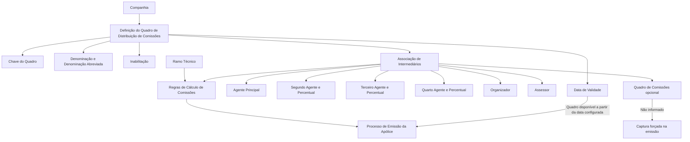

# Quadro de Distribuição de Comissões no Reef.core — Definição, Associação de Intermediários e Vigência

## 1. Metadados do Documento
- **Arquivo de Origem:** Não informado; conteúdo extraído de documento Reef.
- **Tipo de Documento:** Manual Operacional / Especificação Funcional.
- **Domínio / Sistema:** Reef.core; configuração de comissões e intermediação de apólices.
- **Público-Alvo:** Usuários emissores, administradores de configuração, analistas funcionais e equipes de negócio.
- **Data/Versão Identificada:** Não identificada.
- **Owner identificado no conteúdo:** `user:agonzalez_mapfre.com`.
- **Lifecycle identificado no conteúdo:** `Approved Source`.

---

## 2. Resumo Executivo & Contexto de Negócio

O documento descreve a configuração de **Quadros de Distribuição de Comissões** no sistema **Reef.core**. Um quadro de distribuição é um código identificador utilizado para pré-configurar as condições de repartição das comissões entre intermediários associados a uma apólice emitida no sistema.

Toda apólice emitida no Reef.core possui obrigatoriamente um **Agente Principal**. A apólice pode possuir, de forma discricionária, até cinco figuras adicionais de intermediação: Segundo Agente, Terceiro Agente, Quarto Agente, Organizador e Assessor. Assim, podem coexistir até seis figuras independentes na intermediação de uma apólice. O documento também menciona uma sétima figura, denominada **Executivo de Conta**, que pode ser atribuída ao Agente Principal por motivos comerciais, mas não recebe comissões.

A distribuição das comissões segue duas regras principais. O Agente Principal, Segundo Agente, Terceiro Agente e Quarto Agente compartilham o valor das comissões calculadas para o Agente Principal. Já o Organizador e o Assessor possuem comissões próprias. O quadro de distribuição define antecipadamente os intermediários envolvidos e os percentuais aplicáveis, orientando como o cálculo deverá ser executado durante a emissão da apólice.

A definição dos quadros não é obrigatória, pois sua função é facilitar a captura de dados no processo de emissão e reduzir a possibilidade de erros pelos usuários emissores. Os quadros são definidos no nível da companhia, podem ser numerosos e são identificados individualmente por uma chave, uma denominação e uma denominação abreviada.

Para que um quadro seja utilizável no processo de emissão, é necessário configurar as chaves dos intermediários, os percentuais de comissão pertinentes e uma data de validade a partir da qual a parametrização estará operacional. A data de validade também suporta o histórico das alterações realizadas nas definições dos quadros.

---

## 3. Arquitetura, Componentes & Tecnologias Envolvidas

O documento não descreve uma arquitetura técnica de infraestrutura, APIs, microsserviços, bancos de dados ou integrações. O conteúdo apresenta uma arquitetura funcional de parametrização no **Reef.core**, centrada na configuração corporativa de quadros de distribuição e no seu uso posterior durante a emissão de apólices.

### Componentes funcionais identificados

| Componente / Entidade | Função descrita |
| :--- | :--- |
| Reef.core | Sistema no qual são emitidas apólices e configurados os quadros de distribuição de comissões. |
| Companhia | Nível organizacional no qual os quadros de distribuição de comissões são definidos. |
| Quadro de Distribuição de Comissões | Código identificador que pré-configura intermediários, percentuais e condições de distribuição de comissões. |
| Processo de Emissão | Processo que utiliza o quadro configurado para orientar a captura de informações e o cálculo de comissões da apólice. |
| Quadro de Comissões | Código opcional associado ao quadro de distribuição; caso não seja informado, o sistema exige sua captura durante a emissão. |
| Agente Principal | Intermediário obrigatório em toda apólice emitida no Reef.core. |
| Segundo Agente | Intermediário opcional que participa do valor de comissão calculado para o Agente Principal. |
| Terceiro Agente | Intermediário opcional que participa do valor de comissão calculado para o Agente Principal. |
| Quarto Agente | Intermediário opcional que participa do valor de comissão calculado para o Agente Principal. |
| Organizador | Intermediário opcional com comissão própria. |
| Assessor | Intermediário opcional com comissão própria. |
| Executivo de Conta | Figura que pode estar associada ao Agente Principal por razões comerciais, sem percepção de comissão. |
| Ramo Técnico | Entidade cujos atributos intervêm especificamente no cálculo das comissões das apólices. |
| Relação de Agentes Operativos | Relação de agentes disponíveis para a entidade, utilizada para identificar os intermediários configurados no quadro. |



> **Nota de Análise:** O documento não detalha métodos HTTP, contratos JSON, persistência, APIs, tecnologias de infraestrutura, rotas de integração ou interfaces de usuário do Reef.core.

---

## 4. Regras de Negócio, Especificações Funcionais & Processos

### 4.1 Composição da intermediação da apólice

1. Toda apólice emitida no Reef.core deve ter uma chave de **Agente Principal** obrigatoriamente associada.
2. A apólice pode ter, de forma discricionária, até cinco figuras adicionais:
   - Segundo Agente;
   - Terceiro Agente;
   - Quarto Agente;
   - Organizador;
   - Assessor.
3. Podem coexistir até seis figuras independentes de intermediação na apólice:
   - Agente Principal;
   - Segundo Agente;
   - Terceiro Agente;
   - Quarto Agente;
   - Organizador;
   - Assessor.
4. Pode existir uma sétima figura, o **Executivo de Conta**.
5. O Executivo de Conta não recebe comissões.
6. O Executivo de Conta pode ser atribuído ao Agente Principal por razões comerciais.

### 4.2 Regras de distribuição das comissões

1. As comissões calculadas para o Agente Principal podem ser distribuídas entre:
   - Agente Principal;
   - Segundo Agente;
   - Terceiro Agente;
   - Quarto Agente.
2. O percentual do Segundo Agente representa um percentual relativo ao total de comissões do Agente Principal.
3. O percentual do Terceiro Agente representa um percentual relativo ao total de comissões do Agente Principal.
4. O percentual do Quarto Agente representa um percentual relativo ao total de comissões do Agente Principal.
5. Organizador e Assessor possuem comissões próprias.
6. O documento não informa fórmula matemática, limites percentuais, validações de soma de percentuais, arredondamento ou regras de precedência entre percentuais.

> **Nota de Análise:** O documento estabelece que os agentes secundários participam das comissões calculadas para o Agente Principal, mas não detalha a fórmula de cálculo, nem determina se a soma dos percentuais dos agentes secundários deve obedecer a um limite específico.

### 4.3 Finalidade do Quadro de Distribuição de Comissões

1. O quadro de distribuição de comissões é um código identificador.
2. O código permite pré-configurar e estruturar condições de distribuição de comissões no Reef.core.
3. O quadro determina, durante a emissão, como deve ser realizado o cálculo de distribuição.
4. Um quadro de distribuição não pode ser modificado.
5. A definição de quadros não é obrigatória.
6. O quadro atua como facilitador para a emissão.
7. O uso do quadro reduz a necessidade de captura manual de informações pelos usuários emissores.
8. O uso do quadro busca minimizar erros na captura de dados.
9. A configuração é realizada no nível da companhia.
10. A companhia pode codificar inúmeros quadros de distribuição.
11. Cada quadro pode ser identificado por denominação ou texto descritivo e por abreviatura.

### 4.4 Objetivo funcional

O objetivo funcional possui duas etapas:

1. Definir os Quadros de Distribuição de Comissões na entidade.
2. Associar aos quadros:
   - os agentes participantes;
   - os percentuais dos intermediários;
   - informações coerentes com os atributos do Ramo Técnico que participam especificamente no cálculo das comissões das apólices.

### 4.5 Processo de configuração e utilização

1. Identificar a companhia para a qual o quadro será configurado.
2. Definir a chave do quadro de distribuição de comissões.
3. Informar a denominação do quadro.
4. Informar a denominação abreviada do quadro.
5. Associar a chave do Agente Principal.
6. Associar opcionalmente um código de Quadro de Comissões.
7. Associar, quando aplicável, Segundo Agente e respectivo percentual.
8. Associar, quando aplicável, Terceiro Agente e respectivo percentual.
9. Associar, quando aplicável, Quarto Agente e respectivo percentual.
10. Associar, quando aplicável, Organizador.
11. Associar, quando aplicável, Assessor.
12. Definir a data a partir da qual o quadro estará disponível para utilização no sistema.
13. Definir a inabilitação quando a chave do quadro não puder ser utilizada pelo sistema.
14. Utilizar o quadro durante o processo de emissão da apólice.

### 4.6 Regra de associação do Quadro de Comissões

1. A associação do código de Quadro de Comissões ao Quadro de Distribuição de Comissões não é obrigatória.
2. Se o código do Quadro de Comissões estiver vazio, o sistema força sua captura durante a emissão da apólice.
3. A ausência dessa associação deixa a operação da entidade mais aberta, conforme indicado pelo documento.

### 4.7 Regra de vigência e histórico

1. A Data de Validade determina a partir de quando o quadro de distribuição, seus intermediários e seus percentuais estarão disponíveis para uso no sistema.
2. O uso correto da Data de Validade permite manter histórico das mudanças efetuadas nas definições.
3. O documento não especifica o comportamento de quadros com datas futuras, datas expiradas, sobreposição de vigências ou retroatividade.

---

## 5. Tabelas de Parâmetros, Ambientes e Estruturas de Dados

### 5.1 Campos do Quadro de Distribuição de Comissões

| Item / Parâmetro | Descrição / Função | Tipo / Valores / Formato | Ambiente / Observações |
| :--- | :--- | :--- | :--- |
| Companhia | Identifica a companhia para a qual o quadro de distribuição de comissões está sendo configurado. | Não especificado. | Configuração realizada no nível da companhia. |
| Chave do Quadro de Distribuição de Comissões | Identifica o quadro de distribuição de comissões. | Código / chave; formato não especificado. | O documento afirma que o quadro não pode ser modificado. |
| Denominação do Quadro de Distribuição de Comissões | Define o nome do quadro de distribuição de comissões. | Texto; formato não especificado. | Utilizada para identificação individual do quadro. |
| Denominação Abreviada | Define o nome abreviado do quadro de distribuição de comissões. | Texto abreviado; formato não especificado. | Utilizada junto com a denominação descritiva. |
| Inabilitação | Determina que a chave do quadro de distribuição de comissões está inabilitada para uso no sistema. | Estado de inabilitação; valores não especificados. | Impede o emprego da chave no sistema. |
| Data de Validade | Define a data a partir da qual o quadro, os intermediários e os percentuais ficam disponíveis para uso. | Data; formato não especificado. | Permite manter histórico das alterações de definição. |

### 5.2 Associação de intermediários e percentuais

| Item / Parâmetro | Descrição / Função | Tipo / Valores / Formato | Ambiente / Observações |
| :--- | :--- | :--- | :--- |
| Chave de Agente | Identifica a chave do intermediário Principal do quadro de distribuição de comissões. | Chave de agente; formato não especificado. | Deve estar de acordo com a relação de Agentes Operativos da entidade. |
| Quadro de Comissões | Contém o código do Quadro de Comissões sobre o qual os intermediários e percentuais estão sendo configurados. | Código; formato não especificado. | Associação não obrigatória. Se vazio, a emissão força sua captura. |
| Chave do Segundo Agente | Identifica a chave do Segundo Agente. | Chave de agente; formato não especificado. | Deve estar de acordo com a relação de Agentes Operativos da entidade. |
| Percentual do Agente Secundário | Contém o percentual relativo do total de comissões do Agente Principal atribuído ao Agente Secundário. | Percentual; escala e limites não especificados. | Relacionado às comissões calculadas para o Agente Principal. |
| Chave do Terceiro Agente | Identifica a chave do Terceiro Agente intermediário. | Chave de agente; formato não especificado. | Deve estar de acordo com a relação de Agentes Operativos da entidade. |
| Percentual do Terceiro Agente | Contém o percentual relativo do total de comissões do Agente Principal atribuído ao Terceiro Agente. | Percentual; escala e limites não especificados. | Relacionado às comissões calculadas para o Agente Principal. |
| Chave do Quarto Agente | Identifica a chave do Quarto Agente intermediário. | Chave de agente; formato não especificado. | Deve estar de acordo com a relação de Agentes Operativos da entidade. |
| Percentual do Quarto Agente | Contém o percentual relativo do total de comissões do Agente Principal atribuído ao Quarto Agente. | Percentual; escala e limites não especificados. | Relacionado às comissões calculadas para o Agente Principal. |
| Chave do Organizador | Identifica a chave do Organizador associado ao Agente Principal e ao quadro em configuração. | Chave de agente; formato não especificado. | O Organizador possui comissão própria. |
| Chave do Assessor | Identifica a chave do Assessor associado ao Agente Principal e ao quadro em configuração. | Chave de agente; formato não especificado. | O Assessor possui comissão própria. |

### 5.3 Figuras de intermediação

| Figura de Intermediação | Obrigatoriedade | Regra de Comissão | Observações |
| :--- | :--- | :--- | :--- |
| Agente Principal | Obrigatória. | Possui comissões calculadas para o Agente Principal, que podem ser distribuídas com Segundo, Terceiro e Quarto Agentes. | Toda apólice emitida no Reef.core possui essa chave. |
| Segundo Agente | Discricionária. | Participa do importe das comissões calculadas para o Agente Principal. | Possui percentual relativo ao total de comissões do Agente Principal. |
| Terceiro Agente | Discricionária. | Participa do importe das comissões calculadas para o Agente Principal. | Possui percentual relativo ao total de comissões do Agente Principal. |
| Quarto Agente | Discricionária. | Participa do importe das comissões calculadas para o Agente Principal. | Possui percentual relativo ao total de comissões do Agente Principal. |
| Organizador | Discricionária. | Possui comissão própria. | Associado ao Agente Principal e ao quadro em configuração. |
| Assessor | Discricionária. | Possui comissão própria. | Associado ao Agente Principal e ao quadro em configuração. |
| Executivo de Conta | Pode existir na apólice. | Não recebe comissões. | Pode estar atribuído ao Agente Principal por razões comerciais. |

### 5.4 Exemplos de quadros apresentados

| Chave do Quadro | Denominação | Denominação Abreviada |
| :--- | :--- | :--- |
| 1 | El Corte Inglés Premium | ECI. PR. |
| 2 | El Corte Inglés Standard | ECI. Std. |
| 3 | Cuadro Standard | std. |

### 5.5 Ambientes, URLs, servidores e logs

| Item / Parâmetro | Descrição / Função | Tipo / Valores / Formato | Ambiente / Observações |
| :--- | :--- | :--- | :--- |
| Ambientes | Não identificados. | Não aplicável. | O documento não apresenta ambientes de desenvolvimento, testes, homologação ou produção. |
| URLs | Não identificadas. | Não aplicável. | O documento não apresenta URLs operacionais ou de integração. |
| Servidores | Não identificados. | Não aplicável. | O documento não apresenta mapeamento de servidores. |
| Logs | Não identificados. | Não aplicável. | O documento não define rotas, variáveis ou políticas de log. |

---

## 6. Bateria de Perguntas & Respostas para RAG (FAQ Sintético)

### P1: O que é um Quadro de Distribuição de Comissões no Reef.core?
**R:** Um Quadro de Distribuição de Comissões é um código identificador utilizado para pré-configurar e estruturar as condições de distribuição das comissões entre os intermediários possíveis de uma apólice no Reef.core. O quadro determina, durante a emissão, como o cálculo da distribuição deverá ser realizado.

### P2: A definição de um Quadro de Distribuição de Comissões é obrigatória no Reef.core?
**R:** Não. O documento informa que a definição dos quadros não é obrigatória. Sua principal função é facilitar o processo de emissão, agilizando a captura de informações pelos usuários emissores e reduzindo a possibilidade de erros na entrada manual de dados.

### P3: Quantas figuras de intermediação podem coexistir em uma apólice emitida no Reef.core?
**R:** Podem coexistir até seis figuras independentes de intermediação: Agente Principal, Segundo Agente, Terceiro Agente, Quarto Agente, Organizador e Assessor. O documento também menciona uma possível sétima figura, o Executivo de Conta, que não recebe comissões.

### P4: Qual figura de intermediação é obrigatória em uma apólice?
**R:** O Agente Principal é obrigatório. Toda apólice emitida no Reef.core possui obrigatoriamente uma chave de Agente Principal associada.

### P5: Como são distribuídas as comissões entre o Agente Principal e os agentes adicionais?
**R:** As comissões calculadas para o Agente Principal podem ser distribuídas entre o Agente Principal, o Segundo Agente, o Terceiro Agente e o Quarto Agente. Os percentuais dos agentes adicionais são relativos ao total das comissões do Agente Principal.

### P6: Organizador e Assessor participam da comissão calculada para o Agente Principal?
**R:** Não conforme a regra apresentada. O documento estabelece que Organizador e Assessor possuem comissões próprias, diferentemente de Segundo Agente, Terceiro Agente e Quarto Agente, que participam do valor das comissões calculadas para o Agente Principal.

### P7: O código do Quadro de Comissões deve obrigatoriamente ser associado ao Quadro de Distribuição?
**R:** Não. A associação do código do Quadro de Comissões é opcional. Caso esse campo permaneça vazio, o sistema força a captura do Quadro de Comissões durante a emissão das apólices, deixando a operação da entidade mais aberta.

### P8: Qual é a função da Data de Validade no Quadro de Distribuição de Comissões?
**R:** A Data de Validade determina a partir de qual data o quadro de distribuição, seus intermediários e seus percentuais estarão disponíveis para utilização no sistema. O uso correto desse campo também permite manter registro histórico das mudanças realizadas nas definições.

### P9: Um Quadro de Distribuição de Comissões pode ser modificado?
**R:** Não. O documento informa que o quadro de distribuição de comissões não pode ser modificado. Ele pré-configura as condições de distribuição e determina como o cálculo deve ser realizado durante a emissão.

### P10: Em que nível organizacional os Quadros de Distribuição de Comissões são configurados?
**R:** Os Quadros de Distribuição de Comissões são definidos no nível da companhia. A companhia pode codificar inúmeros quadros e identificá-los individualmente por denominação, texto descritivo e abreviatura.

### P11: O que acontece quando um Quadro de Distribuição está inabilitado?
**R:** Quando a propriedade Inabilitação está configurada, a chave do Quadro de Distribuição de Comissões fica inabilitada para ser empregada no sistema.

### P12: O Executivo de Conta recebe comissões na apólice?
**R:** Não. O documento informa que o Executivo de Conta pode existir na apólice e pode ser atribuído ao Agente Principal por razões comerciais, mas não percebe comissões.

---

## 7. Glossário de Termos, Siglas & Conceitos-Chave

- **Reef.core:** Sistema citado como responsável pela emissão de apólices e pela configuração dos Quadros de Distribuição de Comissões.
- **Apólice:** Entidade emitida no Reef.core e associada obrigatoriamente a um Agente Principal.
- **Quadro de Distribuição de Comissões:** Código identificador usado para pré-configurar intermediários, percentuais e condições de distribuição de comissões.
- **Quadro de Comissões:** Código opcional associado à configuração dos intermediários e seus percentuais; se ausente, deve ser capturado durante a emissão.
- **Agente Principal:** Intermediário obrigatório na apólice e referência para as comissões que podem ser distribuídas com os agentes adicionais.
- **Segundo Agente:** Intermediário opcional que recebe percentual relativo ao total de comissões do Agente Principal.
- **Terceiro Agente:** Intermediário opcional que recebe percentual relativo ao total de comissões do Agente Principal.
- **Quarto Agente:** Intermediário opcional que recebe percentual relativo ao total de comissões do Agente Principal.
- **Organizador:** Intermediário opcional associado ao Agente Principal e ao quadro, com comissão própria.
- **Assessor:** Intermediário opcional associado ao Agente Principal e ao quadro, com comissão própria.
- **Executivo de Conta:** Figura eventualmente associada ao Agente Principal por motivos comerciais, sem recebimento de comissão.
- **Ramo Técnico:** Entidade cujos atributos intervêm especificamente no cálculo das comissões das apólices.
- **Agentes Operativos:** Relação de agentes disponíveis para a entidade, usada como referência para identificação dos intermediários.
- **Emissão:** Processo no qual a apólice é emitida e no qual o Quadro de Distribuição de Comissões pode ser utilizado.
- **Data de Validade:** Data a partir da qual o quadro e sua configuração ficam disponíveis para utilização no sistema.
- **Inabilitação:** Propriedade que impede a utilização de uma chave de Quadro de Distribuição de Comissões no sistema.

---

## 8. Notas Críticas, Riscos & Limitações

- O documento informa que os Quadros de Distribuição de Comissões não podem ser modificados, mas não detalha o procedimento para corrigir configurações incorretas, criar substituições ou encerrar vigências.
- Não foram especificadas fórmulas de cálculo, limites para percentuais, validações de soma dos percentuais, regras de arredondamento ou comportamento para percentuais inválidos.
- Não foram especificados critérios de obrigatoriedade para Segundo Agente, Terceiro Agente, Quarto Agente, Organizador ou Assessor.
- Não foram definidos contratos técnicos, APIs, métodos HTTP, estruturas JSON, persistência, integrações, tecnologias de infraestrutura, servidores, ambientes, URLs ou mecanismos de log.
- O documento menciona que a configuração deve estar em consonância com atributos do Ramo Técnico, mas não detalha quais atributos do Ramo Técnico afetam o cálculo das comissões.
- O campo Quadro de Comissões é opcional na configuração, mas sua ausência força a captura durante a emissão. Isso aumenta a flexibilidade operacional, mas pode transferir a responsabilidade de seleção para o processo de emissão.
- O conteúdo extraído apresenta caracteres corrompidos em alguns termos, como `denir`, `congurando` e `guras`. A interpretação foi preservada pelo contexto textual, sem alterar os fatos apresentados.
- A seção de perguntas frequentes apresenta a pergunta sobre esclarecimentos operacionais locais na atribuição dos quadros de comissões aos agentes, com resposta `N/A`.

---

## 9. Conteúdo Bruto Estruturado (Referência Fiel)

```text
--- [PÁGINA 1 DE 3] ---

Cuadro de distribución de comisiones
Contexto
Toda póliza emitida en Reef.core tiene obligatoriamente asociada una clave de agente principal y discrecionalmente otras cinco posibles
guras, pudiendo por tanto coexistir en total hasta 6 guras independientes en la de intermediación de la póliza: 4 de ellas (Agente Principal,
Segundo Agente, Tercer Agente y Cuarto Agente) se reparten el importe de las comisiones calculadas para el agente principal, mientras que
las dos guras restantes, el Organizador y el Asesor, cuentan con sus propias comisiones (En las pólizas puede existir una séptima gura
denominada Ejecutivo de Cuenta que no percibe comisiones pero que por cuestiones comerciales puede estar asignada al agente principal).
Un cuadro de distribución de comisiones es un código identicador por el que podemos prejar y estructurar en Reef.core las condiciones de
distribución de las comisiones entre los posibles intermediarios existentes en la póliza, no pudiendo modicarse y determinando de esta
manera en el proceso de emisión cómo debe realizarse su cálculo.
La denición de los cuadros de distribución de comisiones en Reef.core no es una tarea que haya de realizarse obligatoriamente puesto que
su principal función estriba en ser un facilitador que agiliza en el proceso de Emisión la captura de información por parte de los usuarios
emisores minimizando la posibilidad de cometer errores en la captura de los datos.
La denición de los cuadros de distribución de comisiones se realiza a nivel de la compañía permitiendo codicar innumerables cuadros de
distribución y pudiendo denominar e identicar individualmente cada uno de ellos mediante una denominación o texto descriptivo además de
una abreviatura.
Para que en el Proceso de Emisión se puedan utilizar los cuadros de distribución de comisiones, es necesario prejar en cada uno de ellos las
claves de los intermediarios que lo van a conformar y los porcentajes de las comisiones de estos intermediarios además de indicar una fecha
a partir de la cual la parametrización realizada estará plenamente operativa en el sistema.
Objetivo
El objetivo es doble, primero Denir los Cuadros de Distribución de Comisiones en la entidad para posteriormente Asociar en ellos la
información de los Agentes participantes y sus porcentajes, todo ello en consonancia con los atributos del Ramo Técnico que intervienen
especícamente en el cálculo de las comisiones de sus pólizas.
Conguraciones Previas
Denición Cuadros de Distribución
Asociación Cuadros de Distribución
Cuadros de distribución
Compañía
Identica la compañía para la que se está congurando el cuadro de distribución de comisiones.
Documentation / DOCUMENTACIÓN Reef
DOCUMENTACIÓN Reef
Mapfredocument
DOCUMENTACIÓN Reef
Owner
user:agonzalez_mapfre.com
Lifecycle
Approved Source
 / 
 VL
Buscar Inicio Soluciones Arquitecturas APIs Componentes Cloud Documentación Zeus Reef Ayuda
ES


--- [PÁGINA 2 DE 3] ---

Cuadro de distribución de comisiones
Esta propiedad contiene la clave por la que se identicará el cuadro de distribución de comisiones.
Denominación del cuadro de distribución de comisiones
Esta propiedad establece el nombre del de cuadro de distribución de comisiones.
Denominación abreviada
Este atributo establece el nombre abreviado del cuadro de distribución de comisiones.
A modo de ejemplo, podemos denir los siguientes Cuadros de Distribución de Comisiones:
CLAVE DEL CUADRO DENOMINACIÓN ABREVIADA.
1 El Corte Inglés Premium ECI. PR.
2 El Corte Inglés Standard ECI. Std.
3 Cuadro Standard std.
... ... ...
Asociación de intermediarios
Clave de agente
Esta propiedad identica la clave del intermediario Principal del cuadro de distribución de Comisiones de acuerdo con la relación de Agentes
operativos para la entidad.
Cuadro de comisiones
Esta Propiedad del catálogo contiene el código del Cuadro de Comisiones sobre el que se están congurando los intermediarios y sus
porcentajes de participación.
NOTA: No es obligatorio informar y asociar al Cuadro de distribución de comisiones el código del cuadro de comisiones puesto que de estar
vacío el Sistema forzará su captura en la Emisión de las pólizas (dejando más abierta la operativa de la entidad).
Clave del segundo agente
Esta propiedad identica la clave del segundo Agente de acuerdo con la relación de Agentes operativos de la entidad.
Porcentaje del Agente Secundario
Este Atributo contiene el porcentaje relativo del total de comisiones del Agente Principal asignado al Agente Secundario.
Clave del tercer agente
Esta propiedad identica la clave del tercer Agente intermediario de acuerdo con la relación de Agentes operativos de la entidad.
Porcentaje del tercer agente
Este Atributo contiene el porcentaje relativo del total de comisiones del Agente Principal asignado al Tercer Agente.
Clave del cuarto agente
Esta propiedad identica la clave del Cuarto Agente intermediario de acuerdo con la relación de Agentes operativos para la entidad.
Porcentaje del cuarto agente
Este Atributo contiene el porcentaje relativo del total de comisiones del Agente Principal asignado al Cuarto Agente.


--- [PÁGINA 3 DE 3] ---

Clave del organizador
Esta propiedad identica la clave del Organizador asociado al Agente Principal y para el Cuadro de Distribución de Comisiones que se está
congurando.
Clave del asesor
Esta propiedad identica la clave del Asesor asociado al Agente Principal y para el Cuadro de Distribución de Comisiones que se está
congurando.
Inhabilitación
Esta propiedad establece que la Clave del Cuadro de Distribución de Comisiones está inhabilitada para poder ser empleada en el Sistema.
Fecha de Validez
Esta propiedad establece la fecha a partir de la cual el cuadro de distribución de comisiones con los intermediarios y porcentajes de
comisiones está o estará disponible en el sistema para ser utilizado.
Su correcto uso permite tener un registro histórico de los cambios efectuados en sus deniciones.
Vínculos
Relación de Directrices y Documentos funcionales cuya lectura recomendada para evitar que la interpretación aislada del presente
documento pueda conducir a error.
Actividades de Terceros
Conguración de Ramos
Preguntas frecuentes
(1) ¿Existe alguna aclaración operativa que deba ser tomada en consideración localmente en la asignación de los cuadros de comisiones a
los agentes?
N/A
```
