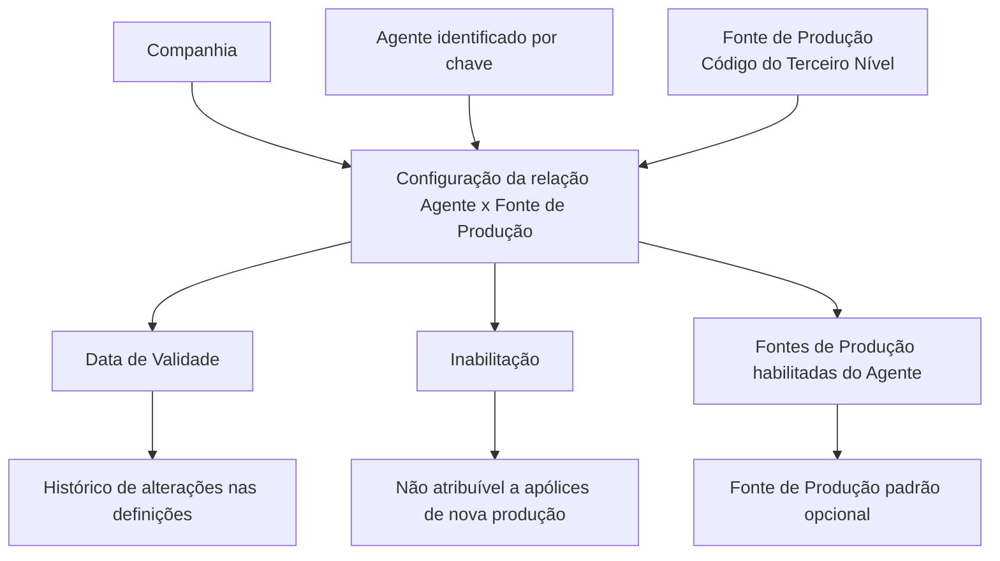

# Definição da Relação entre Agentes e Fontes de Produção

## 1. Metadados do Documento
- **Arquivo de Origem:** `Não identificado no conteúdo fornecido`
- **Tipo de Documento:** Especificação Funcional
- **Domínio / Sistema:** Sistema núcleo; documentação Reef; estrutura de canais
- **Público-Alvo:** Negócio, analistas funcionais, operação e administradores de configuração
- **Data/Versão Identificada:** Não identificada

---

## 2. Resumo Executivo & Contexto de Negócio

O documento define a configuração funcional da relação entre Agentes de uma Entidade e as Fontes de Produção que cada Agente pode utilizar. A associação é realizada para uma companhia, uma chave de Agente e uma chave de Terceiro Nível da estrutura de canais, identificada também como Fonte de Produção.

A configuração permite determinar quais Fontes de Produção ficam disponíveis para cada Agente. A associação pode possuir uma condição de inabilitação, impedindo que a Fonte de Produção do Cliente Distribuidor seja atribuída a apólices de nova produção.

A relação também possui uma data de validade. A data de validade determina a partir de quando a associação entre Agente e Fonte de Produção fica disponível para utilização no sistema. A configuração correta da data de validade permite manter histórico das alterações realizadas nas definições e explorar posteriormente essas informações.

O documento informa ainda que, na configuração de Agentes, é possível especificar voluntariamente uma Fonte de Produção padrão. A Fonte de Produção padrão deve pertencer ao conjunto de Fontes de Produção habilitadas na relação do respectivo Agente.

---

## 3. Arquitetura, Componentes & Tecnologias Envolvidas

Os componentes funcionais identificados são:

- **Sistema núcleo:** sistema que possibilita configurar e associar Fontes de Produção aos Agentes da Entidade.
- **Companhia:** contexto organizacional no qual uma Fonte de Produção é associada a uma chave de Agente.
- **Agente:** entidade identificada por uma chave e vinculada a uma ou mais Fontes de Produção.
- **Estrutura de Canais:** estrutura cujo Terceiro Nível é utilizado para identificar a Fonte de Produção atribuída ao Agente.
- **Fonte de Produção:** chave de Terceiro Nível da estrutura de canais associada ao Agente.
- **Cliente Distribuidor:** referência presente na regra de inabilitação da Fonte de Produção para apólices de nova produção.
- **Apólices de nova produção:** contexto em que uma Fonte de Produção inabilitada não pode ser atribuída.
- **Documentação Reef / Mapfredocument:** referências documentais citadas como vínculos relacionados.



**Nota de Análise:** o documento não detalha arquitetura técnica, integrações, métodos HTTP, contratos JSON, banco de dados, tecnologias de implementação, URLs, ambientes ou mecanismos de persistência.

---

## 4. Regras de Negócio, Especificações Funcionais & Processos

### Relação entre Agente e Fonte de Produção

1. O sistema núcleo permite configurar e associar, para cada Agente da Entidade, as Fontes de Produção específicas que o Agente pode utilizar.
2. A associação deve ser configurada no contexto de uma **Companhia**.
3. A associação utiliza uma chave de **Agente**.
4. A Fonte de Produção atribuída ao Agente é identificada pelo **Código do Terceiro Nível** da estrutura de canais.
5. O Código do Terceiro Nível é tratado no documento como a chave da estrutura de canais ou Fonte de Produção atribuída ao Agente.

### Regra de inabilitação

1. A propriedade **Inabilitação** estabelece que a Fonte de Produção do Cliente Distribuidor está inabilitada.
2. Uma Fonte de Produção inabilitada não pode ser atribuída em apólices de nova produção.
3. O documento não especifica o formato, os valores possíveis ou o mecanismo técnico utilizado para registrar a inabilitação.

### Regra de validade e histórico

1. A propriedade **Data de Validade** estabelece a data a partir da qual a associação entre Agente e Fonte de Produção fica disponível no sistema.
2. A associação somente pode ser utilizada a partir da respectiva Data de Validade.
3. A configuração correta da Data de Validade permite manter histórico das alterações realizadas nas definições.
4. O histórico de alterações pode ser explorado posteriormente.
5. O documento não informa se há uma data final de vigência, regras de sobreposição de períodos ou critérios de retroatividade.

### Fonte de Produção padrão

1. Na configuração de Agentes, pode-se especificar voluntariamente uma Fonte de Produção padrão.
2. A Fonte de Produção padrão deve fazer parte da relação de Fontes de Produção habilitadas para o Agente.
3. O documento não define critérios de seleção automática, obrigatoriedade, prioridade ou comportamento quando não existe uma Fonte de Produção padrão.

---

## 5. Tabelas de Parâmetros, Ambientes e Estruturas de Dados

| Item / Parâmetro | Descrição / Função | Tipo / Valores / Formato | Ambiente / Observações |
| :--- | :--- | :--- | :--- |
| Companhia | Contém o código da companhia na qual o código da Fonte de Produção é associado a uma chave de Agente. | Código de companhia; formato não especificado. | Aplicável à configuração da relação Agente x Fonte de Produção. |
| Agente | Identifica a chave do Agente. | Chave de Agente; formato não especificado. | Cada Agente pode possuir Fontes de Produção específicas utilizáveis. |
| Código do Terceiro Nível | Identifica a chave do Terceiro Nível da estrutura de canais ou Fonte de Produção atribuída ao Agente. | Código/chave; formato não especificado. | Representa a Fonte de Produção associada ao Agente. |
| Inabilitação | Estabelece que a Fonte de Produção do Cliente Distribuidor está inabilitada para atribuição em apólices de nova produção. | Propriedade; valores não especificados. | Restrição funcional para nova produção. |
| Data de Validade | Determina a partir de qual data a associação entre Agente e Fonte de Produção está disponível para uso no sistema. | Data; formato não especificado. | Permite histórico das mudanças efetuadas nas definições. |
| Fonte de Produção padrão | Fonte de Produção especificada voluntariamente na configuração do Agente. | Fonte pertencente à relação de Fontes habilitadas; formato não especificado. | Não é apresentada como obrigatória. |
| Documentação Reef | Referência documental relacionada, cuja leitura é recomendada para evitar interpretação isolada incorreta. | Documentação relacionada. | Também aparece como “DOCUMENTACIÓN Reef”. |
| Mapfredocument | Referência identificada na seção de vínculos. | Nome/referência; sem detalhamento adicional. | Não há explicação funcional adicional no conteúdo. |
| Owner | Proprietário indicado no documento. | `user:agonzalez_mapfre.com` | Metadado documental. |
| Lifecycle | Estado de ciclo de vida identificado no documento. | `Approved Source` | Metadado documental. |
| Idioma | Idioma apresentado na interface/documento. | `ES` | O conteúdo principal está em espanhol. |

---

## 6. Bateria de Perguntas & Respostas para RAG (FAQ Sintético)

### P1: Qual é o objetivo da relação entre Agentes e Fontes de Produção?
**R:** A relação permite configurar e associar, para cada Agente da Entidade, as Fontes de Produção específicas que esse Agente pode utilizar no sistema núcleo.

### P2: Quais informações identificam uma associação entre Agente e Fonte de Produção?
**R:** A associação é contextualizada por uma Companhia, identificada por seu código, por uma chave de Agente e pelo Código do Terceiro Nível da estrutura de canais, que identifica a Fonte de Produção atribuída ao Agente.

### P3: O que representa o Código do Terceiro Nível?
**R:** O Código do Terceiro Nível identifica a chave do Terceiro Nível da estrutura de canais. No contexto do documento, essa chave também representa a Fonte de Produção associada ao Agente.

### P4: O que acontece quando uma Fonte de Produção está inabilitada?
**R:** A propriedade de Inabilitação estabelece que a Fonte de Produção do Cliente Distribuidor fica inabilitada para ser atribuída em apólices de nova produção.

### P5: A inabilitação impede toda utilização da Fonte de Produção?
**R:** O documento estabelece expressamente apenas que a Fonte de Produção inabilitada não pode ser atribuída em apólices de nova produção. Não há detalhamento sobre outras utilizações ou processos afetados.

### P6: Qual é a função da Data de Validade na relação Agente x Fonte de Produção?
**R:** A Data de Validade define a partir de qual data a associação entre o Agente e a Fonte de Produção fica disponível para utilização no sistema.

### P7: Como a Data de Validade contribui para o histórico das configurações?
**R:** Uma configuração correta da Data de Validade permite manter um histórico das alterações efetuadas nas definições de associação entre Agente e Fonte de Produção, possibilitando a exploração posterior dessas informações.

### P8: É obrigatório definir uma Fonte de Produção padrão para o Agente?
**R:** Não. O documento informa que, na configuração de Agentes, uma Fonte de Produção padrão pode ser especificada voluntariamente.

### P9: A Fonte de Produção padrão pode ser qualquer Fonte de Produção?
**R:** Não. A Fonte de Produção padrão deve ser escolhida a partir da relação de Fontes de Produção habilitadas para o respectivo Agente.

### P10: O documento define APIs, métodos HTTP ou contratos de integração para a relação Agente x Fonte de Produção?
**R:** Não. O documento descreve propriedades e regras funcionais da relação, mas não apresenta APIs, métodos HTTP, contratos JSON, tecnologias de implementação ou mecanismos técnicos de integração.

---

## 7. Glossário de Termos, Siglas & Conceitos-Chave

- **Agente:** entidade identificada por uma chave, para a qual podem ser configuradas Fontes de Produção específicas.
- **Cliente Distribuidor:** referência associada à regra de inabilitação da Fonte de Produção.
- **Código do Terceiro Nível:** chave do Terceiro Nível da estrutura de canais; identifica a Fonte de Produção atribuída ao Agente.
- **Companhia:** contexto identificado por código no qual é realizada a associação entre Agente e Fonte de Produção.
- **Estrutura de Canais:** estrutura da qual o Terceiro Nível identifica a Fonte de Produção.
- **Fonte de Produção:** fonte atribuída a um Agente, identificada pelo Código do Terceiro Nível.
- **Fonte de Produção padrão:** Fonte de Produção definida voluntariamente para um Agente, dentre as Fontes de Produção habilitadas.
- **Inabilitação:** propriedade que impede a atribuição da Fonte de Produção do Cliente Distribuidor em apólices de nova produção.
- **Mapfredocument:** referência documental citada nos vínculos; o significado adicional não é detalhado.
- **Reef:** referência de documentação relacionada; a sigla ou expansão não é detalhada.
- **Sistema núcleo:** sistema com capacidade funcional de configurar e associar Fontes de Produção aos Agentes.
- **Terceiro Nível:** nível da estrutura de canais cuja chave identifica a Fonte de Produção.

---

## 8. Notas Críticas, Riscos & Limitações

- O documento recomenda a leitura dos documentos e conceitos vinculados para evitar que uma interpretação isolada conduza a erro.
- Não são fornecidos detalhes sobre formatos de dados, regras de unicidade, obrigatoriedade dos campos, mensagens de erro ou permissões de manutenção.
- Não há definição de comportamentos para sobreposição de Datas de Validade, encerramento de vigência, retroatividade ou alteração de associações históricas.
- Não há detalhamento técnico sobre integrações, APIs, persistência, ambientes, servidores, URLs, logs ou controles de auditoria.
- A Fonte de Produção padrão é descrita como voluntária, mas o documento não explica seu impacto em processos operacionais, seleção de apólices ou regras de fallback.
- **Nota de Análise:** o documento apresenta a relação funcional entre Agentes e Fontes de Produção, porém não detalha como a associação é implementada tecnicamente ou consumida por outros módulos.

---

## 9. Conteúdo Bruto Estruturado (Referência Fiel)

```text
--- [PÁGINA 1 DE 2] ---

DEFINICIÓN de la Relación de Agentes y Fuentes de Producción
Contexto
Funcionalmente, el núcleo del Sistema cuenta con la posibilidad de congurar y asociar para cada uno de los Agentes de la Entidad las
Fuentes de Producción especícas que cada uno de ellos puede utilizar.
Propiedades Generales
Otras Propiedades
Propiedades Generales
Compañía
Este atributo contiene el código de la compañía en la que se está asociando para una clave de agente determinada el código de la Fuente de
Producción.
Agente
Este atributo identica la clave del Agente.
Código del Tercer Nivel
Este atributo identicará la clave del Tercer Nivel de la estructura de canales o Fuente de Producción que se está asignando al agente.
Otras Propiedades
Inhabilitación
Esta propiedad establece que la Fuente de Producción del Cliente Distribuidor está inhabilitada para poder ser asignada en pólizas de nueva
producción.
Fecha de Validez
Esta propiedad establece la fecha a partir de la cual la asociación del Agente y la Fuente de Producción está disponible en el sistema para ser
utilizada, por lo que una correcta conguración habilita tener un histórico de los cambios efectuados en las deniciones y poder así explotar
posteriormente esta información.
Vínculos
Relación de Documentos / Conceptos cuya lectura recomendada para evitar que la interpretación aislada del presente documento pueda
conducir a error.
Documentation / DOCUMENTACIÓN Reef
DOCUMENTACIÓN Reef
Mapfredocument
DOCUMENTACIÓN Reef
Owner
user:agonzalez_mapfre.com
Lifecycle
Approved Source
 / 
 VL
Buscar Inicio Soluciones Arquitecturas APIs Componentes Cloud Documentación Zeus Reef Ayuda
ES


--- [PÁGINA 2 DE 2] ---

Estructura de Canales
Preguntas frecuentes
1 ¿Existe alguna premisa que deba ser tomada en consideración en la asignación de las Fuentes de Producción a los Agentes?
En la conguración de los Agentes, se puede especicar de manera voluntaria cual es la fuente de producción por defecto que el agente tiene
asignada de la relación de fuentes de producción que éste tenga habilitadas.
```
