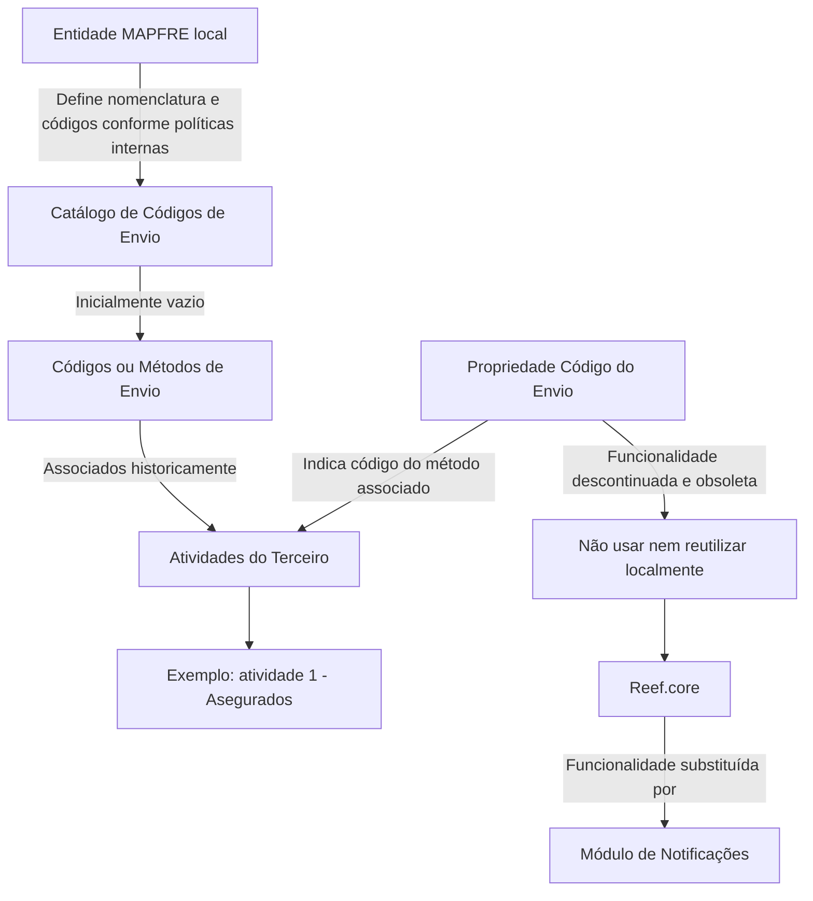

# Definição dos Métodos de Envio no Reef.core — Catálogo de Códigos e Obsolescência Funcional

## 1. Metadados do Documento
- **Arquivo de Origem:** Não identificado no conteúdo extraído
- **Tipo de Documento:** Especificação Técnica / Documentação Funcional
- **Domínio / Sistema:** Reef.core, Notificações, MAPFRE
- **Público-Alvo:** Desenvolvedores, Arquitetos, Operação e equipes locais MAPFRE
- **Data/Versão Identificada:** Não identificada
- **Status de ciclo de vida identificado:** Approved Source
- **Proprietário identificado:** `user:agonzalez_mapfre.com`

---

## 2. Resumo Executivo & Contexto de Negócio

O documento descreve a definição funcional dos **Métodos de Envio** no núcleo do sistema, incluindo o conceito de um catálogo de códigos utilizado para identificar e codificar possíveis formas de envio de informações às entidades. O catálogo é entregue inicialmente sem conteúdo.

No modelo originalmente descrito, o campo ou propriedade **Código do Envio** determina o código do Método de Envio associado às atividades de um Terceiro. O documento apresenta como referência a atividade `1 - Asegurados` e fornece exemplos de códigos para correio eletrônico, correio postal, fax e SMS.

Entretanto, a funcionalidade associada à propriedade de Código do Envio está explicitamente marcada como **descontinuada e obsoleta no núcleo do sistema**. Portanto, o mecanismo não pode ser utilizado nem reutilizado para finalidades de âmbito local.

O documento informa que a funcionalidade foi substituída no núcleo do **Reef.core** pelo módulo de **Notificações**. Assim, qualquer necessidade atual de gestão ou execução de notificações deve considerar o módulo de Notificações, sem assumir que o catálogo legado de Métodos de Envio continue operacional.

A responsabilidade pela nomenclatura, definição e codificação dos códigos de envio pertence à entidade MAPFRE local, de acordo com as respectivas políticas e procedimentos internos. O documento não detalha a estrutura, configuração, APIs, métodos HTTP, contratos JSON ou regras operacionais do módulo de Notificações.

---

## 3. Arquitetura, Componentes & Tecnologias Envolvidas

### Componentes e domínios identificados

| Componente / Domínio | Papel identificado no documento | Situação |
| :--- | :--- | :--- |
| Núcleo do Sistema | Possuía a funcionalidade para identificar e codificar possíveis Métodos de Envio em um catálogo. | Funcionalidade obsoleta para esse propósito. |
| Catálogo de Códigos de Envio | Catálogo de informações entregue inicialmente vazio às entidades para cadastrar possíveis códigos ou métodos de envio. | Associado à funcionalidade descontinuada. |
| Código do Envio | Propriedade que indicava o código do Método de Envio associado às atividades do Terceiro. | Descontinuada e não reutilizável localmente. |
| Atividades do Terceiro | Entidade funcional à qual o Código do Envio poderia ser associado. | Exemplo citado: atividade `1 - Asegurados`. |
| Reef.core | Núcleo do sistema mencionado como ambiente no qual a funcionalidade legada foi substituída. | Usa o módulo de Notificações como substituto. |
| Módulo de Notificações | Módulo que substitui a funcionalidade obsoleta de Métodos de Envio no núcleo do Reef.core. | Módulo substituto; sem detalhamento técnico adicional. |
| Entidade MAPFRE local | Responsável por nomenclatura e definição dos códigos de envio segundo políticas e procedimentos internos. | Responsabilidade organizacional local. |
| Tesorería A1001100 | Referência mencionada em pendência para inclusão de link sobre definição de impostos e retenções. | Não detalhada. |

### Fluxo funcional extraído



> **Nota de Análise:** O documento afirma que o módulo de Notificações substituiu a funcionalidade legada, mas não descreve fluxos internos, interfaces, métodos de integração, APIs, contratos de dados ou configuração desse módulo.

---

## 4. Regras de Negócio, Especificações Funcionais & Processos

### 4.1 Catálogo de Métodos de Envio

1. O núcleo do sistema possui ou possuía capacidade funcional para identificar e codificar possíveis Códigos ou Métodos de Envio de informação.
2. Os possíveis Códigos ou Métodos de Envio são organizados em um catálogo de informações.
3. O catálogo é entregue às entidades inicialmente sem conteúdo.
4. A definição dos códigos aplicáveis deve ser realizada pela entidade MAPFRE local, conforme suas políticas e procedimentos internos.

### 4.2 Propriedade Código do Envio

1. A propriedade **Código do Envio** indica o código do Método de Envio associado às atividades do Terceiro.
2. O documento utiliza a atividade `1 - Asegurados` como exemplo de contexto de associação.
3. Os códigos apresentados incluem:
   - `001` — Correo Electrónico.
   - `002` — Correo Postal.
   - `003` — Fax.
   - `004` — SMS.
4. O documento não informa se os códigos listados são exaustivos, obrigatórios, configuráveis, válidos em todos os ambientes ou aplicáveis a todas as atividades do Terceiro.

### 4.3 Restrição crítica de uso

1. A funcionalidade da propriedade Código do Envio está **descontinuada e obsoleta no núcleo do sistema**.
2. A funcionalidade não pode ser usada para qualquer propósito de âmbito local.
3. A funcionalidade também não pode ser reutilizada localmente.
4. O substituto indicado no núcleo do Reef.core é o módulo de **Notificações**.

### 4.4 Responsabilidade organizacional

1. A responsabilidade pela nomenclatura dos códigos de envio é da entidade MAPFRE local.
2. A responsabilidade pela definição dos códigos de envio é da entidade MAPFRE local.
3. A definição deve obedecer às políticas internas e aos procedimentos internos locais.
4. O documento não define uma nomenclatura corporativa global, processo de aprovação, governança central, mecanismo de versionamento ou catálogo padronizado de códigos.

### 4.5 Pendência documental identificada

O conteúdo inicia com a seguinte pendência:

> `Pendiente Falta: Colocar el enlace al documento de definición de los impuestos y retenciones de la Tesorería A1001100`

Essa pendência menciona a necessidade de inserir um link para um documento de definição de impostos e retenções da Tesorería `A1001100`. Não há URL, localização documental, conteúdo de impostos, conteúdo de retenções ou relação funcional detalhada com os Métodos de Envio no trecho fornecido.

---

## 5. Tabelas de Parâmetros, Ambientes e Estruturas de Dados

### 5.1 Códigos de Métodos de Envio apresentados

| Item / Parâmetro | Descrição / Função | Tipo / Valores / Formato | Ambiente / Observações |
| :--- | :--- | :--- | :--- |
| Código do Envio | Indica o código do Método de Envio que seria associado às atividades do Terceiro. | Código numérico textual, conforme exemplos `001`, `002`, `003`, `004`. | Funcionalidade descontinuada e obsoleta no núcleo do sistema. Não usar ou reutilizar localmente. |
| Método de Envio `001` | Correo Electrónico. | Código `001`. | Exemplo apresentado para a atividade `1 - Asegurados`. |
| Método de Envio `002` | Correo Postal. | Código `002`. | Exemplo apresentado para a atividade `1 - Asegurados`. |
| Método de Envio `003` | Fax. | Código `003`. | Exemplo apresentado para a atividade `1 - Asegurados`. |
| Método de Envio `004` | SMS. | Código `004`. | Exemplo apresentado para a atividade `1 - Asegurados`. |
| Outros Métodos de Envio | O documento indica continuidade da lista por meio de `... ...`. | Não especificado. | Não há lista completa no conteúdo extraído. |

### 5.2 Componentes, responsabilidades e estado funcional

| Item / Parâmetro | Descrição / Função | Tipo / Valores / Formato | Ambiente / Observações |
| :--- | :--- | :--- | :--- |
| Catálogo de Códigos de Envio | Catálogo de informações destinado à identificação e codificação de métodos de envio. | Catálogo entregue inicialmente vazio. | Sem modelo de dados detalhado. |
| Atividades do Terceiro | Contexto funcional que recebia associação com o Código do Envio. | Exemplo: `1 - Asegurados`. | Não há relação completa de atividades. |
| Entidade MAPFRE local | Responsável pela nomenclatura e definição de códigos de envio. | Políticas e procedimentos internos locais. | Não há responsáveis nominais, fluxo de aprovação ou regras corporativas globais descritas. |
| Reef.core | Núcleo do sistema no qual ocorreu a substituição funcional. | Sistema / núcleo aplicacional. | Módulo de Notificações é apontado como substituto. |
| Módulo de Notificações | Substituto da funcionalidade legada de Métodos de Envio. | Módulo funcional. | Métodos, configurações, APIs e contratos não identificados. |
| Tesorería A1001100 | Referência para documento de definição de impostos e retenções. | Identificador `A1001100`. | Link documental pendente. |
| Lifecycle | Estado de ciclo de vida exibido na documentação. | `Approved Source`. | Sem explicação do processo de aprovação. |
| Owner | Proprietário exibido na documentação. | `user:agonzalez_mapfre.com`. | Nome apresentado literalmente no conteúdo. |
| Idioma de interface | Idioma exibido na navegação da documentação. | `ES`. | Interface documental em espanhol. |

### 5.3 Ambientes, URLs e rotas técnicas

| Item / Parâmetro | Descrição / Função | Tipo / Valores / Formato | Ambiente / Observações |
| :--- | :--- | :--- | :--- |
| URLs de ambiente | Não identificadas. | Não aplicável. | O conteúdo não informa URLs. |
| Servidores | Não identificados. | Não aplicável. | O conteúdo não informa hosts, IPs ou servidores. |
| Portas | Não identificadas. | Não aplicável. | O conteúdo não informa portas de rede. |
| Rotas de logs | Não identificadas. | Não aplicável. | O conteúdo não informa caminhos de logs. |
| APIs e contratos JSON | Não identificados. | Não aplicável. | O conteúdo não informa métodos HTTP, endpoints ou contratos. |

---

## 6. Bateria de Perguntas & Respostas para RAG (FAQ Sintético)

### P1: Qual era a finalidade do Catálogo de Códigos de Envio no núcleo do sistema?
**R:** O Catálogo de Códigos de Envio tinha a finalidade de identificar e codificar possíveis Códigos ou Métodos de Envio de informações. O documento informa que esse catálogo era entregue às entidades inicialmente vazio de conteúdo.

### P2: O que representa a propriedade Código do Envio?
**R:** A propriedade Código do Envio indicava o código do Método de Envio que seria associado às atividades do Terceiro. O documento usa a atividade `1 - Asegurados` como exemplo de associação.

### P3: Quais Métodos de Envio são explicitamente listados no documento?
**R:** Os Métodos de Envio explicitamente listados são: `001` para Correo Electrónico, `002` para Correo Postal, `003` para Fax e `004` para SMS. O documento indica que poderiam existir outros métodos, mas não apresenta a lista completa.

### P4: A funcionalidade Código do Envio ainda pode ser usada em uma implementação local?
**R:** Não. O documento declara que essa funcionalidade está descontinuada e obsoleta no núcleo do sistema e que não pode ser usada ou reutilizada para nenhuma finalidade de âmbito local.

### P5: Qual módulo substituiu a funcionalidade legada de Métodos de Envio?
**R:** O documento informa que a funcionalidade foi substituída no núcleo do Reef.core pelo módulo de Notificações.

### P6: O documento descreve como configurar ou integrar o módulo de Notificações do Reef.core?
**R:** Não. O documento somente declara que o módulo de Notificações substituiu a funcionalidade legada. Não há detalhes sobre configuração, APIs, endpoints, métodos HTTP, eventos, contratos JSON, persistência ou regras operacionais do módulo.

### P7: Quem é responsável por definir a nomenclatura e os códigos de envio?
**R:** A responsabilidade pela nomenclatura e definição dos códigos de envio corresponde à entidade MAPFRE local, de acordo com suas políticas e procedimentos internos.

### P8: Existe uma padronização global de códigos de envio definida no conteúdo?
**R:** Não. O conteúdo atribui a responsabilidade de nomenclatura e definição à entidade MAPFRE local. O documento não especifica uma convenção corporativa global, governança central ou processo de homologação comum.

### P9: O catálogo de Códigos de Envio vem pré-configurado?
**R:** Não. O documento informa que o catálogo de informações é entregue às entidades inicialmente vazio de conteúdo.

### P10: Há informações sobre servidores, ambientes, URLs ou caminhos de logs?
**R:** Não. O conteúdo extraído não apresenta URLs, ambientes técnicos, servidores, portas, rotas de logs ou variáveis de configuração.

### P11: Qual é a pendência relacionada à Tesorería A1001100?
**R:** A pendência indica que falta inserir um link para o documento de definição dos impostos e retenções da Tesorería `A1001100`. O conteúdo não informa o link nem detalha o documento referido.

### P12: Qual é o status de ciclo de vida exibido na documentação?
**R:** O status de ciclo de vida exibido é `Approved Source`. O trecho não explica os critérios, responsáveis ou etapas associados a esse status.

---

## 7. Glossário de Termos, Siglas & Conceitos-Chave

- **Código do Envio:** Propriedade que indicava o código do Método de Envio associado às atividades do Terceiro.
- **Método de Envio:** Forma codificada de envio de informações, como Correo Electrónico, Correo Postal, Fax ou SMS.
- **Catálogo de Códigos de Envio:** Catálogo de informações destinado a identificar e codificar possíveis Métodos de Envio; é entregue inicialmente vazio às entidades.
- **Correo Electrónico:** Método de Envio associado ao código `001`.
- **Correo Postal:** Método de Envio associado ao código `002`.
- **Fax:** Método de Envio associado ao código `003`.
- **SMS:** Método de Envio associado ao código `004`.
- **Terceiro:** Entidade cujas atividades poderiam receber associação com um Código do Envio.
- **Asegurados:** Atividade identificada como `1 - Asegurados`, utilizada como exemplo no documento.
- **Reef.core:** Núcleo do sistema citado como ambiente em que a funcionalidade legada foi substituída.
- **Módulo de Notificações:** Módulo do Reef.core apontado como substituto da funcionalidade obsoleta de Métodos de Envio.
- **MAPFRE local:** Entidade local responsável por definir nomenclatura e códigos de envio segundo políticas e procedimentos internos.
- **Tesorería A1001100:** Referência a uma documentação de definição de impostos e retenções cujo link está pendente.
- **Approved Source:** Valor de ciclo de vida exibido na documentação; não definido adicionalmente no texto.

---

## 8. Notas Críticas, Riscos & Limitações

- **Funcionalidade legada e obsoleta:** O Código do Envio não pode ser usado nem reutilizado localmente. A adoção desse mecanismo em novos desenvolvimentos, parametrizações ou integrações contrariaria a restrição explícita do documento.
- **Substituição sem especificação técnica:** Embora o módulo de Notificações seja citado como substituto, não há descrição técnica suficiente para implementar, configurar, validar ou operar essa substituição com base apenas no conteúdo fornecido.
- **Risco de interpretação dos códigos como padrão ativo:** Os códigos `001` a `004` são apresentados no contexto da funcionalidade legada. O documento não confirma que esses códigos sejam válidos, suportados ou configuráveis no módulo atual de Notificações.
- **Ausência de modelo de governança detalhado:** A responsabilidade é atribuída à entidade MAPFRE local, mas não há regras de aprovação, controle de qualidade, versionamento, responsáveis nominais ou processo de publicação dos códigos.
- **Ausência de detalhes operacionais:** Não existem URLs, ambientes, servidores, portas, logs, credenciais, rotas de monitoramento, APIs ou contratos de integração no material extraído.
- **Pendência documental:** Há uma indicação explícita de que falta inserir o link para o documento sobre impostos e retenções da Tesorería `A1001100`.
- **Limitação de extração:** O texto contém caracteres potencialmente corrompidos ou substituídos, como `identicar`, `denición` e `Noticaciones`. A referência bruta abaixo preserva esses trechos para auditoria.

---

## 9. Conteúdo Bruto Estruturado (Referência Fiel)

```text
--- [PÁGINA 1 DE 2] ---

Pendiente Falta: Colocar el enlace al documento de denición de los impuestos y retenciones de la Tesorería A1001100
DEFINICIÓN de los Métodos de Envío
Contexto
Funcionalmente, el núcleo del Sistema cuenta con la posibilidad de identicar y codicar los posibles Códigos o Métodos de Envío de
información en un catálogo de información que se entrega a las entidades inicialmente vacío de contenido.
Código del Envío
Esta propiedad indica en el sistema el código del Método de Envío que se asociará a las actividades del Tercero. Como ejemplo y para la
actividad 1 - Asegurados:
Método de Envío Signicado
001 Correo Electrónico
002 Correo Postal
003 Fax
004 SMS
... ...
La funcionalidad de esta propiedad está descontinuada y obsoleta en el núcleo del sistema por lo que no se puede usar o reutilizar para
ningún propósito de ámbito local.
NOTA: La funcionalidad ha sido sustituida en el núcleo de Reef.core por el módulo de Noticaciones.
Vínculos
Preguntas frecuentes
(1) ¿Existe alguna recomendación operativa que deba ser tomada en consideración localmente en la codicación, estandarización, uso y
denición del Catálogo de Códigos de Envío en el Sistema?
La responsabilidad en la nomenclatura y denición de los códigos de Envío corresponde a la entidad MAPFRE local de acuerdo con sus
políticas y procedimientos internos
Documentation / DOCUMENTACIÓN Reef
DOCUMENTACIÓN Reef
Mapfredocument
DOCUMENTACIÓN Reef
Owner
user:agonzalez_mapfre.com
Lifecycle
Approved Source
 /
VL
Buscar Inicio Soluciones Arquitecturas APIs Componentes Cloud Documentación Zeus Reef Ayuda
ES

--- [PÁGINA 2 DE 2] ---

[Página em branco ou apenas elementos visuais/imagem]
```
