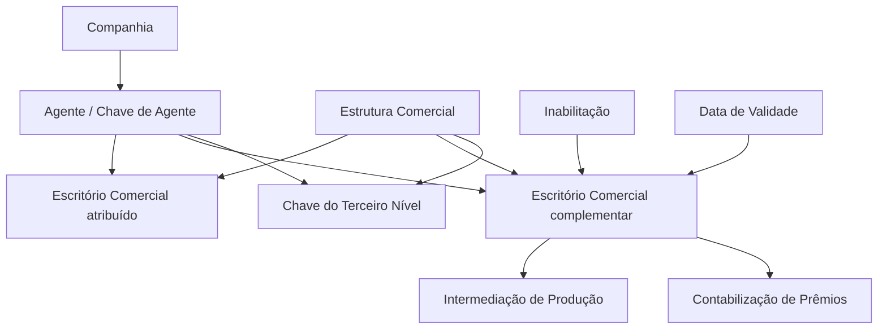

# Definição das Escritórios Habilitados por Agente

## 1. Metadados do Documento
- **Arquivo de Origem:** `Não identificado — texto bruto fornecido pelo solicitante`
- **Tipo de Documento:** `Especificação Funcional`
- **Domínio / Sistema:** `Reef / Estrutura Comercial / Agentes`
- **Público-Alvo:** `Negócio, analistas funcionais, operação e equipes responsáveis pela configuração do sistema`
- **Data/Versão Identificada:** `Não identificada`
- **Estado do documento identificado:** `Approved Source`
- **Proprietário identificado:** `user:agonzalez_mapfre.com`

---

## 2. Resumo Executivo & Contexto de Negócio

O documento descreve a definição de escritórios comerciais habilitados para agentes configurados no sistema. Cada agente possui um escritório atribuído dentro da Estrutura Comercial da Companhia, sendo essa atribuição normalmente unívoca.

Em situações motivadas por razões comerciais, um agente pode ser autorizado a emitir produção em escritórios complementares. O objetivo funcional é associar uma ou mais chaves de escritórios complementares ao agente para que o agente possa intermediar a produção e contabilizar os respectivos prêmios nesses escritórios.

A configuração é composta por propriedades gerais — Companhia, Chave de Agente e Chave do Terceiro Nível — e por propriedades adicionais — Inabilitação e Data de Validade. Essas propriedades identificam o contexto organizacional da associação, o intermediário configurado, o terceiro nível da estrutura comercial e a vigência operacional da associação.

A Data de Validade permite registrar a data a partir da qual a associação entre agente e escritório está habilitada para uso no sistema. Segundo o documento, o uso correto dessa data permite manter um histórico das alterações realizadas nas definições configuradas.

---

## 3. Arquitetura, Componentes & Tecnologias Envolvidas

O conteúdo não descreve uma arquitetura técnica de software, APIs, microsserviços, bancos de dados, protocolos ou ambientes de infraestrutura. O documento apresenta uma estrutura funcional de associação entre Companhia, Agente, Estrutura Comercial e Escritórios Comerciais.

Componentes e entidades funcionais identificados:

| Componente / Entidade | Papel descrito |
| :--- | :--- |
| Sistema | Mantém os agentes configurados e suas associações com escritórios da Estrutura Comercial. |
| Companhia | Contexto organizacional cujo código é registrado na associação entre o agente e o escritório comercial. |
| Agente | Intermediário configurado no sistema, identificado pela Chave de Agente. |
| Estrutura Comercial | Estrutura organizacional que contém os escritórios comerciais utilizados nas associações. |
| Escritório Comercial | Escritório da Estrutura Comercial associado ao agente; pode ser o escritório atribuído normalmente ou um escritório complementar. |
| Escritório Complementar | Escritório adicional no qual o agente pode intermediar produção e contabilizar prêmios, quando permitido por razões comerciais. |
| Terceiro Nível | Código que identifica o terceiro nível da Estrutura Comercial no sistema. |
| Produção | Produção que o agente pode intermediar nos escritórios complementares habilitados. |
| Prêmios | Valores que podem ser contabilizados nos escritórios complementares habilitados. |



> **Nota de Análise:** O diagrama representa somente as relações funcionais explicitadas no documento. O conteúdo não detalha implementação técnica, persistência de dados, serviços, APIs, contratos JSON, métodos HTTP ou fluxos de integração.

---

## 4. Regras de Negócio, Especificações Funcionais & Processos

### 4.1 Regra de atribuição normal de escritório ao agente

1. Todos os agentes configurados no sistema possuem um escritório da Estrutura Comercial da Companhia atribuído.
2. A atribuição de um escritório comercial a um agente é normalmente unívoca.
3. O documento não detalha o processo de criação inicial dessa atribuição unívoca.

### 4.2 Regra de escritórios complementares

1. Por motivos comerciais, um agente pode emitir produção em escritórios complementares.
2. A funcionalidade permite associar ao agente uma ou mais chaves de escritórios complementares da Estrutura Comercial.
3. Os escritórios complementares habilitados permitem ao agente:
   - Intermediar a sua produção.
   - Contabilizar os seus prêmios.
4. O documento não informa critérios comerciais, papéis autorizadores, limites quantitativos ou fluxo de aprovação para a associação de escritórios complementares.

### 4.3 Regra de identificação da associação

1. A associação deve registrar o código da Companhia na qual o código do escritório comercial está sendo associado ao agente.
2. A associação deve identificar o intermediário por meio da Chave de Agente, conforme configurações previamente estabelecidas.
3. A associação deve conter a Chave do Terceiro Nível da Estrutura Comercial.
4. O documento não detalha a composição, o formato ou as regras de validação das chaves utilizadas.

### 4.4 Regra de inabilitação

1. A propriedade **Inabilitação** determina que o escritório da Estrutura Comercial associado à chave do agente está inabilitado para utilização no sistema.
2. O documento não especifica se a inabilitação é reversível, se possui data de efeito, se impede emissão de produção já iniciada ou se afeta contabilizações históricas.

### 4.5 Regra de vigência e histórico

1. A propriedade **Data de Validade** estabelece a data a partir da qual a associação entre agente e escritório está habilitada para uso no sistema.
2. A utilização correta da Data de Validade permite manter um histórico das mudanças efetuadas nas definições configuradas.
3. O documento não informa formato de data, fuso horário, comportamento para datas futuras, regras de sobreposição de vigências ou política de encerramento de uma associação anterior.

### 4.6 Diretriz documental relacionada

O documento recomenda a leitura da diretriz ou documento funcional denominado **Estructura Comercial de la Entidad**, pois a interpretação isolada do documento atual pode conduzir a erro.

### 4.7 Esclarecimento operacional local

A seção de perguntas frequentes pergunta se existe algum esclarecimento operacional que deva ser considerado localmente na atribuição dos escritórios comerciais aos agentes. A resposta apresentada é **N/A**.

---

## 5. Tabelas de Parâmetros, Ambientes e Estruturas de Dados

### 5.1 Propriedades gerais da associação

| Item / Parâmetro | Descrição / Função | Tipo / Valores / Formato | Ambiente / Observações |
| :--- | :--- | :--- | :--- |
| Companhia | Contém o código da Companhia na qual o código do Escritório Comercial está sendo associado ao Agente. | Código de Companhia. Formato não detalhado. | Propriedade geral da associação. |
| Chave de Agente | Identifica a chave do intermediário conforme configurações previamente estabelecidas. | Chave de intermediário. Formato não detalhado. | Propriedade geral da associação. |
| Chave do Terceiro Nível | Contém o código que identificará o Terceiro Nível da Estrutura Comercial no sistema. | Código de estrutura comercial. Formato não detalhado. | Propriedade geral da associação. |

### 5.2 Outras propriedades da associação

| Item / Parâmetro | Descrição / Função | Tipo / Valores / Formato | Ambiente / Observações |
| :--- | :--- | :--- | :--- |
| Inabilitação | Define que o Escritório da Estrutura Comercial associado à chave do Agente está inabilitado para uso no sistema. | Indicador de inabilitação. Valores não detalhados. | Não há detalhes sobre reversão, data de efeito ou impacto operacional. |
| Data de Validade | Define a data a partir da qual a associação entre Agente e Escritório está habilitada no sistema. | Data. Formato não detalhado. | Permite manter histórico das alterações efetuadas nas definições configuradas. |

### 5.3 Entidades e relações funcionais

| Item / Parâmetro | Descrição / Função | Tipo / Valores / Formato | Ambiente / Observações |
| :--- | :--- | :--- | :--- |
| Agente | Intermediário configurado no sistema. | Entidade funcional. | Possui um escritório atribuído e pode possuir escritórios complementares. |
| Escritório Comercial | Escritório pertencente à Estrutura Comercial da Companhia. | Entidade funcional. | Pode ser associado a um agente. |
| Escritório Complementar | Escritório adicional habilitado para o agente por razões comerciais. | Uma ou mais chaves de escritório. | Permite intermediar produção e contabilizar prêmios. |
| Estrutura Comercial | Estrutura que contém os escritórios comerciais. | Estrutura organizacional. | Inclui o Terceiro Nível identificado pela respectiva chave. |
| Produção | Produção intermediada pelo agente. | Conceito de negócio. | Pode ser emitida em escritórios complementares habilitados. |
| Prêmios | Prêmios associados à produção do agente. | Conceito de negócio. | Podem ser contabilizados em escritórios complementares habilitados. |

### 5.4 Ambientes, servidores e logs

| Item / Parâmetro | Descrição / Função | Tipo / Valores / Formato | Ambiente / Observações |
| :--- | :--- | :--- | :--- |
| Ambientes | Não identificados no conteúdo fornecido. | N/A | O documento não apresenta URLs, servidores ou mapeamento de ambientes. |
| Logs | Não identificados no conteúdo fornecido. | N/A | O documento não apresenta rotas, variáveis ou níveis de log. |
| APIs / Serviços | Não identificados no conteúdo fornecido. | N/A | O documento não detalha APIs, contratos, endpoints ou integrações técnicas. |

---

## 6. Bateria de Perguntas & Respostas para RAG (FAQ Sintético)

### P1: Qual é o objetivo da definição de escritórios habilitados por agente?
**R:** O objetivo é associar ao agente uma ou mais chaves de escritórios complementares da Estrutura Comercial nos quais o agente poderá intermediar sua produção e contabilizar seus prêmios.

### P2: Todo agente configurado no sistema possui um escritório comercial atribuído?
**R:** Sim. O documento afirma que todos os agentes configurados no sistema possuem um escritório da Estrutura Comercial da Companhia atribuído.

### P3: A associação entre agente e escritório comercial é sempre única?
**R:** Normalmente, a atribuição é unívoca. Entretanto, por razões comerciais, pode ser permitido que o agente emita sua produção em outros escritórios complementares.

### P4: O que um agente pode fazer em um escritório comercial complementar habilitado?
**R:** Em um escritório complementar habilitado, o agente pode intermediar sua produção e contabilizar seus prêmios.

### P5: O que representa a propriedade Companhia na associação do agente com o escritório?
**R:** A propriedade Companhia contém o código da Companhia na qual está sendo realizada a associação entre o agente e o código do Escritório Comercial.

### P6: Como a Chave de Agente é definida no documento?
**R:** A Chave de Agente identifica a chave do intermediário de acordo com configurações previamente estabelecidas. O documento não detalha o formato dessa chave nem o processo de configuração anterior.

### P7: Qual é a finalidade da Chave do Terceiro Nível?
**R:** A Chave do Terceiro Nível contém o código que identificará o Terceiro Nível da Estrutura Comercial no sistema.

### P8: O que acontece quando um escritório associado à chave do agente está marcado com Inabilitação?
**R:** A propriedade Inabilitação estabelece que o Escritório da Estrutura Comercial associado à chave do agente encontra-se inabilitado para poder ser utilizado no sistema.

### P9: Para que serve a Data de Validade da associação entre agente e escritório?
**R:** A Data de Validade estabelece a data a partir da qual a associação entre o agente e o escritório está habilitada para uso no sistema. Seu uso correto permite manter um histórico das alterações realizadas nas definições configuradas.

### P10: O documento especifica como tratar sobreposição de datas de validade ou encerramento de associações antigas?
**R:** Não. O documento explica que a Data de Validade viabiliza histórico das mudanças, mas não apresenta regras para sobreposição de vigências, encerramento de associações anteriores, datas futuras ou formato de data.

### P11: Existe uma orientação operacional local adicional para a atribuição de escritórios comerciais aos agentes?
**R:** Não. Na seção de perguntas frequentes, a resposta para a existência de esclarecimentos operacionais locais é “N/A”.

### P12: Qual documento relacionado deve ser consultado para evitar interpretação isolada incorreta?
**R:** O documento recomenda a leitura de **Estructura Comercial de la Entidad**, apresentado como relação de diretrizes e documentos funcionais cuja leitura é recomendada para evitar interpretações incorretas do documento atual quando analisado isoladamente.

---

## 7. Glossário de Termos, Siglas & Conceitos-Chave

- **Agente:** Intermediário configurado no sistema e identificado por uma Chave de Agente.
- **Chave de Agente:** Propriedade que identifica a chave do intermediário conforme configurações previamente estabelecidas.
- **Chave do Terceiro Nível:** Código que identifica o Terceiro Nível da Estrutura Comercial no sistema.
- **Companhia:** Entidade cujo código é registrado no contexto da associação do agente ao Escritório Comercial.
- **Escritório Comercial:** Escritório pertencente à Estrutura Comercial e associado ao agente.
- **Escritório Complementar:** Escritório adicional em que o agente pode intermediar produção e contabilizar prêmios, quando permitido.
- **Estrutura Comercial:** Estrutura organizacional da Companhia que contém os escritórios comerciais.
- **Inabilitação:** Propriedade que determina que o Escritório da Estrutura Comercial associado à chave do agente não pode ser utilizado no sistema.
- **Data de Validade:** Data a partir da qual a associação entre agente e escritório está habilitada para uso no sistema.
- **Intermediário:** Agente identificado pela Chave de Agente.
- **Produção:** Produção que o agente pode intermediar em escritórios complementares habilitados.
- **Prêmios:** Prêmios que o agente pode contabilizar nos escritórios complementares habilitados.
- **N/A:** Resposta apresentada no documento para indicar ausência de esclarecimento operacional local adicional.

---

## 8. Notas Críticas, Riscos & Limitações

- O documento não especifica tecnologias, arquitetura de aplicação, integrações, APIs, serviços, bancos de dados, ambientes, URLs, servidores ou mecanismos de log.
- O documento não informa formatos, tamanhos, obrigatoriedade ou regras de validação para Companhia, Chave de Agente, Chave do Terceiro Nível e Data de Validade.
- Não há detalhamento sobre as regras comerciais que justificam a habilitação de escritórios complementares, nem sobre responsáveis, aprovadores ou controles de autorização.
- Não há definição sobre quantidade máxima de escritórios complementares por agente.
- Não há explicação sobre reversibilidade, efeito temporal ou impactos históricos da propriedade Inabilitação.
- Não há regras sobre sobreposição de datas de validade, fim de vigência, retroatividade, datas futuras ou tratamento de associações simultâneas.
- A leitura isolada do documento pode conduzir a erro; o próprio conteúdo recomenda a consulta de **Estructura Comercial de la Entidad**.
- A FAQ não apresenta orientação operacional local adicional, pois responde **N/A**.
- **Nota de Análise:** O documento lista propriedades funcionais, porém não detalha tela de configuração, operações de criação, alteração, consulta, exclusão, auditoria ou controles de acesso.

---

## 9. Conteúdo Bruto Estruturado (Referência Fiel)

```text
--- [PÁGINA 1 DE 2] ---

DEFINICIÓN de las Ocinas Habilitadas por Agente

Contexto
Todos y cada uno de los Agentes congurados en el Sistema tienen asignada una Ocina de la Estructura Comercial de la Compañía.
Normalmente esta asignación es unívoca pero en ocasiones y por motivos comerciales se permite que un agente pueda emitir su producción
en otras Ocinas complementarias.

Objetivo
Asignar/Asociar a los Agentes la/s clave/s de las Ocinas Complementarias de la Estructura Comercial en las que van a poder intermediar su
Producción y contabilizar sus primas.

Propiedades Generales
Otras Propiedades

Propiedades Generales

Compañía
Este atributo contiene el código de la compañía en la que se está asociando al Agente el Código de la Ocina Comercial.

Clave de Agente
Esta propiedad identica la clave del intermediario de acuerdo con la conguración de las mismas previamente establecidas.

Clave del Tercer Nivel
Este atributo contiene el código por el que se identicará el Tercer Nivel de la Estructura Comercial en el Sistema.

Otras Propiedades

Inhabilitación
Esta propiedad establece que la Ocina de la Estructura Comercial asociada a la clave del Agente, se encuentra inhabilitada para poder ser
utilizada en el Sistema.

Fecha de Validez
Esta propiedad establece la fecha a partir de la cual la asociación del Agente y la Ocina está habilitada en el sistema para ser utilizada, por
lo que su correcto uso permite tener un histórico de los cambios efectuados en las deniciones conguradas.

Documentation / DOCUMENTACIÓN Reef
DOCUMENTACIÓN Reef
Mapfredocument
DOCUMENTACIÓN Reef

Owner
user:agonzalez_mapfre.com

Lifecycle
Approved Source

/
VL

Buscar Inicio Soluciones Arquitecturas APIs Componentes Cloud Documentación Zeus Reef Ayuda
ES

--- [PÁGINA 2 DE 2] ---

Vínculos
Relación de Directrices y Documentos funcionales cuya lectura recomendada para evitar que la interpretación aislada del presente
documento pueda conducir a error.

Estructura Comercial de la Entidad

Preguntas frecuentes
(1) ¿Existe alguna aclaración operativa que deba ser tomada en consideración localmente en la asignación de las Ocinas Comerciales a los
Agentes?

N/A
```
