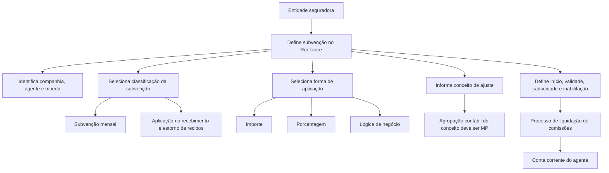

# Definição de Subvenções Concedidas aos Agentes no Reef.core

## 1. Metadados do Documento
- **Arquivo de Origem:** Não informado; conteúdo bruto fornecido na solicitação.
- **Tipo de Documento:** Especificação Funcional.
- **Domínio / Sistema:** Reef.core — liquidação de comissões e subvenções à força de vendas.
- **Público-Alvo:** Negócio, analistas funcionais, configuradores do Reef.core e equipes de operação de comissões.
- **Data/Versão Identificada:** Não identificada.
- **Proprietário identificado no conteúdo:** `user:agonzalez_mapfre.com`.
- **Ciclo de vida identificado:** `Approved`.

---

## 2. Resumo Executivo & Contexto de Negócio

O documento descreve a definição e configuração de subvenções concedidas a agentes no sistema Reef.core. Uma subvenção é caracterizada como uma ajuda econômica destinada a uma pessoa ou instituição para executar uma atividade considerada de interesse.

No contexto funcional do Reef.core, as subvenções são utilizadas como estratégia de gratificação e reconhecimento da força de vendas de uma entidade seguradora. A finalidade declarada é gerar vínculo de lealdade e compromisso entre a seguradora e os seus intermediários ou agentes.

O objetivo operacional da configuração é determinar as subvenções que a companhia seguradora pretende estabelecer e incorporá-las como comissões específicas no processo de liquidação de comissões do Reef.core. A definição inclui propriedades identificativas, operativas e outras propriedades de governança do registro.

O documento define duas classificações de subvenção: subvenção mensal e aplicação no recebimento e estorno de recebimento de recibos. A forma de aplicação pode ser por valor monetário, percentual ou lógica de negócio. A configuração também controla vigência, inabilitação, histórico de alterações e a associação do pagamento a um conceito de ajuste de comissões.

---

## 3. Arquitetura, Componentes & Tecnologias Envolvidas

### Sistemas, componentes e conceitos identificados

| Componente / Conceito | Papel descrito no documento |
| :--- | :--- |
| **Reef.core** | Sistema que permite configurar subvenções para a força de vendas e considerá-las no processo de liquidação de comissões. |
| **Entidade seguradora** | Organização que define os critérios, valores, percentuais, lógicas de negócio e regras aplicáveis às subvenções. |
| **Agente / Intermediário** | Beneficiário da subvenção; é identificado por uma chave de agente. |
| **Força de vendas** | Público para o qual a entidade seguradora pode configurar subvenções como estratégia de gratificação e reconhecimento. |
| **Processo de liquidação de comissões** | Processo corporativo que utiliza as definições de subvenções habilitadas e válidas. |
| **Conta corrente do agente** | Local onde o código do conceito de ajuste identifica especificamente a subvenção satisfeita ao agente. |
| **Conceito de ajuste de comissões** | Código usado para identificar a subvenção na conta corrente do agente; sua agrupação contábil deve ser do tipo `MP`. |
| **Lógica de negócio** | Mecanismo configurável para avaliar dinamicamente critérios da seguradora e obter o valor ou o percentual de subvenção. |
| **Monedas** | Documento vinculado recomendado para leitura complementar. |

### Fluxo funcional extraído



> **Nota de Análise:** O documento não descreve interfaces técnicas, métodos HTTP, contratos JSON, bancos de dados, URLs de ambientes, integrações externas ou mecanismos de execução da lógica de negócio.

---

## 4. Regras de Negócio, Especificações Funcionais & Processos

### 4.1 Finalidade da subvenção

1. A subvenção é uma ajuda econômica concedida a uma pessoa ou instituição para realizar uma atividade considerada de interesse.
2. No Reef.core, a subvenção pode ser configurada para a força de vendas da entidade seguradora.
3. A subvenção é tratada como estratégia de gratificação e reconhecimento.
4. O uso de subvenções busca criar um vínculo de lealdade e compromisso entre a entidade seguradora e a força de vendas.
5. As subvenções configuradas são consideradas como comissões específicas durante o processo de liquidação de comissões.

### 4.2 Propriedades identificativas

1. **Companhia:** determina o código da companhia para a qual a definição de subvenção está sendo realizada.
2. **Chave de agente:** identifica a chave do intermediário conforme a identificação e definição efetuadas pela entidade seguradora.
3. **Moeda:** indica o código da moeda para a qual a subvenção é concedida.
4. **Classificação da subvenção:** deve assumir um dos valores corporativos configurados no Reef.core:
   - `SUBVENCIÓN MENSUAL`;
   - `APLICACIÓN EN EL COBRO Y ANULADO DE COBRO DE LOS RECIBOS`.
5. **Forma de aplicação da subvenção:** deve assumir um dos valores corporativos configurados no Reef.core:
   - `IMPORTE`, de acordo com a moeda da definição;
   - `PORCENTAJE`;
   - `LÓGICA DE NEGOCIO`.
6. **Código do conceito de ajuste:** identifica o código do conceito de ajuste de comissões que identificará especificamente, na conta corrente do agente, a subvenção satisfeita.
7. A agrupação contábil do conceito de ajuste deve ser do tipo `MP`.

### 4.3 Propriedades operativas

1. **Data de início da concessão da subvenção:** identifica a data a partir da qual a subvenção é concedida ao agente.
2. **Data de caducidade da concessão da subvenção:** determina a data de expiração da subvenção concedida.
3. **Valor da subvenção:** aplica-se quando a forma de aplicação da subvenção é `IMPORTE`; identifica o valor concedido ao agente.
4. **Percentual da subvenção:** aplica-se quando a forma de aplicação é `PORCENTAJE`; identifica o percentual aplicado sobre o total das comissões do agente.
5. **Lógica de negócio para obter valor ou percentual:** aplica-se quando a forma de aplicação é `LÓGICA DE NEGOCIO`; permite avaliar dinamicamente critérios de negócio considerados pela entidade seguradora para obter o valor ou o percentual a aplicar.
6. **Valor mínimo de cobrança:** aplica-se quando a classificação é `SUBVENCIÓN MENSUAL`; determina o valor mínimo que o agente precisa cobrar para receber a subvenção mensal.

### 4.4 Outras propriedades e governança

1. **Inabilitação:** informa ao Reef.core que o registro de subvenção está inabilitado e não pode ser utilizado no processo de liquidação de comissões da entidade seguradora.
2. **Data de validade:** estabelece a data a partir da qual a definição está disponível para uso no sistema e nos processos que devem considerá-la.
3. O uso correto da data de validade permite manter um histórico das alterações efetuadas nas definições de subvenções.
4. Os códigos de conceitos de ajuste informados no catálogo de subvenções devem estar livres de impostos.

---

## 5. Tabelas de Parâmetros, Ambientes e Estruturas de Dados

### 5.1 Propriedades identificativas

| Item / Parâmetro | Descrição / Função | Tipo / Valores / Formato | Ambiente / Observações |
| :--- | :--- | :--- | :--- |
| Companhia | Determina o código da companhia sobre a qual é realizada a definição. | Código de companhia. | Não detalhado. |
| Chave de agente | Identifica a chave do intermediário conforme a identificação e definição da entidade seguradora. | Chave de agente / intermediário. | Não detalhado. |
| Moeda | Indica o código da moeda para a qual a subvenção é concedida. | Código de moeda. | Documento vinculado: `Monedas`. |
| Classificação da subvenção | Determina a classificação da subvenção concedida. | `SUBVENCIÓN MENSUAL`; `APLICACIÓN EN EL COBRO Y ANULADO DE COBRO DE LOS RECIBOS`. | Valores configurados corporativamente no Reef.core. |
| Forma de aplicação da subvenção | Determina como a subvenção será calculada ou aplicada. | `IMPORTE`; `PORCENTAJE`; `LÓGICA DE NEGOCIO`. | Valores configurados corporativamente no Reef.core. |
| Código do conceito de ajuste | Identifica o conceito de ajuste de comissões que identifica a subvenção na conta corrente do agente. | Código de conceito de ajuste. | Agrupação contábil obrigatoriamente do tipo `MP`. |

### 5.2 Propriedades operativas

| Item / Parâmetro | Descrição / Função | Tipo / Valores / Formato | Ambiente / Observações |
| :--- | :--- | :--- | :--- |
| Data de início da concessão | Data a partir da qual a subvenção é concedida ao agente. | Data. | Não detalhado. |
| Data de caducidade da concessão | Data de expiração da subvenção concedida. | Data. | Não detalhado. |
| Valor da subvenção | Define o valor concedido ao agente. | Valor monetário. | Aplicável somente quando a forma de aplicação é `IMPORTE`; segue a moeda da definição. |
| Percentual da subvenção | Define o percentual a aplicar sobre o total das comissões do agente. | Percentual. | Aplicável somente quando a forma de aplicação é `PORCENTAJE`. |
| Lógica de negócio para valor ou percentual | Avalia dinamicamente critérios de negócio para obter o valor ou percentual aplicável. | Lógica de negócio. | Aplicável somente quando a forma de aplicação é `LÓGICA DE NEGOCIO`. |
| Valor mínimo de cobrança | Determina o valor mínimo que o agente deve cobrar para receber a subvenção mensal. | Valor monetário. | Aplicável somente para classificação `SUBVENCIÓN MENSUAL`. |

### 5.3 Governança e restrições

| Item / Parâmetro | Descrição / Função | Tipo / Valores / Formato | Ambiente / Observações |
| :--- | :--- | :--- | :--- |
| Inabilitação | Indica que o registro de subvenção não pode ser utilizado na liquidação de comissões. | Estado de inabilitação. | Afeta o uso do registro no processo de liquidação de comissões. |
| Data de validade | Define quando a configuração se torna disponível para uso no sistema. | Data. | Permite manter histórico das mudanças nas definições de subvenções. |
| Agrupação contábil do conceito de ajuste | Classificação contábil exigida para o conceito de ajuste associado à subvenção. | `MP`. | Regra obrigatória. |
| Impostos no conceito de ajuste | Condição operacional dos códigos de conceito de ajuste informados no catálogo. | Livre de impostos. | Recomendação operacional expressa no FAQ do documento. |

### 5.4 Ambientes, URLs e servidores

| Item / Parâmetro | Descrição / Função | Tipo / Valores / Formato | Ambiente / Observações |
| :--- | :--- | :--- | :--- |
| Ambientes | Não identificados no conteúdo. | Não aplicável. | O documento não fornece URLs, servidores, portas ou credenciais. |
| Rotas de logs | Não identificadas no conteúdo. | Não aplicável. | O documento não fornece diretórios, índices ou ferramentas de observabilidade. |

---

## 6. Bateria de Perguntas & Respostas para RAG (FAQ Sintético)

### P1: Qual é o objetivo da configuração de subvenções no Reef.core?
**R:** O objetivo é determinar e configurar as subvenções que a entidade seguradora pretende estabelecer para que sejam consideradas como comissões específicas dentro do processo de liquidação de comissões do Reef.core.

### P2: O que representa uma subvenção no contexto do documento?
**R:** Uma subvenção é uma ajuda econômica concedida a uma pessoa ou instituição para realizar uma atividade de interesse. No Reef.core, é utilizada pela entidade seguradora como estratégia de gratificação e reconhecimento da força de vendas.

### P3: Quais classificações de subvenção podem ser configuradas no Reef.core?
**R:** O documento identifica duas classificações corporativas possíveis: `SUBVENCIÓN MENSUAL` e `APLICACIÓN EN EL COBRO Y ANULADO DE COBRO DE LOS RECIBOS`.

### P4: Quais formas de aplicação de subvenção estão disponíveis?
**R:** A forma de aplicação pode ser `IMPORTE`, correspondente a um valor de acordo com a moeda da definição; `PORCENTAJE`; ou `LÓGICA DE NEGOCIO`, que permite obter dinamicamente o valor ou o percentual.

### P5: Quando o valor da subvenção deve ser preenchido?
**R:** O valor da subvenção deve ser informado quando a forma de aplicação da subvenção for `IMPORTE`. Nesse caso, o atributo identifica o valor concedido ao agente, de acordo com a moeda definida.

### P6: Sobre qual base é aplicado o percentual da subvenção?
**R:** Quando a forma de aplicação for `PORCENTAJE`, o percentual definido é aplicado sobre o total das comissões do agente.

### P7: Para que serve a lógica de negócio da subvenção?
**R:** A lógica de negócio é usada quando a forma de aplicação for `LÓGICA DE NEGOCIO`. Ela permite avaliar dinamicamente os critérios de negócio considerados pela entidade seguradora para calcular o valor ou o percentual da subvenção a aplicar.

### P8: Em que situação o valor mínimo de cobrança é aplicável?
**R:** O valor mínimo de cobrança é aplicável somente quando a classificação da subvenção é `SUBVENCIÓN MENSUAL`. Ele determina o valor mínimo que o agente precisa cobrar para receber a subvenção mensal.

### P9: Qual é a restrição contábil do código de conceito de ajuste?
**R:** O conceito de ajuste de comissões usado para identificar a subvenção na conta corrente do agente deve possuir agrupação contábil do tipo `MP`.

### P10: Os conceitos de ajuste associados às subvenções podem ter impostos?
**R:** Não. A recomendação operacional expressa no documento estabelece que os códigos de conceitos de ajuste informados no catálogo de subvenções devem estar livres de impostos.

### P11: O que acontece quando uma subvenção está inabilitada?
**R:** Quando a propriedade de inabilitação está configurada, o Reef.core considera que o registro identificador da subvenção não está habilitado para ser usado no processo de liquidação de comissões da entidade seguradora.

### P12: Qual é a finalidade da data de validade em uma definição de subvenção?
**R:** A data de validade estabelece a partir de quando a definição fica disponível no sistema para uso nos processos aplicáveis. Seu uso correto permite manter um histórico das alterações realizadas nas definições de subvenções.

---

## 7. Glossário de Termos, Siglas & Conceitos-Chave

- **Reef.core:** Sistema mencionado como responsável pela configuração de subvenções e por sua consideração no processo de liquidação de comissões.
- **Subvenção:** Ajuda econômica concedida a uma pessoa ou instituição; no Reef.core, pode ser configurada para agentes da força de vendas.
- **Agente:** Beneficiário da subvenção; também referido como intermediário.
- **Intermediário:** Entidade identificada pela chave de agente, conforme definição da entidade seguradora.
- **Força de vendas:** Grupo de agentes ou intermediários que pode receber subvenções como gratificação e reconhecimento.
- **Liquidação de comissões:** Processo da entidade seguradora no qual as subvenções podem ser consideradas como comissões específicas.
- **Conceito de ajuste:** Código de ajuste de comissões que identifica especificamente a subvenção na conta corrente do agente.
- **Conta corrente do agente:** Registro no qual a subvenção satisfeita é identificada pelo código do conceito de ajuste.
- **MP:** Tipo obrigatório de agrupação contábil para o conceito de ajuste utilizado na configuração da subvenção.
- **SUBVENCIÓN MENSUAL:** Classificação de subvenção para a qual pode ser definido um valor mínimo de cobrança do agente.
- **APLICACIÓN EN EL COBRO Y ANULADO DE COBRO DE LOS RECIBOS:** Classificação de subvenção vinculada ao recebimento e ao estorno de recebimento de recibos.
- **IMPORTE:** Forma de aplicação por valor monetário conforme a moeda definida.
- **PORCENTAJE:** Forma de aplicação por percentual sobre o total das comissões do agente.
- **LÓGICA DE NEGOCIO:** Forma de aplicação que avalia dinamicamente critérios de negócio para obter valor ou percentual da subvenção.
- **Caducidade:** Data de expiração da concessão de subvenção.

---

## 8. Notas Críticas, Riscos & Limitações

- O documento não especifica métodos de cálculo detalhados para as subvenções mensais, para a aplicação em recebimento de recibos ou para o estorno de recebimento de recibos.
- O documento não detalha a implementação, linguagem, motor de regras, entradas ou saídas da `LÓGICA DE NEGOCIO`.
- Não são fornecidos contratos de integração, APIs, métodos HTTP, estruturas JSON, eventos, tabelas de banco de dados ou mecanismos técnicos de persistência.
- Não foram identificados ambientes, servidores, URLs, portas, credenciais, caminhos de logs ou processos de implantação.
- A configuração do conceito de ajuste possui duas restrições explícitas: agrupação contábil do tipo `MP` e códigos livres de impostos.
- A inabilitação impede o uso do registro no processo de liquidação de comissões; portanto, configurações indevidamente inabilitadas podem impactar a aplicação de subvenções.
- A data de validade é relevante para disponibilidade da definição e manutenção do histórico de mudanças; o documento não detalha regras de sobreposição, retroatividade ou conflito entre versões.
- **Nota de Análise:** O documento menciona vínculos a diretrizes e documentos funcionais para evitar interpretação isolada incorreta, mas apenas o documento `Monedas` é explicitamente identificado no conteúdo fornecido.

---

## 9. Conteúdo Bruto Estruturado (Referência Fiel)

```text
--- [PÁGINA 1 DE 3] ---

DEFINICIÓN de las SUBVENCIONES Concedidas a los Agentes
Contexto
Una subvención es una ayuda económica que se da a una persona o institución para que realice una actividad considerada de interés.
Funcionalmente, Reef.core cuenta con la posibilidad de congurar subvenciones a la fuerza de ventas de la entidad aseguradora como
estrategia de graticación y reconocimiento, generando así un vínculo de lealtad y compromiso entre ambas partes.
Objetivo
Determinar y congurar las posibles subvenciones que la compañía aseguradora haya estimado establecer para contemplarlas como
comisiones especícas dentro del proceso de liquidación de comisiones de Reef.core.
Propiedades identicativas
Propiedades Operativas
Otras Propiedades
Propiedades Identicativas
Compañía
Determina el código de la compañía sobre la que se está realizando la denición.
Clave de agente
Esta propiedad identica la clave del intermediario de acuerdo con la identicación y denición realizada por la entidad aseguradora.
Moneda
Esta propiedad indica el código de la moneda para la que se concede la subvención.
Clasicación de la subvención
Esta propiedad determina la clasicación de la subvención concedida, de acuerdo con uno de los posibles valores congurados a nivel
corporativo en Reef.core:
(1) SUBVENCIÓN MENSUAL
(2) APLICACIÓN EN EL COBRO Y ANULADO DE COBRO DE LOS RECIBOS
Forma de aplicación de la subvención
Documentation / DOCUMENTACIÓN Reef
DOCUMENTACIÓN Reef
Mapfredocument
DOCUMENTACIÓN Reef
Owner
user:agonzalez_mapfre.com
Lifecycle
Approved Source
 / 
 VL
Buscar Inicio Soluciones Arquitecturas APIs Componentes Cloud Documentación Zeus Reef Ayuda
ES


--- [PÁGINA 2 DE 3] ---

Esta propiedad determina la forma de aplicación de la subvención concedida, de acuerdo con uno de los posibles valores congurados a
nivel corporativo en Reef.core:
(1) IMPORTE (de acuerdo a la Moneda de la denición)
(2) PORCENTAJE
(3) LÓGICA DE NEGOCIO
Código del concepto de ajuste
Identica el código del concepto de ajuste de comisiones, que identicará especícamente en la cuenta corriente del agente la subvención
que haya satisfecho.
La agrupación contable del concepto de ajuste debe ser del tipo MP.
Propiedades Operativas
Fecha inicio concesión Subvención
Identica la fecha desde la que se concede la subvención al agente.
Fecha caducidad concesión Subvención
Determina la fecha de caducidad de la subvención concedida.
Importe de la subvención
Siempre y cuando la forma de aplicación de la subvención determine que sea un importe, este atributo identica el importe de la subvención
concedida al agente.
Porcentaje de la subvención
Siempre y cuando la forma de aplicación de la subvención determine que sea un porcentaje, esta propiedad de la denición identica el
porcentaje de la subvención que se va a aplicar sobre el total de las comisiones del Agente.
Lógica de negocio para obtener el importe o porcentaje de la subvención
Siempre y cuando la forma de aplicación de la subvención determine que se obtenga mediante la ejecución de una lógica de negocio, este
atributo permite evaluar dinámicamente los criterios de negocio que se hubieren considerado por parte de la entidad aseguradora al n de
obtener el importe o el porcentaje de la subvención a aplicar.
Importe mínimo cobranza
Siempre y cuando la clasicación de la subvención indique que sea una subvención mensual, esta propiedad determina el importe mínimo
que el Agente tiene que cobrar para percibir la subvención mensual.
Otras Propiedades
Inhabilitación
Esta propiedad le indica a Reef.core que el registro que identica la subvención está inhabilitado para poder ser utilizado en el proceso de
liquidación de comisiones que tenga establecida la entidad aseguradora.
Fecha de Validez
Esta propiedad establece la fecha a partir de la cual la denición realizada está disponible en el sistema para ser utilizada en los procesos en
los que tenga que considerarse. Su correcto uso permite tener un histórico de los cambios efectuados en las deniciones de las
subvenciones.
Vínculos
Relación de Directrices y Documentos funcionales cuya lectura recomendada para evitar que la interpretación aislada del presente
documento pueda conducir a error.


--- [PÁGINA 3 DE 3] ---

Monedas
Preguntas frecuentes
(1) ¿Existe alguna recomendación operativa que deba ser tomada en consideración localmente en la conguración de la tabla de
subvenciones de los agentes en el Sistema?
Se debe respetar el que los códigos de conceptos de ajuste informados en este catálogo estén libres de impuestos.
```
