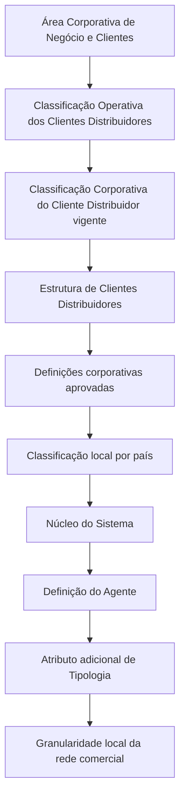

# Definição de Tipologias de Agentes para Clientes Distribuidores MAPFRE

## 1. Metadados do Documento
- **Arquivo de Origem:** Não identificado no conteúdo fornecido
- **Tipo de Documento:** Especificação Técnica / Funcional
- **Domínio / Sistema:** DOCUMENTACIÓN Reef / MAPFRE / Clientes Distribuidores
- **Público-Alvo:** Negócio, analistas funcionais, operação e equipes responsáveis pelo cadastro de agentes
- **Data/Versão Identificada:** Não identificada

---

## 2. Resumo Executivo & Contexto de Negócio

O documento define critérios para classificação de tipologias de agentes no contexto de Clientes Distribuidores da MAPFRE. Um Cliente Distribuidor é descrito como pessoa física ou entidade jurídica que distribui, ou pode distribuir, produtos seguradores, financeiros ou serviços para a MAPFRE ou para entidade concorrente.

Cada país deve implementar uma classificação homogênea de Clientes Distribuidores. A implementação local deve atender às necessidades específicas da operação de negócio de cada país e, simultaneamente, manter sincronização com a Classificação Corporativa do Cliente Distribuidor vigente.

A classificação de mediadores por fontes de produção deve respeitar características e definições corporativas aprovadas, estabelecidas especificamente na Estrutura de Clientes Distribuidores. O núcleo do sistema permite complementar essa estrutura corporativa com uma característica adicional na definição dos Agentes.

O atributo adicional de tipologia oferece granularidade local para classificar a rede comercial. Os exemplos apresentados incluem grau de vinculação, localização física, canal de origem, oferta de produtos, condição de subvencionamento e abrangência geográfica. O documento também define propriedades de companhia, tipo de intermediário, denominação da tipologia e inabilitação para uso operacional.

---

## 3. Arquitetura, Componentes & Tecnologias Envolvidas

O conteúdo fornecido não descreve uma arquitetura técnica de software, microsserviços, APIs, bancos de dados, protocolos ou tecnologias de implementação. A estrutura funcional identificada envolve os seguintes elementos:

- **MAPFRE:** organização e contexto corporativo da classificação.
- **Clientes Distribuidores:** pessoas ou entidades que distribuem ou podem distribuir produtos e serviços.
- **Classificação Corporativa do Cliente Distribuidor:** referência corporativa vigente que deve permanecer sincronizada com as classificações locais.
- **Estrutura de Clientes Distribuidores:** fonte das definições corporativas aprovadas.
- **Núcleo do Sistema:** componente funcional que permite complementar a definição corporativa com um atributo adicional na definição dos Agentes.
- **Agentes / Tipos de Intermediário:** entidades classificadas no sistema.
- **Área Corporativa de Negócio e Clientes:** área responsável pela Classificação Operativa dos Clientes Distribuidores.
- **DOCUMENTACIÓN Reef / Mapfredocument:** referências documentais exibidas no conteúdo bruto.



> **Nota de Análise:** O documento não detalha interfaces, métodos HTTP, contratos JSON, persistência de dados, integrações sistêmicas, ambientes técnicos ou mecanismos de sincronização entre a classificação local e a classificação corporativa.

---

## 4. Regras de Negócio, Especificações Funcionais & Processos

### 4.1 Definição de Cliente Distribuidor

Um Cliente Distribuidor é uma pessoa física ou entidade jurídica que:

1. Distribui produtos seguradores, financeiros ou serviços para a MAPFRE; ou
2. Poderia distribuir produtos seguradores, financeiros ou serviços para a MAPFRE; ou
3. Distribui ou poderia distribuir produtos seguradores, financeiros ou serviços para alguma entidade concorrente.

### 4.2 Obrigação de classificação homogênea por país

Cada país deve implementar uma classificação de Clientes Distribuidores que:

1. Seja homogênea para a operação local.
2. Atenda às necessidades de negócio próprias da operação local.
3. Permaneça sincronizada com a Classificação Corporativa do Cliente Distribuidor vigente.

### 4.3 Conformidade com definições corporativas

Ao agrupar mediadores por fontes de produção, devem ser consideradas características que cumpram as definições corporativas aprovadas. Essas definições são realizadas especificamente na Estrutura de Clientes Distribuidores.

### 4.4 Atributo adicional na definição de Agentes

O núcleo do sistema permite complementar a definição realizada na Estrutura de Clientes Distribuidores por meio da captura de uma característica adicional na definição dos Agentes.

O atributo adicional pode determinar o nível de granularidade necessário para classificar a rede comercial conforme as necessidades locais.

Exemplos de características que o atributo adicional pode representar:

- Grau de vinculação.
- Localização física.
- Canal de origem: Tradicional, Digital ou Telefônico.
- Oferta de produtos.
- Condição de subvencionamento: subvencionado ou não subvencionado.
- Abrangência: Global, Regional ou Local.
- Outros critérios locais não detalhados no documento.

### 4.5 Propriedade: Companhia

A propriedade **Companhia** indica ao sistema o código da companhia sobre a qual está sendo realizada a definição do Tipo de Agente.

### 4.6 Propriedade: Tipo de Intermediário

A propriedade **Tipo de Intermediário** indica o código do Tipo de Intermediário que está sendo capturado no sistema.

### 4.7 Propriedade: Denominação do Tipo de Intermediário

A propriedade **Denominação do Tipo de Intermediário** representa a denominação ou descrição da Tipologia do Agente, de acordo com o uso e a exploração local que será realizada.

O documento fornece exemplos de classificações possíveis:

1. Subvencionado e Não Subvencionado.
2. Escritório de Atendimento ao Público e Escritório sem Atendimento ao Público.
3. MultiProduto, Especializado e MonoProduto.

### 4.8 Propriedade: Inabilitação

A propriedade **Inabilitação** informa ao sistema que o Tipo de Intermediário está inabilitado para utilização nas operações de:

- Captura de Agente.
- Modificação de Agente.

### 4.9 Diretriz operacional para codificação e uso

A identificação dos tipos de Intermediários no sistema deve respeitar a Classificação Operativa dos Clientes Distribuidores definida pela Área Corporativa de Negócio e Clientes.

### 4.10 Documentos funcionais relacionados

O documento recomenda a leitura das seguintes referências para evitar interpretação isolada que possa levar a erro:

- Actividades de Terceros.
- Canales y Fuentes de Producción.
- Preguntas frecuentes.

---

## 5. Tabelas de Parâmetros, Ambientes e Estruturas de Dados

| Item / Parâmetro | Descrição / Função | Tipo / Valores / Formato | Ambiente / Observações |
| :--- | :--- | :--- | :--- |
| Cliente Distribuidor | Pessoa ou entidade que distribui ou poderia distribuir produtos seguradores, financeiros ou serviços para MAPFRE ou concorrentes. | Pessoa física ou entidade jurídica. | Definição corporativa apresentada no documento. |
| Classificação local | Classificação de Clientes Distribuidores implementada por cada país. | Classificação homogênea. | Deve atender às necessidades locais e permanecer sincronizada com a classificação corporativa vigente. |
| Classificação Corporativa do Cliente Distribuidor | Referência corporativa para classificação de Clientes Distribuidores. | Não detalhado. | Deve ser respeitada pelas implementações locais. |
| Estrutura de Clientes Distribuidores | Estrutura onde são realizadas as definições corporativas aprovadas. | Não detalhado. | Referência para agrupamento de mediadores por fontes de produção. |
| Atributo adicional | Característica complementar capturada na definição dos Agentes. | Não detalhado; depende da necessidade local. | Permite aumentar a granularidade da classificação da rede comercial. |
| Grau de vinculação | Possível critério para o atributo adicional. | Não detalhado. | Exemplo apresentado. |
| Localização física | Possível critério para o atributo adicional. | Não detalhado. | Exemplo apresentado. |
| Canal de origem | Possível critério para o atributo adicional. | Tradicional, Digital, Telefônico. | Exemplo apresentado. |
| Oferta de produtos | Possível critério para o atributo adicional. | Não detalhado. | Exemplo apresentado. |
| Subvencionamento | Possível critério para o atributo adicional. | Subvencionado ou Não Subvencionado. | Exemplo apresentado. |
| Abrangência | Possível critério para o atributo adicional. | Global, Regional ou Local. | Exemplo apresentado. |
| Companhia | Código da companhia sobre a qual é definida a tipologia de agente. | Código de companhia; formato não detalhado. | Propriedade de definição do Tipo de Agente. |
| Tipo de Intermediário | Código do Tipo de Intermediário capturado no sistema. | Código; formato não detalhado. | Propriedade de definição do Tipo de Agente. |
| Denominação do Tipo de Intermediário | Nome ou descrição da Tipologia do Agente. | Texto descritivo. | Determinada conforme uso e exploração local. |
| Inabilitação | Impede o uso de determinado Tipo de Intermediário. | Estado de inabilitação; valores não detalhados. | Afeta operações de captura e/ou modificação do Agente. |
| Identificação dos tipos de Intermediário | Codificação e identificação operacional de tipos no sistema. | Não detalhado. | Deve respeitar a Classificação Operativa definida pela Área Corporativa de Negócio e Clientes. |

### Exemplos de denominação de tipologia

| Tipo de Agente | Descrição |
| :--- | :--- |
| 1 | Subvencionado |
| 2 | Não Subvencionado |

| Tipo de Agente | Descrição |
| :--- | :--- |
| 1 | Oficina de Atención al Público |
| 2 | Oficina sin Atención al Público |

| Tipo de Agente | Descrição |
| :--- | :--- |
| 1 | MultiProducto |
| 2 | Especializado |
| 3 | MonoProducto |

> **Nota de Análise:** O conteúdo bruto apresenta a expressão “Oficina si Atención al Público”. Nesta referência estruturada, a forma “Oficina sin Atención al Público” foi mantida conforme o sentido aparente do exemplo, mas o documento extraído contém possível inconsistência de transcrição.

---

## 6. Bateria de Perguntas & Respostas para RAG (FAQ Sintético)

### P1: O que é considerado um Cliente Distribuidor no contexto da MAPFRE?
**R:** Um Cliente Distribuidor é uma pessoa física ou uma entidade jurídica que distribui, ou poderia distribuir, produtos seguradores, financeiros ou serviços para a MAPFRE ou para alguma entidade concorrente.

### P2: Qual é a obrigação de cada país em relação à classificação de Clientes Distribuidores?
**R:** Cada país deve implementar uma classificação homogênea de Clientes Distribuidores que atenda às necessidades de negócio locais e permaneça sincronizada com a Classificação Corporativa do Cliente Distribuidor vigente.

### P3: Onde são definidas as características corporativas aprovadas para agrupamento de mediadores?
**R:** As definições corporativas aprovadas são realizadas especificamente na Estrutura de Clientes Distribuidores. O agrupamento de mediadores por fontes de produção deve cumprir essas definições.

### P4: Qual é a finalidade do atributo adicional capturado na definição dos Agentes?
**R:** O atributo adicional complementa a definição existente na Estrutura de Clientes Distribuidores e pode determinar o nível de granularidade necessário para classificar a rede comercial segundo necessidades locais.

### P5: Quais exemplos de critérios podem compor a tipologia de um Agente?
**R:** O documento cita como exemplos o grau de vinculação, localização física, canal de origem — Tradicional, Digital ou Telefônico —, oferta de produtos, condição de subvencionamento e abrangência Global, Regional ou Local.

### P6: O que a propriedade Companhia informa no cadastro da tipologia de agente?
**R:** A propriedade Companhia informa o código da companhia sobre a qual está sendo realizada a definição do Tipo de Agente.

### P7: Qual é a diferença entre Tipo de Intermediário e Denominação do Tipo de Intermediário?
**R:** Tipo de Intermediário indica o código do tipo que está sendo capturado no sistema. Denominação do Tipo de Intermediário indica a descrição ou denominação da Tipologia do Agente, definida de acordo com o uso e a exploração local.

### P8: Qual é o efeito da propriedade Inabilitação?
**R:** A propriedade Inabilitação indica que determinado Tipo de Intermediário está inabilitado e não pode ser utilizado em operações de captura e/ou modificação do Agente.

### P9: Quais são exemplos de denominações locais para Tipo de Agente?
**R:** O documento apresenta exemplos como Subvencionado e Não Subvencionado; Oficina de Atención al Público e Oficina sin Atención al Público; e as categorias MultiProducto, Especializado e MonoProducto.

### P10: Qual diretriz deve ser seguida na codificação e identificação dos tipos de Intermediários?
**R:** A identificação dos tipos de Intermediários no sistema deve respeitar a Classificação Operativa dos Clientes Distribuidores definida pela Área Corporativa de Negócio e Clientes.

### P11: O documento especifica os métodos de integração ou contratos técnicos do sistema?
**R:** Não. O documento fornecido não detalha métodos HTTP, APIs, contratos JSON, bancos de dados, rotas de integração, tecnologias ou mecanismos técnicos de sincronização.

### P12: Quais documentos devem ser consultados para evitar interpretação isolada da tipologia de intermediários?
**R:** O documento recomenda a leitura das referências Actividades de Terceros, Canales y Fuentes de Producción e Preguntas frecuentes.

---

## 7. Glossário de Termos, Siglas & Conceitos-Chave

- **MAPFRE:** Organização mencionada como destinatária ou contexto de distribuição de produtos seguradores, financeiros e serviços.
- **Cliente Distribuidor:** Pessoa física ou entidade jurídica que distribui ou poderia distribuir produtos seguradores, financeiros ou serviços para a MAPFRE ou para concorrentes.
- **Classificação Corporativa do Cliente Distribuidor:** Classificação corporativa vigente com a qual a classificação local deve estar sincronizada.
- **Classificação Operativa dos Clientes Distribuidores:** Referência definida pela Área Corporativa de Negócio e Clientes que deve ser respeitada na identificação dos tipos de Intermediários.
- **Estrutura de Clientes Distribuidores:** Estrutura em que são realizadas as definições corporativas aprovadas.
- **Agente:** Entidade cuja definição pode receber um atributo adicional para classificação da rede comercial.
- **Tipo de Agente:** Categoria atribuída ao Agente, com código e descrição local.
- **Tipo de Intermediário:** Código de classificação capturado no sistema.
- **Denominação do Tipo de Intermediário:** Descrição da Tipologia do Agente conforme o uso local.
- **Inabilitação:** Estado que impede a utilização do Tipo de Intermediário nas operações de captura e/ou modificação de Agente.
- **Fonte de Produção:** Critério citado para agrupamento de mediadores; o documento não apresenta definição adicional.
- **Reef:** Nome presente nas referências de documentação, sem expansão ou detalhamento fornecido.
- **DOCUMENTACIÓN Reef:** Referência documental exibida no conteúdo original.
- **Mapfredocument:** Identificador exibido no conteúdo original; sem detalhamento adicional.

---

## 8. Notas Críticas, Riscos & Limitações

- O documento exige sincronização entre classificações locais e a Classificação Corporativa do Cliente Distribuidor, mas não descreve o processo técnico, a frequência, os responsáveis operacionais ou os controles de consistência dessa sincronização.
- A interpretação isolada do documento pode conduzir a erro. O próprio conteúdo recomenda consultar os documentos Actividades de Terceros, Canales y Fuentes de Producción e Preguntas frecuentes.
- A codificação local dos tipos de Intermediários possui restrição corporativa: deve respeitar a Classificação Operativa dos Clientes Distribuidores definida pela Área Corporativa de Negócio e Clientes.
- A propriedade Inabilitação afeta diretamente a captura e a modificação de Agentes; uma classificação indevidamente inabilitada pode impedir operações de manutenção cadastral.
- Não há detalhamento sobre formatos de códigos, valores permitidos, obrigatoriedade de campos, regras de unicidade, perfis de acesso, trilha de auditoria ou tratamento de erros.
- Não há descrição de arquitetura técnica, serviços, integrações, ambientes, URLs, logs, autenticação ou contratos de dados.
- O conteúdo extraído apresenta caracteres corrompidos em palavras como “definición”, “financieros”, “clasificación”, “modificación” e “identificación”, o que sugere limitação na extração textual do documento de origem.
- Há possível inconsistência no exemplo “Oficina si Atención al Público”, pois o contexto sugere “Oficina sin Atención al Público”; a redação original deve ser validada na fonte oficial.

---

## 9. Conteúdo Bruto Estruturado (Referência Fiel)

```text
--- [PÁGINA 1 DE 2] ---

DEFINICIÓN de las Tipologías de Agentes
Contexto
Un Cliente Distribuidor es aquella persona o entidad jurídica que distribuye o podría distribuir productos aseguradores, nancieros o servicios
para MAPFRE o para alguna entidad competidora.
Cada país debe implementar una clasicación de clientes distribuidores homogénea que de servicio a las necesidades de negocio propias de
la operación y que a su vez esté sincronizada con la Clasicación Corporativa del Cliente Distribuidor vigente.
A la hora de agrupar a los mediadores por fuentes de producción, hay ciertas características que se deben tener en cuenta y que deben
cumplir con las deniciones corporativas aprobadas, deniciones que se realizan especícamente en la Estructura de Clientes
Distribuidores.
Propiedades Generales
Funcionalmente, el núcleo del Sistema cuenta con la posibilidad de complementar la denición realizada en la Estructura de Clientes
Distribuidores con la captura de una característica adicional en la denición de los Agentes, característica que puede determinar el nivel de
granularidad necesario para clasicar la red comercial de acuerdo a las necesidades locales.
A modo de ejemplo, este Atributo podría determinar ...
Grado de Vinculación.
Ubicación física.
Canal de Origen: Tradicional, Digital, Telefónico.
Oferta de Productos.
Subvencionado o no.
Ámbito: Global, Regional o Local.
étc.
Compañía
Esta propiedad le indica al sistema el código de la compañía sobre la que se está realizando la denición del Tipo de Agente.
Tipo de Intermediario
Esta propiedad indica el código del Tipo de Intermediario que se está capturando en el sistema.
Denominación del Tipo de Intermediario
Documentation / DOCUMENTACIÓN Reef
DOCUMENTACIÓN Reef
Mapfredocument
DOCUMENTACIÓN Reef
Owner
user:agonzalez_mapfre.com
Lifecycle
Approved Source
 / 
 VL
Buscar Inicio Soluciones Arquitecturas APIs Componentes Cloud Documentación Zeus Reef Ayuda
ES


--- [PÁGINA 2 DE 2] ---

De acuerdo con el uso y explotación que se le vaya a dar localmente, este Atributo indicará la denominación o descripción de la Tipología del
Agente, como por ejemplo:
Tipo de Agente Descripción
1 Subvencionado
2 No Subvencionado
... ...
o bien:
Tipo de Agente Descripción
1 Ocina de Atención al Público
2 Ocina si Atención al Público
... ...
o bien:
Tipo de Agente Descripción
1 MultiProducto
2 Especializado
3 MonoProducto
... ...
Otras Propiedades
Inhabilitación
Esta propiedad le indica al Sistema que el Tipo de Intermediario está inhabilitada para poder ser utilizada en las operaciones de captura y/o
modicación del Agente.
Vínculos
Relación de Directrices y Documentos funcionales cuya lectura recomendada para evitar que la interpretación aislada del presente
documento pueda conducir a error.
Actividades de Terceros
Canales y Fuentes de Producción
Preguntas frecuentes
(1) ¿Existe alguna recomendación operativa que deba ser tomada en consideración localmente en la codicación, uso y denición de la
Tipología de Intermediarios en el Sistema?
Se debe respetar la Identicación de los tipos de Intermediarios en el sistema de acuerdo con la Clasicación Operativa de los Clientes
Distribuidores denida por el Área Corporativa de Negocio y CLientes.
```
