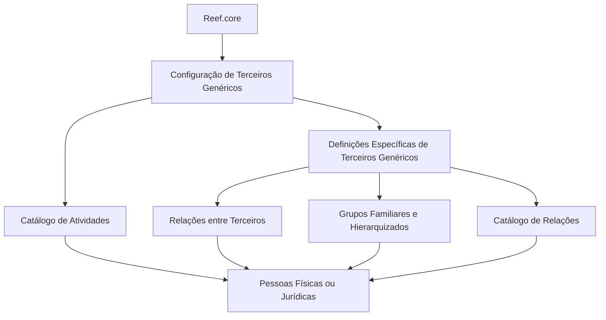

# Configuração de Terceiros Genéricos no Reef.core

## 1. Metadados do Documento
- **Arquivo de Origem:** Não identificado no conteúdo fornecido
- **Tipo de Documento:** Manual Operacional / Documentação Funcional
- **Domínio / Sistema:** Reef.core / Mapfre
- **Público-Alvo:** Desenvolvedores, analistas funcionais, equipes de operação e negócio
- **Data/Versão Identificada:** Não identificada

---

## 2. Resumo Executivo & Contexto de Negócio

O documento descreve a definição e a configuração de **Terceiros Genéricos** no sistema **Reef.core**. Terceiros Genéricos correspondem a pessoas físicas ou jurídicas cujas atividades laborais pertencem a profissões ou categorias previamente classificadas pelo sistema.

A configuração permite que essas entidades sejam posteriormente utilizadas nas operações do sistema. O conteúdo apresenta um catálogo de atividades identificado por chaves numéricas, incluindo categorias como peritos, inspetores, médicos, advogados, fornecedores, oficinas, clínicas, tribunais, depósitos e representantes legais.

Além do catálogo de atividades, o documento apresenta definições específicas aplicáveis exclusivamente a Terceiros Genéricos. Essas definições abrangem a configuração de relações entre terceiros, grupos familiares, grupos hierarquizados e o catálogo de tipos de relacionamento.

O documento também informa que a presença de asteriscos nas telas ou cartões de configuração indica se determinado elemento é obrigatório para a definição de Terceiros Genéricos. Não são fornecidos detalhes sobre telas, campos, persistência de dados, serviços, métodos HTTP, contratos de integração ou critérios de validação além dessa indicação de obrigatoriedade.

---

## 3. Arquitetura, Componentes & Tecnologias Envolvidas

O conteúdo cita os seguintes elementos:

- **Reef.core:** Sistema que identifica e permite configurar Terceiros Genéricos.
- **Terceiros Genéricos:** Pessoas físicas ou jurídicas classificadas conforme atividades profissionais cadastradas.
- **Catálogo de atividades:** Relação de chaves, atividades e descrições usadas para classificar Terceiros Genéricos.
- **Relações entre Terceiros:** Configuração de conexões ou relações entre terceiros registrados.
- **Grupos Familiares e Grupos Hierarquizados:** Catálogo de grupos aos quais terceiros registrados podem ser relacionados.
- **Catálogo de relações:** Relações possíveis entre terceiros, incluindo parentesco, nexos econômicos e conexões acionariais.
- **Mapfredocument / DOCUMENTACIÓN Reef:** Referências presentes no conteúdo bruto de navegação e documentação.
- **Owner identificado:** `user:agonzalez_mapfre.com`
- **Lifecycle identificado:** `Approved Source / VL`



**Nota de Análise:** O documento não detalha arquitetura técnica de infraestrutura, bancos de dados, APIs, microsserviços, protocolos, autenticação, ambientes de execução ou integrações externas.

---

## 4. Regras de Negócio, Especificações Funcionais & Processos

### 4.1 Definição de Terceiros Genéricos

O Reef.core identifica como **Terceiros Genéricos** as pessoas físicas ou jurídicas cujas atividades laborais correspondem às profissões e categorias incluídas no catálogo apresentado pelo documento.

A finalidade da configuração é permitir a operação posterior desses terceiros no sistema Reef.core.

### 4.2 Classificação por atividade

Cada Terceiro Genérico pode ser associado a uma atividade identificada por uma chave numérica e uma descrição. O conteúdo fornecido apresenta atividades como:

- Peritos;
- Inspetores;
- Médicos;
- Advogados;
- Procuradores;
- Fornecedores;
- Executivos de conta;
- Cobradores;
- Empregados;
- Oficinas;
- Clínicas;
- Juizados;
- Vidraceiros;
- Chaveiros;
- Encanadores;
- Eletricistas;
- Guinchos;
- Investigadores;
- Recuperadores;
- Reguladores;
- Ferreiros;
- Tribunais;
- Terceiros de seguros nas áreas MOTOR, SALUD e PATRIMONIALES;
- Depósitos;
- Cartórios;
- Centros de perícia;
- Delegacias;
- Filial;
- Representantes legais.

### 4.3 Obrigatoriedade de configuração

Os asteriscos exibidos nos cartões de configuração indicam se a configuração de determinado elemento é obrigatória em relação à definição de Terceiros Genéricos.

**Nota de Análise:** O conteúdo não identifica quais cartões, campos ou elementos possuem asteriscos, nem apresenta comportamento do sistema quando uma configuração obrigatória não é preenchida.

### 4.4 Relações entre terceiros

O documento descreve uma funcionalidade para configuração das conexões ou relações entre terceiros. Essa capacidade é parte das definições específicas usadas exclusivamente quando o terceiro é classificado como Terceiro Genérico.

As relações podem existir, conforme o conteúdo, por:

- Motivos de parentesco;
- Nexos econômicos;
- Conexões acionariais.

### 4.5 Grupos familiares e hierarquizados

O sistema permite configurar um catálogo de grupos familiares e grupos hierárquicos com os quais os terceiros registrados podem se relacionar.

**Nota de Análise:** O documento não especifica a estrutura dos grupos, regras de associação, cardinalidade das relações, níveis hierárquicos ou processos de manutenção do catálogo.

---

## 5. Tabelas de Parâmetros, Ambientes e Estruturas de Dados

### 5.1 Catálogo de atividades de Terceiros Genéricos

| Item / Parâmetro | Descrição / Função | Tipo / Valores / Formato | Ambiente / Observações |
| :--- | :--- | :--- | :--- |
| Chave `3` | Classifica a atividade como Peritos | Numérico | Atividade de Terceiro Genérico |
| Chave `4` | Classifica a atividade como Inspetores | Numérico | Atividade de Terceiro Genérico |
| Chave `5` | Classifica a atividade como Médicos | Numérico | Atividade de Terceiro Genérico |
| Chave `6` | Classifica a atividade como Advogados | Numérico | Atividade de Terceiro Genérico |
| Chave `7` | Classifica a atividade como Procuradores | Numérico | Atividade de Terceiro Genérico |
| Chave `10` | Classifica a atividade como Fornecedores | Numérico | Atividade de Terceiro Genérico |
| Chave `11` | Classifica a atividade como Executivos de Cta. | Numérico | Abreviação apresentada no documento |
| Chave `12` | Classifica a atividade como Cobradores | Numérico | Atividade de Terceiro Genérico |
| Chave `15` | Classifica a atividade como Empregados | Numérico | Atividade de Terceiro Genérico |
| Chave `17` | Classifica a atividade como Oficinas | Numérico | Texto original: `Talleres` |
| Chave `18` | Classifica a atividade como Clínicas | Numérico | Atividade de Terceiro Genérico |
| Chave `19` | Classifica a atividade como Juizados | Numérico | Texto original: `Juzgados` |
| Chave `20` | Classifica a atividade como Vidraceiros | Numérico | Texto original: `Cristaleros` |
| Chave `21` | Classifica a atividade como Chaveiros | Numérico | Texto original: `Cerrajeros` |
| Chave `22` | Classifica a atividade como Encanadores | Numérico | Texto original: `Plomeros` |
| Chave `23` | Classifica a atividade como Eletricistas | Numérico | Atividade de Terceiro Genérico |
| Chave `24` | Classifica a atividade como Guinchos | Numérico | Texto original: `Grúas` |
| Chave `25` | Classifica a atividade como Investigadores | Numérico | Atividade de Terceiro Genérico |
| Chave `26` | Classifica a atividade como Recuperadores | Numérico | Atividade de Terceiro Genérico |
| Chave `27` | Classifica a atividade como Reguladores | Numérico | Texto original: `Ajustadores` |
| Chave `28` | Classifica a atividade como Ferreiros | Numérico | Texto original: `Herreros` |
| Chave `29` | Classifica a atividade como Tribunais | Numérico | Atividade de Terceiro Genérico |
| Chave `30` | Classifica a atividade como Terceiros Seg. MOTOR | Numérico | Descrição literal do documento |
| Chave `31` | Classifica a atividade como Terceiros Seg. SALUD | Numérico | Descrição literal do documento |
| Chave `32` | Classifica a atividade como Terceiros Seg. PATRIMONIALES | Numérico | Descrição literal do documento |
| Chave `33` | Classifica a atividade como Depósitos | Numérico | Atividade de Terceiro Genérico |
| Chave `34` | Classifica a atividade como Cartórios | Numérico | Texto original: `Notarías` |
| Chave `35` | Classifica a atividade como Centros de Peritação | Numérico | Descrição literal do documento |
| Chave `36` | Classifica a atividade como Delegacias | Numérico | Texto original: `Comisarías` |
| Chave `38` | Classifica a atividade como Filial | Numérico | Atividade de Terceiro Genérico |
| Chave `45` | Classifica a atividade como Representantes Legais | Numérico | Atividade de Terceiro Genérico |

### 5.2 Estruturas funcionais citadas

| Item / Parâmetro | Descrição / Função | Tipo / Valores / Formato | Ambiente / Observações |
| :--- | :--- | :--- | :--- |
| Terceiros Genéricos | Pessoas físicas ou jurídicas classificadas por atividade profissional | Entidade funcional | Operada no Reef.core |
| Relações entre Terceiros | Configuração de conexões ou relações entre terceiros | Configuração / catálogo | Uso exclusivo no contexto de Terceiros Genéricos |
| Grupos Familiares | Catálogo de grupos familiares para relacionamento de terceiros | Configuração / catálogo | Sem detalhamento de campos |
| Grupos Hierarquizados | Catálogo de grupos hierárquicos para relacionamento de terceiros | Configuração / catálogo | Sem detalhamento de níveis |
| Catálogo de Relações | Identificação de relações existentes entre terceiros | Configuração / catálogo | Inclui parentesco, nexos econômicos e conexões acionariais |
| Asteriscos nos cartões | Indicador de obrigatoriedade da configuração | Indicador visual | Não há especificação dos elementos obrigatórios |

---

## 6. Bateria de Perguntas & Respostas para RAG (FAQ Sintético)

### P1: O que são Terceiros Genéricos no Reef.core?
**R:** Terceiros Genéricos são pessoas físicas ou jurídicas cujas atividades laborais correspondem às profissões ou categorias incluídas no catálogo de atividades do Reef.core. A configuração desses terceiros permite sua operação posterior no sistema.

### P2: Qual é a finalidade do catálogo de atividades de Terceiros Genéricos?
**R:** O catálogo de atividades classifica Terceiros Genéricos por chaves numéricas e descrições profissionais. Essa classificação identifica a atividade laboral do terceiro no contexto do Reef.core.

### P3: Qual chave de atividade representa médicos no catálogo apresentado?
**R:** A chave `5` representa a atividade `Médicos`.

### P4: Qual chave de atividade representa fornecedores?
**R:** A chave `10` representa a atividade `Proveedores`, apresentada como fornecedores no contexto em português.

### P5: Como o documento indica que uma configuração é obrigatória para Terceiros Genéricos?
**R:** O documento informa que os asteriscos dos cartões indicam se a configuração de um elemento é obrigatória em relação à definição de Terceiros Genéricos. O conteúdo não especifica quais cartões ou campos possuem essa obrigatoriedade.

### P6: Quais tipos de relações entre terceiros são citados no documento?
**R:** O documento cita relações entre terceiros por motivos de parentesco, por nexos econômicos e por conexões acionariais. Essas relações são configuradas por meio de um catálogo de relações.

### P7: O que são grupos familiares e grupos hierarquizados no contexto de Terceiros Genéricos?
**R:** Grupos familiares e grupos hierarquizados são catálogos configuráveis com os quais terceiros registrados podem ser relacionados. O documento não detalha os campos, níveis ou critérios de associação desses grupos.

### P8: Quais chaves representam Terceiros de Seguros MOTOR, SALUD e PATRIMONIALES?
**R:** A chave `30` representa `Terceros Seg. MOTOR`, a chave `31` representa `Terceros Seg. SALUD` e a chave `32` representa `Terceros Seg. PATRIMONIALES`.

### P9: Qual chave identifica representantes legais?
**R:** A chave `45` identifica a atividade `Representantes Legales`, ou representantes legais.

### P10: O documento detalha APIs, contratos JSON ou métodos HTTP do Reef.core?
**R:** Não. O documento fornecido descreve conceitos funcionais, atividades e tipos de relações para Terceiros Genéricos, mas não detalha APIs, métodos HTTP, contratos JSON, banco de dados ou integrações técnicas.

---

## 7. Glossário de Termos, Siglas & Conceitos-Chave

- **Reef.core:** Sistema citado como responsável por identificar e permitir a configuração de Terceiros Genéricos.
- **Terceiros Genéricos:** Pessoas físicas ou jurídicas classificadas conforme atividades profissionais configuradas no Reef.core.
- **Terceiros Seg.:** Abreviação apresentada no catálogo para Terceiros de Seguros.
- **MOTOR:** Categoria literal apresentada para Terceiros Seg. MOTOR.
- **SALUD:** Categoria literal apresentada para Terceiros Seg. SALUD.
- **PATRIMONIALES:** Categoria literal apresentada para Terceiros Seg. PATRIMONIALES.
- **Relações entre Terceiros:** Configuração de conexões ou vínculos entre terceiros registrados.
- **Grupos Familiares:** Catálogo de grupos relacionados a terceiros por contexto familiar.
- **Grupos Hierarquizados:** Catálogo de grupos relacionados a terceiros por estrutura hierárquica.
- **Nexos econômicos:** Tipo de conexão entre terceiros mencionado no documento.
- **Conexões acionariais:** Tipo de relação entre terceiros baseado em vínculos societários ou acionários.
- **Mapfredocument:** Termo presente na navegação da documentação de origem, sem detalhamento funcional adicional.
- **Lifecycle `Approved Source / VL`:** Informação de ciclo de vida apresentada no conteúdo de origem, sem definição adicional.

---

## 8. Notas Críticas, Riscos & Limitações

- O arquivo de origem, a data, a versão e a autoria formal do documento não foram identificados no conteúdo fornecido.
- A informação disponível parece ser uma extração parcial de três páginas e contém caracteres corrompidos em palavras como `congurar`, `identica` e `denición`.
- O conteúdo apresenta apenas parte do catálogo de atividades, indicado por `... ...`; portanto, não é possível afirmar que a lista reproduz todas as chaves existentes no Reef.core.
- O documento não detalha campos de entrada, regras de validação, mensagens de erro, permissões, perfis de acesso, APIs, banco de dados, integrações ou fluxos transacionais.
- O documento indica obrigatoriedade por asteriscos nos cartões, mas não identifica quais configurações são obrigatórias.
- As funcionalidades de relações, grupos familiares e grupos hierarquizados são apresentadas em nível conceitual, sem regras de cardinalidade, governança ou ciclo de vida das relações.
- **Nota de Análise:** O documento cita o Reef.core e suas definições funcionais, porém não detalha componentes técnicos, ambientes, URLs, serviços ou contratos de integração.

---

## 9. Conteúdo Bruto Estruturado (Referência Fiel)

```text
--- [PÁGINA 1 DE 3] ---

DEFINICIÓN de los TERCEROS GENÉRICOS
Se relacionan los elementos que permiten congurar en Reef.core a los Terceros Genéricos para poder operar posteriormente con ellos en el
Sistema.
Reef.core identica a los "Terceros Genéricos" con todas aquellas personas físicas o jurídicas cuyas actividades laborales se corresponden
con las siguientes profesiones...
CLAVE ACTIVIDAD DESCRIPCIÓN
3 Peritos
4 Inspectores
5 Médicos
6 Abogados
7 Procuradores
10 Proveedores
11 Ejecutivos de Cta.
12 Cobradores
15 Empleados
17 Talleres
18 Clínicas
19 Juzgados
20 Cristaleros
21 Cerrajeros
Documentation / DOCUMENTACIÓN Reef
DOCUMENTACIÓN Reef
Mapfredocument
DOCUMENTACIÓN Reef
Owner
user:agonzalez_mapfre.com
Lifecycle
Approved Source
 / 
 VL
Buscar Inicio Soluciones Arquitecturas APIs Componentes Cloud Documentación Zeus Reef Ayuda
ES


--- [PÁGINA 2 DE 3] ---

CLAVE ACTIVIDAD DESCRIPCIÓN
22 Plomeros
23 Electricistas
24 Grúas
25 Investigadores
26 Recuperadores
27 Ajustadores
28 Herreros
29 Tribunales
30 Terceros Seg. MOTOR
31 Terceros Seg. SALUD
32 Terceros Seg. PATRIMONIALES
33 Depósitos
34 Notarías
35 Centros de Peritación
36 Comisarías
38 Filial
45 Representantes Legales
... ...
Los Asteriscos de las Tarjetas indican si la conguración del elemento es obligatoria en relación con la denición de los Terceros
Genéricos.
Deniciones ESPECÍFICAS, propias de los TERCEROS GENÉRICOS
En este Grupo se encuentran deniciones que se emplean exclusivamente cuando el Tercero es un TERCERO
GENÉRICO.
RELACIONES ENTRE TERCEROS
Conguración de las
conexiones/relaciones entre Terceros.
GRUPOS FAMILIARES Y GRUPOS
JERARQUIZADOS
Conguración del catálogo de grupos
familiares y jerárquicos con los que se
IDENTIFICAR LAS RELACIONES
EXISTENTES ENTRE TERCEROS
Conguración del catálogo de relaciones
que se pueden dar entre los Terceros


--- [PÁGINA 3 DE 3] ---

pueden relacionar los Terceros
registrados.
registrados en el Sistema: por motivos de
parentesco, por nexos económicos, por
conexiones accionariales,...
```
