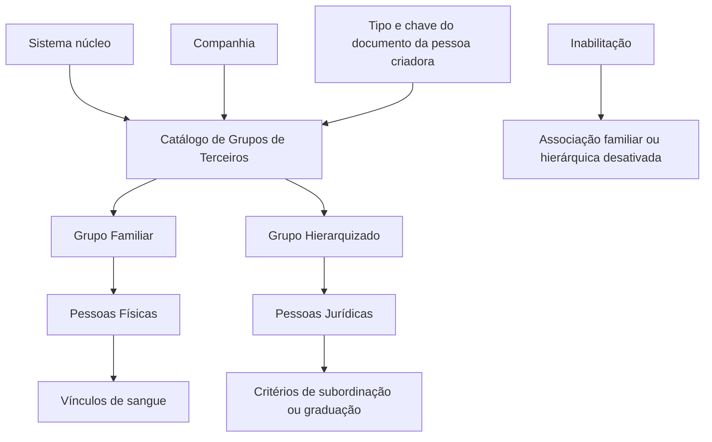
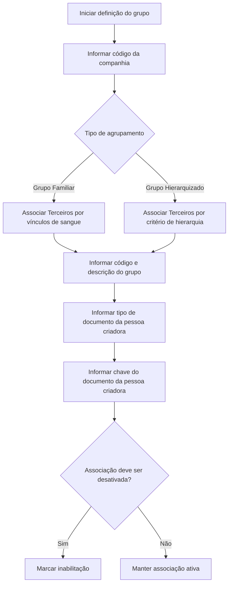

# Definição de Grupos Familiares e Hierarquizados de Terceiros — Documentação Reef

## 1. Metadados do Documento
- **Arquivo de Origem:** Não identificado — conteúdo bruto fornecido pelo solicitante
- **Tipo de Documento:** Procedimento funcional / Documentação funcional
- **Domínio / Sistema:** Reef / MAPFRE / Gestão de Terceiros
- **Público-Alvo:** Analistas funcionais, equipes de negócio e responsáveis pela configuração local do catálogo de terceiros
- **Data/Versão Identificada:** Não identificada
- **Status identificado no conteúdo:** Approved
- **Owner identificado:** `user:agonzalez_mapfre.com`

---

## 2. Resumo Executivo & Contexto de Negócio

O documento descreve a capacidade funcional do núcleo do sistema de organizar Terceiros em dois tipos de agrupamento: **Grupos Familiares (Famílias)** e **Grupos Hierarquizados (Hierarquias)**. Essa capacidade depende de um catálogo específico de informações, inicialmente entregue vazio para as instalações.

Os Grupos Familiares são associados ao conceito de vínculos de sangue entre Pessoas Físicas. Os Grupos Hierarquizados são associados a Pessoas Jurídicas e representam uma estrutura estabelecida segundo critérios de subordinação ou categorização entre pessoas.

O objetivo declarado é identificar e organizar Terceiros Genéricos conforme os vínculos familiares existentes ou conforme o grupo hierarquizado ao qual pertencem. A configuração exige identificar a companhia, o tipo de agrupamento, o código e a descrição do grupo, além do documento da pessoa criadora do grupo.

A documentação não define uma codificação padronizada para os catálogos de Famílias ou Hierarquias. A responsabilidade pela definição do uso transversal dessas informações é atribuída à entidade MAPFRE, para que a posterior exploração do catálogo gere valor para a companhia.

---

## 3. Arquitetura, Componentes & Tecnologias Envolvidas

O conteúdo não descreve uma arquitetura técnica detalhada, interfaces, APIs, contratos HTTP, persistência, microsserviços, tecnologias de infraestrutura ou ambientes. O documento apresenta uma visão funcional do núcleo do sistema Reef e de seu catálogo de grupos de terceiros.

Componentes e conceitos identificados:

| Componente / Conceito | Papel descrito |
| :--- | :--- |
| Sistema núcleo | Disponibiliza a capacidade de agrupar Terceiros. |
| Catálogo de informações | Catálogo específico utilizado para definir Grupos Familiares e Grupos Hierarquizados; é entregue inicialmente vazio. |
| Terceiros Genéricos | Entidades que podem ser identificadas e organizadas em grupos. |
| Grupo Familiar / Família | Agrupamento associado a vínculos de sangue para Pessoas Físicas. |
| Grupo Hierarquizado / Hierarquia | Agrupamento associado a Pessoas Jurídicas e a critérios de subordinação ou graduação. |
| Companhia | Contexto organizacional identificado pelo código da companhia durante a definição do grupo. |
| Pessoa criadora do grupo | Pessoa Física ou Jurídica identificada por tipo e chave de documento. |
| Relações Entre Terceiros | Documento funcional relacionado, recomendado para consulta. |
| Reef | Contexto documental e sistema identificado na navegação e no rodapé da documentação. |
| MAPFRE | Entidade responsável por analisar o uso transversal do catálogo. |



> **Nota de Análise:** O documento não detalha modelos de dados físicos, métodos HTTP, contratos JSON, tecnologias de implementação, integrações externas ou regras de autorização.

---

## 4. Regras de Negócio, Especificações Funcionais & Processos

### 4.1 Tipos de agrupamento de Terceiros

O sistema permite agrupar Terceiros em duas categorias funcionais:

1. **Grupos Familiares (Famílias):**
   - Aplicáveis ao conceito de família para Pessoas Físicas.
   - O objetivo é identificar Terceiros Genéricos de acordo com os laços de sangue existentes entre eles.

2. **Grupos Hierarquizados (Hierarquias):**
   - Aplicáveis ao conceito de hierarquia para Pessoas Jurídicas.
   - Uma hierarquia é uma estrutura estabelecida segundo um critério de subordinação entre pessoas.
   - Os critérios podem incluir superioridade, inferioridade, anterioridade, posterioridade ou qualquer qualidade categórica de graduação que caracterize a interdependência.

### 4.2 Catálogo de grupos

- O núcleo do sistema possui um catálogo de informação específico para Grupos Familiares e Grupos Hierarquizados.
- O catálogo é inicialmente entregue vazio às instalações.
- A documentação não especifica uma codificação obrigatória ou padronizada para os grupos.
- A entidade MAPFRE deve analisar a melhor forma de utilizar esse catálogo de maneira transversal nos processos corporativos.
- A exploração posterior do catálogo deve aportar valor à entidade.

### 4.3 Definição de um Grupo Familiar ou Hierarquizado

A definição de uma Família ou Hierarquia requer as propriedades documentadas:

1. Informar o código da companhia sobre a qual a definição será realizada.
2. Identificar se a relação entre Terceiros corresponde a uma Unidade Familiar ou a um Grupo Hierárquico.
3. Informar o código do grupo familiar ou hierárquico.
4. Informar a descrição do código do grupo.
5. Identificar a pessoa que inicia a criação do grupo mediante tipo de documento previamente configurado no sistema.
6. Informar a chave do documento que identifica a pessoa criadora.
7. Definir, quando aplicável, a inabilitação da associação para indicar que a associação familiar ou hierárquica está desativada.



### 4.4 Inabilitação

A propriedade **Inabilitação** informa ao sistema que a associação Familiar ou Hierárquica entre Terceiros se encontra desativada.

> **Nota de Análise:** O documento não informa as consequências operacionais da inabilitação, tais como bloqueio de consulta, bloqueio de uso em processos subsequentes, histórico, reativação ou auditoria.

### 4.5 Documentação relacionada

A documentação recomenda a leitura de diretrizes e documentos funcionais relacionados para evitar interpretações isoladas incorretas:

- **Relações Entre Terceiros**
- **Identificar as Relações existentes entre Terceiros**

---

## 5. Tabelas de Parâmetros, Ambientes e Estruturas de Dados

| Item / Parâmetro | Descrição / Função | Tipo / Valores / Formato | Ambiente / Observações |
| :--- | :--- | :--- | :--- |
| Companhia | Indica o código da companhia sobre a qual é realizada a definição da Família ou Hierarquia do Terceiro. | Código da companhia | Não detalhado no documento. |
| Grupo Familiar ou Jerárquico | Identifica se os Terceiros estão relacionados como membros de uma Unidade Familiar ou de um Grupo Hierárquico. | Grupo Familiar / Grupo Hierárquico | Não são informados valores codificados. |
| Código do Grupo | Informa o código Familiar ou Hierárquico sobre o qual é realizada a definição. | Código | Não há padrão de codificação estabelecido. |
| Descrição | Informa a descrição do código Familiar ou Hierárquico. | Texto descritivo | Não há formato ou tamanho documentado. |
| Tipo Documento | Identifica o tipo de documento da Pessoa Física ou Jurídica que inicia a criação do Grupo Familiar ou Grupo Hierarquizado. | Valores previamente configurados no sistema | O documento não enumera os tipos permitidos. |
| Clave do Documento | Contém a chave do documento que identifica a pessoa criadora do Grupo Familiar ou Hierárquico. | Chave de documento | Formato não detalhado. |
| Inabilitação | Indica que a associação Familiar ou Hierárquica entre Terceiros está desativada. | Indicador de desativação | O comportamento posterior da associação não é detalhado. |
| Catálogo de grupos | Catálogo específico para a configuração de Famílias e Hierarquias. | Catálogo de informação | Entregue inicialmente vazio às instalações. |
| Codificação de grupos | Forma de identificar Grupos Hierarquizados ou Famílias. | Não padronizada | MAPFRE deve analisar o uso transversal mais adequado. |
| Owner | Responsável identificado no portal documental. | `user:agonzalez_mapfre.com` | Informação extraída do rodapé do conteúdo. |
| Lifecycle | Estado do ciclo de vida identificado. | Approved | Não há detalhamento do processo de aprovação. |

---

## 6. Bateria de Perguntas & Respostas para RAG (FAQ Sintético)

### P1: Qual é o objetivo da funcionalidade de Grupos Familiares e Grupos Hierarquizados de Terceiros?
**R:** O objetivo é identificar e organizar Terceiros Genéricos conforme os laços de sangue que possam existir entre eles, no caso de Pessoas Físicas e Grupos Familiares, ou conforme os Grupos Hierarquizados aos quais pertençam, no caso de Pessoas Jurídicas.

### P2: Qual é a diferença entre Grupo Familiar e Grupo Hierarquizado no sistema?
**R:** Um Grupo Familiar representa a relação entre Pessoas Físicas com base em laços de sangue. Um Grupo Hierarquizado representa a organização de Pessoas Jurídicas segundo critérios de subordinação, como superioridade, inferioridade, anterioridade, posterioridade ou outra qualidade categórica de graduação que caracterize a interdependência.

### P3: O catálogo de Famílias e Hierarquias já vem preenchido quando uma instalação é entregue?
**R:** Não. O documento informa que o catálogo específico de informações para Grupos Familiares e Grupos Hierarquizados é entregue inicialmente vazio de conteúdo às instalações.

### P4: Quais propriedades devem ser informadas para definir uma Família ou Hierarquia de Terceiros?
**R:** A definição utiliza o código da companhia, a identificação do tipo de grupo — Familiar ou Hierárquico —, o código do grupo, a descrição do grupo, o tipo de documento da pessoa criadora e a chave do documento que identifica essa pessoa. Também existe a propriedade de Inabilitação para indicar a desativação da associação.

### P5: Como o sistema identifica a companhia associada à definição de uma Família ou Hierarquia?
**R:** A propriedade Companhia informa ao sistema o código da companhia sobre a qual está sendo realizada a definição da Família ou da Hierarquia do Terceiro.

### P6: Qual é a finalidade do Código do Grupo?
**R:** O Código do Grupo informa ao sistema o código Familiar ou Hierárquico sobre o qual está sendo realizada a definição da Família ou da Hierarquia do Terceiro.

### P7: Existe uma padronização corporativa obrigatória para codificar Famílias e Grupos Hierarquizados?
**R:** Não. O documento informa que não existe preferência nem recomendação para estabelecer ou padronizar a codificação no sistema. A entidade MAPFRE deve analisar a melhor forma de utilizar transversalmente o catálogo nos processos da companhia, de modo que sua exploração posterior aporte valor.

### P8: O que representa o Tipo Documento na criação de um Grupo Familiar ou Hierarquizado?
**R:** O Tipo Documento identifica o tipo de documento da Pessoa Física ou Jurídica que inicia a criação do Grupo Familiar ou Grupo Hierarquizado. Os valores disponíveis dependem das configurações previamente realizadas no sistema.

### P9: O que representa a Clave do Documento?
**R:** A Clave do Documento contém a chave do documento que identifica a pessoa criadora do Grupo Familiar ou Hierárquico.

### P10: O que acontece quando a propriedade Inabilitação é utilizada?
**R:** A propriedade Inabilitação informa ao sistema que a associação Familiar ou Hierárquica entre Terceiros se encontra desativada. O documento não detalha efeitos adicionais, como reativação, exclusão, bloqueio de uso ou retenção de histórico.

### P11: Quais documentos relacionados devem ser consultados para compreender relações entre Terceiros?
**R:** O documento recomenda a leitura de materiais funcionais relacionados, especialmente “Relações Entre Terceiros” e “Identificar as Relações existentes entre Terceiros”, para evitar que uma interpretação isolada conduza a erro.

### P12: O documento especifica APIs, operações HTTP ou contratos de integração para o catálogo de grupos?
**R:** Não. O conteúdo apresenta a finalidade funcional, as propriedades e a recomendação de uso do catálogo, mas não descreve APIs, métodos HTTP, payloads JSON, contratos de integração, tecnologias ou estruturas físicas de dados.

---

## 7. Glossário de Termos, Siglas & Conceitos-Chave

- **Terceiros:** Entidades que podem ser identificadas e organizadas em Grupos Familiares ou Grupos Hierarquizados.
- **Terceiros Genéricos:** Terceiros que constituem o objeto de identificação e organização descrito no documento.
- **Grupo Familiar / Família:** Agrupamento de Pessoas Físicas baseado em laços de sangue.
- **Grupo Hierarquizado / Hierarquia:** Agrupamento relacionado a Pessoas Jurídicas, definido por um critério de subordinação ou graduação.
- **Unidade Familiar:** Conceito utilizado para indicar que Terceiros são membros de uma Família.
- **Inabilitação:** Propriedade que indica que uma associação Familiar ou Hierárquica entre Terceiros está desativada.
- **Tipo Documento:** Atributo que identifica o tipo de documento da Pessoa Física ou Jurídica que inicia a criação do grupo.
- **Clave do Documento:** Chave do documento que identifica a pessoa criadora do Grupo Familiar ou Hierárquico.
- **MAPFRE:** Entidade mencionada como responsável por analisar a melhor utilização transversal do catálogo. O documento não expande a sigla ou nome.
- **Reef:** Nome identificado na documentação e navegação do portal. O documento não fornece expansão ou definição técnica adicional.
- **VL:** Identificador exibido no rodapé do conteúdo; não definido no documento.

---

## 8. Notas Críticas, Riscos & Limitações

- O catálogo de Grupos Familiares e Grupos Hierarquizados é inicialmente entregue vazio, exigindo definição e carga local antes de sua utilização.
- Não existe recomendação ou padrão de codificação para Famílias e Hierarquias; decisões divergentes entre áreas podem reduzir a consistência e a exploração transversal do catálogo.
- A entidade MAPFRE deve avaliar como utilizar transversalmente o catálogo nos processos corporativos.
- A interpretação isolada deste documento pode conduzir a erro; a própria documentação recomenda consultar os materiais sobre Relações Entre Terceiros.
- Não são documentados formatos, obrigatoriedade, validações, domínios de valores, tamanhos de campos ou regras de unicidade para as propriedades.
- Não são detalhados mecanismos de criação, alteração, exclusão, reativação, auditoria ou consulta de associações familiares e hierárquicas.
- Não há informações sobre APIs, integrações, autenticação, autorização, persistência, infraestrutura, URLs, ambientes ou logs.
- **Nota de Análise:** O documento lista atributos funcionais, mas não detalha como os critérios hierárquicos são configurados, validados ou aplicados pelo sistema.

---

## 9. Conteúdo Bruto Estruturado (Referência Fiel)

```text
--- [PÁGINA 1 DE 2] ---

DEFINIR los GRUPOS (FAMILIARES o JERARQUIZADOS) de los
TERCEROS
Contexto
Funcionalmente, el núcleo del Sistema cuenta con la posibilidad de agrupar a los Terceros en Grupos Familiares(Familias) o Grupos
Jerarquizados (Jerarquías) sobre un catálogo de información especíco que se entrega inicialmente a las instalaciones vacío de contenido.
¿Qué debemos considerar por jerarquía?
La jerarquía es una estructura que se establece en orden a su criterio de subordinación entre Personas. Este criterio puede ser superioridad,
inferioridad, anterioridad, posterioridad, etc; es decir, cualquier cualidad categórica de gradación que caracterice su interdependencia.
Objetivo
Identicar y Organizar a los Terceros Genéricos de acuerdo con los lazos de sangre que puedan tener entre ellos(concepto de Familia para
Personas Físicas) o Grupos Jerarquizados (Concepto de Jerarquía -para Personas Jurídicas) a los que pertenecen.
Propiedades
Otras Propiedades
Propiedades
Compañía
Esta propiedad le indica al sistema el código de la compañía sobre la que se está realizando la denición de la Familia o de la Jerarquía del
Tercero.
Grupo Familiar o Jerárquico
Esta propiedad identica por su valor si los Terceros están relacionados por ser miembros pertenecientes a una Unidad Familiar o por
pertenecer a un Grupo Jerárquico determinado.
Código del Grupo
Esta propiedad le indica al sistema el código Familiar o Jerárquico sobre la que se está realizando la denición de la Familia o de la Jerarquía
del Tercero.
Descripción
Esta propiedad le indica al sistema la descripción del código Familiar o Jerárquico sobre la que se está realizando la denición.
Documentation / DOCUMENTACIÓN Reef
DOCUMENTACIÓN Reef
Mapfredocument
DOCUMENTACIÓN Reef
Owner
user:agonzalez_mapfre.com
Lifecycle
Approved Source
 / 
 VL
Buscar Inicio Soluciones Arquitecturas APIs Componentes Cloud Documentación Zeus Reef Ayuda
ES


--- [PÁGINA 2 DE 2] ---

Tipo Documento
Este Atributo del identica el tipo de documento con el que se identica a la persona física o jurídica que inicia con la creación del Grupo
Familiar o Grupo Jerarquizado y de acuerdo con los valores que hayan sido congurados en el sistema previamente.
Clave del Documento
Esta propiedad contiene la clave del documento que identica a la Persona creadora del Grupo Familiar o Jerárquico.
Otras Propiedades
Inhabilitación
Esta propiedad le indica al Sistema que la asociación Familiar o Jerárquica entre terceros se encuentra desactivada.
Vínculos
Relación de Directrices y Documentos funcionales cuya lectura recomendada para evitar que la interpretación aislada del presente
documento pueda conducir a error.
Relaciones Entre Terceros
Identicar las Relaciones existentes entre Terceros
Preguntas frecuentes
(1) ¿Existe alguna recomendación operativa que deba ser tomada en consideración localmente en la codicación, uso y denición del
catálogo de Grupos Jerarquizados o Familias de los Terceros?
No existe una preferencia ni recomendación para establecer o estandarizar en el sistema su codicación, si bien la entidad MAPFRE debe
analizar la mejor manera de emplear transversalmente en los procesos de la compañía este catálogo de información para que su posterior
explotación aporte valor a la entidad.
```
