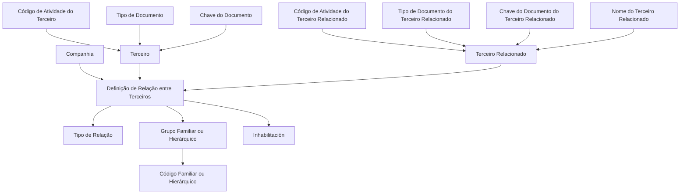

# Configuração de Relações Existentes entre Terceiros no Sistema — Documentação Reef

## 1. Metadados do Documento
- **Arquivo de Origem:** `Não identificado no conteúdo fornecido`
- **Tipo de Documento:** `Especificação Funcional`
- **Domínio / Sistema:** `Sistema de Terceiros / Documentação Reef / MAPFRE`
- **Público-Alvo:** `Analistas funcionais, equipes de negócio, desenvolvedores e operação`
- **Data/Versão Identificada:** `Não identificada`
- **Lifecycle identificado:** `Approved Source`
- **Owner identificado:** `user:agonzalez_mapfre.com`

---

## 2. Resumo Executivo & Contexto de Negócio

O documento descreve a configuração e a identificação de relações existentes entre terceiros registrados no Sistema. O núcleo funcional permite identificar, em um catálogo de informações, possíveis relações entre pessoas físicas e jurídicas cadastradas.

As relações entre terceiros podem decorrer de parentesco, nexos econômicos, vínculos emocionais, conexões acionárias e outros motivos não detalhados. O propósito é disponibilizar um catálogo que represente as relações ou conexões que cada entidade local deseja estabelecer entre atividades e terceiros.

A definição de uma relação utiliza dados de companhia, atividade do terceiro, tipo e chave do documento de identificação, dados equivalentes do terceiro relacionado, tipo de relação e informações de agrupamento familiar ou hierárquico. O documento também prevê a possibilidade de inabilitar um tipo de relação, vínculo ou laço familiar.

O catálogo não impõe uma recomendação ou padronização corporativa para codificação das relações. Cada entidade MAPFRE deve analisar localmente a melhor forma de codificar, explorar e utilizar esse catálogo nos processos da companhia.

---

## 3. Arquitetura, Componentes & Tecnologias Envolvidas

O conteúdo fornecido não descreve arquitetura técnica de software, APIs, microsserviços, bancos de dados, protocolos, ambientes ou tecnologias de implementação. A estrutura identificada é funcional e baseada em um catálogo de relações entre dois terceiros no Sistema.

### Componentes e conceitos identificados

| Componente / Conceito | Papel identificado no documento |
| :--- | :--- |
| Sistema | Mantém o catálogo e identifica relações entre pessoas físicas e jurídicas. |
| Catálogo de Relações / Conexões entre Terceiros | Repositório funcional de possíveis relações que uma entidade local deseja estabelecer. |
| Terceiro | Pessoa física ou jurídica identificada no Sistema por atividade, tipo de documento e chave de documento. |
| Terceiro Relacionado | Segundo terceiro envolvido na relação, também identificado por atividade e documento. |
| Companhia | Código da companhia sobre a qual é realizada a definição da relação entre terceiros. |
| Tipo de Relação | Atributo que identifica o tipo de relação segundo valores disponíveis em catálogo. |
| Grupo Familiar ou Hierárquico | Classificação que indica se os terceiros pertencem a uma unidade familiar ou a um grupo hierárquico. |
| Código Familiar ou Hierárquico | Código associado à definição da família ou do grupo hierarquizado do terceiro. |
| Inhabilitación | Propriedade que informa que um tipo de relação, vínculo ou laço familiar está desativado. |
| Documentação Reef | Área documental indicada como origem ou contexto do conteúdo. |
| MAPFRE | Entidade mencionada como responsável por decidir localmente a melhor forma de utilizar o catálogo. |



> **Nota de Análise:** O documento não detalha persistência de dados, métodos HTTP, contratos JSON, regras de autorização, integrações, telas, fluxos de aprovação ou tecnologias de implementação.

---

## 4. Regras de Negócio, Especificações Funcionais & Processos

### 4.1 Objetivo funcional

O objetivo declarado é identificar e organizar as possíveis relações que a entidade deseja estabelecer localmente entre atividades e terceiros.

### 4.2 Escopo de relações

O Sistema possibilita identificar relações existentes entre pessoas físicas e jurídicas capturadas no Sistema. As relações podem ser estabelecidas por:

- Motivos de parentesco.
- Nexos econômicos.
- Vínculos emocionais.
- Conexões acionárias.
- Outros motivos, mencionados de forma não exaustiva no documento.

### 4.3 Identificação dos participantes da relação

Uma relação envolve dois participantes:

1. **Terceiro:** pessoa física e/ou jurídica inicialmente identificada.
2. **Terceiro relacionado:** segunda pessoa física e/ou jurídica com a qual é estabelecida a relação.

A identificação de cada participante utiliza, conforme o conteúdo fornecido:

- Código de atividade.
- Tipo de documento.
- Chave do documento.

Para o terceiro relacionado, o documento também apresenta o nome do terceiro relacionado como propriedade identificadora.

### 4.4 Definição da relação

A definição de uma relação entre terceiros considera:

1. O código da companhia em que a definição é realizada.
2. O código de atividade do terceiro.
3. O tipo de documento do terceiro.
4. A chave do documento do terceiro.
5. O código de atividade do terceiro relacionado.
6. O tipo de documento do terceiro relacionado.
7. A chave do documento do terceiro relacionado.
8. O nome do terceiro relacionado.
9. O tipo de relação, de acordo com valores de um catálogo.
10. A condição de grupo familiar ou hierárquico.
11. O código familiar ou hierárquico associado à família ou grupo.
12. A condição de inabilitação do tipo de relação, vínculo ou laço familiar.

### 4.5 Tipo de relação

O atributo **Tipo de Relação** identifica a natureza da relação entre os terceiros. Os valores possíveis devem existir em um catálogo, mas o documento não fornece a lista de valores nem seus códigos.

### 4.6 Grupo familiar ou hierárquico

A propriedade **Grupo Familiar ou Jerárquico** indica, pelo respectivo valor, se os terceiros estão relacionados por:

- Pertencerem a uma unidade familiar; ou
- Pertencerem a um grupo hierárquico determinado.

A propriedade **Código** informa o código familiar ou hierárquico utilizado na definição da família ou do grupo hierarquizado do terceiro.

### 4.7 Inabilitação

A propriedade **Inhabilitación** indica ao Sistema que determinado tipo de relação, vínculo ou laço familiar encontra-se desativado.

> **Nota de Análise:** O documento não especifica se a inabilitação impede novos cadastros, remove relações existentes, bloqueia consultas, altera processos subsequentes ou apenas marca a relação como desativada.

### 4.8 Diretriz de uso local

Não existe preferência ou recomendação para estabelecer ou padronizar a codificação do catálogo de relações no Sistema. A entidade MAPFRE deve analisar a melhor forma de explorar e utilizar o catálogo nos processos da companhia.

### 4.9 Dependência documental

O documento recomenda a leitura de diretrizes e documentos funcionais relacionados, pois a interpretação isolada do conteúdo pode conduzir a erro. O vínculo documental explicitamente mencionado é:

- **Grupos Familiares / Grupos Jerarquizados**

---

## 5. Tabelas de Parâmetros, Ambientes e Estruturas de Dados

| Item / Parâmetro | Descrição / Função | Tipo / Valores / Formato | Ambiente / Observações |
| :--- | :--- | :--- | :--- |
| Companhia | Indica o código da companhia sobre a qual é realizada a definição da relação entre terceiros. | Código de companhia; formato não informado. | Aplicável à definição da relação. |
| Código de Atividade do Terceiro | Indica o código da atividade do terceiro. | Código; formato e catálogo não informados. | Usado para identificar o terceiro no Sistema. |
| Tipo de Documento | Identifica o tipo de documento utilizado para identificar uma das pessoas físicas e/ou jurídicas relacionadas. | Tipo de documento; valores não informados. | Aplicável ao terceiro inicial. |
| Chave do Documento | Contém a chave do documento que identifica o terceiro no Sistema, conforme o código de atividade ao qual pertence. | Chave de documento; formato não informado. | Aplicável ao terceiro inicial. |
| Código de Atividade do Terceiro Relacionado | Indica o código da atividade do terceiro relacionado. | Código; formato e catálogo não informados. | Usado para identificar o terceiro relacionado. |
| Tipo de Documento do Terceiro Relacionado | Identifica o tipo de documento utilizado para identificar o segundo terceiro da relação. | Tipo de documento; valores não informados. | Aplicável ao terceiro relacionado. |
| Chave do Documento do Terceiro Relacionado | Contém a chave do documento que identifica o terceiro relacionado no Sistema, conforme seu código de atividade. | Chave de documento; formato não informado. | O texto fornecido repete esta propriedade. |
| Nome do Terceiro Relacionado | Identifica o nome do terceiro relacionado no Sistema. | Nome; formato não informado. | Aplicável ao terceiro relacionado. |
| Tipo de Relação | Identifica o tipo de relação segundo valores de um catálogo. | Valor de catálogo; lista de valores não fornecida. | Pode representar parentesco, nexo econômico, vínculo emocional ou conexão acionária, entre outros. |
| Grupo Familiar ou Hierárquico | Indica se os terceiros são membros de uma unidade familiar ou de um grupo hierárquico. | Valor classificatório; valores exatos não informados. | Aplicável à classificação da relação. |
| Código | Indica o código familiar ou hierárquico relacionado à definição da família ou grupo hierarquizado. | Código; formato não informado. | Aplicável ao grupo familiar ou hierárquico. |
| Inhabilitación | Indica que o tipo de relação, vínculo ou laço familiar encontra-se desativado. | Estado de desativação; formato ou valores não informados. | O comportamento operacional da desativação não é detalhado. |
| Owner | Proprietário identificado na interface documental. | `user:agonzalez_mapfre.com` | Metadado exibido no conteúdo extraído. |
| Lifecycle | Estado de ciclo de vida documental exibido. | `Approved Source` | Metadado exibido no conteúdo extraído. |
| Documento relacionado | Documento funcional cuja leitura é recomendada. | `Grupos Familiares / Grupos Jerarquizados` | A leitura é recomendada para evitar interpretações isoladas incorretas. |

### Ambientes, URLs, servidores e logs

| Item / Parâmetro | Descrição / Função | Tipo / Valores / Formato | Ambiente / Observações |
| :--- | :--- | :--- | :--- |
| Ambientes | Não identificados no conteúdo fornecido. | Não aplicável. | O documento não apresenta URLs, servidores ou ambientes. |
| Rotas de log | Não identificadas no conteúdo fornecido. | Não aplicável. | O documento não apresenta caminhos ou variáveis de log. |
| APIs e endpoints | Não identificados no conteúdo fornecido. | Não aplicável. | O documento não detalha métodos HTTP, rotas ou contratos de integração. |

---

## 6. Bateria de Perguntas & Respostas para RAG (FAQ Sintético)

### P1: Qual é o objetivo do catálogo de relações entre terceiros?
**R:** O objetivo é identificar e organizar as possíveis relações que a entidade deseja estabelecer localmente entre atividades e terceiros. O catálogo permite representar relações entre pessoas físicas e jurídicas cadastradas no Sistema.

### P2: Que tipos de relação entre terceiros podem ser registrados no Sistema?
**R:** O documento menciona relações motivadas por parentesco, nexos econômicos, vínculos emocionais e conexões acionárias. A lista é exemplificativa, pois o texto utiliza “etcétera” e não apresenta um catálogo completo de valores.

### P3: Como um terceiro é identificado na definição de uma relação?
**R:** Um terceiro é identificado por seu código de atividade, tipo de documento e chave do documento. A chave do documento identifica o terceiro no Sistema de acordo com o código de atividade ao qual o terceiro pertence.

### P4: Quais dados identificam o terceiro relacionado?
**R:** O terceiro relacionado é identificado pelo código de atividade do terceiro relacionado, tipo de documento do terceiro relacionado, chave do documento do terceiro relacionado e nome do terceiro relacionado.

### P5: O que representa o atributo Tipo de Relação?
**R:** O atributo Tipo de Relação identifica a natureza da relação entre os terceiros, de acordo com valores existentes em um catálogo de possíveis valores. O documento não detalha a lista de valores ou os códigos desse catálogo.

### P6: Para que serve a propriedade Grupo Familiar ou Hierárquico?
**R:** A propriedade Grupo Familiar ou Hierárquico identifica se os terceiros estão relacionados por pertencerem a uma unidade familiar ou a um grupo hierárquico determinado.

### P7: Qual é a finalidade do Código familiar ou hierárquico?
**R:** O Código informa ao Sistema o código familiar ou hierárquico utilizado para realizar a definição da família ou do grupo hierarquizado do terceiro.

### P8: O que ocorre quando uma relação está marcada com Inhabilitación?
**R:** A propriedade Inhabilitación indica ao Sistema que o tipo de relação, vínculo ou laço familiar está desativado. O documento não especifica os efeitos operacionais dessa desativação sobre consulta, manutenção ou uso da relação em processos posteriores.

### P9: Existe uma codificação obrigatória ou padronizada para o catálogo de relações?
**R:** Não. O documento informa que não existe preferência nem recomendação para estabelecer ou padronizar a codificação no Sistema. Cada entidade MAPFRE deve analisar localmente a forma mais adequada de explorar e utilizar o catálogo em seus processos.

### P10: Quais entidades podem participar de uma relação no Sistema?
**R:** As relações podem ser estabelecidas entre pessoas físicas e jurídicas capturadas no Sistema. O documento não restringe a relação a combinações específicas entre pessoa física e pessoa jurídica.

### P11: Qual companhia é considerada na definição da relação entre terceiros?
**R:** A propriedade Companhia indica o código da companhia sobre a qual está sendo realizada a definição da relação entre terceiros. O formato do código e a lista de companhias não são informados.

### P12: Quais documentos relacionados devem ser consultados para complementar a interpretação?
**R:** O documento recomenda a leitura das diretrizes e documentos funcionais vinculados para evitar interpretações incorretas decorrentes da leitura isolada. O vínculo citado é “Grupos Familiares / Grupos Jerarquizados”.

---

## 7. Glossário de Termos, Siglas & Conceitos-Chave

- **Atividade do Terceiro:** Código de atividade associado ao terceiro no Sistema e utilizado em sua identificação.
- **Catálogo de Relações / Conexões entre Terceiros:** Catálogo de informações que reúne possíveis relações entre terceiros.
- **Chave do Documento:** Chave que identifica um terceiro ou terceiro relacionado no Sistema, de acordo com o respectivo código de atividade.
- **Companhia:** Código da companhia sobre a qual é realizada a definição de uma relação entre terceiros.
- **Conexão Acionária:** Tipo de conexão citado como possível motivo para estabelecer uma relação entre terceiros.
- **Grupo Familiar:** Unidade familiar à qual terceiros podem pertencer, conforme a classificação da relação.
- **Grupo Hierárquico / Grupo Jerarquizado:** Grupo determinado ao qual terceiros podem pertencer, conforme a classificação da relação.
- **Inhabilitación:** Propriedade que informa que um tipo de relação, vínculo ou laço familiar está desativado.
- **MAPFRE:** Entidade mencionada como responsável por analisar localmente a melhor maneira de explorar e utilizar o catálogo de relações.
- **Nexo Econômico:** Tipo de vínculo citado como possível motivo para estabelecer uma relação entre terceiros.
- **Pessoa Física:** Entidade pessoal que pode ser capturada no Sistema e relacionada a outros terceiros.
- **Pessoa Jurídica:** Entidade jurídica que pode ser capturada no Sistema e relacionada a outros terceiros.
- **Reef:** Nome presente na interface e na documentação extraída como “DOCUMENTACIÓN Reef”.
- **Sistema:** Aplicação ou núcleo funcional referido pelo documento; seu nome técnico não é informado.
- **Terceiro:** Pessoa física ou jurídica capturada no Sistema e participante de uma relação.
- **Terceiro Relacionado:** Segundo terceiro, pessoa física ou jurídica, com o qual uma relação é estabelecida.
- **Tipo de Documento:** Atributo que identifica o tipo de documento utilizado para identificar um terceiro.
- **Tipo de Relação:** Atributo que identifica a natureza da relação entre terceiros mediante valores de catálogo.
- **Vínculo Emocional:** Tipo de vínculo citado como possível motivo para estabelecer uma relação entre terceiros.

---

## 8. Notas Críticas, Riscos & Limitações

- O conteúdo não identifica o nome técnico do Sistema, sua arquitetura, módulos técnicos, serviços, banco de dados ou integrações.
- O catálogo de valores para **Tipo de Relação** é mencionado, mas seus valores, códigos, regras de manutenção e responsáveis não são detalhados.
- Os formatos, tamanhos, obrigatoriedade e regras de validação dos campos de companhia, atividade, tipos de documento, chaves de documento e códigos familiares ou hierárquicos não são informados.
- A semântica operacional da propriedade **Inhabilitación** é limitada à indicação de desativação. O documento não informa impactos em consultas, inclusão, alteração, exclusão ou processamento posterior.
- Não há detalhamento de APIs, métodos HTTP, contratos JSON, mensagens, integrações, URLs, servidores, ambientes, rotas de log ou mecanismos de auditoria.
- Não há especificação de permissões, perfis, matriz de acesso, responsabilidades de manutenção ou processo de aprovação para alterações no catálogo.
- A ausência de uma recomendação de padronização de codificação transfere às entidades MAPFRE a responsabilidade de definir convenções locais. Isso pode gerar heterogeneidade entre companhias caso não existam diretrizes complementares.
- A leitura isolada do documento pode conduzir a erro, conforme o próprio texto. É recomendada a consulta do documento relacionado **Grupos Familiares / Grupos Jerarquizados**.
- O texto extraído apresenta repetição da propriedade **Clave del Documento del Tercero Relacionado** e caracteres de extração corrompidos em termos como “identicar”, “denición” e “codicación”. Esta estrutura mantém o sentido apresentado, sem inferir conteúdo adicional.

---

## 9. Conteúdo Bruto Estruturado (Referência Fiel)

```text
--- [PÁGINA 1 DE 2] ---

CONFIGURAR las RELACIONES Existentes entre TERCEROS
Contexto
Funcionalmente, el núcleo del Sistema cuenta con la posibilidad de identicar en un catálogo de información las posibles relaciones
existentes entre las Personas Físicas y Jurídicas capturadas en el Sistema.
Estas relaciones pueden establecerse por motivos de parentesco, por nexos económicos, por vínculos emocionales, por conexiones
accionariales, etcétera,...
Objetivo
Identicar y Organizar las posibles Relaciones que la entidad localmente desea establecer entre Actividades y Terceros.
Propiedades
Otras Propiedades
Propiedades
Compañía
Esta propiedad le indica al sistema el código de la compañía sobre la que se está realizando la denición de la Relación de los Terceros.
Código de Actividad del Tercero
Esta propiedad indica en el sistema el código de la Actividad del Tercero.
Tipo Documento
Este Atributo del identica el tipo de documento con el que se va a identicar a una de las dos personas físicas y/o jurídicas relacionadas.
Clave del Documento
Esta propiedad contiene la clave del documento que identica al Tercero en el Sistema de acuerdo con el Código de Actividad al que
pertenece.
Código de Actividad del Tercero Relacionado
Esta propiedad indica en el sistema el código de la Actividad del Tercero Relacionado.
Tipo Documento del Tercero Relacionado
Este Atributo del identica el tipo de documento con el que se va a identicar al segundo Tercero con el que se establece la relación.
Documentation / DOCUMENTACIÓN Reef
DOCUMENTACIÓN Reef
Mapfredocument
DOCUMENTACIÓN Reef
Owner
user:agonzalez_mapfre.com
Lifecycle
Approved Source
 / 
 VL
Buscar Inicio Soluciones Arquitecturas APIs Componentes Cloud Documentación Zeus Reef Ayuda
ES


--- [PÁGINA 2 DE 2] ---

Clave del Documento del Tercero Relacionado
Esta propiedad contiene la clave del documento que identica al Tercero relacionado en el Sistema de acuerdo con el Código de Actividad al
que pertenece.
Clave del Documento del Tercero Relacionado
Esta propiedad contiene la clave del documento que identica al Tercero relacionado en el Sistema de acuerdo con el Código de Actividad al
que pertenece.
Nombre del Tercero Relacionado
Esta propiedad identica el nombre del Tercero relacionado en el Sistema.
Tipo de Relación
Este Atributo identica el Tipo de Relación de acuerdo con alguno de los valores del catálogo en el que se identican sus posibles valores.
Grupo Familiar o Jerárquico
Esta propiedad identica por su valor si los Terceros están relacionados por ser miembros pertenecientes a una Unidad Familiar o por
pertenecer a un Grupo Jerárquico determinado.
Código
Esta propiedad le indica al sistema el código Familiar o Jerárquico sobre la que se está realizando la denición de la Familia o del Grupo
Jerarquizado del Tercero.
Otras Propiedades
Inhabilitación
Esta propiedad le indica al Sistema que el Tipo de Relación, vínculo o Lazo Familiar se encuentra desactivado.
Vínculos
Relación de Directrices y Documentos funcionales cuya lectura recomendada para evitar que la interpretación aislada del presente
documento pueda conducir a error.
Grupos Familiares / Grupos Jerarquizados
Preguntas frecuentes
(1) ¿Existe alguna recomendación operativa que deba ser tomada en consideración localmente en la codicación, uso y denición del
catálogo de Relaciones / Conexiones entre Terceros?
No existe una preferencia ni recomendación para establecer o estandarizar en el sistema su codicación, si bien la entidad MAPFRE debe
analizar la mejor manera de explotar y utilizar en los procesos de la compañía este catálogo de información.
```
