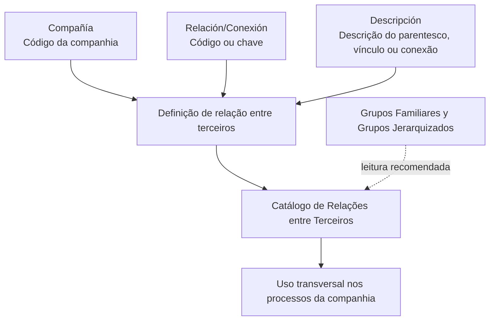

# Definição de Possíveis Relações e Conexões entre Terceiros

## 1. Metadados do Documento
- **Arquivo de Origem:** Não informado
- **Tipo de Documento:** Especificação Técnica
- **Domínio / Sistema:** Catálogo de Relações e Conexões entre Terceiros — MAPFRE / Reef
- **Público-Alvo:** Negócio, Analistas Funcionais, Desenvolvedores e Operação
- **Data/Versão Identificada:** Não identificada

---

## 2. Resumo Executivo & Contexto de Negócio

O documento define o objetivo e as propriedades utilizadas para identificar, organizar e manter possíveis conexões ou relações entre terceiros. O escopo central é um catálogo de informações que representa parentescos, vínculos ou conexões entre entidades classificadas como terceiros.

A definição de uma relação entre terceiros é contextualizada por uma companhia. A propriedade **Compañía** informa ao sistema o código da companhia sobre a qual a definição de parentesco, vínculo ou conexão está sendo realizada. Dessa forma, a relação não é descrita como um conceito isolado: ela é registrada no contexto da companhia correspondente.

O catálogo contém uma chave de identificação da relação ou conexão e uma descrição associada. A propriedade **Relación/Conexión** identifica o código ou chave da relação, enquanto a propriedade **Descripción** informa a descrição do código de parentesco, vínculo ou conexão definido.

O documento recomenda a leitura de documentos funcionais relacionados, especificamente **Grupos Familiares y Grupos Jerarquizados**, para evitar interpretações incorretas decorrentes da análise isolada deste conteúdo. Não há recomendação para padronizar a codificação das relações no sistema; entretanto, a entidade MAPFRE deve analisar a melhor forma de usar o catálogo transversalmente nos processos da companhia, permitindo exploração posterior correta e coerente.

---

## 3. Arquitetura, Componentes & Tecnologias Envolvidas

O conteúdo não descreve arquitetura técnica de software, integrações, métodos HTTP, contratos JSON, bancos de dados, servidores, ambientes ou tecnologias de implementação.

Os elementos funcionais identificados são:

- **Catálogo de Relações entre Terceiros:** catálogo usado para registrar informações sobre relações, parentescos, vínculos ou conexões.
- **Compañía:** propriedade que contextualiza uma definição de relação para uma companhia.
- **Relación/Conexión:** código ou chave que identifica a relação ou conexão.
- **Descripción:** descrição associada ao código de parentesco, vínculo ou conexão.
- **Grupos Familiares y Grupos Jerarquizados:** documentação funcional relacionada cuja leitura é recomendada.
- **MAPFRE:** entidade citada como responsável por analisar o uso transversal do catálogo nos processos da companhia.
- **Reef / DOCUMENTACIÓN Reef / Mapfredocument:** referências de navegação ou repositório documental presentes no conteúdo bruto.



> **Nota de Análise:** O documento apresenta propriedades funcionais do catálogo, mas não detalha estrutura de persistência, regras de unicidade, interfaces de manutenção, APIs, permissões, métodos HTTP ou contratos de integração.

---

## 4. Regras de Negócio, Especificações Funcionais & Processos

### 4.1 Objetivo funcional

O objetivo declarado é:

> Identificar e organizar as possíveis conexões ou relações que podem ocorrer entre terceiros.

O catálogo é destinado à definição de códigos relacionados a:

- Parentesco.
- Vínculo.
- Conexão entre terceiros.

### 4.2 Contextualização por companhia

A propriedade **Compañía** informa o código da companhia sobre a qual está sendo realizada a definição do parentesco, vínculo ou conexão entre terceiros.

Implicações funcionais explicitamente sustentadas pelo documento:

1. A definição de uma relação entre terceiros possui contexto de companhia.
2. O sistema deve receber ou considerar o código da companhia para a qual a definição está sendo realizada.
3. O documento não informa se o mesmo código de relação pode ser reutilizado entre companhias distintas.
4. O documento não especifica formato, tamanho, domínio de valores ou origem do código de companhia.

### 4.3 Identificação da relação ou conexão

A propriedade **Relación/Conexión** identifica o código ou a chave da relação ou conexão.

O documento não detalha:

- Regras de geração do código.
- Obrigatoriedade do campo.
- Formato alfanumérico ou numérico.
- Regras de unicidade.
- Catálogo prévio de tipos de relacionamento.
- Validações de consistência entre relação, companhia e terceiro.

### 4.4 Descrição da relação, vínculo ou parentesco

A propriedade **Descripción** informa a descrição do código de parentesco, vínculo ou conexão para o qual a definição está sendo realizada.

A descrição é associada ao código identificado em **Relación/Conexión**. O documento não informa idioma obrigatório, tamanho máximo, regras de preenchimento ou controle de valores permitidos.

### 4.5 Uso e codificação do catálogo

A seção de perguntas frequentes estabelece que não existe recomendação para estabelecer ou padronizar a codificação no sistema.

Apesar da ausência de padronização de codificação, a entidade MAPFRE deve analisar a melhor maneira de utilizar transversalmente esse catálogo de informações nos processos da companhia, com os seguintes objetivos declarados:

1. Uso correto do catálogo.
2. Uso coerente do catálogo.
3. Exploração posterior das informações registradas.

### 4.6 Documentação relacionada

O documento recomenda a leitura de **Grupos Familiares y Grupos Jerarquizados**. A finalidade declarada dessa leitura é evitar que a interpretação isolada do documento atual conduza a erro.

> **Nota de Análise:** O conteúdo não apresenta o fluxo operacional para criação, alteração, consulta, aprovação ou exclusão de relações entre terceiros. Também não detalha quais processos corporativos consomem o catálogo.

---

## 5. Tabelas de Parâmetros, Ambientes e Estruturas de Dados

| Item / Parâmetro | Descrição / Função | Tipo / Valores / Formato | Ambiente / Observações |
| :--- | :--- | :--- | :--- |
| Objetivo | Identificar e organizar possíveis conexões ou relações entre terceiros. | Objetivo funcional | Não são descritos indicadores, métricas ou critérios de sucesso. |
| Compañía | Indica ao sistema o código da companhia sobre a qual a definição de parentesco, vínculo ou conexão está sendo realizada. | Código de companhia; formato não informado | Contextualiza a definição da relação entre terceiros. |
| Relación/Conexión | Identifica o código ou a chave da relação ou conexão. | Código ou chave; formato não informado | Não há regra de padronização de codificação informada. |
| Descripción | Informa a descrição do código de parentesco, vínculo ou conexão definido. | Texto; formato não informado | Associada ao código de relação ou conexão. |
| Catálogo de Relações entre Terceiros | Catálogo de informações utilizado transversalmente nos processos da companhia. | Catálogo funcional | A MAPFRE deve analisar a melhor forma de utilização transversal. |
| Grupos Familiares y Grupos Jerarquizados | Documento funcional relacionado cuja leitura é recomendada. | Referência documental | A leitura visa evitar erros de interpretação isolada. |
| MAPFRE | Entidade que deve analisar o uso transversal do catálogo nos processos da companhia. | Entidade corporativa citada | O documento não detalha responsáveis, áreas ou processo decisório. |
| Reef / DOCUMENTACIÓN Reef | Referência documental exibida no conteúdo extraído. | Repositório ou contexto documental; não detalhado | Não há URL, permissões ou instruções de acesso informadas. |
| Owner | `user:agonzalez_mapfre.com` | Identificação exibida no conteúdo | O documento não esclarece o papel operacional ou a responsabilidade associada. |
| Lifecycle | `Approved Source` | Estado exibido no conteúdo | Não há explicação sobre o ciclo de vida ou critérios de aprovação. |
| Idioma exibido | `ES` | Código exibido na navegação | O conteúdo principal está em espanhol. |

---

## 6. Bateria de Perguntas & Respostas para RAG (FAQ Sintético)

### P1: Qual é o objetivo do catálogo de Relações e Conexões entre Terceiros?
**R:** O objetivo é identificar e organizar as possíveis conexões ou relações que podem existir entre terceiros. O documento associa essas relações a conceitos como parentesco, vínculo ou conexão.

### P2: Qual propriedade informa a companhia para a qual uma relação entre terceiros está sendo definida?
**R:** A propriedade **Compañía** informa ao sistema o código da companhia sobre a qual está sendo realizada a definição de parentesco, vínculo ou conexão entre terceiros.

### P3: O que representa o atributo Relación/Conexión?
**R:** O atributo **Relación/Conexión** identifica o código ou a chave da relação ou conexão entre terceiros. O documento não especifica formato, tamanho, padrão ou regra de geração desse código.

### P4: Qual é a função da propriedade Descripción?
**R:** A propriedade **Descripción** informa a descrição do código de parentesco, vínculo ou conexão para o qual a definição está sendo realizada.

### P5: Existe uma recomendação corporativa para padronizar a codificação das relações entre terceiros?
**R:** Não. O documento afirma que não existe recomendação para estabelecer ou padronizar a codificação no sistema.

### P6: Qual orientação é fornecida à entidade MAPFRE sobre o catálogo de relações entre terceiros?
**R:** A MAPFRE deve analisar a melhor maneira de usar transversalmente o catálogo de informações nos processos da companhia, para viabilizar uso correto, coerente e posterior exploração das informações.

### P7: Quais documentos devem ser consultados para evitar interpretações incorretas do catálogo?
**R:** O documento recomenda a leitura de **Grupos Familiares y Grupos Jerarquizados**, pois a interpretação isolada do documento atual pode conduzir a erro.

### P8: O documento define APIs, métodos HTTP ou contratos JSON para o catálogo de relações?
**R:** Não. O conteúdo não descreve APIs, métodos HTTP, contratos JSON, integrações, estruturas de banco de dados ou tecnologias de implementação.

### P9: O documento informa como criar, alterar ou excluir uma relação entre terceiros?
**R:** Não. O documento apresenta o objetivo e as propriedades da definição, mas não descreve fluxos operacionais de criação, alteração, consulta, aprovação ou exclusão.

### P10: Quais dados mínimos são explicitamente apresentados para definir uma relação ou conexão?
**R:** O documento apresenta três propriedades: **Compañía**, que identifica o código da companhia; **Relación/Conexión**, que identifica o código ou chave da relação; e **Descripción**, que informa a descrição do parentesco, vínculo ou conexão.

### P11: O que significa o status Lifecycle “Approved Source” exibido no conteúdo?
**R:** O conteúdo apresenta `Lifecycle Approved Source`, mas não define o significado operacional desse status, nem os critérios de aprovação ou o processo de ciclo de vida documental.

### P12: Há ambientes, URLs, servidores ou rotas de log documentados?
**R:** Não. O conteúdo não apresenta URLs, ambientes, servidores, portas, caminhos de log ou parâmetros técnicos de operação.

---

## 7. Glossário de Termos, Siglas & Conceitos-Chave

- **Compañía:** propriedade que indica o código da companhia sobre a qual é realizada a definição de parentesco, vínculo ou conexão entre terceiros.
- **Descripción:** propriedade que informa a descrição do código de parentesco, vínculo ou conexão.
- **Grupos Familiares y Grupos Jerarquizados:** documento funcional relacionado cuja leitura é recomendada para evitar interpretação isolada incorreta.
- **MAPFRE:** entidade mencionada como responsável por analisar o uso transversal do catálogo nos processos da companhia.
- **Relação/Conexão:** código ou chave que identifica uma relação ou conexão entre terceiros.
- **Terceiros:** entidades entre as quais podem existir relações, parentescos, vínculos ou conexões; o documento não fornece uma definição adicional.
- **Reef:** termo exibido em referências de documentação e navegação; o documento não define o significado do termo.
- **Mapfredocument:** termo exibido em referência documental; o documento não fornece definição adicional.
- **Lifecycle:** campo exibido com o valor `Approved Source`; o documento não define o processo ou os estados desse ciclo de vida.
- **Owner:** campo exibido com o valor `user:agonzalez_mapfre.com`; o documento não explica sua responsabilidade ou papel.

---

## 8. Notas Críticas, Riscos & Limitações

- O documento afirma que não há recomendação para estabelecer ou padronizar a codificação das relações no sistema. Essa ausência de padronização pode exigir análise adicional da MAPFRE para assegurar uso transversal coerente.
- A interpretação isolada do documento pode levar a erro; por isso, a leitura de **Grupos Familiares y Grupos Jerarquizados** é explicitamente recomendada.
- Não são descritas regras de validação, obrigatoriedade, unicidade, formato ou domínio de valores para **Compañía**, **Relación/Conexión** e **Descripción**.
- Não há detalhamento sobre governança do catálogo, responsáveis, aprovações, controle de mudanças ou ciclo de vida de registros.
- Não são fornecidos fluxos de operação, integrações, APIs, contratos, ambientes, URLs, servidores, mecanismos de autenticação ou rotas de logs.
- O status `Approved Source` e o campo `Owner user:agonzalez_mapfre.com` aparecem no conteúdo, mas seus significados operacionais não são explicados.
- **Nota de Análise:** O documento lista o catálogo de relações entre terceiros, porém não detalha como os códigos são criados, consumidos ou validados pelos processos corporativos.

---

## 9. Conteúdo Bruto Estruturado (Referência Fiel)

```text
--- [PÁGINA 1 DE 1] ---

DEFINICIÓN de las Posibles RELACIONES y CONEXIONES de los
TERCEROS
Objetivo
Identicar y Organizar las Posibles Conexiones o Relaciones que se puedan dar entre Terceros.
Propiedades
Propiedades
Compañía
Esta propiedad le indica al sistema el código de la compañía sobre la que se está realizando la denición del parentesco, vínculo o conexión
entre Terceros.
Relación/Conexión
Este Atributo identica el Código o Clave de la Relación/Conexión.
Descripción
Esta propiedad le indica al sistema la descripción del código de parentesco, vínculo o conexión para el que se está realizando la denición.
Vínculos
Relación de Directrices y Documentos funcionales cuya lectura recomendada para evitar que la interpretación aislada del presente
documento pueda conducir a error.
Grupos Familiares y Grupos Jerarquizados
Preguntas frecuentes
(1) ¿Existe alguna recomendación operativa que deba ser tomada en consideración localmente en la codicación, uso y denición del
catálogo de Relaciones entre Terceros?
No existe recomendación alguna para establecer o estandarizar en el sistema su codicación, si bien la entidad MAPFRE debe analizar la
mejor manera de utilizar transversalmente en los procesos de la compañía este catálogo de información para su correcta, coherente y
posterior explotación.
Documentation / DOCUMENTACIÓN Reef
DOCUMENTACIÓN Reef
Mapfredocument
DOCUMENTACIÓN Reef
Owner
user:agonzalez_mapfre.com
Lifecycle
Approved Source
 / 
 VL
Buscar Inicio Soluciones Arquitecturas APIs Componentes Cloud Documentación Zeus Reef Ayuda
ES
```
