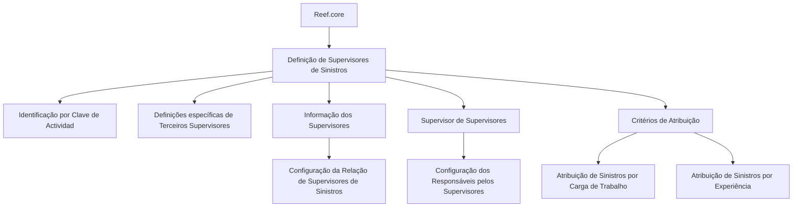

# Definição e Configuração de Supervisores de Sinistros no Reef.core

## 1. Metadados do Documento
- **Arquivo de Origem:** Não identificado no conteúdo extraído
- **Tipo de Documento:** Documentação de sistema
- **Domínio / Sistema:** Reef.core / Reef
- **Público-Alvo:** Operação, configuração funcional e administradores do sistema
- **Data/Versão Identificada:** Não identificada
- **Owner Identificado:** `user:agonzalez_mapfre.com`
- **Lifecycle Identificado:** `Approved Source / VL`

---

## 2. Resumo Executivo & Contexto de Negócio

O documento descreve a definição de **Supervisores de Sinistros** no sistema **Reef.core**. O objetivo é relacionar os elementos necessários para configurar esses supervisores e permitir sua operação posterior no sistema.

No Reef.core, os Supervisores são identificados por uma **Clave de Actividad**. O conteúdo extraído apresenta uma referência a “Clave de Actividad... 8”, sem detalhar o significado completo, o formato ou o processo de manutenção dessa chave.

A configuração está organizada em definições específicas de terceiros que se aplicam exclusivamente quando o terceiro possui o papel de **SUPERVISOR**. O documento também apresenta áreas funcionais para informar supervisores, configurar relações entre supervisores de sinistros, definir supervisor de supervisores e configurar critérios de atribuição.

Os critérios de atribuição permitem associar sinistros a supervisores considerando fatores como **carga de trabalho** e **experiência**. O documento não detalha fórmulas, pesos, prioridades, telas, campos obrigatórios específicos ou regras de desempate para esses critérios.

---

## 3. Arquitetura, Componentes & Tecnologias Envolvidas

Os componentes e conceitos explicitamente identificados são:

| Componente / Conceito | Papel descrito no documento |
| :--- | :--- |
| Reef.core | Sistema no qual Supervisores de Sinistros são configurados e posteriormente operados. |
| Supervisor de Sinistros | Terceiro configurado para atuar na supervisão de sinistros. |
| Clave de Actividad | Identificador utilizado pelo Reef.core para reconhecer Supervisores. |
| Información de los Supervisores | Área de configuração da relação de Supervisores de Sinistros. |
| Supervisor de Supervisores | Área de configuração dos responsáveis pelos Supervisores de Sinistros. |
| Criterios de Asignación | Área de configuração de critérios para atribuir sinistros aos Supervisores. |
| Documentación Reef | Repositório ou contexto documental associado ao conteúdo. |
| Mapfredocument | Termo exibido no conteúdo, sem explicação funcional adicional. |
| Zeus | Termo presente na navegação documental, sem relação arquitetural explicada. |



> **Nota de Análise:** O conteúdo não descreve uma arquitetura técnica de software, integrações, APIs, bancos de dados, tecnologias de implementação, contratos HTTP ou fluxos de dados entre sistemas.

---

## 4. Regras de Negócio, Especificações Funcionais & Processos

### 4.1 Configuração de Supervisores de Sinistros

1. O Reef.core possui elementos que permitem configurar Supervisores de Sinistros.
2. A configuração é necessária para que os Supervisores possam operar posteriormente no sistema.
3. O Reef.core identifica os Supervisores por meio da **Clave de Actividad**.
4. O conteúdo apresenta a referência “Clave de Actividad... 8”, mas não explica o significado operacional completo do valor ou referência `8`.
5. Os asteriscos presentes nas tarjetas indicam se a configuração de um elemento é obrigatória em relação à definição dos Supervisores.

### 4.2 Definições Específicas de Terceiros Supervisores

1. Existe um grupo de definições utilizado exclusivamente quando um terceiro é um **SUPERVISOR**.
2. O conteúdo não especifica quais campos, atributos, entidades ou telas compõem esse grupo de definições específicas.
3. O conteúdo não descreve o ciclo de vida de um terceiro Supervisor, critérios de elegibilidade ou processo de desativação.

### 4.3 Informação dos Supervisores

A seção **INFORMACIÓN DE LOS SUPERVISORES** é indicada como responsável pela configuração da relação de Supervisores de Sinistros.

> **Nota de Análise:** O documento não detalha se a relação é hierárquica, muitos-para-muitos, vinculada a unidades organizacionais, produtos, tipos de sinistro ou outras dimensões de negócio.

### 4.4 Supervisor de Supervisores

A seção **SUPERVISOR DE SUPERVISORES** permite configurar os responsáveis pelos Supervisores de Sinistros.

> **Nota de Análise:** O conteúdo não define quantidade máxima de responsáveis, regras de substituição, níveis hierárquicos, permissões ou impactos dessa responsabilidade na distribuição de sinistros.

### 4.5 Critérios de Atribuição

A seção **CRITERIOS DE ASIGNACIÓN** permite configurar critérios para atribuição de sinistros a Supervisores.

Os critérios explicitamente mencionados são:

- Carga de trabalho.
- Experiência.

> **Nota de Análise:** O documento não apresenta regras de cálculo, pesos, indicadores de carga, escalas de experiência, prioridades, critérios de desempate, periodicidade de atualização ou comportamento quando não há Supervisor elegível.

---

## 5. Tabelas de Parâmetros, Ambientes e Estruturas de Dados

| Item / Parâmetro | Descrição / Função | Tipo / Valores / Formato | Ambiente / Observações |
| :--- | :--- | :--- | :--- |
| Reef.core | Sistema utilizado para configurar e operar Supervisores de Sinistros. | Sistema | Não são informados ambiente, versão ou URL. |
| Supervisor de Sinistros | Papel de terceiro configurado para atuar com sinistros. | Entidade funcional / papel | O documento não detalha atributos do terceiro. |
| Clave de Actividad | Mecanismo pelo qual Reef.core identifica Supervisores. | Chave de atividade | Referência exibida: `8`; significado não detalhado. |
| Asteriscos das Tarjetas | Indicam se a configuração de um elemento é obrigatória para a definição de Supervisores. | Indicador visual de obrigatoriedade | Não são listadas as tarjetas ou os campos obrigatórios. |
| Información de los Supervisores | Configuração da relação de Supervisores de Sinistros. | Área funcional | Sem detalhamento de campos ou relacionamentos. |
| Supervisor de Supervisores | Configuração dos responsáveis pelos Supervisores de Sinistros. | Área funcional | Sem regras hierárquicas descritas. |
| Criterios de Asignación | Configuração dos critérios de atribuição de sinistros a Supervisores. | Área funcional | Critérios citados: carga de trabalho e experiência. |
| Carga de Trabajo | Critério de atribuição de sinistros a Supervisores. | Critério de negócio | Sem fórmula ou unidade de medição. |
| Experiencia | Critério de atribuição de sinistros a Supervisores. | Critério de negócio | Sem escala, pesos ou parâmetros detalhados. |
| Owner | Proprietário identificado no conteúdo. | Identificador de usuário | `user:agonzalez_mapfre.com` |
| Lifecycle | Estado de ciclo de vida do documento. | Estado documental | `Approved Source / VL` |
| Idioma exibido | Idioma selecionado na navegação documental. | Código de idioma | `ES` |

---

## 6. Bateria de Perguntas & Respostas para RAG (FAQ Sintético)

### P1: Qual é o objetivo da configuração de Supervisores de Sinistros no Reef.core?
**R:** A configuração de Supervisores de Sinistros no Reef.core tem o objetivo de relacionar os elementos necessários para definir esses supervisores e permitir que eles operem posteriormente no sistema.

### P2: Como o Reef.core identifica um Supervisor de Sinistros?
**R:** O Reef.core identifica os Supervisores por meio da **Clave de Actividad**. O conteúdo extraído também apresenta a referência “Clave de Actividad... 8”, mas não explica o significado completo dessa referência.

### P3: O que significam os asteriscos das tarjetas na definição de Supervisores?
**R:** Os asteriscos das tarjetas indicam se a configuração de determinado elemento é obrigatória em relação à definição dos Supervisores.

### P4: Quais definições são exclusivas de um Terceiro Supervisor?
**R:** O documento informa que existe um grupo de definições empregado exclusivamente quando o terceiro é um **SUPERVISOR**. Contudo, o conteúdo não lista os campos, atributos ou regras específicas desse grupo.

### P5: Para que serve a seção Información de los Supervisores?
**R:** A seção **Información de los Supervisores** é utilizada para configurar a relação de Supervisores de Sinistros.

### P6: O que é configurado em Supervisor de Supervisores?
**R:** A seção **Supervisor de Supervisores** é destinada à configuração dos responsáveis pelos Supervisores de Sinistros.

### P7: Quais critérios de atribuição de sinistros são mencionados no documento?
**R:** O documento menciona que os sinistros podem ser atribuídos aos Supervisores conforme critérios como **carga de trabalho** e **experiência**.

### P8: O documento informa como calcular a carga de trabalho dos Supervisores?
**R:** Não. O conteúdo apenas cita a carga de trabalho como um critério de atribuição de sinistros, sem apresentar fórmula, indicadores, pesos, periodicidade ou regras de cálculo.

### P9: O documento define como medir a experiência de um Supervisor?
**R:** Não. A experiência é citada como um critério de atribuição, porém não há definição de escala, requisitos mínimos, fonte de dados, pesos ou impacto no processo de decisão.

### P10: O documento descreve APIs, métodos HTTP ou contratos JSON para Supervisores?
**R:** Não. O conteúdo extraído não apresenta APIs, métodos HTTP, contratos JSON, integrações técnicas, URLs de serviço ou especificações de comunicação entre sistemas.

### P11: Qual é o owner identificado na documentação Reef?
**R:** O owner identificado no conteúdo é `user:agonzalez_mapfre.com`.

### P12: Qual estado de ciclo de vida é exibido para a documentação?
**R:** O conteúdo informa o lifecycle como `Approved Source / VL`.

---

## 7. Glossário de Termos, Siglas & Conceitos-Chave

- **Reef.core:** Sistema no qual são configurados e operados Supervisores de Sinistros.
- **Reef:** Nome utilizado no contexto da documentação exibida como “DOCUMENTACIÓN Reef”.
- **Supervisor de Sinistros:** Terceiro configurado para supervisionar sinistros no Reef.core.
- **Tercero:** Entidade mencionada pelo documento; no contexto apresentado, pode possuir o papel de SUPERVISOR.
- **SUPERVISOR:** Classificação de terceiro para a qual existem definições específicas.
- **Clave de Actividad:** Chave utilizada pelo Reef.core para identificar Supervisores.
- **Información de los Supervisores:** Área de configuração da relação de Supervisores de Sinistros.
- **Supervisor de Supervisores:** Configuração dos responsáveis pelos Supervisores de Sinistros.
- **Criterios de Asignación:** Configuração de critérios para atribuir sinistros a Supervisores.
- **Carga de Trabajo:** Critério citado para atribuir sinistros conforme a carga de trabalho dos Supervisores.
- **Experiencia:** Critério citado para atribuir sinistros conforme a experiência dos Supervisores.
- **Tarjetas:** Elementos de interface ou configuração cujos asteriscos indicam obrigatoriedade, conforme o documento.
- **Mapfredocument:** Termo exibido no conteúdo, sem definição adicional.
- **Zeus:** Termo exibido na navegação documental, sem definição adicional.
- **Lifecycle:** Campo de ciclo de vida documental; o valor exibido é `Approved Source / VL`.
- **ES:** Código de idioma exibido na navegação; no contexto, indica espanhol.

---

## 8. Notas Críticas, Riscos & Limitações

- O conteúdo é resumido e não apresenta detalhamento de telas, campos, entidades, relacionamentos ou regras de persistência.
- A referência “Clave de Actividad... 8” é apresentada sem contexto suficiente para determinar seu significado funcional ou técnico.
- Não há parâmetros quantitativos para carga de trabalho ou experiência.
- Não há definição de prioridade entre critérios de atribuição de sinistros.
- Não há regras para desempate, indisponibilidade de Supervisores ou ausência de Supervisores elegíveis.
- Não há informações sobre autenticação, autorização, perfis de acesso ou matriz de permissões.
- Não há descrição de APIs, integrações, URLs, ambientes, bancos de dados ou tecnologias de implementação.
- **Nota de Análise:** O documento lista funcionalidades relacionadas a Supervisores de Sinistros, mas não detalha métodos HTTP, contratos JSON, regras de cálculo ou comportamentos operacionais completos.

---

## 9. Conteúdo Bruto Estruturado (Referência Fiel)

```text
--- [PÁGINA 1 DE 1] ---

DEFINICIÓN de los SUPERVISORES
Se relacionan los elementos que permiten congurar en Reef.core a los Supervisores de Siniestros para poder operar posteriormente con
ellos en el Sistema.
Reef.core identica a los Supervisores con la Clave de Actividad... 8.
Los Asteriscos de las Tarjetas indican si la conguración del elemento es obligatoria en relación con la denición de los Supervisores.
Deniciones ESPECÍFICAS, propias de los Terceros SUPERVISORES
En este Grupo se encuentran deniciones que se emplean exclusivamente cuando el Tercero es un
SUPERVISOR.
INFORMACIÓN DE LOS SUPERVISORES
Conguración de la Relación de
Supervisores de Siniestros.
SUPERVISOR DE SUPERVISORES
Conguración de los Responsables de los
Supervisores de Siniestros.
CRITERIOS DE ASIGNACIÓN
Conguración de los Criterios de
Asignación de Siniestros a los
Supervisores por carga de Trabajo,
Experiencia,...
Documentation / DOCUMENTACIÓN Reef
DOCUMENTACIÓN Reef
Mapfredocument
DOCUMENTACIÓN Reef
Owner
user:agonzalez_mapfre.com
Lifecycle
Approved Source
 /
 VL
Buscar Inicio Soluciones Arquitecturas APIs Componentes Cloud Documentación Zeus Reef Ayuda
ES
```
