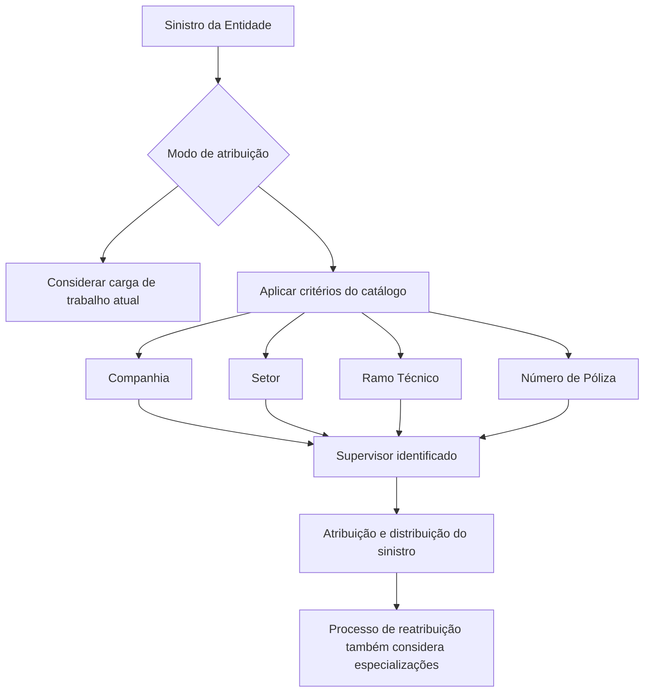

# Critérios de Atribuição de Supervisores no REEF Core

## 1. Metadados do Documento
- **Arquivo de Origem:** Não identificado no conteúdo fornecido
- **Tipo de Documento:** Especificação Funcional
- **Domínio / Sistema:** REEF Core — gestão e distribuição de sinistros
- **Público-Alvo:** Negócio, analistas funcionais, supervisores e equipes de operação
- **Data/Versão Identificada:** Não identificada

---

## 2. Resumo Executivo & Contexto de Negócio

O documento descreve a funcionalidade do REEF Core para atribuir e distribuir automaticamente os sinistros de uma entidade ao corpo de Supervisores. A atribuição pode ocorrer conforme a carga de trabalho existente em determinado momento ou conforme critérios previamente definidos no catálogo de critérios de atribuição.

Os critérios de atribuição permitem especializar Supervisores para sinistros relacionados a uma apólice específica, um Ramo Técnico ou um Setor da Estrutura de Produtos da Companhia. Quando uma especialização é configurada, os sinistros que apresentarem as características correspondentes devem ser atribuídos exclusivamente aos Supervisores especializados.

A configuração considera propriedades operacionais de Companhia, Setor, Ramo Técnico, Número de Póliza e Código do Supervisor. O documento explicita a existência de códigos genéricos para Setor (`9999`) e Ramo Técnico (`999`), permitindo combinações que abrangem todos, vários ou apenas um Setor e/ou Ramo Técnico.

As definições de especialização não se limitam ao processo inicial de distribuição de sinistros. O documento informa que tais definições também afetam o processo de reatribuição de Supervisores. A leitura dos documentos funcionais relacionados é recomendada para evitar interpretações isoladas ou incorretas.

---

## 3. Arquitetura, Componentes & Tecnologias Envolvidas

### Componentes e conceitos identificados

| Componente / Conceito | Descrição sustentada pelo documento |
| :--- | :--- |
| REEF Core | Sistema que possui funcionalidade para atribuir e distribuir automaticamente sinistros ao corpo de Supervisores. |
| Entidade | Contexto organizacional cujos sinistros são distribuídos aos Supervisores. |
| Supervisor | Responsável que recebe critérios de atribuição e distribuição de sinistros. |
| Catálogo de critérios de atribuição | Catálogo no qual são definidas especializações e critérios para atribuição de sinistros a Supervisores. |
| Estrutura de Produtos da Companhia | Estrutura utilizada para identificar Setor e Ramo Técnico. |
| Setor | Chave da Estrutura de Produtos da Companhia utilizada para especializar a gestão do Supervisor. |
| Ramo Técnico | Chave da Estrutura de Produtos da Companhia utilizada para especializar a gestão do Supervisor. |
| Apólice | Identificada pelo Número de Póliza; pode exigir tratamento por um Supervisor determinado devido a características técnicas, comerciais ou experiência. |
| Processo de reatribuição de Supervisores | Processo também afetado pelas definições de especialização dos Supervisores. |



**Nota de Análise:** O documento não detalha algoritmos de balanceamento de carga, interfaces de usuário, métodos HTTP, integrações externas, contratos de dados ou regras de precedência entre critérios simultaneamente aplicáveis.

---

## 4. Regras de Negócio, Especificações Funcionais & Processos

### 4.1 Atribuição automática de sinistros

O REEF Core permite atribuir e distribuir automaticamente os sinistros da entidade ao corpo de Supervisores segundo duas abordagens:

1. **Carga de trabalho:** a atribuição pode considerar a carga de trabalho que cada Supervisor possui em um momento determinado.
2. **Critérios configurados:** a atribuição pode obedecer a definições realizadas previamente no catálogo de critérios de atribuição.

### 4.2 Especialização de Supervisores

No cenário baseado em critérios configurados, um Supervisor pode ser especializado para sinistros associados a:

- Uma apólice;
- Um Ramo Técnico;
- Um Setor específico.

Sinistros que possuam as características configuradas para uma especialização devem ser atribuídos apenas aos Supervisores correspondentes.

### 4.3 Regra operacional da Companhia

A propriedade **Companhia** informa ao sistema o código da Companhia sobre a qual a definição está sendo realizada.

### 4.4 Regra operacional do Setor

A propriedade **Setor** identifica a chave do Setor na Estrutura de Produtos da Companhia. Essa chave permite especializar a gestão realizada pelo Supervisor, de modo que sinistros com aquela característica sejam atribuídos exclusivamente aos Supervisores especializados.

O REEF Core permite utilizar o Setor genérico de código `9999` na configuração do catálogo. Por meio das combinações adequadas, um Supervisor pode receber sinistros de:

- Todos os Setores;
- Vários Setores;
- Um único Setor.

### 4.5 Regra operacional do Ramo Técnico

A propriedade **Ramo Técnico** identifica a chave do Ramo Técnico na Estrutura de Produtos da Companhia. Essa chave permite especializar a gestão realizada pelo Supervisor para que sinistros com essa característica sejam atribuídos exclusivamente aos Supervisores especializados.

O REEF Core permite utilizar o Ramo Técnico genérico de código `999` na configuração do catálogo. Combinando Ramo Técnico e Setor, um Supervisor pode receber sinistros de:

- Todos os Ramos Técnicos;
- Vários Ramos Técnicos;
- Um único Ramo Técnico;
- Todos os Ramos Técnicos de um Setor específico.

### 4.6 Regra operacional do Número de Póliza

A propriedade **Número de Póliza** identifica uma apólice cuja gestão de sinistros deve ser assumida por um Supervisor determinado. O motivo pode estar relacionado a características técnicas ou comerciais especiais da apólice, ou à experiência do Supervisor.

### 4.7 Regra operacional do Código do Supervisor

O **Código do Supervisor** identifica o Supervisor ao qual são atribuídos os critérios de distribuição e atribuição de sinistros.

### 4.8 Impacto na reatribuição

As definições configuradas nas especializações dos Supervisores também afetam o processo de reatribuição de Supervisores.

---

## 5. Tabelas de Parâmetros, Ambientes e Estruturas de Dados

| Item / Parâmetro | Descrição / Função | Tipo / Valores / Formato | Ambiente / Observações |
| :--- | :--- | :--- | :--- |
| Companhia | Indica o código da Companhia para a qual a definição de critérios é realizada. | Código de Companhia; formato não detalhado. | Não detalhado. |
| Setor | Identifica a chave do Setor da Estrutura de Produtos da Companhia e especializa a gestão do Supervisor. | Chave de Setor; código genérico permitido: `9999`. | Pode ser combinado para atribuir todos, vários ou um único Setor a um Supervisor. |
| Ramo Técnico | Identifica a chave do Ramo Técnico da Estrutura de Produtos da Companhia e especializa a gestão do Supervisor. | Chave de Ramo Técnico; código genérico permitido: `999`. | Pode ser combinado com Setor para abranger todos, vários ou um Ramo Técnico; também todos os Ramos Técnicos de um Setor. |
| Número de Póliza | Identifica uma apólice que, por características técnicas, comerciais ou experiência necessária, deve ser gerida por um Supervisor determinado. | Chave de apólice; formato não detalhado. | Aplicável à gestão de sinistros daquela apólice. |
| Código do Supervisor | Identifica o Supervisor ao qual são concedidos os critérios de atribuição e distribuição de sinistros. | Código de Supervisor; formato não detalhado. | Não detalhado. |
| Carga de trabalho | Critério alternativo para distribuição automática de sinistros em determinado momento. | Não detalhado. | O documento não informa fórmula, limites ou regra de desempate. |
| Processo de reatribuição | Processo impactado pelas definições de especialização de Supervisores. | Não detalhado. | Regras específicas não detalhadas. |

### Documentos e vínculos relacionados

| Item / Parâmetro | Descrição / Função | Tipo / Valores / Formato | Ambiente / Observações |
| :--- | :--- | :--- | :--- |
| Supervisores | Documento ou vínculo funcional relacionado. | Referência documental. | Leitura recomendada. |
| Responsáveis de Supervisores | Documento ou vínculo funcional relacionado. | Referência documental. | Leitura recomendada. |
| Perguntas frequentes | Seção que registra particularidade operacional sobre especializações e reatribuição. | Referência documental. | Leitura recomendada. |
| Mapfredocument | Repositório ou contexto documental mencionado no conteúdo extraído. | Nome identificado no cabeçalho. | Sem detalhamento adicional. |
| Owner | Proprietário informado no conteúdo extraído. | `user:agonzalez_mapfre.com` | Valor reproduzido conforme extração. |
| Lifecycle | Estado de ciclo de vida informado. | `Approved Source` | Sem detalhamento adicional. |
| Idioma | Idioma exibido na navegação documental. | `ES` | Conteúdo funcional em espanhol. |

---

## 6. Bateria de Perguntas & Respostas para RAG (FAQ Sintético)

### P1: Como o REEF Core distribui automaticamente os sinistros entre Supervisores?
**R:** O REEF Core pode atribuir e distribuir automaticamente os sinistros da entidade conforme a carga de trabalho que os Supervisores possuem em determinado momento ou conforme definições previamente configuradas no catálogo de critérios de atribuição.

### P2: Quais características podem especializar um Supervisor no REEF Core?
**R:** Um Supervisor pode ser especializado para tratar sinistros de uma apólice específica, de um Ramo Técnico ou de um Setor específico da Estrutura de Produtos da Companhia.

### P3: O que acontece quando um sinistro possui uma característica associada a uma especialização de Supervisor?
**R:** O documento informa que os sinistros com as características configuradas na especialização devem ser atribuídos apenas aos Supervisores especializados para aquelas características.

### P4: Qual é a finalidade do parâmetro Companhia nos critérios de atribuição?
**R:** O parâmetro Companhia informa ao sistema o código da Companhia sobre a qual a definição de critérios de atribuição está sendo realizada.

### P5: Qual código genérico de Setor pode ser utilizado no REEF Core?
**R:** O REEF Core permite o uso do Setor genérico de código `9999` na configuração do catálogo de critérios de atribuição.

### P6: Como o código genérico de Setor `9999` pode ser usado?
**R:** O documento estabelece que, mediante combinações adequadas, o código genérico de Setor pode apoiar configurações para atribuir a um Supervisor sinistros de todos os Setores, de vários Setores ou de um único Setor. A regra exata de combinação não é detalhada.

### P7: Qual código genérico de Ramo Técnico é aceito pelo REEF Core?
**R:** O REEF Core permite utilizar o Ramo Técnico genérico de código `999` na configuração do catálogo.

### P8: Que tipos de cobertura podem ser configurados ao combinar Setor e Ramo Técnico?
**R:** A combinação de Setor e Ramo Técnico pode permitir atribuir a um Supervisor sinistros de todos os Ramos Técnicos, de vários Ramos Técnicos, de um único Ramo Técnico ou de todos os Ramos Técnicos de um Setor específico.

### P9: Quando o Número de Póliza deve ser usado como critério de atribuição?
**R:** O Número de Póliza deve ser usado quando, por características técnicas ou comerciais especiais de uma apólice, ou pela experiência do Supervisor, a entidade considerar adequado que um Supervisor específico seja responsável pela gestão dos sinistros daquela apólice.

### P10: Qual é a função do Código do Supervisor no catálogo?
**R:** O Código do Supervisor identifica o Supervisor que receberá os critérios de atribuição e distribuição de sinistros.

### P11: As especializações de Supervisores influenciam somente a distribuição inicial de sinistros?
**R:** Não. O documento informa expressamente que as definições realizadas nas especializações dos Supervisores também afetam o processo de reatribuição de Supervisores.

### P12: O documento define como calcular ou comparar a carga de trabalho dos Supervisores?
**R:** Não. O documento menciona que a atribuição pode considerar a carga de trabalho existente em um momento determinado, mas não detalha indicadores, fórmulas, limites, prioridades ou regras de desempate.

---

## 7. Glossário de Termos, Siglas & Conceitos-Chave

- **REEF Core:** Sistema que possui funcionalidade de atribuição e distribuição automática de sinistros ao corpo de Supervisores.
- **Sinistro:** Entidade operacional distribuída e atribuída aos Supervisores no contexto do documento.
- **Supervisor:** Responsável que recebe critérios de atribuição e distribuição de sinistros.
- **Corpo de Supervisores:** Conjunto de Supervisores disponível para receber sinistros.
- **Critérios de Atribuição:** Definições configuradas para orientar a distribuição de sinistros a Supervisores.
- **Especialização:** Configuração que associa um Supervisor a características específicas de sinistros, como Setor, Ramo Técnico ou apólice.
- **Companhia:** Propriedade que identifica o código da Companhia sobre a qual uma definição é realizada.
- **Setor:** Chave da Estrutura de Produtos da Companhia usada para especializar a gestão de sinistros.
- **Ramo Técnico:** Chave da Estrutura de Produtos da Companhia usada para especializar a gestão de sinistros.
- **Número de Póliza:** Propriedade que identifica uma apólice para fins de atribuição de gestão de sinistros.
- **Reatribuição de Supervisores:** Processo que também é afetado pelas especializações definidas para Supervisores.
- **Setor genérico `9999`:** Código genérico permitido pelo REEF Core para a configuração do catálogo.
- **Ramo Técnico genérico `999`:** Código genérico permitido pelo REEF Core para a configuração do catálogo.

---

## 8. Notas Críticas, Riscos & Limitações

- O documento não descreve a lógica de cálculo da carga de trabalho dos Supervisores.
- O documento não especifica regras de prioridade ou desempate quando um sinistro atender simultaneamente a múltiplos critérios de especialização.
- O documento não define formatos, validações, obrigatoriedade ou domínios de valores para os campos Companhia, Número de Póliza e Código do Supervisor.
- O documento não detalha interfaces, integrações, APIs, serviços, bancos de dados ou mecanismos técnicos usados pelo REEF Core para executar a atribuição.
- As especializações afetam o processo de reatribuição de Supervisores, mas as regras específicas desse impacto não são apresentadas.
- A interpretação isolada deste documento pode levar a erro; o próprio conteúdo recomenda a leitura dos vínculos funcionais relacionados: **Supervisores**, **Responsáveis de Supervisores** e **Perguntas frequentes**.
- **Nota de Análise:** O conteúdo apresentado não identifica versão do REEF Core, data de publicação, responsáveis funcionais além do campo `Owner`, nem ambientes técnicos.

---

## 9. Conteúdo Bruto Estruturado (Referência Fiel)

```text
--- [PÁGINA 1 DE 2] ---

DEFINIR los CRITERIOS de ASIGNACIÓN del SUPERVISOR
Objetivo
Reef.core tiene la funcionalidad de poder asignar y distribuir automáticamente los Siniestros de la entidad al cuerpo de Supervisores de
acuerdo con:
La carga de trabajo que tengan asignada en un momento determinado o
De acuerdo con las deniciones realizadas ex-profeso en el catálogo de criterios de asignación.
En este segundo caso se congura si el Supervisor está especializado en los Siniestros de una póliza, de un Ramo Técnico o de un Sector en
particular y de esta manera los siniestros con esas características les serán asignados únicamente a ellos.
Propiedades Operativas
Propiedades Operativas
Compañía
Esta propiedad le indica al sistema el código de la compañía sobre la que se está realizando la denición.
Sector
Esta propiedad identica la clave del Sector de la Estructura de Productos de la Compañía, clave que permite 'especializar' las labores de
Gestión del Supervisor para que los siniestros con esta característica le sean asignados únicamente a ellos.
NOTA: Reef.core permite el uso del sector genérico (código 9999) en la conguración de este catálogo.
De esta manera y realizando las combinaciones adecuadas, a un Supervisor determinado se le podrán asignar los siniestros de todos, de
varios o de un único Sector.
Ramo Técnico
Esta propiedad identica la clave del Ramo Técnico de la Estructura de Productos de la Compañía, clave que a su vez permitirá 'especializar'
las labores de Gestión del Supervisor para que los siniestros con esta característica sean asignados únicamente a ellos.
NOTA: Reef.core permite el uso del Ramo Técnico genérico (código 999) en la conguración de este Catálogo.
De esta manera y realizando las combinaciones adecuadas (conjuntamente con el atributo del Sector anterior), a un Supervisor determinado
se le podrán asignar los siniestros de todos, de varios o de un único Ramo Técnico, de todos los Ramos Técnicos de un Sector en particular,
etcétera.
Número de Póliza
Documentation / DOCUMENTACIÓN Reef
DOCUMENTACIÓN Reef
Mapfredocument
DOCUMENTACIÓN Reef
Owner
user:agonzalez_mapfre.com
Lifecycle
Approved Source
 /
VL
Buscar Inicio Soluciones Arquitecturas APIs Componentes Cloud Documentación Zeus Reef Ayuda
ES

--- [PÁGINA 2 DE 2] ---

Esta propiedad identica la clave de una Póliza en la que por sus especiales características técnicas o comerciales o por la experiencia del
Supervisor la entidad considere adecuado sea un Supervisor determinado quien se encargue y responsabilice de la Gestión de sus Siniestros.
Código del Supervisor
Este dato identica el código del Supervisor al que se están dando los criterios de asignación y distribución de Siniestros.
Vínculos
Relación de Directrices y Documentos funcionales cuya lectura recomendada para evitar que la interpretación aislada del presente
documento pueda conducir a error.
Supervisores
Responsables de Supervisores
Preguntas frecuentes
(1) ¿Existe alguna particularidad operativa que deba ser tomada en consideración localmente en la codicación, uso y denición de los
Criterios de Asignación de Siniestros para los Supervisores en el Sistema?
Las Deniciones realizadas en las especializaciones de los Supervisores también les afectan en el proceso de reasignación de supervisores.
etcétera.
```
