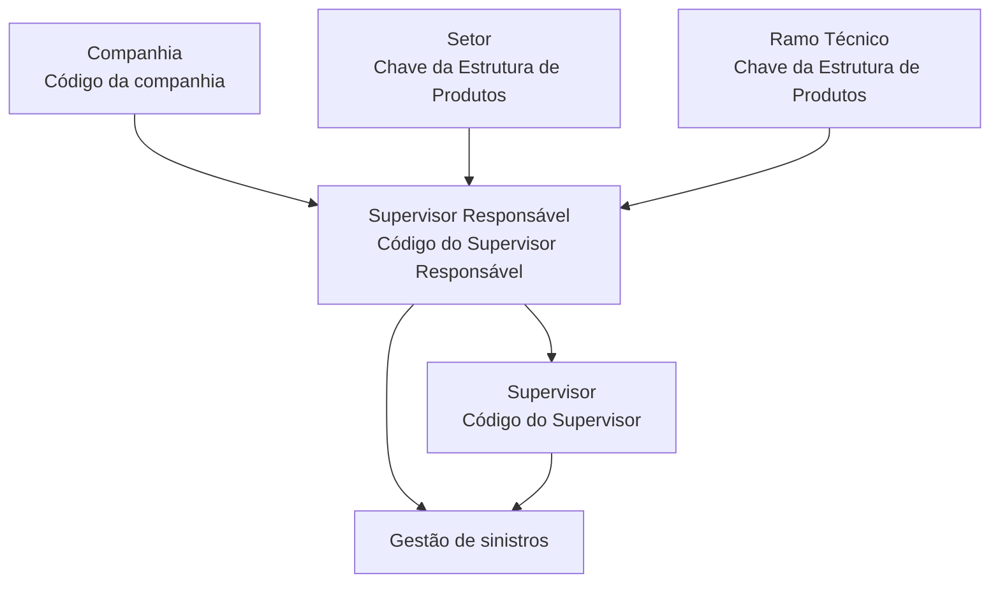
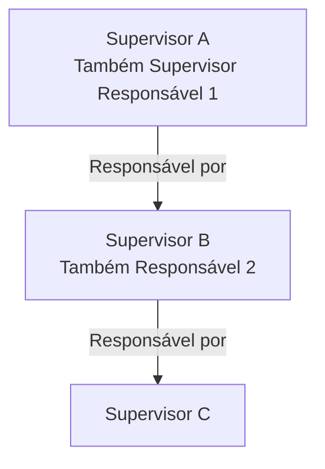

# Definição de Informação de Supervisor Responsável de Supervisores no Módulo de Sinistros Reef.core

## 1. Metadados do Documento
- **Arquivo de Origem:** `Não informado`
- **Tipo de Documento:** `Especificação Técnica`
- **Domínio / Sistema:** `Reef.core — módulo de sinistros`
- **Público-Alvo:** `Negócio, Analistas Funcionais, Desenvolvedores e Operação`
- **Data/Versão Identificada:** `Não identificada`

---

## 2. Resumo Executivo & Contexto de Negócio

O documento descreve a configuração da informação de **Supervisores** e **Supervisores Responsáveis** no módulo de sinistros do sistema Reef.core. Um Supervisor é definido como a pessoa responsável por monitorar e supervisionar o desempenho diário de um pequeno grupo, equipe ou departamento.

Funcionalmente, o núcleo do sistema permite identificar e configurar pessoas físicas ou jurídicas que atuarão como Supervisores e, adicionalmente, como Responsáveis por outros Supervisores. Essa configuração estabelece uma estrutura hierárquica aplicável à gestão de sinistros.

A especialização da gestão de um Supervisor Responsável ocorre por meio da combinação de atributos de companhia, Supervisor Responsável, Supervisor, setor e ramo técnico. Os atributos de setor e ramo técnico são associados à Estrutura de Produtos da Companhia.

O Reef.core suporta configurações genéricas para setor e ramo técnico. O código `9999` pode representar o setor genérico, e o código `999` pode representar o ramo técnico genérico. Essas configurações permitem ampliar o escopo de gestão de um Supervisor Responsável.

O documento também indica que a estrutura pode ter vários níveis hierárquicos: um Supervisor pode simultaneamente ser Supervisor de uma relação e Supervisor Responsável de outro Supervisor. A cadeia pode continuar conforme as necessidades de gestão da entidade.

---

## 3. Arquitetura, Componentes & Tecnologias Envolvidas

### Sistemas, módulos e componentes identificados

| Componente / Conceito | Descrição sustentada pelo documento |
| :--- | :--- |
| **Reef.core** | Sistema que permite identificar e configurar Supervisores e Responsáveis de Supervisores. |
| **Módulo de sinistros** | Módulo no qual as pessoas físicas ou jurídicas configuradas atuarão como Supervisores e Supervisores Responsáveis. |
| **Supervisor** | Pessoa responsável por monitorar e supervisionar o desempenho diário de um grupo, equipe ou departamento. |
| **Supervisor Responsável** | Supervisor que gerencia um ou mais Supervisores, com escopo especializado por setor e ramo técnico. |
| **Estrutura de Produtos da Companhia** | Estrutura que contém as chaves de setor e ramo técnico utilizadas na configuração. |
| **Companhia** | Contexto organizacional cujo código é informado durante a definição. |
| **Mapfredocument** | Termo exibido na área de documentação do conteúdo bruto; o documento não detalha sua função. |

### Fluxo de relacionamento hierárquico



### Fluxo de hierarquia multinível



> **Nota de Análise:** O documento não detalha telas, APIs, métodos HTTP, contratos JSON, banco de dados, mecanismos de autenticação ou regras de persistência da configuração de Supervisores.

---

## 4. Regras de Negócio, Especificações Funcionais & Processos

### Objetivo funcional

O Reef.core possibilita identificar e configurar informações de pessoas físicas ou jurídicas que atuarão:

1. Como **Supervisores**.
2. Como **Responsáveis de outros Supervisores**.
3. No contexto do **módulo de sinistros**.

### Definição operacional de Supervisor

Um Supervisor é uma pessoa responsável por monitorar e supervisionar o desempenho diário de:

- Um pequeno grupo;
- Uma equipe;
- Um departamento.

### Regras de configuração

1. A propriedade **Companhia** identifica o código da companhia sobre a qual a definição está sendo realizada.
2. O **Código do Supervisor Responsável** identifica o Supervisor Responsável no sistema do qual dependerão um ou mais Supervisores.
3. O **Código do Supervisor** identifica o Supervisor associado ao Supervisor Responsável informado.
4. O **Setor** identifica uma chave da Estrutura de Produtos da Companhia.
5. A chave de setor permite especializar as atividades de gestão do Supervisor Responsável sobre o grupo de Supervisores atribuído.
6. O Reef.core permite utilizar o setor genérico de código `9999` na configuração desse catálogo.
7. O **Ramo Técnico** identifica uma chave da Estrutura de Produtos da Companhia.
8. A chave de ramo técnico permite especializar as atividades de gestão do Supervisor Responsável sobre o grupo de Supervisores atribuído.
9. O Reef.core permite utilizar o ramo técnico genérico de código `999` na configuração desse catálogo.
10. Mediante combinações adequadas dos atributos configuráveis, um Supervisor Responsável pode gerir sinistros:
    - De todos os ramos técnicos;
    - De um grupo de ramos técnicos;
    - De um único ramo técnico;
    - Para um Supervisor determinado;
    - De todos os ramos técnicos de todos os Supervisados;
    - De um setor específico.
11. A configuração pode formar uma estrutura hierárquica com múltiplos níveis.
12. Em uma estrutura multinível, um Supervisor pode atuar simultaneamente como Supervisor e como Supervisor Responsável de outro Supervisor.
13. A cadeia hierárquica pode continuar até atender às necessidades de gestão da entidade.

### Referências e vínculos documentados

O documento recomenda a leitura de diretrizes e documentos funcionais relacionados para evitar que uma interpretação isolada cause erro. O vínculo funcional explicitamente citado é:

- **Supervisores**

> **Nota de Análise:** O documento menciona vínculos, diretrizes e documentos funcionais relacionados, mas não fornece URLs, identificadores documentais ou conteúdo adicional dessas referências.

---

## 5. Tabelas de Parâmetros, Ambientes e Estruturas de Dados

### Parâmetros operacionais da configuração

| Item / Parâmetro | Descrição / Função | Tipo / Valores / Formato | Ambiente / Observações |
| :--- | :--- | :--- | :--- |
| Companhia | Indica o código da companhia sobre a qual a definição é realizada. | Código de companhia; formato não detalhado. | Aplicável à configuração no Reef.core. |
| Código do Supervisor Responsável | Identifica o código do Supervisor Responsável no sistema do qual dependerão um ou mais Supervisores. | Código; formato não detalhado. | Define a relação de responsabilidade hierárquica. |
| Código do Supervisor | Identifica o código do Supervisor associado ao Supervisor Responsável. | Código; formato não detalhado. | Representa o Supervisor que depende do Supervisor Responsável. |
| Setor | Identifica a chave do setor da Estrutura de Produtos da Companhia. | Chave de setor. | Especializa as atividades de gestão do Supervisor Responsável. |
| Setor genérico | Permite uma configuração genérica de setor. | Código `9999`. | Permitido pelo Reef.core nesse catálogo. |
| Ramo Técnico | Identifica a chave do ramo técnico da Estrutura de Produtos da Companhia. | Chave de ramo técnico. | Especializa as atividades de gestão do Supervisor Responsável. |
| Ramo Técnico genérico | Permite uma configuração genérica de ramo técnico. | Código `999`. | Permitido pelo Reef.core nesse catálogo. |

### Entidades e relações identificadas

| Entidade | Relação | Descrição |
| :--- | :--- | :--- |
| Supervisor Responsável | Responsável por Supervisor | Um Supervisor Responsável pode ter um ou mais Supervisores dependentes. |
| Supervisor | Dependente de Supervisor Responsável | O Supervisor é associado ao Supervisor Responsável por meio de códigos configurados. |
| Supervisor | Supervisor Responsável de outro Supervisor | Um Supervisor pode ocupar também a função de Supervisor Responsável em uma estrutura multinível. |
| Setor | Especializa a gestão | O setor delimita ou especializa as atividades de gestão do Supervisor Responsável. |
| Ramo Técnico | Especializa a gestão | O ramo técnico delimita ou especializa as atividades de gestão do Supervisor Responsável. |
| Supervisor Responsável | Gestão de sinistros | O Supervisor Responsável pode gerir sinistros conforme as combinações de configuração. |

### Ambientes, URLs e rotas de log

| Item / Parâmetro | Descrição / Função | Tipo / Valores / Formato | Ambiente / Observações |
| :--- | :--- | :--- | :--- |
| Ambientes | Não identificados. | Não aplicável. | O documento não fornece ambientes de execução. |
| URLs | Não identificadas. | Não aplicável. | O documento não fornece endpoints ou URLs operacionais. |
| Rotas de log | Não identificadas. | Não aplicável. | O documento não fornece caminhos, arquivos ou variáveis de log. |
| Servidores | Não identificados. | Não aplicável. | O documento não fornece mapeamento de servidores. |

---

## 6. Bateria de Perguntas & Respostas para RAG (FAQ Sintético)

### P1: Qual é o objetivo da configuração de Supervisores e Supervisores Responsáveis no Reef.core?
**R:** A configuração permite identificar e definir pessoas físicas ou jurídicas que atuarão como Supervisores e também como Responsáveis de outros Supervisores no módulo de sinistros do Reef.core.

### P2: O que caracteriza um Supervisor segundo o documento?
**R:** Um Supervisor é a pessoa responsável por monitorar e supervisionar o desempenho diário de um pequeno grupo, equipe ou departamento.

### P3: Qual é a função do Código do Supervisor Responsável?
**R:** O Código do Supervisor Responsável identifica, no sistema, o Supervisor Responsável do qual dependerão um ou mais Supervisores.

### P4: Qual é a função do Código do Supervisor na configuração?
**R:** O Código do Supervisor identifica o Supervisor associado ao Código do Supervisor Responsável e representa o Supervisor que depende dessa relação hierárquica.

### P5: Como o setor influencia a gestão de Supervisores?
**R:** O setor identifica uma chave da Estrutura de Produtos da Companhia e permite especializar as atividades de gestão do Supervisor Responsável sobre o grupo de Supervisores que possui atribuído.

### P6: Qual código representa o setor genérico no Reef.core?
**R:** O Reef.core permite utilizar o código `9999` como setor genérico na configuração do catálogo de Supervisores Responsáveis.

### P7: Como o ramo técnico é utilizado na configuração de Supervisores?
**R:** O ramo técnico identifica uma chave da Estrutura de Produtos da Companhia e permite especializar as atividades de gestão do Supervisor Responsável sobre o grupo de Supervisores atribuído.

### P8: Qual código representa o ramo técnico genérico no Reef.core?
**R:** O Reef.core permite utilizar o código `999` como ramo técnico genérico na configuração desse catálogo.

### P9: Um Supervisor Responsável pode gerir sinistros de mais de um ramo técnico?
**R:** Sim. Mediante combinações adequadas da configuração, um Supervisor Responsável pode gerir sinistros de todos os ramos técnicos, de um grupo de ramos técnicos ou de um único ramo técnico.

### P10: Um Supervisor Responsável pode gerir sinistros de todos os Supervisados?
**R:** Sim. O documento informa que a configuração pode permitir a gestão dos sinistros de todos os ramos técnicos de todos os Supervisados, conforme as combinações aplicadas.

### P11: É possível criar uma estrutura de Supervisores com vários níveis?
**R:** Sim. O documento informa que, por meio de configuração adequada, é possível estruturar vários níveis nos quais um Supervisor também seja Supervisor Responsável de outro Supervisor, sucessivamente.

### P12: O documento define APIs, métodos HTTP ou contratos JSON para a configuração?
**R:** Não. O documento descreve propriedades operacionais e relações funcionais de configuração, mas não detalha APIs, métodos HTTP, contratos JSON, banco de dados ou mecanismos de integração.

---

## 7. Glossário de Termos, Siglas & Conceitos-Chave

- **Reef.core:** Sistema citado como responsável por permitir a identificação e configuração de Supervisores e Supervisores Responsáveis.
- **Supervisor:** Pessoa responsável por monitorar e supervisionar o desempenho diário de um pequeno grupo, equipe ou departamento.
- **Supervisor Responsável:** Supervisor que possui responsabilidade de gestão sobre um ou mais Supervisores.
- **Companhia:** Organização cujo código contextualiza a definição da configuração.
- **Estrutura de Produtos da Companhia:** Estrutura que fornece as chaves de setor e ramo técnico utilizadas para especializar a gestão.
- **Setor:** Chave da Estrutura de Produtos da Companhia que especializa a gestão do Supervisor Responsável.
- **Setor genérico:** Configuração de setor com código `9999`.
- **Ramo Técnico:** Chave da Estrutura de Produtos da Companhia que especializa a gestão do Supervisor Responsável.
- **Ramo Técnico genérico:** Configuração de ramo técnico com código `999`.
- **Sinistro:** Contexto de gestão mencionado no módulo de sinistros.
- **Supervisado:** Supervisor que depende de um Supervisor Responsável.
- **Mapfredocument:** Termo apresentado no conteúdo bruto em uma área de documentação; não há definição funcional adicional.

---

## 8. Notas Críticas, Riscos & Limitações

- O documento é predominantemente funcional e descritivo; não apresenta detalhes de implementação técnica.
- Não há especificação de APIs, métodos HTTP, contratos JSON, banco de dados, eventos, filas, integrações ou interfaces de usuário.
- Não foram identificados ambientes, servidores, URLs, portas, rotas de log, variáveis de configuração ou procedimentos de implantação.
- O documento recomenda a leitura de diretrizes e documentos funcionais relacionados para evitar interpretação isolada, mas não disponibiliza o conteúdo dessas referências.
- A utilização dos códigos genéricos `9999` para setor e `999` para ramo técnico amplia o escopo da configuração; o documento não detalha controles, validações ou restrições adicionais associados a esses códigos.
- A estrutura multinível de Supervisores é permitida, mas o documento não estabelece limite máximo de níveis, regras de prevenção de ciclos hierárquicos ou critérios de resolução de conflitos.
- O documento menciona pessoas físicas ou jurídicas, porém não detalha atributos cadastrais, regras de identificação ou diferenças operacionais entre esses tipos de pessoa.

---

## 9. Conteúdo Bruto Estruturado (Referência Fiel)

```text
--- [PÁGINA 1 DE 2] ---

DEFINIR la Información del SUPERVISOR, RESPONSABLE de
SUPERVISORES

Contexto

Un Supervisor es aquella persona responsable de monitorear y supervisar el desempeño diario de un pequeño grupo, equipo o departamento.

Objetivo

Funcionalmente, el núcleo del Sistema cuenta con la posibilidad de identicar y congurar la información de aquellas personas físicas o
jurídicas que van a actuar como Supervisores y además van a actuar como Responsables de otros Supervisores en el módulo de siniestros.

Propiedades Operativas

Propiedades Operativas

Compañía

Esta propiedad le indica al sistema el código de la compañía sobre la que se está realizando la denición.

Código del Supervisor Responsable

Este dato identica el código del Supervisor Responsable en el Sistema del que dependerán uno o n Supervisores.

Código del Supervisor

Este dato identica el código del Supervisor asociado al atributo anterior y del que depende.

Sector

Esta propiedad identica la clave del Sector de la Estructura de Productos de la Compañía, clave que permite 'especializar' las labores de
Gestión del Supervisor Responsable, sobre el Grupo de Supervisores que tenga asignado.

NOTA: Reef.core permite el uso del sector genérico (código 9999) en la conguración de este catálogo.

Ramo Técnico

Esta propiedad identica la clave del Ramo Técnico de la Estructura de Productos de la Compañía, clave que a su vez permitirá 'especializar'
las labores de Gestión del Supervisor Responsable, sobre el Grupo de Supervisores que tenga asignado.

NOTA: Reef.core permite el uso del Ramo Técnico genérico (código 999) en la conguración de este Catálogo.

Documentation / DOCUMENTACIÓN Reef
DOCUMENTACIÓN Reef
Mapfredocument
DOCUMENTACIÓN Reef

Owner
user:agonzalez_mapfre.com

Lifecycle
Approved Source
 /
VL

Buscar Inicio Soluciones Arquitecturas APIs Componentes Cloud Documentación Zeus Reef Ayuda
ES

--- [PÁGINA 2 DE 2] ---

De esta manera y realizando las combinaciones adecuadas, un Supervisor Responsable podrá gestionar los siniestros de todos, de un grupo
o de un único Ramo Técnico para un Supervisor determinado, de todos los Ramos Técnicos de todos sus Supervisados o los de un sector en
particular,...

Vínculos

Relación de Directrices y Documentos funcionales cuya lectura recomendada para evitar que la interpretación aislada del presente
documento pueda conducir a error.

Supervisores

Preguntas frecuentes

(1) ¿Existe alguna particularidad operativa que deba ser tomada en consideración localmente en la codicación, uso y denición de los
Responsables de Supervisores en el Sistema?

Se puede lograr, mediante una adecuada conguración, tener una estructura de varios niveles en la que un Supervisor (A) sea Supervisor y a
su vez Supervisor Responsable (1) de otro Supervisor (B) que a su vez sea Responsable (2) de otro supervisor (C) y así hasta completar las
necesidades de gestión que tenga la entidad.
```
