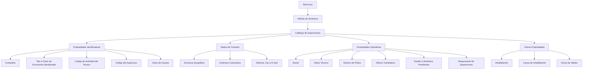

# Definição de Informações do Supervisor de Sinistros no Reef.core

## 1. Metadados do Documento
- **Arquivo de Origem:** Não identificado no conteúdo extraído
- **Tipo de Documento:** Especificação Técnica / Funcional
- **Domínio / Sistema:** Reef.core — Módulo de Siniestros (Sinistros)
- **Público-Alvo:** Analistas funcionais, configuradores do sistema, equipes de sinistros e operação
- **Data/Versão Identificada:** Não identificada
- **Owner identificado:** `user:agonzalez_mapfre.com`
- **Lifecycle identificado:** Approved Source

---

## 2. Resumo Executivo & Contexto de Negócio

O documento descreve a definição e configuração de informações de um **Supervisor de Sinistros** no sistema Reef.core. Um Supervisor é caracterizado como a pessoa responsável por monitorar e supervisionar o desempenho diário de um pequeno grupo, equipe ou departamento. No contexto do módulo de sinistros, os grupos supervisionados são compostos por pessoas que executam atividades como Tramitadores.

Funcionalmente, o núcleo do Reef.core permite identificar e configurar pessoas físicas ou jurídicas que atuarão como Supervisores no módulo de sinistros. A definição abrange propriedades identificativas, dados de contato, propriedades operativas e outras propriedades relacionadas à disponibilidade e inabilitação do Supervisor.

As propriedades identificativas vinculam o Supervisor à companhia, ao documento de identificação, à atividade do terceiro, a um código de Supervisor e a uma chave de usuário. Os dados de contato permitem registrar a localização geográfica, o endereço corporativo e os meios corporativos de comunicação, incluindo telefone, fax e correio eletrônico.

As propriedades operativas permitem especializar o escopo de atuação de um Supervisor por Setor, Ramo Técnico, apólice e Oficina Tramitadora. O Reef.core prevê configurações genéricas para Setor, utilizando o código `9999`, e para Ramo Técnico, utilizando o código `999`, permitindo neste último caso a gestão de sinistros de todos os Ramos Técnicos definidos no sistema.

O documento também descreve controles operacionais importantes: estado do Supervisor, quantidade de sinistros pendentes, possibilidade de o Supervisor ser responsável por outros Supervisores, inabilitação, causa de inabilitação e data de validade. A data de validade é apresentada como mecanismo para manter histórico das alterações realizadas nas definições de Supervisores e possibilitar rastreabilidade posterior.

---

## 3. Arquitetura, Componentes & Tecnologias Envolvidas

O conteúdo não descreve uma arquitetura técnica de infraestrutura, APIs, microsserviços, bancos de dados, protocolos, URLs, ambientes ou contratos de integração. O documento apresenta uma estrutura funcional de configuração do catálogo de Supervisores no Reef.core, dentro do módulo de sinistros.

### Componentes e conceitos funcionais citados

| Componente / Conceito | Papel descrito no documento |
| :--- | :--- |
| **Reef.core** | Sistema que permite identificar e configurar Supervisores para o módulo de sinistros. |
| **Módulo de Siniestros** | Módulo de sinistros no qual os Supervisores atuam. |
| **Supervisor** | Pessoa física ou jurídica configurada para monitorar e supervisionar equipes ou grupos associados a atividades de sinistros. |
| **Tramitadores** | Pessoas que realizam atividades nos grupos ou equipes supervisionados. |
| **Catálogo de Supervisores** | Estrutura funcional que contém informações, propriedades e estado do Supervisor. |
| **Entidade** | Contexto no qual existem propriedades de Terceiros configuradas. |
| **Instalação de Reef.core** | Contexto adicional de propriedades que deve ser considerado na definição de Supervisores. |
| **Estrutura Geográfica** | Estrutura de localização com níveis País, Estado, Província, Localidade e referência a cinco níveis para Código Postal. |
| **Estrutura Comercial** | Estrutura cuja terceira camada identifica a Oficina Tramitadora de Sinistros. |
| **Setor** | Chave usada para especializar a gestão de um Supervisor em sinistros de um setor específico. |
| **Ramo Técnico** | Chave usada para especializar a gestão de um Supervisor em sinistros de um ramo técnico específico. |
| **Póliza** | Apólice que pode determinar que um Supervisor específico seja responsável pela gestão. |



> **Nota de Análise:** O documento não detalha métodos HTTP, contratos JSON, persistência de dados, interfaces de usuário, integrações externas, APIs, tecnologias de implementação ou regras de autorização.

---

## 4. Regras de Negócio, Especificações Funcionais & Processos

### 4.1. Definição funcional do Supervisor

1. Um Supervisor é uma pessoa responsável por monitorar e supervisionar o desempenho diário de um pequeno grupo, equipe ou departamento.
2. No módulo de sinistros do Reef.core, as equipes supervisionadas podem ser compostas por pessoas que exercem atividades como Tramitadores.
3. O Reef.core permite configurar Supervisores que sejam pessoas físicas ou jurídicas.
4. A configuração do Supervisor é organizada em quatro grupos:
   - Propriedades Identificativas;
   - Dados de Contacto;
   - Propriedades Operativas;
   - Outras Propiedades.

### 4.2. Regras sobre identificação do Supervisor

1. A propriedade **Compañía** informa o código da companhia para a qual a definição do Supervisor está sendo realizada.
2. O **Tipo Documento Identificador** deve corresponder a um tipo de documento previamente configurado no sistema.
3. A **Clave del Documento Identificador** contém a chave do Supervisor associada ao Tipo de Documento Identificador.
4. O **Código de Actividad del Tercero** indica o código de atividade do Terceiro.
5. O **Código del Supervisor** identifica o código do Supervisor no sistema.
6. A **Clave de Usuario** contém o código do usuário no catálogo de Supervisores da Entidade.

### 4.3. Regras sobre localização e endereço corporativo

1. O endereço do Supervisor é associado à estrutura geográfica existente no sistema.
2. O campo **País** representa o primeiro nível da estrutura geográfica.
3. O campo **Estado** representa o segundo nível da estrutura geográfica.
4. O campo **Provincia** representa o terceiro nível da estrutura geográfica.
5. O campo **Localidad** representa o quarto nível da estrutura geográfica.
6. O campo **Nombre de la Localidad** contém o nome do quarto nível da estrutura geográfica.
7. O **Código Postal** identifica o código postal associado aos cinco níveis da estrutura geográfica em que se encontra o endereço do Terceiro.
8. A **Extensión Postal** registra uma extensão do código postal.
9. O **Tipo de Domicilio** deve seguir a codificação local do tipo de via definida pela entidade seguradora.
10. Os atributos **Domicilio <1>** e **Domicilio <2>** compõem o endereço corporativo e permitem inserir informações complementares para facilitar a localização.
11. O endereço pode conter Número, Portal, Piso, Letra, Escalera e Urbanización/Polígono, quando necessários.

### 4.4. Regras sobre contato corporativo

1. O **Prefijo Telefónico del País** registra o prefixo internacional associado ao telefone corporativo do Supervisor.
2. O documento fornece exemplos de prefixos internacionais:
   - Espanha: `+34`;
   - México: `+52`;
   - Argentina: `+54`.
3. O **Prefijo Zonal Telefónico** registra o prefixo zonal associado ao telefone corporativo.
4. O documento fornece exemplos de prefixos zonais:
   - Madrid, Espanha: `91`;
   - Barcelona, Espanha: `93`;
   - Monterrey, Nuevo León, México: `81`;
   - Ciudad de México, México: `55`.
5. O **Número Telefónico** contém o número telefônico do Supervisor.
6. A **Extensión Telefónica** é utilizada quando necessária para o telefone corporativo.
7. O **Número Fax** registra o número telefônico do fax corporativo.
8. A **Dirección Correo Electrónico** contém o endereço corporativo de correio eletrônico do Supervisor.

### 4.5. Regras operativas de atuação do Supervisor

1. O **Sector** identifica a chave de um setor configurado no sistema.
2. O Setor permite especializar as atividades de gestão do Supervisor para que ele trate sinistros de um setor específico.
3. O Reef.core permite utilizar o setor genérico de código `9999` na configuração do Supervisor.
4. O **Ramo Técnico** identifica a chave do Ramo Técnico e especializa a atuação do Supervisor para sinistros de um ramo específico.
5. O Reef.core permite utilizar o Ramo Técnico genérico de código `999`.
6. O uso do código `999` implica que o Supervisor pode gerir sinistros de todos os Ramos Técnicos definidos no sistema.
7. O **Número de Póliza** identifica uma apólice cujas características especiais determinam que um Supervisor específico será responsável por sua gestão.
8. A **Oficina Tramitadora** contém o código do terceiro nível da Estrutura Comercial ao qual o Supervisor está atribuído no sistema.
9. A Oficina Tramitadora é identificada como Oficina Tramitadora de Sinistros.
10. O **Estado** do catálogo de Supervisores mostra a situação do Supervisor na data de consulta.
11. O Estado deve assumir um dos valores configurados no Reef.core.
12. O **Número de Siniestros Pendientes** contém a quantidade de sinistros pendentes atribuídos ao Supervisor.
13. A quantidade de sinistros pendentes é atualizada sempre que um sinistro é aberto, encerrado, atribuído ou reatribuído.
14. O campo **¿Responsable de Supervisores?** indica se o Reef.core permitirá que o Supervisor seja responsável por outro Supervisor ou por um grupo de Supervisores.

### 4.6. Regras de inabilitação, validade e histórico

1. A propriedade **Inhabilitación** indica que o Supervisor está desativado.
2. Quando o Supervisor está inabilitado, o **Código de la Causa de Inhabilitación** indica, de acordo com o código de atividade do Terceiro, o código da causa de inabilitação no sistema.
3. A **Fecha de Validez** determina a data a partir da qual a definição do Supervisor fica disponível para uso no sistema.
4. A configuração correta da data de validade permite manter histórico das alterações realizadas nas definições de Supervisores.
5. O histórico habilitado pela data de validade permite rastrear e explorar posteriormente as informações de definição do Supervisor.

### 4.7. Dependências documentais e de configuração

1. O documento recomenda consultar diretrizes e documentos funcionais relacionados para evitar interpretações isoladas incorretas.
2. São citados como vínculos:
   - Estructura de Productos;
   - Usuarios de la Compañía.
3. A definição do Supervisor deve considerar:
   - as Propriedades de Terceiros configuradas na definição da Entidade;
   - as Propriedades configuradas na Instalação de Reef.core.

---

## 5. Tabelas de Parâmetros, Ambientes e Estruturas de Dados

### 5.1. Propriedades identificativas

| Item / Parâmetro | Descrição / Função | Tipo / Valores / Formato | Ambiente / Observações |
| :--- | :--- | :--- | :--- |
| Compañía | Indica o código da companhia sobre a qual é realizada a definição do Supervisor. | Código de companhia | Reef.core |
| Tipo Documento Identificador | Contém o tipo de documento usado para identificar o Supervisor como pessoa física ou jurídica. | Tipo de documento configurado previamente | Depende dos tipos de documentos configurados no sistema |
| Clave del Documento Identificador | Contém a chave do Supervisor associada ao Tipo de Documento Identificador. | Chave de documento | Associada ao tipo de documento |
| Código de Actividad del Tercero | Indica o código de atividade do Terceiro. | Código | Relacionado à causa de inabilitação |
| Código del Supervisor | Identifica o código do Supervisor no sistema. | Código de Supervisor | Sistema Reef.core |
| Clave de Usuario | Contém o código do usuário no catálogo de Supervisores da Entidade. | Código de usuário | Catálogo de Supervisores da Entidade |

### 5.2. Dados de contato e estrutura geográfica

| Item / Parâmetro | Descrição / Função | Tipo / Valores / Formato | Ambiente / Observações |
| :--- | :--- | :--- | :--- |
| País | Código do primeiro nível da estrutura geográfica do endereço do Supervisor. | Código geográfico | Valores existentes no catálogo mestre do sistema |
| Estado | Código do segundo nível da estrutura geográfica do endereço do Supervisor. | Código geográfico | Valores existentes no catálogo mestre do sistema |
| Provincia | Código do terceiro nível da estrutura geográfica do endereço do Supervisor. | Código geográfico | Valores existentes no catálogo mestre do sistema |
| Localidad | Código do quarto nível da estrutura geográfica do endereço do Supervisor. | Código geográfico | Valores existentes no catálogo mestre do sistema |
| Nombre de la Localidad | Nome do quarto nível da estrutura geográfica. | Texto | Estrutura geográfica |
| Código Postal | Chave que identifica o código postal associado aos cinco níveis da estrutura geográfica do endereço do Terceiro. | Chave de código postal | O texto menciona cinco níveis geográficos, mas detalha explicitamente quatro: País, Estado, Província e Localidade |
| Extensión Postal | Extensão do Código Postal. | Texto ou código não especificado | Catálogo de Supervisores |
| Tipo de Domicilio | Tipo de via associado ao Supervisor. | Código local de tipo de via | Codificação efetuada localmente pela entidade seguradora |
| Domicilio <1> | Parte do endereço corporativo do Supervisor. | Texto | Pode receber informações complementares de localização |
| Domicilio <2> | Parte complementar do endereço corporativo do Supervisor. | Texto | Utilizado em conjunto com Domicilio <1> |
| Número | Número do tipo de via do endereço do Supervisor. | Número ou texto não especificado | Endereço corporativo |
| Portal | Número do portal, se necessário. | Número ou texto não especificado | Opcional conforme necessidade |
| Piso | Número do piso ou planta, se necessário. | Número ou texto não especificado | Opcional conforme necessidade |
| Letra | Letra do endereço, se necessária. | Texto | Opcional conforme necessidade |
| Escalera | Escada que identifica o endereço, se necessária. | Texto ou código não especificado | Opcional conforme necessidade |
| Urbanización/Polígono | Urbanização, desenvolvimento urbano, polígono ou informação equivalente que identifica o endereço. | Texto | Opcional conforme necessidade |

### 5.3. Tipos de via exemplificados

| Código | Tipo de Via | Descrição / Observações |
| :--- | :--- | :--- |
| 001 | Calle | Exemplo de valor para Tipo de Domicilio |
| 002 | Avenida | Exemplo de valor para Tipo de Domicilio |
| 003 | Plaza | Exemplo de valor para Tipo de Domicilio |
| 004 | Carretera | Exemplo de valor para Tipo de Domicilio |
| 005 | Eje Vial | Exemplo de valor para Tipo de Domicilio |
| ... | ... | O documento indica que podem existir outros valores |

### 5.4. Dados de comunicação

| Item / Parâmetro | Descrição / Função | Tipo / Valores / Formato | Ambiente / Observações |
| :--- | :--- | :--- | :--- |
| Prefijo Telefónico del País | Prefixo internacional associado ao telefone corporativo. | Ex.: `+34`, `+52`, `+54` | Espanha: `+34`; México: `+52`; Argentina: `+54` |
| Prefijo Zonal Telefónico | Prefixo zonal associado ao telefone corporativo. | Ex.: `91`, `93`, `81`, `55` | Madrid: `91`; Barcelona: `93`; Monterrey: `81`; Ciudad de México: `55` |
| Número Telefónico | Número telefônico do Supervisor. | Número telefônico | Telefone corporativo |
| Extensión Telefónica | Extensão associada ao telefone corporativo, quando necessária. | Número ou texto não especificado | Opcional |
| Número Fax | Número telefônico do fax corporativo. | Número telefônico | Fax corporativo |
| Dirección Correo Electrónico | Endereço de correio eletrônico corporativo do Supervisor. | Endereço de e-mail | Correio eletrônico corporativo |

### 5.5. Propriedades operativas e de ciclo de vida

| Item / Parâmetro | Descrição / Função | Tipo / Valores / Formato | Ambiente / Observações |
| :--- | :--- | :--- | :--- |
| Sector | Especializa a gestão do Supervisor para sinistros de um setor específico. | Chave de setor | Reef.core permite Setor genérico `9999` |
| Ramo Técnico | Especializa a gestão do Supervisor para sinistros de um ramo técnico específico. | Chave de ramo técnico | Reef.core permite Ramo Técnico genérico `999` |
| Número de Póliza | Identifica uma apólice cuja gestão é atribuída a um Supervisor específico. | Chave de apólice | Aplicável quando a apólice possui características especiais |
| Oficina Tramitadora | Código do terceiro nível da Estrutura Comercial ao qual o Supervisor é atribuído. | Código de estrutura comercial | Identificada como Oficina Tramitadora de Sinistros |
| Estado | Situação do Supervisor na data de consulta. | Um dos valores configurados no Reef.core | Catálogo de Supervisores |
| Número de Siniestros Pendientes | Quantidade de sinistros pendentes atribuídos ao Supervisor. | Número | Atualizado na abertura, conclusão, atribuição ou reatribuição de sinistro |
| ¿Responsable de Supervisores? | Indica se o Supervisor pode ser responsável por outro Supervisor ou grupo de Supervisores. | Indicador booleano não explicitamente nomeado | Configuração no Reef.core |
| Inhabilitación | Indica que o Supervisor está desativado. | Indicador não especificado | Outras propriedades |
| Código de la Causa de Inhabilitación | Código da causa de inabilitação do Terceiro. | Código de causa | Aplicável quando o Supervisor está inabilitado; relacionado ao código de atividade do Terceiro |
| Fecha de Validez | Data a partir da qual a definição do Supervisor está disponível para uso. | Data | Permite histórico, rastreabilidade e exploração posterior das alterações |

### 5.6. Ambientes, servidores, logs e URLs

| Item / Parâmetro | Descrição / Função | Tipo / Valores / Formato | Ambiente / Observações |
| :--- | :--- | :--- | :--- |
| Ambientes técnicos | Não detalhados no documento. | Não informado | Não há URLs, servidores, portas ou configurações de ambiente extraídas. |
| Rotas de logs | Não detalhadas no documento. | Não informado | Não há caminhos de logs extraídos. |
| APIs e contratos | Não detalhados no documento. | Não informado | Não há endpoints, métodos HTTP ou contratos JSON extraídos. |

---

## 6. Bateria de Perguntas & Respostas para RAG (FAQ Sintético)

### P1: Qual é o objetivo da definição de Supervisor no Reef.core?
**R:** O objetivo é identificar e configurar no Reef.core as pessoas físicas ou jurídicas que atuarão como Supervisores no módulo de sinistros. Esses Supervisores são responsáveis por monitorar e supervisionar o desempenho diário de pequenos grupos, equipes ou departamentos, incluindo equipes compostas por pessoas que exercem funções como Tramitadores.

### P2: Quais grupos de propriedades formam a configuração de um Supervisor?
**R:** A configuração é organizada em quatro grupos: Propriedades Identificativas, Dados de Contacto, Propriedades Operativas e Outras Propiedades. Esses grupos cobrem identificação, endereço e comunicação corporativa, escopo de gestão de sinistros, estado, inabilitação e validade da configuração.

### P3: Como o Supervisor é identificado no sistema Reef.core?
**R:** O Supervisor é identificado por meio de dados como código da companhia, tipo de documento identificador, chave do documento identificador, código de atividade do Terceiro, código do Supervisor e chave de usuário. O tipo de documento deve estar previamente configurado no sistema, e a chave do documento está associada ao tipo de documento selecionado.

### P4: Como o endereço do Supervisor é estruturado no documento?
**R:** O endereço é registrado com base na estrutura geográfica do sistema: País, Estado, Província e Localidade. O documento também inclui Nome da Localidade, Código Postal, Extensão Postal, Tipo de Domicílio, Domicilio <1>, Domicilio <2>, Número, Portal, Piso, Letra, Escalera e Urbanización/Polígono. O Código Postal é associado aos cinco níveis da estrutura geográfica, embora o conteúdo detalhe explicitamente quatro níveis.

### P5: Quais são os códigos genéricos permitidos para Setor e Ramo Técnico?
**R:** O Reef.core permite usar o código `9999` como Setor genérico na configuração do Supervisor. Para Ramo Técnico, o Reef.core permite o código genérico `999`; quando esse código é utilizado, o Supervisor pode gerir sinistros de todos os Ramos Técnicos definidos no sistema.

### P6: Quando o Número de Siniestros Pendientes é atualizado?
**R:** O Número de Siniestros Pendientes é atualizado e modificado toda vez que ocorre uma das seguintes ações em um sinistro: abertura, encerramento, atribuição ou reatribuição. O atributo representa o número de sinistros pendentes que estão atribuídos ao Supervisor.

### P7: O que significa o campo ¿Responsable de Supervisores??
**R:** O campo indica se o Reef.core permitirá que um Supervisor seja também responsável por outro Supervisor ou por um grupo de Supervisores. O documento não especifica os valores técnicos do campo, mas estabelece claramente sua finalidade funcional.

### P8: Como funciona a inabilitação de um Supervisor?
**R:** A propriedade Inhabilitación indica que o Supervisor está desativado. Quando o Supervisor está inabilitado, o Código de la Causa de Inhabilitación deve indicar, conforme o código de atividade do Terceiro, o código da causa de inabilitação do Terceiro no sistema.

### P9: Qual é a finalidade da Fecha de Validez?
**R:** A Fecha de Validez define a data a partir da qual a configuração do Supervisor fica disponível para utilização no sistema. Uma configuração correta dessa data permite manter um histórico das alterações realizadas nas definições de Supervisores e possibilita rastrear e explorar posteriormente essas informações.

### P10: O que é a Oficina Tramitadora na configuração do Supervisor?
**R:** A Oficina Tramitadora é o código do terceiro nível da Estrutura Comercial ao qual o Supervisor está atribuído no sistema. Esse terceiro nível é identificado como Oficina Tramitadora de Sinistros.

### P11: Quais canais de contato corporativo podem ser configurados para um Supervisor?
**R:** O documento descreve prefixo telefônico do país, prefixo zonal telefônico, número telefônico, extensão telefônica, número de fax e direção de correio eletrônico corporativo. Também são fornecidos exemplos de prefixos internacionais e zonais para Espanha, México e Argentina.

### P12: Quais dependências devem ser consideradas ao definir Supervisores?
**R:** A definição deve considerar tanto as Propriedades de Terceiros configuradas na definição da Entidade quanto as Propriedades configuradas na Instalação de Reef.core. O documento também recomenda a leitura de documentos relacionados, incluindo Estructura de Productos e Usuarios de la Compañía, para evitar interpretações isoladas incorretas.

---

## 7. Glossário de Termos, Siglas & Conceitos-Chave

- **Reef.core:** Sistema citado como responsável por permitir a identificação e configuração de Supervisores para o módulo de sinistros.
- **Siniestros:** Termo utilizado no documento para sinistros.
- **Supervisor:** Pessoa física ou jurídica configurada para monitorar e supervisionar grupos, equipes ou departamentos no contexto do módulo de sinistros.
- **Tramitadores:** Pessoas que realizam atividades nos grupos ou equipes vinculados à gestão de sinistros.
- **Terceiro:** Entidade ou pessoa associada ao código de atividade e ao endereço mencionado na definição do Supervisor.
- **Compañía:** Companhia para a qual a definição do Supervisor está sendo realizada.
- **Catálogo de Supervisores:** Estrutura do sistema que contém os dados e propriedades do Supervisor.
- **Sector:** Chave de especialização que delimita a atuação do Supervisor para sinistros de determinado setor.
- **Ramo Técnico:** Chave de especialização que delimita a atuação do Supervisor para sinistros de um ramo técnico.
- **Póliza:** Apólice que pode exigir que um Supervisor específico seja responsável por sua gestão.
- **Oficina Tramitadora:** Terceiro nível da Estrutura Comercial ao qual o Supervisor é atribuído, identificado como Oficina Tramitadora de Sinistros.
- **Inhabilitación:** Propriedade que indica que o Supervisor está desativado.
- **Fecha de Validez:** Data a partir da qual a definição do Supervisor fica disponível para uso.
- **Estructura Geográfica:** Estrutura de localização usada para definir o endereço do Supervisor.
- **Estructura Comercial:** Estrutura usada para definir a Oficina Tramitadora associada ao Supervisor.

---

## 8. Notas Críticas, Riscos & Limitações

- O documento não informa nome do arquivo de origem, data, versão, autor documental completo ou histórico de revisões.
- O conteúdo não descreve APIs, endpoints, protocolos, métodos HTTP, contratos JSON, banco de dados, mecanismos de persistência, integrações externas, servidores, URLs, portas ou rotas de logs.
- O documento apresenta o Código Postal como associado a cinco níveis da estrutura geográfica, mas detalha explicitamente apenas quatro níveis: País, Estado, Província e Localidade.
- Os tipos técnicos dos campos — por exemplo, texto, número, enumeração, booleano, tamanho e obrigatoriedade — não são detalhados.
- O campo **Estado** do Supervisor deve assumir valores configurados no Reef.core, mas o documento não enumera esses valores.
- O campo **¿Responsable de Supervisores?** tem finalidade funcional descrita, porém seus valores permitidos e efeitos operacionais detalhados não são especificados.
- O documento recomenda a leitura de **Estructura de Productos** e **Usuarios de la Compañía** para evitar interpretações isoladas, mas não fornece o conteúdo desses documentos.
- A configuração deve considerar propriedades de Terceiros da Entidade e propriedades da Instalação de Reef.core, porém o documento não lista essas propriedades.
- **Nota de Análise:** O conteúdo descreve configuração funcional de Supervisores, mas não fornece detalhes sobre validações de obrigatoriedade, regras de unicidade, permissões de manutenção, telas ou comportamento transacional.

---

## 9. Conteúdo Bruto Estruturado (Referência Fiel)

```text
--- [PÁGINA 1 DE 5] ---

DEFINIR Información del SUPERVISOR de SINIESTROS
Contexto
Un Supervisor es aquella persona responsable de monitorear y supervisar el desempeño diario de un pequeño grupo, equipo o departamento.
En el ámbito de Reef.core y para el Módulo de Siniestros estos equipos se conforman con personas que realizan labores como Tramitadores.
Objetivo
Funcionalmente, el núcleo del Sistema cuenta con la posibilidad de identificar y configurar la información de aquellas personas físicas o
jurídicas que van a actuar como supervisores en el módulo de siniestros.
Propiedades Identificativas
Datos de Contacto
Propiedades Operativas
Otras Propiedades
Propiedades Identificativas
Compañía
Esta propiedad le indica al sistema el código de la compañía sobre la que se está realizando la definición del Supervisor.
Tipo Documento Identificador
Este Atributo del colapsador contiene el tipo de documento con el que se va a identificar al Supervisor como persona física o jurídica y de
acuerdo con los tipos de documentos que hayan sido configurados en el sistema previamente.
Clave del Documento Identificador
Este Atributo del catálogo contendrá la clave del Supervisor asociado al Tipo de Documento Identificador.
Código de Actividad del Tercero
Esta propiedad indicará el código de la Actividad del Tercero.
Código del Supervisor
Este dato identifica el código del Supervisor en el Sistema.
Clave de Usuario
Documentation / DOCUMENTACIÓN Reef
DOCUMENTACIÓN Reef
Mapfredocument
DOCUMENTACIÓN Reef
Owner
user:agonzalez_mapfre.com
Lifecycle
Approved Source
 /
VL
Buscar Inicio Soluciones Arquitecturas APIs Componentes Cloud Documentación Zeus Reef Ayuda
ES

--- [PÁGINA 2 DE 5] ---

Este Atributo del catálogo de Supervisores de la Entidad contiene el código del Usuario.
Datos de Contacto
Pais
Este Campo contiene el código del primer nivel de la estructura Geográfica en la que se encuentra ubicada la Dirección del Supervisor de
acuerdo con la relación de posibles valores existentes en el catálogo maestro existente en el Sistema.
Estado
Este Campo contiene el código del segundo nivel de la estructura Geográfica en la que se encuentra ubicada la Dirección del Supervisor de
acuerdo con la relación de posibles valores existentes en el catálogo maestro existente en el Sistema.
Provincia
Este Campo contiene el código del tercer nivel de la estructura Geográfica en la que se encuentra ubicada la Dirección del Supervisor de
acuerdo con la relación de posibles valores existentes en el catálogo maestro existente en el Sistema.
Localidad
Este Campo contiene el código del cuarto nivel de la estructura Geográfica en la que se encuentra ubicada la Dirección del Supervisor de
acuerdo con la relación de posibles valores existentes en el catálogo maestro existente en el Sistema.
Nombre de la Localidad
Este Campo contiene el nombre del cuarto nivel de la estructura geográfica.
Código Postal
Esta Propiedad contiene la clave que identifica el Código Postal asociado a los cinco niveles de la estructura geográfica en la que está
ubicada la Dirección del Tercero.
Extensión Postal
Este atributo del catálogo de Supervisores contiene la extensión del Código Postal.
Tipo de Domicilio
De acuerdo con el callejero local, este dato contendrá el Tipo de Vía que se va a asociar al Supervisor de acuerdo con la codificación
efectuada localmente por parte de la entidad aseguradora.
A modo de ejemplo sus valores podrían ser:
Código TIPO VIA DESCRIPCIÓN
001 Calle
002 Avenida
003 Plaza
004 Carretera
005 Eje Vial
... ...
Domicilio <1>
Este Atributo contiene el domicilio Corporativo del Supervisor de acuerdo con la ubicación geográfica y la tipología del domicilio además de
permitir la captura de información complementaria que facilite su ubicación.

--- [PÁGINA 3 DE 5] ---

Domicilio <2>
Este Atributo, conjuntamente con el atributo anterior, contiene el domicilio Corporativo del Supervisor de acuerdo con la ubicación geográfica
y la tipología del domicilio además de permitir la captura de información complementaria que facilite su ubicación.
Número
Este Atributo contiene el número del tipo de vía del Domicilio del Supervisor.
Portal
Este Atributo contiene, de ser necesario, el número del Portal del Domicilio del Supervisor.
Piso
Este Atributo contiene, de ser necesario, el número del Piso/Planta del Domicilio del Supervisor.
Letra
Este Atributo contiene, de plantearse la necesidad, la Letra del del Domicilio del Supervisor.
Escalera
Este Atributo contiene, caso de ser necesario, la Escalera que identifica el Domicilio del Supervisor.
Urbanización/Polígono
Este Atributo en caso de ser necesario contendrá la Urbanización, Desarrollo Urbano, Polígono, ... que identifica el Domicilio del Supervisor.
Prefijo Telefónico del País
Este atributo contiene el Prefijo del País Telefónico correspondiente al número telefónico Corporativo del Supervisor.
A modo de ejemplo, en España el prefijo es +34, en México +52 y en Argentina +54.
Prefijo Zonal Telefónico
Este atributo contiene el Prefijo Zonal Telefónico que corresponde al número telefónico Corporativo del Supervisor.
A modo de ejemplo,
En España el prefijo zonal de Madrid es el 91, el de Barcelona 93, ...
En México la Clave Lada local que corresponde a Monterrey, Nuevo León es 81, la de Ciudad de México es 55,...
Número Telefónico
Este Campo contiene el número telefónico del Supervisor.
Extensión Telefónica
Caso de ser necesario, este atributo contendrá la Extensión Telefónica correspondiente al Teléfono Corporativo del Supervisor.
Número Fax
Este atributo contiene el Número Telefónico del Fax Corporativo del Supervisor.
Dirección Correo Electrónico
Este atributo contiene la dirección de correo electrónico corporativo del Supervisor.
Propiedades Operativas
Sector
Esta propiedad identifica la clave del Sector que se está configurando en el Sistema y que permite 'especializar' las labores de Gestión del
Supervisor para que se ocupe de los siniestros de un Sector en concreto.

--- [PÁGINA 4 DE 5] ---

NOTA: Reef.core permite el uso del sector genérico (código 9999) en la configuración del Supervisor.
Ramo Técnico
Esta propiedad identifica la clave del Ramo Técnico y que permite 'especializar' las labores de Gestión del Supervisor para que se ocupe de
los siniestros de un Ramo Técnico en particular.
NOTA: Reef.core permite el uso del Ramo Técnico genérico (código 999) en la configuración del Supervisor, lo que implica que el Supervisor
puede gestionar los siniestros de todos los Ramos Técnicos definidos en el Sistema.
Número de Póliza
Esta propiedad identifica la clave de una Póliza en la que por sus especiales características se haya determinado que un Supervisor
específico ha de ser la persona que se responsabilice en su gestión.
Oficina Tramitadora
Este atributo contiene el código del tercer nivel de la Estructura Comercial al que estará asignado el Supervisor en el Sistema y que la
identifica como Oficina Tramitadora de Siniestros.
Estado
Esta propiedad del Catálogo de Supervisores muestra el estado en el que se encuentra el Supervisor a la fecha de Consulta del mismo,
estado que tiene que tener uno de los posibles valores configurados en Reef.core.
Número de Siniestros Pendientes
Este Atributo contiene el número de siniestros pendientes que tiene asignado un Supervisor, sabiendo que cada vez que se abre, se termina,
se asigna o se reasigna un siniestro, se actualiza y modifica su contenido.
¿Responsable de Supervisores?
Este campo identifica si Reef.core va a permitir que el Supervisor sea a su vez o no Responsable de otro supervisor o grupo de supervisores.
Otras Propiedades
Inhabilitación
Esta propiedad le indica al Sistema que el Supervisor se encuentra desactivado.
Código de la Causa de Inhabilitación
Si el Supervisor está inhabilitado, este Atributo indicará de acuerdo con el código de actividad del Tercero, el código de la Causa de la
Inhabilitación del Tercero en el sistema.
Fecha de Validez
Esta propiedad establece la fecha a partir de la cual la definición del Supervisor está disponible en el sistema para ser utilizado, por lo que
una correcta configuración habilita tener un histórico de los cambios efectuados en sus definiciones y poder así trazar y explotar
posteriormente esta información.
Vínculos
Relación de Directrices y Documentos funcionales cuya lectura recomendada para evitar que la interpretación aislada del presente
documento pueda conducir a error.
Estructura de Productos
Usuarios de la Compañía
Preguntas frecuentes
(1) ¿Existe alguna particularidad operativa que deba ser tomada en consideración localmente en la codificación, uso y definición de los
Supervisores en el Sistema?

--- [PÁGINA 5 DE 5] ---

Se debe considerar tanto las Propiedades de Terceros configuradas en la definición de la Entidad, como aquellas Propiedades configuradas
en la Instalación de Reef.core.
```
