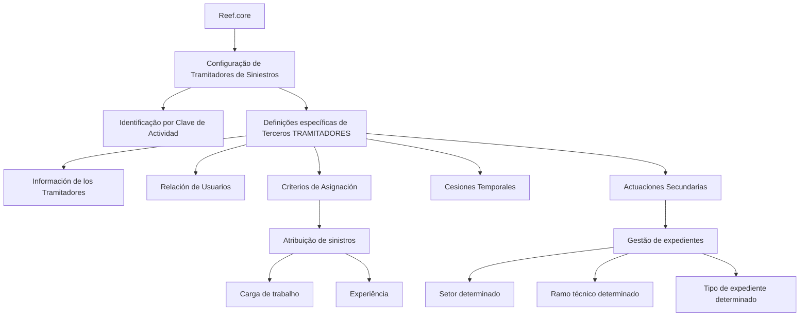

# Definição e Configuração de Tramitadores de Sinistros no Reef.core

## 1. Metadados do Documento
- **Arquivo de Origem:** `Não identificado no conteúdo fornecido`
- **Tipo de Documento:** `Documentação funcional / configuração de sistema`
- **Domínio / Sistema:** `Reef.core — Tramitadores de Siniestros`
- **Público-Alvo:** `Operação, analistas funcionais, administradores de configuração e equipes de sinistros`
- **Data/Versão Identificada:** `Não identificada`
- **Status documental identificado:** `Lifecycle: Approved Source`

---

## 2. Resumo Executivo & Contexto de Negócio

O documento apresenta a definição de elementos utilizados para configurar, no sistema **Reef.core**, os **Tramitadores de Siniestros**. A configuração permite que esses terceiros sejam posteriormente utilizados na operação do sistema.

O Reef.core identifica os Tramitadores por meio da **Clave de Actividad**. O texto também informa que os asteriscos presentes nas tarjetas indicam se a configuração de cada elemento é obrigatória para a definição de Tramitadores.

A documentação separa definições específicas, aplicáveis exclusivamente quando o terceiro configurado é um TRAMITADOR. Entre os grupos de configuração apresentados estão informações dos tramitadores, relacionamento de usuários, critérios de atribuição, cessões temporárias e atuações secundárias.

Os critérios de atribuição de sinistros são associados a aspectos como carga de trabalho e experiência. Já as atuações secundárias permitem que um Tramitador cujo papel, em princípio, não permite gerir expedientes possa fazê-lo em condições delimitadas por setor, ramo técnico e tipo de expediente.

> **Nota de Análise:** O conteúdo fornecido descreve os grupos funcionais de configuração, mas não detalha telas, campos obrigatórios específicos, valores permitidos, regras de precedência, métodos técnicos, contratos de integração ou procedimentos operacionais passo a passo.

---

## 3. Arquitetura, Componentes & Tecnologias Envolvidas

### Componentes e conceitos identificados

| Componente / Conceito | Papel identificado no conteúdo |
| :--- | :--- |
| Reef.core | Sistema no qual são configurados os Tramitadores de Siniestros. |
| Tramitadores de Siniestros | Entidades configuradas para operação posterior no sistema. |
| Terceros TRAMITADORES | Terceiros para os quais existem definições específicas de Tramitador. |
| Clave de Actividad | Chave usada pelo Reef.core para identificar Tramitadores. |
| Información de los Tramitadores | Grupo de definições associado às informações dos Tramitadores. |
| Relación de Usuarios | Configuração da relação de usuários vinculada aos Tramitadores de Siniestros. |
| Criterios de Asignación | Configuração de critérios para atribuição de sinistros aos Tramitadores. |
| Cesiones Temporales | Grupo relacionado à configuração de critérios de atribuição de sinistros. |
| Actuaciones Secundarias | Configuração que possibilita gestão de expedientes em condições específicas. |
| Documentación Reef | Área documental citada no conteúdo. |
| Mapfredocument | Termo apresentado no contexto da documentação Reef. |
| Zeus | Item exibido no menu de navegação documental. |



---

## 4. Regras de Negócio, Especificações Funcionais & Processos

### 4.1 Configuração de Tramitadores

1. O Reef.core contém elementos que permitem configurar os Tramitadores de Siniestros.
2. A configuração é necessária para que os Tramitadores possam operar posteriormente no sistema.
3. O Reef.core identifica os Tramitadores por uma **Clave de Actividad**.
4. Os asteriscos das tarjetas indicam se a configuração de determinado elemento é obrigatória em relação à definição dos Tramitadores.

### 4.2 Definições específicas para terceiros Tramitadores

1. Existe um grupo de definições empregado exclusivamente quando o terceiro possui a classificação de **TRAMITADOR**.
2. O documento não descreve critérios adicionais para classificar um terceiro como TRAMITADOR.
3. O conteúdo não informa se um terceiro pode ter múltiplos papéis, nem detalha a relação entre a classificação de terceiro e a Clave de Actividad.

### 4.3 Configuração da relação de usuários

1. A documentação lista a configuração da **Relación de Usuarios** como parte das informações de Tramitadores de Siniestros.
2. O conteúdo não especifica quais dados de usuário devem ser associados a um Tramitador.
3. O conteúdo não define permissões, perfis, regras de ativação ou validações da relação de usuários.

### 4.4 Critérios de atribuição de sinistros

1. Os **Criterios de Asignación** configuram a atribuição de sinistros aos Tramitadores.
2. A atribuição pode considerar carga de trabalho.
3. A atribuição pode considerar experiência.
4. O uso de reticências no texto indica que podem existir outros critérios, mas esses critérios não são detalhados no conteúdo fornecido.
5. O documento não especifica fórmula de cálculo de carga de trabalho, pesos, prioridade, desempate ou periodicidade de redistribuição.

### 4.5 Cessões temporárias

1. O grupo **Cesiones Temporales** é descrito como configuração de critérios de atribuição de sinistros aos Tramitadores.
2. A descrição menciona carga de trabalho e experiência.
3. O conteúdo não explica o conceito operacional de cessão temporária, sua vigência, critérios de elegibilidade, aprovação ou reversão.

### 4.6 Atuações secundárias

1. As **Actuaciones Secundarias** configuram atuações secundárias de um Tramitador.
2. O papel do Tramitador pode, em princípio, impedir a gestão de expedientes.
3. A configuração de atuação secundária permite que esse Tramitador possa gerir expedientes sob condições delimitadas.
4. As condições citadas são:
   - setor determinado;
   - ramo técnico determinado;
   - tipo de expediente determinado.
5. O conteúdo não informa se setor, ramo técnico e tipo de expediente devem ser combinados obrigatoriamente, se atuam como filtros alternativos ou se possuem hierarquia de precedência.

---

## 5. Tabelas de Parâmetros, Ambientes e Estruturas de Dados

| Item / Parâmetro | Descrição / Função | Tipo / Valores / Formato | Ambiente / Observações |
| :--- | :--- | :--- | :--- |
| Tramitador de Siniestros | Entidade configurada no Reef.core para operação posterior no sistema. | Não detalhado. | Reef.core. |
| Clave de Actividad | Identificador utilizado pelo Reef.core para identificar Tramitadores. | Chave de atividade; formato não informado. | Não detalhado. |
| Asteriscos das Tarjetas | Indicadores de obrigatoriedade da configuração de um elemento na definição de Tramitadores. | Indicador visual; regra detalhada não informada. | Aplicável à configuração de Tramitadores. |
| Tercero TRAMITADOR | Terceiro ao qual se aplicam definições específicas de Tramitador. | Classificação de terceiro; valores não informados. | Não detalhado. |
| Relación de Usuarios | Configuração de relação de usuários para Tramitadores de Siniestros. | Não detalhado. | Não detalhado. |
| Criterios de Asignación | Critérios utilizados para atribuição de sinistros a Tramitadores. | Inclui carga de trabalho e experiência. | Não detalhado. |
| Carga de Trabajo | Critério mencionado para atribuição de sinistros. | Não detalhado. | Não há fórmula ou métrica indicada. |
| Experiencia | Critério mencionado para atribuição de sinistros. | Não detalhado. | Não há escala ou regra indicada. |
| Cesiones Temporales | Grupo de configuração relacionado à atribuição de sinistros. | Não detalhado. | Não há definição operacional adicional. |
| Actuaciones Secundarias | Configuração que habilita gestão de expedientes por Tramitador em condições definidas. | Setor, ramo técnico e tipo de expediente determinados. | Não detalhado. |
| Setor | Critério delimitador para atuação secundária. | Não detalhado. | Aplicável a atuações secundárias. |
| Ramo técnico | Critério delimitador para atuação secundária. | Não detalhado. | Aplicável a atuações secundárias. |
| Tipo de expediente | Critério delimitador para atuação secundária. | Não detalhado. | Aplicável a atuações secundárias. |
| Lifecycle | Estado documental identificado. | `Approved Source`. | Documentación Reef. |
| Owner | Proprietário documental identificado. | `user:agonzalez_mapfre.com`. | Conforme conteúdo bruto. |

---

## 6. Bateria de Perguntas & Respostas para RAG (FAQ Sintético)

### P1: Qual é o objetivo da configuração de Tramitadores de Siniestros no Reef.core?
**R:** A configuração permite definir Tramitadores de Siniestros no Reef.core para que esses Tramitadores possam operar posteriormente no sistema. O documento não detalha as operações específicas realizadas pelos Tramitadores após a configuração.

### P2: Como o Reef.core identifica um Tramitador?
**R:** O Reef.core identifica os Tramitadores por meio da **Clave de Actividad**. O formato, os valores possíveis e o procedimento de manutenção dessa chave não são informados no conteúdo fornecido.

### P3: O que significam os asteriscos nas tarjetas de configuração?
**R:** Os asteriscos indicam se a configuração de um elemento é obrigatória em relação à definição dos Tramitadores. O documento não relaciona quais tarjetas ou elementos possuem obrigatoriedade.

### P4: Quais configurações são específicas para um Tercero TRAMITADOR?
**R:** O documento informa que existe um grupo de definições utilizado exclusivamente quando o terceiro é um TRAMITADOR. Entre os temas apresentados estão informações dos Tramitadores, relação de usuários, critérios de atribuição, cessões temporárias e atuações secundárias.

### P5: Quais critérios podem ser utilizados para atribuir sinistros aos Tramitadores?
**R:** Os critérios de atribuição de sinistros podem considerar **carga de trabalho** e **experiência**. O texto sugere que podem existir outros critérios, mas não os identifica nem descreve regras de cálculo, prioridade ou desempate.

### P6: O que são Cesiones Temporales na documentação de Tramitadores?
**R:** Cesiones Temporales é um grupo apresentado como configuração de critérios de atribuição de sinistros aos Tramitadores, mencionando carga de trabalho e experiência. O documento não detalha o significado operacional, a duração, as condições de início ou o encerramento das cessões temporárias.

### P7: Qual é a finalidade das Actuaciones Secundarias?
**R:** As Actuaciones Secundarias permitem configurar a atuação de um Tramitador que, em princípio, não pode gerir expedientes, para que ele possa geri-los em um setor, ramo técnico e tipo de expediente determinados.

### P8: Quais restrições delimitam uma atuação secundária de um Tramitador?
**R:** A atuação secundária é delimitada pelos critérios de **setor**, **ramo técnico** e **tipo de expediente** determinados. O documento não esclarece se esses critérios são cumulativos, alternativos ou hierárquicos.

### P9: O documento define quais usuários podem ser associados a um Tramitador?
**R:** Não. O conteúdo menciona a configuração da Relación de Usuarios para Tramitadores de Siniestros, mas não especifica usuários elegíveis, perfis, permissões, campos ou regras de validação.

### P10: O documento informa os métodos técnicos, APIs ou contratos de integração do Reef.core?
**R:** Não. O conteúdo não apresenta métodos HTTP, APIs, contratos JSON, eventos, endpoints, tecnologias de implementação, servidores, URLs ou fluxos técnicos de integração.

### P11: Qual é o status documental identificado no conteúdo?
**R:** O conteúdo apresenta o campo `Lifecycle` com o valor `Approved Source`. Não há data, versão formal ou histórico de revisões identificado.

### P12: Quem é o proprietário identificado da documentação?
**R:** O campo `Owner` apresenta `user:agonzalez_mapfre.com`. O documento não fornece nome completo, papel corporativo ou responsabilidade associada a esse proprietário.

---

## 7. Glossário de Termos, Siglas & Conceitos-Chave

- **Actuaciones Secundarias:** Configuração que permite a um Tramitador gerir expedientes para um setor, ramo técnico e tipo de expediente determinados, mesmo que o papel desse Tramitador inicialmente o impeça de gerir expedientes.
- **Approved Source:** Valor apresentado no campo `Lifecycle` da documentação.
- **Cesiones Temporales:** Grupo de configuração relacionado a critérios de atribuição de sinistros aos Tramitadores; não possui definição operacional detalhada no conteúdo.
- **Clave de Actividad:** Chave de atividade utilizada pelo Reef.core para identificar Tramitadores.
- **Criterios de Asignación:** Critérios empregados na atribuição de sinistros aos Tramitadores, incluindo carga de trabalho e experiência.
- **Expediente:** Termo usado para a gestão de casos/processos de sinistros; o documento não apresenta definição formal.
- **Mapfredocument:** Termo apresentado na navegação ou identificação da documentação Reef, sem definição adicional.
- **Reef.core:** Sistema no qual ocorre a configuração de Tramitadores de Siniestros.
- **Relación de Usuarios:** Configuração de relação de usuários associada aos Tramitadores de Siniestros.
- **Siniestros:** Sinistros atribuídos ou geridos por Tramitadores, conforme os critérios e atuações configurados.
- **Tercero TRAMITADOR:** Terceiro para o qual se aplicam definições específicas de Tramitador.
- **Tramitador de Siniestros:** Entidade configurada no Reef.core para operar posteriormente com sinistros.
- **Zeus:** Termo presente na navegação documental, sem explicação funcional no conteúdo.

---

## 8. Notas Críticas, Riscos & Limitações

- O conteúdo tem caráter resumido e não define os campos, valores, telas ou procedimentos necessários para efetuar cada configuração no Reef.core.
- Não há detalhamento da estrutura da **Clave de Actividad**, nem de sua criação, validação, unicidade ou impacto operacional.
- Os critérios de atribuição mencionam carga de trabalho e experiência, porém não fornecem fórmulas, pesos, prioridades, regras de desempate ou indicadores mensuráveis.
- A seção de **Cesiones Temporales** não explica o conceito de cessão, vigência, aprovação, rastreabilidade ou reversão.
- As **Actuaciones Secundarias** citam setor, ramo técnico e tipo de expediente, mas não esclarecem a lógica de combinação desses filtros.
- O documento não apresenta controles de acesso, perfis, permissões ou auditoria para a relação de usuários dos Tramitadores.
- Não foram identificados detalhes técnicos de integração, APIs, contratos, bancos de dados, logs, URLs, ambientes ou servidores.
- A referência contém apenas uma página extraída e não há notas de apresentador, anexos ou conteúdo complementar disponível.

---

## 9. Conteúdo Bruto Estruturado (Referência Fiel)

```text
--- [PÁGINA 1 DE 1] ---

DEFINICIÓN de los TRAMITADORES
Se relacionan los elementos que permiten congurar en Reef.core a los Tramitadores de Siniestros para poder operar posteriormente con
ellos en el Sistema.
Reef.core identica a los Tramitadores con la Clave de Actividad... 9.
Los Asteriscos de las Tarjetas indican si la conguración del elemento es obligatoria en relación con la denición de los Tramitadores.
Deniciones ESPECÍFICAS, propias de los Terceros TRAMITADORES
En este Grupo se encuentran deniciones que se emplean exclusivamente cuando el Tercero es un
TRAMITADOR.
INFORMACIÓN DE LOS TRAMITADORES
Conguración de la Relación de Usuarios
Tramitadores de Siniestros.
CRITERIOS DE ASIGNACIÓN 
Conguración de los Criterios de
Asignación de Siniestros a los
Tramitadores por carga de Trabajo,
Experiencia,...
CESIONES TEMPORALES 
Conguración de los Criterios de
Asignación de Siniestros a los
Tramitadores por carga de Trabajo,
Experiencia,...
ACTUACIONES SECUNDARIAS 
Conguración de las Actuaciones
Secundarias del Tramitador, cuyo rol en
principio le impide gestionar expedientes,
para que pueda hacerlo para un sector,
ramo técnico y tipo de expediente
determinados.
Documentation / DOCUMENTACIÓN Reef
DOCUMENTACIÓN Reef
Mapfredocument
DOCUMENTACIÓN Reef
Owner
user:agonzalez_mapfre.com
Lifecycle
Approved Source
 / 
 VL
Buscar Inicio Soluciones Arquitecturas APIs Componentes Cloud Documentación Zeus Reef Ayuda
ES
```
