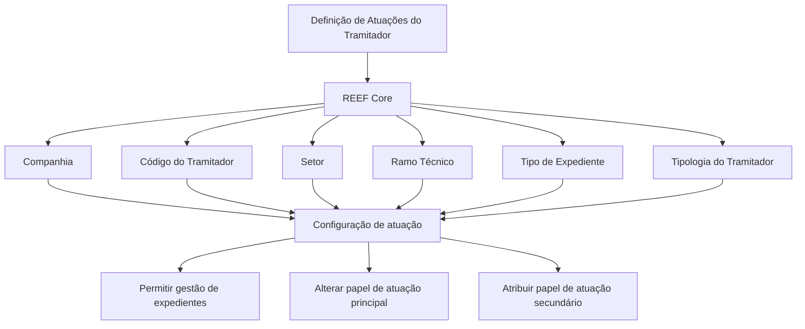

# Definição de Atuações do Tramitador no REEF Core

## 1. Metadados do Documento
- **Arquivo de Origem:** Não identificado no conteúdo fornecido
- **Tipo de Documento:** Especificação Funcional
- **Domínio / Sistema:** REEF Core / Gestão de Expedientes
- **Público-Alvo:** Negócio, Analistas Funcionais, Desenvolvedores e Operação
- **Data/Versão Identificada:** Não identificada

---

## 2. Resumo Executivo & Contexto de Negócio

O documento descreve a funcionalidade **“Definir Actuaciones del Tramitador”** do sistema REEF Core. A funcionalidade permite configurar exceções de atuação para um tramitador que, segundo o papel originalmente atribuído, não poderia gerir expedientes.

A configuração pode habilitar a gestão de expedientes para uma combinação específica de companhia, setor, ramo técnico e tipo de expediente. A mesma configuração também pode ser usada para alterar o papel de atuação principal do tramitador para o escopo configurado.

A habilitação é restrita a tramitadores cuja tipologia seja exclusivamente uma das seguintes: **Recepcionista**, **Centro Telefónico**, **Tramitador Abogado** ou **Colaborador**. O documento destaca que o uso mais comum da funcionalidade é permitir que pessoal de centros telefônicos realize a gestão ou tramitação de expedientes.

O documento também prevê o uso de códigos genéricos em determinados atributos de classificação: setor `9999`, ramo técnico `999` e tipo de expediente `ZZZ`. A interpretação isolada do documento pode causar erros; por isso, a leitura de documentos vinculados é recomendada.

---

## 3. Arquitetura, Componentes & Tecnologias Envolvidas

O conteúdo identifica o sistema **REEF Core** como responsável pela configuração das atuações secundárias ou alterações de papel de atuação do tramitador. Não são detalhados componentes técnicos, APIs, métodos HTTP, contratos JSON, banco de dados, mecanismos de autenticação ou integrações externas.



**Nota de Análise:** O documento cita o REEF Core, mas não detalha a arquitetura interna, os módulos responsáveis pela persistência da configuração, nem os mecanismos técnicos usados para aplicar as permissões configuradas.

---

## 4. Regras de Negócio, Especificações Funcionais & Processos

1. O REEF Core possui funcionalidade para configurar atuações de tramitadores.
2. A configuração permite que um tramitador, cujo papel normalmente impede a gestão de expedientes, possa gerir expedientes em um escopo determinado.
3. O escopo de habilitação é definido por:
   - Companhia;
   - Código do tramitador;
   - Setor;
   - Ramo técnico;
   - Tipo de expediente;
   - Tipologia do tramitador.
4. A configuração pode ser utilizada para:
   - permitir a gestão de expedientes de apólices relacionadas ao setor, ramo técnico e tipo de expediente configurados;
   - considerar uma alteração no papel de atuação principal do tramitador;
   - atribuir um novo papel de atuação, também referido como papel de atuação secundário.
5. A funcionalidade somente é permitida para tramitadores que tenham exclusivamente uma das seguintes tipologias:
   - Recepcionista;
   - Centro Telefónico;
   - Tramitador Abogado;
   - Colaborador.
6. O campo **Setor** aceita o valor genérico `9999`.
7. O campo **Ramo Técnico** aceita o valor genérico `999`.
8. O campo **Tipo de Expediente** aceita o valor genérico `ZZZ`.
9. O uso operacional mais habitual das atuações secundárias é habilitar pessoal do centro telefônico a gerir ou tramitar expedientes.
10. A alteração do papel de atuação principal do tramitador é mencionada como possibilidade, porém não como o uso mais comum.
11. O documento recomenda a leitura dos vínculos **Definición Tramitadores** e **Preguntas frecuentes**, pois a interpretação isolada pode conduzir a erro.

---

## 5. Tabelas de Parâmetros, Ambientes e Estruturas de Dados

| Item / Parâmetro | Descrição / Função | Tipo / Valores / Formato | Ambiente / Observações |
| :--- | :--- | :--- | :--- |
| Companhia | Indica o código da companhia sobre a qual a definição é realizada. | Código de companhia; formato não detalhado. | Aplicável à definição de atuação do tramitador. |
| Código do Tramitador | Identifica o código do tramitador no sistema. | Código; formato não detalhado. | Identificação do tramitador configurado. |
| Setor | Determina o setor da Estrutura de Produtos da Companhia para habilitar a gestão de expedientes de apólices ou considerar mudança no papel de atuação principal. | Código de setor; valor genérico permitido: `9999`. | A semântica operacional do valor genérico não é detalhada. |
| Ramo Técnico | Determina o ramo técnico da Estrutura de Produtos da Companhia para habilitar a gestão de expedientes de apólices ou considerar mudança no papel de atuação principal. | Código de ramo técnico; valor genérico permitido: `999`. | A semântica operacional do valor genérico não é detalhada. |
| Tipo de Expediente | Identifica o tipo de expediente para o qual se pretende habilitar a gestão pelo tramitador ou determinar mudança no papel de atuação principal. | Código de tipo de expediente; valor genérico permitido: `ZZZ`. | A semântica operacional do valor genérico não é detalhada. |
| Tipologia do Tramitador | Determina o novo papel de atuação ou o papel de atuação secundário atribuído ao tramitador. | Recepcionista; Centro Telefónico; Tramitador Abogado; Colaborador. | A configuração somente é permitida para uma dessas tipologias. |
| Papel de atuação principal | Papel originalmente configurado para o tramitador, que pode ser considerado para mudança no escopo configurado. | Não detalhado. | O documento não informa regras de precedência nem processo de alteração. |
| Papel de atuação secundário | Novo papel de atuação atribuído ao tramitador. | Não detalhado. | Usado habitualmente para habilitar tramitação por pessoal de centro telefônico. |
| REEF Core | Sistema que contém a funcionalidade de configuração das atuações do tramitador. | Sistema corporativo. | Não há detalhes técnicos adicionais. |
| Documento vinculado | **Definición Tramitadores**. | Documento funcional recomendado. | Deve ser lido para evitar interpretação isolada incorreta. |
| Documento vinculado | **Preguntas frecuentes**. | Documento funcional recomendado. | Deve ser lido para evitar interpretação isolada incorreta. |

---

## 6. Bateria de Perguntas & Respostas para RAG (FAQ Sintético)

### P1: Qual é o objetivo da funcionalidade “Definir Actuaciones del Tramitador” no REEF Core?
**R:** A funcionalidade permite configurar um tramitador para gerir expedientes mesmo quando o papel originalmente atribuído impede essa gestão. A habilitação é definida para uma combinação de companhia, setor, ramo técnico e tipo de expediente, podendo também considerar uma mudança no papel de atuação principal.

### P2: Quais tipologias de tramitador podem usar a configuração de atuações no REEF Core?
**R:** A configuração é permitida somente quando a tipologia do tramitador for exclusivamente uma das seguintes: Recepcionista, Centro Telefónico, Tramitador Abogado ou Colaborador.

### P3: Para que serve o campo Companhia na definição de atuações do tramitador?
**R:** O campo Companhia indica o código da companhia sobre a qual a definição de atuação do tramitador está sendo realizada.

### P4: Qual é a finalidade do Código do Tramitador?
**R:** O Código do Tramitador identifica o código do tramitador no sistema e vincula a configuração de atuação ao tramitador específico.

### P5: O que determina o campo Setor na configuração do tramitador?
**R:** O campo Setor determina o setor da Estrutura de Produtos da Companhia para o qual o tramitador poderá gerir expedientes de apólices ou para o qual será considerada uma alteração no papel de atuação principal. O valor genérico `9999` pode ser utilizado na configuração.

### P6: Qual valor genérico pode ser usado para o Ramo Técnico?
**R:** O campo Ramo Técnico aceita o código genérico `999`. O documento não detalha o comportamento operacional específico associado ao uso desse valor genérico.

### P7: Qual valor genérico pode ser usado para o Tipo de Expediente?
**R:** O campo Tipo de Expediente aceita o código genérico `ZZZ`. Esse campo identifica o tipo de expediente para o qual se habilita a gestão pelo tramitador ou se determina uma mudança no papel de atuação principal.

### P8: A funcionalidade serve apenas para alterar o papel principal do tramitador?
**R:** Não. Embora a funcionalidade possa considerar a alteração do papel de atuação principal, o documento informa que seu emprego mais habitual é permitir a gestão ou tramitação de expedientes pelo pessoal do centro telefônico.

### P9: O que a Tipologia do Tramitador determina na configuração?
**R:** A Tipologia do Tramitador determina o novo papel de atuação atribuído ao tramitador, que pode corresponder a um papel de atuação secundário.

### P10: Quais documentos devem ser consultados junto com esta especificação?
**R:** O documento recomenda a leitura de **Definición Tramitadores** e **Preguntas frecuentes**, pois a interpretação isolada da especificação pode levar a erros.

---

## 7. Glossário de Termos, Siglas & Conceitos-Chave

- **REEF Core:** Sistema que contém a funcionalidade de configuração de atuações de tramitadores.
- **Tramitador:** Papel ou usuário identificado no sistema para o qual podem ser configuradas permissões de gestão de expedientes.
- **Atuação secundária:** Novo papel de atuação atribuído ao tramitador na configuração.
- **Papel de atuação principal:** Papel de atuação originalmente configurado para o tramitador, passível de mudança no escopo definido.
- **Expediente:** Entidade cuja gestão ou tramitação pode ser habilitada para um tramitador.
- **Setor:** Classificação da Estrutura de Produtos da Companhia; aceita o código genérico `9999`.
- **Ramo Técnico:** Classificação da Estrutura de Produtos da Companhia; aceita o código genérico `999`.
- **Tipo de Expediente:** Classificação que identifica o tipo de expediente; aceita o código genérico `ZZZ`.
- **Recepcionista:** Tipologia de tramitador elegível para a configuração.
- **Centro Telefónico:** Tipologia de tramitador elegível para a configuração e principal caso de uso citado.
- **Tramitador Abogado:** Tipologia de tramitador elegível para a configuração.
- **Colaborador:** Tipologia de tramitador elegível para a configuração.

---

## 8. Notas Críticas, Riscos & Limitações

- O documento não descreve os métodos de manutenção da configuração, telas, APIs, contratos de integração ou mecanismos de persistência.
- Não são especificadas regras de precedência entre papel de atuação principal e papel de atuação secundário.
- Não há detalhamento sobre o significado operacional dos valores genéricos `9999`, `999` e `ZZZ`.
- O documento não especifica validações adicionais, mensagens de erro, trilha de auditoria, permissões necessárias ou fluxos de aprovação.
- A configuração é explicitamente limitada às tipologias Recepcionista, Centro Telefónico, Tramitador Abogado e Colaborador.
- A leitura isolada do documento pode causar interpretação incorreta; os documentos vinculados são recomendados.

---

## 9. Conteúdo Bruto Estruturado (Referência Fiel)

```text
--- [PÁGINA 1 DE 2] ---

DEFINIR Actuaciones del Tramitador
Objetivo
Reef.core tiene la funcionalidad de poder congurar para permitir el que un tramitador, cuyo rol en principio le impide gestionar expedientes,
pueda hacerlo para un sector, ramo técnico y tipo de expediente determinados o cambiar el rol de actuación principal que el tramitador tenga
congurado per se.
Esto está permitido siempre y cuando la tipología del Tramitador sea únicamente una de las siguientes:
Recepcionista.
Centro Telefónico.
Tramitador Abogado, ó
Colaborador.
Propiedades Operativas
Propiedades Operativas
Compañía
Esta propiedad le indica al sistema el código de la compañía sobre la que se está realizando la denición.
Código del Tramitador
Este atributo identica el código del tramitador en el Sistema.
Sector
Esta propiedad determina el Sector de la Estructura de Productos de la Compañía que se congura para permitir al tramitador la gestión de
los expedientes de sus pólizas o para el que se considera el cambio en el rol de actuación principal del tramitador.
Se puede emplear el valor genérico de este campo (código 9999) en su conguración.
Ramo Técnico
Esta propiedad determina el ramo técnico de la Estructura de Productos de la Compañía que se congura para permitir al tramitador la
gestión de los expedientes de sus pólizas o para el que se considera el cambio en el rol de actuación principal del tramitador.
Consejo:
Documentation / DOCUMENTACIÓN Reef
DOCUMENTACIÓN Reef
Mapfredocument
DOCUMENTACIÓN Reef
Owner
user:agonzalez_mapfre.com
Lifecycle
Approved Source
 /
 VL
Buscar Inicio Soluciones Arquitecturas APIs Componentes Cloud Documentación Zeus Reef Ayuda
ES

--- [PÁGINA 2 DE 2] ---

Se puede emplear el valor genérico de este campo (código 999) en la conguración.
Tipo de Expediente
Este atributo identica el tipo de expediente sobre el que se pretende habilitar al tramitador su gestión o para el que se determina el cambio
en el rol de actuación principal del tramitador.
Se puede emplear el valor genérico de este campo (código ZZZ) en la conguración.
Tipología del Tramitador
Este campo del determinará el nuevo rol de actuación (o rol de actuación secundario) asignado al tramitador.
Vínculos
Relación de Directrices y Documentos funcionales cuya lectura recomendada para evitar que la interpretación aislada del presente
documento pueda conducir a error.
Denición Tramitadores
Preguntas frecuentes
(1) ¿Existe alguna particularidad operativa que deba ser tomada en consideración localmente en la codicación, uso y conguración de las
actuaciones secundarias de los Tramitadores en el Sistema?
Su empleo más habitual es para permitir la gestión o tramitación de los expedientes por parte del personal del centro telefónico y no tanto
para modicar el rol de actuación principal del tramitador.
Consejo:
Consejo:
```
