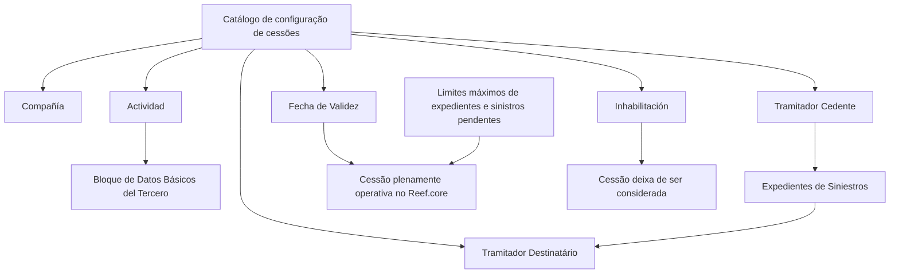
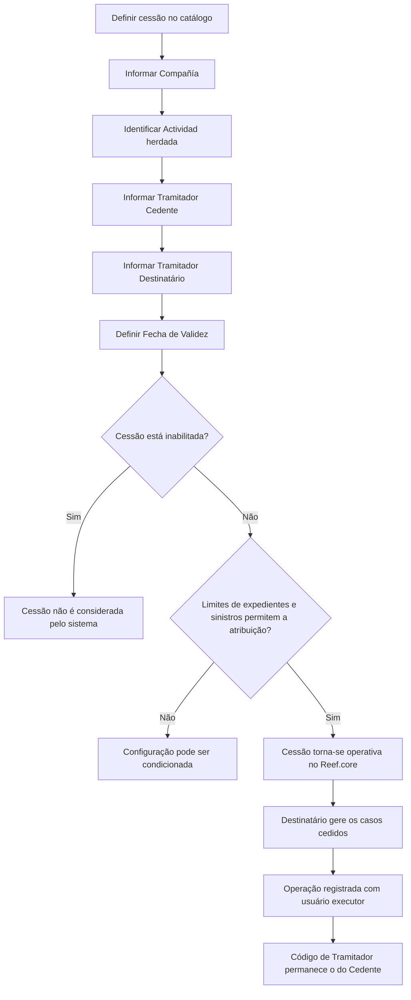

# Cesiones Temporales de Expedientes del Tramitador no Reef.core

## 1. Metadados do Documento
- **Arquivo de Origem:** `Não informado no conteúdo fornecido`
- **Tipo de Documento:** `Especificação Funcional`
- **Domínio / Sistema:** `Reef.core / Gestão de Siniestros e Expedientes`
- **Público-Alvo:** `Operação, configuradores do catálogo, tramitadores e analistas funcionais`
- **Data/Versão Identificada:** `Não identificada`
- **Owner identificado:** `user:agonzalez_mapfre.com`
- **Lifecycle identificado:** `Approved Source`

---

## 2. Resumo Executivo & Contexto de Negócio

O documento descreve a funcionalidade de **cesiones temporales de Expedientes** no sistema **Reef.core**. A funcionalidade permite modificar a atribuição de expedientes de um Tramitador Cedente para que outro profissional, denominado Tramitador Destinatário, possa retomar a gestão dos casos.

A cessão temporária de expedientes atende cenários operacionais como carga de trabalho, eficiência operacional, doença, férias e afastamento temporário. A configuração é realizada por meio de um catálogo que identifica companhia, atividade, tramitador cedente, tramitador destinatário, data de validade e estado de inabilitação.

A ativação da cessão depende da **Fecha de Validez**, a partir da qual a cessão passa a ter efeito e fica plenamente operativa no sistema. A inabilitação interrompe a consideração da cessão entre os tramitadores envolvidos a partir do momento em que é aplicada.

O documento ressalta que limites de capacidade operacional podem condicionar a configuração: o número máximo de expedientes atribuíveis a um Tramitador e o número de sinistros pendentes que o Tramitador possui em determinado momento podem impedir ou afetar a cessão, mesmo que os demais critérios estejam atendidos.

---

## 3. Arquitetura, Componentes & Tecnologias Envolvidas

Os elementos identificados no documento são:

| Componente / Elemento | Papel identificado |
| :--- | :--- |
| **Reef.core** | Sistema que disponibiliza a operação de modificação da atribuição de Expedientes entre Tramitadores. |
| **Catálogo de configuração** | Estrutura onde são definidos os dados da cessão, incluindo o atributo de inabilitação. |
| **Tramitador Cedente** | Tramitador cujo código identifica o responsável que cede os expedientes de sinistros. |
| **Tramitador Destinatário** | Tramitador que recebe os expedientes de sinistros cedidos. |
| **Expedientes** | Casos cuja gestão pode ser temporariamente transferida entre tramitadores. |
| **Siniestros** | Contexto operacional relacionado aos expedientes. O documento menciona cessão, atribuição e distribuição de sinistros e expedientes. |
| **Bloque de Datos Básicos del Tercero** | Origem do dado de Atividade, que é herdado para identificar o código de atividade dos Tramitadores. |
| **Definición de Tramitadores** | Documento funcional vinculado, recomendado para leitura conjunta. |
| **Mapfredocument** | Repositório ou contexto documental exibido na extração. |



**Nota de Análise:** o conteúdo não detalha métodos HTTP, contratos JSON, persistência de dados, integrações técnicas, versões de componentes ou tecnologias de infraestrutura associadas ao Reef.core.

---

## 4. Regras de Negócio, Especificações Funcionais & Processos

### 4.1 Objetivo funcional

O Reef.core permite modificar a atribuição de Expedientes para que um Tramitador distinto possa retomar a gestão dos casos originalmente atribuídos a outro Tramitador.

A cessão pode ser utilizada nos seguintes cenários explicitamente mencionados:

- Carga de trabalho.
- Eficiência operacional.
- Doença.
- Férias.
- Baixa ou afastamento temporário.

### 4.2 Propriedades gerais e operativas

A definição de cessão requer a identificação da companhia, atividade, tramitador cedente, tramitador destinatário, data de validade e condição de inabilitação.

### 4.3 Regras para Companhia

A propriedade **Compañía** informa ao sistema o código da companhia sobre a qual a definição da cessão está sendo realizada.

### 4.4 Regras para Atividade

A propriedade **Actividad**:

1. É proveniente do **Bloque de Datos Básicos del Tercero**.
2. É herdada desse bloco de dados.
3. Identifica o código de atividade correspondente aos Tramitadores.
4. É identificada no documento com a referência `[9]`.
5. Permite que futuramente possam ocorrer cessões de sinistros ou expedientes entre Supervisores de Siniestros.
6. Não habilita atualmente a cessão entre Supervisores de Siniestros; essa possibilidade é apenas futura.

### 4.5 Regras para Tramitador Cedente e Tramitador Destinatário

- O **Tramitador Cedente** contém o código do Tramitador que cede os expedientes dos sinistros.
- O **Tramitador Destinatário** determina o código do Tramitador que recebe os expedientes dos sinistros.

### 4.6 Regra de vigência da cessão

A propriedade **Fecha de Validez** indica a data a partir da qual a cessão de expedientes:

1. Assume efeito no sistema.
2. Torna-se plenamente operativa no Reef.core.

O documento não detalha formato de data, fuso horário, horário de início de vigência ou regras para término automático da cessão.

### 4.7 Regra de inabilitação

O atributo **Inhabilitación** pertence ao catálogo de configuração e determina que a cessão de expedientes do Tramitador está inabilitada no sistema.

A partir do momento da inabilitação:

- A cessão de casos deixa de ser considerada.
- A interrupção se aplica à relação entre os Tramitadores envolvidos.

### 4.8 Restrições operacionais de capacidade

A cessão de casos, assim como a atribuição e a distribuição de Siniestros e Expedientes, pode ser condicionada por limites operacionais:

1. Número máximo de expedientes que podem ser atribuídos a um Tramitador.
2. Número de sinistros pendentes que um Tramitador pode possuir em determinado momento.

Essas restrições podem condicionar a configuração do catálogo mesmo que o Tramitador cumpra todos os demais critérios necessários.

### 4.9 Regra de rastreabilidade das operações

Quando um Tramitador gere sinistros ou expedientes pertencentes a outro Tramitador:

- As operações realizadas ficam registradas com o **código de usuário do Tramitador que executou a operação**.
- O **código de Tramitador** mantém o valor do Tramitador que cedeu os casos.

Essa regra separa a identidade do usuário executor da operação da identidade do Tramitador responsável pelos casos cedidos.



---

## 5. Tabelas de Parâmetros, Ambientes e Estruturas de Dados

| Item / Parâmetro | Descrição / Função | Tipo / Valores / Formato | Ambiente / Observações |
| :--- | :--- | :--- | :--- |
| Compañía | Indica o código da companhia sobre a qual a definição de cessão é realizada. | Código de companhia; formato não detalhado. | Aplicável à definição da cessão no catálogo. |
| Actividad | Identifica o código de atividade correspondente aos Tramitadores. | Código de atividade; formato não detalhado. | Procede e é herdado do Bloque de Datos Básicos del Tercero. Referência `[9]`. |
| Tramitador Cedente | Contém o código do Tramitador que cede os expedientes dos sinistros. | Código de Tramitador; formato não detalhado. | Mantém o código de Tramitador nos casos cedidos. |
| Tramitador Destinatário | Determina o código do Tramitador que recebe os expedientes dos sinistros. | Código de Tramitador; formato não detalhado. | Executa a gestão dos casos recebidos. |
| Fecha de Validez | Define a data a partir da qual a cessão toma efeito e fica plenamente operativa. | Data; formato não detalhado. | Não há detalhes sobre fuso horário ou expiração. |
| Inhabilitación | Determina que a cessão de expedientes do Tramitador está inabilitada. | Estado de inabilitação; valores não detalhados. | A partir da inabilitação, a cessão entre os tramitadores deixa de ser considerada. |
| Número máximo de expedientes | Limite de expedientes que podem ser atribuídos a um Tramitador. | Limite numérico; valor não detalhado. | Pode condicionar a configuração do catálogo. |
| Siniestros pendentes | Quantidade de sinistros pendentes que um Tramitador pode ter em determinado momento. | Quantidade; limite não detalhado. | Pode condicionar a configuração do catálogo. |
| Código de usuário | Identifica o usuário que efetivamente realizou uma operação em casos cedidos. | Código de usuário; formato não detalhado. | Usado no registro das operações. |
| Código de Tramitador | Identifica o Tramitador associado aos casos cedidos. | Código de Tramitador; formato não detalhado. | Permanece o código do Tramitador Cedente. |
| Reef.core | Sistema que oferece a operação de alteração de atribuição de Expedientes. | Sistema corporativo. | Não são fornecidos ambiente, URL, versão ou infraestrutura. |
| Definición de Tramitadores | Documento funcional vinculado e recomendado. | Documento de referência. | Deve ser lido para evitar interpretação isolada inadequada. |

---

## 6. Bateria de Perguntas & Respostas para RAG (FAQ Sintético)

### P1: Qual é o objetivo da funcionalidade de cesiones temporales no Reef.core?
**R:** A funcionalidade permite modificar a atribuição de Expedientes de um Tramitador para outro Tramitador. Dessa forma, o Tramitador Destinatário pode retomar a gestão dos casos cedidos pelo Tramitador Cedente.

### P2: Em quais situações operacionais a cessão temporária de expedientes pode ser utilizada?
**R:** O documento menciona carga de trabalho, eficiência operacional, doença, férias e baixa ou afastamento temporário como situações em que outro Tramitador pode retomar a gestão de Expedientes.

### P3: O que representa o campo Compañía na configuração da cessão?
**R:** Compañía informa ao sistema o código da companhia sobre a qual a definição da cessão temporária de Expedientes está sendo realizada.

### P4: De onde vem a propriedade Actividad na definição de cessões?
**R:** Actividad procede e é herdada do Bloque de Datos Básicos del Tercero. A propriedade identifica o código de atividade correspondente aos Tramitadores.

### P5: A cessão entre Supervisores de Siniestros está disponível?
**R:** Não. O documento informa que a propriedade Actividad permite que, no futuro, possam ocorrer cessões de sinistros ou expedientes entre Supervisores de Siniestros, mas essa funcionalidade não está habilitada no momento.

### P6: Qual é a diferença entre Tramitador Cedente e Tramitador Destinatário?
**R:** O Tramitador Cedente contém o código do Tramitador que cede os expedientes dos sinistros. O Tramitador Destinatário determina o código do Tramitador que recebe esses expedientes para realizar sua gestão.

### P7: Quando uma cessão de expedientes passa a ser plenamente operativa?
**R:** A cessão passa a tomar efeito e fica plenamente operativa a partir da data definida na propriedade Fecha de Validez.

### P8: O que acontece quando uma cessão é inabilitada?
**R:** Quando o atributo Inhabilitación determina que a cessão está inabilitada, o sistema deixa de considerar a cessão de casos entre os Tramitadores envolvidos a partir do momento da inabilitação.

### P9: A cessão pode ser condicionada mesmo quando o Tramitador atende aos demais critérios?
**R:** Sim. O número máximo de expedientes atribuíveis a um Tramitador e o número de sinistros pendentes que ele possui em determinado momento podem condicionar a configuração do catálogo, mesmo quando os demais critérios são atendidos.

### P10: Como as operações são registradas quando um Tramitador gere casos cedidos por outro?
**R:** As operações ficam registradas com o código de usuário do Tramitador que executou as ações. Contudo, o código de Tramitador permanece sendo o código do Tramitador que cedeu os casos.

### P11: O documento informa formatos de dados para códigos, datas ou estados de inabilitação?
**R:** Não. O documento descreve a finalidade funcional de Compañía, Actividad, códigos de Tramitador, Fecha de Validez e Inhabilitación, mas não especifica formatos técnicos, tipos de campo, valores permitidos ou contratos de integração.

### P12: Que documento deve ser consultado para evitar interpretação isolada das cessões?
**R:** O documento recomenda a leitura de **Definición de Tramitadores** como diretriz ou documento funcional vinculado, para reduzir o risco de interpretações incorretas do conteúdo analisado isoladamente.

---

## 7. Glossário de Termos, Siglas & Conceitos-Chave

- **Reef.core:** Sistema no qual existe a operação de modificar a atribuição de Expedientes entre Tramitadores.
- **Expediente:** Caso cuja gestão pode ser atribuída ou cedida entre Tramitadores.
- **Siniestro:** Elemento de negócio mencionado no contexto da gestão, cessão, atribuição e distribuição de casos e expedientes.
- **Tramitador:** Papel responsável pela gestão de sinistros e expedientes.
- **Tramitador Cedente:** Tramitador que cede os expedientes dos sinistros.
- **Tramitador Destinatário:** Tramitador que recebe os expedientes cedidos.
- **Cesión temporal:** Transferência de gestão de expedientes entre Tramitadores, aplicável em cenários operacionais temporários.
- **Compañía:** Código da companhia sobre a qual a definição de cessão é realizada.
- **Actividad:** Código de atividade associado aos Tramitadores, herdado do Bloque de Datos Básicos del Tercero.
- **Bloque de Datos Básicos del Tercero:** Origem da propriedade Actividad.
- **Fecha de Validez:** Data a partir da qual a cessão passa a tomar efeito e operar plenamente.
- **Inhabilitación:** Condição que torna a cessão inabilitada e faz o sistema deixar de considerá-la.
- **Supervisor de Siniestros:** Papel mencionado como possível destinatário de cessões futuras, funcionalidade que não está habilitada.
- **Catálogo de configuração:** Estrutura utilizada para definir e controlar a cessão de expedientes.
- **Mapfredocument:** Termo exibido no contexto documental extraído; o papel técnico não é detalhado.

---

## 8. Notas Críticas, Riscos & Limitações

- A configuração da cessão pode ser condicionada por limites máximos de expedientes e pela quantidade de sinistros pendentes do Tramitador.
- O documento não especifica os valores dos limites operacionais de expedientes ou sinistros pendentes.
- O documento não informa formatos técnicos para códigos de companhia, atividade, usuário ou Tramitador.
- O documento não informa formato, fuso horário, hora de ativação ou política de expiração da Fecha de Validez.
- A cessão entre Supervisores de Siniestros é citada como possibilidade futura, mas não está habilitada.
- A rastreabilidade separa o usuário executor da operação do código de Tramitador associado ao caso, o que deve ser considerado em auditorias operacionais.
- O documento recomenda a leitura de **Definición de Tramitadores** para evitar interpretação isolada e potencialmente incorreta.
- **Nota de Análise:** não há detalhamento sobre APIs, métodos HTTP, contratos JSON, URLs, ambientes, autenticação, regras de autorização ou mecanismos de persistência.

---

## 9. Conteúdo Bruto Estruturado (Referência Fiel)

```text
--- [PÁGINA 1 DE 2] ---

DEFINIR CESIONES TEMPORALES de Expedientes del TRAMITADOR
Objetivo
Reef.core tiene la operatividad de modicar la asignación de los Expedientes a un Tramitador para que algún otro tramitador pueda retomar
su gestión (ya sea por carga de trabajo, eciencia operativa, enfermedad, vacaciones, baja temporal,...)
Propiedades Generales
Propiedades Operativas
Compañía
Esta propiedad le indica al sistema el código de la compañía sobre la que se está realizando la denición.
Actividad
Este dato procede y se hereda del Bloque de Datos Básicos del Tercero e identica el código de actividad que le corresponde a los
Tramitadores [9]
Esta propiedad permite el que en un futuro se puedan ceder siniestros/expedientes entre Supervisores de Siniestros (Por ahora esta
funcionalidad no está habilitada)
Tramitador Cedente
Este atributo contiene el código del Tramitador que cede los expedientes de los siniestros.
Tramitador Destinatario
Esta propiedad, por el contrario, determinará el código del Tramitador que recibe los expedientes de los siniestros.
Fecha de Validez
Esta propiedad le indica al Sistema la fecha a partir de la cual la cesión de expedientes tomará cuerpo y estará plenamente operativa en el
sistema.
Inhabilitación
Este atributo del catálogo de conguración determina que la cesión de expedientes del Tramitador está inhabilitada en el Sistema por lo que
a partir del momento de su inhabilitación no se va a considerar la cesión de casos entre los tramitadores implicados.
Documentation / DOCUMENTACIÓN Reef
DOCUMENTACIÓN Reef
Mapfredocument
DOCUMENTACIÓN Reef
Owner
user:agonzalez_mapfre.com
Lifecycle
Approved Source
 /
VL
Buscar Inicio Soluciones Arquitecturas APIs Componentes Cloud Documentación Zeus Reef Ayuda
ES


--- [PÁGINA 2 DE 2] ---

Vínculos
Relación de Directrices y Documentos funcionales cuya lectura recomendada para evitar que la interpretación aislada del presente
documento pueda conducir a error.
Denición de Tramitadores
Preguntas frecuentes
¿Existe alguna particularidad operativa que deba ser tomada en consideración localmente en el uso y conguración de las cesiones de
Siniestros/Expedientes entre tramitadores?
(1) No debemos perder de vista que tanto en la cesión de casos como en la asignación y distribución de Siniestros y Expedientes el número
máximo de expedientes que se le puedan asignar a un Tramitador y el número de siniestros pendientes que pueda tener en un momento
determinado, pueden condicionar (aunque el Tramitador cumpla justamente con todos los criterios) la conguración de este catálogo.
(2) Cuando un tramitador gestiona los siniestros/expedientes de otro tramitador todas las operaciones que realice quedarán registradas con
su código de usuario, pero como código de tramitador se mantendrá el del tramitador que cedió los casos.
```
