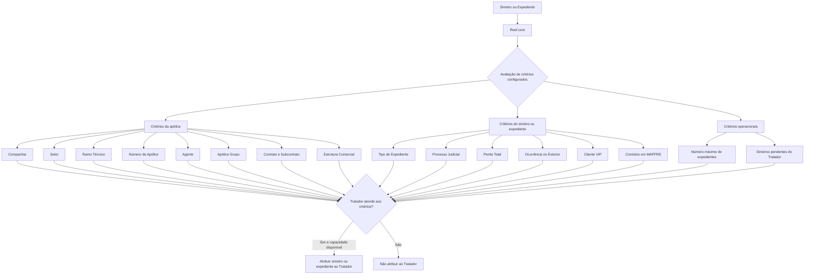

# Definição de Critérios de Atribuição de Sinistros para Tratadores no Reef.core

## 1. Metadados do Documento
- **Arquivo de Origem:** Não identificado no conteúdo fornecido
- **Tipo de Documento:** Especificação Funcional
- **Domínio / Sistema:** Reef.core / Gestão e Distribuição de Sinistros e Expedientes
- **Público-Alvo:** Desenvolvedores, Arquitetos, Operação e Negócio
- **Data/Versão Identificada:** Não identificada

---

## 2. Resumo Executivo & Contexto de Negócio

O documento descreve a funcionalidade do sistema **Reef.core** para atribuir e distribuir automaticamente sinistros e expedientes de uma entidade para usuários **Tratadores de Sinistros**. A atribuição pode ocorrer segundo a carga de trabalho existente para cada tratador em determinado momento ou segundo definições configuradas previamente no catálogo de critérios de atribuição.

O catálogo de critérios permite especializar o tratamento de sinistros e expedientes. Essa especialização pode ser configurada por características da apólice, da estrutura de produtos, da estrutura comercial e por características operacionais ou funcionais dos sinistros e expedientes.

Entre os critérios relacionados à apólice, o documento apresenta Companhia, Setor, Ramo Técnico, Número de Apólice, Agente, Apólice Grupo, Contrato, Subcontrato e níveis da Estrutura Comercial. Esses critérios permitem direcionar sinistros e expedientes associados a determinadas características para tratadores específicos.

Entre os critérios relacionados a sinistros e expedientes, o documento apresenta Tipo de Expediente e indicadores para considerar ou não processos judiciais, perda total, ocorrência no exterior, clientes VIP e expedientes com contrário em MAPFRE.

A atribuição não depende somente da aderência aos critérios configurados. O processo também considera limitações operacionais: o número máximo de expedientes atribuíveis a um tratador e a quantidade de sinistros pendentes que o tratador possui em determinado momento podem impedir a atribuição, mesmo quando todos os critérios forem atendidos.

---

## 3. Arquitetura, Componentes & Tecnologias Envolvidas

O documento cita o **Reef.core** como sistema responsável pelo processo de atribuição e distribuição de sinistros e expedientes. O processo utiliza um catálogo de critérios configurado para cada Tratador e considera propriedades associadas a apólices, estruturas de produtos, estruturas comerciais e características dos sinistros ou expedientes.

Componentes e conceitos identificados:

| Componente / Conceito | Papel identificado no documento |
| :--- | :--- |
| Reef.core | Sistema que atribui e distribui automaticamente sinistros e expedientes. |
| Catálogo de Critérios de Atribuição | Configuração que define critérios para especialização e distribuição a Tratadores. |
| Tratador de Sinistros | Usuário responsável pela gestão de sinistros e expedientes atribuídos. |
| Estrutura de Produtos da Companhia | Fonte de chaves como Setor e Ramo Técnico. |
| Estrutura Comercial | Fonte de chaves de Primeiro, Segundo e Terceiro Nível. |
| Módulo de Juízos | Módulo citado para identificar sinistros e expedientes em processo judicial. |
| Processo de Atribuição | Processo que determina se um sinistro ou expediente pode ser atribuído a um Tratador. |
| Processo de Distribuição | Processo citado para distribuir sinistros e expedientes, incluindo a condição de contrário em MAPFRE. |



> **Nota de Análise:** O documento descreve os critérios funcionais de atribuição no Reef.core, mas não detalha interfaces técnicas, métodos HTTP, contratos JSON, banco de dados, eventos, filas, APIs ou regras de prioridade entre critérios simultaneamente atendidos.

---

## 4. Regras de Negócio, Especificações Funcionais & Processos

### 4.1 Objetivo da atribuição automática

O Reef.core possui funcionalidade para atribuir e distribuir automaticamente os sinistros e expedientes da entidade ao conjunto de usuários Tratadores de Sinistros.

A atribuição pode considerar:

1. A carga de trabalho atribuída ao Tratador em um momento determinado.
2. Definições realizadas previamente no catálogo de critérios de atribuição.

No segundo caso, o sistema é configurado para especializar o Tratador na gestão de sinistros de uma apólice específica, de um Ramo Técnico ou de um Setor específico, entre outros critérios. Sinistros ou expedientes que possuam essas características devem ser atribuídos aos Tratadores configurados para tais critérios.

### 4.2 Propriedades relacionadas à apólice

#### Companhia

A propriedade **Companhia** informa ao sistema o código da companhia sobre a qual a definição de critérios está sendo realizada.

#### Código do Tratador

A propriedade **Código do Tratador** identifica o código do Tratador ao qual são concedidos critérios de atribuição e distribuição de sinistros.

#### Setor

A propriedade **Setor** identifica a chave do Setor na Estrutura de Produtos da Companhia. Essa chave permite especializar as atividades de gestão do Tratador, de modo que sinistros ou expedientes com essa característica sejam atribuídos exclusivamente aos Tratadores correspondentes.

O Reef.core permite utilizar o setor genérico de código **9999** na configuração desse catálogo. Por meio das combinações adequadas, um Tratador pode receber sinistros de todos os Setores, de vários Setores ou de um único Setor.

#### Ramo Técnico

A propriedade **Ramo Técnico** identifica a chave do Ramo Técnico na Estrutura de Produtos da Companhia. Essa chave permite especializar a gestão do Tratador para que sinistros ou expedientes com esse Ramo Técnico sejam atribuídos exclusivamente aos Tratadores configurados.

O documento informa que o Reef.core permite usar o setor genérico de código **999** na configuração do catálogo. O texto utiliza a expressão “setor genérico” nessa regra, embora a seção trate do atributo Ramo Técnico.

As combinações entre Ramo Técnico e Setor podem permitir atribuir a um Tratador sinistros de todos, vários ou um único Ramo Técnico; ou todos os Ramos Técnicos de um Setor específico.

#### Número de Apólice

A propriedade **Número de Apólice** identifica uma apólice específica. O critério é aplicável quando, por características técnicas ou comerciais particulares da apólice, ou pela experiência do Tratador, a entidade considera adequado que um Tratador determinado seja responsável pela gestão dos respectivos sinistros e expedientes.

#### Chave de Agente

A propriedade **Chave de Agente** identifica a chave do intermediário. Essa chave permite especializar a gestão do Tratador, para que sinistros ou expedientes de apólices intermediadas pelo Agente sejam atribuídos exclusivamente aos Tratadores configurados.

#### Apólice Grupo

A propriedade **Apólice Grupo** identifica o código de uma apólice grupo. Esse código permite especializar a gestão do Tratador para que sinistros ou expedientes associados à apólice grupo sejam atribuídos ao Tratador correspondente.

#### Contrato

A propriedade **Contrato** identifica o código de um Contrato. Esse código permite que o Reef.core especialize a gestão do Tratador para sinistros ou expedientes de apólices associadas ao Contrato.

#### Subcontrato

A propriedade **Subcontrato** identifica a chave de um Subcontrato. Essa chave permite especializar a gestão do Tratador para sinistros ou expedientes de apólices associadas ao Subcontrato.

#### Chaves da Estrutura Comercial

As chaves de Primeiro, Segundo e Terceiro Nível identificam níveis da Estrutura Comercial no sistema. Cada chave permite especializar a gestão do Tratador para que sinistros ou expedientes de apólices associadas àquela chave possam ser atribuídos ao Tratador.

### 4.3 Propriedades relacionadas a sinistros e expedientes

#### Tipo de Expediente

A propriedade **Tipo de Expediente** identifica a chave de um tipo de expediente determinado e permite especializar a gestão do Tratador.

O documento fornece os seguintes exemplos:

- **DPM:** Daños Materiales Propios.
- **RC:** Responsabilidad Civil.
- **DAP:** Lesionados.

#### Sinistros e Expedientes em Juízo

O campo referente a sinistros e expedientes em juízo adapta o comportamento do Reef.core. O campo permite determinar se o Tratador pode ou não receber sinistros e expedientes que estejam em processo judicial, no módulo de Juízos.

#### Sinistros com Perda Total

O campo referente a sinistros com perda total modula o comportamento do Processo de Atribuição do Reef.core. O campo permite determinar se o Tratador pode ou não receber sinistros e expedientes identificados como perda total.

#### Sinistros ocorridos no exterior

O campo referente a sinistros ocorridos no exterior modula o Processo de Atribuição do Reef.core. O campo permite determinar se o Tratador pode ou não receber sinistros e expedientes identificados como ocorridos no exterior.

#### Sinistros de clientes VIP

O campo referente a sinistros de clientes VIP adapta o Processo de Atribuição implementado no Reef.core. O campo permite determinar se o Tratador pode ou não receber sinistros e expedientes pertencentes a apólices de Clientes VIP.

#### Sinistros e Expedientes com contrário em MAPFRE

O campo referente a sinistros e expedientes com contrário em MAPFRE especifica o Processo de Distribuição e Atribuição de Sinistros e Expedientes do Reef.core. O campo permite determinar se o Tratador pode ou não receber expedientes com contrário em MAPFRE.

### 4.4 Restrições operacionais de capacidade

Mesmo que um Tratador cumpra todos os critérios de atribuição configurados, a atribuição pode ser condicionada pelos seguintes fatores:

1. Número máximo de expedientes que podem ser atribuídos ao Tratador.
2. Número de sinistros pendentes que o Tratador possui em determinado momento.

---

## 5. Tabelas de Parâmetros, Ambientes e Estruturas de Dados

| Item / Parâmetro | Descrição / Função | Tipo / Valores / Formato | Ambiente / Observações |
| :--- | :--- | :--- | :--- |
| Companhia | Informa o código da companhia para a qual a definição de critérios é realizada. | Código de companhia. | Aplicável à configuração do catálogo. |
| Código do Tratador | Identifica o Tratador que recebe os critérios de atribuição e distribuição. | Código de Tratador. | Aplicável à configuração do catálogo. |
| Setor | Identifica a chave de Setor da Estrutura de Produtos da Companhia e especializa a gestão do Tratador. | Chave de Setor; código genérico `9999`. | Permite configurar todos, vários ou um único Setor. |
| Ramo Técnico | Identifica a chave de Ramo Técnico da Estrutura de Produtos e especializa a gestão do Tratador. | Chave de Ramo Técnico; o documento cita “setor genérico” código `999`. | Pode ser combinado com Setor. |
| Número de Apólice | Identifica uma apólice para a qual um Tratador específico deve gerir sinistros ou expedientes. | Chave de apólice. | Aplicável por características técnicas, comerciais ou experiência do Tratador. |
| Chave de Agente | Identifica o intermediário das apólices cujos sinistros ou expedientes devem ser especializados. | Chave de intermediário / Agente. | Atribuição para Tratadores definidos para o Agente. |
| Apólice Grupo | Identifica uma apólice grupo para especialização do Tratador. | Código de apólice grupo. | Sinistros e expedientes associados à apólice grupo. |
| Contrato | Identifica um Contrato associado a apólices. | Código de Contrato. | Especializa sinistros e expedientes das apólices associadas. |
| Subcontrato | Identifica um Subcontrato associado a apólices. | Chave de Subcontrato. | Especializa sinistros e expedientes das apólices associadas. |
| Chave do Primeiro Nível | Identifica o Primeiro Nível da Estrutura Comercial. | Código da Estrutura Comercial. | Permite atribuição de apólices associadas à chave. |
| Chave do Segundo Nível | Identifica o Segundo Nível da Estrutura Comercial. | Código da Estrutura Comercial. | Permite atribuição de apólices associadas à chave. |
| Chave do Terceiro Nível | Identifica o Terceiro Nível da Estrutura Comercial. | Código da Estrutura Comercial. | Permite atribuição de apólices associadas à chave. |
| Tipo de Expediente | Identifica um tipo de expediente para especialização do Tratador. | DPM, RC, DAP e outros não detalhados. | DPM = Daños Materiales Propios; RC = Responsabilidad Civil; DAP = Lesionados. |
| Sinistros/Expedientes em Juízo | Determina se o Tratador pode receber casos em processo judicial. | Campo de inclusão ou exclusão; valores exatos não detalhados. | Relacionado ao módulo de Juízos. |
| Sinistros com Perda Total | Determina se o Tratador pode receber casos identificados como perda total. | Campo de inclusão ou exclusão; valores exatos não detalhados. | Modula o Processo de Atribuição. |
| Sinistros ocorridos no Exterior | Determina se o Tratador pode receber casos ocorridos no exterior. | Campo de inclusão ou exclusão; valores exatos não detalhados. | Modula o Processo de Atribuição. |
| Sinistros de Clientes VIP | Determina se o Tratador pode receber casos de apólices de Clientes VIP. | Campo de inclusão ou exclusão; valores exatos não detalhados. | Adapta o Processo de Atribuição. |
| Contrário em MAPFRE | Determina se o Tratador pode receber expedientes com contrário em MAPFRE. | Campo de inclusão ou exclusão; valores exatos não detalhados. | Matiza o Processo de Distribuição e Atribuição. |
| Número máximo de expedientes | Limita a quantidade de expedientes atribuíveis ao Tratador. | Número máximo; valor não detalhado. | Condiciona a atribuição mesmo com critérios atendidos. |
| Número de sinistros pendentes | Indica a quantidade de sinistros pendentes do Tratador. | Quantidade; limite não detalhado. | Condiciona a atribuição mesmo com critérios atendidos. |

> **Nota de Análise:** O documento não apresenta valores permitidos, formatos de dados, obrigatoriedade, regras de precedência, telas de configuração, endpoints ou ambientes técnicos para os parâmetros listados.

---

## 6. Bateria de Perguntas & Respostas para RAG (FAQ Sintético)

### P1: Qual é o objetivo do catálogo de critérios de atribuição no Reef.core?
**R:** O catálogo de critérios de atribuição permite configurar como o Reef.core atribui e distribui automaticamente sinistros e expedientes aos usuários Tratadores de Sinistros. A configuração pode especializar cada Tratador conforme características de apólices, produtos, estruturas comerciais e características de sinistros ou expedientes.

### P2: A carga de trabalho do Tratador influencia a atribuição de sinistros no Reef.core?
**R:** Sim. O Reef.core pode atribuir e distribuir sinistros ou expedientes segundo a carga de trabalho que cada Tratador possui em determinado momento. Além disso, o número máximo de expedientes atribuíveis e a quantidade de sinistros pendentes podem impedir a atribuição, mesmo se o Tratador atender aos critérios configurados.

### P3: Como o critério Setor é utilizado para especializar um Tratador?
**R:** O critério Setor identifica a chave do Setor na Estrutura de Produtos da Companhia. Essa chave permite configurar um Tratador para receber exclusivamente sinistros ou expedientes associados a determinado Setor. O Reef.core permite usar o setor genérico de código `9999`, possibilitando configurar todos os Setores, vários Setores ou um único Setor para um Tratador.

### P4: Como Ramo Técnico e Setor podem ser combinados no processo de atribuição?
**R:** O Ramo Técnico identifica uma chave da Estrutura de Produtos da Companhia e pode ser combinado com o atributo Setor. A combinação permite configurar um Tratador para receber sinistros de todos, vários ou um único Ramo Técnico, inclusive todos os Ramos Técnicos associados a um Setor específico.

### P5: Quais critérios de apólice podem ser usados para direcionar sinistros a um Tratador?
**R:** O documento cita Companhia, Código do Tratador, Setor, Ramo Técnico, Número de Apólice, Chave de Agente, Apólice Grupo, Contrato, Subcontrato e as chaves de Primeiro, Segundo e Terceiro Nível da Estrutura Comercial.

### P6: O que acontece quando é configurado um Número de Apólice para um Tratador?
**R:** O Número de Apólice permite designar um Tratador específico para gerir sinistros e expedientes de uma apólice determinada. A configuração pode ser usada quando a apólice possui características técnicas ou comerciais especiais, ou quando a experiência do Tratador justifica sua responsabilidade pela gestão desses casos.

### P7: Quais tipos de expediente são exemplificados no documento?
**R:** O documento apresenta DPM, RC e DAP como exemplos de Tipo de Expediente. DPM significa Daños Materiales Propios, RC significa Responsabilidad Civil e DAP é apresentado como Lesionados.

### P8: Como o Reef.core trata sinistros e expedientes que estão em processo judicial?
**R:** O campo relativo a sinistros e expedientes em juízo permite configurar se um Tratador pode ou não receber casos em processo judicial. O documento associa essa condição ao módulo de Juízos, mas não detalha valores do campo, regras de prioridade ou comportamento técnico adicional.

### P9: É possível restringir a atribuição de sinistros com perda total?
**R:** Sim. O campo referente a sinistros com perda total modula o Processo de Atribuição do Reef.core e permite definir se o Tratador pode ou não receber sinistros e expedientes identificados como perda total.

### P10: Como são tratados sinistros ocorridos no exterior e sinistros de clientes VIP?
**R:** O Reef.core possui campos que permitem configurar se o Tratador pode ou não receber sinistros e expedientes ocorridos no exterior e casos pertencentes a apólices de Clientes VIP. Ambos os campos adaptam ou modulam o Processo de Atribuição.

### P11: O que significa “contrário em MAPFRE” no processo descrito?
**R:** O documento informa que a condição de sinistros ou expedientes com contrário em MAPFRE matiza o Processo de Distribuição e Atribuição do Reef.core. O campo permite definir se o Tratador pode ou não receber expedientes que possuam contrário em MAPFRE.

### P12: Quais documentos relacionados devem ser consultados para evitar interpretação isolada do documento?
**R:** O documento recomenda consultar Definición Tramitadores, Estructura de Productos e Estructura Comercial. A finalidade é evitar que a interpretação isolada do documento leve a erros.

---

## 7. Glossário de Termos, Siglas & Conceitos-Chave

- **Reef.core:** Sistema citado como responsável pela atribuição e distribuição automática de sinistros e expedientes.
- **Tratador / Tramitador:** Usuário responsável pela gestão de sinistros e expedientes atribuídos.
- **Sinistro:** Ocorrência ou evento de seguro tratado no sistema.
- **Expediente:** Registro ou processo associado à gestão de sinistros.
- **Catálogo de Critérios de Atribuição:** Configuração que define critérios para atribuição e distribuição de sinistros e expedientes.
- **Estrutura de Produtos:** Estrutura da Companhia que contém, entre outros elementos, Setor e Ramo Técnico.
- **Estrutura Comercial:** Estrutura que contém chaves de Primeiro, Segundo e Terceiro Nível.
- **Setor:** Chave da Estrutura de Produtos utilizada para especializar a gestão de Tratadores.
- **Ramo Técnico:** Chave da Estrutura de Produtos utilizada para especializar a gestão de Tratadores.
- **Apólice Grupo:** Apólice identificada por código para especialização da gestão de sinistros e expedientes.
- **Contrato:** Código utilizado para relacionar apólices e especializar a gestão de Tratadores.
- **Subcontrato:** Chave utilizada para relacionar apólices e especializar a gestão de Tratadores.
- **DPM:** Daños Materiales Propios.
- **RC:** Responsabilidad Civil.
- **DAP:** Lesionados, conforme apresentação no documento.
- **Módulo de Juízos:** Módulo citado para sinistros e expedientes em processo judicial.
- **Cliente VIP:** Cliente cujas apólices podem ser consideradas no processo de atribuição.
- **Contrário em MAPFRE:** Condição de expediente considerada no processo de distribuição e atribuição.
- **MAPFRE:** Organização mencionada na condição “contrário em MAPFRE”; o documento não expande a sigla ou o nome.

---

## 8. Notas Críticas, Riscos & Limitações

- O documento não especifica a prioridade entre critérios quando um sinistro ou expediente satisfaz critérios de múltiplos Tratadores.
- O documento não define algoritmo de distribuição, desempate, balanceamento de carga ou seleção do Tratador quando há mais de um candidato elegível.
- O documento não informa valores concretos para número máximo de expedientes, limite de sinistros pendentes ou outros parâmetros operacionais.
- Os valores possíveis dos campos de inclusão ou exclusão para Juízo, Perda Total, Exterior, Cliente VIP e Contrário em MAPFRE não são detalhados.
- O texto apresenta o código genérico `9999` para Setor e, na seção Ramo Técnico, menciona “setor genérico” de código `999`. A inconsistência terminológica deve ser validada com a fonte funcional.
- Não há detalhes sobre interfaces, APIs, persistência, eventos, logs, autenticação, autorização ou ambientes técnicos.
- A interpretação isolada do documento pode conduzir a erro; o próprio documento recomenda a leitura de Definición Tramitadores, Estructura de Productos e Estructura Comercial.
- Não foram identificadas data, versão documental, autoria técnica, histórico de revisões ou requisitos não funcionais.

---

## 9. Conteúdo Bruto Estruturado (Referência Fiel)

```text
--- [PÁGINA 1 DE 3] ---

DEFINIR CRITERIOS de ASIGNACIÓN del TRAMITADOR
Objetivo
Reef.core tiene la funcionalidad de poder asignar y distribuir automáticamente los siniestros/Expedientes de la entidad al conjunto de
Usuarios Tramitadores de Siniestros de acuerdo con:
La carga de trabajo que tengan asignada en un momento determinado o
De acuerdo con las deniciones realizadas ex-profeso en el catálogo de criterios de asignación
En este segundo caso se congura el Sistema para que el Tramitador pueda especializarse en la gestión de siniestros de, entre otros criterios,
una póliza en particular, de un Ramo Técnico o de un Sector en concreto y de esta manera los siniestros con esas características le sean
asignados.
Propiedades Relacionadas con la Póliza
Propiedades Relacionadas con los Siniestros/Expedientes
Propiedades Operativas
Compañía
Esta propiedad le indica al sistema el código de la compañía sobre la que se está realizando la denición.
Código del Tramitador
Este dato identica el código del Tramitador al que se le están otorgando los criterios de asignación y distribución de Siniestros.
Sector
Esta propiedad identica la clave del Sector de la Estructura de Productos de la Compañía, clave que permite 'especializar' las labores de
Gestión del Tramitador para que los siniestros/expedientes con esta característica le sean asignados únicamente a ellos.
Reef.core permite el uso del sector genérico (código 9999) en la conguración de este catálogo.
De esta manera y realizando las combinaciones adecuadas, a un Tramitador determinado se le podrán asignar los siniestros de todos, de
varios o de un único Sector.
Ramo Técnico
Consejo:
Documentation / DOCUMENTACIÓN Reef
DOCUMENTACIÓN Reef
Mapfredocument
DOCUMENTACIÓN Reef
Owner
user:agonzalez_mapfre.com
Lifecycle
Approved Source
 /
VL
Buscar Inicio Soluciones Arquitecturas APIs Componentes Cloud Documentación Zeus Reef Ayuda
ES


--- [PÁGINA 2 DE 3] ---

Esta propiedad identica la clave del Ramo Técnico de la Estructura de Productos de la Compañía, clave que a su vez permitirá 'especializar'
las labores de Gestión del Tramitador para que los siniestros/expedientes con esta característica sean asignados únicamente a ellos.
Reef.core permite el uso del sector genérico (código 999) en la conguración de este catálogo.
De esta manera y realizando las combinaciones adecuadas (conjuntamente con el atributo del Sector), a un Tramitador determinado se le
podrán asignar los siniestros de todos, de varios o de un único Ramo Técnico, de todos los Ramos Técnicos de un Sector en particular,
etcétera.
Número de Póliza
Esta propiedad identica la clave de una Póliza en la que por sus especiales características técnicas o comerciales o por la experiencia del
Tramitador la entidad considere adecuado sea un Tramitador determinado quien se encargue y responsabilice de la Gestión de sus Siniestros
y/o expedientes.
Clave de Agente
Esta propiedad identica la clave del intermediario, , clave que permitirá 'especializar' las labores de Gestión del Tramitador para que los
siniestros/expedientes de las pólizas intermediadas por el Agente sean asignados únicamente a ellos.
Póliza Grupo
Esta propiedad identica el Código de una póliza Grupo, código que permitirá 'especializar' las labores de Gestión del Tramitador para que los
siniestros/expedientes asociados a la póliza grupo le sean asignados.
Contrato
Esta propiedad identica el código de un Contrato, código que permite a Reef.core 'especializar' las labores de Gestión del Tramitador para
que los siniestros/expedientes de las pólizas asociadas a dicho Contrato le sean asignados.
Subcontrato
Esta propiedad identica la clave de un Subcontrato que permite 'especializar' las labores de Gestión del Tramitador para que los
siniestros/expedientes de las pólizas asociadas a dicho Subcontrato le sean asignados.
Clave del Primer Nivel
Este atributo contiene el código por el que se identica el Primer Nivel de la Estructura Comercial en el Sistema que permite 'especializar' las
labores de Gestión del Tramitador para que los siniestros/expedientes de las pólizas asociadas a dicha Clave le puedan ser asignados.
Clave del Segundo Nivel
Este atributo contiene el código por el que se identicará el Segundo Nivel de la Estructura Comercial en el Sistema que permite 'especializar'
las labores de Gestión del Tramitador para que los siniestros/expedientes de las pólizas asociadas a dicha Clave le puedan ser asignados.
Clave del Tercer Nivel
Este atributo contiene el código por el que se identicará el Tercer Nivel de la Estructura Comercial en el Sistema que permite 'especializar'
las labores de Gestión del Tramitador para que los siniestros/expedientes de las pólizas asociadas a dicha Clave puedan serle asignados.
Propiedades de Siniestros Expedientes
Tipo de Expediente
Esta propiedad identica la clave de un 'tipo de expediente' determinado (DPM - Daños Materiales Propios,RC - Responsabilidad Civil, DAP -
Lesionados,...) que permite especializar la gestión del Tramitador.
Se contemplan los Siniestros/Expedientes en Juicios
Este campo adapta el comportamiento de Reef.core permitiendo que al Tramitador se le asignen o no los Siniestros y Expedientes que estén
en proceso Judicial (módulo de Juicios).
Consejo:


--- [PÁGINA 3 DE 3] ---

Se contemplan los Siniestros con Pérdida Total
Este campo modula el comportamiento del Proceso de Asignación de Reef.core permitiendo que al Tramitador se le asignen o no los
Siniestros y Expedientes que estén identicados como pérdida total.
Se contemplan los Siniestros acaecidos en el Extranjero
Este campo modula el Proceso de Asignación de Reef.core permitiendo que al Tramitador se le asignen o no los Siniestros y Expedientes que
estén identicados como que hayan ocurrido en el Extranjero.
Se contemplan los Siniestros de Clientes VIP
Este campo adapta el Proceso de Asignación implementado en Reef.core permitiendo que al Tramitador se le asignen o no los Siniestros y
Expedientes que pertenezcan a pólizas de Clientes VIP.
Se contemplan los Siniestros/Expedientes con Contrario en MAPFRE
Este campo matiza el Proceso de Distribución y Asignación de Siniestros/Expedientes de Reef.core permitiendo que al Tramitador se le
asignen o no los Expedientes con contrario en MAPFRE.
Vínculos
Relación de Directrices y Documentos funcionales cuya lectura recomendada para evitar que la interpretación aislada del presente
documento pueda conducir a error.
Denición Tramitadores
Estructura de Productos
Estructura Comercial
Preguntas frecuentes
(1) ¿Existe alguna particularidad operativa que deba ser tomada en consideración localmente en la codicación, uso y denición de los
Criterios de Asignación de Siniestros para los Tramitadores en el Sistema?
No debemos perder de vista que en el proceso de asignación y distribución de Siniestros y Expedientes tanto el número máximo de
expedientes que se le puedan asignar a un Tramitador como el número de siniestros pendientes que pueda tener en un momento
determinado, condicionarán (aunque el Tramitador cumpla justamente con todos los criterios) su asignación.
```
