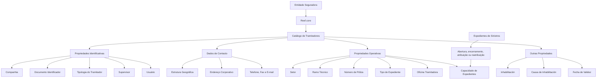

# Definição e Configuração de Tramitadores de Sinistros no Reef.core

## 1. Metadados do Documento
- **Arquivo de Origem:** Não identificado no conteúdo extraído
- **Tipo de Documento:** Especificação Funcional
- **Domínio / Sistema:** Reef.core — módulo de sinistros
- **Público-Alvo:** Analistas funcionais, desenvolvedores, arquitetos, operação e gestão de sinistros
- **Data/Versão Identificada:** Não identificada

---

## 2. Resumo Executivo & Contexto de Negócio

O documento descreve a definição funcional de um **Tramitador de Siniestros** no sistema Reef.core. O Tramitador de Siniestros é a pessoa responsável por gerir expedientes de sinistros, garantindo o cumprimento das políticas e dos procedimentos estabelecidos pela Direção Técnica de Sinistros da entidade seguradora.

O núcleo funcional do Reef.core permite identificar e configurar pessoas físicas ou jurídicas que atuarão como Tramitadores no módulo de sinistros. A configuração abrange propriedades identificativas, dados de contacto, propriedades operativas e propriedades adicionais relacionadas à disponibilidade e inabilitação do Tramitador.

A especialização operacional do Tramitador pode ocorrer por diferentes critérios: setor, ramo técnico, apólice e tipo de expediente. Dessa forma, o sistema pode associar a gestão de determinados sinistros a Tramitadores específicos, conforme regras de segmentação configuradas pela entidade seguradora.

O Reef.core também mantém informações de capacidade operacional, incluindo o número de expedientes pendentes e o número máximo de expedientes atribuídos ao Tramitador. O documento informa que a quantidade de expedientes pendentes é atualizada quando um expediente é aberto, encerrado, atribuído ou reatribuído.

A configuração possui dependências funcionais em relação à definição da entidade, às propriedades de terceiros e às propriedades configuradas na instalação do Reef.core. O documento recomenda a leitura de documentos relacionados sobre Estrutura de Produtos, Supervisores e Usuários da Companhia para evitar interpretações isoladas incorretas.

---

## 3. Arquitetura, Componentes & Tecnologias Envolvidas

### Componentes e conceitos identificados

| Componente / Conceito | Papel descrito no documento |
| :--- | :--- |
| **Reef.core** | Sistema no qual são configurados os Tramitadores de Siniestros e seus valores permitidos. |
| **Módulo de sinistros** | Módulo no qual os Tramitadores atuam na gestão de expedientes e sinistros. |
| **Catálogo de Tramitadores** | Catálogo que contém atributos como tipologia, chave de usuário, estado, capacidade de expedientes e outras propriedades do Tramitador. |
| **Entidade seguradora** | Organização responsável por definir políticas, procedimentos e codificações locais. |
| **Direção Técnica de Sinistros** | Área que define políticas e procedimentos de atuação aplicáveis à gestão de sinistros. |
| **Sistema de terceiros** | Referência funcional para propriedades como código de atividade do terceiro e causa de inabilitação. |
| **Estrutura geográfica** | Estrutura de localização da direção do Tramitador, com níveis de país, estado, província e localidade. |
| **Estrutura comercial** | Estrutura cujo terceiro nível identifica a Oficina Tramitadora de Sinistros. |
| **Planos de Tramitación** | Planos nos quais pode ser utilizada a Fecha de Control, conforme configuração de companhia. |
| **Supervisores** | Entidades relacionadas aos Tramitadores por meio do Código do Supervisor. |
| **Usuários da Companhia** | Entidades relacionadas por meio da Chave de Usuário. |
| **Estrutura de Produtos** | Documento funcional relacionado recomendado para leitura complementar. |

### Organização funcional da configuração



> **Nota de Análise:** O documento descreve a estrutura funcional de configuração do Tramitador, mas não detalha interfaces HTTP, contratos JSON, banco de dados, integrações técnicas, APIs, tecnologias de implementação, URLs, ambientes ou mecanismos de autenticação.

---

## 4. Regras de Negócio, Especificações Funcionais & Processos

### 4.1 Papel do Tramitador de Siniestros

Um Tramitador de Siniestros é a pessoa responsável pela gestão de expedientes de sinistros. A atuação deve observar as políticas e os procedimentos definidos pela Direção Técnica de Sinistros da entidade seguradora.

O Reef.core permite que pessoas físicas ou jurídicas sejam identificadas e configuradas para atuar como Tramitadores no módulo de sinistros.

### 4.2 Propriedades identificativas

1. A propriedade **Compañía** informa o código da companhia para a qual a definição do Tramitador está sendo realizada.
2. O **Tipo Documento Identificador** determina o tipo de documento utilizado para identificar o Tramitador como pessoa física ou jurídica.
3. Os tipos de documento disponíveis dependem de configurações prévias do sistema.
4. A **Clave del Documento Identificador** contém a chave do Tramitador associada ao Tipo de Documento Identificador.
5. O **Código de Actividad del Tercero** representa o código da atividade do terceiro.
6. A **Tipología del Tramitador** deve assumir um dos valores configurados como possíveis no Reef.core.
7. O **Código del Supervisor** identifica o Supervisor do sistema ao qual o Tramitador estará atribuído.
8. O **Código del Tramitador** identifica o Tramitador no sistema.
9. A **Clave de Usuario** contém o código de usuário associado ao Tramitador no catálogo da entidade.

### 4.3 Dados de contacto e localização

1. A localização do Tramitador é estruturada em níveis geográficos:
   - País: primeiro nível.
   - Estado: segundo nível.
   - Província: terceiro nível.
   - Localidade: quarto nível.
2. Os valores geográficos devem existir no catálogo mestre do sistema.
3. O Nome da Localidade contém o nome correspondente ao quarto nível da estrutura geográfica.
4. O Código Postal identifica o código postal associado aos cinco níveis da estrutura geográfica onde está localizada a direção do terceiro.
5. A Extensão Postal contém a extensão do código postal.
6. O Tipo de Domicílio corresponde ao tipo de via associado ao Tramitador segundo a codificação local da entidade seguradora.
7. Domicilio `<1>` e Domicilio `<2>` compõem o endereço corporativo do Tramitador e podem incluir informação complementar de localização.
8. Os campos Número, Portal, Piso, Letra, Escalera e Urbanización/Polígono complementam o endereço do Tramitador quando necessários.
9. O Prefixo Telefónico do País representa o código telefônico internacional do telefone corporativo.
10. O Prefixo Zonal Telefónico representa o código telefônico regional aplicável ao telefone corporativo.
11. Número Telefónico contém o telefone do Tramitador.
12. Extensión Telefónica pode ser informada quando necessária.
13. Número Fax contém o telefone do fax corporativo.
14. Dirección Correo Electrónico contém o endereço de e-mail corporativo do Tramitador.

### 4.4 Especialização operacional

A configuração operacional permite especializar as responsabilidades de gestão de sinistros de um Tramitador.

| Critério de especialização | Regra funcional |
| :--- | :--- |
| **Setor** | Permite especializar a gestão para sinistros de um setor específico. |
| **Setor genérico** | O Reef.core permite o código `9999` na configuração do Tramitador. |
| **Ramo Técnico** | Permite especializar a gestão para sinistros de um ramo técnico específico. |
| **Ramo Técnico genérico** | O Reef.core permite o código `999`; esse código implica que o Tramitador pode gerir expedientes de sinistros de todos os ramos técnicos definidos no sistema. |
| **Número de Póliza** | Permite associar um Tramitador específico a uma apólice que, por características especiais, exige responsabilidade específica sobre seus expedientes e sinistros. |
| **Tipo de Expediente** | Permite especializar a gestão por tipo de expediente, incluindo os exemplos DPM, RC e DAP. |
| **Oficina Tramitadora** | Corresponde ao código do terceiro nível da Estrutura Comercial ao qual o Tramitador está atribuído. |

### 4.5 Gestão de carga de trabalho

1. O **Número de Expedientes Pendientes** representa a quantidade de expedientes pendentes atribuídos a um Tramitador.
2. O sistema atualiza e modifica essa quantidade sempre que um expediente é:
   - aberto;
   - encerrado;
   - atribuído;
   - reatribuído.
3. O **Número Máximo de Expedientes Asignados** define a quantidade máxima de expedientes que um Tramitador pode ter atribuídos em determinado momento.

### 4.6 Comportamentos configuráveis do Reef.core

| Configuração | Comportamento resultante |
| :--- | :--- |
| **Pregunta vs. Descripción ativada** | O Reef.core apresenta a pergunta associada à consequência, em vez da respetiva descrição. |
| **Se permite modificar la Fecha de Control** | O Tramitador pode ou não alterar a Fecha de Control. |
| **Configuração de companhia para Planes de Tramitación** | A permissão para modificar a Fecha de Control pressupõe que, no nível de companhia, os Planes de Tramitación estejam configurados para trabalhar com a Fecha de Control. |

### 4.7 Inabilitação e validade

1. A propriedade **Inhabilitación** informa ao sistema que o Tramitador está desativado.
2. Quando o Tramitador está inabilitado, o **Código de la Causa de Inhabilitación** informa a causa de inabilitação do terceiro no sistema, de acordo com o código de atividade do terceiro.
3. A **Fecha de Validez** define a data a partir da qual a definição do Tramitador fica disponível para utilização no sistema.
4. A configuração correta da Fecha de Validez permite manter histórico das alterações realizadas nas definições dos Tramitadores.
5. O histórico pode ser utilizado posteriormente para rastrear e explorar alterações.

### 4.8 Consideração local obrigatória

A codificação, o uso e a definição dos Tramitadores no sistema devem considerar:

1. As propriedades de terceiros realizadas na definição da entidade.
2. As propriedades configuradas na instalação do Reef.core.

---

## 5. Tabelas de Parâmetros, Ambientes e Estruturas de Dados

### 5.1 Propriedades identificativas

| Item / Parâmetro | Descrição / Função | Tipo / Valores / Formato | Ambiente / Observações |
| :--- | :--- | :--- | :--- |
| Companhia | Indica o código da companhia sobre a qual é feita a definição do Tramitador. | Código de companhia | Aplicável à definição do Tramitador. |
| Tipo Documento Identificador | Tipo de documento que identifica o Tramitador como pessoa física ou jurídica. | Tipo de documento configurado previamente | Depende dos tipos de documentos configurados no sistema. |
| Clave del Documento Identificador | Chave do Tramitador associada ao tipo de documento identificador. | Chave / código | Associada ao Tipo Documento Identificador. |
| Código de Actividad del Tercero | Indica o código da atividade do terceiro. | Código de atividade | Relacionado às propriedades de terceiros. |
| Tipología del Tramitador | Identifica a tipologia do Tramitador. | Um dos valores configurados no Reef.core | O documento não enumera os valores possíveis. |
| Código del Supervisor | Identifica o Supervisor ao qual o Tramitador está atribuído. | Código de Supervisor | Dependência funcional de Supervisores. |
| Código del Tramitador | Identifica o Tramitador no sistema. | Código de Tramitador | Identificador interno do sistema. |
| Clave de Usuario | Contém o código do usuário associado ao Tramitador. | Código de usuário | Relacionado aos Usuários da Companhia. |

### 5.2 Dados geográficos e endereço

| Item / Parâmetro | Descrição / Função | Tipo / Valores / Formato | Ambiente / Observações |
| :--- | :--- | :--- | :--- |
| País | Primeiro nível geográfico da localização da direção do Tramitador. | Código do catálogo mestre | Estrutura geográfica. |
| Estado | Segundo nível geográfico da localização. | Código do catálogo mestre | Estrutura geográfica. |
| Província | Terceiro nível geográfico da localização. | Código do catálogo mestre | Estrutura geográfica. |
| Localidade | Quarto nível geográfico da localização. | Código do catálogo mestre | Estrutura geográfica. |
| Nome da Localidade | Nome correspondente ao quarto nível geográfico. | Texto | Estrutura geográfica. |
| Código Postal | Chave que identifica o código postal associado aos cinco níveis geográficos. | Chave / código postal | Associado à direção do terceiro. |
| Extensão Postal | Extensão do código postal. | Valor de extensão | Atributo referido no catálogo de Supervisores. |
| Tipo de Domicílio | Tipo de via associado ao Tramitador. | Código conforme codificação local | Definido pela entidade seguradora conforme callejero local. |
| Domicilio `<1>` | Parte do endereço corporativo do Tramitador. | Texto | Permite informação complementar de localização. |
| Domicilio `<2>` | Complemento do endereço corporativo do Tramitador. | Texto | Utilizado conjuntamente com Domicilio `<1>`. |
| Número | Número da via do endereço do Tramitador. | Número | Associado ao Tipo de Domicílio. |
| Portal | Número do portal do endereço, quando necessário. | Número / texto | Opcional conforme necessidade. |
| Piso | Número do piso ou planta, quando necessário. | Número / texto | Opcional conforme necessidade. |
| Letra | Letra do endereço, quando necessária. | Texto | Opcional conforme necessidade. |
| Escalera | Escada que identifica o endereço, quando necessária. | Texto / código | Opcional conforme necessidade. |
| Urbanización/Polígono | Urbanização, desenvolvimento urbano, polígono ou equivalente. | Texto | Opcional conforme necessidade. |

### 5.3 Exemplos de Tipo de Domicílio

| Código | Tipo de Via | Descrição |
| :--- | :--- | :--- |
| 001 | Calle | Calle |
| 002 | Avenida | Avenida |
| 003 | Plaza | Plaza |
| 004 | Carretera | Carretera |
| 005 | Eje Vial | Eje Vial |
| ... | ... | ... |

### 5.4 Dados de comunicação

| Item / Parâmetro | Descrição / Função | Tipo / Valores / Formato | Ambiente / Observações |
| :--- | :--- | :--- | :--- |
| Prefijo Telefónico del País | Prefixo internacional do telefone corporativo. | Prefixo telefônico internacional | Exemplos: Espanha `+34`, México `+52`, Argentina `+54`. |
| Prefijo Zonal Telefónico | Prefixo regional aplicável ao telefone corporativo. | Prefixo / código regional | Exemplos: Madrid `91`, Barcelona `93`, Monterrey `81`, Ciudad de México `55`. |
| Número Telefónico | Número de telefone do Tramitador. | Número telefônico | Telefone corporativo. |
| Extensión Telefónica | Extensão do telefone corporativo. | Número / código de extensão | Informada quando necessária. |
| Número Fax | Número telefônico do fax corporativo. | Número telefônico | Fax corporativo. |
| Dirección Correo Electrónico | E-mail corporativo do Tramitador. | Endereço de e-mail | E-mail corporativo. |

### 5.5 Propriedades operativas

| Item / Parâmetro | Descrição / Função | Tipo / Valores / Formato | Ambiente / Observações |
| :--- | :--- | :--- | :--- |
| Setor | Especializa a gestão do Tramitador para sinistros de um setor específico. | Chave de setor | Pode utilizar o setor genérico `9999`. |
| Ramo Técnico | Especializa a gestão para sinistros de um ramo técnico específico. | Chave de ramo técnico | Pode utilizar o ramo técnico genérico `999`. |
| Número de Póliza | Identifica uma apólice atribuída a um Tramitador específico. | Chave de apólice | Aplicável quando características especiais exigem responsável específico. |
| Tipo de Expediente | Especializa a gestão por tipo de expediente. | Chave de tipo de expediente | Exemplos: DPM, RC e DAP. |
| Oficina Tramitadora | Código do terceiro nível da Estrutura Comercial do Tramitador. | Código organizacional | Identifica a Oficina Tramitadora de Siniestros. |
| Estado | Estado do Tramitador na data de consulta. | Um dos valores configurados no Reef.core | O documento não enumera os estados possíveis. |
| Número de Expedientes Pendientes | Quantidade de expedientes pendentes atribuídos ao Tramitador. | Número | Atualizado em eventos do ciclo de vida do expediente. |
| Número Máximo de Expedientes Asignados | Limite máximo de expedientes atribuídos ao Tramitador. | Número | Aplicável a determinado momento temporal. |
| Pregunta vs. Descripción | Determina se a pergunta associada à consequência é exibida no lugar da descrição. | Indicador de ativação | Afeta o comportamento do Reef.core. |
| Se permite modificar la Fecha de Control | Define se o Tramitador pode alterar a Fecha de Control. | Indicador de permissão | Requer configuração de companhia nos Planes de Tramitación. |

### 5.6 Outras propriedades

| Item / Parâmetro | Descrição / Função | Tipo / Valores / Formato | Ambiente / Observações |
| :--- | :--- | :--- | :--- |
| Inhabilitación | Indica que o Tramitador está desativado. | Indicador de inabilitação | Afeta a disponibilidade operacional do Tramitador. |
| Código de la Causa de Inhabilitación | Identifica a causa de inabilitação do terceiro. | Código de causa | Aplicável quando o Tramitador está inabilitado e relacionado ao código de atividade do terceiro. |
| Fecha de Validez | Define a partir de quando a definição do Tramitador está disponível. | Data | Permite histórico, rastreabilidade e exploração de alterações. |

### 5.7 Ambientes, URLs, servidores e logs

| Item / Parâmetro | Descrição / Função | Tipo / Valores / Formato | Ambiente / Observações |
| :--- | :--- | :--- | :--- |
| Ambientes técnicos | Não detalhados no documento. | Não aplicável | Não foram identificados URLs, servidores ou nomes de ambientes. |
| Rotas de logs | Não detalhadas no documento. | Não aplicável | Não foram identificados caminhos ou variáveis de log. |
| APIs e contratos | Não detalhados no documento. | Não aplicável | Não foram identificados métodos HTTP, endpoints ou contratos JSON. |

---

## 6. Bateria de Perguntas & Respostas para RAG (FAQ Sintético)

### P1: Qual é a responsabilidade de um Tramitador de Siniestros no Reef.core?
**R:** Um Tramitador de Siniestros é a pessoa responsável por gerir os expedientes de sinistros, assegurando o cumprimento das políticas e dos procedimentos definidos pela Direção Técnica de Sinistros da entidade seguradora. O Reef.core permite configurar pessoas físicas ou jurídicas para exercer essa função no módulo de sinistros.

### P2: Como o Reef.core identifica um Tramitador como pessoa física ou jurídica?
**R:** O Reef.core utiliza o Tipo Documento Identificador e a Clave del Documento Identificador. O tipo de documento deve corresponder a um dos tipos previamente configurados no sistema, enquanto a chave contém o identificador do Tramitador associado ao tipo de documento escolhido.

### P3: Quais informações vinculam um Tramitador a um Supervisor e a um usuário?
**R:** O Código del Supervisor identifica o Supervisor do sistema ao qual o Tramitador está atribuído. A Clave de Usuario contém o código do usuário associado ao Tramitador no catálogo de Tramitadores da entidade.

### P4: Quais níveis geográficos podem ser configurados para a direção de um Tramitador?
**R:** A direção do Tramitador pode incluir País, Estado, Província e Localidade, correspondentes, respetivamente, ao primeiro, segundo, terceiro e quarto níveis da estrutura geográfica. Esses códigos devem existir no catálogo mestre do sistema. O documento também prevê o Nome da Localidade e o Código Postal associado aos cinco níveis geográficos.

### P5: Qual é a finalidade do setor genérico com código 9999?
**R:** O Reef.core permite utilizar o código de setor genérico `9999` na configuração do Tramitador. O documento informa que o setor permite especializar as tarefas de gestão para sinistros de um setor concreto, mas não detalha explicitamente o comportamento operacional do código genérico além de sua permissão de uso.

### P6: O que significa configurar o Ramo Técnico genérico com código 999?
**R:** O código `999` corresponde ao Ramo Técnico genérico. Quando esse código é utilizado na configuração do Tramitador, o Tramitador pode gerir expedientes de sinistros de todos os ramos técnicos definidos no sistema.

### P7: Como o número de expedientes pendentes é atualizado?
**R:** O Número de Expedientes Pendientes é atualizado e modificado cada vez que um expediente é aberto, encerrado, atribuído ou reatribuído. Esse campo representa a quantidade de expedientes pendentes atribuídos a um Tramitador.

### P8: Para que serve o Número Máximo de Expedientes Asignados?
**R:** O Número Máximo de Expedientes Asignados identifica a quantidade máxima de expedientes que um Tramitador pode ter atribuídos em um determinado momento temporal. O documento não descreve a regra técnica utilizada pelo Reef.core para impedir ou tratar atribuições acima desse limite.

### P9: O que acontece quando a propriedade Pregunta vs. Descripción está ativada?
**R:** Quando a propriedade Pregunta vs. Descripción está ativada na configuração do Tramitador, o comportamento do Reef.core muda para mostrar a pergunta associada à consequência em vez de mostrar a descrição da consequência.

### P10: Em quais condições um Tramitador pode modificar a Fecha de Control?
**R:** A modificação da Fecha de Control depende de uma configuração que permite ou não ao Tramitador realizar essa alteração. Além disso, no nível de companhia, os Planes de Tramitación devem estar configurados para trabalhar com a Fecha de Control.

### P11: Como um Tramitador é marcado como desativado?
**R:** Um Tramitador é marcado como desativado por meio da propriedade Inhabilitación. Quando o Tramitador está inabilitado, o Código de la Causa de Inhabilitación pode indicar a causa da inabilitação do terceiro no sistema, considerando o código de atividade do terceiro.

### P12: Qual é a finalidade da Fecha de Validez na definição do Tramitador?
**R:** A Fecha de Validez determina a partir de qual data a definição do Tramitador fica disponível no sistema. Uma configuração adequada permite manter um histórico das alterações efetuadas nas definições, possibilitando rastrear e explorar posteriormente essas informações.

### P13: Quais documentos relacionados devem ser consultados para interpretar corretamente a configuração de Tramitadores?
**R:** O documento recomenda consultar os materiais relacionados a Estrutura de Produtos, Supervisores e Usuários da Companhia. Essa leitura é recomendada para evitar que uma interpretação isolada da definição de Tramitadores conduza a erros.

---

## 7. Glossário de Termos, Siglas & Conceitos-Chave

- **Catálogo de Tramitadores:** Catálogo do sistema que contém informações configuráveis dos Tramitadores, como tipologia, usuário, estado e capacidade de expedientes.
- **Código de Actividad del Tercero:** Código que identifica a atividade do terceiro.
- **Código del Supervisor:** Código que identifica o Supervisor ao qual o Tramitador está atribuído.
- **DPM:** Daños Materiales Propios; exemplo de tipo de expediente citado no documento.
- **Direção Técnica de Sinistros:** Área da entidade seguradora responsável por definir políticas e procedimentos de atuação para sinistros.
- **Fecha de Control:** Data cujo comportamento pode ser modificado pelo Tramitador quando a configuração aplicável permitir.
- **Fecha de Validez:** Data a partir da qual uma definição de Tramitador fica disponível para utilização no sistema.
- **Inhabilitación:** Propriedade que informa ao sistema que o Tramitador está desativado.
- **Oficina Tramitadora:** Unidade identificada pelo terceiro nível da Estrutura Comercial à qual o Tramitador está atribuído.
- **Planes de Tramitación:** Planos cuja configuração em nível de companhia pode prever o uso da Fecha de Control.
- **RC:** Responsabilidad Civil; exemplo de tipo de expediente citado no documento.
- **Reef.core:** Sistema mencionado como responsável pela configuração de Tramitadores e pelos valores possíveis de determinados atributos.
- **Ramo Técnico:** Critério utilizado para especializar a gestão do Tramitador em sinistros de determinado ramo.
- **Setor:** Critério utilizado para especializar a gestão do Tramitador em sinistros de determinado setor.
- **Tramitador de Siniestros:** Pessoa responsável por gerir expedientes de sinistros conforme políticas e procedimentos da entidade seguradora.

> **Nota de Análise:** A sigla **DAP** é apresentada no documento como exemplo de tipo de expediente, mas não recebe expansão textual no conteúdo fornecido.

---

## 8. Notas Críticas, Riscos & Limitações

1. O documento não informa tecnologias de implementação, arquitetura de infraestrutura, banco de dados, interfaces, APIs, endpoints, protocolos ou mecanismos de autenticação.
2. O documento não descreve fluxos técnicos de atribuição automática, reatribuição ou bloqueio de expedientes quando o número máximo de expedientes atribuídos é atingido.
3. A Tipología del Tramitador, o Estado do Tramitador e outros valores configuráveis são mencionados, mas os respetivos domínios de valores não são apresentados.
4. O código de setor genérico `9999` é permitido pelo Reef.core, mas o documento não detalha todas as implicações funcionais desse uso.
5. A utilização do Ramo Técnico genérico `999` é explicitamente detalhada: permite gerir sinistros de todos os ramos técnicos definidos no sistema.
6. A alteração da Fecha de Control depende de duas condições: permissão configurada para o Tramitador e configuração, no nível de companhia, dos Planes de Tramitación para trabalhar com essa data.
7. A interpretação local da configuração depende de propriedades de terceiros definidas na entidade e de propriedades configuradas na instalação do Reef.core.
8. O documento recomenda a leitura de Estrutura de Produtos, Supervisores e Usuários da Companhia; portanto, a configuração de Tramitadores não deve ser analisada isoladamente.
9. Não foram identificadas informações sobre ambientes, servidores, URLs, rotas de logs, portas, versionamento técnico ou processos de implantação.

---

## 9. Conteúdo Bruto Estruturado (Referência Fiel)

```text
--- [PÁGINA 1 DE 5] ---

DEFINIR Información del TRAMITADOR de SINIESTROS
Contexto
Un Tramitador de Siniestros es aquella persona responsable de gestionar los expedientes de los siniestros velando por el cumplimiento de
las Políticas y Procedimientos de actuación denidos por la Dirección Técnica de Siniestros de la Entidad Aseguradora.
Objetivo
Funcionalmente, el núcleo del Sistema cuenta con la posibilidad de identicar y congurar la información de aquellas personas físicas o
jurídicas que van a actuar como Tramitadores en el módulo de siniestros.
Propiedades Identicativas
Datos de Contacto
Propiedades Operativas
Otras Propiedades
Propiedades Identicativas
Compañía
Esta propiedad le indica al sistema el código de la compañía sobre la que se está realizando la denición del Tramitador.
Tipo Documento Identicador
Este Atributo del colapsador contiene el tipo de documento con el que se va a identicar al Tramitador como persona física o jurídica y de
acuerdo con los tipos de documentos que hayan sido congurados en el sistema previamente.
Clave del Documento Identicador
Este Atributo del catálogo contendrá la clave del Tramitador asociado al Tipo de Documento Identicador.
Código de Actividad del Tercero
Esta propiedad indicará el código de la Actividad del Tercero.
Tipología del Tramitador
Esta propiedad del Catálogo de Tramitadores muestra la Tipología del mismo, tipología que tiene que tener uno de los posibles valores
congurados para Reef.core.
Código del Supervisor
Documentation / DOCUMENTACIÓN Reef
DOCUMENTACIÓN Reef
Mapfredocument
DOCUMENTACIÓN Reef
Owner
user:agonzalez_mapfre.com
Lifecycle
Approved Source
 / 
 VL
Buscar Inicio Soluciones Arquitecturas APIs Componentes Cloud Documentación Zeus Reef Ayuda
ES


--- [PÁGINA 2 DE 5] ---

Este dato identica el código del Supervisor en el Sistema al que estará asignado el Tramitador.
Código del Tramitador
Este dato identica el código del Tramitador en el Sistema.
Clave de Usuario
Este Atributo del catálogo de Tramitadores de la Entidad contiene el código del Usuario.
Datos de Contacto
Pais
Este Campo contiene el código del primer nivel de la estructura Geográca en la que se encuentra ubicada la Dirección del Tramitador de
acuerdo con la relación de posibles valores existentes en el catálogo maestro existente en el Sistema.
Estado
Este Campo contiene el código del segundo nivel de la estructura Geográca en la que se encuentra ubicada la Dirección del Tramitador de
acuerdo con la relación de posibles valores existentes en el catálogo maestro existente en el Sistema.
Provincia
Este Campo contiene el código del tercer nivel de la estructura Geográca en la que se encuentra ubicada la Dirección del Tramitador de
acuerdo con la relación de posibles valores existentes en el catálogo maestro existente en el Sistema.
Localidad
Este Campo contiene el código del cuarto nivel de la estructura Geográca en la que se encuentra ubicada la Dirección del Tramitador de
acuerdo con la relación de posibles valores existentes en el catálogo maestro existente en el Sistema.
Nombre de la Localidad
Este Campo contiene el nombre del cuarto nivel de la estructura geográca.
Código Postal
Esta Propiedad contiene la clave que identica el Código Postal asociado a los cinco niveles de la estructura geográca en la que está
ubicada la Dirección del Tercero.
Extensión Postal
Este atributo del catálogo de Supervisores contiene la extensión del Código Postal.
Tipo de Domicilio
De acuerdo con el callejero local, este dato contendrá el Tipo de Vía que se va a asociar al Tramitador de acuerdo con la codicación
efectuada localmente por parte de la entidad aseguradora.
A modo de ejemplo sus valores podrían ser:
Código TIPO VIA DESCRIPCIÓN
001 Calle
002 Avenida
003 Plaza
004 Carretera


--- [PÁGINA 3 DE 5] ---

Código TIPO VIA DESCRIPCIÓN
005 Eje Vial
... ...
Domicilio <1>
Este Atributo contiene el domicilio Corporativo del Tramitador de acuerdo con la ubicación geográca y la tipología del domicilio además de
permitir la captura de información complementaria que facilite su ubicación.
Domicilio <2>
Este Atributo, conjuntamente con el atributo anterior, contiene el domicilio Corporativo del Tramitador de acuerdo con la ubicación geográca
y la tipología del domicilio además de permitir la captura de información complementaria que facilite su ubicación.
Número
Este Atributo contiene el número del tipo de vía del Domicilio del Tramitador.
Portal
Este Atributo contiene, de ser necesario, el número del Portal del Domicilio del Tramitador.
Piso
Este Atributo contiene, de ser necesario, el número del Piso/Planta del Domicilio del Tramitador.
Letra
Este Atributo contiene, de plantearse la necesidad, la Letra del del Domicilio del Tramitador.
Escalera
Este Atributo contiene, caso de ser necesario, la Escalera que identica el Domicilio del Tramitador.
Urbanización/Polígono
Este Atributo en caso de ser necesario contendrá la Urbanización, Desarrollo Urbano, Polígono, ... que identica el Domicilio del Tramitador.
Prejo Telefónico del País
Este atributo contiene el Prejo del País Telefónico correspondiente al número telefónico Corporativo del Tramitador.
A modo de ejemplo, en España el prejo es +34, en México +52 y en Argentina +54.
Prejo Zonal Telefónico
Este atributo contiene el Prejo Zonal Telefónico que corresponde al número telefónico Corporativo del Tramitador.
A modo de ejemplo,
En España el prejo zonal de Madrid es el 91, el de Barcelona 93, ...
En México la Clave Lada local que corresponde a Monterrey, Nuevo León es 81, la de Ciudad de México es 55,...
Número Telefónico
Este Campo contiene el número telefónico del Tramitador.
Extensión Telefónica
Caso de ser necesario, este atributo contendrá la Extensión Telefónica correspondiente al Teléfono Corporativo del Tramitador.
Número Fax


--- [PÁGINA 4 DE 5] ---

Este atributo contiene el Número Telefónico del Fax Corporativo del Tramitador.
Dirección Correo Electrónico
Este atributo contiene la dirección de correo electrónico corporativo del Tramitador.
Propiedades Operativas
Sector
Esta propiedad identica la clave del Sector que se está congurando en el Sistema y que permite 'especializar' las labores de Gestión del
Tramitador para que se ocupe de los siniestros de un Sector en concreto.
NOTA: Reef.core permite el uso del sector genérico (código 9999) en la conguración del Tramitador.
Ramo Técnico
Esta propiedad identica la clave del Ramo Técnico y que permite 'especializar' las labores de Gestión del Tramitador para que se ocupe de
los siniestros de un Ramo Técnico en particular.
NOTA: Reef.core permite el uso del Ramo Técnico genérico (código 999) en la conguración del Tramitador, lo que implica que el Tramitador
puede gestionar los expedientes de los Siniestros de todos los Ramos Técnicos denidos en el Sistema.
Número de Póliza
Esta propiedad identica la clave de una Póliza en la que por sus especiales características se haya determinado que un Tramitador
especíco ha de ser la persona que se responsabilice de sus expedientes y siniestros.
Tipo de Expediente
Esta propiedad identica la clave de un 'tipo de expediente' determinado (DPM - Daños Materiales Propios,RC - Responsabilidad Civil, DAP -
Lesionados,...) que permite especializar la gestión del Tramitador.
Ocina Tramitadora
Este atributo contiene el código del tercer nivel de la Estructura Comercial al que estará asignado el Tramitador en el Sistema y que la
identica como Ocina Tramitadora de Siniestros.
Estado
Esta propiedad del Catálogo de Tramitadores muestra el estado en el que se encuentra el Tramitador a la fecha de Consulta del mismo,
estado que tiene que tener uno de los posibles valores congurados en Reef.core.
Número de Expedientes Pendientes
Este Atributo contiene el número de expedientes pendientes que tiene asignado un Tramitador, sabiendo que cada vez que se abre, se
termina, se asigna o se reasigna un expediente, se actualiza y modica su contenido.
Número Máximo de Expedientes Asignados
Esta Propiedad del Catálogo identica el número máximo de expedientes asignados que puede tener un tramitador en un momento temporal
determinado.
Pregunta vs. Descripción
Si esta propiedad está activada en la conguración de la información del Tramitador el comportamiento de Reef.core varía haciendo que se
muestre la pregunta asociada a la consecuencia en vez de su descripción.
Se permite modicar la Fecha de Control
Este campo modula el comportamiento de Reef.core permitiendo que el Tramitador pueda o no modicar la Fecha de Control (siempre y
cuando se haya indicado a nivel de compañía que en los Planes de Tramitación se vaya a trabajar con la Fecha de Control).
Otras Propiedades


--- [PÁGINA 5 DE 5] ---

Inhabilitación
Esta propiedad le indica al Sistema que el Tramitador se encuentra desactivado.
Código de la Causa de Inhabilitación
Si el Tramitador está inhabilitado, este Atributo indicará de acuerdo con el código de actividad del Tercero, el código de la Causa de la
Inhabilitación del Tercero en el sistema.
Fecha de Validez
Esta propiedad establece la fecha a partir de la cual la denición del Tramitador está disponible en el sistema para ser utilizado, por lo que
una correcta conguración habilita tener un histórico de los cambios efectuados en sus deniciones y poder así trazar y explotar
posteriormente esta información.
Vínculos
Relación de Directrices y Documentos funcionales cuya lectura recomendada para evitar que la interpretación aislada del presente
documento pueda conducir a error.
Estructura de Productos
Supervisores
Usuarios de la Compañía
Preguntas frecuentes
(1) ¿Existe alguna particularidad operativa que deba ser tomada en consideración localmente en la codicación, uso y denición de los
Tramitadores en el Sistema?
Se debe considerar tanto las Propiedades de Terceros realizadas en la denición de la Entidad, como aquellas Propiedades conguradas en
la Instalación de Reef.core.
```
