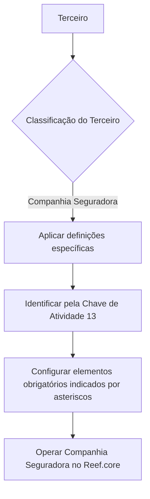

# Definição das Companhias Seguradoras no Reef.core

## 1. Metadados do Documento
- **Arquivo de Origem:** Não identificado
- **Tipo de Documento:** Documentação funcional / procedimento de configuração
- **Domínio / Sistema:** Reef.core; Mapfre
- **Público-Alvo:** Usuários funcionais, operação e equipes responsáveis pela configuração de terceiros
- **Data/Versão Identificada:** Não identificada

---

## 2. Resumo Executivo & Contexto de Negócio

O documento descreve a definição e a configuração de Companhias Seguradoras no sistema Reef.core. O objetivo é relacionar os elementos necessários para que as Companhias Seguradoras possam ser configuradas e posteriormente utilizadas para operação no sistema.

No Reef.core, uma Companhia Seguradora é identificada pela **Chave de Atividade 13**. Essa chave é o critério explicitamente informado para a identificação desse tipo de terceiro no sistema.

A documentação também indica que determinados elementos de configuração são específicos para terceiros classificados como **COMPAÑÍA ASEGURADORA**. Esses elementos pertencem a um grupo de definições exclusivo para essa categoria de terceiro.

Os asteriscos exibidos nos cartões de configuração representam a obrigatoriedade de cada elemento no contexto da definição de Companhias Seguradoras. O texto não detalha quais cartões, campos ou valores possuem asterisco.

> **Nota de Análise:** O conteúdo fornecido não apresenta telas, campos, regras de preenchimento, fluxos operacionais detalhados, APIs, integrações ou contratos técnicos adicionais.

---

## 3. Arquitetura, Componentes & Tecnologias Envolvidas

Os componentes e termos identificados no conteúdo são:

- **Reef.core:** Sistema no qual as Companhias Seguradoras são configuradas e posteriormente operadas.
- **Companhias Seguradoras / COMPAÑÍAS ASEGURADORAS:** Categoria de terceiro com definições específicas no Reef.core.
- **Chave de Atividade 13:** Identificador utilizado pelo Reef.core para reconhecer Companhias Seguradoras.
- **Documentación Reef / DOCUMENTACIÓN Reef:** Área ou repositório de documentação citado no conteúdo.
- **Mapfredocument:** Termo exibido na área documental; o conteúdo não detalha sua função.
- **Owner:** `user:agonzalez_mapfre.com`
- **Lifecycle:** `Approved`
- **Source:** `VL`
- **Navegação documental:** Buscar, Inicio, Soluciones, Arquitecturas, APIs, Componentes, Cloud, Documentación, Zeus, Reef e Ayuda.



> **Nota de Análise:** O diagrama representa exclusivamente a sequência conceitual declarada no texto. O documento não informa interfaces, bancos de dados, serviços, protocolos, métodos HTTP, ambientes ou mecanismos de integração.

---

## 4. Regras de Negócio, Especificações Funcionais & Processos

1. O Reef.core possui elementos de configuração destinados a permitir a operação posterior de Companhias Seguradoras no sistema.
2. O Reef.core identifica Companhias Seguradoras por meio da **Chave de Atividade 13**.
3. Existem definições específicas utilizadas exclusivamente quando o terceiro é uma **COMPAÑÍA ASEGURADORA**.
4. Os elementos específicos estão agrupados em um conjunto de definições próprias de terceiros classificados como Companhias Seguradoras.
5. A presença de asteriscos nos cartões indica que o elemento correspondente é obrigatório para a configuração relacionada à definição de Companhias Seguradoras.
6. O conteúdo não informa:
   - Quais são os cartões de configuração.
   - Quais campos são obrigatórios.
   - Quais valores devem ser preenchidos.
   - Qual sequência de telas ou etapas deve ser seguida.
   - Quais validações ocorrem ao salvar ou ativar uma Companhia Seguradora.
   - Quais efeitos operacionais ocorrem após a configuração.

---

## 5. Tabelas de Parâmetros, Ambientes e Estruturas de Dados

| Item / Parâmetro | Descrição / Função | Tipo / Valores / Formato | Ambiente / Observações |
| :--- | :--- | :--- | :--- |
| Companhia Seguradora | Categoria de terceiro configurada para posterior operação no Reef.core. | Terceiro / entidade de negócio | O documento utiliza os termos “Compañías Aseguradoras” e “COMPAÑÍA ASEGURADORA”. |
| Reef.core | Sistema que permite configurar e operar Companhias Seguradoras. | Sistema corporativo | Não há versão ou ambiente identificados. |
| Chave de Atividade | Critério de identificação de Companhias Seguradoras no Reef.core. | Valor numérico | `13` |
| Definições específicas | Conjunto de definições empregado exclusivamente para terceiros do tipo Companhia Seguradora. | Grupo de configuração | Os campos e regras internas não foram detalhados. |
| Asteriscos nos cartões | Indicam obrigatoriedade de elementos de configuração. | Indicador visual | O documento não identifica os cartões nem os elementos marcados. |
| Lifecycle | Estado do item documental exibido. | Texto | `Approved` |
| Source | Origem do item documental exibido. | Texto | `VL` |
| Owner | Proprietário exibido no registro documental. | Identificador de usuário | `user:agonzalez_mapfre.com` |
| Mapfredocument | Termo apresentado na área de documentação. | Não detalhado | A função não foi explicada no conteúdo. |
| Idioma da interface | Idioma exibido na navegação documental. | Código de idioma | `ES` |

---

## 6. Bateria de Perguntas & Respostas para RAG (FAQ Sintético)

### P1: Qual sistema é responsável pela configuração das Companhias Seguradoras?
**R:** O sistema responsável pela configuração e posterior operação das Companhias Seguradoras é o **Reef.core**.

### P2: Como o Reef.core identifica uma Companhia Seguradora?
**R:** O Reef.core identifica as Companhias Seguradoras pela **Chave de Atividade 13**.

### P3: Qual é o valor da Chave de Atividade para Companhias Seguradoras no Reef.core?
**R:** O valor informado para identificação de Companhias Seguradoras no Reef.core é **13**.

### P4: Existem definições exclusivas para terceiros classificados como Companhia Seguradora?
**R:** Sim. O documento informa que existe um grupo de definições específicas usado exclusivamente quando o terceiro é uma **COMPAÑÍA ASEGURADORA**.

### P5: O que significam os asteriscos nos cartões de configuração?
**R:** Os asteriscos indicam a obrigatoriedade do elemento de configuração em relação à definição das Companhias Seguradoras.

### P6: O documento informa quais campos são obrigatórios na configuração de uma Companhia Seguradora?
**R:** Não. O conteúdo explica que os asteriscos indicam obrigatoriedade, mas não lista os cartões, os campos ou os valores obrigatórios.

### P7: O documento detalha APIs, métodos HTTP ou contratos JSON do Reef.core?
**R:** Não. O conteúdo fornecido não apresenta APIs, métodos HTTP, contratos JSON, integrações ou detalhes técnicos de comunicação.

### P8: Qual é o objetivo dos elementos de configuração relacionados às Companhias Seguradoras?
**R:** Os elementos permitem configurar Companhias Seguradoras no Reef.core para que essas entidades possam ser operadas posteriormente no sistema.

### P9: O documento informa ambientes, URLs, servidores ou portas do Reef.core?
**R:** Não. Não foram identificados ambientes técnicos, URLs, nomes de servidores, portas ou parâmetros de infraestrutura no conteúdo.

### P10: Qual é o estado de ciclo de vida exibido para a documentação?
**R:** O estado de ciclo de vida exibido é **Approved**.

---

## 7. Glossário de Termos, Siglas & Conceitos-Chave

- **Reef.core:** Sistema mencionado como responsável pela configuração e operação posterior de Companhias Seguradoras.
- **Companhias Seguradoras / Compañías Aseguradoras:** Categoria de terceiro tratada pelo documento.
- **COMPAÑÍA ASEGURADORA:** Designação em espanhol para um terceiro classificado como Companhia Seguradora.
- **Chave de Atividade 13:** Identificador utilizado pelo Reef.core para reconhecer Companhias Seguradoras.
- **Terceiro:** Entidade para a qual podem existir definições específicas no Reef.core; no trecho fornecido, Companhias Seguradoras são um tipo de terceiro.
- **Cartões:** Elementos de interface ou configuração citados no documento. Não há detalhamento adicional.
- **Lifecycle:** Campo documental que apresenta o estado de ciclo de vida como `Approved`.
- **Source:** Campo documental apresentado com o valor `VL`.
- **Owner:** Campo que identifica o proprietário do item documental como `user:agonzalez_mapfre.com`.
- **Mapfredocument:** Termo apresentado no conteúdo sem definição explícita.

---

## 8. Notas Críticas, Riscos & Limitações

- O documento não identifica o arquivo de origem, a data, a versão ou o autor funcional do conteúdo.
- O texto menciona cartões e elementos obrigatórios, mas não fornece nomes de campos, telas, regras de preenchimento ou critérios de validação.
- Não há informações sobre APIs, integrações, persistência de dados, permissões, logs, erros ou procedimentos de suporte.
- Não há informações sobre ambientes de desenvolvimento, homologação ou produção.
- Há caracteres possivelmente corrompidos na extração, como em `congurar`, `identica` e `denición`. A interpretação adotada foi baseada no contexto textual, sem alteração do conteúdo bruto de referência.
- **Nota de Análise:** O termo `Mapfredocument` é exibido, mas sua responsabilidade funcional, técnica ou documental não é detalhada.

---

## 9. Conteúdo Bruto Estruturado (Referência Fiel)

```text
--- [PÁGINA 1 DE 1] ---

DEFINICIÓN de las Compañías ASEGURADORAS
Se relacionan los elementos que permiten congurar en Reef.core a las Compañías Aseguradoras para poder operar posteriormente con ellas
en el Sistema.
Reef.core identica a las Compañías Aseguradoras con la Clave de Actividad... 13.
Los Asteriscos de las Tarjetas indican la obligatoriedad en la conguración del elemento en relación con la denición de las Compañías
Aseguradoras.
Deniciones ESPECÍFICAS, propias de los Terceros COMPAÑÍAS
ASEGURADORAS
En este Grupo se encuentran deniciones que se emplean exclusivamente cuando el Tercero es una
COMPAÑÍA ASEGURADORA.
Documentation / DOCUMENTACIÓN Reef
DOCUMENTACIÓN Reef
Mapfredocument
DOCUMENTACIÓN Reef
Owner
user:agonzalez_mapfre.com
Lifecycle
Approved Source
 / 
 VL
Buscar Inicio Soluciones Arquitecturas APIs Componentes Cloud Documentación Zeus Reef Ayuda
ES
```
