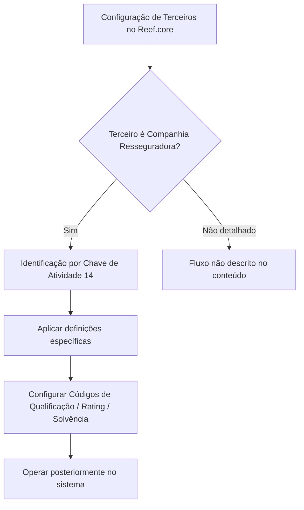

# Definição e Configuração de Companhias Resseguradoras no Reef.core

## 1. Metadados do Documento
- **Arquivo de Origem:** Não identificado
- **Tipo de Documento:** Manual Operacional
- **Domínio / Sistema:** Reef.core / Documentação Reef / Mapfre
- **Público-Alvo:** Operação, Analistas Funcionais, Administradores de Configuração
- **Data/Versão Identificada:** Não identificada

---

## 2. Resumo Executivo & Contexto de Negócio

O documento descreve a definição de **Companhias Resseguradoras** no sistema **Reef.core**. O objetivo é relacionar os elementos necessários para configurar entidades classificadas como companhias resseguradoras, permitindo que sejam posteriormente utilizadas nas operações do sistema.

No Reef.core, as companhias resseguradoras são identificadas pela **Chave de Atividade 14**. Essa classificação constitui um critério explícito para diferenciar esse tipo de terceiro dentro da configuração corporativa apresentada.

O conteúdo indica que existem definições específicas aplicáveis exclusivamente quando o terceiro configurado é uma companhia resseguradora. Entre essas definições, está a configuração de códigos de qualificação, também denominados códigos de rating ou solvência.

A documentação também informa que a obrigatoriedade de determinados elementos de configuração é indicada por asteriscos nos cartões correspondentes. Contudo, o trecho fornecido não detalha quais cartões, campos ou elementos possuem obrigatoriedade, nem os valores aceitos para os códigos de rating.

A fonte aparenta estar publicada no portal **DOCUMENTACIÓN Reef**, associada a **Mapfredocument**, com estado de ciclo de vida indicado como **Approved Source**. Não há detalhamento de métodos operacionais, telas, contratos, integrações ou regras de validação além das referências textuais apresentadas.

---

## 3. Arquitetura, Componentes & Tecnologias Envolvidas

| Componente / Termo | Papel identificado no conteúdo |
| :--- | :--- |
| Reef.core | Sistema no qual as companhias resseguradoras são configuradas e posteriormente operadas. |
| Companhias Resseguradoras | Tipo de terceiro com definições específicas no Reef.core. |
| Chave de Atividade 14 | Identificador utilizado pelo Reef.core para reconhecer companhias resseguradoras. |
| Códigos de Qualificação (Rating) | Configuração de códigos de qualificação ou solvência atribuídos às companhias resseguradoras. |
| DOCUMENTACIÓN Reef | Portal ou seção documental mencionada como fonte da documentação. |
| Mapfredocument | Termo apresentado na navegação/documentação. |
| Zeus | Item listado na navegação do portal; o trecho não explica sua relação funcional com Reef.core. |



**Nota de Análise:** O conteúdo não detalha arquitetura de software, APIs, bancos de dados, microsserviços, protocolos, ambientes técnicos ou integrações. O diagrama representa exclusivamente a relação funcional explicitamente descrita.

---

## 4. Regras de Negócio, Especificações Funcionais & Processos

1. O Reef.core permite configurar elementos relacionados a companhias resseguradoras para viabilizar sua operação posterior no sistema.
2. O Reef.core identifica uma companhia resseguradora por meio da **Chave de Atividade 14**.
3. Existem definições específicas destinadas exclusivamente a terceiros classificados como **COMPANHIA RESSEGURADORA**.
4. A configuração dos **Códigos de Qualificação (Rating)** corresponde à configuração dos códigos de qualificação ou solvência atribuídos às companhias resseguradoras.
5. Asteriscos exibidos nos cartões de configuração indicam a obrigatoriedade de um elemento em relação à definição de companhias resseguradoras.
6. O trecho não informa:
   - A lista de cartões ou campos obrigatórios.
   - Os critérios de preenchimento dos campos.
   - O catálogo de códigos de rating ou solvência.
   - Regras de validação, aprovação, bloqueio ou rejeição.
   - Fluxos de manutenção, consulta ou exclusão de companhias resseguradoras.
   - Perfis ou permissões necessárias para realizar a configuração.

---

## 5. Tabelas de Parâmetros, Ambientes e Estruturas de Dados

| Item / Parâmetro | Descrição / Função | Tipo / Valores / Formato | Ambiente / Observações |
| :--- | :--- | :--- | :--- |
| Companhia Resseguradora | Tipo de terceiro que possui definições específicas no Reef.core. | Classificação de terceiro. | Utilizada posteriormente em operações do sistema. |
| Chave de Atividade | Chave usada pelo Reef.core para identificar companhias resseguradoras. | Valor informado: `14`. | Regra funcional explicitamente mencionada. |
| Códigos de Qualificação | Códigos configurados para representar qualificação ou solvência das companhias resseguradoras. | Também denominados `Rating`. | Valores, formato e fonte dos códigos não detalhados. |
| Asteriscos nos cartões | Indicação visual de obrigatoriedade de elementos de configuração. | Marcador visual. | O conteúdo não identifica os cartões ou elementos obrigatórios. |
| Lifecycle | Estado exibido na documentação. | `Approved Source`. | Associado ao portal documental. |
| Owner | Proprietário exibido na documentação. | `user:agonzalez_mapfre.com`. | Dado literal do conteúdo bruto. |
| Portal documental | Contexto de publicação da documentação. | `DOCUMENTACIÓN Reef`; `Mapfredocument`. | Sem URL fornecida no trecho. |
| Idioma exibido | Idioma indicado na navegação do portal. | `ES`. | O conteúdo principal está em espanhol. |

---

## 6. Bateria de Perguntas & Respostas para RAG (FAQ Sintético)

### P1: Como o Reef.core identifica uma companhia resseguradora?
**R:** O Reef.core identifica companhias resseguradoras por meio da **Chave de Atividade 14**.

### P2: Qual é o objetivo da configuração de companhias resseguradoras no Reef.core?
**R:** O objetivo é configurar os elementos necessários para que companhias resseguradoras possam ser posteriormente operadas no sistema Reef.core.

### P3: Quais definições são aplicáveis exclusivamente a uma companhia resseguradora?
**R:** O documento informa que existe um grupo de definições específicas, próprias de terceiros classificados como companhias resseguradoras. O trecho detalha explicitamente apenas os códigos de qualificação, rating ou solvência.

### P4: O que são os Códigos de Qualificação ou Rating no contexto das companhias resseguradoras?
**R:** São códigos configurados para representar a qualificação ou a solvência atribuída às companhias resseguradoras.

### P5: O que representam os asteriscos nos cartões de configuração?
**R:** Os asteriscos indicam que o elemento correspondente é obrigatório na configuração relacionada à definição de companhias resseguradoras.

### P6: Quais campos de configuração são obrigatórios para uma companhia resseguradora?
**R:** O trecho afirma que a obrigatoriedade é sinalizada por asteriscos nos cartões, mas não identifica os cartões, campos ou valores que devem ser preenchidos.

### P7: O documento especifica os valores permitidos para códigos de rating ou solvência?
**R:** Não. O documento menciona a configuração dos códigos de qualificação ou solvência, mas não apresenta catálogo, formato, origem ou valores permitidos.

### P8: O documento descreve APIs ou contratos de integração para companhias resseguradoras?
**R:** Não. O conteúdo não apresenta métodos HTTP, APIs, contratos JSON, integrações, endpoints ou protocolos técnicos.

### P9: Onde a documentação sobre companhias resseguradoras aparece publicada?
**R:** O conteúdo menciona o portal **DOCUMENTACIÓN Reef** e o termo **Mapfredocument**. Não há URL fornecida no trecho.

### P10: Qual é o estado de ciclo de vida exibido para a documentação?
**R:** O estado de ciclo de vida exibido é **Approved Source**.

---

## 7. Glossário de Termos, Siglas & Conceitos-Chave

- **Reef.core:** Sistema citado como responsável por identificar, configurar e permitir a operação posterior de companhias resseguradoras.
- **Companhia Resseguradora:** Tipo de terceiro que possui definições específicas no Reef.core.
- **Chave de Atividade 14:** Identificador utilizado pelo Reef.core para reconhecer uma companhia resseguradora.
- **Código de Qualificação:** Código configurado para representar qualificação atribuída a uma companhia resseguradora.
- **Rating:** Termo usado como equivalente a código de qualificação ou solvência.
- **Solvência:** Conceito associado aos códigos configurados para companhias resseguradoras; não possui definição adicional no trecho.
- **DOCUMENTACIÓN Reef:** Referência ao portal ou área de documentação do Reef.
- **Mapfredocument:** Termo exibido na documentação; sua função não é detalhada.
- **Lifecycle:** Campo exibido como estado de ciclo de vida documental.
- **Approved Source:** Valor exibido para o campo Lifecycle.

---

## 8. Notas Críticas, Riscos & Limitações

- O conteúdo não apresenta a lista de elementos de configuração, apesar de indicar que alguns podem ser obrigatórios.
- O documento não detalha critérios de validação associados à Chave de Atividade 14.
- Não há catálogo de códigos de qualificação, rating ou solvência.
- Não são descritos fluxos de aprovação, governança, permissões de acesso ou responsabilidade operacional pela manutenção dos registros.
- Não há informações sobre interfaces, APIs, estruturas de dados, logs, ambientes, servidores ou integrações.
- **Nota de Análise:** O documento menciona definições específicas para companhias resseguradoras, porém não detalha os campos, métodos ou contratos técnicos associados a essas definições.

---

## 9. Conteúdo Bruto Estruturado (Referência Fiel)

```text
--- [PÁGINA 1 DE 1] ---

DEFINICIÓN de las Compañías REASEGURADORAS
Se relacionan los elementos que permiten congurar en Reef.core a las Compañías Reaseguradoras para poder operar posteriormente con
ellas en el Sistema.
Reef.core identica a las Compañías Reaseguradoras con la Clave de Actividad... 14.
Los Asteriscos de las Tarjetas indican la obligatoriedad en la conguración del elemento en relación con la denición de las Compañías
Reaseguradoras.
Deniciones ESPECÍFICAS, propias de los Terceros COMPAÑÍAS
REASEGURADORAS
En este Grupo se encuentran deniciones que se emplean exclusivamente cuando el Tercero es una
COMPAÑÍA REASEGURADORA.
CÓDIGOS DE CALIFICACIÓN (RATING)
Conguración de los Códigos de Calicación o Solvencia asignados a las Compañías Reaseguradoras.
Documentation / DOCUMENTACIÓN Reef
DOCUMENTACIÓN Reef
Mapfredocument
DOCUMENTACIÓN Reef
Owner
user:agonzalez_mapfre.com
Lifecycle
Approved Source
 /
VL
Buscar Inicio Soluciones Arquitecturas APIs Componentes Cloud Documentación Zeus Reef Ayuda
ES
```
