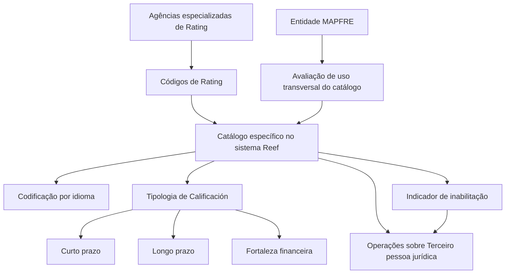

# Catálogo de Códigos de Calificación (Rating) para Entidades Reaseguradoras no Sistema Reef

## 1. Metadados do Documento
- **Arquivo de Origem:** `Não identificado no conteúdo extraído`
- **Tipo de Documento:** `Especificação Técnica / Documentação Funcional`
- **Domínio / Sistema:** `Reef / MAPFRE — Atividades de Terceiros`
- **Público-Alvo:** `Negócio, analistas funcionais, operação e equipes responsáveis pelo cadastro de terceiros jurídicos`
- **Data/Versão Identificada:** `Não identificada`
- **Owner identificado:** `user:agonzalez_mapfre.com`
- **Lifecycle identificado:** `Approved Source`

---

## 2. Resumo Executivo & Contexto de Negócio

O documento descreve a funcionalidade de definição, identificação e codificação de Códigos de Calificación, também denominados Ratings, no núcleo do sistema Reef. Um Rating representa a qualificação de solvência de uma empresa ou país para cumprir obrigações financeiras e é atribuído por agências especializadas, como Moody's, Fitch e Standard & Poor's.

A funcionalidade é voltada às companhias reaseguradoras configuradas no sistema. O Reef disponibiliza às entidades um catálogo específico de Códigos de Rating inicialmente vazio, permitindo que cada entidade defina os códigos necessários à sua operação.

Cada código pode ser registrado por idioma, incluindo Espanhol e Inglês, e deve possuir uma denominação ou texto descritivo individual. O documento exemplifica códigos como `001`, `002` e `AAa`, associados a descrições de grau de investimento ou especulativo.

Além da codificação e descrição, o catálogo inclui propriedades operacionais para classificar a tipologia do Rating e indicar se o código está inabilitado para operações de captura e/ou modificação de um terceiro pessoa jurídica. A classificação pode distinguir Ratings de curto prazo, longo prazo e fortaleza financeira.

O documento não estabelece uma padronização obrigatória para a codificação local dos Ratings. Contudo, recomenda que a entidade MAPFRE avalie a conveniência de utilizar transversalmente o catálogo nos processos corporativos, agrupando os códigos conforme a tipologia de classificação utilizada.

---

## 3. Arquitetura, Componentes & Tecnologias Envolvidas

### Componentes e conceitos identificados

| Componente / Conceito | Função descrita |
| :--- | :--- |
| **Reef** | Sistema cujo núcleo permite identificar e codificar Códigos de Rating das companhias reaseguradoras. |
| **Catálogo de Códigos de Rating** | Catálogo específico disponibilizado inicialmente vazio para registro dos códigos próprios das entidades reaseguradoras. |
| **Entidade MAPFRE** | Entidade que deve analisar a conveniência de explorar transversalmente o catálogo nos processos da companhia. |
| **Terceiro pessoa jurídica** | Entidade para a qual um Código de Rating pode ser empregado nas operações de captura e/ou modificação, desde que não esteja inabilitado. |
| **Agências de Rating** | Agências especializadas que atribuem Ratings; o documento cita Moody's, Fitch, Standard & Poor's e dados de AM BEST. |
| **Classificação / Tipologia de Calificación** | Propriedade que define o uso e o âmbito de operação de um Código de Rating. |
| **Idioma** | Dimensão utilizada para codificar os Ratings com denominações ou textos descritivos por idioma. |



**Nota de Análise:** O conteúdo não detalha interfaces, métodos HTTP, contratos JSON, banco de dados, integrações técnicas, URLs, ambientes, portas, mecanismos de autenticação ou tecnologias de implementação do sistema Reef.

---

## 4. Regras de Negócio, Especificações Funcionais & Processos

### 4.1 Conceito de Rating

1. O Rating é uma qualificação de solvência de uma empresa ou país.
2. A qualificação avalia a capacidade de fazer frente às obrigações financeiras.
3. A nota é atribuída por uma agência especializada de calificação.
4. O documento cita Moody's, Fitch e Standard & Poor's como exemplos de agências de calificação.

### 4.2 Gestão do catálogo de Códigos de Rating

1. O núcleo do sistema possui a capacidade de identificar e codificar Códigos de Rating próprios das companhias reaseguradoras.
2. Os Códigos de Rating devem ser mantidos em um catálogo específico de informação.
3. O catálogo é entregue às entidades inicialmente vazio de conteúdo.
4. O documento não define uma codificação obrigatória ou padronizada para todas as entidades.

### 4.3 Codificação por idioma

1. O sistema permite codificar Códigos de Rating por idioma.
2. O documento cita Espanhol e Inglês como exemplos de idiomas suportados no contexto funcional.
3. Cada Código de Rating deve ser identificado individualmente por uma denominação ou texto descritivo.
4. Os exemplos apresentados associam um código a uma descrição de classificação financeira.

### 4.4 Tipologia de Calificación

1. A propriedade **Tipología de Calificación** informa ao sistema a classificação do Código de Rating.
2. A classificação distingue o uso e o âmbito de operação do Código de Rating.
3. Para Ratings referentes à fortaleza financeira, a classificação sintetiza a posição financeira de uma entidade.
4. A avaliação de fortaleza financeira agrega indicadores financeiros de cinco categorias de desempenho:
   - Suficiência de capital.
   - Qualidade de ativos.
   - Eficiência operativa.
   - Rentabilidade.
   - Liquidez.
5. A classificação de fortaleza financeira também alude à capacidade de obter benefícios e distribuí-los aos acionistas.
6. O documento apresenta a AM BEST como referência para um exemplo real de classificações, porém o conteúdo extraído não contém os dados desse exemplo.

### 4.5 Inabilitação de Código de Rating

1. A propriedade **Inhabilitación** indica se um Código de Rating está inabilitado.
2. Um Código de Rating inabilitado não pode ser empregado nas operações de captura e/ou modificação do terceiro pessoa jurídica.

### 4.6 Recomendação para uso corporativo

1. Não existe preferência ou recomendação obrigatória para estabelecer ou padronizar a codificação dos Códigos de Rating no sistema.
2. A entidade MAPFRE deve avaliar a conveniência de utilizar o catálogo de informação de forma transversal nos processos da companhia.
3. O objetivo da utilização transversal é permitir a correta exploração posterior do catálogo.
4. O documento sugere o seguinte agrupamento dos códigos das diferentes agências de Rating:
   1. Códigos de calificação de curto prazo.
   2. Códigos de calificação de longo prazo.
   3. Códigos correspondentes à fortaleza financeira.

---

## 5. Tabelas de Parâmetros, Ambientes e Estruturas de Dados

| Item / Parâmetro | Descrição / Função | Tipo / Valores / Formato | Ambiente / Observações |
| :--- | :--- | :--- | :--- |
| Código de Rating | Identificador codificado de uma qualificação de solvência. | Exemplos: `001`, `002`, `AAa`. | Mantido no catálogo específico de Códigos de Rating. |
| Descrição / Denominação | Texto descritivo que identifica individualmente um Código de Rating. | Exemplos: `Grado Inversión Baa2`, `Grado Inversión Baa3`, `Grado Especulativo Ba1`. | Codificação realizada por idioma. |
| Idioma | Dimensão de cadastro das denominações e descrições dos Códigos de Rating. | Exemplos citados: Espanhol, Inglês. | O documento não apresenta catálogo completo de idiomas. |
| Tipología de Calificación | Classificação que distingue o uso e o âmbito operacional de um Código de Rating. | Curto prazo, longo prazo, fortaleza financeira. | Não são apresentados valores técnicos, códigos ou regras de validação adicionais. |
| Fortaleza financeira | Classificação que sintetiza a posição financeira de uma entidade. | Avaliação de cinco categorias de desempenho. | O documento menciona AM BEST como exemplo de classificações. |
| Suficiência de capital | Categoria de desempenho usada na avaliação da fortaleza financeira. | Não detalhado. | Parte das cinco categorias mencionadas. |
| Qualidade de ativos | Categoria de desempenho usada na avaliação da fortaleza financeira. | Não detalhado. | Parte das cinco categorias mencionadas. |
| Eficiência operativa | Categoria de desempenho usada na avaliação da fortaleza financeira. | Não detalhado. | Parte das cinco categorias mencionadas. |
| Rentabilidade | Categoria de desempenho usada na avaliação da fortaleza financeira. | Não detalhado. | Parte das cinco categorias mencionadas. |
| Liquidez | Categoria de desempenho usada na avaliação da fortaleza financeira. | Não detalhado. | Parte das cinco categorias mencionadas. |
| Inhabilitación | Indica se o Código de Rating está impedido de uso. | Estado de habilitado ou inabilitado; valores exatos não informados. | Afeta captura e/ou modificação do terceiro pessoa jurídica. |
| Terceiro pessoa jurídica | Entidade em cujas operações de captura ou modificação um Código de Rating pode ser utilizado. | Não detalhado. | O uso é impedido quando o Código de Rating está inabilitado. |
| Catálogo de Códigos de Rating | Catálogo específico para códigos próprios das companhias reaseguradoras. | Inicialmente vazio. | Deve ser configurado pela entidade conforme necessidade operacional. |
| Agências de Rating | Organizações especializadas que atribuem a nota de solvência. | Moody's, Fitch, Standard & Poor's; AM BEST é citada em exemplo de classificações. | O documento não define integrações com essas agências. |
| Owner | Proprietário identificado na página de documentação. | `user:agonzalez_mapfre.com` | Conforme metadado visível no conteúdo extraído. |
| Lifecycle | Estado do conteúdo na plataforma de documentação. | `Approved Source` | Conforme metadado visível no conteúdo extraído. |

---

## 6. Bateria de Perguntas & Respostas para RAG (FAQ Sintético)

### P1: O que é um Código de Calificación ou Rating no contexto do sistema Reef?
**R:** Um Código de Calificación ou Rating representa a qualificação de solvência de uma empresa ou país para cumprir as suas obrigações financeiras. No Reef, esses códigos são identificados e codificados em um catálogo específico para as companhias reaseguradoras configuradas no sistema.

### P2: Quem atribui a qualificação de solvência associada a um Rating?
**R:** A qualificação de solvência é atribuída por uma agência especializada de calificação. O documento cita Moody's, Fitch e Standard & Poor's como exemplos de agências de calificação.

### P3: O catálogo de Códigos de Rating já vem preenchido no Reef?
**R:** Não. O documento informa que o catálogo específico de Códigos de Rating é entregue às entidades inicialmente vazio de conteúdo, permitindo que cada entidade cadastre os códigos adequados às suas necessidades.

### P4: É possível cadastrar descrições de Códigos de Rating em mais de um idioma?
**R:** Sim. O sistema permite codificar os Códigos de Rating por idioma, sendo Espanhol e Inglês os exemplos mencionados. Cada código deve ser identificado individualmente por uma denominação ou texto descritivo.

### P5: Quais exemplos de Códigos de Rating e descrições são apresentados?
**R:** O documento apresenta, como exemplos, o código `001` associado a `Grado Inversión Baa2`, o código `002` associado a `Grado Inversión Baa3` e o código `AAa` associado a `Grado Especulativo Ba1`.

### P6: Para que serve a propriedade Tipología de Calificación?
**R:** A propriedade Tipología de Calificación informa a classificação do Código de Rating, distinguindo o seu uso e o seu âmbito de operação dentro do sistema. O documento sugere classificações relacionadas a curto prazo, longo prazo e fortaleza financeira.

### P7: Como o documento caracteriza a classificação de fortaleza financeira?
**R:** A classificação de fortaleza financeira sintetiza a posição financeira de uma entidade por meio da avaliação e agregação de indicadores de suficiência de capital, qualidade de ativos, eficiência operativa, rentabilidade e liquidez. A classificação também se relaciona com a capacidade de obter benefícios e distribuí-los entre os acionistas.

### P8: O que acontece se um Código de Rating estiver inabilitado?
**R:** Um Código de Rating inabilitado não pode ser utilizado nas operações de captura e/ou modificação do terceiro pessoa jurídica.

### P9: Existe uma regra obrigatória para padronizar a codificação de Ratings na MAPFRE?
**R:** Não. O documento afirma que não existe preferência nem recomendação para estabelecer ou padronizar a codificação dos Códigos de Rating no sistema. A entidade MAPFRE deve analisar a conveniência de usar o catálogo transversalmente nos processos corporativos.

### P10: Como o documento recomenda organizar códigos de diferentes agências de Rating?
**R:** O documento sugere agrupar e codificar os códigos das diferentes agências conforme a tipologia da classificação: primeiro os códigos de calificação de curto prazo, depois os de longo prazo e, por último, os correspondentes à fortaleza financeira.

### P11: O documento especifica métodos HTTP, APIs ou contratos JSON para o catálogo de Ratings?
**R:** Não. O conteúdo extraído descreve regras funcionais e propriedades do catálogo de Códigos de Rating, mas não detalha métodos HTTP, APIs, contratos JSON, integrações, modelos de dados técnicos ou endpoints.

### P12: Há dados detalhados das classificações da AM BEST no documento?
**R:** Não no conteúdo extraído. O documento menciona que existe um exemplo real de classificações com dados da AM BEST, mas os valores ou a estrutura desse exemplo não foram apresentados na transcrição disponível.

---

## 7. Glossário de Termos, Siglas & Conceitos-Chave

- **AM BEST:** Organização citada pelo documento como fonte de um exemplo real de classificações de Rating. O conteúdo não expande a sigla nem apresenta dados desse exemplo.
- **Catálogo de Códigos de Rating:** Repositório específico no Reef destinado à identificação e codificação de Ratings próprios das companhias reaseguradoras.
- **Código de Rating:** Código que representa uma qualificação de solvência e que possui denominação ou descrição associada.
- **Fortaleza Financeira:** Classificação relacionada à posição financeira de uma entidade, avaliada por suficiência de capital, qualidade de ativos, eficiência operativa, rentabilidade e liquidez.
- **Inhabilitación:** Propriedade que informa se um Código de Rating está impedido de ser usado em operações de captura e/ou modificação do terceiro pessoa jurídica.
- **MAPFRE:** Entidade mencionada como responsável por analisar a conveniência do uso transversal do catálogo de Códigos de Rating em seus processos.
- **Rating / Calificación:** Qualificação de solvência de uma empresa ou país para cumprir obrigações financeiras.
- **Reef:** Sistema cujo núcleo permite identificar e codificar Códigos de Rating para companhias reaseguradoras.
- **Terceiro pessoa jurídica:** Entidade sobre a qual são realizadas operações de captura e/ou modificação que podem utilizar Códigos de Rating habilitados.
- **Tipología de Calificación:** Propriedade que classifica um Código de Rating conforme seu uso e âmbito de operação.

---

## 8. Notas Críticas, Riscos & Limitações

- O catálogo de Códigos de Rating é entregue inicialmente vazio; a qualidade, consistência e completude do cadastro dependem da configuração realizada por cada entidade.
- Não existe recomendação ou padronização obrigatória para a codificação dos Ratings. Essa flexibilidade pode levar a codificações heterogêneas entre entidades ou processos se não houver governança local.
- O documento recomenda que a entidade MAPFRE avalie o uso transversal do catálogo, mas não define uma política corporativa mandatória para essa utilização.
- O conteúdo menciona um exemplo com dados da AM BEST, porém os dados do exemplo não estão presentes na extração disponível.
- Não são detalhados critérios de validação, valores permitidos, fluxos de aprovação, permissões de usuário, responsáveis pela manutenção ou regras de auditoria do catálogo.
- Não são descritos métodos HTTP, APIs, contratos JSON, banco de dados, integrações com agências de Rating, ambientes técnicos, URLs, servidores, logs ou mecanismos de autenticação.
- **Nota de Análise:** O documento lista referências a “Actividades de Terceros” e “Códigos de Calificación (Rating) Terceros Jurídicos”, mas não disponibiliza o conteúdo desses documentos vinculados.

---

## 9. Conteúdo Bruto Estruturado (Referência Fiel)

```text
--- [PÁGINA 1 DE 3] ---

DEFINIR Códigos de Calicación (Rating)
Contexto
¿Qué son los Códigos de Calicación o (Ratings)?
El Rating es la calicación de solvencia de una Empresa o País para hacer frente a sus obligaciones nancieras. Esta nota se la otorga una
agencia especializada (Moody's, Fitch, Standard & Poor's,... ) que se conoce como agencia de Calicación.
Propiedades Generales
Propiedades Operativas
Propiedades Generales
Funcionalmente, el núcleo del Sistema cuenta con la posibilidad de identicar y codicar los Códigos de Rating propios de las Compañías
Reaseguradoras en un catálogo de información especíco que se entrega a las entidades inicialmente vacío de contenido.
Idioma
El sistema permite por idioma (Español, Inglés,...) codicar estos códigos identicando individualmente cada una de ellos mediante una
denominación o texto descriptivo, e.g:
CÓDIGO DE RATING. DESCRIPCIÓN
001 Grado Inversión Baa2
002 Grado Inversión Baa3
AAa Grado Especulativo Ba1
... ...
Propiedades Operativas
Tipología de Calicación
Esta propiedad le indica al Sistema la Clasicación del código de Rating que distingue su uso y ámbito de operación.
Por ejemplo y si nos referimos a la fortaleza nanciera, esta clasicación sintetiza la posición nanciera de una entidad mediante la
evaluación y agregación de indicadores nancieros de cinco categorías de desempeño (suciencia de capital, calidad de activos, eciencia
Documentation / DOCUMENTACIÓN Reef
DOCUMENTACIÓN Reef
Mapfredocument
DOCUMENTACIÓN Reef
Owner
user:agonzalez_mapfre.com
Lifecycle
Approved Source
 / 
 VL
Buscar Inicio Soluciones Arquitecturas APIs Componentes Cloud Documentación Zeus Reef Ayuda
ES

--- [PÁGINA 2 DE 3] ---

operativa, rentabilidad y liquidez) y alude a la capacidad de obtener benecios y de repartirlos entre sus accionistas.
Un ejemplo Real de las Clasicaciones con datos de AM BEST:
Inhabilitación
Esta propiedad le indica al Sistema si el Código de Rating está inhabilitado para poder ser empleado en las operaciones de captura y/o
modicación del Tercero persona Jurídica.
Vínculos
Relación de Directrices y Documentos funcionales cuya lectura recomendada para evitar que la interpretación aislada del presente
documento pueda conducir a error.
Actividades de Terceros
Códigos de Calicación (Rating) Terceros Jurídicos
Preguntas frecuentes
(1) ¿Existe alguna recomendación operativa que deba ser tomada en consideración localmente en la codicación, uso y denición del
catálogo de Códigos de Rating para las Entidades Reaseguradoras conguradas en el Sistema?
No existe una preferencia ni recomendación para establecer o estandarizar en el sistema su codicación si bien la entidad MAPFRE debe
analizar la conveniencia de utilizar transversalmente en los procesos de la compañía este catálogo de información para su correcta y
posterior explotación, e.g:

--- [PÁGINA 3 DE 3] ---

Agrupando y codicando los códigos de las diferentes Agencias de Rating que se van a usar en los procesos de la entidad de acuerdo
con la tipología de su clasicación: Primero los Códigos que pertenezcan a la calicación a corto plazo, luego los del largo plazo y por
último los correspondientes a la Fortaleza Financiera.
```
