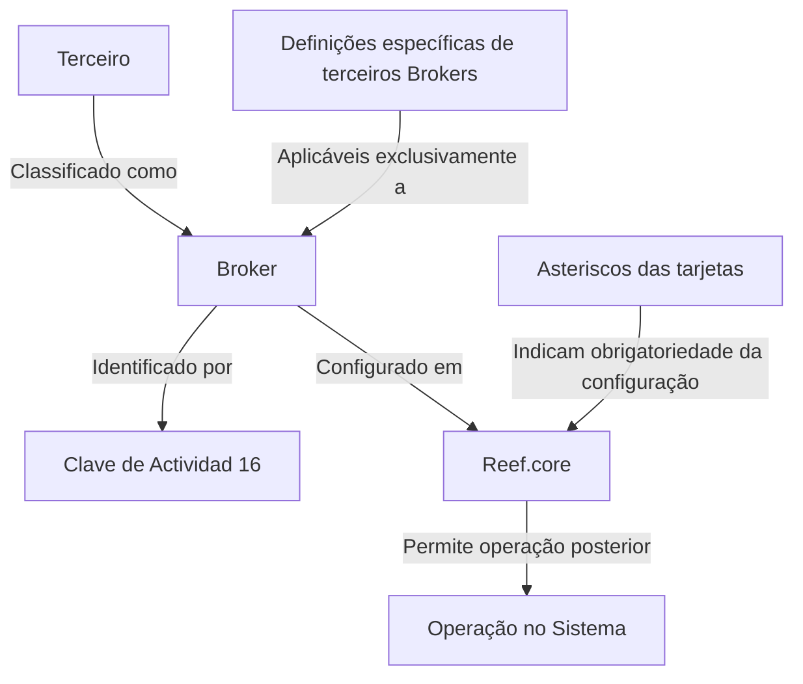
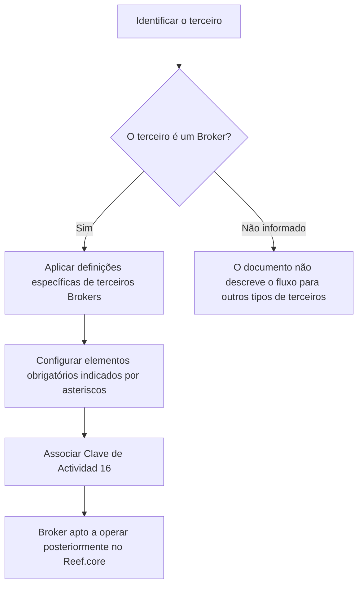

# Definição de Brokers no Reef.core

## 1. Metadados do Documento
- **Arquivo de Origem:** `Não identificado no conteúdo fornecido`
- **Tipo de Documento:** `Manual Operacional`
- **Domínio / Sistema:** `Reef.core / Reef`
- **Público-Alvo:** `Operação, Negócio e usuários responsáveis pela configuração de Brokers`
- **Data/Versão Identificada:** `Não identificada`

---

## 2. Resumo Executivo & Contexto de Negócio

O documento descreve a definição e a configuração de **Brokers** no sistema **Reef.core**. A finalidade declarada é relacionar os elementos necessários para configurar Brokers, permitindo que essas entidades operem posteriormente no sistema.

No contexto apresentado, um Broker é definido como um agente intermediário em operações financeiras ou comerciais que recebe comissão por sua intervenção. O documento associa a atuação do Broker a operações financeiras ou comerciais, sem detalhar tipos de produtos, fluxos transacionais, contratos ou regras de comissão.

O sistema identifica os Brokers por meio da **Clave de Actividad 16**. Também informa que os asteriscos exibidos nas tarjetas indicam se a configuração de determinado elemento é obrigatória em relação à definição de Brokers.

O conteúdo distingue definições gerais de definições específicas para terceiros classificados como Brokers. As definições específicas são empregadas exclusivamente quando o terceiro é um Broker.

---

## 3. Arquitetura, Componentes & Tecnologias Envolvidas

| Componente / Termo | Papel identificado |
| :--- | :--- |
| Reef.core | Sistema no qual Brokers são configurados e posteriormente operam. |
| Reef | Nome presente na documentação e no menu de navegação. |
| Broker | Agente intermediário em operações financeiras ou comerciais que percebe comissão pela intervenção. |
| Tercero / Terceiro | Entidade que pode ser classificada como Broker. |
| Clave de Actividad 16 | Chave utilizada pelo sistema para identificar Brokers. |
| Tarjetas | Elementos de interface cuja marcação por asterisco indica obrigatoriedade de configuração. |
| Mapfredocument | Termo exibido no conteúdo bruto, sem detalhamento de função. |
| Zeus | Termo exibido no menu de navegação, sem detalhamento de relação com Brokers. |



> **Nota de Análise:** O documento não detalha interfaces, serviços, métodos HTTP, contratos de dados, bancos de dados, ambientes, URLs operacionais ou tecnologias de implementação do Reef.core.

---

## 4. Regras de Negócio, Especificações Funcionais & Processos

1. A configuração de Brokers no Reef.core requer elementos relacionados no documento.
2. Após a configuração, os Brokers podem operar no sistema.
3. Um Broker é um agente intermediário em operações financeiras ou comerciais.
4. A remuneração do Broker é caracterizada como uma comissão pela intervenção.
5. O sistema identifica Brokers usando a **Clave de Actividad 16**.
6. A presença de asteriscos nas tarjetas indica se a configuração de um elemento é obrigatória para a definição de Brokers.
7. Existem definições específicas próprias de terceiros Brokers.
8. As definições específicas presentes no grupo indicado devem ser utilizadas exclusivamente quando o terceiro for um Broker.

### Fluxo funcional identificado



> **Nota de Análise:** O documento não apresenta o procedimento detalhado de cadastro, telas, campos, validações de formato, tratamento de erro ou critérios para determinar se um terceiro deve ser classificado como Broker.

---

## 5. Tabelas de Parâmetros, Ambientes e Estruturas de Dados

| Item / Parâmetro | Descrição / Função | Tipo / Valores / Formato | Ambiente / Observações |
| :--- | :--- | :--- | :--- |
| Broker | Agente intermediário em operações financeiras ou comerciais que percebe comissão pela intervenção. | Entidade de negócio | Configurável no Reef.core. |
| Clave de Actividad | Identifica Brokers no sistema. | Valor identificado: `16` | Não há descrição de formato, campo ou mecanismo de validação. |
| Asteriscos das Tarjetas | Indicam se a configuração de um elemento é obrigatória para a definição de Brokers. | Indicador visual de obrigatoriedade | Não são identificadas as tarjetas ou os elementos específicos. |
| Definições específicas | Conjunto de definições próprias de terceiros Brokers. | Grupo de configurações | Aplicável exclusivamente quando o terceiro é Broker. |
| Reef.core | Sistema em que Brokers são configurados para operação posterior. | Sistema | Não há ambientes, URLs ou versões informados. |
| Owner | Informação apresentada no conteúdo bruto. | `user:agonzalez_mapfre.com` | A função ou responsabilidade do owner não é detalhada. |
| Lifecycle | Informação apresentada no conteúdo bruto. | `Approved Source` | Não há explicação adicional sobre o ciclo de vida. |
| Idioma | Idioma exibido no menu. | `ES` | O conteúdo fornecido está predominantemente em espanhol. |

---

## 6. Bateria de Perguntas & Respostas para RAG (FAQ Sintético)

### P1: Qual é o objetivo da definição de Brokers no Reef.core?
**R:** O objetivo é relacionar os elementos que permitem configurar Brokers no Reef.core, para que esses Brokers possam operar posteriormente no sistema.

### P2: Como o documento define um Broker?
**R:** O documento define Broker como um agente intermediário em operações financeiras ou comerciais que percebe uma comissão por sua intervenção.

### P3: Como o Reef.core identifica um Broker?
**R:** O sistema identifica Brokers por meio da **Clave de Actividad 16**.

### P4: O que significam os asteriscos nas tarjetas relacionadas a Brokers?
**R:** Os asteriscos indicam se a configuração de um elemento é obrigatória em relação à definição dos Brokers.

### P5: Quando devem ser utilizadas as definições específicas de terceiros Brokers?
**R:** As definições específicas devem ser utilizadas exclusivamente quando o terceiro for um Broker.

### P6: O documento descreve quais campos devem ser preenchidos para cadastrar um Broker?
**R:** Não. O conteúdo fornecido afirma que existem elementos para configurar Brokers, mas não lista os campos, formatos, valores permitidos ou telas de cadastro.

### P7: O documento informa quais operações financeiras ou comerciais um Broker pode intermediar?
**R:** Não. O documento apenas afirma que o Broker atua como intermediário em operações financeiras ou comerciais, sem especificar produtos, processos ou transações.

### P8: O documento detalha como é calculada a comissão de um Broker?
**R:** Não. O documento menciona que o Broker percebe uma comissão por sua intervenção, mas não apresenta fórmulas, percentuais, regras de cálculo ou condições de pagamento.

### P9: Existem integrações, APIs ou microsserviços descritos para Brokers?
**R:** Não. O conteúdo fornecido não descreve integrações, APIs, microsserviços, métodos HTTP, contratos JSON ou endpoints relacionados a Brokers.

### P10: Há informações sobre ambientes, URLs ou versões do Reef.core?
**R:** Não. O conteúdo não apresenta ambientes, URLs, portas, versões ou parâmetros técnicos de infraestrutura.

---

## 7. Glossário de Termos, Siglas & Conceitos-Chave

- **Broker:** Agente intermediário em operações financeiras ou comerciais que recebe comissão pela intervenção.
- **Reef.core:** Sistema no qual os Brokers são configurados para operação posterior.
- **Clave de Actividad:** Chave de atividade utilizada pelo sistema para identificar Brokers; o valor informado é `16`.
- **Tarjetas:** Elementos nos quais a presença de asteriscos indica obrigatoriedade de configuração relacionada à definição de Brokers.
- **Tercero / Terceiro:** Entidade para a qual podem existir definições específicas quando classificada como Broker.
- **Definições específicas:** Definições próprias de terceiros Brokers, aplicáveis exclusivamente quando o terceiro é um Broker.
- **Lifecycle:** Campo exibido com o valor `Approved Source`; seu significado operacional não é detalhado.
- **Owner:** Campo exibido com o valor `user:agonzalez_mapfre.com`; sua responsabilidade não é detalhada.

---

## 8. Notas Críticas, Riscos & Limitações

- O conteúdo fornecido não identifica o arquivo de origem, a versão, a data ou o autor do documento.
- O documento não detalha os elementos concretos necessários para configurar um Broker.
- Não são apresentados campos de cadastro, regras de validação, formatos, dependências, telas ou procedimentos operacionais.
- Não há detalhamento de cálculo, alçada, vigência ou pagamento da comissão do Broker.
- Não são descritos APIs, integrações, serviços, persistência de dados, logs, segurança, perfis de acesso ou auditoria.
- O conteúdo menciona a **Clave de Actividad 16**, mas não define como essa chave é atribuída, validada ou mantida.
- O texto extraído contém caracteres corrompidos em palavras como “configurar”, “financieras”, “identifica” e “definición”; a interpretação foi preservada conforme o contexto legível, sem inclusão de fatos adicionais.

---

## 9. Conteúdo Bruto Estruturado (Referência Fiel)

```text
--- [PÁGINA 1 DE 1] ---

DEFINICIÓN de los BROKERS
Se relacionan los elementos que permiten congurar en Reef.core a los Brokers para poder operar posteriormente con ellos en el Sistema.
Agente intermediario en operaciones nancieras o comerciales que percibe una comisión por su intervención.
El Sistema identica a los Brokers con la Clave de Actividad... 16.
Los Asteriscos de las Tarjetas indican si la conguración del elemento es obligatoria en relación con la denición de los Brokers.
Deniciones ESPECÍFICAS, propias de los Terceros BROKERS
En este Grupo se encuentran deniciones que se emplean exclusivamente cuando el Tercero es un BROKER.
Denición de Broker
Documentation / DOCUMENTACIÓN Reef
DOCUMENTACIÓN Reef
Mapfredocument
DOCUMENTACIÓN Reef
Owner
user:agonzalez_mapfre.com
Lifecycle
Approved Source
 / 
 VL
Buscar Inicio Soluciones Arquitecturas APIs Componentes Cloud Documentación Zeus Reef Ayuda
ES
```
